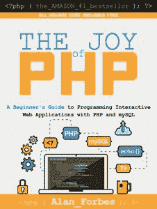
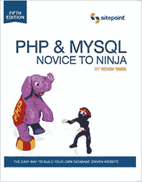
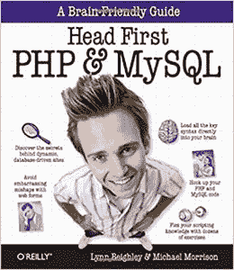
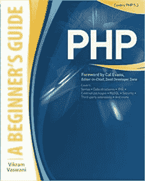
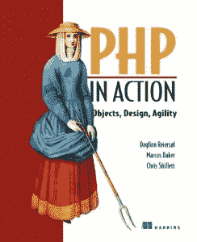
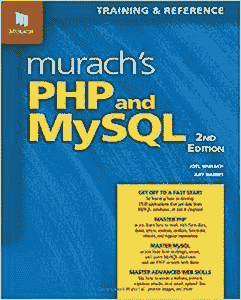
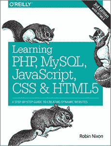
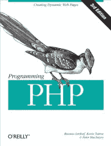
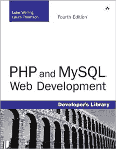
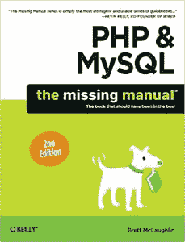

# 初学者和高级程序员的 10 本最佳 PHP 书籍

> 原文：<https://hackr.io/blog/best-php-books-for-beginners-and-advanced-programmers>

PHP 将在 2023 年像 2022 年及之前的几年一样摇滚起来。如果你不知道的话，PHP 是目前场景中获得工作 的 [最佳编程语言之一。](https://hackr.io/blog/which-programming-language-is-best-for-getting-a-job)

然而，在编程的世界里，拥有高超的编程技术是远远不够的。你需要不断进步，学习新的东西来完善你的手艺。正是因为这个原因，我们挑选了 2023 年每个 PHP web 开发人员必读的 10 本 PHP 书籍:

## 初学者和高级程序员的最佳 PHP 书籍

**作者****–**艾伦福布斯
**最新版****–**第五版
**出版商****–**普拉姆岛

**Publishing LLC** **如同 PHP 编程的乐趣:**一本入门指南从基础的 HTML 开始，新手可以轻松上手。这本书然后逐步升级到解释 PHP 如何工作。它把一个 PHP 新手变成了一个专业的动态网站开发者。

读者从简单的东西开始，比如如何创建和运行基本的 PHP 脚本，然后转向修改网页的概念。在后期阶段，读者可以通过一系列有凝聚力和有趣的练习来检验所学的一切。

《PHP 编程的乐趣》涵盖的重要主题包括安装和配置 PHP、基本 PHP 语法、控制结构以及 PHP 和 MySQL 的结合使用。PHP 手册还涵盖了表单创建、图像处理、PHP 技巧和安全性考虑。

你可以在这里买到这本书。

**作者****–**汤姆·巴特勒&凯文·杨克
**最新版****–**第六版
**出版商****–**网站点

在其 450 多页的内容中，PHP & MySQL 新手到忍者向 PHP 和 MySQL 传授基本知识。它以一种相当易读的方式做到了这一点。显然，内容很棒，因为如果不是这样，这本书就不应该上榜。

虽然主要是一本关于 PHP 的书，但在 PHP & MySQL 新手到忍者的书中，对 MySQL 的分析程度更高。然而，这并不意味着 PHP 不完整。

PHP & MySQL 新手到忍者写得很好，引人入胜，并且非常令人满意地涵盖了 PHP 和 MySQL 的基础知识。因此，它为新手弥补了一本优秀的 PHP 书籍。

结构化的 PHP 编程、在 web 上发布 MySQL 数据、内容格式化和内容管理系统都包含在 PHP & MySQL 新手到忍者中。此外，它还涉及关系数据库设计、高级 SQL 查询和访问控制。

你可以在这里买到这本书。

**作者****–**林恩·贝弗利&迈克尔·莫里森
**最新版****–**初版
**出版商****–**奥莱利

如果你已经知道 Head First 系列书籍，那么你会立刻意识到 Head First PHP & MySQL 是最重要的 PHP 初学者指南之一。这本 812 页长的书旨在成为学习构建动态和数据库驱动网站的终极指南。

在整个 Head First PHP & MySQL 中，读者通过引人入胜的真实世界的例子来学习如何利用流行的服务器端编程语言和它心爱的对手 RDBMS(即 MySQL)的强大功能。

Head First 系列视觉上丰富的格式公式同样适用于 Head First PHP & MySQL 以及该系列中的其他书籍。除了高质量的内容之外，这本书还充满了挑战智力的练习和测验。

Head First PHP & MySQL 解释了 MySQL 数据库表的创建，将 HTML 页面转换为动态网站，动态创建图像，利用 cookies 和会话获取访问者信息，并使用这些信息为用户个性化网站。

本书不仅涵盖了 PHP 和 MySQL 的基本概念，而且 Head First PHP & MySQL 还深入探讨了内容管理、数据库查询、文件 I/O 操作和表单验证等高级主题。

你可以在这里买到这本书。

**作者****–**维克拉姆·瓦斯瓦尼
**最新版****–**初版
**出版商****–**麦格劳-希尔教育

PHP:一本长达 478 页的入门指南，详细介绍了如何编写基本的 PHP 程序，然后使用高级功能对其进行增强，包括 MySQL 数据库集成、第三方扩展和 XML 输入。

《PHP:初学者指南》不仅允许新手开始 PHP 开发，还能帮助他们达到中级水平。这本书涵盖了软件安装、语法、数据结构、内置函数、流程控制例程和最佳实践。

《PHP:初学者指南》涵盖的其他重要主题包括处理错误、使用类、操作符和变量、使用数组、使用外部来源的数据以及保护和扩展 PHP。这本书对所有技能水平的 web 开发人员都有帮助。

你可以在这里买到这本书。

**推荐书籍**
[PHP 初学者-成为 PHP 高手- CMS 项目](https://click.linksynergy.com/deeplink?id=jU79Zysihs4&mid=39197&murl=https%3A%2F%2Fwww.udemy.com%2Fcourse%2Fphp-for-complete-beginners-includes-msql-object-oriented%2F)

[**](http://geni.us/oUFm)

**作者****–**达金·赖尔索尔、克里斯·希弗莱特、马库斯·贝克 **最新版****–**第一版
**出版商****–**曼宁出版公司

《PHP in Action》是 PHP 发展的主要书籍之一。自从 2007 年第一次发行以来，这本书已经帮助了成千上万希望从 PHP 中获益的 web 开发人员。

这本书在展示 PHP 技术和原理的应用以解决 web 编程中面临的一些最常见的挑战方面表现出色，包括输入验证、表单处理、对象持久性和 web 表示。

如果你对 Java 有很好的理解，那么这本书会让你受益匪浅。这是因为作者在谈论与 PHP 相关的概念时经常引用 Java。

为了让购买者感觉更好，PHP 的每一个印刷版本都有免费的 ePub、Kindle 和 PDF 版本。因此，即使离开了平装本，他们也可以继续浏览整本书。

你可以在这里买到这本书。

**作者****–**乔尔·穆拉希&雷·哈里斯
**最新版****–**第三版
**出版商****–**迈克·穆拉希&联合公司

由乔尔·穆拉希和雷·哈里斯撰写的《穆拉希的 PHP 和 MySQL》是另一本适合 PHP 学习和进步的书。由于其自定进度的方法，它也适合新人。这本 872 页的书是为任何希望使用 PHP 和 MySQL 建立和维护网站的人准备的。

一般来说，那些有一些 PHP 或编程经验的人将能够快速浏览穆拉希的 PHP 和 MySQL 所涵盖的主题。这本书从 PHP 和 MySQL 基础开始，然后在此基础上构建高级技能。

除了展示理解 PHP 编程所需的关键信息，穆拉希的《PHP 和 MySQL》让读者能够掌握 PHP 编程和 MySQL 部署。它还涵盖了适合构建动态网站的高级技能。

你可以在这里买到这本书。

**作者****–**罗宾
**最新版****–**第二版
**出版商****–**奥莱利

学习 PHP、MySQL、JavaScript 和 CSS 可以让读者了解如何构建交互式和数据驱动的网站。这本书是学习 web 开发的畅销书之一。这本书的第二版甚至更好，这要感谢在第一版上获得的读者评论。

为了确保读者记住大部分传授的知识，每章后面都有一节复习题。此外，本书还介绍了一个示例社交网络平台。

本书还介绍了如何创建引人注目的动态网页，如何从 JS 中操作 CSS 属性，以及如何上传和操作文件和图像。

你可以在这里买到这本书。

 **作者****–**凯文·塔罗、彼得·麦金太尔&拉斯马斯·勒德尔夫前言作者迈克尔·伯克
**最新版****–**第三版
**出版商****–**奥赖利

web 开发人员创建有效的 web 应用程序所需要知道的一切都在 PHP 编程手册中。除了语法和编程技术之外，这本书还充满了说明正确用法和常见习惯用法的例子。

PHP 编程从 PHP 程序的可能性概述开始，然后继续讨论 web 脚本语言的基础，包括数组、函数、对象和字符串。

除了详细介绍如何应用常见的 web 应用技术，这本书还涵盖了生成动态内容的概念。通过编程 PHP，人们还可以了解编程语言与关系数据库的交互。

在这本 550 多页的 PHP 编程书籍中，其他值得注意的主题包括错误处理、性能调优、安全脚本和其他高级主题。

你可以在这里买到这本书。

 **作者****–**劳拉·汤普森和卢克·韦林
**最新版****–**第五版
**出版商****–**艾迪森·卫斯理

《PHP 与 MySQL Web Development》共 1008 页，是关于 PHP 编程最详细的书籍之一。这本书提供了一个有效的理解生产互动和直观的网络应用程序。

PHP 和 MySQL Web Development 讲述 PHP 编程语言的基础知识以及如何建立 MySQL 数据库。这本书还演示了服务器端脚本语言和数据库之间的交互。

认证用户、动态生成 PDF 文档、发送和管理电子邮件是 PHP 的一些常见任务。PHP 和 MySQL Web 开发书用简单易懂的例子解释了这些。

高级 PHP 技术、安全性、错误和异常处理，以及在大型项目中使用 PHP 和 MySQL 是本书涵盖的一些主要主题。PHP 和 MySQL Web 开发涉及的其他主题包括使用数组、调试和重用代码。

你可以在这里买到这本书。

 **作者****–**布雷特·麦克劳林
**最新版****–**第二版
**出版商****–**奥莱利

对于那些已经在 PHP 工作的人来说，PHP & MySQL:缺少的手册才是真正的交易。这本 546 页的书帮助开发者更好地使用 PHP 和 MySQL 创建动态和数据库驱动的网站。

PHP & MySQL:缺失的手册教导读者如何管理内容、建立数据库以及与用户互动。这本书被誉为学习数据库管理系统内部工作的最佳 web 开发书籍之一。

PHP 有什么了不起的& MySQL:缺少的手册是它充满了每个主题的分步教程，可能是基础或高级概念。除了讲述 PHP 和 MySQL 的基础知识，还讲述了如何连接 PHP 和 MySQL。

PHP 覆盖的主要话题& MySQL:缺失手册包括认证&授权、二进制对象、图片加载、制作动态网页&web app。这本书也是关于处理图像和复杂性、列表、迭代和管理的很好的指南。

你可以在这里买到这本书。

## **其他重要的 PHP 书籍**

虽然前面提到的书籍足以满足 PHP 的学习和进步，但你们中的一些人可能会对额外的学习感兴趣。对于这样的读者，这里有一些其他合适的 PHP 书籍来满足你的阅读欲望:

*   **入门 Laravel:Sanjib Sinha 著《Laravel 5.3** 应用开发入门指南》
*   用 WordPress 构建网络应用:作为应用框架的 WordPress作者布莱恩·梅森勒纳和杰森·科尔曼前言作者布拉德·威廉姆斯
*   **Code Smart:Dayle Rees(免费 ) 的 Laravel Framework 第五版**
*   卡洛斯·布埃诺斯维诺斯、克里斯蒂安·索罗内拉斯和基万·阿克巴瑞( 免费 )
*   **学习 PHP:学习 PHP 编程的完全初学者指南** 作者 Bruce Berke
*   **一天学会 PHP！一次学习 PHP 基础知识的终极速成课** 由一位学者主讲
*   **学习 PHP 7** 作者 Antonio Lopez
*   **学习 PHP 7 高性能** 作者 Altaf Hussain
*   **现代 PHP:新特性和良好实践** 作者 Josh Lockhart
*   Phil Sturgeon 和 Josh Lockhart())
*   道格·比尔的 PHP 7 编程食谱
*   拉里·乌尔曼的《PHP 高级和面向对象编程:Visual QuickPro 指南
*   **PHP 和 MySQL 用于动态网站** 拉里·乌尔曼
*   由 Adam Trachtenberg 和 David Sklar 为 PHP 程序员编写的&示例
*   **PHP 对象、模式和实践** 作者马特·赞斯特拉
*   **PHP 面向对象解决方案** 作者大卫·鲍尔斯
*   **PHP 熊猫:人人用的 PHP 编程语言** 戴乐·里斯( 免费 )
*   **PHP 解决方案:让动态网页设计变得简单** 作者大卫·鲍尔斯
*   **生存困境:PHP 安全** 作者帕德莱茨·布雷迪( 免费 )
*   **实用 PHP 测试** 乔治·西罗尼( 免费 )
*   **PHP 参考:初级到中级** 作者马里奥卢瑞格( 免费 )
*   **PHP 7 从零开始:PH7 编程** 作者托马斯·皮克勒( 免费 )

对于每个 web 开发人员来说，这大约是 10 本 PHP 书籍。在使用 PHP 进行 web 开发时，选择正确的框架很重要。所以，这里有 [最好的 PHP 框架](https://hackr.io/blog/best-php-frameworks) 供你选择。

编程是一项需要经常改进的技能，以便在竞争激烈的 IT 行业中保持相关性。你需要经常自我评估你的 PHP 知识。如果你想知道你在 PHP 方面已经变得有多好，这里有 最常被问到的 [PHP 面试问题](https://hackr.io/blog/php-interview-questions) 供你浏览。

**人也在读:**