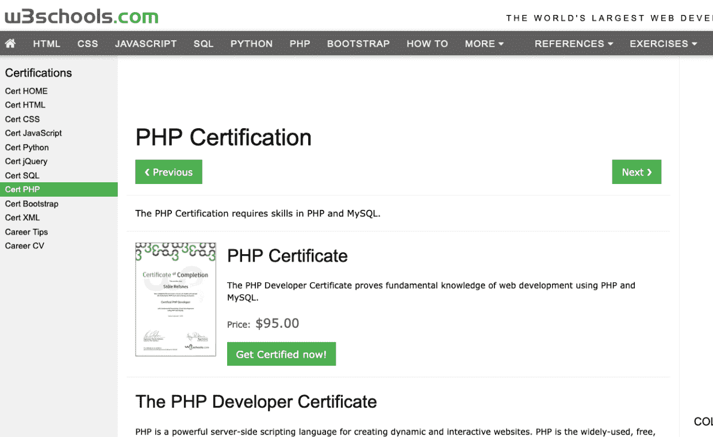
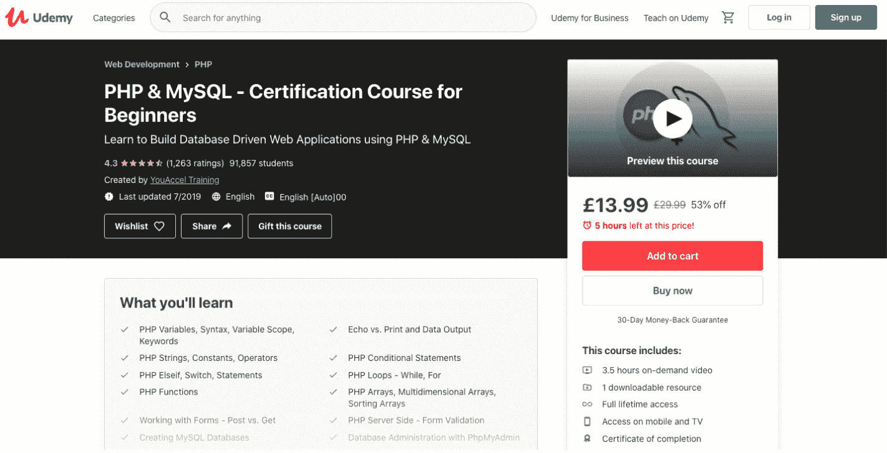
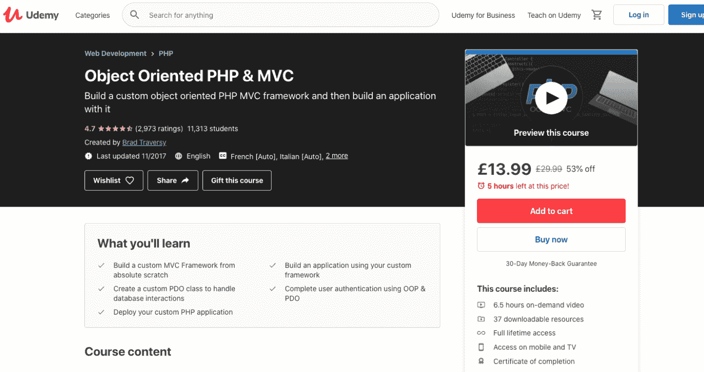
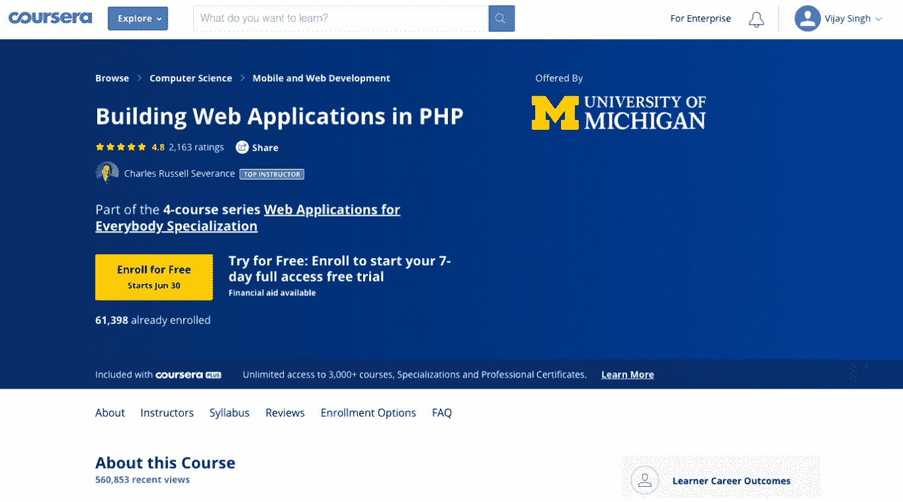
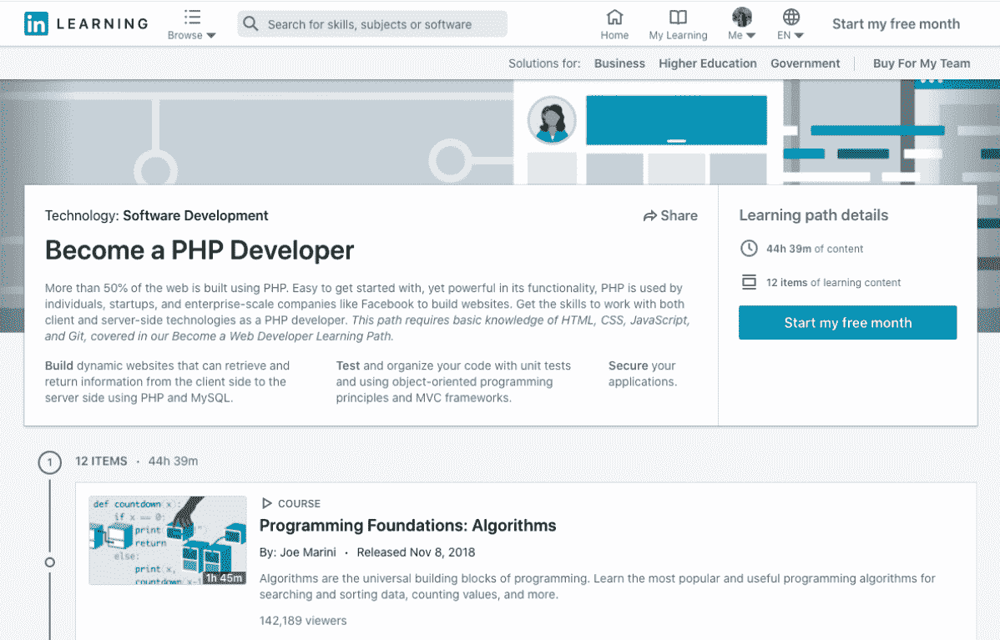

# 2023 年你需要学习的 5 个最佳 PHP 认证[更新]

> 原文：<https://hackr.io/blog/best-php-certification>

我们的头脑中总是有一个争论——我应该去参加专业认证，还是实践经验(比如一个项目或更多)足以证明我对某个主题的了解？

虽然许多人认为 PHP 最好通过经验和项目来学习，但当你寻求加薪或申请新工作时，证书肯定会让你比其他人更有优势。这对雇主来说是一种保证，你已经掌握了一定程度的语言，可以从事更具挑战性的项目。这也是对你自己的一种激励，因为认证需要大量的研究和学习。

网上有许多专业认证和课程，在这篇文章中，我们将讨论最受欢迎和最可靠的。你也可以做一些免费的课程和教程(我们将在本文后面分享链接)，然后做这些认证，以便更好地理解和更快地完成课程。

## 最佳 PHP 认证和课程

[****](https://www.zend.com/training/php-certification-exam)

Zend 认证是全球公认的，是 PHP 职位排名和选择候选人的好方法。该考试面向中级(有经验的)PHP 程序员。Zend 还开设各种级别的课程，帮助考生准备考试。课程分为三个级别，由 PHP 顾问委员会准备和监督。如果你已经有了一些经验，你也可以自学——练习字符串，数组，文件 I/O， [OOP 概念](https://hackr.io/blog/oops-concepts-in-java-with-examples)，通过引用传递等等。详细地说。从他们的官方网站购买 19.95 美元的 [Zend 官方指南](https://www.zend.com/training/php-certification-study-guide)电子书是很好的，它可以帮助你判断你是否准备好考试或者需要更多时间准备。

#### 考试详情

| 考试模式 | 75 个问题，格式如下:

*   只有一个正确答案的多项选择。
*   有不止一个正确答案的多项选择。
*   应该键入答案的问题。

 |
| 持续时间 | 90 分钟 |
| 及格分数 | 不得而知。Zend 只给出“通过”或“失败”的分数 |
| 语言 | 英语 |
| 认证成本 | 195 美元，重考(万一失败)125 美元 |
| 先决条件 | SQL(数据库)、正则表达式的基础知识 |

#### 考试大纲

*   PHP 基础——基本语法、操作符、变量、名称空间、构造、函数、配置等。
*   函数——参数、引用、返回、类型声明、匿名函数、变量范围。
*   数据类型和格式–XML、web 服务、SOAP、JSON、DOMDocument、DateTime。
*   Web 特性——会话、表单、get、post、cookies、HTTP 头、HTTP 认证、状态代码。
*   OOP——继承、接口、返回类型、反射、自动加载、静态绑定、SPL、特征、魔法方法。
*   安全–配置、SQL 注入、跨站点脚本、会话安全、过滤器输入、加密、哈希、密码哈希 API 等。
*   I/O–文件、读、写、文件系统功能、上下文、流。
*   字符串和模式——引用、匹配、提取、搜索、替换、格式化、PCRE、NOWDOC、编码。
*   数据库和 SQL–SQL、连接、预准备语句、事务、PDO。
*   数组–迭代、函数、关联数组、对象作为数组、造型、SPL。
*   处理异常和错误。

你可以在这里注册。

[****](https://www.w3schools.com/cert/cert_php.asp)

这是给初学者的证书，可以给你很好的知识提升。尽管它可能不能证明你在公司以外的知识，但当你在同一家公司调动团队或升职时，它肯定会让你比其他人更有优势。你不会把它交给考试中心，但在你选择的地方，你将需要指定一名监督员，他将在考试期间监督你，他的名字也将在证书中提到。为了提高可信度，选择你的经理或导师做你的主管是个好主意。W3Schools 提供了很多资源，比如教程和测验，这样你就可以很好地准备考试了。

#### 细节

| 考试模式 | 70 道选择题 |
| 持续时间 | 70 分钟 |
| 及格分数 | 75%,得分超过 95%的候选人将被授予“优秀学位” |
| 语言 | 英语 |
| 认证成本 | $95 |
| 先决条件要求 | MySQL(数据库)基础知识，PHP 基础知识 |

#### 考试大纲

*   安装和设置，简介
*   语法、注释、变量、打印语句
*   数据类型、字符串、数组、数字、常数
*   运算符、控制语句、开关循环。
*   功能
*   数组
*   表单处理、验证
*   日期/时间，基本输入/输出操作
*   基本的 OOP 概念——继承、抽象类、特征、静态方法和属性

你可以在这里注册。

参加 Udemy 认证课程的最大好处是你可以按照自己的进度学习。这里有一些不错的 PHP 课程。随着每门课程的完成，你将获得一个被广泛认可的证书。

你可以在这里注册。

[****](https://click.linksynergy.com/deeplink?id=jU79Zysihs4&mid=39197&murl=https://www.udemy.com/course/php-mysql-certification-course-for-beginners/)

这是一门针对初学者的认证课程，涵盖了 PHP 和 MySQL。通过本课程，您将能够构建数据库驱动的 web 应用程序。

##### 课程详情

*   3.5 小时的点播视频，终身访问课程
*   没有先决条件
*   有英文版本
*   费用:取决于持续的优惠和折扣

##### 课程大纲

*   PHP 概述——变量、语法、字符串、关键字、运算符、条件和开关语句、循环、函数、表单处理和验证、输出数据、数组、数据库管理
*   MySQL 概述——管理和定义数据库用户和角色、准备好的语句、更新记录、插入多条记录、select、where 子句等。
*   PHP 和 MySQL 的集成

你可以在这里注册。

[****](https://click.linksynergy.com/deeplink?id=jU79Zysihs4&mid=39197&murl=https://www.udemy.com/course/object-oriented-php-mvc/)

如果你已经用 PHP 做过一个或多个项目，并且理解了 PHP 的基本概念，你可以参加这个课程。本课程将带你创建一个定制的 MVC 框架，并使用 PHP 在其上构建一个应用程序。本课程涉及一些基础知识，但主要涵盖安全性、会话、工作流、配置等高级主题。

##### 课程详情

*   6.5 小时的点播视频，涵盖 44 个讲座，以及 37 个可下载资源
*   终身使用该课程
*   先决条件:基础 PHP 和[编程](https://hackr.io/blog/what-is-programming)知识
*   有英语字幕，配有法语、意大利语、葡萄牙语和西班牙语
*   水平:中级到高级程序员

##### 课程大纲

*   面向对象的介绍
*   PHP，MVC 核心，MVC 工作流
*   用户的设置和认证
*   会话数据、发布控制器、表单、应用部署
*   CRUD 访问

你可以在这里注册。

[****](https://coursera.pxf.io/a19LGR)

Coursera 认证课程由各名牌大学和公司的博学教授提供。许多学院和大学更喜欢并推荐 Coursera 课程给他们的学生。提到的课程是密歇根大学提供的四门课程的网络开发系列的一部分。我们将给出这个系列的第一个课程的细节，这是和 PHP 最相关的。

#### 课程详情

*   基于教师但自定进度的学习
*   带反馈的分级作业和测验
*   费用:每月订阅
*   先决条件:无
*   有英文版本

#### 课程大纲

*   HTML，CSS，HTTP 请求/响应，GET，POST 的入门知识
*   PHP 的语法和数据结构，变量，函数，数组，迭代，错误处理，超全局变量，表单等。…
*   安装集成的 PHP/SQL 环境，如 XAMPP 或 MAMP

Coursera 的费用不是每个课程的费用，而是每月的费用。你也可以从 7 天的试用期开始。

你可以在这里注册。

[****](https://www.linkedin.com/learning/paths/become-a-php-developer-2?trk=learning-serp_learning_search-card&upsellOrderOrigin=aff_src.aff-lilpar_c.partners_pkw.1238999_plc.Digital%2BDefynd%2B-%2BLinkedIn%2BLearning_pcrid.449670_learning)

LinkedIn 的这个认证课程用大量的视频和学习内容从头开始教 PHP。在 LinkedIn，你将获得一枚完成徽章，你可以用它在你的 LinkedIn 个人资料中展示你的成就。就像 Coursera 一样，LinkedIn 是按月付费，而不是按课程付费，这包括访问 LinkedIn 的许多其他课程和功能。

#### 课程详情

*   45 小时专家制作的视频，包括 12 个学习项目
*   教学语言是英语
*   先决条件 HTML、CSS、JavaScript 和 Git 的基础知识

#### 课程内容

*   编程算法和基础
*   PHP、PHP & MySQL 简介
*   使用 Ajax 添加动态内容
*   面向对象的程序设计(Object Oriented Programming)
*   构建 PHP web 应用程序的 MVC 框架
*   GitHub、PHPUnit 的基础知识
*   用 PHP 创建安全网站

你可以在这里注册。

## 结论

PHP 一直被认为是与 Java、C++或 Python 齐名的顶级语言之一，尤其是在 web 开发方面。它是一种强大、免费、流行的动态脚本语言。PHP 和 SQL 是获得理想工作的强大组合。当然，无论是在你自己的国家还是在世界上的任何地方，获得其中一个或两个方面的认证都可以让你比其他人拥有更大的优势，无论是在获得晋升、工作还是一个具有挑战性的项目方面。Hackr.io 为你自己学习 PHP 提供了精选的资源。参考我们在 PHP 页面上的教程和课程。

**人也在读:**