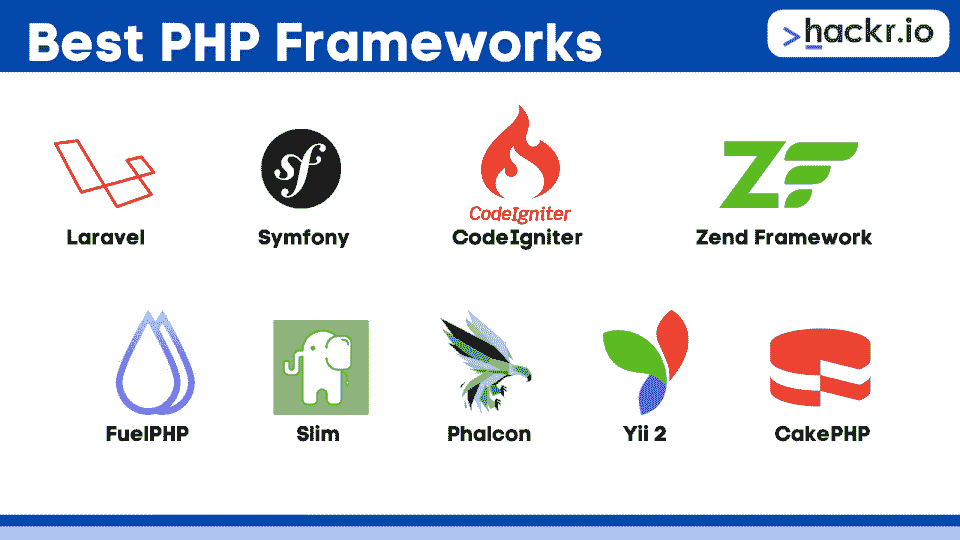
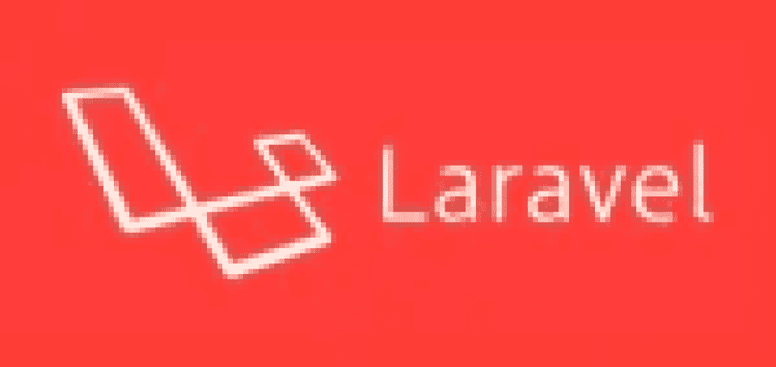
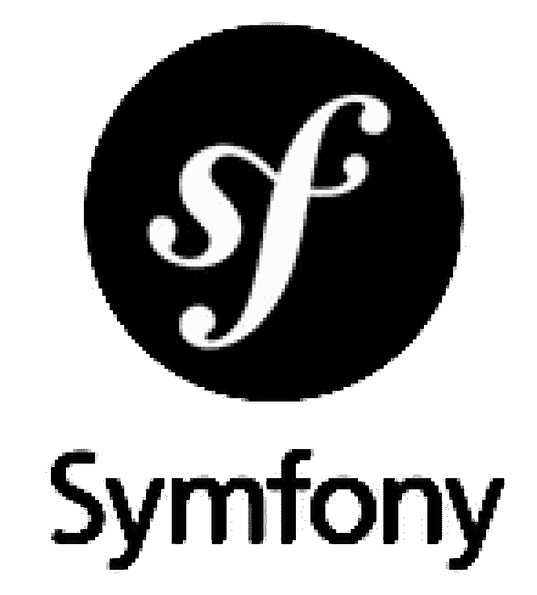
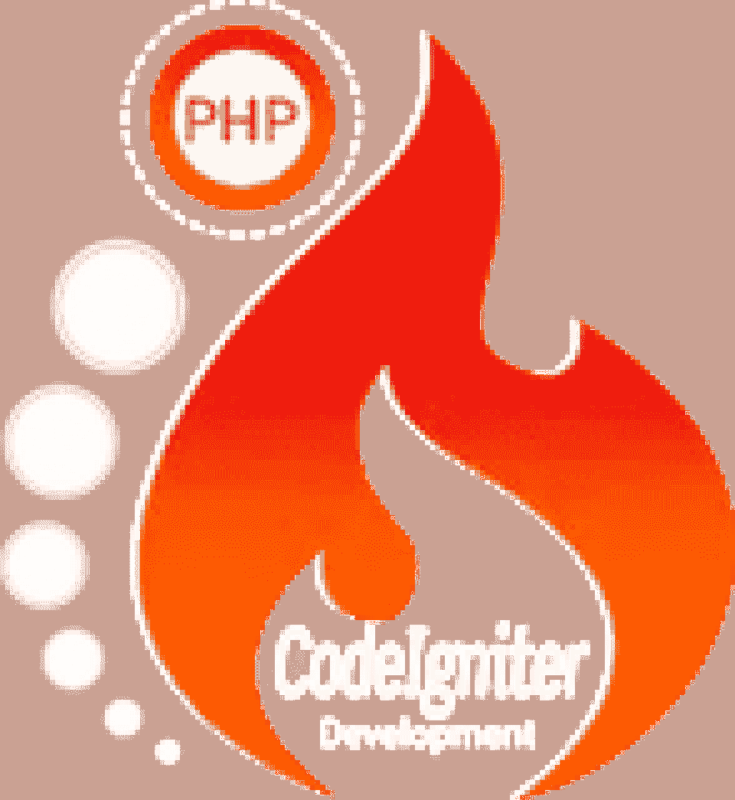
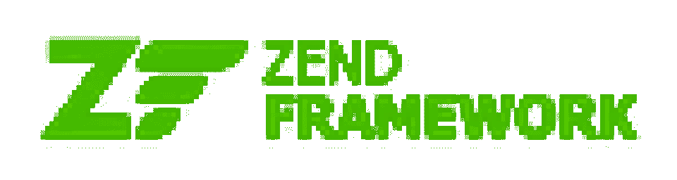
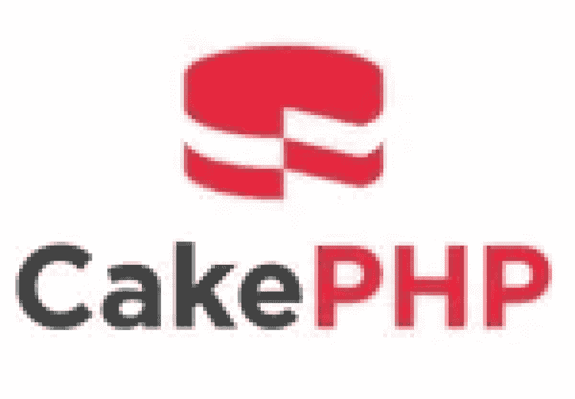

# 2023 年最佳 Web 开发 PHP 框架[更新]

> 原文：<https://hackr.io/blog/best-php-frameworks>

多年来，PHP 一直是开发网站和应用程序最常用的编程语言之一。尽管这种语言被认为是非常稳定和安全的，但自从发布以来，它已经经历了相当大的发展。

但是随着时间的推移，网站的复杂性大大增加了。开发人员必须编写成百上千行代码来创建这些网站，这是一项耗费大量时间的繁琐任务。更有甚者，开发者每次都要从头开始。这就是 PHP 框架的用武之地。

如今有如此多的 PHP 开发框架，以至于很难区分它们。在本文中，我们将看看 2023 年 web 开发的 9 个最佳 PHP 框架。

## **什么是 PHP 框架？**

简单地说，PHP 框架是一个平台，你可以用它来构建基于 PHP 的网站和 web 应用程序。正如您可能已经猜到的，PHP 框架为您的项目提供了一个起点。框架提供了包含 PHP 中常用函数的库，有效地帮助您减少必须进行的手动编码的数量。您必须拿出的原始代码越少，您需要在项目的某些方面花费的时间就越少！

最好的 PHP 框架提供了组织良好且可重用的代码。这种代码的一个好处是，它允许项目很容易扩展，所以它可以随着你的成长而成长。无论你是初学者还是专家，顶级的 PHP 框架都可以帮助你快速高效地完成项目。

## 为什么要使用 PHP 框架？

在 2023 年使用 PHP 框架有很多好处。好处是一旦你习惯了它们，你可能再也不想回到不使用框架的时候了。但是使用 PHP 框架到底能提供什么呢？让我们来看看其中的一些好处！

### 你可以节省大量的时间

开发项目可能会花费大量的时间，这取决于许多因素。使用框架可以帮助您节省大量时间，因为它允许您使用预先存在的代码和函数，而不必为每个项目编写自己的代码和函数。

框架中包含的库也有一些 web 应用程序中最常用的组件，因此您可以简单地使用它们，而不是每次都从头开始构建。例如，当您所要做的就是从框架中获取表单验证函数时，您就不需要担心如何将它们放在一起了！

目前大多数用于 PHP web 开发的全栈框架都使用 MVC 架构，这样开发人员可以为每个组件单独编写代码。MVC 有三个部分——**M**模型**，V** 视图，和 **C** 控制器。在这种情况下，模型通常是数据库，视图是用户看到的页面(HTML/CSS 页面)，控制器是用于访问和更新数据库的函数。

有了 PHP MVC 框架，多个开发人员可以在项目的不同部分工作，总体上节省了时间。随着 PHP 数据库框架的使用，事情变得更加简单。

### **您可以更轻松地协作**

你能想象和一群对如何实现项目的某些方面有自己想法的开发人员一起工作吗？事情永远也做不完，因为每个人都太忙于试图弄清楚代码中发生了什么！

使用 PHP 框架，开发团队可以有效地协作，因为框架可以帮助每个人在工作时保持一致。框架及其各自的库遵循单一的代码标准和规则集，因此您永远不必担心沟通不畅和代码走向错误的方向。

本质上，使用 PHP 框架使得保持全面的严格编码标准成为可能，以增强一致性。此外，作为一个团队，设计决策变得更容易决定，因为混乱少得多。最后，有了一个框架作为一切的基础，建立干净的文档就变得不再那么乏味了。

### **帮助您学习并遵循最佳编码实践**

尽管“最佳编码实践”是相当主观的，但是肯定有一些事情可以帮助您简化工作过程。从长远来看，这些做法可以节省你很多时间，让你的生活更轻松。

例如，PHP 框架可以帮助你建立良好的编码习惯，比如将你的代码整齐地划分到按功能分类的目录中。这样做的最终结果是，您的代码变得更加易于维护。

另一个例子是，框架通常有命名约定供您遵循。遵循这些惯例可以更容易地跟踪项目中的所有内容。搜索某样东西变得容易多了，因为你会确切地知道要找什么术语！

### **安全性不再是一个大问题**

无论你在哪里，在互联网上做什么，总会有某种形式的安全威胁。这同样适用于 PHP 安全，您的项目可能容易受到 SQL 注入攻击和跨站点请求伪造或脚本攻击。当然，您总是可以保护自己的代码。但是，使用框架可以让你更容易。

值得注意的是，即使是最好的 PHP 框架也不能保护你免受所有的漏洞——你必须在上面编写安全的代码。然而，好的 PHP 框架至少可以最小化黑客攻击的机会，因为它们通常具有针对常见威胁的内置防御。

### 有了框架，项目变得更容易维护

你应该使用框架的一个主要原因是你的项目变得更容易维护。您不必手动编写所有代码，也不必一路重复，从而产生更精简的代码库，需要的维护也少得多。此外，您永远不必担心框架的维护，因为这已经为您完成了！

## **哪个 PHP 框架最适合初学者？**

如果你刚刚开始，选择一个框架可能是一个令人生畏的经历。

具体来说，PHP 框架的流行程度并不总是与它对你有多好相对应。最常用的 PHP 框架也不总是你的正确选择，所以你可能需要找到一些最适合你的知识和经验水平的框架。

一般来说，你会想要更简单、更精简、更容易理解的东西——这意味着学习曲线更短。在开始寻找一些更具特性的选项之前，寻找更容易掌握的框架。

从这个 PHP 框架列表中，考虑下面的选项:

*   CodeIgniter——由于学习曲线更短，这个框架对初学者非常友好。它易于学习，易于使用，基于 MVC 架构，并且附带了许多针对初学者的指南。

*   slim——如果你想要一个安装简单并且有教程可以帮助你入门的框架，那么选择这个框架。

## 9 个最佳 PHP 框架

****

### **1。拉勒维尔**

****

在我们的列表中名列前茅的是新的非常流行(如果不是最流行的)的框架， [Laravel](https://laravel.com/) 。Laravel 于 2011 年发布，风靡了框架领域，并在相当长的一段时间内一直高居排行榜榜首。与其他框架相比，它能够以更快的速度和更高的安全性处理复杂的 web 应用程序，这是它广受欢迎的原因。它还通过降低常见任务(如会话、路由、排队和身份验证)的复杂性来简化开发过程。

开发者也更喜欢 Laravel，因为它提供了一个巨大的生态系统，带来了一个即时托管和部署平台，以及由 Laravel 官方网站托管的截屏教程。该框架还以 Homestead 为特色，这是一个帮助进行无障碍开发的流浪者盒子(预打包的开发环境)。其他特性包括强大的加密包、使用动态方法的过载能力以及大量开箱即用的功能。由于大量文档和大量在线 [Laravel 教程](https://hackr.io/tutorials/learn-laravel?ref=blog)资源的可用性，从 Laravel 开始很容易。

#### 谁使用这个框架？

许多网站和应用程序都使用 Laravel，包括零售、旅游和时尚网站。著名的例子包括 [Vogue 时尚档案](https://archive.vogue.com/)、[探索佐治亚](https://www.exploregeorgia.org/)网站、[探访缅因州](https://visitmaine.com/)网站、[Restaurants.com](https://www.restaurants.com/)和[露营世界房车&户外](https://www.campingworld.com/shop)网站。

#### **使用该框架的原因**

*   Laravel Homestead 是一个虚拟开发环境，很容易上手。Laravel Homestead 是框架的官方和预打包的*vagger*box，它为您提供了一个开发环境——所有这些都不需要安装 PHP。你也不需要网络服务器或其他软件服务器，所以没有必要担心你不小心弄乱了你当前的设置！
*   对于 Mac 用户，你可以在 Laravel Homestead 和 Laravel Valet 之间选择。Valet 是另一个开发环境，它也支持 Symfony、Slim、WordPress、CakePHP 和 Zend。
*   Laravel 的 Blade 模板引擎允许你在其中使用 PHP。
*   您将获得 [Packalyst](https://packalyst.com/) ，这是一个 Laravel 包集合，有 15，000 个。
*   Laravel 有许多安全功能。
*   Laravel 周围有一个庞大的社区，因此您很可能能够找到任何问题的支持。

#### **避免该框架的原因**

*   你需要创建一个单独的管理面板，在那里你可以管理和编辑你的内容，这是不理想的，如果很多人需要访问。如果许多用户需要访问应用程序的设置，你最好使用 CMS。

### **2。符号〔t1〕**

****

Symfony 于 2005 年推出，比商业中的大多数 PHP 开发框架存在的时间都要长。这种长寿表明 Symfony 已经赢得了开发人员十多年的信任，并随着年龄的增长而成熟。Symfony 框架是一个广泛的框架，它是唯一完全遵循 PHP 和 web 标准的框架。流行的内容管理系统使用 Symfony 组件，如 Drupal、OroCRM 和 PHP 公告板(PHPBB)。

Symphony 是许多开发人员的首选，因为它提供了可重用的库和组件，可以用来完成各种任务，如身份验证、模板、对象配置等等。对于大规模的企业任务，Symfony 是 PHP 开发框架中的最佳选择。此外，Symfony 生态系统是巨大的，由高度活跃的编程社区支持，并有大量优秀的在线 Symfony 教程供您入门。

#### 谁使用这个框架？

有许多大公司使用 Symfony 的一些组件，如 Joomla、Drupal 和 Magento。你还会看到像因特留斯(Intelius)、 [Foot District](https://footdistrict.com/) 、 [Sainsbury's Magazine](https://www.sainsburysmagazine.co.uk/) 等更多使用 Symfony 的网站。

#### **使用该框架的原因**

*   你可以在大多数平台上安装和设置 Symfony，没有太多问题，因为它很容易使用。
*   Symfony 在企业级应用程序开发方面非常出色。
*   这个框架非常灵活，允许与其他供应商的库集成。
*   Symfony 通常遵循大多数最佳 web 实践。
*   它也遵循了一些最好的设计模式。

#### **避免该框架的原因**

*   Symfony 开始并不容易，因为它更面向高级开发人员——如果你是初学者，你可能会在学习曲线上挣扎。
*   Symfony 的安全机制可能有点难以使用。
*   虽然 Symfony 的特性非常丰富，但由于其特性，您可能会发现它比其他框架慢。

### **3。CodeIgniter**

****

CodeIgniter 是一个轻量级的框架，它以占地面积小、安装方便、配置先决条件最少而闻名。简单而强大，CodeIgniter 只有 2MB 大小，这是一个很小的内存空间，甚至包括文档。它非常适合动态网站的开发，因为它提供了许多预构建的模块，有助于构建强大的可重用组件。

增加其受欢迎程度的是其在共享和专用主机平台上的流畅运行。与其他框架相比，它也要快得多。由于其稳定的性能和更快的速度，它是开发运行在简单服务器上的轻量级应用程序的最佳选择。CodeIgniter 的多个其他特性包括简单的安全性、加密步骤、容易的错误处理，以及可以忽略不计的 PHP 采用困难。该框架有很好的文档记录，对于初学者来说是一个极好的选择。以下是社区推荐的最佳在线教程。需要注意的一件重要事情是，框架更新相当不稳定，因此对于需要高级安全性的应用程序来说，它不是最佳选择。

#### 谁使用这个框架？

您将会看到各个领域的网站，包括零售、营销、技术等，都使用 CodeIgniter 作为其主要框架。一些例子包括 [WooBox](https://woobox.com/) 、[卡西欧](https://www.casio.com/)(还有 G-Shock)、 [TestandTrack](https://www.testandtrack.io/) ，甚至还有一个叫做 FuelCMS 的内容管理系统。

#### **使用该框架的原因**

*   CodeIgniter 使用 MVC 架构，并鼓励开发人员使用它，但您仍然可以使用其他架构，没有问题。
*   作为一个轻量级的 PHP 框架，与其他类似的框架相比，CodeIgniter 非常容易设置。
*   CodeIgniter 具有针对 XSS 和 CSRF 攻击的内置安全特性，等等。
*   由于支持多种缓存方法，该框架有助于提高 web 应用程序的速度。您可能会发现它是当今可用的速度最快的框架之一。
*   由于更容易的学习曲线和大量的详细文档，CodeIgniter 是目前最适合初学者的 PHP 框架之一。

#### **避免该框架的原因**

*   虽然 CodeIgniter 对于初学者来说是一个很好的选择，但是它的发布和更新可能会有点零星。如果你想要一个更有规律的更新框架(为了安全等等)，你可能想跳过 CodeIgniter。

### **4。Zend 框架**

****

我们列表中的下一个是 Zend 框架。由于接口和继承等特性，Zend 是可扩展的，它建立在敏捷方法之上，旨在提供企业级的高质量应用程序。该框架完全面向对象，在构建时考虑了速度、安全性、性能和可扩展性。Zend 提供了高度的可定制性，并且符合 PHP 的最佳实践，这对于希望集成特定于项目的功能的开发人员来说是非常有益的。

由于它集中在企业应用程序中，所以它为诸如身份验证、服务、表单等任务提供了多余的组件。但是，尽管它附带了许多工具，使开发人员的工作变得相当容易，但对于快速应用程序开发来说，它仍然不是理想的。Zend framework 包含一些功能，如易于使用的拖放编辑器、编码工具、在线调试工具以及对复杂网站有用的可扩展界面。然而，Zend 框架被认为是最难学的框架之一，尤其是如果你是初学者的话。

#### 谁使用这个框架？

Zend 的主页上有很多大公司在他们的网站和应用程序上使用这个框架。这些公司的一些例子包括思科 Webex T1 和英国广播公司的 T2 BBC T3。

#### **使用该框架的原因**

*   如果您需要构建复杂的应用程序，甚至是企业级应用程序，Zend 的可重用结构化代码是您项目的绝佳选择。
*   你可以从 Zend 的库中只挑选你需要的组件，因为这个框架集成了其他模板和第三方库。
*   你会喜欢 Zend 的主要功能
*   比如 MVC 架构、加密管理、会话管理、云 API 等。
*   Zend 是一个提供卓越性能的安全框架，允许您创建优化的应用程序。
*   由于 Zend 广泛的用户基础和详细的文档，寻找支持很容易。

#### **避免该框架的原因**

*   如果你是一个打算使用 Zend 的移动应用开发者，请准备好一个陡峭的学习曲线。
*   Zend 的插件可能很贵，所以如果你预算紧张的话，你可以去别处看看。

### **5。燃料 HP**

****

FuelPHP 是一个灵活的、可扩展的 PHP 框架，它不局限于基本的模型-视图-控制器(MVC)模式，还包括它的后继者，框架架构层的层次模型-视图-控制器(HMVC)。它还在控制器和视图层之间添加了一个称为 Presenter 类(以前称为 ViewModel)的自愿类，以保存生成视图所需的逻辑。

FuelPHP 框架是以安全为中心的，它使用许多特性来解决这个问题，这些特性包括输入和 URI 滤波以及输出编码。该框架附带的许多其他特性包括 HMVC 实现、URL 路由系统、缓存系统和漏洞保护。FuelPHP 适合交付不同规模和复杂性的端到端 web 解决方案。

#### 谁使用这个框架？

使用 FuelPHP 的最著名的网站之一是一个名为前台的物业管理系统。

#### **使用该框架的原因**

*   FuelPHP 使用 HMVC(层次模型视图控制器)实现。
*   该框架带有内置的安全功能和缓存，可以提高应用程序的性能。
*   FuelPHP 的代码组织得很好，并且相当模块化和可扩展。
*   使用 FuelPHP 时，您可能会发现它内置的命令行实用程序(称为 oil ),您可以使用它来运行任务、生成组件和调试代码。

#### **避免该框架的原因**

*   虽然它是一个很好的框架，但 FuelPHP 仍然相对较新。您可能会发现支持更少，学习曲线更陡，需要处理的文档更少。

### **6。苗条**

****

希望创建简单而强大的 web 应用程序？ [Slim](https://www.slimframework.com/) 就是你要找的 PHP 框架。Slim 是一个微框架，其背后的思想(以及一般的微框架)是非常适合不需要全栈框架特性的小型应用程序。

尽管 Slim 本质上是极简的，但它包含了丰富的特性，如 URL 路由、会话和 cookie 加密、客户端 HTTP 缓存，以及对跨 HTTP 请求的“flash”消息的支持。旨在开发 RESTful APIs 和服务的开发人员高度使用该框架。活跃的用户基础和不断的维护和更新使它非常方便用户。Slim 有很好的[教程](https://hackr.io/tutorials/learn-slim-framework?ref=blog)给初学者。

#### 谁使用这个框架？

世界上有很多网站和应用程序使用轻量级的 Slim 框架。只要看看这个[页面](https://trends.builtwith.com/websitelist/Slim-Framework)，你就会注意到许多中高流量的网站都使用这个框架，包括销售收入超过 10 万美元的电子商务网站。

#### **使用该框架的原因**

*   顾名思义，Slim 的代码库非常精简，不依赖任何第三方。因此，它学起来很快，也很容易。
*   Slim 非常适合希望创建小型 web 应用程序的开发人员。如果您需要更多的功能，您会很高兴知道这个框架可以与其他组件集成，无论是第一方还是第三方。

#### **避免该框架的原因**

*   如果你想构建大型复杂的 web 应用程序，你可能想跳过 Slim。由于其较弱的依赖注入，它也不是企业级应用的最佳选择。

### **7。费尔康**

****

[Phalcon](https://phalconphp.com/) 是一个全栈 PHP 框架，最初是用 C 和 C++编程语言编写的。Phalcon 基本上是一个 C 扩展，但你不必担心学习 C。phal con 框架最突出的特点是它非常快。这是因为它利用了少量的资源，不像市场上的其他框架。对于使用不提供太多开销的系统的开发人员来说，速度非常重要。该框架自 2012 年以来一直在不断更新，在最近的版本中已经有了相当多的升级。最新的支持版本有 ORM、MVC、缓存等组件；还包括对 PHP 7 的支持。对 Phalcon 感兴趣？这里有最好的在线[费尔康教程](https://hackr.io/tutorials/learn-phalcon?ref=blog)供你快速入门。

#### 谁使用这个框架？

如果你想知道谁在使用 Phalcon，你可以查看来自 Enlyft 的这个[链接](https://enlyft.com/tech/products/phalcon-framework)。Enlyft 指出，一些使用 Phalcon 网站的大公司包括 [Maxwell Health](https://maxwellhealth.com/) 和 [Good Game Studios](https://goodgamestudios.com/) 。你甚至会看到 [Chan Zuckerberg 的倡议](https://chanzuckerberg.com/)使用 Phalcon。陈扎克伯格倡议是由 Meta(当时的脸书)的马克扎克伯格和他的妻子陈慧娴建立的慈善组织。

#### **使用该框架的原因**

*   Phalcon 帮助您创建高度可配置的 web 应用程序，同时与企业开发中的最佳实践保持一致。
*   这个框架很容易安装。
*   内置的安全特性和缓存帮助开发人员创建安全且优化良好的应用程序。
*   Phalcon 在内存使用方面也非常高效，因此您会发现它执行起来既快又高效。
*   Phalcon 有一个速度极快的模板引擎，叫做 Volt，它使得创建视图更加容易。

#### **避免该框架的原因**

*   注重安全的开发人员可能不喜欢 Phalcon 不定期地发布更新。

### **8 个。一二一**

****

基于不重复自己(DRY)的概念， [Yii 2](https://www.yiiframework.com/) 是一个面向对象的框架，是最古老的 PHP 框架之一 Yii 的继承者。Yii 2 非常适合大型网站开发，因为它可以很容易地与 jQuery 和 AJAX 特性集成。Yii2 的惰性加载技术使得它比其他框架更快。

此外，它还附带了一个非常强大的类代码生成器，称为 Gii。Gii 的功能是简化面向对象编程和快速原型制作的过程，它提供了一个基于 web 的界面，帮助程序员交互式地生成所需的代码。其他特性包括短的快速开发时间、多个安全包的可用性以及加速开发的配置集。

#### 谁使用这个框架？

你会看到一些公司使用 Yii，但是你也会发现一些在线工具也使用这个框架。比如 WordCounter、Pastebin 等在线工具就使用了这个框架。众筹平台 [CrowdCube](https://www.crowdcube.com/) 也使用 Yii。基督教青年会是非营利组织在幕后使用这个框架的另一个很好的例子。

#### **使用该框架的原因**

*   得益于清晰且编写良好的文档，该框架易于安装和配置。
*   Yii 具有丰富的安全特性，这使得它成为论坛、CMS 和电子商务网站等项目的绝佳选择。
*   Yii 在核心开发者团队之上有一个庞大的用户社区，所以在你最需要的时候很容易找到支持。
*   这个框架本身已经有很好的性能，但是代码生成器工具和缓存支持使得 Yii 成为开发人员的最佳选择之一，这些开发人员希望开发出经过良好优化的 web 应用。
*   Yii 允许对其核心代码的每一部分进行定制，为开发人员提供了很大的灵活性。

#### **避免该框架的原因**

*   您可能会发现这个框架有一个陡峭的学习曲线，使它不是初学者的最佳选择。
*   使用 Yii 时，您可能需要更加小心，因为小错误可能会导致整个应用程序中的级联问题。

### **9。CakePHP**

****

这个有十年历史的框架仍然是最流行的框架之一，仅仅是因为它适应了变化并与时俱进。随着每个新版本的推出，它都提供了新的功能，从而保持了强大的用户基础。最新版本的框架引入了一些特性，比如改进的模块化和增加的创建额外独立库的能力。该框架也易于学习和安装，因为它只需要一个 web 服务器和一个框架副本。

CakePHP 对于商业应用程序项目来说是一个很好的选择，因为它提供了高端的安全性，具有诸如 SQL 注入预防、跨站点请求伪造保护和跨站点脚本保护等特性。其他特性包括正确的类继承、验证和快速构建。该框架从其母公司获得高级支持，并拥有许多支持门户。可以在 Hackr.io 上找到 [CakePHP 教程](https://hackr.io/tutorials/learn-cakephp?ref=blog)。

#### 谁使用这个框架？

有大量的网站和网络应用程序使用这个框架。你会看到教育网站(或者更确切地说是打字练习网站)使用 CakePHP 的 10 个快速手指。其他使用这个框架的网站包括 [Visit NC](https://www.visitnc.com/) 、 [Printivo](https://printivo.com/) 、[goodforks](https://www.goodfirms.co/)等等。

#### **使用该框架的原因**

*   CakePHP 很容易上手——你只需要安装框架。只要你有一个可用的网络服务器，你就可以开始了。
*   这个框架内置了 ORM。
*   CakePHP 有许多内置的安全特性，可以帮助进行密码哈希、加密、SQL 注入预防等等。
*   总的来说，CakePHP 是企业级应用开发的绝佳选择。

#### **避免该框架的原因**

*   CakePHP 非常严格地遵循它的惯例，所以如果你喜欢变通规则或者想快速发布，它可能不是你的正确选择。

## **使用 PHP 框架前你应该知道的事情**

在开始使用 PHP 开发框架之前，您需要先了解一些事情。当然，你需要了解 PHP。因为这个列表中的大多数框架都运行在 PHP 7.2 版本(或更高版本)上，所以您至少需要熟悉这个版本。

但是你还应该知道什么？你应该已经有什么经验了？什么可以帮助你更清楚地了解 PHP 前端框架和后端框架中发生了什么？

让我们看看下面的列表:

*   最好至少有一些构建 PHP 应用程序的经验。有了这种预先的实践知识，你就可以更容易地找到框架。
*   你应该知道**面向对象的 PHP** 并理解它的概念，比如对象、类、方法、继承、访问修饰符和特征。另外，它可以帮助你**理解 ORM(对象关系映射)**。ORM 只是一种使用面向对象的语法而不是 SQL 来访问(数据库中的)数据的方法。ORM 内置了一些框架。
*   你应该**了解数据库**，尤其是因为你将在整个项目中使用它们。您还应该了解 **SQL 语法**。
*   它有助于你**了解 web 服务器(如 Nginx 和 Apache)如何工作**，特别是因为你可能需要在这些服务器上配置一些文件来让你的应用程序以最佳方式工作。

当然，由于您可能会在本地处理大部分开发过程，所以了解和理解 **localhost** 是个好主意。或者，你可能想知道如何使用**流浪者**和 **VirtualBox** 在虚拟环境中测试你的应用。

## **如何选择合适的 PHP 框架**

当有这么多框架可供选择时，您如何找到最适合您的呢？你通常希望找到一个 MVC 框架，但是除此之外你还应该考虑什么呢？

好消息是，PHP 框架通常是独一无二的——或者至少，它们提供了独一无二的特性。在你选择之前，问问你自己下面的问题:

*   学习曲线是怎样的？这个列表中的每个框架都有自己的约定，所以学习和理解它们是如何工作的需要时间。您可能想要考虑一个框架的学习曲线相对于您可用的时间量。此外，您可以寻找具有清晰和广泛文档的框架，以帮助您更快地克服学习曲线。

*   框架有调试功能吗？无论你的编码有多好，你的知识有多渊博，都无法避免代码中的一两个错误。考虑具有调试特性的框架，不管它们是否是内置的。此功能有助于确保您的 web 应用程序项目正常运行。

*   框架有缓存系统吗？缓存机制有助于提高性能。虽然不是绝对必要的，但它们可以帮助事情运行得更顺利。

*   框架有多安全？优秀的框架有一些内置的保护措施，可以抵御一些最常见的漏洞，比如 cookie 攻击和跨站点脚本。

*   框架可伸缩吗？当您处理项目时，您可能会发现它的范围可能会扩大—或缩小。可扩展的解决方案让您不必迁移或重新开始/

*   社区是什么样的？框架通常有社区聚集在它们周围。选择一个有强大社区的网站，以确保它能长期保持下去。有了强大的社区(甚至更小的社区)，如果你遇到任何问题，你都可以找到持续的支持。你不必总是选择最流行的 PHP 框架，但是更大的社区可能会让你在遇到问题时更容易找到帮助。

## **结论:哪个框架适合你？**

PHP 框架旨在简化开发过程，减少创建优秀应用程序所需的工作。

这个列表内外的每个框架都有自己的一套特性和一系列缺点，它们在文档和社区支持方面都有所不同，还有来自创建者的官方支持。

因此，最佳框架的决定将取决于您正在进行的项目的需求以及您的先决条件，例如安全性、可伸缩性、易用性等等。

所以在你选择一个框架之前，**了解你的需求。**那么只有你准备好了，可以直入了。

## **常见问题解答**

#### **1。什么是 PHP 框架？**

简单地说，PHP 框架是一个由代码库和函数组成的平台。开发人员可以使用 PHP 框架来构建使用 PHP 的网站和 web 应用程序。它们提供了许多好处，例如为开发人员节省了大量的时间和精力，提供了更好的安全性，允许更容易的协作，等等。框架是基于 PHP 的 web 应用程序的基础。

#### **2。PHP 用的是哪个框架？**

PHP 使用的框架可能因开发人员的偏好、需求和经验水平而异。这也可能取决于项目的范围和框架需要的可伸缩性。这个列表中有 9 个目前使用的最好和最流行的 PHP 框架。

#### **3。哪个数据库最适合 PHP？**

毫不奇怪，开源的 MySQL 至今仍然是最受欢迎的 PHP 数据库。即使在今天，MySQL 也是世界上最受欢迎的数据库之一。

**4。PHP 框架维护起来有多难？**

PHP 框架通常更容易维护。框架通常由核心开发人员维护和更新，尽管这里或那里也可能有一些社区参与。对您来说，这意味着您需要做的实际维护工作可能会更少，所以您需要做的只是遵循惯例。确保你的代码有条理也有助于你的项目更容易维护。

**人也在读:**