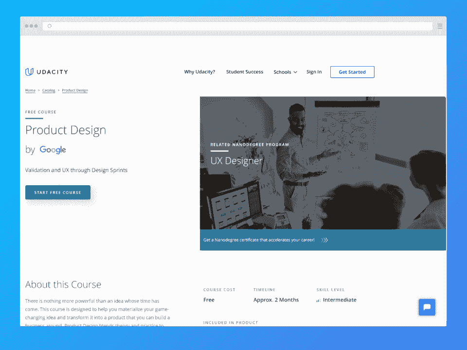
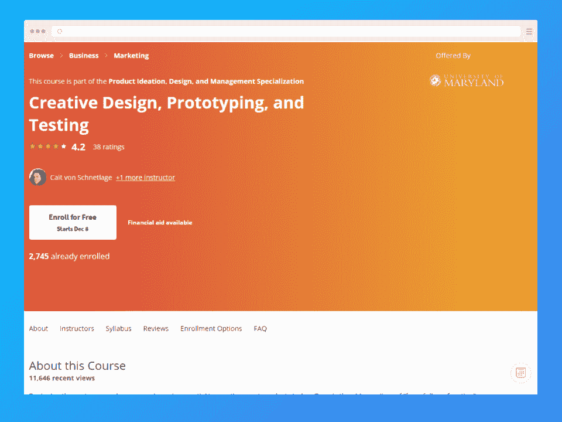
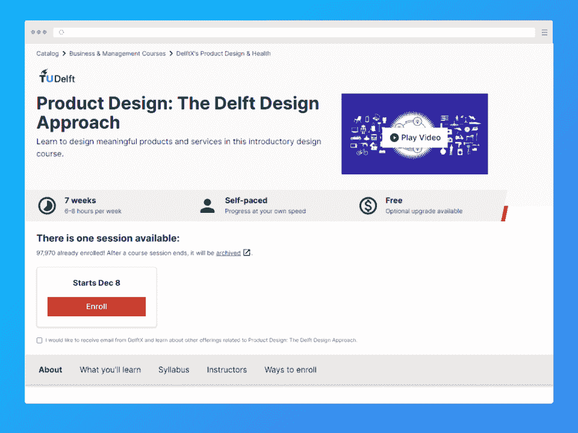
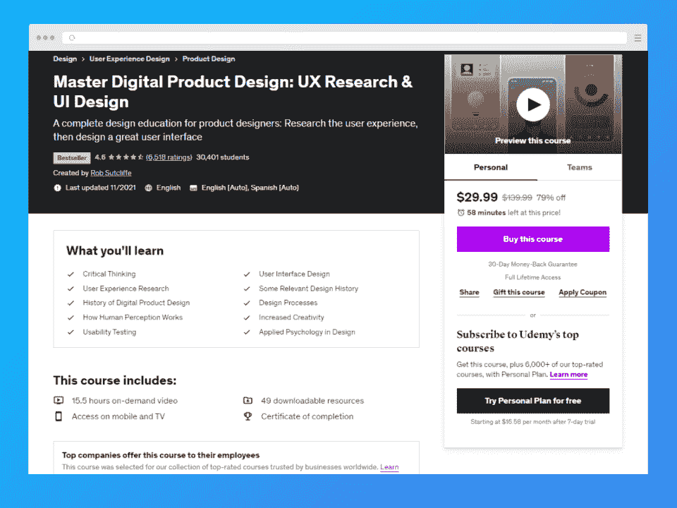
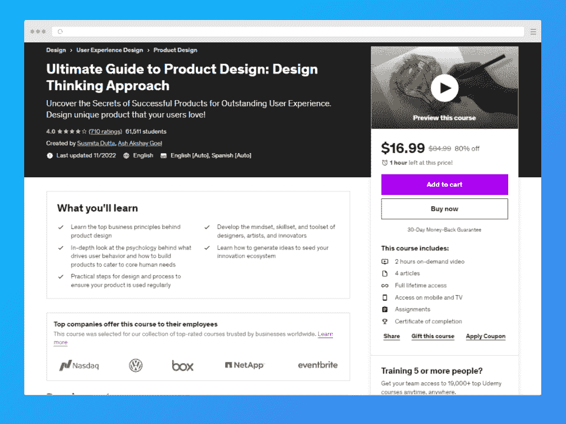
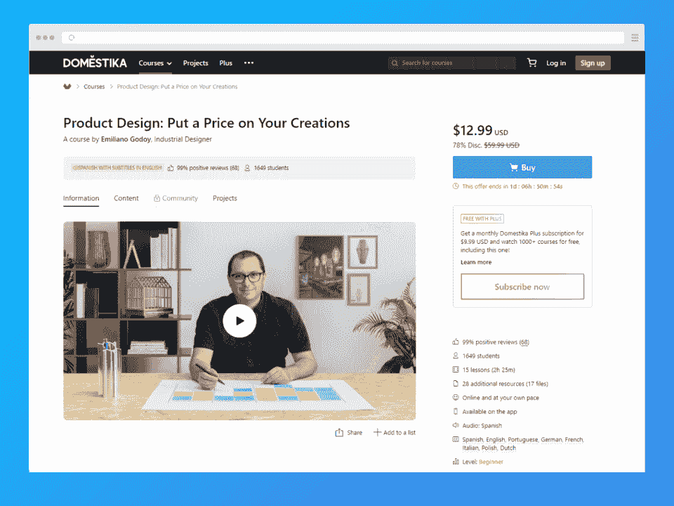
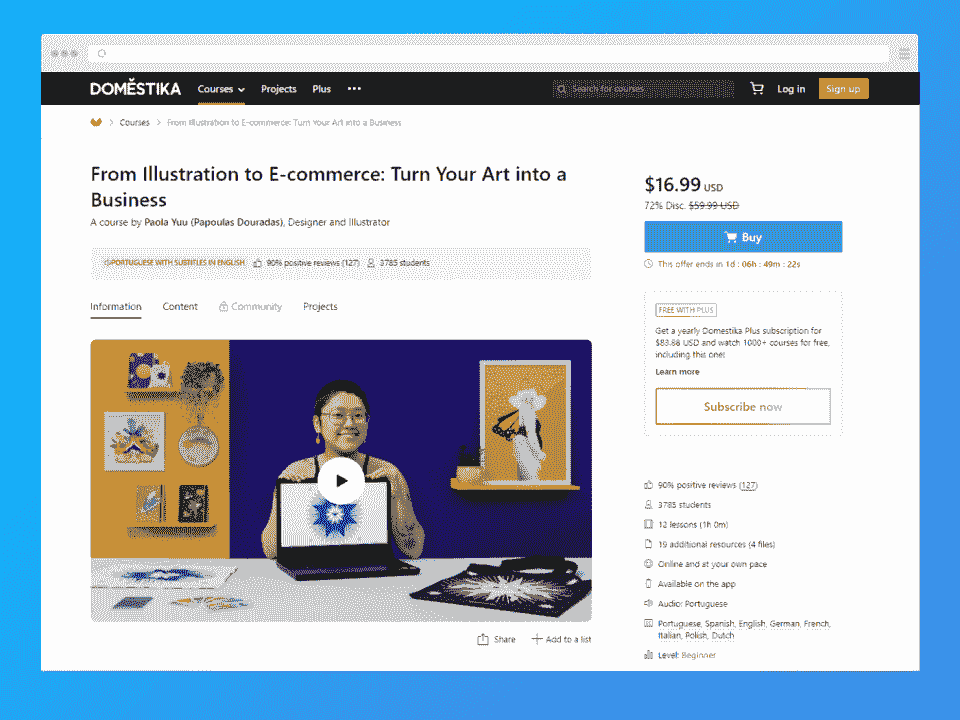

# 7 门最佳产品设计在线课程[2023]

> 原文：<https://hackr.io/blog/best-product-design-courses-online>

产品设计师是有才华的、多技能的个人，他们将产品的实用性和逻辑性与吸引人的创造力结合在一起。他们了解公司价值观、艺术指导方针、市场趋势，当然，还有将产品从概念推向市场的独特技能。这些广泛的技能使产品设计师的平均工资达到令人印象深刻的 102，000 美元，其中前 10%的人年收入高达 152，000 美元。

但是产品设计师如何获得创造适销产品所需的技能呢？

有些人拥有平面设计、计算机编程、信息技术或市场营销的完整学位。然而，你可以通过许多产品设计课程中的一门来补充你现有的技能。

不知道从哪里开始？请继续阅读我们关于产品设计的顶级课程。

以下是我们将详细讨论的产品设计课程:

## **特色在线产品设计课程:对比**

## **产品设计付费和免费在线课程排名标准**

那么，我们是如何决定每个在线产品设计课程在我们列表中的排名的呢？网络上充满了在线课程，从大学学位课程到像 Coursera 这样的免费网站。我们选择产品设计课程的依据是:

*   评论:这份名单上的课程很少有⅘星级的，主要是正面的评论，有些课程有来自世界各地学生的数千条评论。

*   相关性:我们查看了过去几年推出或更新的课程。

*   **导师:**我们名单上的很多导师都是世界知名大学的教授。然而，我们对软件公司或其他公司高管职位的讲师特别感兴趣，这些公司经常创造新产品并将其推向市场。

*   **灵活性:**我们列表中的每门课程都有最少的在线选项和自定进度的模块，不会根据一天中的时间来限制您。

准备好足不出户学习产品设计了吗？让我们进入产品设计在线课程列表。

## **7 门最佳产品设计在线课程**

以下是对市场上一些最激动人心的产品设计课程的深入探讨！

[****](https://imp.i115008.net/VyqVWa)

这个为期两个月的课程是 Udacity 的最爱，涵盖了用户界面(UI)和用户体验(UX)原则，以帮助中级设计师构思和开发产品。课程材料围绕谷歌高级产品工程师通过访谈和案例研究得出的见解。该课程还涉及关键指标和设计冲刺——谷歌从设计、原型和测试中获取产品的生产力过程。

讲师 Amir Shevat 拥有开发 SaaS 工具的丰富经验，并创立了创新事业。Chris Saden 是医疗领域经验丰富的软件开发人员。

*   *   **讲师:**克里斯·萨登&阿米尔·谢瓦特
    *   **价格:**免费
    *   **先决条件:**无
    *   **关键特性:**谷歌设计冲刺
    *   **级别**:中级
    *   **时长:**两个月
    *   **优点:**专家指导，价格实惠
    *   反对意见:谷歌的直接 [Coursera 课程](https://grow.google/certificates/ux-design/#?modal_active=none)可能更适合对谷歌方法论特别感兴趣的学生

[在这里报名](https://imp.i115008.net/VyqVWa)

[****](https://imp.i384100.net/Zd94DQ)

马里兰大学为对原型制作特别感兴趣的学生提供这种基于视频的在线产品设计课程。您将了解基本的产品构思、线框、3D 渲染和原型测试。学生们还学会了很好的沟通技巧，以帮助将他们的概念转化为可销售的产品。

这门 Coursera 产品设计在线课程由一家软件开发公司 CEO (Schnetlage)和首席教授 James V. Green 博士教授，他在任职前创办并指导了许多网络安全初创公司。

*   *   讲师:凯特·冯·施纳特拉格&詹姆士·v·格林博士
    *   **价格:**免费
    *   **先决条件:**无
    *   **主要特色:**网络安全和智能软件焦点
    *   **等级**:初学者
    *   **时长:** 12 小时
    *   **优点:**深入的原型流程教育和基于项目管理的方法
    *   反对意见:一些学生抱怨课程材料中缺乏技术含量，而且老师总是漫无边际。

[在这里报名](https://imp.i384100.net/Zd94DQ)

[****](https://www.awin1.com/cread.php?awinmid=6798&awinaffid=428263&ued=https%3A%2F%2Fwww.edx.org%2Fcourse%2Fproduct-design-the-delft-design-approach)

这个 eDX 课程是一个伟大的通才课程，为有抱负的产品设计师，走过整个过程。该课程独特的早期关注用户行为的见解对于有营销兴趣的产品设计师来说尤其有价值。

Daalhuizen 教授在工业设计方面有广泛的背景。最后，用户学习如何使用关键的设计方法将产品从想法带到交付。

*   *   **导演:【jj j . j .】&波耶琳的妈妈**
    *   **价格:**免费；经验证的赛道 106 美元
    *   **必备条件:**基本设计经验；熟悉设计思维
    *   **主要特色:**荣获 2015 年开放教育优秀奖
    *   **级别**:中级
    *   **时长:** 7 周
    *   **优点:**受众和市场研究部分
    *   缺点:有点过时

[在这里报名](https://www.awin1.com/cread.php?awinmid=6798&awinaffid=428263&ued=https%3A%2F%2Fwww.edx.org%2Fcourse%2Fproduct-design-the-delft-design-approach)

[****](https://click.linksynergy.com/deeplink?id=jU79Zysihs4&mid=39197&murl=https%3A%2F%2Fwww.udemy.com%2Fcourse%2Fmaster-digital-product-design-ux-research-ui-design%2F)

故事板、体验经济、用户调查和过程构思只是这个以用户界面为中心的产品设计课程中的几个主题。在我们名单上的所有产品设计课程中，Sutcliffe 的课程感觉是最全面的，它深入研究了 Tinder 和优步等案例，向学生讲授受众研究技术、设计过程问题以及如何解决这些问题。

讲师 Rob Sutcliffe 是一名拥有 15 年教育经验的 UI/UX 设计师，受到了参加本课程的 6000 多名学生的好评。

*   **讲师:**罗布·萨特克利夫
*   价格: $16.99
*   **先决条件:** Figma 账户
*   **关键特征:**案例研究和广泛的受众调查
*   **级别**:中级
*   **时长:** 15 小时 30 分钟
*   **优点:**全面；在数千名评论者中获得好评

*   *   反对意见:过于注重批判性思维而不是实际操作，这并不为一些学生所接受

[在这里报名](https://click.linksynergy.com/deeplink?id=jU79Zysihs4&mid=39197&murl=https%3A%2F%2Fwww.udemy.com%2Fcourse%2Fmaster-digital-product-design-ux-research-ui-design%2F)

Dutta 和 Goel 是专业的性能教练，在这个迷人的产品设计课程中添加了用户心理学的独特镜头。

你将学到深入的实践和关于设计原则的信息，从重点和运动到空间和纹理。学生们称赞这门课程对初学者来说很容易理解，但也抱怨某些部分缺乏直观教具。

*   教练:苏珊·杜塔&阿什·阿克谢·戈埃尔
*   价格: $13.99
*   **先决条件:**
*   **主要特点:**深入探究设计原则
*   **等级**:初学者
*   **时长:** 2 小时
*   **优点:**设计思维方式
*   反对意见:有限的用户交互内容和小的测试部分使得实际研究更不理想

[在这里报名](https://click.linksynergy.com/deeplink?id=jU79Zysihs4&mid=39197&murl=https%3A%2F%2Fwww.udemy.com%2Fcourse%2Fdesign-engaging-products-using-design-thinking%2F)

[****](https://www.domestika.org/en/courses/2041-product-design-put-a-price-on-your-creations)

如果你对自己做生意感兴趣，不管是自由职业还是开一家代理公司，你都需要确定一个定价策略。产品设计课程并不总是涵盖这一重要的创业主题，这就是为什么工业设计师埃米尔利亚诺·戈多伊的这门课程在我们的名单中占有一席之地。

戈多伊涵盖了基础知识，比如将想法付诸实践。但他通过帮助学生理解生产成本管理、成本计算和盈利能力来深入定价。

*   教练:埃米尔利亚诺·戈多伊
*   **价格:**11.90 美元(普通 72 美元)
*   **先决条件:**无正式；最好有一些设计背景
*   **关键特性:**估价和定价
*   **等级**:初学者
*   **时长:** 2 小时 25 分钟
*   **优点:**涵盖了产品设计的商业方面
*   **缺点:**没有包括太多关于原型的信息

[在这里报名](https://www.domestika.org/en/courses/2041-product-design-put-a-price-on-your-creations)

[****](https://www.domestika.org/en/courses/3090-from-illustration-to-e-commerce-turn-your-art-into-a-business)

我们在产品设计领域还没有涉及太多的利基主题，但是我们觉得这个以插图为主的产品设计课程值得你的关注。如果你是一名插画师或艺术家，那就是。为什么？因为插画不再像以前那样局限于素描和绘画。今天的平面设计师和程序员也可以在网上锻炼他们的插画技能——这是艺术产品的完美配方。

但是传统的草图也可以在产品设计领域蓬勃发展——我们谈论的是文具、模板、服装等具体产品。另一个以商业为重点的课程，讲师 Paola 教学生创建一个电子商务商店，并推出各种产品的艺术收藏。

*   **指导老师:** Paola Yuu
*   **价格:**11.90 美元(普通 72 美元)
*   **先决条件:**无；初学者友好
*   **主要特点:**以插画为中心
*   **等级**:初学者
*   **时长:** 1 小时
*   **优点:**对插画特别感兴趣；简短而令人愉快的
*   **反对意见:**超特异性，并非所有设计师都认同

[在这里报名](https://www.domestika.org/en/courses/3090-from-illustration-to-e-commerce-turn-your-art-into-a-business)

## **结论**

这些产品设计课程是进入新职业、扩展知识或转向新专业的极好的第一步。

如果你对产品设计的世界感兴趣，也许你可以深入 UX 设计来补充你的知识。

**[今天探索 UX 顶级设计课程。](https://hackr.io/blog/ux-design-courses)**

## **常见问题解答**

#### **1。怎样才能学习产品设计？**

你可以通过注册这个列表中的任何课程来学习产品设计。你也可以考虑阅读关于图形设计和用户体验的书籍，以及观看该领域专家的 YouTube 教程。

当然，你也可以在大学里专攻四年制设计课程，尽管你的作品集对找工作最有价值。

#### **2。什么使产品设计有效？**

最有效的产品设计迎合最终用户——它认识到他们的痛点并轻松解决它们。

#### **3。最好的产品设计在线课程是什么？**

在我们名单上的所有产品设计课程中，Udemy 的[数字产品设计硕士课程](https://click.linksynergy.com/deeplink?id=jU79Zysihs4&mid=39197&murl=https%3A%2F%2Fwww.udemy.com%2Fcourse%2Fmaster-digital-product-design-ux-research-ui-design%2F)正面评价比例最高，结构也最健全、最全面。

#### **4。产品设计师待遇好吗？**

是的。产品设计师的平均工资为 10.2 万美元，而更高端的产品设计师的工资为 15 万美元甚至更高。

#### **5。美国对产品设计师有需求吗？**

是的，每个行业只要有解决问题的需求，产品设计师就会需求量很大。在像纽约市和加州萨克拉门托这样的热点地区，它们尤其令人垂涎。