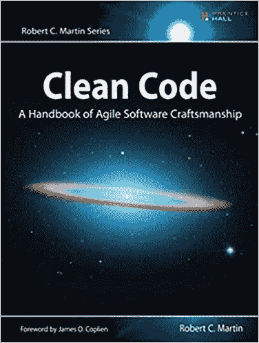
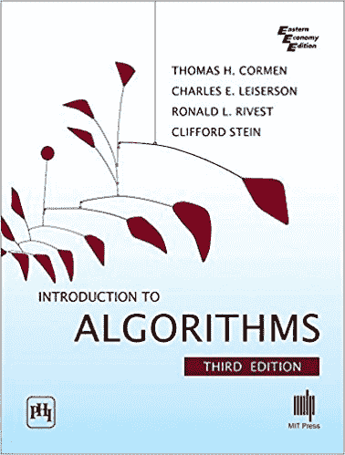
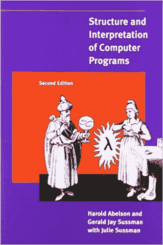
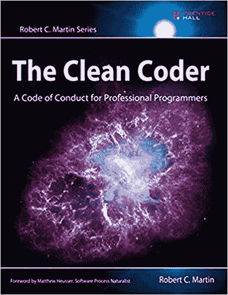
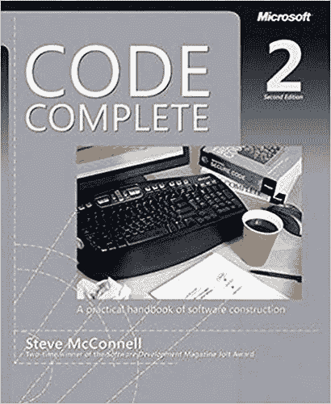
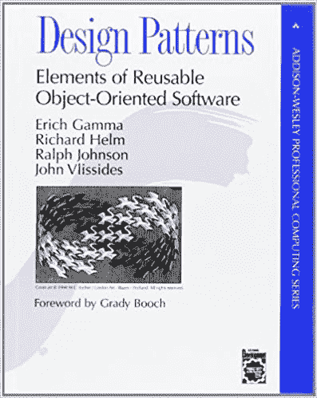
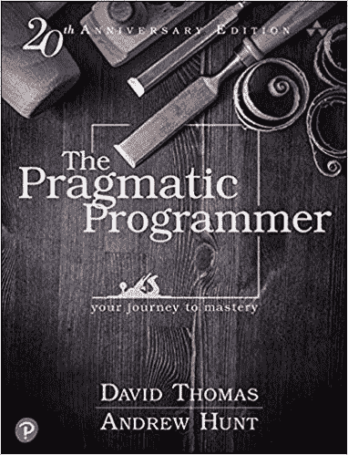
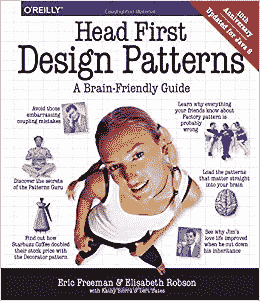
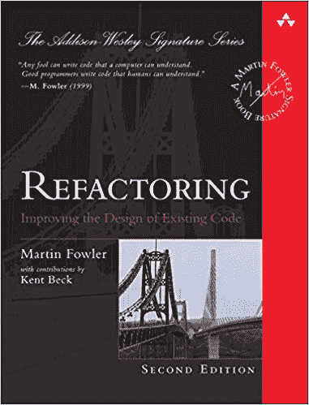
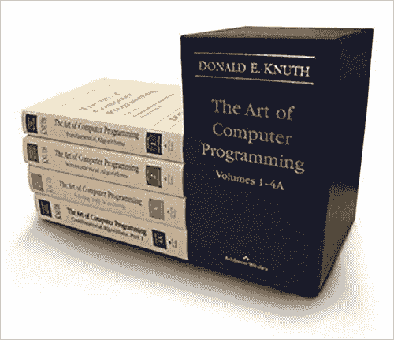

# 你应该知道的 10 本最佳编程书籍[排名]

> 原文：<https://hackr.io/blog/best-programming-books>

编程是一种以计算机程序的形式创造创新解决方案的艺术，用于解决各种领域的问题，从经典的数学难题和日常生活问题到天气预报，以及寻找和理解宇宙中的新奇事物。

虽然编程和编码通常可以互换使用，但编程不仅仅是编码。编码代表编程的一部分，包括编写计算机代码。

另一方面，编程是一个更广泛的过程，它还包括提出开发程序的想法的方法，以及对程序的测试等等。查看详细的[编码与编程](https://hackr.io/blog/coding-vs-programming-difference-you-should-know)对比。

## 最佳编程书籍

编程是世界上最受欢迎的专业领域之一。它为候选人提供了大量学习和赚钱的机会。然而，它需要不断的学习，还有什么能比书本更好的学习呢！

所以，这里是我们挑选的 10 本最好的编程书籍，来提升你的游戏:

[** **](https://geni.us/K41gV) 作者——罗伯特·马丁
最新版——第一版
出版商——普伦蒂斯霍尔
格式——Kindle/平装

编程就是用多年的反复试验来打磨这门手艺。我希望有一种方法，通过从其他程序员的错误中学习，把你从所有的艰苦工作中解救出来？幸运的是，确实有，它被世人称为《干净代码:敏捷软件工艺手册》,来自传奇的鲍勃叔叔。

clean code 为代码清理和软件开发提供了宝贵的见解。它有关于清理、编写和重构代码的详尽的、一步一步的解释。这本编程书有大量关于如何和为什么编写干净代码的实例。

成功完成干净代码手册后，你将能够在你的软件开发项目中毫不费力地实现敏捷方法，这是 SDLC 的[领先形式之一。此外，你会发现自己比以前更坚定，更自律。](https://hackr.io/blog/sdlc-methodologies)

你可以在这里买到这本书。

[** **](https://geni.us/WiC1OQl) 作者——托马斯·h·科尔曼、查尔斯·e·莱瑟森、罗纳德·L·李维斯特、克利福德·斯坦
最新版——第三
出版商——麻省理工学院出版社
格式——精装/平装本

这本书的名字不言自明。就是题目所暗示的，即算法导论。也被称为 CLRS，指的是该书作者的姓氏，它深入到一系列算法中，这些算法被划分到几个独立的章节中。

《算法导论》一书中讨论的所有算法都有详细的解释。它们是用伪代码表示的，所有技能水平的程序员都可以阅读，甚至是那些相对来说编程新手。

第三版介绍算法书是全面修订和更新。它增加了两个新的章节:

除此之外，最新版的《算法导论》还增加了一个关于矩阵的附录，并对着重于递归(分治)的章节做了相当多的补充，等等。

你可以在这里买到这本书。

 作者——哈罗德·艾贝尔森、杰拉德·让伊·萨斯曼、朱莉·苏斯曼
最新版——第二版 出版商——麻省理工学院出版社
格式——精装/平装本

SICP 的《计算机程序的结构和解释》是学习编程基础的最佳书籍之一。作为麻省理工学院编程的基础课程，SICP 是一本使用 Scheme 来说明各种编程概念的通用编程书籍。

尽管 SCIP 是程序员的必读书籍，但在彻底学习了一两种编程语言之后，通读它将是一种更好的体验。当然，这本书提供了坚实的编程基础，也涉及函数式编程。

完成计算机程序书的结构和解释是一个考验。这本书的特点是有大量的实践练习来帮助读者理解它。

你可以在这里买到这本书。

 作者——罗伯特·马丁
最新版——第一版
出版商——普伦蒂斯霍尔
格式——Kindle/平装

由经验丰富的软件工程师和作家 Robert c . Martin a . k . a . Bob 叔叔编写的《Clean Coder》一书涵盖了真正软件工艺的实践、技术和工具。这本书不仅告诉你如何写干净的代码，还告诉你如何建立一个熟练的专业程序员的态度。

《干净的程序员》是那些希望以一种艰难而有效的方式学习成为一名专业程序员的人的理想读物。从编码和重构到测试，它充满了与编程相关的所有实用建议。

Clean Coder 已经帮助成千上万的开发人员变得更加热情和精通他们的技术。不买？今天就开始阅读编程书籍，亲自了解其中的区别。

你可以在这里买到这本书。

 作者——史蒂夫·麦康奈尔
最新版——第二
出版商——微软出版社
格式——Kindle/平装本

想知道如何编写健壮的代码，而不考虑编程语言的架构吗？然后考虑阅读完整的代码:软件构造实用手册。它全面涵盖了优秀代码结构的所有方面。

《代码大全》是最好的编程实践指南之一。这本编程书不乏代码示例，充分说明了软件开发背后的艺术和科学。

书中解释的久经考验的技术和策略有助于程序员和软件开发人员:

*   从协作开发中获益
*   以最小的复杂性开发软件
*   加快调试进程
*   最大限度发挥创造力
*   减少错误和问题
*   重构和发展代码

无论读者的专业水平、选择的开发环境或项目规模如何，代码大全都有助于激发编程思维。

你可以在这里买到这本书。

A  作者——埃里希·伽马、理查德·赫尔姆、拉尔夫·约翰逊、约翰·维里西德斯、格雷迪·布奇(前言)
最新版——第一版
出版商——艾迪森-卫斯理专业版
格式——精装/点燃/平装

你不知道什么是软件设计模式吗？《设计模式:可重用面向对象软件的要素》是这方面的权威著作之一。是的，这不是一个简单的阅读。

如果您没有很好地掌握 UML，您可能会发现很难吸收编程书中编译的一些信息和示例。然而，这并不会阻止你欣赏《设计模式》这本简单易懂、内容丰富的书中的叙述之美。

《设计模式》一书详尽地解释了 23 种软件设计模式，帮助软件开发人员和设计人员制作更好、更优雅、更灵活的软件。这本书讨论了常见软件设计问题的大量简洁明了的解决方案。

即使您知道什么是软件设计模式，您也必须将《设计模式:可重用面向对象软件的元素》一书添加到您的库中，以进一步完善您对该主题的理解，并在需要时有一个快速参考。

你可以在这里买到这本书。

 作者——安德鲁·亨特，戴维·托马斯
最新版——第二版(20 周年纪念版)
出版商——艾迪生-卫斯理专业版
格式——有声读物(有声)/精装本/Kindle

自从 1999 年它的作者为了帮助客户开发更好的软件而创建以来,《实用程序员》已经成功地成为备受尊崇的编程书籍之一。这本书是为每一个寻求超越成为一个熟练的软件开发人员和一个成熟的程序员的程序员。

不管你读多少遍《实用程序员》,每次阅读都有新的东西要学。正是对经典和现代轶事、引人入胜的类比和发人深省的例子的创造性使用，使得学习每个部分既有趣又好玩。

《实用程序员》不仅涵盖了广泛的编程和软件开发主题，还涵盖了编程书籍中没有的主题，例如职业发展和开发软件时的个人责任。

你可以在这里买到这本书。

 作者——埃里克·弗里曼、伯特·贝茨、凯西·塞拉、伊丽莎白·罗布森
最新版——第一版
出版商——奥莱利传媒 格式——Kindle/平装

Head First 系列以其创新的方式将复杂的主题分解为简单易懂的单元而闻名。头部优先设计模式:一个对大脑友好的指南就是基于这个屡试不爽的公式编写的。

在 Head First 设计模式一书中有大量说明性的和刺激大脑的例子，它们将使学习既高效又有趣。不同于其他大量使用文本的编程书籍，这本书的特点是引人深思、视觉丰富的格式。

Head First Design Patterns 一书毫不费力地解释了世界各地的熟练软件开发人员和程序员使用的几种软件设计模式，以构建优雅、全功能、灵活和可重用的软件。

你可以在这里买到这本书。

 作者——马丁·福勒
最新版——第二版
出版商——艾迪森-卫斯理专业版
格式——精装本/Kindle

重构是一个重要的编程概念，有助于理解编写干净、健壮的代码的基本方面。Martin Fowler 的《重构:改进现有码本的设计》涵盖了所有熟练程序员必须了解的主要重构。

学习重构代码库的最佳方法可以让程序员在整个过程中改进代码维护，或者至少避免代码腐烂。最新版的《重构》以 JS 代码示例和演示无类重构的示例为特色。

什么是重构？为什么要重构代码？如何识别需要重构的代码？所有这些以及其他几个与代码重构相关的重要问题都在《重构:改进现有代码本的设计》中有详细的解释。

通过成功完成福勒的《重构》一书，读者将能够:

*   构建全面的重构测试
*   探索重构
*   重构时确定权衡和问题
*   迅速将重构应用到程序中，使其更容易理解和修改

你可以在这里买到这本书。

 作者——唐纳德·e·克努特
最新版——第一版
出版商——艾迪生-卫斯理专业版
格式——精装

与十本最佳编程书籍列表中的其他条目不同,《计算机编程艺术》不仅仅是一本书；相反，它是 4 本书的系列，即:

*   第一卷:基本算法
*   第 2 卷:半数值算法
*   第 3 卷:排序和搜索
*   体积 4A:组合算法

虽然主要是作为参考，但计算机编程的艺术已经获得了坚定的程序员的崇拜，他们总是准备挑战自己的极限。编程书籍系列深入到计算机科学算法领域，并不是一本容易阅读的书。比尔·盖茨评论这一系列书籍时说:

“如果你认为你是一个优秀的程序员……读一下[克努特的]计算机编程艺术……如果你能通读全文，你应该给我发一份简历。”

《计算机编程的艺术》系列的作者 Donald E. Knuth 是 1974 年 ACM A.M .图灵奖的获得者，该奖被称为计算的诺贝尔奖。在开始阅读编程系列书籍之前，请注意:前方重数学！

你可以在这里买到这本书。

**总结**

## 至此，我们已经完成了 10 本最佳编程书籍的评选。尽管书籍是学习编程的最佳途径之一，但还有其他方法来强化学习，比如在线教程、研讨会、网络文章、视频课程等等。

你应该不断提升你的技能，寻找和学习新的更好的方法来做你作为程序员/软件开发人员已经做过的事情。只有那些随着时间的推移不断升级的人才能在变化惊人且难以确定的现代环境中保持相关性。万事如意！

你在准备编程面试吗？看看这些[最佳编程面试问题](https://hackr.io/blog/programming-interview-questions)。

**建议课程**

[100 天代码:2023 年完整的 Python Pro 训练营](https://click.linksynergy.com/deeplink?id=jU79Zysihs4&mid=39197&murl=https%3A%2F%2Fwww.udemy.com%2Fcourse%2F100-days-of-code%2F)

**人也在读:**

**People are also reading:**