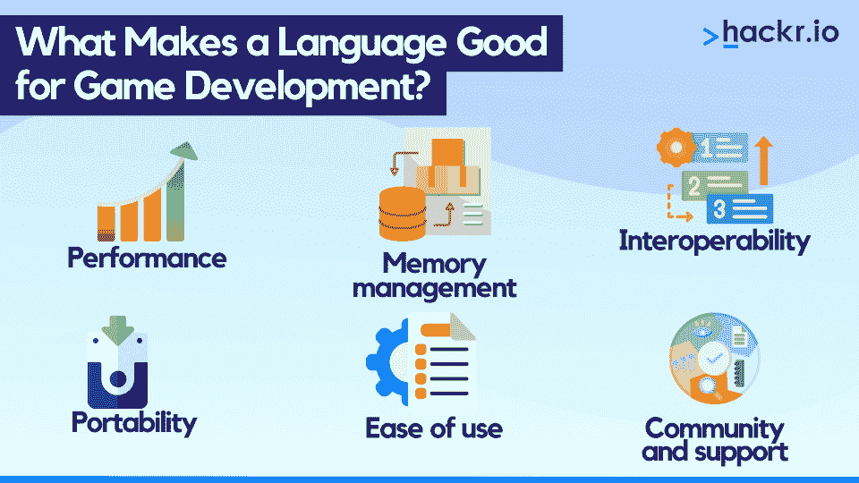
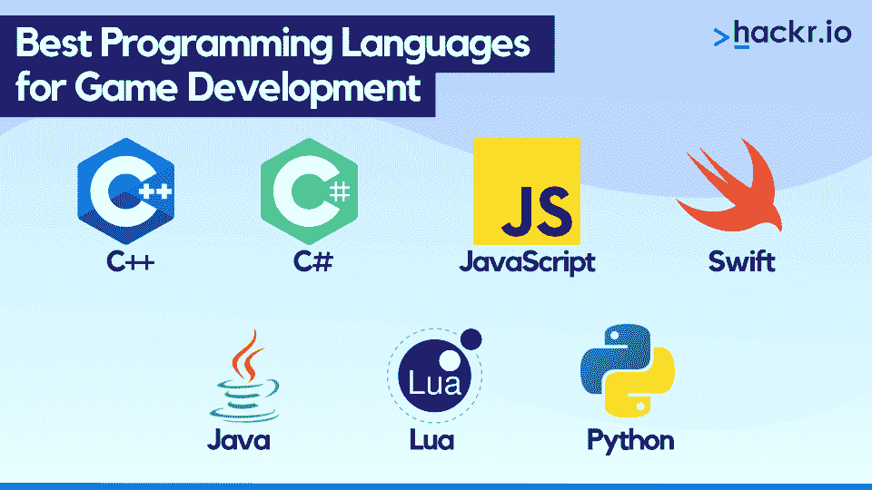

# 2023 年游戏开发的 7 种最佳编程语言

> 原文：<https://hackr.io/blog/best-programming-language-for-games>

游戏行业已经从生产简单的街机游戏发展到吸引全球数百万玩家的复杂和身临其境的体验。众所周知，该行业正在蓬勃发展，预计 2023 年视频游戏收入将超过 3650 亿美元，年增长率为 7.17%。

游戏开发过程需要投入很多，它需要创意、技术和项目管理技能的结合。但对许多人来说，这是一个非常有回报的职业，这得益于游戏开发人员拥有 8 万美元的平均年薪。

在这篇文章中，我们将回答这个问题，什么是游戏开发？我们还将考虑使编程语言适合游戏开发的各种因素，包括 2023 年游戏开发的最佳编程语言概要。

## **什么是游戏开发？**

电子游戏开发是将游戏创意转化为实际游戏供用户玩的过程。这包括提炼概念、设计界面、规划架构，以及[通过编写使其运行的代码来创建游戏](https://hackr.io/blog/how-to-code-a-game)。

通常，**游戏开发包括以下几个阶段:**

1.  概念化:概念、视频游戏设计和故事情节都是通过头脑风暴构思出来的。我们发现威尔·莱特的 [游戏设计大师](https://masterclass.pxf.io/qnrQ6q) 在这方面很擅长。
2.  **前期制作:**定义一个有时间表的项目计划&资源分配。这将涵盖目标观众、游戏机制和艺术风格等因素。
3.  **制作:**游戏开发者使用各种工具和技术，比如游戏引擎、编程语言、图形设计软件，让游戏变得栩栩如生。
4.  测试:一旦游戏制作完成，它会通过测试来识别和修复任何错误或故障。
5.  **发布:**测试完成并修复所有 bug 后，游戏在合适的平台发布，如 PC、Xbox、移动设备等。
6.  **维护:**游戏开发者提供持续的支持和维护，修复出现的任何问题，同时也添加更新或新内容。

### **游戏平台**

游戏平台是游戏程序员部署游戏和用户玩游戏的系统。**游戏平台的常见例子包括:**

*   **主机:**索尼 PlayStation，微软 Xbox，任天堂 Switch 等。这些设备有专门为游戏设计的硬件，通常还包括无线控制器。
*   **PC:** 用户在通常运行 Windows、偶尔运行 MacOS 或 Linux 的电脑系统上玩游戏。用户对硬件有更多的控制权，包括 GPU、显示器、鼠标和键盘等。
*   手机:iOS 和 Android 等平台提供针对平板电脑和智能手机等触摸屏设备优化的游戏。
*   基于网络的平台:玩家可以直接在网络浏览器中玩游戏，无需安装额外的软件。常见的基于网络的游戏平台包括装甲游戏、99 游戏和疯狂游戏。
*   **增强现实(AR) &虚拟现实(VR):** 这些使用特殊的硬件设计来创造身临其境的游戏体验，通常通过特殊的耳机和手动跟踪控制器来实现。查看[Meta Quest 2](https://geni.us/uOJb7o)一个一体化虚拟现实耳机的例子。

### **游戏引擎**

游戏引擎是让游戏开发更加便捷的开发环境或游戏框架。游戏引擎提供了一套工具和可重复使用的组件，加速了构建游戏的过程。它通常包括用于创建图形的渲染器、物理模拟引擎、脚本语言和其他功能。

游戏引擎提供了开发者不用从头开始编码就能使用的关键功能。这解放了程序员，让他们更专注于为游戏创造独特的功能。

游戏引擎提供的一些最常见的功能包括:

*   渲染 2D/3D 图形
*   动画片
*   脚本
*   内存管理
*   建立工作关系网
*   流动
*   冲突检出

我们在下面总结了一些最流行的和一些较小的游戏引擎，包括关键特性、支持的语言和用它们创建的流行游戏。

| **游戏引擎** | **热门游戏** | **支持的语言** | **特性** |
| **统一** | pokemon 去 cuphead

*   替罪羊:终极 K.O。
*   跨平台
*   强大的 2D 和 3D 图形

 | 大型且活跃的社区 | **虚幻引擎**

*   《堡垒之夜》
*   战争机器
*   《质量效应》

 |
| 支持 AR 和 VR | 高级网络和多人支持

*   活跃的开发者社区
*   **低温引擎**
*   相差甚远

 | 亨特:摊牌 | 捕食

*   多平台
*   浮力和水模拟
*   所见即所得(WYSIWYG)沙盒

 |
| **去折叠** | 瘟疫之王

*   审问
*   苹果蜘蛛
*   精灵和 2D 组件的动画

 | GUI 编辑器和可重复使用的模板 | 非常轻便

*   **戈多**
*   内生圆顶保持器
*   Blastronaut

 |
| 具有简单用户界面的可视化编辑器 | 集成了脱机文档的 IDE

*   相位器
*   一个黑暗的恐惧
*   潜艇仪表板

 | 河口岛 | HTML5 的 2D 框架

*   使用 Pixi.js 渲染库
*   **构建框**
*   立方体 2048

 |
| 蚂蚁粉碎机 | 太空射手

*   初学者友好的文档
*   **Cocos 创建者**

 |  | 

*   实时预览和调试
*   支持 2D 和 3D 游戏

 |
| **信号源 2** | 假象

*   Dota Underlords
*   半衰期:Alyx
*   跨平台

 | 高级物理模拟 | 动态照明

*   **想搞清楚选哪个发动机？结账**
*   **[统一 vs 虚幻引擎](https://hackr.io/blog/unity-vs-unreal-engine)**

 |
| 什么样的语言适合游戏开发？ | ****

*   编程语言在特性和核心功能上有所不同，有些语言有它们非常适合的领域。例如，有些语言非常适合数据科学(比如 R)，有些语言非常适合人工智能开发，比如 Python(它也非常适合游戏！).
*   让我们来看看成为视频游戏开发的好语言的一些品质。
*   **性能:**游戏开发往往涉及复杂的模拟和实时渲染，对性能要求很高。

 | **内存管理:**游戏通常需要大量内存，需要对这些内存进行有效管理，以获得出色的性能。 | **互操作性:**游戏开发者经常需要集成各种库和工具，这就延伸到了与其他语言的互操作性。

*   可移植性:游戏通常是为多种平台开发的，所以如果一种语言可以很容易地交叉编译，那会很有帮助。

 |
| **易用性:**这使得更广泛的开发者可以进行游戏开发。 | **社区和支持:**为开发人员提供对资源、库和工具的访问，使开发更快、更有效，同时也有助于调试或优化。 | **游戏开发的 7 大最佳编程语言** | ****

*   **1。C++**
*   **优点**

 |
| **缺点** | 由虚幻游戏引擎支持

*   大型在线社区/开源代码
*   跨平台语言
*   初学者很难学

 | 对于许多人来说，C++是最好的游戏编程语言之一，因为它的高性能和多功能性。它是一种静态类型和编译的语言，使它在执行速度和内存使用方面非常高效，非常适合开发游戏。 | C++还为开发者提供了对图形处理和硬件的控制，这对于创建复杂和高性能的游戏是必不可少的。作为一种面向对象的编程语言，它使开发人员能够将他们的代码组织成易于管理和维护的可重用的模块化组件。

*   游戏行业使用 C++有很长的历史，因此，有大量的资源和工具，包括库和框架，可用于 C++游戏开发。
*   **关键游戏开发特色:**
*   **游戏引擎**

 |

**热门游戏**

**平台**

## 虚幻引擎

CryEngine

戈多

《我的世界》

*   魔兽世界
*   英雄联盟
*   Windows、MacOS、Linux
*   iOS、Android
*   游戏机，Xbox，任天堂
*   **2。C#**

## **优点**

**缺点**

### 与 Visual Studio 无缝集成

| 快速高效 | 与流行的 Unity 引擎兼容 |
| 主要依靠团结

*   C#是一种现代的、面向对象的编程语言，由微软开发，是。NET 框架。这意味着您可以访问大量的库和工具来开发各种应用程序，包括游戏。
*   C#以简单、易读和易用而闻名，在游戏编程语言中很受欢迎，因为它允许开发人员专注于创建高质量的游戏，而不会被复杂的技术细节所困扰。
*   这种语言是静态类型的，这意味着它提供了强大的类型安全性并减少了运行时错误的可能性，与动态类型的语言相比，这对于游戏开发来说是非常好的。

 | C#也是一种高效的语言，性能很好，尤其是在与。NET 框架。它支持多线程和并行编程，这对于游戏开发至关重要，因为它使开发人员能够编写可以并发运行的代码，以有效地利用硬件资源。

*   **关键游戏开发特色:**

 |

**游戏引擎**

**热门游戏**

**平台**

pokemon 去 cuphead

| 星光谷 | Windows、MacOS、Linux | iOS、Android |
| 基于网络的

*   **3。JavaScript**
*   **优点**
*   **缺点**

 | 易于学习和使用

*   大量的库/框架
*   非常适合基于浏览器的游戏
*   主要是基于网络的游戏

 | 被解读影响表现

*   JavaScript 是一种为网络开发设计的高级解释编程语言。虽然它可能不是您在寻找最佳游戏编码语言时的第一想法，但由于它的多功能性，它已经成为构建各种应用程序(包括游戏)的流行语言。
*   作为一种动态类型语言，它的数据类型是在运行时确定的，而不是在编译时确定的，这使得快速编写代码更加容易。它以易于使用而闻名，具有简单明了的语法，并提供了许多内置功能，包括游戏功能。
*   总的来说，JavaScriptIt 是一种高度表达性的语言，它使开发人员能够直观、轻松地编写代码，供其他开发人员阅读和理解。

 |

### JavaScript 是一种非阻塞、事件驱动的语言，这使得它非常适合编写异步代码。这对于处理许多请求并提供快速用户体验的响应式游戏来说非常重要。此外，用 JavaScript 制作的游戏可以在任何浏览器上运行，这使得它们更容易分发。

| **关键游戏开发特色:** | **游戏引擎** |
| **热门游戏**

*   **平台**
*   相位器
*   梅龙尼斯

 | 潘达恩金

*   魔力

 |

众神会看着的

交叉代码

The language is statically-typed, meaning it provides strong type safety and reduces the likelihood of run-time errors, which is great for game development compared to dynamically-typed languages.

网络浏览器

桌面平台

| 服务器端平台 | **4。Swift** | **优点** |
| **缺点** | 构建 macOS/iOS 游戏的理想选择

*   易于学习和使用
*   大型活跃的在线社区

 | 大多限于苹果平台

*   小游戏引擎支持
*   Swift 是 Apple 提供的一种高性能编程语言，用于为 iOS、iPadOS、macOS、watchOS 和 tvOS 开发软件。作为一种现代编程语言，Swift 提供了许多特性，使其非常适合开发游戏。
*   使用 Swift 进行游戏开发的主要优势之一是其速度和性能。Swift 代码被编译成机器代码，使其能够高效运行，并成为游戏等要求苛刻的任务的良好选择。

 |

### Swift 拥有强大的类型系统和自动引用计数(ARC)，确保代码安全、可靠且易于维护，这是开发大型复杂游戏的理想选择。借助 SpriteKit 和 SceneKit 等库，开发人员可以轻松地将高质量的 2D 和 3D 图形添加到他们的游戏中。

| **关键游戏开发特色:** | **游戏引擎** |
| **热门游戏**

*   **平台**
*   iOS 和 macOS
*   Linux 操作系统

 | 基于网络的

*   **5。Java**
*   **优点**

 |

**缺点**

受 Android 游戏开发的欢迎

JVM 允许跨平台使用

对低级硬件的有限访问

| 游戏可能会有很大的文件 | Java 是一种通用且流行的编程语言。虽然它可能不是 C++或 C#争夺游戏最佳编码语言称号的明显竞争对手，但 Java 具有内置的可移植性，因为 Java 代码可以在任何安装了 Java 虚拟机(JVM)的设备上运行。这对于想要面向多个平台的游戏开发者来说非常理想。 | 作为一种面向对象的语言，Java 非常适合开发大型应用程序，包括游戏。Java 还提供套接字编程，它允许与服务器双向通信，并允许程序员方便地构建多人游戏。 |
| JavaFX 库提供了一整套处理图形和动画的工具，可供游戏开发人员使用。Java 还有一个庞大而活跃的开发人员社区，这使得寻找资源和帮助变得很容易。

*   **关键游戏开发特色:**
*   **游戏引擎**
*   **热门游戏**

 | **平台**

*   jMonkeyEngine
*   杰克 2
*   LibGDX

 | 《我的世界》

*   江湖
*   碟中谍 3
*   Windows、MacOS、Linux

 |

### 机器人

| 基于网络的 | **6。月〔t1〕** |
| **优点**

*   **缺点**
*   快速高效
*   Roblox 的基础语言

 | 易于学习和使用

*   由于缺乏人气，社区支持较少
*   虽然 Lua 不如我们列表中的一些大人物受欢迎，但它是一种快速灵活的游戏编码语言，非常适合编写游戏逻辑脚本或创建 mod 和扩展。

 |

Lua 的一个主要好处是，它使游戏开发者能够快速、轻松地修改游戏行为，而无需重新编译游戏代码。一个非常吸引人的功能！它也有助于创建游戏修改界面，让用户改变游戏的行为。

也许 Lua 最出名的地方在于它创造了广受欢迎的游戏 Roblox。这是一项了不起的成就！它也用于游戏中，允许用户创建自己的游戏和体验，并允许玩家定制。

**关键游戏开发特色:**

**游戏引擎**

| **热门游戏** | **平台** | 世界锻造公司 |
| Cocos2D | 工艺研究 | 罗布乐思

*   佳能时代
*   破碎的时代
*   Windows、MacOS、Linux

 |

### iOS、Android

| 基于网络的 | **7。Python** |
| **优点**

*   **缺点**
*   简单易学

 | 适合快速原型制作

*   大型活跃的在线社区

 |

没有硬件控制或内存管理

Python 是一种高级的解释编程语言，当需要快速原型制作时，它已经成为游戏的首选编码语言之一。凭借固有的灵活性，它非常适合希望快速迭代和改进游戏设计的游戏开发者。

Python 以其简单明了的语法而闻名，即使对于编程新手来说也很容易学习。Python 还提供了一个支持基本图形、网络和声音的大型标准库。这让开发者很容易上手游戏开发。

游戏引擎通常使用 Python 来提供脚本接口，允许开发人员创建游戏逻辑和机制，而无需用更复杂的编程语言编写代码。

| **关键游戏开发特色:** | **游戏引擎** | **热门游戏** |
| **平台**

*   支架和刀片
*   卡通镇
*   战地 2

 | Windows、MacOS、Linux

*   iOS、Android
*   基于网络的
*   **游戏开发最好的语言是什么？**

 | 如果你已经做到这一步，但仍然想知道，什么是最好的游戏编程语言？嗯，不要害怕；我们将这些信息过滤到一些常见的游戏开发用例中，让您能够快速选择最适合您项目的游戏编程语言。

*   **简单游戏最佳编程语言:** Python，Lua，JavaScript，C#
*   **初学者最佳编程语言:** Python，Lua，JavaScript，Java，C#
*   **3D 游戏最佳编程语言:** C++，C#

 |

### **AR/VR 游戏最佳编程语言:** C++，C#，JavaScript，Swift

| **PC 游戏最佳编程语言:** C++，C#，Java，Python | **主机游戏最佳编程语言:C++，C#** |
| **AAA 游戏最佳编程语言:** C++，C#

*   **安卓游戏最佳编程语言:** Java，C++，C#
*   **iOS 游戏最佳编程语言:** Swift，C++，C#
*   **网页游戏最佳编程语言:** JavaScript，Python

 | **结论**

*   选择最好的游戏编程语言对项目的成功至关重要。您选择的语言将决定您可以开发的平台、您可以使用的工具以及您可以达到的性能水平。

 |

无论您是初学者还是有经验的开发人员，了解每种语言的优缺点并选择最适合您需求的游戏开发语言是非常重要的。

在本文中，我们介绍了 2023 年游戏开发的七种最佳编程语言，包括优缺点、游戏引擎兼容性和平台支持。

如果你想深入游戏开发，那么你可能想学习 C++，因为它是市场上跨各种平台的许多大型游戏的首选。同样，C#是游戏开发中最流行的编程语言之一，因为它与 Unity 游戏引擎一起使用。

这并不是说这两种语言是城里唯一的节目。你也可以考虑 JavaScript、Swift、Java、Lua 和 Python，它们都有自己的优势和有用的特性。所以无论你打算开发什么游戏，你都应该掌握这七种游戏开发语言中的一种。

| **想成为游戏开发者？结账** | Unity 游戏开发终极指南 | **常见问题解答** |
| **1。C#和 C++哪个更适合游戏编程？**

*   C#和 C++都是游戏开发的流行语言，因为它们快速、高效，并且受到两个最大的游戏引擎的支持，C#用于 Unity，C++用于虚幻引擎。
*   对于高级程序员来说，C++是一个很好的选择，因为它是一种抽象层次较少的低级语言，提供了对硬件和图形过程的控制。如果你是初学者，C#可能是更好的选择，因为学习更容易。
*   **2。游戏开发最好的语言是什么？**

 | 这个问题没有放之四海而皆准的答案。游戏编程的最佳语言将取决于你的需求和偏好。

*   如果你想创建 AAA 游戏，你需要使用 C++或 C#，但如果你想创建 Android 游戏，也许 Java 是最好的选择。如果您不确定使用哪种语言，请仔细阅读我们关于不同用例的最佳语言部分。
*   **3。游戏开发最简单的语言有哪些？**
*   对于游戏开发来说，最容易学习的语言可能是那些语法类似于英语的语言，因为这使得它们可读性更强，对初学者也更友好。在这方面，Python 和 JavaScript 都是很好的选择。如果你确实有一些编码经验，你也应该考虑 Lua、Java 和 C#。

 | **人也在读:**

*   Windows, MacOS, Linux
*   iOS, Android
*   Web-based

 |

### **7\. Python**

| **Pros** | **Cons** |
|  |  |

Python is a high-level, interpreted programming language that has become one of the go-to coding languages for games when there’s the need for rapid prototyping. With inherent flexibility, it’s ideal for game developers that want to quickly iterate and refine their game design. 

Python is known for its simple and straightforward syntax that is easy to learn, even for newbies to programming. Python also offers a large standard library with support for basic graphics, networking, and sound. This makes it easy for developers to get started with game development.

Game engines often use Python to provide scripting interfaces that allow developers to create game logic and mechanics without writing code in a more complex programming language.

**Key Game Development Features:**

| **Game Engines** | **Popular Games** | **Platforms** |
|  |  |  |

## **What Is the Best Language for Game Development?**

If you’ve got this far, but still want to know, what is the best programming language for games? Well, have no fear; we’ve filtered the information into some common game development use cases, allowing you to quickly choose the best gaming programming language for your project.

*   **Best Programming Language for Simple Games:** Python, Lua, JavaScript, C#
*   **Best Programming Language for Beginners:** Python, Lua, JavaScript, Java, C#
*   **Best Programming Language for 3D Games:** C++, C#
*   **Best Programming Language for AR/VR Games:** C++, C#, JavaScript, Swift
*   **Best Programming Language for PC Games:** C++, C#, Java, Python 
*   **Best Programming Language for Console Games: C++, C#**
*   **Best Programming Language for AAA games:** C++, C#
*   **Best Programming Language for Android Games:** Java, C++, C#
*   **Best Programming Language for iOS Games:** Swift, C++, C#
*   **Best Programming Language for Web Games:** JavaScript, Python

## **Conclusion**

Choosing the best language for game programming is crucial to the success of your project. The language you choose will determine the platform you can develop for, the tools you have access to, and the level of performance you can achieve.

Whether you're a beginner or an experienced developer, it's important to understand the strengths and weaknesses of each language and choose the best game development language that fits your needs.

In this article, we’ve covered seven of the best programming languages for game development in 2023, including the pros and cons, game engine compatibility, and platform support.

If you want to dive into the deep end of game development, then you probably want to learn C++, as it’s the go-to for many of the biggest games on the market across various platforms. Similarly, C# is one of the most popular programming languages for game development due to its use with the Unity game engine.

That’s not to say that these two languages are the only show in town. You can also consider JavaScript, Swift, Java, Lua, and Python, each with its own set of strengths and useful features. So whatever game you plan to create, you should be all set with one of these seven languages for game development.

**Want to become a game developer? Check out **

**[The Ultimate Guide to Game Development with Unity](https://click.linksynergy.com/deeplink?id=jU79Zysihs4&mid=39197&murl=https%3A%2F%2Fwww.udemy.com%2Fcourse%2Fthe-ultimate-guide-to-game-development-with-unity%2F)**

## **Frequently Asked Questions**

#### **1\. C# Or C++, Which Is Better for Game Programming?**

C# and C++ are both popular languages for game development, as they’re fast, efficient, and supported by the two largest game engines, with C# being used on Unity and C++ with Unreal Engine.

For advanced programmers, C++ is a good option, as it is a lower-level language with fewer layers of abstraction, offering control over hardware and graphical processes. If you’re a beginner, C# may be the better option, as learning is easier.

#### **2\. What Is the Best Language for Game Development?**

There is no one size fits all answer to this question. The best language for game programming will depend on your needs and preferences.

If you want to create AAA games, you’ll need to use C++ or C#, but if you want to create Android games, perhaps Java is the best choice. If you’re unsure which to use, look closely at our section on the best languages for different use cases.

#### **3\. What Are the Easiest Languages for Game Development?**

The easiest languages to learn for game development are probably those with a syntax similar to English, as it makes them more readable and beginner-friendly. Python and JavaScript are both great choices in this regard. If you do have some coding experience, you should also consider Lua, Java, and C#.

**People are also reading:**