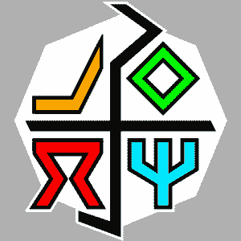
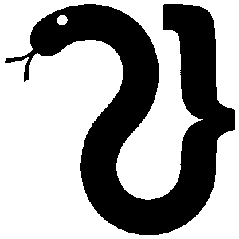
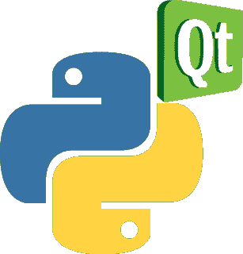

# 每个 Python 开发人员都必须知道的 7 个最佳 Python 编译器

> 原文：<https://hackr.io/blog/best-python-compilers>

把用一种编程语言编写的代码翻译成另一种语言的计算机程序叫做编译器。Python 是发展最快的编程语言中的佼佼者。因此，可以满足不同项目需求的 Python 编译器并不缺乏。

首先，编译器是将高级编程语言编写的源代码转换为低级编程语言(如机器代码)的程序，用于创建可执行程序。

## 最佳 Python 编译器

虽然 CPython 编译器(--cum-interpreter)是事实上的 Python 编译器，因为它属于 Python 的参考实现，即 CPython，但还有其他几个开发人员喜欢使用的 Python 编译器。以下列举了 7 个最佳案例:

### **1\. Brython**

支持–Python 3 到 3.7

Brython 被称为“客户端 web 编程的 Python 3 实现”，是一种流行的 Python 编译器，可以将 Python 代码转换为 JavaScript 代码。为了适应 HTML5 环境，Brython 附带了一个 DOM 对象和事件的接口。

Brython 是浏览器 Python 的缩写。它拥有广泛的功能，从创建简单的文档元素和拖放到 3D 导航。Python 编译器在 Firefox 中的表现要比在 Google Chrome 中好得多。

Brython 不仅支持所有现代浏览器，还支持移动 web 浏览器。Python 编译器附带了一个 JavaScript 控制台，可以用来评估一些 JS 程序的执行时间，与编辑器中的等效 Python 进行比较。

根据 Brython 的创建者和首席开发者 Pierre Quentel 的[官方博客，Brython 比 Pypy.js 和 Skulpt 要快得多。在某些情况下，Python 编译器甚至比 Python 参考实现(即 CPython)更快。](https://brythonista.wordpress.com/)

Brython 支持 Python 3 的大部分语法，比如理解、生成器和导入。它还为 CPython 发行版中的几个模块提供支持，并附带了与 DOM 元素和事件交互的库。

Brython 也支持 HTML5/CSS3 的最新规范，Python 编译器可以使用流行的 [CSS 框架](https://hackr.io/blog/best-css-frameworks),如 BootStrap3 等。

### **2。玩偶**

支持–Python 2.6、2.7、3.3 到 3.7

Nuitka 是一个源代码到源代码的 Python 编译器，它获取 Python 代码并将其编译成 C/C++源代码或可执行文件。即使您的机器上没有运行 Python，也可以使用 Nuitka 开发独立的程序。

Nuitka 完全用 Python 编写，允许使用各种 Python 库和扩展模块。Python 编译器可用于 FreeBSD、Linux、macOS X、NetBSD 和 Windows 平台，并获得 Apache 许可证 2.0 版的许可。

对于那些喜欢用它来开发涉及数据科学和机器学习的项目的人来说，Nuitka 也可以和 Anaconda 一起使用。

### **2。PyJS**

支持–最高 Python 2.7

对于那些希望编写 Python 代码并在 web 浏览器中执行的人来说，PyJS 是一个首选。PyJS 编译器将 Python 代码翻译成等价的 JavaScript 代码，以便它可以在 web 浏览器中执行。

PyJS 的一个重要方面是，它附带了一个 AJAX 框架，填补了不同 web 浏览器对 JS 和 DOM 支持之间的空白。为了生成等价的 JS 代码，PyJS 利用 Python 的抽象语法树。

可以使用 PyJS 桌面模块将 Python web 应用程序源代码作为独立的桌面应用程序(在 Python 下运行)运行。有趣的是，一些 Unix 系统预装了 PyJS 和 PyJS 桌面版本。

尽管 Python 和 JavaScript 之间存在差异，但在这两种流行的编程语言中，大多数数据类型是相同的。在使用 PyJS 时，一些 Python 数据类型被转换成定制对象，比如列表。

PyJS 是一个轻量级应用程序。此外，它可以直接从 web 浏览器使用，并允许从 web 浏览器 JS 控制台执行程序。

PyJS 编译器还提供了对运行时错误的运行时支持。由于可以在 JS 代码中嵌入 Python 代码，JS 开发人员可以使用 PyJS 在纯面向对象的范例中设计和开发应用程序。

### 推荐 Python 课程

[用 Python 完成从零到英雄的 Python boot camp](https://click.linksynergy.com/deeplink?id=jU79Zysihs4&mid=39197&murl=https%3A%2F%2Fwww.udemy.com%2Fcourse%2Fcomplete-python-bootcamp%2F)

### **3。蜕皮**

支持–Python 2.4 到 2.6

另一个流行的 Python 编译器是 Shed Skin。它将静态类型的 Python 程序转换成等价的纯 C++程序。静态类型化意味着使用的变量应该只推断出一种数据类型。

Shed Skin 不支持一些常见功能，例如使用嵌套函数和定义接受不同数量参数的函数。只有一些标准 Python 库函数可用于 Shed 皮肤。

作为一个实验性的编译器程序，Shed Skin 提供将静态类型的 Python 程序翻译成优化的 C++代码，但有几个限制。此外，Shed Skin 不能扩展到超过几千行代码。

如果代码中有 Shed Skin 不支持的模块，您必须删除它并添加普通代码来复制所需的功能。

尽管 Shed Skin 还处于实验阶段，但它可以生成独立的程序或扩展模块，这些模块可以导入并用于大型 Python 程序中。

使用蜕皮的最大优点是它允许显著的性能提升。这主要是因为 Python 编译器将内置的 Python 数据类型重新实现到了自己的一组类中，这些类是用高效的 C++代码实现的。

### **4。雕塑**

支持–最高 Python 3.3

Skulpt 用 JavaScript 编写，在 MIT 许可下可用，它提供了一个真正的环境，编译后的代码以 JS 形式执行。

因为 Skulpt 是 Python 的浏览器内实现，所以在 web 浏览器中运行 Python 不需要额外的处理、插件或服务器端支持。任何用 Skulpt 编写的 Python 代码都直接在 web 浏览器中执行。

对于希望开发一个 web 应用程序的开发人员来说，Skulpt 是一个很好的选择，该应用程序允许用户在 web 浏览器中运行 Python 程序，同时保证后台服务器的安全。流行的 Python 编译器也可以轻松嵌入到现有的博客或网页中。

对于定制集成，可以将 Skulpt 代码添加到 HTML 中。您还可以教 Skulpt 如何导入您自己的定制模块，以获得更多的控制。虽然 Skulpt 将 Python 代码翻译成 JS 代码，但它并不便于运行后者。

### **5。转加密**

支持–Python 3 到 3.7

另一个流行的 Python 编译器是 Transcrypt。它允许将相当广泛的 Python 子集编译成紧凑的、可读的、易于调试的 JavaScript 代码。Python 编译器遵循简单而强大的语法，不需要任何额外的扩展。

Transcrypt 预编译为快速、可读的 JS 代码，可以使用 sourcemaps 从 Python 源代码中调试这些代码。轻量级 Python 编译器支持使用[i:j:k]矩阵进行切片，以及使用+、-、*和/运算符进行向量运算。

Transcrypt 内置了一个 linter、一个 minifier 和一个静态类型验证器。因此，Python 编译器改善了全面项目中的团队合作。除了提供对任何 JS 库的无缝访问，Transcrypt 还能够在 Node.js 上运行。

由于支持分层模块、局部类和多重继承，Transcrypt 拥有灵活和稳定的整体结构。

### **6。WinPython**

支持–最高 Python 3.7

WinPython 是专门为 Windows 操作系统创建的 Python 发行版。CPython 的早期版本不是为 Windows 设计的，因此，它们有很多 bug。WinPython 就是作为这个问题的解决方案而诞生的。

尽管目前的 CPython 迭代在 Windows 操作系统上非常稳定，但 WinPython 有几个独有的特性。因为 WinPython 是 Python 的自包含发行版，所以您只需下载并解压缩它就可以开始了。

WinPython 还预装了一些[最流行的数据科学和机器学习 Python 库](https://hackr.io/blog/top-data-science-python-libraries)，比如 NumPy、Pandas 和 SciPy。因此，允许您直接使用这些 Python 库。

WinPython 附带了许多捆绑特性，在大多数情况下，这些特性并不是必需的，例如 C 和 C++编译器。这可能是一个严重的限制，因为没有选项来选择和下载那些需要的特性。

尽管如此，WinPython 在一个零包选项中可用，该选项只附带 Python 编译器，仅此而已。

## **结论**

这就完成了我们最好的 7 个 Python 编译器的列表。因为它们中的每一个都是根据特定的需求设计的，所以您可以使用它们来满足不同的需求。在编程中，程序员知道的越多越好。所以，今天就开始吧！

查看这些[最好的 Python 教程](https://hackr.io/tutorials/learn-python?ref=blog-post)来提高你的技能。你同意这个名单吗？哪个 Python 编译器应该或不应该在列表中。请在评论中告诉我们！

**人也在读:**