# 2023 年 10 门最佳 Python 在线课程[推荐]

> 原文：<https://hackr.io/blog/best-python-courses>

Python 不仅是最流行的编程语言之一，也是最容易学习的语言之一。这也是获得稳定、利润丰厚的编程工作的绝佳选择，因为 Python 编程是许多企业的共同需求。

虽然对于数据科学和自动化来说， [Python 编程语言](https://hackr.io/blog/python-programming-language)是首选，但它也可以用于为各种平台构建一系列应用程序。如果你对学习 Python 感兴趣，你可以从 Python 课程开始你的 Python 培训。

需要帮助决定最好的 Python 课程吗？不用担心；我们整理了一份最佳 Python 课程的列表，包括优缺点、证书状态和费用。

虽然我们将涵盖 10 个课程，但以下是我们挑选的最佳 Python 课程的前三名:

查看以下最佳 Python 课程，开始您的 Python 专家之旅！

## **最佳 Python 在线课程**

这里有十个初级 Python 在线课程，可以帮助你迅速加入 Python 职业培训:

[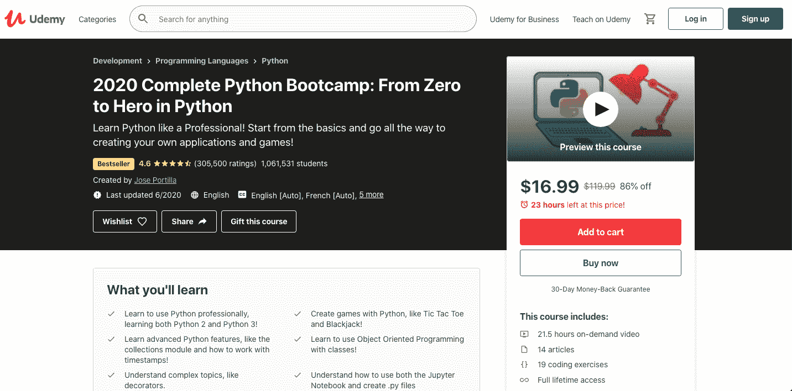](https://click.linksynergy.com/deeplink?id=jU79Zysihs4&mid=39197&murl=https://www.udemy.com/course/complete-python-bootcamp/)

如果你是初学者，但希望像专业人士一样学习 Python，那么 Udemy 的完整 Python 训练营:从零到英雄就是为你准备的课程。这是一门很受欢迎的 Udemy 课程，有超过一百万的学生注册了这门课程，他们渴望学习 Python 2 和 3。它涵盖了开始构建项目所需的一切，是初学者最好的 python 课程之一。

该课程在超过 410，000 条评论中的平均评分为 4.6 星。

Python 课程由何塞·波尔蒂利亚负责策划，并提供另外 9 种语言，包括法语、德语、西班牙语和英语。这个在线 Python 课程包括实践学习，因为学生可以实时观看讲师代码。

**涵盖的主题:**

*   高级 Python 模块
*   对象和数据结构基础
*   比较运算符
*   装修工和发电机
*   错误和异常处理
*   方法和功能
*   模块和包
*   面向对象编程
*   Python 2 对 Python 3
*   Python 语句
*   设置 Python

**先决条件:**互联网连接。

**评级:** 4.6

**持续时间:** 21.5 小时

**证书:**是

**优点:**实惠、全面、受欢迎

反对意见:一些评论者认为编码解释含糊不清。

[查看课程](https://click.linksynergy.com/fs-bin/click?id=jU79Zysihs4&offerid=1045023.20111&type=3&subid=0)

[**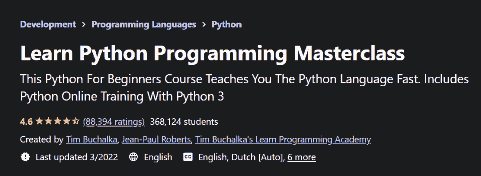**](https://click.linksynergy.com/deeplink?id=jU79Zysihs4&mid=39197&murl=https://www.udemy.com/course/python-the-complete-python-developer-course/)

Python 编程大师班由 Python 资深人士、40 年软件开发者 Tim Buchalka 教授。梅赛德斯-奔驰、Paypal 和 IBM 等主要品牌的开发人员通过 Buchalka 的一些课程获得了经验。

学生们尤其喜欢 Buchalka 充满激情的教学风格，从近 90，000 次平均 4.6 分的评分中可以看出这一点。

完整的 Python 大师班课程提供了 70 小时的点播视频、12 篇文章、15 个可下载资源、34 个编码练习和终身访问。此外，您还可以通过手机或电视访问课程。

**涵盖的主题:**

*   条件语句和循环
*   字符串、变量和类型
*   解释二进制数字系统
*   用 Python 读写文件
*   列表和元组
*   Python 中的模块和函数
*   程序流控制介绍
*   Python 字典和集合
*   为 Linux/Mac/Windows 设置 Python

**先决条件:**无

**评级:** 4.6

**持续时间:** 70 小时

**证书:**是

**优点:**彻底；吸引人；负担得起的

反对意见:根据一些评论家的观点，快节奏和对初学者来说太快了

[查看课程](https://click.linksynergy.com/fs-bin/click?id=jU79Zysihs4&offerid=1045023.20107&type=3&subid=0)

[**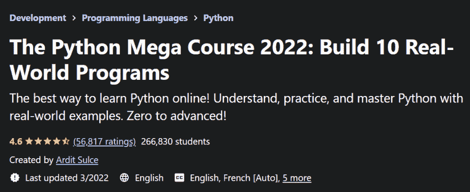**](https://click.linksynergy.com/deeplink?id=jU79Zysihs4&mid=39197&murl=https://www.udemy.com/course/the-python-mega-course/)

Python 大型课程:构建 10 个真实世界的应用程序从 Python 编程语言的基础开始，然后继续教育学习者创建 10 个专业的真实世界的 Python 程序。

该课程由 Ardit Sulce 创建，涵盖各种主题，但在完成后为您提供有形投资组合项目的广泛项目中大放异彩。该课程教你完成一个数据可视化应用程序，自动电子邮件应用程序，积极报价的情绪应用程序，等等。

初级 Python 课程提供了 33 个小时的点播视频、81 篇文章、41 个可下载资源和多达 145 个编码练习。Python Mega 课程是实用性和动手学习的终极课程。

**涵盖的主题:**

*   Python 和 IDE
*   字符串、浮点、属性
*   环
*   条件和功能
*   文件、循环、函数和条件
*   带 Tkinter 的 GUI
*   Python 用于交互式数据可视化
*   利用 OpenCV 进行图像和视频处理
*   使用 Python 与数据库交互
*   [Python 库](https://hackr.io/blog/top-data-science-python-libraries)，模块和包
*   网页抓取

**先决条件:**无

**评级:** 4.6

**持续时间:** 33 小时

**证书:**是

**优点:**实用，大量的练习机会

根据一些学生的说法，对初学者来说是高级的

[查看课程](https://click.linksynergy.com/fs-bin/click?id=jU79Zysihs4&offerid=1045023.20108&type=3&subid=0)

[**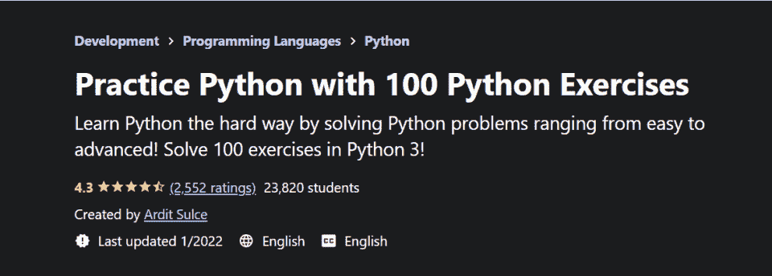**](https://click.linksynergy.com/deeplink?id=jU79Zysihs4&mid=39197&murl=https://www.udemy.com/course/python-video-workbook/)

你是通过做中学得最好的人吗？那么，这个 Python 课程练习集是一个很好的选择。本 Python 课程中的练习涵盖了从简单到专业的各种技能，非常适合所有级别的 Python 用户。

所有解决方案都包含在 Python 课程中，以便您可以评估自己的方法和解决问题的技能。除了 145 篇文章和 48 个可下载资源之外，Python 课程还提供了 2 小时的点播视频。

如果你正在寻找一份 Python 开发人员的工作或者准备一次 [Python 面试](https://hackr.io/blog/python-interview-questions)，这个课程绝对值得你花费时间和精力。

**涵盖的主题:**

*   数据结构和数据类型
*   错误管理
*   文件管理
*   迭代和循环
*   局部变量与全局变量
*   解决问题的方法
*   Python 基础
*   Python 最佳实践
*   使用字典

**先决条件:**Python 的基础知识。

**评级:** 4.3

**持续时间:** 2 小时

**证书:**是

**优点:**非常适合 Python 实践

**缺点:**不包括算法练习

[查看课程](https://click.linksynergy.com/deeplink?id=jU79Zysihs4&mid=39197&murl=https://www.udemy.com/course/python-video-workbook/)

[**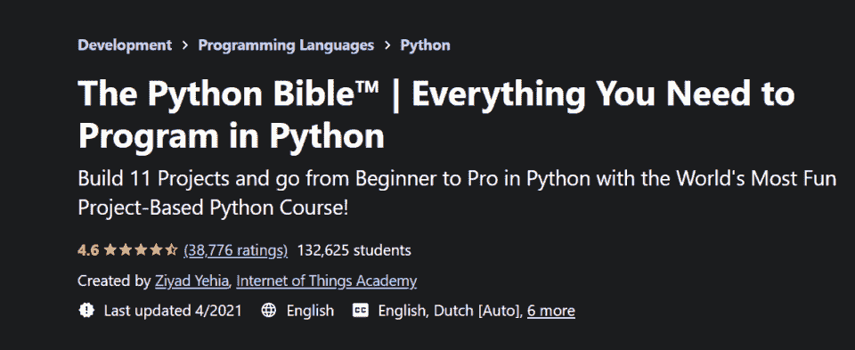**](https://click.linksynergy.com/deeplink?id=jU79Zysihs4&mid=39197&murl=https://www.udemy.com/course/the-python-bible/)

如果你喜欢有趣的基于项目的课程，Udemy 的 Python 圣经课程可能是个不错的选择。

超过 38，000 名评论者给了 Python 圣经 4.6+的星级评分，该书因其在整个课程中强有力的组织和直观、逻辑的教学顺序而广受欢迎。

付费 Python 课程包括 11 个编码练习、9 小时的点播视频、4 篇文章、3 个可下载资源和终身访问。

**涵盖的主题:**

**先决条件:**笔记本电脑和互联网

**评级:** 4.6

**持续时间:** 9 小时

**证书:**是

**优点:**价格合理，基于项目

**反对意见:**导师仓促的解释

[查看课程](https://click.linksynergy.com/fs-bin/click?id=jU79Zysihs4&offerid=1045023.20110&type=3&subid=0)

[**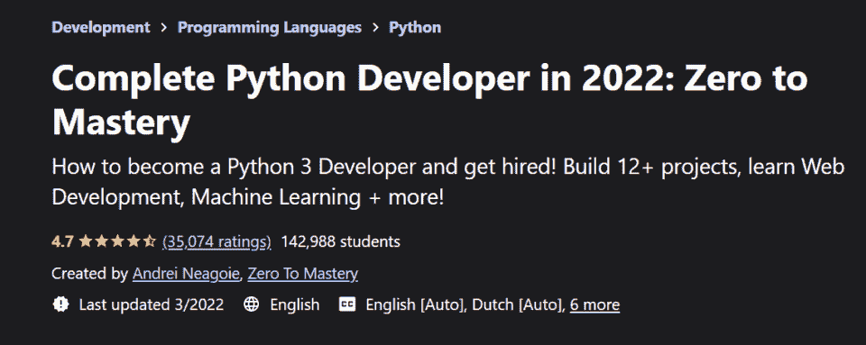**](https://click.linksynergy.com/deeplink?id=Qouy7GhEEFU&mid=39197&murl=https%3A%2F%2Fwww.udemy.com%2Fcourse%2Fcomplete-python-developer-zero-to-mastery%2F)

Udemy 的完整 Python 开发人员课程是那些渴望获得最新版本 Python (Python 3.1)的实践经验的人的另一个很好的选择。该课程由讲师 Andrei Neagoie 提供，教你如何创建 12 个以上的项目来建立你的投资组合——非常适合申请 Python 职位。该课程还涵盖了机器学习主题，如果你对人工智能感兴趣，这将使你在竞争中占据优势。

**涵盖的主题:**

*   机器学习
*   数据科学
*   排除故障
*   Python 3.1(最新)
*   自动化
*   图像处理
*   函数式编程
*   装修工和发电机
*   错误处理

**先决条件:**无

**评级:** 4.7

**持续时间:** 30 小时

**证书:**是

**优点:**人工智能内容、实际项目经验、作品集

缺点:沉重的视频内容，一些评论者认为已经过时

[查看课程](https://click.linksynergy.com/deeplink?id=Qouy7GhEEFU&mid=39197&murl=https%3A%2F%2Fwww.udemy.com%2Fcourse%2Fcomplete-python-developer-zero-to-mastery%2F)

**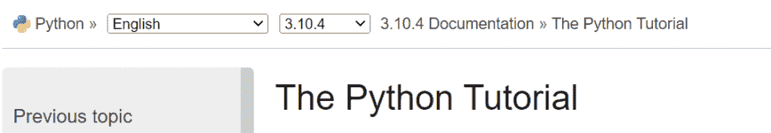**

有什么地方比源码更适合学习 Python？Python 教程是一个关于 Python 的综合性教育资源，由 Python 本身提供。而且，完全免费！

官方 Python 教程并没有涵盖每一个流行的 Python 特性。相反，它对 Python 的几个最强大的特性提供了详尽的解释。

在完成 Python 教程后，读者将获得新的知识来阅读和编写 Python 模块和程序。本教程还详细介绍了如何使用 [Python 解释器](https://hackr.io/blog/python-interpreters)。Python 官方教程中提到的所有例子都是独立的，可以离线阅读。

**涵盖的主题:**

*   标准 Python 库的简要介绍
*   控制流
*   数据结构
*   错误和异常
*   Python 基础
*   输入和输出
*   使用 pip 管理包
*   Python 模块

**先决条件:**无

**评级:**不适用

**持续时间:**自定进度

**证书:**否

**优点:**逻辑结构和用户友好的格式

**缺点:**干物质含量；没有证书

[查看教程](https://docs.python.org/3/tutorial/index.html)

[**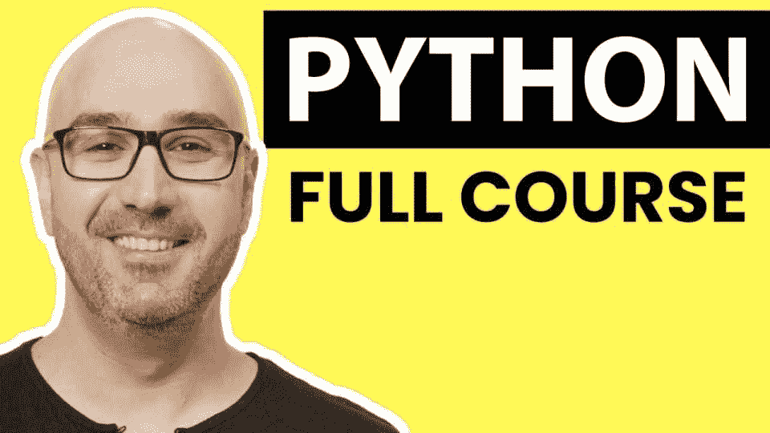**](https://www.youtube.com/watch?v=_uQrJ0TkZlc)

Mosh 编程是学习编程的最佳 YouTube 渠道之一，其超过 240 万的用户数量就证明了这一点。

Python 初学者教程是 YouTube 上的一个综合视频课程，解释了 Python 编程语言的各个方面。观众评论说，这门课程对他们的知识甚至职业生涯有多大帮助。

除了涵盖广泛的 Python 主题，教育视频还详细介绍了几个 DIY 项目，这些项目将帮助您更好地理解到目前为止您所学的概念。最精彩的部分？该课程完全免费观看。

**涵盖的主题:**

*   字典
*   遗产
*   For 循环和嵌套循环
*   安装和设置 Python 3
*   类型转换、格式化字符串和算术运算
*   模块和包
*   运算符优先级
*   [PyPi](https://pypi.org/) 和 PIP
*   Python 备忘单
*   Python 代码执行

**先决条件:**无

**评级:**不适用

**持续时间:** 6 小时

**证书:**否

**优点:**免费，全面

**缺点:**没有证书

[**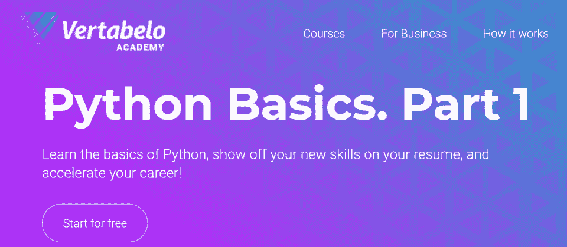**](https://academy.vertabelo.com/course/python-basics-part-1)

由 Vertabelo Academy 提供的 Python 基础(第 1 部分)包含 95 个交互式练习，用户可以在其中与同学讨论和评论内容。

该课程提供了许多好处，包括终身访问、协作功能和 30 天退款保证。

完成 Python 基础第 1 部分课程所需的总时间估计只有 10 个小时。因此，当您时间紧迫时，这是一个很好的 Python 学习选择。Python 课程还提供结业证书，以证明你的真诚努力。

**涵盖的主题:**

*   循环和代码功能
*   变量和函数
*   条件语句和决策
*   Python 中的数学
*   编写可重用的代码

**先决条件:**无

**评级:**不适用

**持续时间:** 10 小时

**证书:**是

**优点:**经济实惠、协作、用户友好

反对意见:需要更多练习的解释

边学边获得认证！

[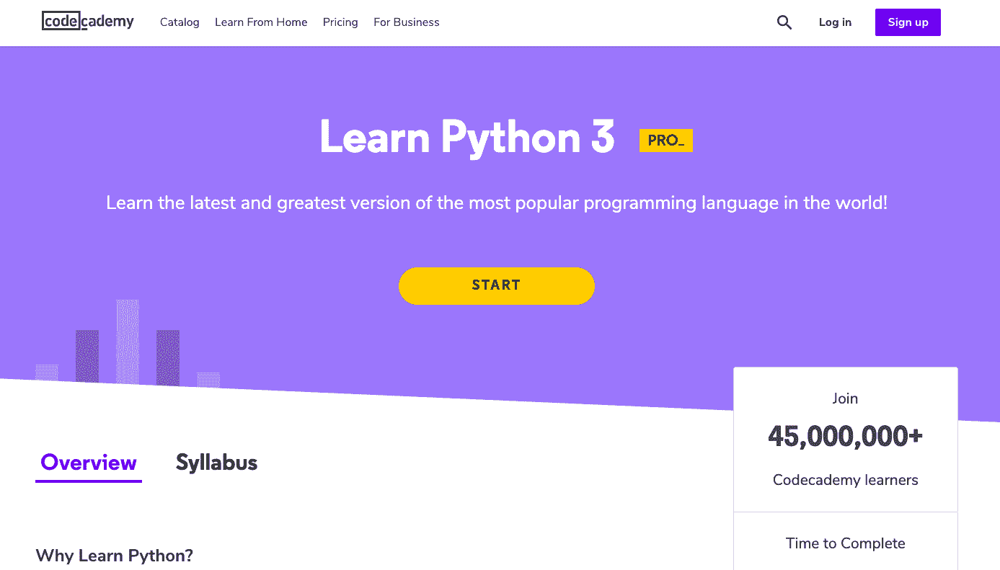](https://www.pntrac.com/t/TUJGR0lLR0JHRklKSkdCR0ZISk1N?url=https%3A%2F%2Fwww.codecademy.com%2Flearn%2Flearn-python-3)

来自 Codeacademy 的 Python 3 教程对于任何想要开始使用最新版本的 Python 编程语言的人来说都是一个很好的选择。

25 小时的付费在线 Python 课程没有任何先决条件，这使它成为初学者的绝佳选择。这是一个很好的 Python 入门课程，通过互动课程、项目工作、视频和多项选择测验，涵盖了最新的 Python 3 基础和概念。这是学习 Python 编程语言入门知识的一站式商店。

**涵盖的主题:**

*   使用 Python 的文件操作
*   函数、函数参数和控制流
*   Python 中的循环
*   Python 模块和代码挑战
*   Python 语法
*   Python 字典结构
*   使用列表
*   Python 数据类型

**先决条件:**无

**评级:**不适用

**持续时间:** 25 小时

**证书:**是

**优点:**组合项目展示新技能；负担得起的

反对意见:一些评论家认为这门课程不够复杂。

[查看课程](https://www.pntrac.com/t/TUJGR0lLR0JHRklKSkdCR0ZISk1N?url=https%3A%2F%2Fwww.codecademy.com%2Flearn%2Flearn-python-3)

[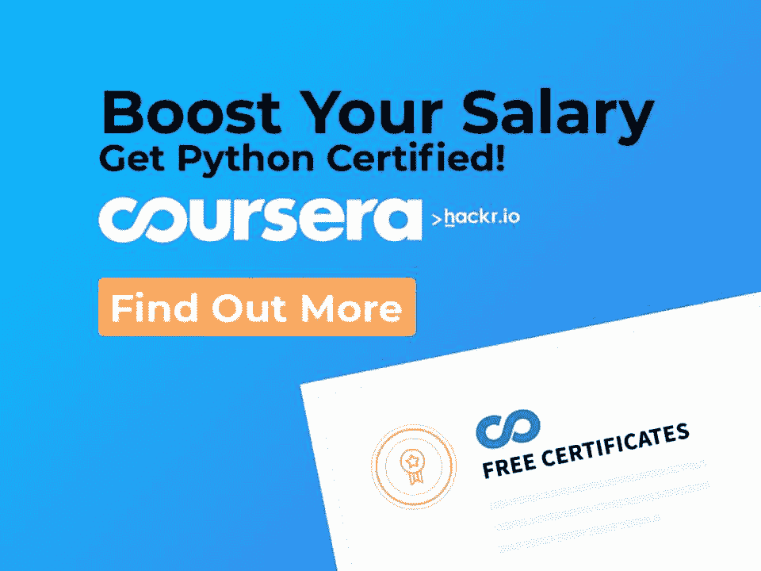](https://imp.i384100.net/jW4ox0)

## **结论**

任何对学习 Python 感兴趣的人都有丰富的教育选择。从 Udemy 的全面 Python Bootcamp 到基于项目的 Python 圣经，完美的 Python 课程在等着你。

在线上了 Python 课程后，你可能会寻求更多学习 Python 的机会？查看我们为初学者准备的很酷的 [Python 项目列表](https://hackr.io/blog/python-projects)和[最佳 Python 认证](https://hackr.io/blog/python-certification)。

### 热门推荐 Python 课程

[用 Python 完成从零到英雄的 Python boot camp](https://click.linksynergy.com/deeplink?id=jU79Zysihs4&mid=39197&murl=https%3A%2F%2Fwww.udemy.com%2Fcourse%2Fcomplete-python-bootcamp%2F)

**人也在读:**

## **常见问题解答**

#### **1。Python 选哪个课程最好？**

Python 的最佳课程取决于您的需求和偏好。例如，如果你喜欢通过各种媒介学习，并且是一个初学者，你可能会喜欢完整的 Python 训练营。

#### **2。Python 有哪些课程？**

网上有很多 Python 课程，或者是免费的 Youtube 视频，平价的 Udemy 和 Coursera 课程，或者是 Python 的免费资源。

#### **3。一门 Python 课程多少钱？**

Python 课程价格不一。这份清单上的东西从免费到 100 美元不等。

#### **4。网上最好的 Python 课程是哪个？**

我们的意见？我们喜欢 [Python 圣经](https://click.linksynergy.com/deeplink?id=jU79Zysihs4&mid=39197&murl=https://www.udemy.com/course/the-python-bible/),因为它为学习者通过项目应用他们的知识提供了广泛的机会。这也给你提供了充足的机会，在你找工作的时候增加你的投资组合。