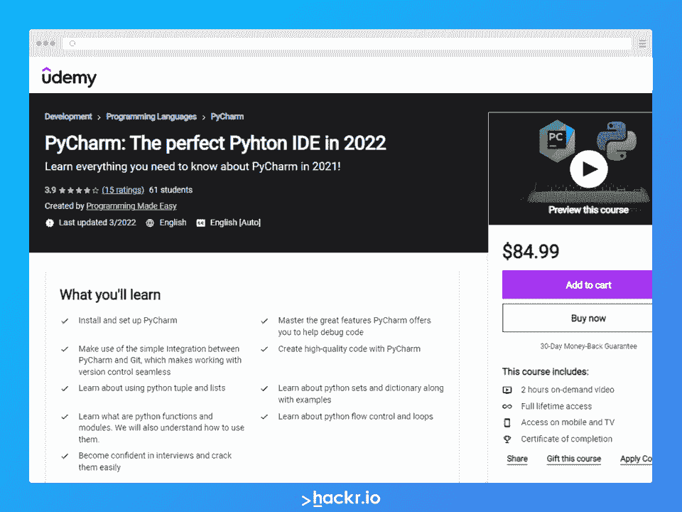
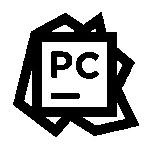
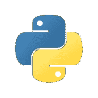
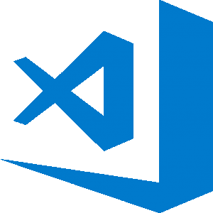
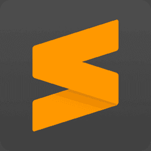
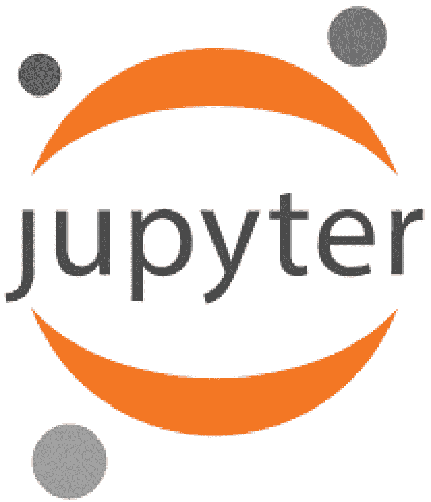
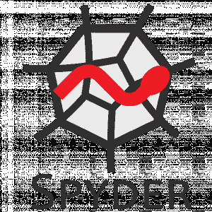
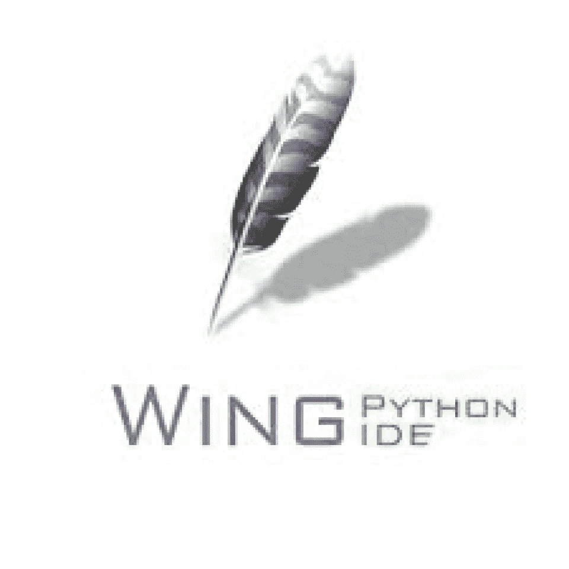

# 10 个最佳 Python IDE 和代码编辑器[更新指南]

> 原文：<https://hackr.io/blog/best-python-ide>

由创始人吉多·范·罗苏姆于 1991 年推出的 [Python](https://hackr.io/blog/python-programming-language) 通过语法强调代码可读性，允许开发者用更少的代码行创建更多的代码。这就是为什么如果你是编程新手，通常建议你从 Python 开始。如果你想提高开发 Python 代码的效率，你需要最好的 Python IDE 或 Python 编辑器。

由于全世界 Python 开发人员和程序员的贡献，Python 语言在过去几年里有了巨大的发展。它现在是使用最广泛的编程语言之一，有大量的[包、库和框架](https://hackr.io/blog/best-python-libraries)。

Python 是一种多功能语言，可用于各种应用，包括 Blender (3D 建模软件)、机器学习/人工智能和 web 开发等。由于 Python 经常用于脚本编写，所以像 notepad++甚至普通记事本这样的轻量级文本编辑器都是有用的 Python 工具。

Python 解释器可用于大多数操作系统，包括 Linux、macOS 和 Windows。如果你计划从事更大的项目，我们推荐一个专用的代码编辑器或者一个集成开发环境。Python IDEs 和 Python 代码编辑器提供了它们自己独特的特性和用户界面。

在本文中，我们将介绍一些最流行的 Python IDEs 和 Python 编辑器，考虑它们的优缺点和用例。其中许多还提供免费层，所以如果您刚刚开始，您将能够为 Python 选择最好的免费 IDE。

| **精选 Python ide&编辑** |
| Pycharm :非常流行、强大、功能丰富的 Python IDE。[了解更多](https://click.linksynergy.com/deeplink?id=jU79Zysihs4&mid=39197&murl=https%3A%2F%2Fwww.udemy.com%2Fcourse%2Fpycharm-the-perfect-pyhton-ide-in-2021%2F&u1=blog%2Fbest-python-ide_amcid-pPFbP2qe2lsOxFsixUBQx) |
| **Visual Studio 代码**:轻量级可扩展的代码编辑器。[了解更多](https://www.udemy.com/course/learn-visual-studio-code-v/) |
| **Jupyter 笔记本**:数据科学 IDE，轻松运行模拟和共享数据。[了解更多](https://www.udemy.com/course/jupyter-notebook-for-data-science/) |

想掌握 Python 吗？来自 Udemy 的完整 Python 训练营可能是你的一个很好的敲门砖。也可以看看我们关于[最佳 Python 课程](https://hackr.io/blog/best-python-courses)的文章，帮助你成为 Python 专家。

在继续之前，让我们首先深入了解什么是 ide 和代码编辑器，然后我们将讨论创建一个良好的开发环境对这些 Python 工具的要求。

## **什么是 ide 和代码编辑器？**

无论您是第一次学习 CS 课程的大学新生，还是软件工程师，您都需要一个 IDE 或代码编辑器来有效地编辑、阅读和调试代码。

### 推荐 Python 课程

[用 Python 完成从零到英雄的 Python boot camp](https://click.linksynergy.com/deeplink?id=jU79Zysihs4&mid=39197&murl=https%3A%2F%2Fwww.udemy.com%2Fcourse%2Fcomplete-python-bootcamp%2F)

集成开发环境(IDE)是帮助程序员高效开发软件的软件应用程序。它通过将常见的开发工具(如软件编辑、构建、测试、调试和打包)组合在一个易于使用的图形用户界面(GUI)中，提高了开发人员的工作效率。其他流行的特性包括代码重构、代码搜索、代码自动完成和持续集成/持续部署(CI/CD)。

ide 还可以提供更多的功能，这些功能通常会因 IDE 而异。

虽然代码编辑器类似于文本编辑器，但它们通过复杂的内置功能来简化和加速代码开发。有时代码编辑器会被误认为是 ide，但两者的主要区别在于 ide 提供了更强大的工具来简化编码过程。

## **十大最佳 Python IDE & Python 代码编辑器**

为了帮助您选择最佳的 Python IDE 或代码编辑器，我们做了大量的研究，根据受欢迎程度、功能、用户数量和用户反馈列出了十大 Python IDE 和代码编辑器。我们还确保在这个列表中包括 ide 和编辑器，以满足初学者和专业开发人员的需求。

为了确保每个 ide 和编辑器都能胜任这项任务，我们花了一些时间来测试他们的能力。这包括在 Windows、macOS 和 Linux 平台上安装每一个，然后运行一系列 Python 脚本，从小的单个文件到多文件夹包。这有助于我们确认列表中的每个选项都符合它们的设计目标——无论是帮助初级开发人员还是让专业人员提升他们的日常编码体验。

### **1\. Pycharm**

**平台** : Linux/macOS/Windows

**官网**:【https://www.jetbrains.com/pycharm/ 

**类型** : IDE

由 ***JetBrains、*** [Pycharm](https://hackr.io/blog/what-is-pycharm) 开发，是最流行的 Python ide***之一。凭借快速安全的代码重构等生产力工具，Pycharm 在竞争中脱颖而出。它有三个版本:Apache 许可的社区版、教育(Edu)版和专有专业版。前两个版本是开源的，免费的，但是你需要为专业版付费。***

免费社区版本非常适合初学者，因为它提供了各种功能，如语法高亮、自动完成和实时代码验证。付费版本提供了高级功能，如完整的数据库管理，以及一系列特定的框架和 web 开发工具。

**优点**:

*   积极的社区支持
*   许多有用的插件和生产力快捷方式
*   无需任何外部要求即可执行、编辑和调试 Python 代码

**缺点**:

*   专业版比较贵
*   免费版提供的功能比付费版少
*   社区版本不允许使用其他编程语言

### **2。Pydev**

**平台**:GNU/Linux/MAC OS/Windows/Solaris

**官网**:【https://www.eclipse.org/】T2；【http://pydev.org/ 

**类型** : IDE

Eclipse 是一个免费的 IDE，历史上是为 Java 语言设计的。不过，多亏了插件或扩展系统，你可以在其他语言中使用它，包括 Python。

您将需要 Pydev 插件来将 Eclipse 用作 Python IDE，从而允许您使用 Python、Jython 或 IronPython 进行开发。Pydev 还使用高级推理技术来提供像自动完成和代码分析这样的特性。

作为 Python 最好的 ide 之一，Eclipse 也提供了这些特性:调试器、Django、交互式控制台、基本语法高亮、代码覆盖等等。

**优点**:

*   简单易学且功能丰富
*   拥有一个庞大而活跃的社区

**缺点**:

*   用户界面并没有太不现代
*   插件可能不稳定

### **3。空闲**

****

**平台** : Linux/macOS/Windows

**官网**:【https://docs.python.org/3/library/idle.html 

**类型** : IDE

IDLE，即集成开发和学习环境，是一个免费的 IDE，与任何 Python 安装捆绑在一起。它允许您在一个简单的 Python shell 和代码编辑器环境中编辑、运行和调试 Python 代码，非常适合初学者。

作为一个跨平台的 IDE，它可以在 Windows、LInux 和 MacOS 上使用。IDLE 由一个多窗口文本编辑器和一个集成调试器组成，前者具有语法突出显示功能，后者提供单步执行、持久断点和调用堆栈可见性。

**优点**:

*   对初学者友好的用户界面
*   提供语法高亮、搜索、自动完成和智能缩进等功能
*   具有步进和断点功能的集成调试器

**缺点**:

*   对某些人来说可能太简单了
*   不适合大型项目
*   缺少其他 ide 提供的高级功能

### **4。Visual Studio 代码(VS 代码)**

****

**平台** : Linux/macOS/Windows

**官网**:【https://code.visualstudio.com 

**类型**:代码编辑器

VS Code 由**微软**为 Windows、Linux 和 macOS 开发，是一个免费的、可扩展的代码编辑器(不要和 Visual Studio 混淆)。VS Code 是一个小型但全面的开源代码编辑器，拥有 MIT 许可证。它支持几种编程语言，包括 Python。VS 代码相对来说是轻量级的，有很多有用的特性，比如语法高亮、代码自动完成、Git 集成和高级代码调试。如果您正在寻找一个轻量级、快速、可定制的 Python 代码编辑器，这是一个很好的选择。

VS 代码的一个主要优势是它的设计充分利用了基于扩展的架构。由于它是轻量级的，所以可以在需要时通过添加新组件来轻松扩展。

**优点:**

*   高级定制，有 30，000 多个扩展在流通
*   强大的代码管理引擎
*   您可以从 Python 编辑器导入键盘快捷键，如 Sublime Text 或 Atom

**缺点**:

*   由于可用扩展的数量，最初的定制可能会非常困难
*   扩展有时是不可靠的

### **5。崇高的文字**

****

**平台** : Linux/macOS/Windows

**官网**:【http://www.sublimetext.com/ 

**类型**:代码编辑器

Sublime Text 最初被认为是 Vim 的扩展，是一个用 C++和 Python 代码编写的通用文本编辑器。自 2.0 版本推出以来，支持包括 Python 在内的 44 种主要编程语言。Sublime Text 需要付费许可证，但是有一个免费评估代码编辑器的选项(并且没有强制的时间限制！).

安装 Sublime Text 后，由于其不同的插件和包，您将获得一个高质量的强大工具，它是帮助您进行开发的最佳 Python 编辑器之一。它还包含了您期望从基本 Python IDE 中获得的大多数特性，包括可定制的语法高亮显示。

**优点**:

*   快速，几乎没有错误(很大的优势)
*   通过插件提供各种定制
*   支持多种语言

**缺点**:

*   需要许可证
*   插件可能会令人困惑/难以安装
*   陡峭的学习曲线

### **6。Jupyter 笔记型电脑**

****

**平台** : Linux/macOS/Windows

**官网**:【https://jupyter.org/ 

**类型** : IDE

Jupyter notebook 是一个免费的开源 IDE，用于创建 Jupyter 文档。独特的是，它是一个基于 web 的 IDE，允许您轻松地共享您的工作。

Jupyter Notebook 在数据科学家中非常受欢迎，因为它非常适合于机器学习、模拟、数据可视化、数据分析，以及分享和展示研究结果。Jupyter 开箱即用，几乎不需要配置。这使得它成为快速 Python 脚本的完美工具。

**优点:**

*   易于使用和学习
*   支持 40 多种不同的语言
*   轻松共享工作

**缺点:**

*   最适合数据和科学计算领域的开发
*   缺少其他 ide 提供的高级功能
*   随着单元数量的增加，独立单元内的编码可能难以管理

### **7。Spyder**

****

**平台** : Linux/macOS/Windows

**官网**:【https://github.com/spyder-ide/spyder 

**类型** : IDE

Python 科学界从 2012 年开始维护 Spyder。除了语法突出显示和自动完成等基本功能，Spyder 还集成了几个科学的[库](https://hackr.io/blog/top-python-libraries)，如 Matplotlib、[、T3、、T5、IPython 和 SciPy。它是免费的、多平台的、开源的，使用像 Pip 这样的 Python 包管理器安装非常容易。](https://hackr.io/blog/numpy-matrix-multiplication)

Spyder 提供了先进的分析、调试、编辑、交互式执行、深入检查和可视化功能的独特组合，可与科学软件包相媲美。它的主要组件是交互式控制台、文档查看器、变量浏览器和开发工具。这些特性使得 Spyder 成为科学开发中 Python 代码的最佳 ide 之一。

**优点**:

*   社区支持
*   丰富的开发工具集
*   全面的文档

**缺点**:

*   执行依赖关系
*   可选依赖项
*   陡峭的学习曲线

### **8。机翼**

****

**平台** : Linux/macOS/Windows

**官网**:【https://wingware.com/ 

**类型** : IDE

Wing 是一个 Python IDE，专门用于提供更高效的 Python 开发体验。它提供了一系列强大的功能，包括代码反馈、语法高亮、代码自动完成、智能重构等等。

Wing 有三个定价等级:Wing Pro(付费)、Wing Personal(免费)和 Wing 101(免费)。作为 Wing Personal 的缩小版，Wing 101 最初是为教授入门级计算机科学课程而设计的，这使它成为 Python 初学者的最佳 ide 之一。正如你所料，Wing Pro(付费版)是可用选项中功能最丰富的。

**优点**:

*   可定制和可扩展
*   强大的调试器
*   功能丰富

**缺点**:

*   对不基于 Python 的语言的最小支持
*   Wing Pro 可能很贵，而且必须每年更新
*   UI 有点过时了

### **9。GNU/Emacs**

****

**平台** : Linux/macOS/Windows

**官网**:【https://www.gnu.org 

**类型**:文本编辑器

GNU Emacs 是一个功能丰富的文本编辑器，可以通过各种扩展进行高度定制，并且可以在所有平台上免费下载。

对于 Python 开发，可以使用 ***Elpy*** 扩展这是一个功能丰富的 Emacs 扩展，用于处理 Python 项目。在它的众多特性中，我们不得不提到区分文档元素(如关键字和注释)的语法突出显示，以及确保整个文件格式一致的自动缩进。

**优势** s:

*   免费且完全可定制
*   通过键盘绑定完全可导航(但不是必须)
*   对支持 24 位颜色编码的终端的支持

**缺点:**

*   陡峭的学习曲线
*   文档可能已过期

### **10 个。汤妮**

****

**平台** : Linux/macOS/Windows

**官网**:【https://thonny.org 

**类型** : IDE

Thonny 被宣传为面向初学者的 Python IDE。Thonny 是一个简单、轻量级的 IDE，具有免费的优秀特性，旨在让 Python 开发新手的生活变得更加轻松。这使得它成为希望在简单环境中开始开发的 Python 初学者的最佳 IDE 之一，但对于希望从下一个 Python IDE 中获得更多的专业 Python 开发人员来说就不那么理想了。

Thonny 的 UI 与可能会分散初学者注意力的特性隔离开来，对于希望快速、轻松、简单地使用 Python 进行开发的初学者来说，它是一个经过深思熟虑的教学 IDE。

**优点**:

*   适合初学者学习的 IDE
*   基本和功能性用户界面
*   易于入门(内置 Python)

**缺点**:

*   不适合有经验的开发人员
*   缺少其他 ide 提供的高级功能

## **如何选择 2023 年最好的 Python IDE？**

对于初学者来说，有几个 Python IDEs 可以让你在逐渐熟悉每个特性的同时，建立一个舒适的环境。

为了便于安装，IDLE 对于初学者来说是一个很好的选择，因为它与 Python 捆绑在您的系统上。如果你想探索其他选择，Thonny 和 Wing 101 是很好的选择，因为它们都是为初学者设计的。

但是如果您想在更专业的环境中编码，您可以考虑将 Pycharm 作为您的下一个 IDE，或者如果您喜欢可移植性，VS Code 作为最好的 Python 代码编辑器之一是一个可靠的选择。

经验丰富的专业开发人员发现自己被选择宠坏了。如果您在寻找一个能为大型项目提供强大性能的 IDE，那么 Pycharm 或 PyDev (Eclipse)是受欢迎的选择。类似地，当首选代码编辑器时，通常会选择 VS 代码。

如果你是不断扩大的数据科学社区的一员，那么 Jupyter 应该是你的首选。同样，Spyder 是用于科学计算的最好的 python ides 之一，所以如果您的开发符合它的优势，这可能是一个不错的选择。

话又说回来，也许你更“老派”，你更喜欢 GNU/Emacs 或 Sublime 的外观和感觉，这两者都很受 Linux 开发人员的欢迎。

| **免费的 Python IDE** | **用于 Mac 的 Python IDE** | **Python IDE for Windows** |
| 皮查姆

*   PyDev
*   Visual Studio 代码
*   Jupyter 笔记型电脑
*   斯派德
*   金枪鱼养的
*   PyDev

 | 皮查姆

*   Visual Studio 代码
*   Jupyter 笔记型电脑
*   斯派德
*   荣恩
*   托妮
*   Wing
*   小精灵

 | 皮姆

*   Visual Studio 代码
*   Jupyter 笔记型电脑
*   斯派德
*   荣恩
*   托尼
*   **结论**
*   Python 是最著名的语言之一，甚至可能是最流行的。如果您正在寻找最好的 Python IDE 来提高您的工作效率，那么您有大量有用、实用和强大的 Python IDE 可供选择，无论它们是付费的还是免费的。同样，如果你更喜欢轻量级的代码编辑器，那么在免费和付费层都有很多选择。

 |

## **如果你是 Python 初学者，那么** [**完整的 Python 训练营**](https://click.linksynergy.com/deeplink?id=jU79Zysihs4&mid=39197&murl=https://www.udemy.com/course/complete-python-bootcamp/) **课程是开始你从初学者到专家的 Python 开发者之旅的好地方。**

**常见问题解答**

**1。Python 最好的 IDE 是什么？**

## 最好的 Python IDE 能够极大地增强您的编码体验和生产力。如果你是一个初学者，那么从 IDLE，Thonny 或 Wing 101 开始可能会很好。如果您是一名有经验的开发人员，您可以选择我们介绍的任何 IDE，但是最流行的选择是 Pycharm 作为 IDE，VS Code 作为代码编辑器。

#### **2。新手用哪个 Python IDE 最好？**

已经为初学者设计了几个 Python IDEs。随着您对每个功能的熟悉，这些功能可以让您对环境感到舒适。IDLE 是个不错的选择，因为它是和 Python 一起安装的。Thonny 和 Wing 101 也是很好的选择，因为它们提供了为初学者设计的简单 ui。Pycharm 的免费层也是最适合初学者的 Python 环境之一。

#### **3。Python 的官方 IDE 是什么？**

Python 本身没有官方的 IDE。IDLE 与 Python 捆绑在一起，因此它可以被视为官方的 IDE，但是 Python 开发人员社区是开放的和协作的，这意味着对于我们已经讨论过的每个 Python IDEs 都有广泛的用户支持和反馈。

#### **4。机器学习应该用哪个 Python IDE？**

Jupyter 是机器学习开发者的热门选择，因为它提供了运行模拟和与他人共享结果的易用性。同样，Spyder 由于其广泛的科学计算特性和库集成而受到数据科学社区的欢迎。然而，如果你已经安装了必要的库，我们讨论的任何 ide 都可以用于机器学习。

#### **人也在读:**

Jupyter is a popular choice for machine learning developers as it offers ease of use with running simulations and sharing results with others. Similarly, Spyder is popular with the data science community due to its extensive scientific computing features and library integration. However, any of the IDEs we’ve covered can be used for machine learning if you’ve installed the necessary libraries.

**People are also reading:**