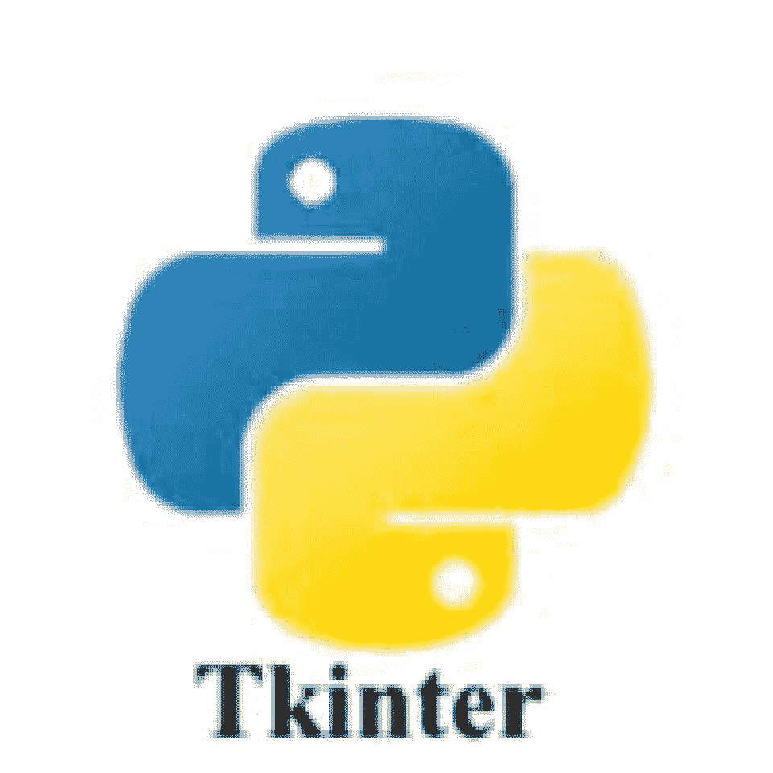
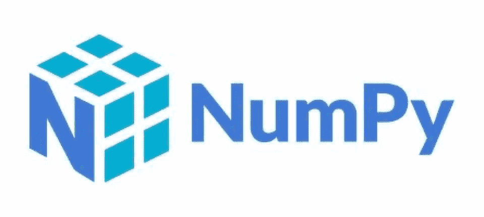
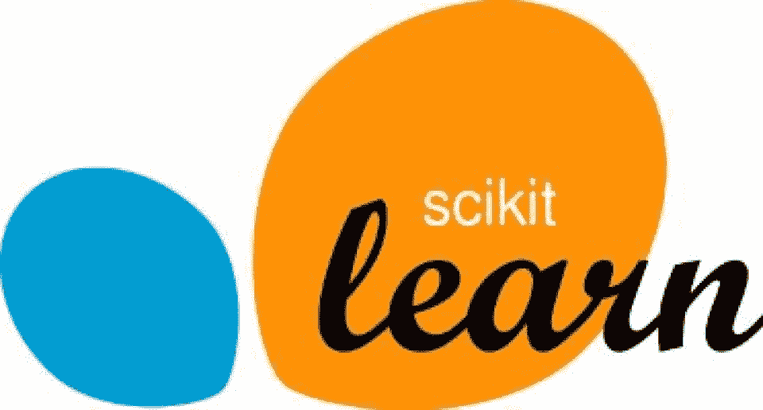
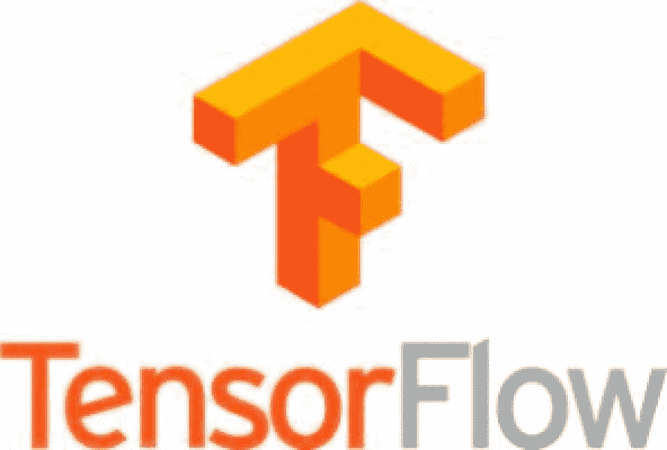
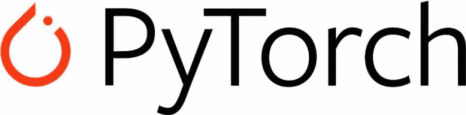
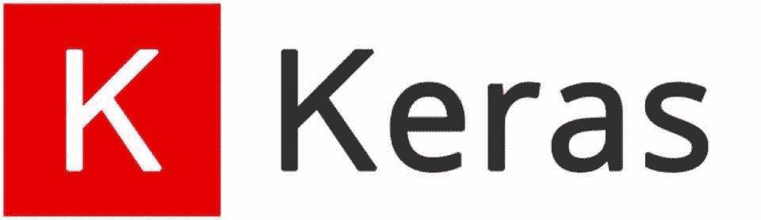
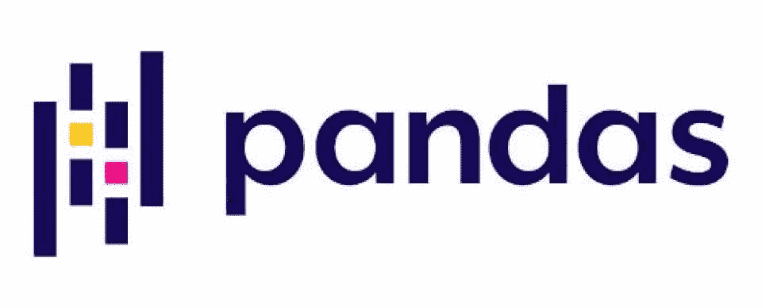
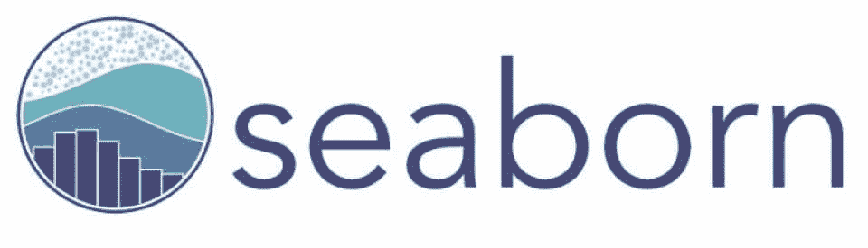
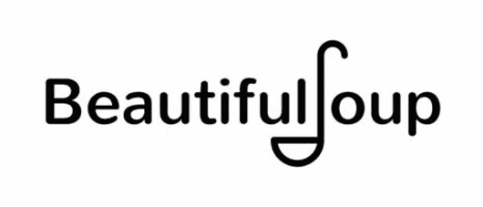
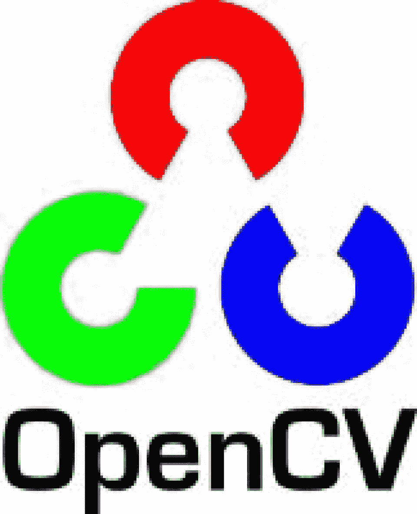

# 2023 年你应该查看的 24 个最佳 Python 库[推荐]

> 原文：<https://hackr.io/blog/best-python-libraries>

Python 经常被贴上“内置电池的编程语言”的标签这仅仅意味着它附带了许多预打包的库，开发人员可以使用这些库来简化他们的工作。正如您所料，这种解释型、高级、通用编程语言有大量可用的库。

毫无疑问，Python 如此受欢迎的最大原因之一是有超过 10 万个库可供选择。一种编程语言拥有的库和包越多，它的用例就越多样化。

在成千上万可用的 Python 库中，很难区分哪些是好的，哪些是容易被遗忘的。为了帮助你，我们在本文中列出了一些最好的 Python 库。你最喜欢的在这个名单上吗？请继续阅读，寻找答案！

## **什么是 Python 库？**

在我们能回答这个问题之前，首先，我们必须谈论什么是库——至少在编程方面。库由类、实用方法和模块组成。当您编写应用程序时，这些组件会非常方便。您可以使用库组件在代码中执行某些任务，而不必从头开始编写代码。因此，您节省了大量时间和精力。此外，**库使代码可重用**，同时也在开发人员中建立了一个标准。

那么 Python 中的库到底是什么？

作为近年来使用最广泛的编程语言之一，Python 有着广泛的用途和应用。Python 如此受欢迎的最大原因之一是因为它附带了大量各种各样的开源库，这些库不仅免费，而且易于使用。

Python 库是有用的模块、函数、类等等的集合。这些库通过使用预先存在的代码来帮助开发人员加速他们的过程，而不需要重新发明轮子。不用说，库允许开发人员专注于应用程序的重要部分，因为他们不再需要从头开始编写代码。

值得注意的是，因为 Python 在如此广泛的行业中被使用，所以几乎任何你能想到的目的都有顶级的 Python 库。

## **选择使用 Python 库时需要考虑什么**

既然您已经知道 Python 中的库可以为您做什么，那么您脑海中的下一个问题可能是，“我如何选择正确的库？”对此感到惊讶是完全可以理解的——毕竟，迄今为止有超过 137，000 个 Python 库可用，您如何决定哪一个最适合您的需求呢？

当你面对如此多的选择时，很难做出决定。有些人甚至会感到麻痹，不知道如何做出选择。对一些人来说，最终结果甚至可能是他们选择简单地从头开始编写他们需要的代码。你不需要经历这些。

以下是选择最佳 Python 库时要考虑的一些事情:

*   你的预期目的是什么？了解项目的主要目的或意图对于帮助您缩小可行 Python 库的列表非常重要。为了进一步缩小您的选择范围，请考虑可能与此主要目的交叉的任何其他领域、目的和专业。例如，如果您的项目是以数据科学为中心的，那么您可能需要一个支持数据管理和数据可视化的库。

*   你用的是哪个版本的 Python？如今，你可以在自己的项目中使用不同版本的 Python。如果你已经为你的应用程序选择了一个特定的版本，那么你必须确保你所使用的任何库都与这个版本的 Python 兼容。

*   这个库可以和你正在使用的其他库一起使用吗？如果你使用多个库，最好确保它们能很好地相互协作。不兼容或重叠的库可能会给你带来更多的麻烦。

*   图书馆会符合你的预算吗？有大量的开源 Python 库可以完全免费使用。如果你能找到一些完全适合你的项目，你甚至可能根本不需要为任何库付费。然而，有些图书馆需要你付费才能使用。在做出决定之前，你可能需要考虑一下图书馆的成本。

### 推荐 Python 课程

[用 Python 完成从零到英雄的 Python boot camp](https://click.linksynergy.com/deeplink?id=jU79Zysihs4&mid=39197&murl=https%3A%2F%2Fwww.udemy.com%2Fcourse%2Fcomplete-python-bootcamp%2F)

## **2023 年顶级 Python 库**

### **1。请求数**

****

**主要意图:**简化 HTTP 请求

**次要意图:**无

最流行的通用 Python 库之一是 Requests，它旨在使 HTTP 请求更简单、更人性化。Requests 在 Apache2 许可下使用 Python 编写，是开发人员使用 Python 进行 HTTP 请求的事实上的标准。

除了使用请求库向服务器发送 HTTP 请求之外，它还允许添加表单数据、内容、标题、多部分文件等。和他们一起。有了这个库，开发人员不需要向 URL 添加查询，也不需要手动对文章数据进行表单编码。

Requests 库在一个简单的 API 中抽象出许多复杂的 HTTP 请求，这样开发人员可以更专注于与服务的交互。该库提供了对 Python 2.7、3.4 和更高版本的官方支持，在 PyPy 上也能很好地工作。

**亮点:**

*   允许多部分文件上传和流式下载
*   自动内容解码和自动解压缩
*   浏览器风格的 SSL 验证
*   可以根据需要定制和优化功能
*   保持活动和连接池
*   支持国际域名和网址

### **2。枕头**

****

**主要意图:**图像处理

**次要意图:**图像存档，图像显示

Python 图像库或 PIL 是一个免费的 Python 库，它为 Python 解释器增加了图像处理能力。简单来说，PIL 允许在 Python 中操作、打开和保存各种图像文件格式。由 Alex Clark 和其他贡献者创建的 Pillow 是 PIL 图书馆的一个分支。

除了提供强大的图像处理功能，Pillow 还提供了有效的内部表示和广泛的文件格式支持。核心 Python 库旨在提供对以几种基本像素格式存储的数据的快速访问。

**亮点:**

*   使用 show()方法的有效调试支持
*   批处理应用的理想选择
*   识别和读取各种图像文件格式
*   提供位图图像、照片图像和窗口 DIB 接口
*   支持任意仿射变换、色彩空间转换、使用一组内置卷积核进行过滤、调整图像大小和旋转以及点操作
*   直方图方法允许从图像中提取一些统计数据，可用于自动对比度增强和全局统计分析

### **3。刺儿头**

****

**主要意图:**网页抓取

**次要意图:**自动化测试、数据挖掘、网络爬行

Scrapy 是一个免费的开源 Python 框架，广泛用于 web 抓取和许多其他任务，包括自动化测试和数据挖掘。

最初，Scrapy 是为网页抓取而开发的，但多年来已经发展到满足其他目的。该库提供了一种快速、高级的方法来抓取网站并从网页中提取结构化数据。

Scrapy 是用 Python 编写的，它是围绕蜘蛛构建的，这些蜘蛛基本上是自包含的爬虫，为它们提供了一组指令。遵循 DRY(不要重复自己)原则，Scrapy 使得构建和扩展成熟的网络爬行项目变得更加容易。

**亮点:**

*   容易写一个蜘蛛抓取一个网站和提取数据
*   遵循干燥原则
*   提供了一个网页抓取外壳，允许开发者测试网站的行为
*   支持使用命令行导出抓取的数据

[100 天代码:2023 年完整的 Python Pro 训练营](https://click.linksynergy.com/deeplink?id=jU79Zysihs4&mid=39197&murl=https%3A%2F%2Fwww.udemy.com%2Fcourse%2F100-days-of-code%2F)

### **4\. Asyncio**

****

**主要意图:**使用异步代码

**次要意图:**无

世界各地的许多 Python 开发人员利用 asyncio 库来编写使用 async/await 语法的并发代码。在大多数情况下，asyncio 库是 io 绑定和高级结构化网络代码的理想选择。

asyncio 已经被用于构建各种 Python 异步框架，这些框架提供了数据库连接库、分布式任务队列、高性能网络和 web 服务器等等。该库附带了许多高级和低级 API。

**亮点:**

*   允许控制子进程、通过队列分配任务、执行网络 IO 和 IPC 以及同步并发代码
*   使用低级 API 通过异步/等待语法桥接基于回调的库和代码
*   附带一组高级 API，用于并发运行 Python 协程，并完全控制它们的执行
*   简化异步代码的工作
*   支持事件循环的创建和管理，使用传输实现有效的协议

### **5。Tkinter**

****

**主要意图:** GUI 开发

**次要意图:**无

当与 Tkinter 一起使用时，Python 提供了一种创建 GUI 应用程序的简单而快速的方法。Tkinter 是 Python 编程语言的标准 GUI 库。它为 Tk GUI 工具包提供了一个强大的面向对象的接口。

使用 Tkinter 创建 GUI 应用程序非常容易。你需要做的就是遵循这些简单的步骤:

*   导入 Tkinter
*   为正在开发的 GUI 应用程序创建主窗口
*   添加一个或多个 Tkinter 小部件
*   进入*主事件循环，对每个用户触发的事件*采取行动

Tkinter 提供了超过 15 种类型的小部件，包括按钮、标签和文本框。它们中的每一个都可以访问一些特定的几何管理方法，这些方法用于在整个父窗口小部件区域组织窗口小部件。

**亮点:**

*   附带了一系列支持几何管理方法的小部件
*   简化 GUI 应用程序的开发
*   支持有效的面向对象的接口

### **6。六个**

****

**主要意图:**兼容性库(包装 Python 2 和 Python 3 之间的差异)

**次要意图:**无

尽管过于简单，但 Six 是一个强大的 Python 库，旨在消除各种 Python 2 和 Python 3 版本之间的差异。Six 旨在支持无需修改即可在 Python 2 和 Python 3 上运行的代码库。

Six 库非常容易使用，因为它是作为一个 Python 文件提供的。因此，将这个库复制到一个 [Python 项目](https://hackr.io/blog/python-projects)中非常容易。Six 这个名字反映了(Python) 2 x (Python) 3。

**亮点:**

*   使 Python 代码与 Python 2 和 Python 3 兼容的简单实用函数
*   支持 Python 2.6 以后的所有版本
*   过于简单，无法像包含在单个 Python 文件中那样使用

### **7。aiohttp**

****

**主要意图:**充当异步 HTTP 客户端/服务器

**次要意图:**无

另一个简单但广泛使用的 Python 库是 aiohttp。在 Python 中，它基本上是一个异步 HTTP 客户端或服务器。除此之外，为客户端 WebSockets 和服务器 WebSockets 提供开箱即用的支持，这个 Python 库就没有别的了。

**亮点:**

*   提供具有中间件、可插拔路由和信号的 web 服务器
*   为客户端 WebSockets 和服务器 WebSockets 提供现成的支持
*   支持客户端和 HTTP 服务器

### **8。Pygame**

****

**主要意图:** 2D 游戏开发

**次要意图:**多媒体 [app 开发](https://hackr.io/blog/how-to-become-a-mobile-app-developer)

Pygame 是一个免费的开源 Python 库，旨在用 Python 完成多媒体应用程序开发，尤其是二维游戏项目。因此，它被业余和专业的 Python 游戏开发者广泛使用。

在幕后，Pygame 使用了 [SDL(简单直接媒体层)](https://en.wikipedia.org/wiki/Simple_DirectMedia_Layer)库。像 SDL 库一样，Pygame 库是高度可移植的，因此提供了对大量平台和操作系统的支持。

可以将使用 Pygame 开发的应用移植到 Android 设备上，比如智能手机和平板电脑。为此，需要使用 pgs4a(Android 的 Pygame 子集)。

**亮点:**

*   不需要 OpenGL
*   易于使用多核 CPU
*   使用所有可用功能不需要 GUI
*   为广泛的平台和操作系统提供支持
*   简单易用
*   使用汇编代码和优化的 C 代码来实现核心功能

### **9\. Kivy**

****

**主要意图:**应用程序开发(具有创新的用户界面)

**次要意图:**无

对于使用 NUI(自然用户界面)构建移动应用和多点触控应用软件，Python 开发人员依赖于 Kivy 库。免费的开源 Python 库是在 MIT 许可下分发的，可以在 Android、iOS、Linux、macOS 和 Windows 上运行。

实际上，Kivy 是 PyMT 项目的发展。它包含了构建一个直观的多点触摸应用程序的所有必要元素，即图形库、各种支持多点触摸的小部件、中间语言(Kv)和广泛的输入支持。

Kv，或 Kivy 语言，是一种致力于描述用户交互和界面的中间语言。它使得创建一个完整的用户界面和添加交互变得非常容易。Kivy 还为[树莓派](https://www.raspberrypi.org/)提供支持。

**亮点:**

*   能够本机使用大多数设备、输入和协议
*   跨平台
*   提供 20 多个高度可扩展的小部件
*   支持基于 OpenGL ES 2 构建的图形引擎

### 10。散景

****

**主要意图:**开发基于可视化的应用

**次要意图:**数据可视化，数据科学

作为 Python 编程语言的一个交互式可视化库，Bokeh 允许在当代 web 浏览器中以一种美丽而有意义的方式可视化数据。数据可视化库简化了仪表板、数据应用程序和交互式绘图的创建。

除了提供简洁优雅的通用图形构造，散景库还扩展了其在流或超大型数据集上的高性能交互能力。

**亮点:**

*   允许用简单的命令构建复杂的统计图
*   散景可视化可以很容易地嵌入到两个最流行的 Python 框架中，Django 和 Flask
*   能够产生优雅的交互式数据可视化
*   多种语言绑定(Julia、Lua、Python 和 R)
*   各种输出格式

### **11。NumPy**

****

**主要目的:**科学和数值计算

**次要目的:**数据分析是其他 Python 库(如 SciPy)的基础

NumPy 是用于科学和数值计算以及数据分析的最好的开源 Python 模块之一。事实上，它甚至为其他一些 Python 库提供了基础，比如 SciPy 和 Sci-Kit Learn。NumPy 最常用于矩阵和数组的数学运算。由于其高效而快速的计算，NumPy 是许多科学家进行数据分析的首选 Python 库。

NumPy 还可以处理多维数组，这就是为什么这么多开发人员和数据科学家将它用于 AI(人工智能)和 ML(机器学习)项目的原因。

**亮点:**

*   由于面向阵列的计算，效率更高
*   使用矢量化实现紧凑而快速的计算
*   支持面向对象或 OO 方法

*   在快速和预编译函数中提供数值例程

### **12 号。SciPy** 的研究

****

**主要目的:**数据可视化和操作

**次要意图:**线性代数、优化算法、图像操作(多维)

像 NumPy 一样，SciPy 是免费和开源的，让每个人都可以使用它。SciPy 基于 NumPy，也可用于大型数据集的技术和科学计算。它在工程和科学分析中起着至关重要的作用，这也是它被认为是 Python 中一个重要的库的原因。有些人甚至称之为编程语言的基础库。

SciPy 在图像处理方面表现良好。它有常用于数据操作和可视化的高级命令。

**亮点:**

*   所有的函数和算法都建立在 NumPy 之上
*   有解决微分方程的内置函数
*   图像处理的 SciPy ndimage 子模块(多维)

### 13。Sci-Kit 学习

****

**主要意图:**机器学习应用

**次要意图:**统计建模

Sci-Kit Learn 基于 NumPy 和 SciPy，以前被称为 Sklearn。这个免费的 Python 库经常被许多人认为是一个 SciPy 扩展。Sci-Kit Learn 是专门为开发机器学习和数据建模算法而设计的。

许多人认为 Sci-Kit Learn 是顶级的 Python 库之一，因为它具有一致、简单和直观的界面。由于这个库非常用户友好，许多人认为它是初学者的绝佳选择。

**亮点:**

*   机器学习库
*   几乎提供了机器学习所需的所有算法
*   基于 SciPy、NumPy 和 Matplotlib 构建

### **14。theno**

****

**主要意图:**机器和深度学习

**次要意图:**评估、分析和操作数学表达式

被称为 Theano 的数值计算库是为其在机器学习中的明确用途而创建的。由于该库的特性，许多开发人员使用 Theano 创建深度学习模型。绝大多数的 Theano 用户都是深度学习和机器学习的开发者。

Theano 还提供了与 NumPy 集成的能力，如果您需要的话。当 Theano 与 GPU(图形处理单元，如视频卡)而不是 CPU(中央处理单元，如英特尔酷睿 i5 或 i7 或 AMD 锐龙处理器)一起使用时，它执行密集型数据计算的速度可以快 140 倍。

**亮点:**

*   与 NumPy 集成
*   与 CPU 一起工作，但与 GPU 一起工作效率更高；使用您的 GPU 可以更快地执行密集型操作
*   针对稳定性和速度进行了优化
*   采用多维数组来创建深度学习模型

### **15\. TensorFlow**

****

**主要意图:**深度学习和传统机器学习；大型数值计算

**次要意图:**基于文本的应用、视频检测、语音/图像识别、时间序列分析

TensorFlow 是一个开源库，最初由谷歌的研究人员开发。

它的专业似乎是差异化编程，但它的主要目的是机器和深度学习，以及预测和统计分析中的其他工作负载。

TensorFlow 的资源集合和内置工具可以帮助开发人员更加轻松地构建他们的机器学习和深度学习模型。TensorFlow 还有助于开发人员更直接地构建神经网络，无论他们是初学者还是专业人员。

TensorFlow 的框架和架构非常灵活，允许该库同时用于 CPU 和 GPU。然而，如果你希望释放 TensorFlow 的全部能量，你需要使用一个 [TPU](https://en.wikipedia.org/wiki/Tensor_Processing_Unit) (张量处理单元)。这个库也不局限于桌面设备——你也可以在智能手机和服务器上使用它。

**亮点:**

*   频繁的更新和新版本保证了新的特性和干净的代码
*   由谷歌支持
*   计算图形的更好可视化

### **16 号。小行星 T1**

****

**主要意图:**数据科学

**次要意图:**深度学习研究

PyTorch 是另一个经常用于数据科学的开源库。这个库基于 Torch(C 编程语言的一个框架)，也可以与其他 Python 库集成，比如 NumPy。PyTorch 能够无缝地创建计算图形，只要 Python 程序当前正在运行，这些图形就可以改变。

PyTorch 最常用于 DL 和 ML 应用，包括 NLP(自然语言处理)和计算机视觉。这个库以能够快速执行而闻名，即使在处理重负载时也是如此。PyTorch 也很灵活，允许它在 CPU、GPU 甚至简化的处理器上工作。

用户可以使用 PyTorch 的 API 集合来扩展它。

**亮点:**

*   使用 GPU 加速的张量计算可实现更快、更高效的处理
*   简单易用的 API
*   使用动态计算图
*   背后有一个强大的社区

### **17\. Keras**

****

**主要意图:**深度学习和机器学习

**次要意图:**数据可视化

开源 Python 库 Keras 主要是为机器学习和深度学习模型内部的神经网络的开发和评估而设计的。这个库可以在 TensorFlow 和 Theano 之上运行，这意味着开发人员可以不用太多代码就开始训练他们的神经网络。

Keras 是灵活和可扩展的，同时也是模块化的，这就是为什么它是一个伟大的选择，即使对初学者来说。这个库也是可移植的，这意味着您可以在各种环境中以及 GPU 和 CPU 上使用它。

开发人员也经常使用 Keras 进行数据可视化或建模。

**亮点:**

*   支持 Theano 和 TensorFlow 后端
*   提供预先标记的数据集，开发人员可以直接用来加载/导入
*   提供简单一致的 API
*   易于学习和使用，学习曲线更短

### 18。熊猫

****

**主要意图:**数据科学

**次要意图:**数据分析和机器学习

Pandas 是当今最受欢迎的 Python 库之一，至少在数据科学领域是如此。熊猫是另一个建在 NumPy 上的图书馆。这个库允许用户构建无缝而直观的高级数据结构。熊猫被用于各种行业，从统计到工程，甚至金融。

使 Pandas 变得伟大的一点是它的灵活性，以及将它与其他数字和科学 Python 库一起使用的能力。

**亮点:**

*   用于许多商业领域，包括金融、神经科学和统计学
*   也用于学术领域
*   有雄辩的语法
*   建立在 NumPy 之上
*   帮助处理大量与数据相关的繁琐耗时的任务

### **19。Matplotlib**

****

**主要意图:**数据可视化

**次要意图:**机器学习

Matplotlib 是一个开源 Python 库，经常被吹捧为付费解决方案 MATLAB 的替代方案。Matplotlib 是一个 SciPy 扩展，用于数据可视化的目的，因为它被用来创建图表和绘图。Matplotlib 还可以处理 Pandas 输出的复杂数据模型以及 NumPy 创建的数据结构。

Matplotlib 有一个限制——它只能进行 2D 绘图。尽管如此，这个库仍然能够以绘图、图表、直方图、绘图、散点图、误差图，当然还有条形图的形式生成可供发布的可视化数据。

由于 Matplotlib 非常简单和直观，许多初学者在开始数据可视化时选择使用它。这也是许多已经拥有大量其他数据可视化工具经验的开发人员的选择。

**亮点:**

*   开源，是 MATLAB(付费解决方案)的一个很好的替代品
*   低内存使用率
*   强大的社区支持
*   提供各种类型的数据可视化(箱线图、散点图、条形图、直方图、误差图等)

### 20。海博恩

****

**主要意图:**数据可视化

**次要意图:**机器学习

与 Matplotlib 非常相似，Seaborn 是一个用于绘图和数据可视化的 Python 库。事实上，这个开源库是基于 Matplotlib 本身的，尽管 Seaborn 也包括 Pandas 的一些扩展数据结构。Seaborn 有一个高级界面，该界面具有丰富的功能，允许用户创建统计图表，这些图表不仅准确，而且信息丰富。

许多开发人员和 Seaborn 用户都会同意，这个库创建了一些最好看的数据可视化，这就是为什么这个库非常适合在营销和发布应用程序中使用。

用户也喜欢 Seaborn，因为它能够用简单的命令和最少的代码创建这些图和图表，为许多人节省了时间。

**亮点:**

*   基于 Matplotlib 构建
*   允许开发人员使用高级界面创建有吸引力的信息图表
*   创建一系列图，如成对图、直方图、条形图、散点图等

### **21。美丽组合**

****

**主要意图:**数据科学

**次要意图:**网页抓取

Beautiful Soup 之所以得名，是因为它能够解析 HTML 和 XML 文档(即使带有被称为“标签汤”的畸形标记)。这个 Python 包抓取 web 并收集数据，为将来的操作做准备。作为一个难以置信的多功能包，Beautiful Soup 是许多数据分析师和科学家的首选工具之一。机器学习和深度学习开发者也使用美汤来获取数据，用于训练他们的 ML/DL 模型。

**亮点:**

*   允许从 HTML 和 XML 中提取数据，甚至可以从带有格式错误或不完整标记的文档中提取数据(比如非封闭标签)
*   最初是一个 HTML 解析器，可以让“标签汤”(畸形的标记)变得可行甚至“漂亮”

### **22。PyCaret**

****

**主要意图:**机器学习

PyCaret 得名于它是一个基于 Caret 的 Python 库，Caret 是编程语言 r 中的一个机器学习库。这个开源库也是为机器学习而创建的，因此，它提供了一些功能来帮助简化和自动化 ML 程序。

虽然 PyCaret 有一点学习曲线，但它相对容易使用。

**亮点:**

*   高级和低级代码库
*   致力于自动化机器学习的工作流程
*   有助于加快实验周期，提高生产率
*   允许开发人员使用非常少的代码部署 ML 模型

### **23。OpenCV**

****

**主要意图:**计算机视觉和图像处理

**次要意图:**机器学习

作为一个 Python 库，OpenCV 由各种函数组成，这使它成为实时计算机视觉程序的一个很好的工具。这个高效的库不仅可以处理来自图像的各种视觉输入，还可以处理来自视频数据的视觉输入。OpenCV 可以识别人脸、笔迹和物体。

**亮点:**

*   执行目标跟踪、人脸检测、地标检测等任务
*   为开发人员提供超过 2，500 种经典的先进算法
*   甚至被谷歌、IBM、丰田等科技巨头广泛使用
*   也用于图像/视频分析

### **24。LightGBM**

****

**主要意图:**机器学习

LightGBM 代表光梯度提升机。这是一个免费的梯度推进框架，由微软开发，用于机器学习。它是用户友好和直观的，可以比其他一些深度学习的库更容易学习。停止

**亮点:**

*   提供大量内存高效且快速的计算能力
*   最初由微软开发
*   能够处理大量数据
*   提供高精度结果

## **就这些！**

在成千上万可用的 Python 库中，上面的列表包括了一些最好的。很高兴知道这些库经常得到升级和增强，以帮助它们跟上 Python 的增长和蓬勃发展的流行。

了解这些流行的库之一可以帮助您进一步学习这门语言，同时也有助于您成为一名更好的 Python 开发人员。你认为我们错过了这个名单上的顶级图书馆吗？请在下面的评论中告诉我们！

**[新接触 Python？从最好的 Python 教程开始。](https://hackr.io/tutorials/learn-python)**

## **常见问题解答**

#### **1。什么是 Python 库？**

Python 库是函数、模块和其他组件的集合，允许开发人员使用预先存在的代码来完成某些任务。库可以是通用的，也可以更多的用于特定的目的。通过避免从头开始编写大量应用程序，它们可以节省开发人员大量的时间和精力。

#### **2。Python 中有多少库？**

现有超过 [137，000](https://www.mygreatlearning.com/blog/open-source-python-libraries/#:~:text=There%20are%20over%20137%2C000%20python,data%20manipulation%20applications%2C%20and%20more.) 个 Python 库。然而，并不是所有的都是一样的，你会发现有些比其他的好得多。

#### **3。什么是 Python 库示例？**

有许多非常流行的 python 包和库。如果您正在寻找 Python 库示例，请考虑下面的一些大牌:

*   要求
*   Numpy，SciPy，SciKit-学习
*   PyTorch
*   熊猫
*   海生的
*   Theano
*   TensorFlow

#### **4。我如何获得 Python 库的列表？**

如果您想列出您的 Python 版本中当前安装的所有模块、包或库，您可以遵循这里的指南。该指南包含创建 Python 库列表所需的所有说明。

#### **5。Python 库是用来做什么的？**

Python 库用于使开发人员的工作更加容易和方便。开发人员可以从库中取出模块和捆绑代码，并在他们的项目中使用，而不需要从头开始编写项目的部分代码。库也可以建立编码标准，使得代码维护更容易。

#### **6。Python 库都是免费的吗？**

大多数主要的图书馆都允许免费的商业使用。然而，并不是所有的库都那么容易使用和理解。因此，虽然一个库可能是免费的，但从长远来看，为了使调试和维护更容易，您可能需要为许可或付费的模块或软件付费。此外，尽管许多库在商业用途上是免费的，但是如果您想在应用程序中包含某些模块以便分发给未来的客户，您可能需要付费。

#### **7。Python 中的库是如何工作的？**

Python 库允许像您这样的开发人员获取模块和代码包，并在各种项目和目的中重复使用它们。库避免了你从头开始重复编写代码的需要，因为你可以简单地把已经存在的代码添加到你的代码中。

**人也在读:**