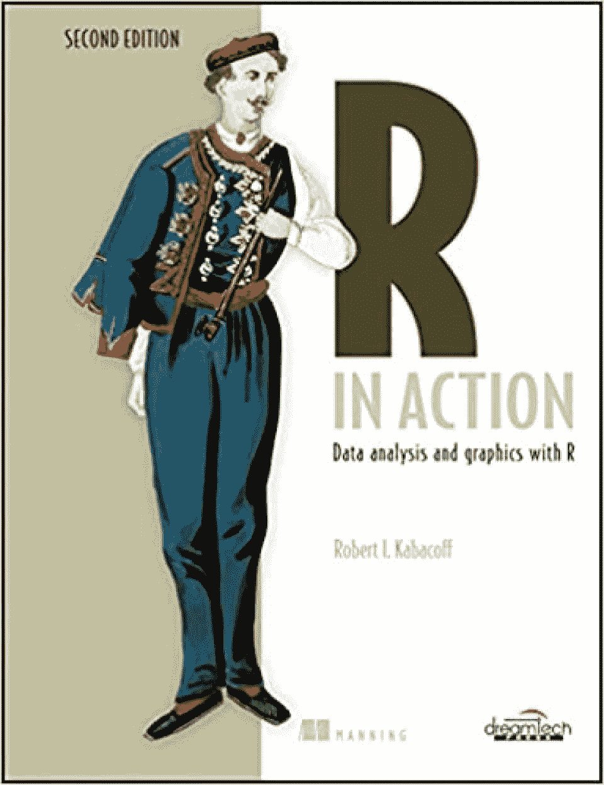
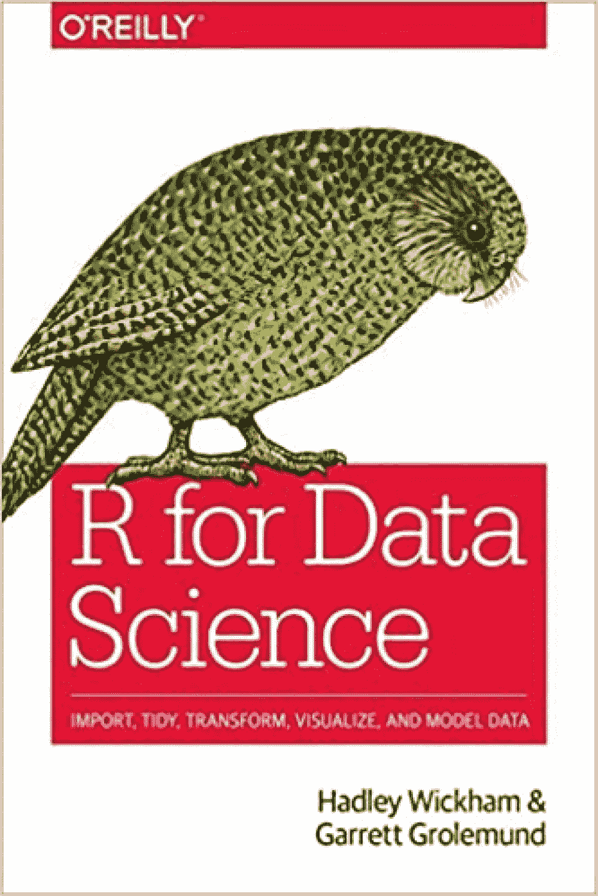
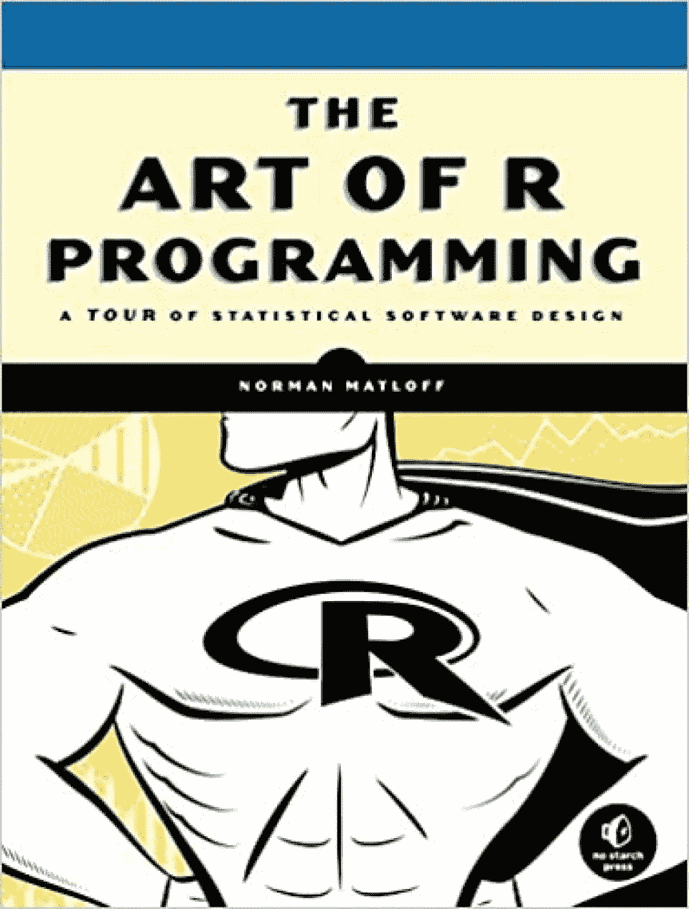
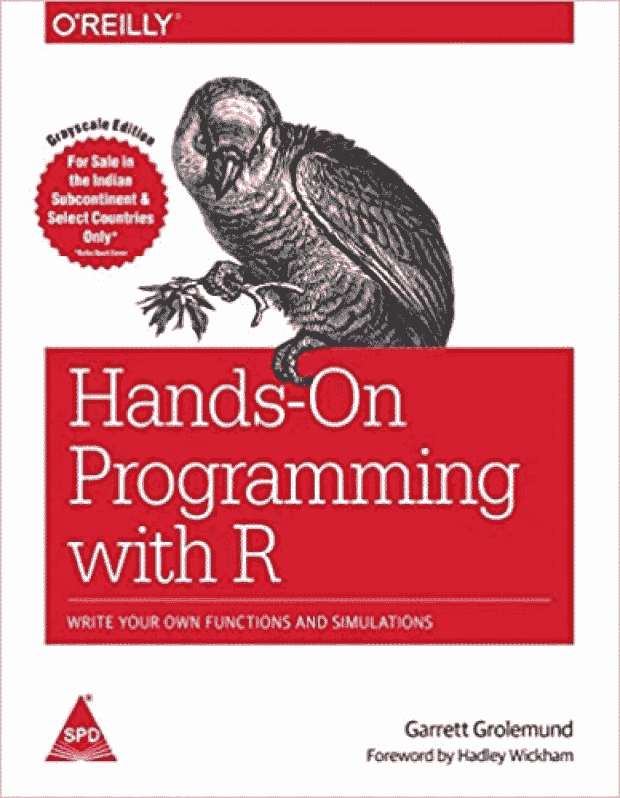
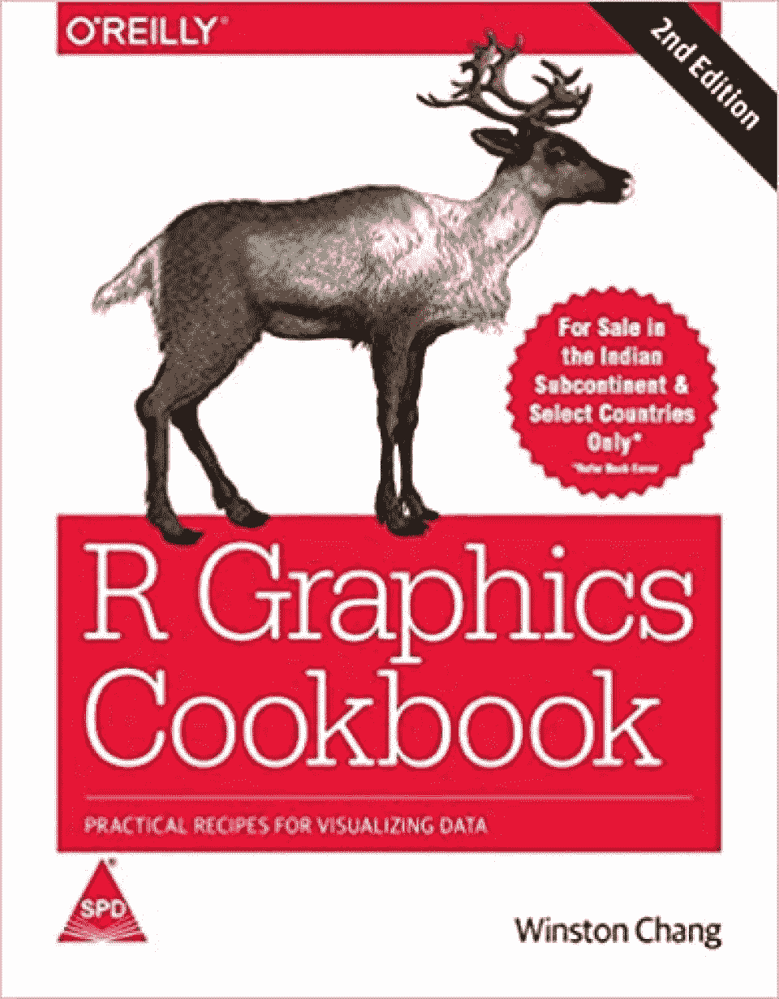
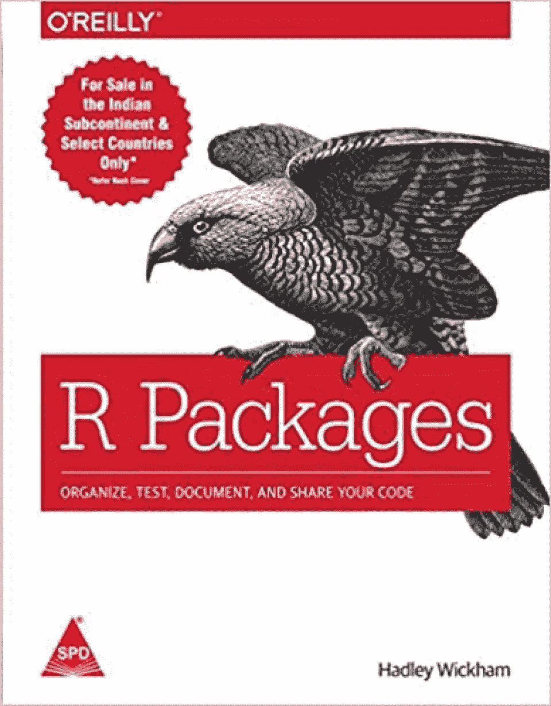
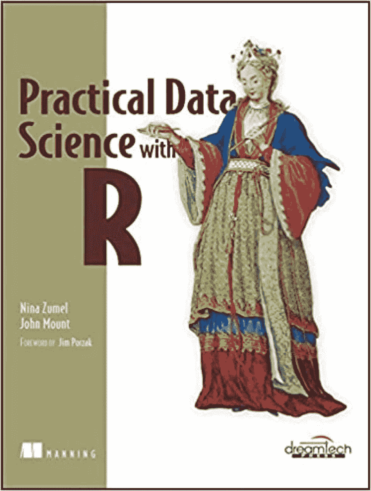
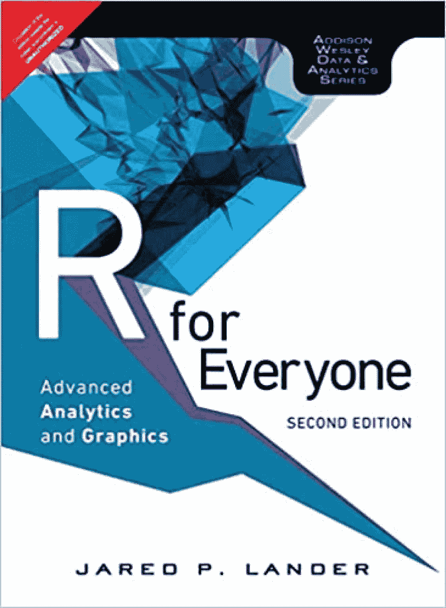
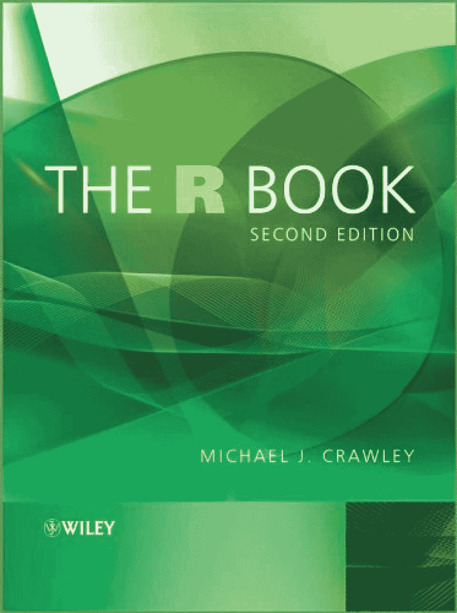

# 2023 年 R 程序员的 10 本最佳 R 书[更新]

> 原文：<https://hackr.io/blog/best-r-books>

R 和 Python 是目前实现数据科学的首选编程语言，因此它们彼此之间有相当多的优缺点。

Python 是**机器学习**的首选，这是因为它的生产就绪型构建以及将[数据分析](https://hackr.io/blog/what-is-data-analysis-methods-techniques-tools)与网络应用集成的简易性。而数据挖掘者和统计学家更喜欢用 R 来开发统计**计算软件**，这是因为它固有的统计特性。

r 是一个用于**统计编程**的完整平台，而不仅仅是一种编程语言。在这篇文章中，我们将重点关注最好的 R 书籍，它们将帮助你实现在利润丰厚的数据科学领域工作的梦想，或者如果你已经实现了梦想，让你在这方面做得更好。

注:对获得 R 认证感兴趣，试试这些[最佳 R 课程和在线 R 认证](https://hackr.io/blog/best-r-courses)。

## **最佳 R 书**

在我们开始之前，请注意这是 10 本最好的 R 书的列表，也就是说，我们不是在比较这些书。在第一点详述的书不一定比在第二点和其他地方提到的书更好。在我们看来，他们都值得上榜。

 作者——罗伯特·l·卡巴科夫
最新版——第二版
可用格式——平装本
出版商——梦工厂出版社
阅读水平——初级/中级

**收视率:**

*   亚马逊- 4.5/5(141 分)
*   Goodreads - 4.2/5 (233 票)

除了维护广受欢迎的 Quick-R 网站，Robert L. Kabacoff 博士还写了几本关于 R 的好书，包括《R in Action》。另外,《详述 R》这本书，现在是它的第二版，向读者呈现了属于商业、科学和技术的详细的真实世界的例子。

除了详细介绍真实的数据科学场景和实用的基于 R 的解决方案，R in Action book 还提供了一个统计学速成班。这主要包括详细说明从不完整、不清楚的大量数据中提取意义的强大方法。

R in Action 还详细描述了 R 在探索、管理和解决数据可视化挑战方面的图形化能力。最新版的《R in Action》增加了更多详细介绍数据挖掘、动态报告编写和预测的章节。

**涵盖的主题:**

*   ggplot2 的基础知识。
*   数据挖掘。
*   数据可视化。
*   探索性数据分析。
*   r 中的图形
*   机器学习模型。

你可以在这里买到这本书。

 作者——哈德利·威克姆和加勒特·戈勒蒙德
最新版——首次推出
格式——Kindle 和平装本
出版商——奥莱利
阅读水平——初学者

**收视率:**

*   亚马逊- 4.7 (666 分)
*   Goodreads - 4.6 (640 票)

Hadley Wickham 是一位著名的作家，他写了很多关于 R 编程语言的内部(和外部)工作方式以及数据科学的文章。面向数据科学的 R 是一个完整的软件包，面向对剖析和理解数据科学和 R 感兴趣的读者。

《R for Data Science》一书从发展对数据科学、学科实施及其背后的科学的整体理解开始。从前面的章节开始，这本书加快了利用 R 平台完成各种数据科学任务和操作的步伐。

该书的主要作者 Garrett Grolemund 是 RStudio 的硕士讲师，他以一种既吸引人又激励人去做和了解更多的方式解释了 R 和数据科学之间协同作用的实际、真实的实现。

**涵盖的主题:**

*   数据角力。
*   数据可视化。
*   探索性数据分析。
*   r 的基础。
*   数据科学基础。
*   R 和数据科学的实现。

你可以在这里买到这本书。

 作者——诺曼·马特洛夫
最新版——首次推出
格式——Kindle 和平装本
出版商——无淀粉出版社
阅读水平——初学者

**收视率:**

*   亚马逊- 4.4/5 (200 分)
*   Goodreads - 4.1/5 (533 票)

另一本书是 Norman Matloff 的《R 编程的艺术》,它确保了自己在最佳 R 书籍中的地位。这本书的作者是几个流行软件包的创造者，也是加州大学计算机科学的教授。所以，向他学习，很明显，很棒。

R 编程的艺术不需要任何统计知识，即使你的编程水平很低，也能为你所用。因此，它非常适合初学者。R 编程书提供了对使用 R 进行软件开发的透彻理解。

除了 R 和软件开发，R 编程的艺术还包括面向对象和[函数式编程](https://hackr.io/blog/functional-programming)范例、复杂的数据重排和运行数学模拟。

**涵盖的主题:**

*   复杂函数。
*   数据可视化。
*   r 的基础。
*   统计编程。
*   统计软件开发。

你可以在这里买到这本书。

**推荐课程**

[R 编程——绝对初学者的 R 语言](https://click.linksynergy.com/deeplink?id=jU79Zysihs4&mid=39197&murl=https%3A%2F%2Fwww.udemy.com%2Fcourse%2Fr-for-absolute-beginners%2F)

By-Garrett grole mund
最新版-首款
格式可用- Kindle 和平装本
出版商- Shroff/O'Reilly
阅读水平-中级

**收视率:**

*   亚马逊- 4.4/5 (131 分)
*   Goodreads - 4.4/5 (129 票)

R book 的实践编程详细介绍了汇编和反汇编数据对象、加载数据、在 R 环境中导航、使用 R 可用的工具以及开发用户定义的函数。这本书使用了一种容易理解的语言。

为了让学习变得有趣，R book 的实践编程包含 3 个受赌场游戏启发的实用数据分析项目。每本书都包含了广泛的例子，涉及到使用一系列 R 编程技巧，比如数据可视化和建模。

R 编程实践是由 RStudio 硕士讲师 Garrett Grolemund 撰写的，他也是另一本基于 R 平台的优秀书籍《R for Data Science》的合著者。除了关注 R，讲师还用这本书来教育读者关于数据科学和编程艺术的知识。

**涵盖的主题:**

*   r 的基础。
*   数据建模。
*   数据可视化。
*   数据科学基础。
*   补充 R 工具和软件。

你可以在这里买到这本书。

 作者——温斯顿·张
最新版——第二版
格式可用——Kindle 和平装本
出版商——史洛夫/奥莱利
阅读水平——高级

**收视率:**

*   亚马逊- 4.6/5 (33 分)
*   Goodreads - 4.2/5 (261 票)

对于那些寻求一本生动解释 R 但又专注于它的图形功能的书的读者来说，R Graphics Cookbook 是一本很好的读物。它有 150 多个插图，称为食谱，用于使用 R 平台快速生成高质量的图形。

每一个食谱都提出了一个具体的问题和详细的解决方案。为什么和如何所谓的食谱也被详细地解释，以便在读者之间发展一个相关概念的强健的理解。大多数例子利用了广泛流行的 ggplot2 包。

R Graphics Cookbook 的作者是 RStudio 的软件工程师 Winston Chang。有趣的是，R Graphics Cookbook 是作者过去项目——R Cookbook——的更新版本。

**涵盖的主题:**

*   数据可视化。
*   r 中的图形
*   常见/冗余任务的解决方案。
*   图形的视觉设计。

你可以在这里买到这本书。

 By - Hadley Wickham
最新版-首款
格式- Kindle 和平装本
出版商- Shroff/O'Reilly
阅读水平-高级

**收视率:**

*   亚马逊- 4.7/5 (43 分)
*   Goodreads - 4.5/5 (126 票)

R 包:组织、测试、文档化和共享你的代码是为那些希望对 R 包有一个坚实的理解的学习者准备的。除了解释 R 包的基本概念，这本书还详细介绍了创建和共享你自己的 R 包的过程。

这本关于 R 编程的书让读者了解并使用 dev tools 和 oxygen 这两个最流行的 R 工具。在 R packages 这本书里，读者将会测试、研究和理解 R Packages 是如何自动完成常见的开发任务的。

R Packages 是由 Hadley Wickham 编写的，他是莱斯大学的统计学副教授，也是一位著名的作家——曾为数据科学写过 R——和 RStudio 的首席科学家。韦翰在开发和完善 R 平台方面也做出了很多贡献，他在教授 R 的复杂性时，也像教授基本原理一样简单。

**涵盖的主题:**

*   R 编程基础。
*   r 包:工作、开发、实现和优化

*   添加文档。
*   R 函数的可重用性。
*   上传 R 包。

*   数据采样。
*   开发工具和氧气。
*   文档在 r 中的重要性。

你可以在这里买到这本书。

 作者——妮娜·祖梅尔和约翰·芒特
最新版——第一版
格式——平装本
出版商——梦工厂出版社/曼宁出版公司
阅读水平——初学者

**收视率:**

*   亚马逊- 3.9/5 (12 个评分)
*   Goodreads - 4.1/5 (81 票)

Manning Publications 因出版详细介绍编程和相关技术的书籍而享有盛誉。这家出版巨头带来了非常有用的实用数据科学 R，它不仅详细介绍了流行的数据科学平台，也介绍了数据科学领域。

由 Nina Zumel 和 John Mount 撰写的《实用数据科学与 R 》,帮助读者对数据科学的实际应用以及 R 如何帮助实现这一目标有一个坚实的理解。它还漂亮地解释了解决复杂商业问题所需的统计技术。

《实用数据科学》一书充满了商业智能(BI)、决策和营销领域的详细示例。这些被用来生动地演示建立预测模型、设计合适的测试和迎合不同观众的结果的过程，包括不同水平的专业人员和初学者。

**涵盖的主题:**

*   数据科学基础。
*   R 编程基础。
*   r 中的图形
*   R 平台的实现。
*   预测建模

你可以在这里买到这本书。

 By - Jared P. Lander
最新版-第二版
格式可用- Kindle 和平装本
出版商-培生教育
阅读水平-初学者

**收视率:**

*   亚马逊- 4.3/5 (97 分)
*   Goodreads - 4.1/5 (167 票)

正如书名所示,《人人的 R》是《人人的 R 参考》。它从 R 编程语言的绝对基础开始，然后继续前进到专家 R 任务，如添加丰富的文档、高级分析和制作自己的包。它在总共 30 个独立的章节中这样做，充满了详尽的实践示例代码。

面向所有人的 R 使得专业人员甚至初学者很容易从 R 开始，尽管他们以前没有接触过统计编程。这是本书的作者 Jared P. Lander，一位著名的数据科学家，在他多年的职业生涯中一直在做的事情。所以，这本书只是他的教学技巧/叙事的一个实现，既容易理解又有趣。

R 书涵盖了关于 R 的一切，从安装和设置 R 环境到开发你自己的、优化的 R 包。你所需要的只是去做的意愿。

**涵盖的主题:**

*   r 的基础。
*   统计学基础。
*   数据建模。
*   数据可视化。
*   交互式仪表板使用闪亮。
*   r 包开发。
*   使用 RMarkdown 的富文档。
*   统计编程。

你可以在这里买到这本书。

By-Tilman m . Davies
可用格式- Kindle 和平装本
出版社-无淀粉出版社
阅读水平-初学者

**收视率:**

*   亚马逊- 4.5/5 (136 分)
*   Goodreads - 4.2/5 (35 票)

《R 之书:编程和统计的第一课》是 R 上最好的 noob 友好书籍之一。除了对数学的基本理解和学习 R 的决心，读者不需要其他任何东西就能从 R 的书中受益。这是一本冗长的书，不是因为内容，而是因为详细的、大量的例子。

R book 提供了大量广泛的示例，有助于读者更好地理解 R 的概念。R Book 是一个光辉的例子，说明了如何将详细的主题解释与丰富的真实世界的示例相结合，从而显著提高学习的程度和轻松程度。

在高级 R 部分，R 之书涵盖了开发和执行优化的统计测试和模型，统计摘要的产生，以及开发出版就绪的图形。这本关于 R 的书是由蒂尔曼·m·戴维斯(Tilman M. Davies)执笔的，他是奥塔哥大学(新西兰)的博士兼统计学讲师。这本书的灵感来自于《R 导论》,这是一个由作者主持的为期三天的年度研讨会。

**涵盖的主题:**

*   统计学基础。
*   使用 ggplot2、ggvis 和 rgl 包的数据可视化。
*   r 的基础。
*   r 中的图形
*   R 平台的实现。

你可以在这里买到这本书。

 作者——迈克尔·j·克劳莱
最新版——第二版
可用格式——Kindle、精装和平装本
出版商——威利
阅读水平——初学者

**评级**

*   亚马逊- 4.4/5 (103 分)
*   Goodreads - 4.1/5 (121 票)

R Book 利用全彩色文本和丰富的图形来教育学习者关于 R 平台的知识，从基础知识到高级主题，包括实施基于 R 的解决方案来解决复杂的数据科学问题。

除了 R 书涵盖的所有大量主题之外，关于 R 的书还涵盖了对 R 在过去 5 年(从该书出版之日起)的演变的分析。新版带来了一个详细描述贝叶斯分析和元分析的新章节。

这本书是由帝国理工学院生物科学系的 Michael J. Crawley an FRS 撰写的。作者精通围绕数据科学、R 平台建立兴趣，以及解决复杂的现实世界的问题。

**涵盖的主题:**

*   r 的基础。
*   贝叶斯分析和元分析。
*   数据科学基础。
*   统计编程。
*   R 平台的发展。

你可以在这里买到这本书。

## **其他可敬的 R 编程书籍**

有成百上千的书籍可以用来学习 R 编程语言。因此，只选择其中的 10 个可能会对其他一些杰出的头衔不公平。所以，除了上面列出的 10 个，这里还有 10 个更值得尊敬的最佳 R 图书提名:

*   来自哈雷·威克姆的高级 R
*   统计学习导论:R 型应用
*   使用 R 的数据分析和图形:基于实例的方法
*   学习 R:一步一步的数据分析功能指南
*   保罗·蒂特的烹饪书
*   简而言之约瑟夫·阿德勒
*   [数据分析软件:](https://hackr.io/blog/data-analysis-software)约翰·钱伯斯 R 格式编程
*   统计学:用 R 形式介绍
*   基于 R 的文本挖掘:一种整洁的方法
*   使用 R 进行介绍性统计

除了这个列表，还有许多其他的，大部分是新的，关于 R 的书也很棒。在下面的评论区分享你最喜欢的 R 书。

## **结论**

这总结了我们列出的 10 本最好的 R 编程书籍。无论你在使用 R 编程语言方面的能力如何，你都会发现这 10 本最好的 R 书籍中有一本或更多对你未来的 R 和数据科学工作有帮助。

不同意我们的选择？你最喜欢的 R 书是什么？通过下面的评论部分与社区分享，或者通过一些由 hackr.io 团队筛选的优秀教程更好地了解 R 。

**人也在读:**