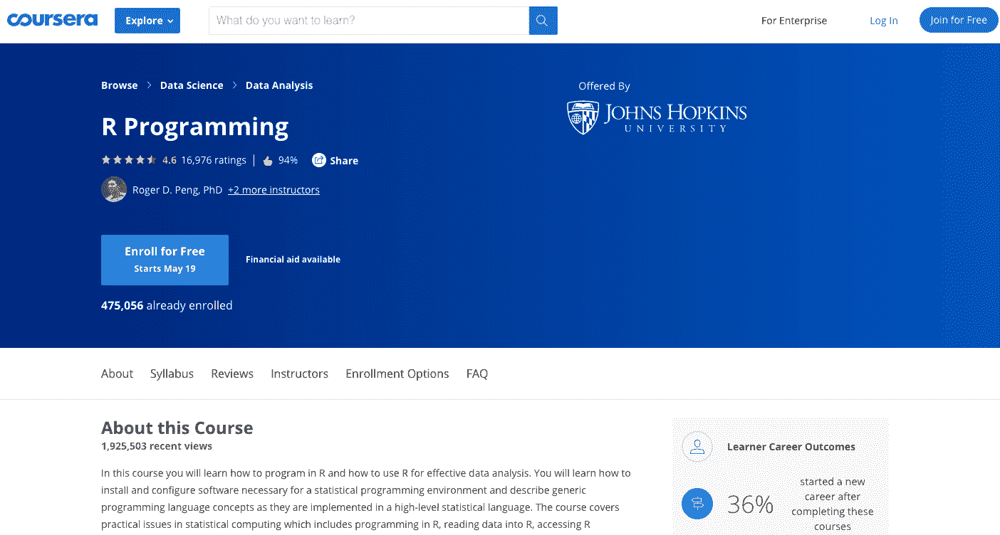
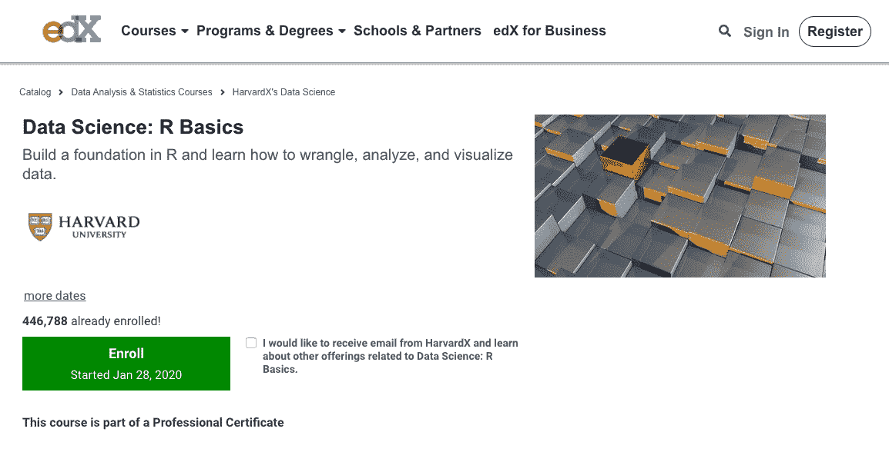
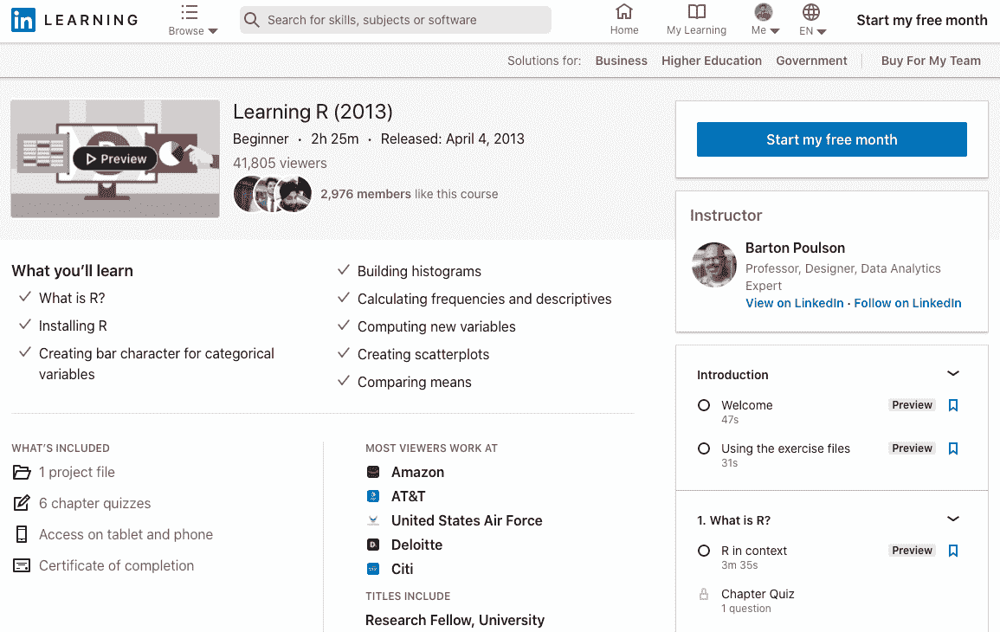
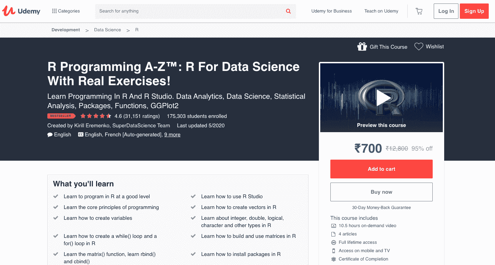
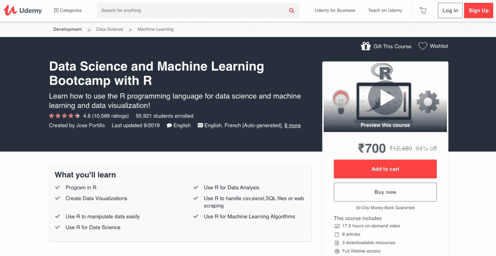
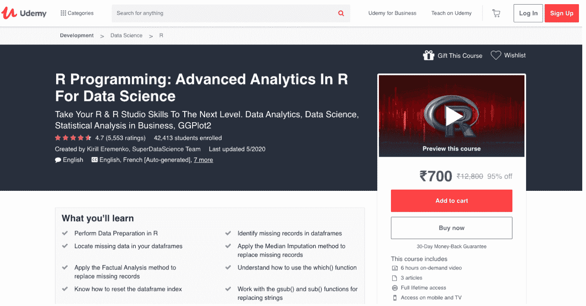
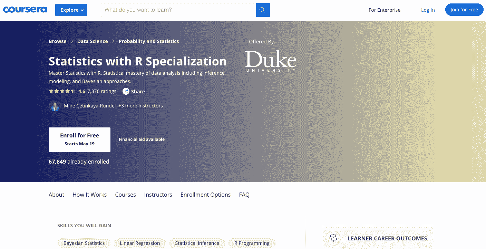
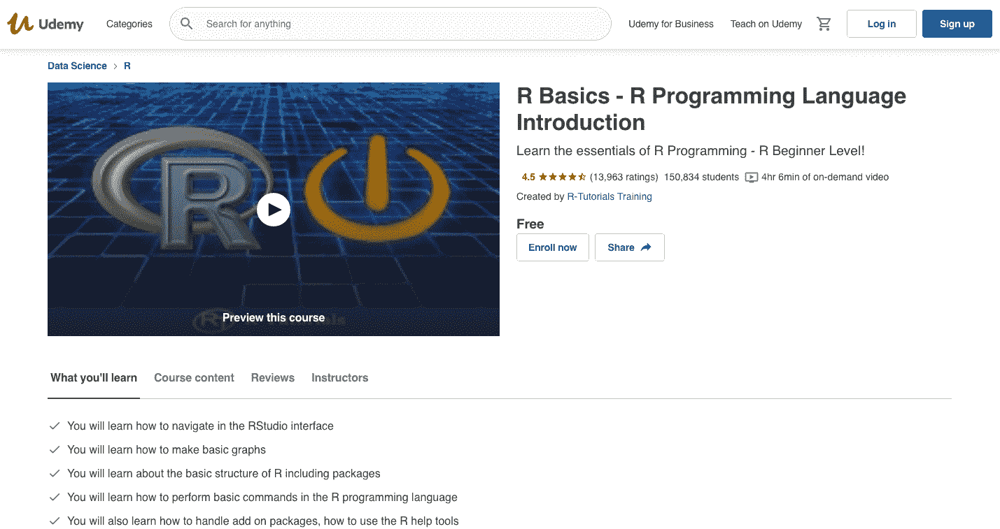
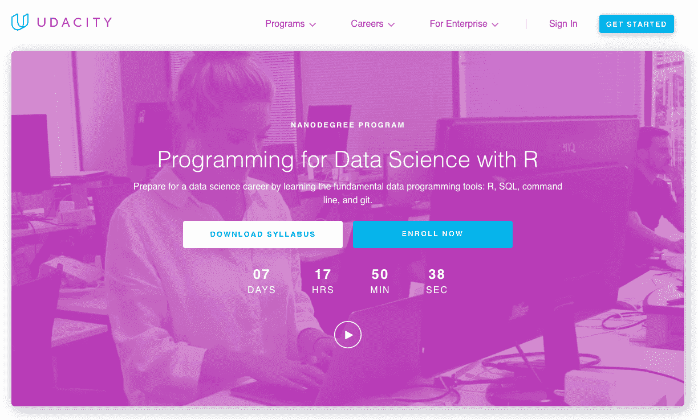

# R 程序员提供的最佳 R 课程和在线 R 认证

> 原文：<https://hackr.io/blog/best-r-courses>

[数据科学和机器学习](https://hackr.io/blog/data-science-vs-machine-learning)在这个人工智能时代，工作需求很大，学生和专业人士在寻找高薪技术工作时，越来越倾向于学习 R 编程语言。

对于那些不太熟悉 R 编程语言的人来说，这里有一个概述。

r 是一种函数式语言，它为统计计算和图形提供了一个自由的软件环境。r 提供精心设计的出版物质量的绘图，包括数学符号和公式。

### **R 的特性**

1.  数据处理和操作。
2.  用于数组计算的运算符。
3.  一大堆相关的工具。
4.  数据分析的图形设备。

## 最佳 R 课程

现在让我们看看下面的 R 编程课程，开始你的 R 编程生涯。

 课程向你介绍用 R 编写代码，以及如何使用 R 进行有效的数据分析。您将学习安装和配置统计编程环境所需的软件，并描述用高级统计语言实现的通用编程语言概念。

本课程还涵盖统计计算中的实际问题，包括:

*   R 语言编程
*   读取 R 中的数据
*   访问 R 包
*   编写 R 函数
*   排除故障
*   剖析 R 代码
*   组织和注释 R 代码

**先决条件:**熟悉 Python
**水平**:中级
**等级:** 4.6
**时长** : 20 小时
**语言:**字幕:阿拉伯语、法语、汉语、葡萄牙语、越南语、英语、西班牙语、日语。

你可以在这里注册。

 该课程旨在向学习者介绍 R 编程的基础知识。该课程涵盖了 R 的函数和数据类型，然后处理向量操作以及何时使用排序等高级函数。您将学习应用一般编程功能，如概率，推理，回归，机器学习也涵盖在内。

最后，本课程培养的技能包括:

*   与 dplyr 的数据争论
*   使用 ggplot2 实现数据可视化
*   文件组织 UNIX/Linux
*   版本控制
*   使用 R studio 进行可重复的文档准备

**先决条件:**建议使用最新的浏览器，以便在基于浏览器的界面中直接编程。
**等级:**入门
**评分:** 4.6
**时长:**8 周(1-2 小时/周)
**语言:**英语

你可以在这里注册。

 作者用 R 教统计处理语言，包括安装 R，从 SPSS 和[电子表格](https://productivityspot.com/)中读取数据，使用高级 R 函数的包。本课程进一步解释了使用其他数据分析工具创建图表和绘图的示例。它还训练从 R 中获取图表和表格，并通过演示和网页共享您的结果。

**课程结束时，您将学到:**

*   R 是什么？
*   安装 R
*   为分类变量创建条形字符
*   构建直方图
*   计算频率和描述符
*   计算新变量
*   创建散点图
*   比较手段

**先决条件:**无
**等级:**初级
**等级:** 4.6
**时长:** 2 小时 25 分钟
**语言:**英语

你可以在这里注册。

 R 有一个陡峭的学习曲线，因此，提供循序渐进的学习，从而使学习更容易。你会得到新的有价值的概念，这些概念可以通过实例立即应用。培训由学员需要解决的现实生活分析挑战组成。该课程面向所有技能水平，甚至是没有编程背景的人。

**该计划提供以下内容:**

*   在良好水平上学习用 R 编程
*   了解如何使用 R Studio
*   学习编程的核心原则
*   学习如何在 R 中创建向量
*   了解如何创建变量
*   了解 R 中的整数、双精度、逻辑、字符和其他类型
*   了解如何在 R 中创建 while()循环和 for()循环
*   学习如何在 R 中构建和使用矩阵
*   学习 matrix()函数，学习 rbind()和 cbind()
*   了解如何在 R 中安装包
*   了解如何定制 R studio 以适合您的偏好
*   理解大数定律
*   理解正态分布
*   练习在 R 中使用统计数据
*   练习在 R 中使用财务数据
*   练习在 R 中使用体育数据

**先决条件:**无
**等级:**所有等级
**评分:** 4.6
**时长:** 10.5 小时
**语言:**英语

你可以在这里注册。

该平台编制了一份 14 门课程的清单，这些课程可能会对提高 R 编程和开发技能有所帮助。不同的课程侧重于用不同的方法在不同的领域使用这种语言的不同方面。这些课程将强化你的 R 编程基础，R 数据科学，[数据可视化](https://hackr.io/blog/what-is-data-visualization)等等。也有其他程序关注不同领域的 R，如[机器学习](https://hackr.io/blog/what-is-machine-learning-definition-types)，数据管理和分析。

在他们选择的课程结束时，候选人将有信心和技能在不同的项目中运用所学的知识。

**特性:**

*   通过使用不同的功能和编写代码来实现课程中涵盖的概念。
*   在 Microsoft Data Platform、RStudio 等多个平台上工作，并使用 Cloudera、Python 和 Scala 开发 Spark 应用程序。
*   安装、配置完成课程所需的必要软件和工具。
*   你报名参加的课程在头十天的试用期内可以免费使用。

**先决条件:**无
**等级:**所有等级
**等级:** 4.6
**时长:**不等
**语言:**英语

你可以在这里注册。

 数据科学和机器学习工作正在获得动力，因为根据 Glassdoor，这也是高薪工作。圣塔克拉拉大学的硕士何塞·马西亚尔·波尔蒂利亚是本课程的作者，他将教你使用 [R 进行数据科学](https://hackr.io/blog/r-for-data-science)、机器学习和数据可视化。此外，您还将了解 R 的高级特性，比如使用 R 数据框来解决复杂的任务和处理 Excel 文件。

在课程结束时，您将了解到以下内容:

*   R 中的程序
*   使用 R 进行数据分析
*   创建数据可视化
*   使用 R 来处理 CSV、excel、SQL 文件或 web 抓取
*   使用 R 可以轻松操作数据
*   将 R 用于机器学习算法
*   将 R 用于数据科学

**先决条件:**无
**等级:**所有等级
**评分:** 4.6
**时长:** 17.5 小时
**语言:**英语

你可以在这里注册。

 该课程是为那些想要深入研究和学习数据分析、数据科学、商业中的统计分析的人准备的，GGPlot2 参考 R and R 工作室。这是一门高级课程，采用独特的数据集、实例和练习进行教学。它还提供专业的 R 视频培训，既有趣又能提高你的技能。

该课程将教授以下内容:

*   如何为 R 中的分析准备数据
*   如何在 R 中执行中位数插补方法
*   如何在 R 中处理日期时间
*   什么是列表以及如何使用它们
*   什么是应用功能系列
*   如何使用 apply()、lapply()和 sapply()代替循环
*   如何在应用类型函数中嵌套您自己的函数
*   如何将 apply()、lapply()和 sapply()函数嵌套在一起。

**先决条件:**基础 R 编程
**等级:**高级
**等级:** 4.6
**时长:** 7 个月(4 小时/周)
**语言:**英语、韩语

你可以在这里注册。

 由杜克大学创建，R 课程中的统计专业化是为希望掌握 R 中的统计或希望精通数据分析(包括推理、建模和贝叶斯方法)的人准备的。Mine etin Kaya-run del 程序的作者，副教授；大卫·班克斯，教授；科林·伦德尔，助理教授；Merlise A Clyde 教授教授在 r 中分析和可视化数据。除此之外，本课程还教您以下内容:

*   创建可重复的数据分析报告。展示对统计推断的统一性的概念性理解。
*   执行 frequentist 和贝叶斯统计推断和建模，以了解自然现象并做出基于数据的决策。
*   准确、有效地传达统计结果，不依赖统计术语。评论基于数据的主张，评估基于数据的决策。
*   使用 R 包进行数据分析，并使数据可视化。

在课程结束时，您将从专业中建立一个数据分析项目组合，展示对统计数据分析的掌握，这适合申请统计分析或数据科学家职位。

**先决条件:**无
**等级:**初级
**等级:** 4.6
**时长:**6 小时
**语言:**英语

你可以在这里注册。

 课程从零开始介绍 R 编程。它遵循循序渐进的方法，因此非常适合初学者。本课程从安装 R and R 工作室界面开始，学习使用 R 数据库和 R 帮助工具。

接下来，本课程将教授导入数据的各种方法，然后编写包括基本 R 函数在内的语言。

以下是一个人将获得的好处:

*   您将学习如何在 RStudio 界面中导航
*   你将学习如何制作基本的图表
*   您将了解 R 的基本结构，包括包
*   您将学习如何在 R 编程语言中执行基本命令
*   您还将学习如何处理插件包，如何使用 R 帮助工具，以及如何在 R 世界中找到自己的路。

**先决条件:**

*   对统计编程真正感兴趣
*   计算机准备运行 r 和 studio
*   对统计学和数据结构有基本的理解
*   不需要编程方面的知识

**等级:**初级
**等级:** 4.5
**时长:** 4 小时
**语言:**英语

你可以在这里注册。

 如果你期待在数据科学领域有所作为，这是一门合适的课程。在本课程中，您将学习 SQL、R 和 Git 等基础数据科学工具，帮助您解决现实世界中的数据分析问题。

在本课程中，您将学习:

*   R 编程的基础，如变量、循环和函数。
*   使用版本控制与其他人共享您的工作。
*   SQL 简介
*   R 语言编程
*   来自行业专家的真实项目

**先决条件:**无
**等级:**初级
**等级:** 4.6
**时长:** 3 个月(10 小时/周)
**语言:**英语

你可以在这里注册。

现在让我们看看一些最好的 R 认证。这些证书将帮助你测试你的 R 编程语言技能，并指导你完成真实的项目，并在成功完成时授予证书。

## 最佳 R 认证

该学位由全球数据科学领导者毕马威& ML 咨询公司提供，由行业专家设计，帮助您学习数据科学概念，以构建强大的 AI 模型，提供商业洞察或预测。

它还提供实际业务问题和案例研究的实践经验，给你最好的学习体验，并训练你分析复杂的业务数据&进行销售预测。

包括以下内容:

1.  带 R 的统计
2.  数据科学与 R
3.  使用 Python 的数据科学
4.  SQL 编程
5.  表

你可以在这里注册。

结论

## 这就是我们今年要学习的最佳 R 课程和最佳 R 认证的结尾。我建议你从这个列表中选择数据科学甚至生物信息学的职业。大多数课程排名很高，也不需要任何先决条件，所以这一定会鼓励你踏上这段旅程。一旦你获得了自信，并且彻底地学习了，你可能会想要获得认证，因为你可以检查 R 认证。一旦你成为一名 R 专业人员，并为一份工作做好了一切准备，你就可以为 R 面试做准备，以获得你梦想中的数据科学工作。如果你有任何其他高评级的课程可以分享，这可能有助于 R 社区在下面的评论中与我们分享。

**人也在读:**

**People are also reading:**