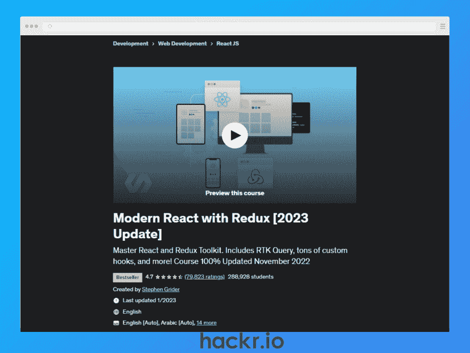
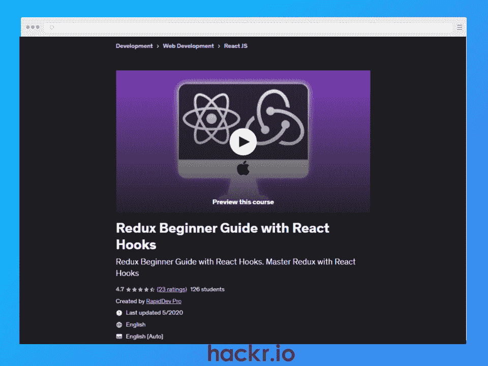
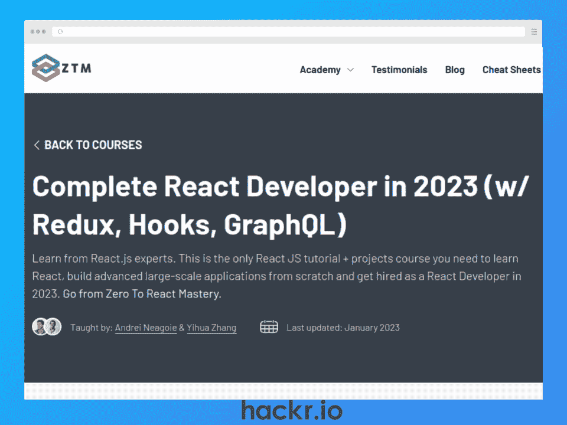
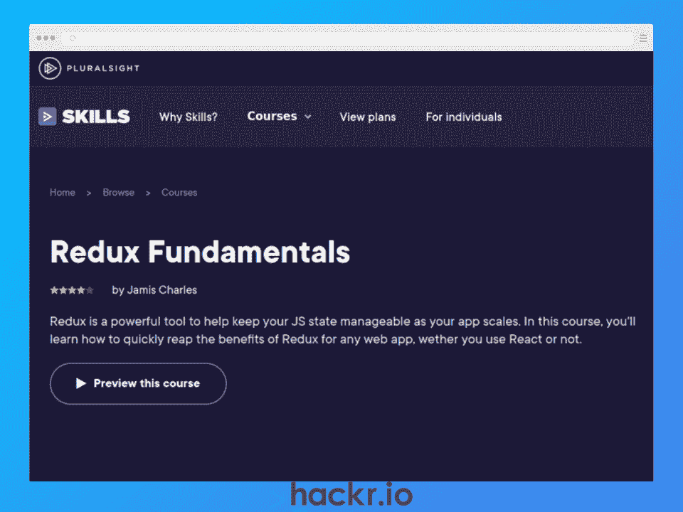
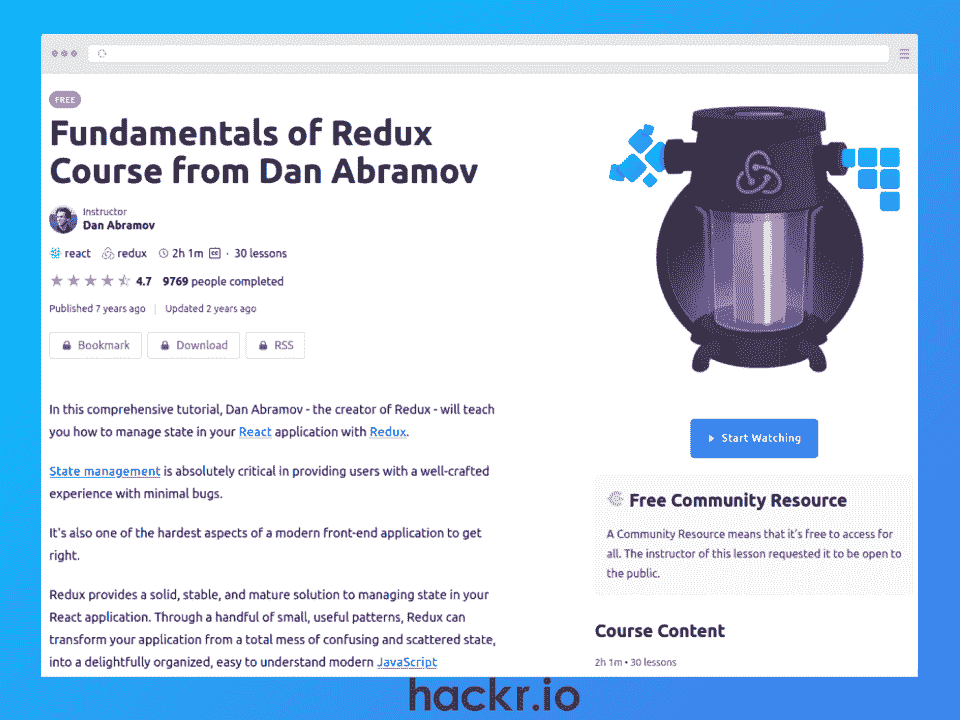
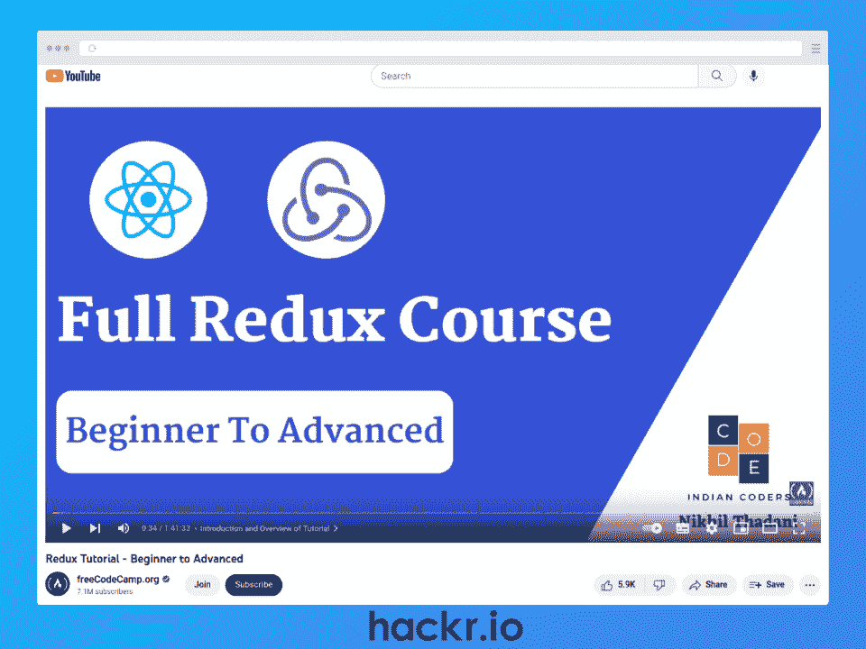
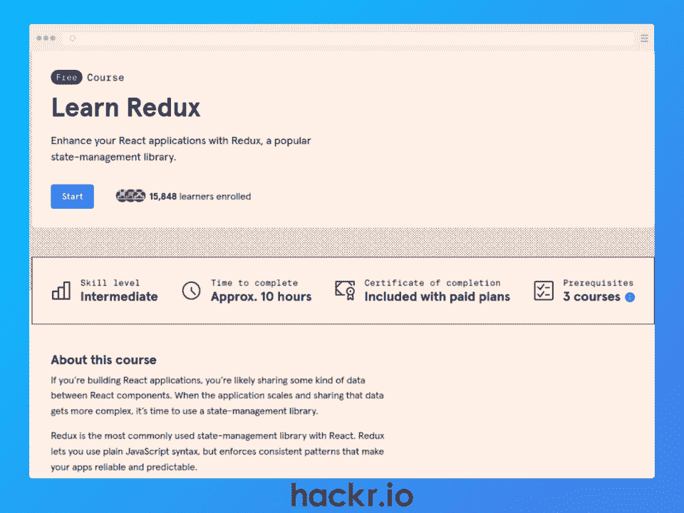
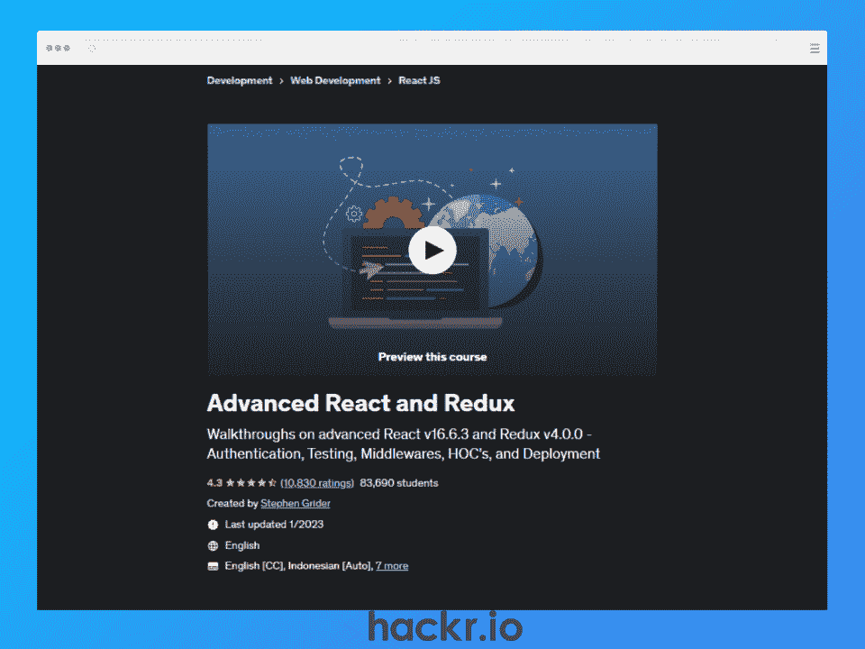

# 2023 年 10 大最佳 Redux 在线课程【免费+付费】

> 原文：<https://hackr.io/blog/best-redux-courses>

有了这么多有价值的库和框架，难怪 JavaScript 在 StackOverflow 开发者调查中继续被列为最受欢迎的语言。如果您正在寻找创建具有一致和可预测性能的 JavaScript 应用程序来处理客户端、服务器或本地环境中的*应用程序* *状态*，Redux 可能是您的完美 JS 库。

简而言之，这个开源的轻量级库是一个*可预测的状态容器*，通常用于与其他前端框架(如 React 或 Angular)一起处理*状态管理*。Redux 开发人员[的基本工资超过 85，000 美元](https://www.glassdoor.com/Salaries/redux-developer-salary-SRCH_KO0,15.htm)，这是 JavaScript 开发人员学习 Redux 的最佳时机。

因此，无论您是 JavaScript 新手还是 10x JavaScript 开发人员，如果您已经构建或计划构建需要管理应用程序状态的 JS 应用程序，请继续阅读，了解 2023 年十大最佳 Redux 在线课程。

**特色 Redux 课程【编辑推荐】**

## **选择最佳重复课程**

考虑到以下标准，我们列出了 2023 年 10 个最好的 Redux 球场。

*   **指导老师:**他们作为老师或者行业专业人士有多少经验？以前的学生对他们评价高吗？
*   **内容:**课程材料的详细程度和相关性如何？它涵盖现实世界的话题吗？往届同学推荐吗？
*   **社区:**有多少人上过这门课？你能轻易地找到支持吗？

## **在线 10 大最佳 Redux 课程**

想要提升您的 JavaScript 组合吗？查看 [**最佳反应项目**](https://hackr.io/blog/react-projects)

[****](https://click.linksynergy.com/deeplink?id=jU79Zysihs4&mid=39197&murl=https%3A%2F%2Fwww.udemy.com%2Fcourse%2Freact-redux%2F)

[了解更多信息](https://click.linksynergy.com/deeplink?id=jU79Zysihs4&mid=39197&murl=https%3A%2F%2Fwww.udemy.com%2Fcourse%2Freact-redux%2F)

**我们为什么选择本课程**

如果您想学习 Redux 和 React 的基础知识来创建动态 web 应用程序，那么本 React Redux 教程是理想的选择。您将了解 JSX、国家、构建可重用组件、样式库等等。

**优点**

*   Redux 和 React 基础知识的详细内容
*   包括课程练习和测验
*   经验丰富的讲师

**缺点**

*   对 React 的大量关注可能不适合那些只想学习 Redux 的人

**关键信息**

**先决条件:**以前的编程经验

讲师:斯蒂芬·格里德

**等级:**初学者

**免费或付费:**付费

**证书:**是

**时长:** 64 小时(视频内容)

**评级:** 4.7/5

[****](https://click.linksynergy.com/deeplink?id=jU79Zysihs4&mid=39197&murl=https%3A%2F%2Fwww.udemy.com%2Fcourse%2Freact-redux-hooks%2F)

[了解更多信息](https://click.linksynergy.com/deeplink?id=jU79Zysihs4&mid=39197&murl=https%3A%2F%2Fwww.udemy.com%2Fcourse%2Freact-redux-hooks%2F)

**我们为什么选择本课程**

如果你想要一个关于 Redux 和 React 状态管理的初学者指南，这个简短的 Redux 在线课程是理想的。您将学习基本的 Redux 概念，如 action、reducer、store、middleware、dispatch、async action 等等。

从 Redux 基础知识开始，本课程将帮助您学习使用 Redux 处理应用程序状态的复杂概念和最佳实践。

**优点**

*   Redux 简明教程
*   包括处理应用程序级状态的最佳实践

**缺点**

**关键信息**

**先决条件:**基础 JavaScript & React 知识

**指导老师:** RapidDev Pro

**等级:**初学者

**免费或付费:**付费

**证书:**是

**时长:** 3.5 小时(视频内容)

**评级:** 4.7/5

[了解更多信息](https://zerotomastery.io/courses/learn-react/)

**我们为什么选择本课程**

如果你想学习 React Redux 来构建大规模的 web 应用，这个 Redux 课程是非常完美的。在深入研究异步 Redux、Redux thunk/saga 和其他关键的 Redux 主题之前，您将学习基本的 React 主题，包括钩子、上下文 API、React 路由器等等。

本课程结束时，您将了解如何使用 Redux 和 React 构建大规模应用程序。

**优点**

*   全面涵盖用于构建大规模应用程序的 Redux 和 React
*   包括在学习中构建的真实项目
*   经验丰富的讲师已经在硅谷开发了企业级应用

**缺点**

*   对 React 的过度关注可能不适合那些喜欢其他前端框架的人

**关键信息**

**先决条件:**基本的 HTML、CSS、& JavaScript 知识

教练:张一华&安德烈·尼古瓦

**等级:**初学者

**免费或付费:**付费

**证书:**是

**时长:** 42.5 小时(视频内容)

**评级:**不适用

[了解更多信息](https://pluralsight.pxf.io/7mEWRY)

**我们为什么选择本课程**

这是学习 Redux 基础知识的理想速成课程，用于处理 web 应用程序的 JavaScript 状态管理。您将学习基本的 Redux 概念，如异步动作、状态、Redux 内部机制等等。本课程还讲述了如何将 Redux 与 React 配合使用。

本课程结束时，您将掌握向新的或现有的 JavaScript web 应用程序添加 Redux 的技能。你还将知道如何选择 Redux 是否是你的应用程序的正确选择。

**优点**

*   学会识别 Redux 是否是 JS 应用程序的正确选择
*   包括 React 速成班
*   经验丰富的讲师是 PayPal 的 UI 工程师

**缺点**

*   对于更有经验的 JavaScript 开发人员来说，内容可能太简单了

**关键信息**

**先决条件:**基础 JavaScript

讲师:贾米斯·查尔斯

**等级:**初学者

**免费或付费:**付费

**证书:**否

**时长:** 3.5 小时(视频内容)

**评级:** 4.0/5

[****](https://egghead.io/courses/fundamentals-of-redux-course-from-dan-abramov-bd5cc867)

[了解更多信息](https://egghead.io/courses/fundamentals-of-redux-course-from-dan-abramov-bd5cc867)

**我们为什么选择本课程**

如果你正在寻找最好的 Redux 教程，这个简短而全面的选项不仅完全免费，而且它来自 Redux 的创造者丹·阿布拉莫夫！您将了解状态管理的基础知识、它的重要性和烦恼，以及 Redux 如何帮助简化这一挑战。

在学习如何使用 Redux 管理 JS React 应用程序中的状态之前，您还将学习 Redux 的基础知识，如 reducers、state、actions 和 store。

**优点**

*   Redux 上完全免费的教程
*   讲师是 Redux 的创建者和反应专家
*   侧重于编码的实践学习

**缺点**

*   课程内容可能已经过时

**关键信息**

**先决条件:**基本反应& JavaScript 知识

讲师:丹·阿布拉莫夫

**等级:**初学者

**免费或付费:**免费

**证书:**否

**时长:** 2 小时(视频内容)

**评级:** 4.7/5

[****](https://www.youtube.com/watch?v=zrs7u6bdbUw)

[了解更多信息](https://www.youtube.com/watch?v=zrs7u6bdbUw)

**我们为什么选择本课程**

这个来自 FreeCodeCamp 的简短 Redux 教程是完全免费的。在不到两个小时的时间里，您将学习如何使用 Redux toolkit 库创建 web 应用程序，包括 Thunk、HTTP 请求等基本概念，以及如何使用 Firebase。

这也是一门实践性很强的课程，所以您可以通过为您的投资组合构建一个小项目来掌握实际的编码。

**优点:**

*   完全免费和全面的 Redux 课程
*   以项目为基础的学习，为你的作品集准备一个项目

**缺点:**

*   没有结业证书

**关键信息**

**先决条件:**反应知识

教练:尼基尔·塔达尼

**等级:**初学者

**免费或付费:**免费

**证书:**否

**时长:** 1.75 小时(视频内容)

**评级:**不适用

[****](https://click.linksynergy.com/deeplink?id=jU79Zysihs4&mid=39197&murl=https%3A%2F%2Fwww.udemy.com%2Fcourse%2Fthe-ultimate-redux-course-state-management-library%2F)

[了解更多信息](https://click.linksynergy.com/deeplink?id=jU79Zysihs4&mid=39197&murl=https%3A%2F%2Fwww.udemy.com%2Fcourse%2Fthe-ultimate-redux-course-state-management-library%2F)

**我们为什么选择本课程**

对于想要快速学习使用 Redux 工具包的中级 JS 开发人员来说，这是一门完美的课程。在不到 4 个小时的时间里，您将了解什么是 Redux，何时使用它，重要的 Redux 模式，如何调试 Redux 应用程序，以及如何将 Redux 与 React 连接起来。

在这个短期课程结束时，你将会写出干净专业的 Redux 代码。

**优点**

*   以有趣的方式教授 Redux 概念
*   关注 Redux 概念，而不是前端框架
*   学习使用中间件&如何创建自己的中间件

**缺点**

*   期望您了解或学会单独使用前端框架

**关键信息**

**先决条件:**基础 JavaScript

**指导老师:**码祝福你

**等级:**中级

**免费或付费:**付费

**证书:**是

**持续时间:** 3.5 小时

**评级:** 4.6/5

[****](https://pluralsight.pxf.io/kjD02d)

[了解更多信息](https://pluralsight.pxf.io/kjD02d)

**我们为什么选择本课程**

这个中级 React Redux 课程教你使用 Redux 和 React 17 从零开始构建现代 JavaScript web 应用。

您不仅将学习 Redux 基本要素，如 actions、stores 和 reducers，还将涉及 Babel、Jest、Enzyme 等，以拓宽您的 JS web 应用程序技能。甚至还有一节是关于为林挺创建和优化 JS 开发环境以及测试应用程序的。

**优点**

*   结合 Redux 和 React 构建现代 web 应用程序
*   学习创建定制的开发环境
*   经验丰富的讲师

**缺点**

*   需要预先了解 React 和 JavaScript

**关键信息**

**先决条件:** React & JavaScript 知识

**指导老师:**科里屋

**等级:**中级

**免费或付费:**付费

**证书:**否

**时长:** 6.75 小时(视频内容)

**评分:** 5/5

**申请 JS React 开发者工作？准备用我们的** [**顶反应面试问题**](https://hackr.io/blog/react-interview-questions)

[****](https://www.pntrac.com/t/TUJGR0lLR0JHRklKSkdCR0ZISk1N)

[了解更多信息](https://www.pntrac.com/t/TUJGR0lLR0JHRklKSkdCR0ZISk1N)

**我们为什么选择本课程**

如果你正在寻找中级 React Redux 教程，这是理想的。针对已经在使用 React 创建应用程序的 JS 开发人员，您将学习如何集成 Redux，以便在应用程序扩展或变得更加复杂时帮助进行状态管理。

在深入研究核心 API、Redux 工具包、异步动作和连接 Redux 以做出反应之前，您将学习 Redux 的核心概念，如 redox、存储和动作。

**优点**

*   综合课程包括初级和高级主题
*   通过互动平台进行实践学习
*   巩固学习的测验、评估和项目

**缺点**

*   仅带付费选项的结业证书

**关键信息**

**先决条件:**反应知识

**讲师:**不适用

**等级:**中级

**免费或付费:**免费或付费选项

**证书:**是，带付费选项

**时长:** 10 小时(视频内容)

**评级:**不适用

[****](https://click.linksynergy.com/deeplink?id=jU79Zysihs4&mid=39197&murl=https%3A%2F%2Fwww.udemy.com%2Fcourse%2Freact-redux-tutorial%2F)

[了解更多信息](https://click.linksynergy.com/deeplink?id=jU79Zysihs4&mid=39197&murl=https%3A%2F%2Fwww.udemy.com%2Fcourse%2Freact-redux-tutorial%2F)

**我们为什么选择本课程**

这个高级 Redux 课程直接深入到一系列有用的主题，用于使用 React、Express 和 MongoDB 构建现代全栈 JS web 应用程序。

期望了解 Redux 幕后，如何编写 Redux 中间件代码，Redux 测试，异步动作，认证，创建 API，高阶组件等等。

**优点**

*   高级和全面的 Redux 课程材料
*   通过 React、Express 和 MongoDB 了解 Redux
*   经验丰富的讲师

**缺点**

*   需要 React & Redux 知识，所以不适合初学者

**关键信息**

**先决条件:**中间反应&还原知识

讲师:斯蒂芬·格里德

**等级:**高级

**免费或付费:**付费

**证书:**是

**时长:** 21 小时(视频内容)

**评级:** 4.4/5

## **结论**

无论您是 JavaScript 初学者，还是构建了数百个 JS 应用程序的 10x 开发人员，Redux 都是一个优秀的开源 JavaScript 库，用于在各种环境中管理应用程序的状态。

基本工资[超过 85，000 美元](https://www.glassdoor.com/Salaries/redux-developer-salary-SRCH_KO0,15.htm)，现在是将 Redux 技能添加到您的 JavaScript 工具包的绝佳时机！为了帮助你踏上学习之旅，本文涵盖了 2023 年 10 门最佳 Redux 在线课程。这包括一系列免费和付费的选项，供完全初学者或有经验的 JavaScript 开发人员使用。

想在 2023 年提升你的 JavaScript 技能吗？查看 [**最佳反应课程**](https://hackr.io/blog/react-courses)

## **常见问题解答**

#### **1。什么是 Redux 课程？**

Redux 课程是一个教学单元，通常由讲师带领，使用一系列视频和文本内容来教您如何使用 Redux，这是一个用于管理和集中应用程序状态的开源 JavaScript 库。

#### **2。Redux 要学多久？**

如果你是一个完全的初学者，我们的列表包括少于 4 小时的入门课程。我们还增加了详细的初学者课程，需要 40-60 个小时，因为它们也涵盖了 React 框架。如果你是一个经验丰富的开发人员，课程长度从 3-20 小时不等，取决于你想深入 Redux。

然而，总的来说，它依赖于你的空闲时间、你当前的 JavaScript、Redux 和潜在的 React 知识。

#### **3。Redux 难学吗？**

总的来说，Redux 并不是一个难学的库。然而，你学习 Redux 的难易程度将取决于几个因素，包括你当前的 JavaScript 技能，你在创建 JS 应用程序方面的经验，以及你是否已经理解了*状态*。