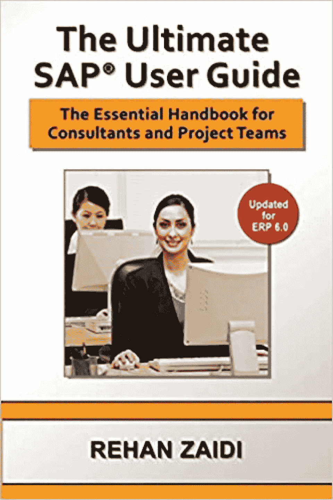
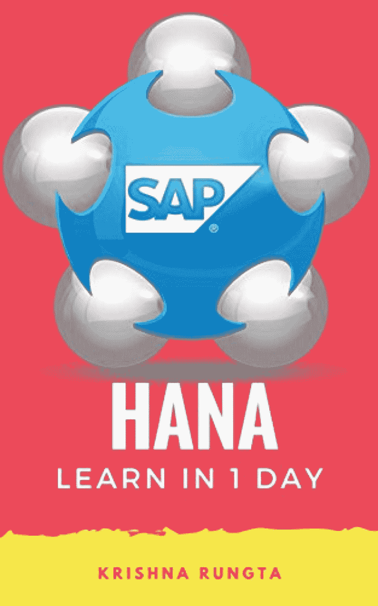
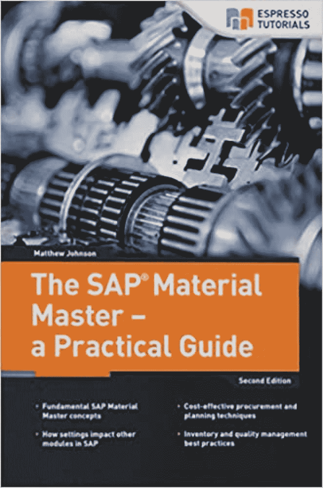
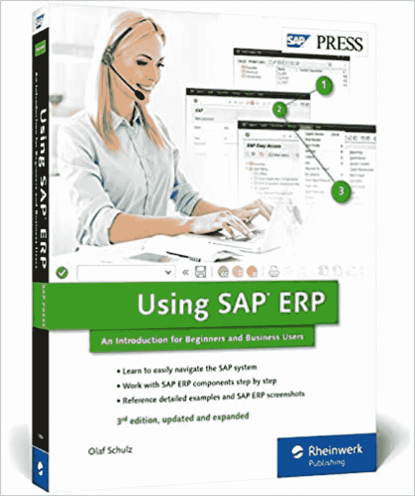
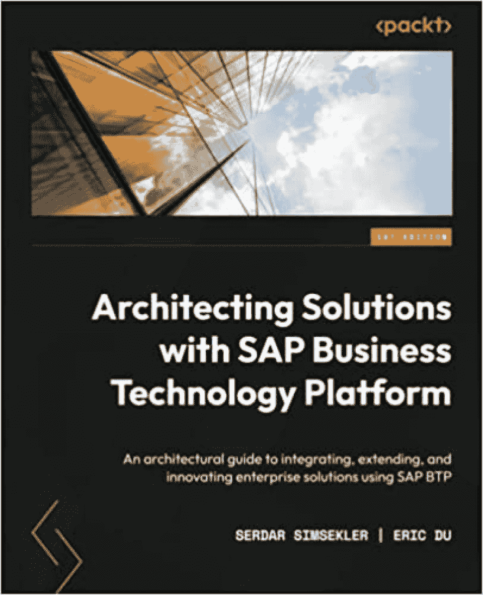
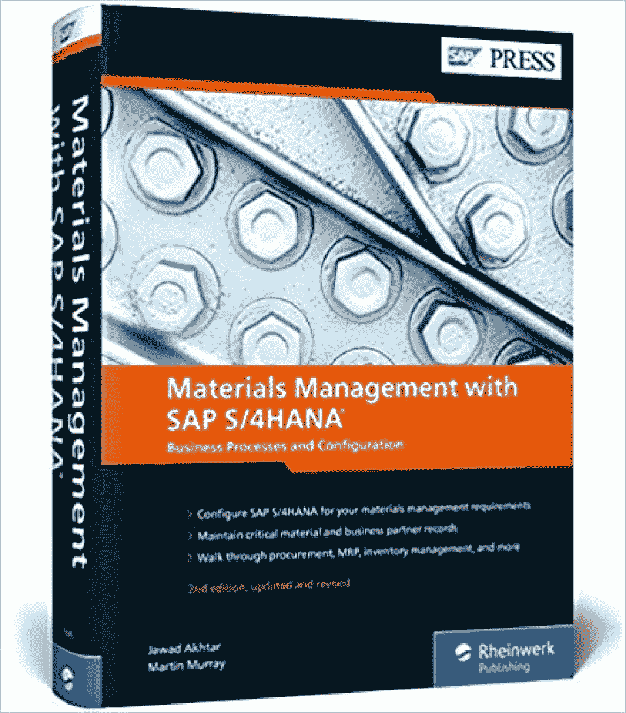
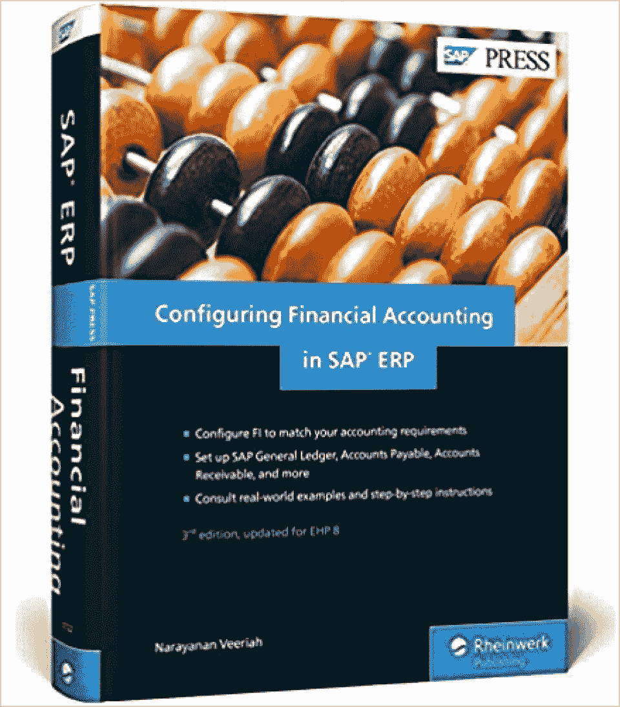
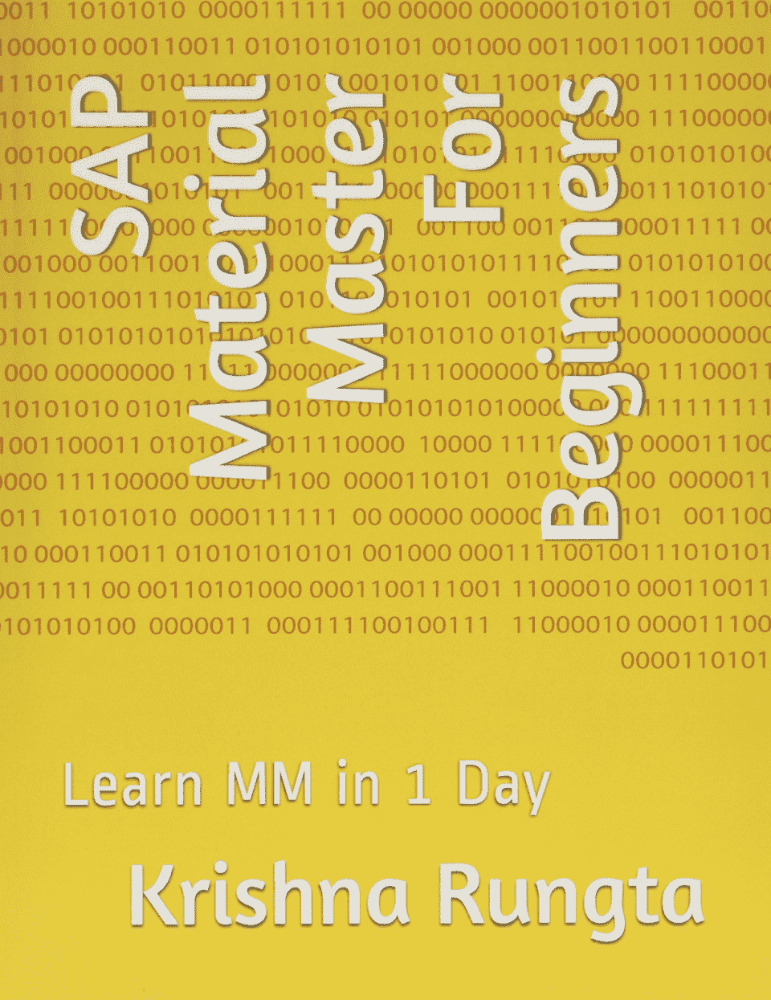
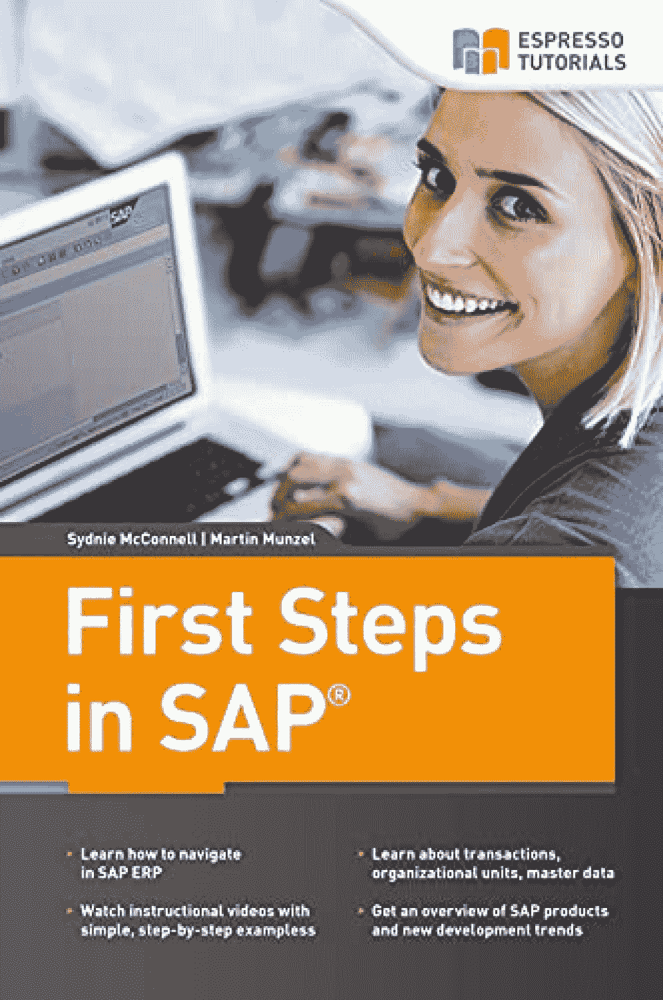
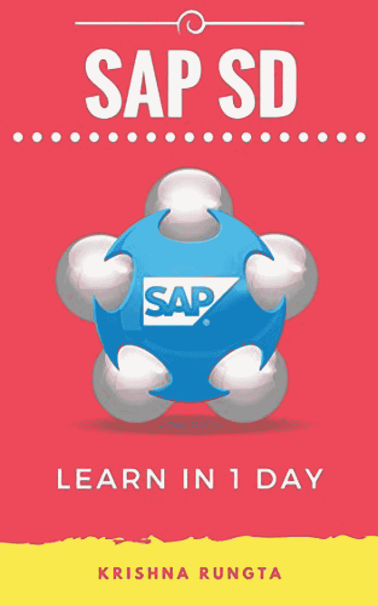

# 要阅读的 SAP 书籍

> 原文：<https://hackr.io/blog/best-sap-books>

由同名公司开发的 SAP(**S**systems**A**applications 和**P**products)是 ERP(企业资源规划)最主要的软件选择之一，与甲骨文和微软等软件巨头的产品相抗衡。

SAP 的 ERP 软件具有数百个可在内部或云上运行的集成模块，支持供应链管理、客户关系等核心业务活动。通过使用 SAP，组织可以*集中*他们的运营，提供一个了解运营业务情况的透明窗口。

如果您是许多需要在其组织中使用 ERP 软件的专业人员之一，SAP 可能是首选之一。为了帮助你掌握这些基本技能，我们找到了你在 2023 年需要阅读的 10 本最佳 SAP 书籍。

| **精选 SAP 书籍【编辑推荐】** |
|  | **标题:**SAP 最终用户指南:面向顾问和项目团队的基本 SAP 培训手册**作者:**拉汗·扎伊迪发布者:筛选备选方案**第 270 页:**[检查价格](https://geni.us/f5wkb) |  |
| **标题:**使用 SAP ERP:初学者和商业用户学习 SAP 入门 | **作者:**奥拉夫·舒尔茨**出版社:** SAP 出版社**第 392 页:**[检查价格](https://geni.us/JWVSf) | **标题:**一天学会 HANA:初学者学习 SAP HANA 的权威指南 |
|   | **作者:**奎师那·龙格塔**发布者:** Guru99**第 244 页:**[检查价格](https://geni.us/VK95)准备好通过学习新技能开始 2023 年了吗？查看[**30+最佳 Udemy 课程**](https://hackr.io/blog/best-udemy-courses)**十大最佳 SAP 书籍** | 我们挑选了 2023 年你需要阅读的 10 本最佳 SAP 书籍，包括书籍长度和书籍摘要等基本信息。 |

## [检查价格](https://geni.us/f5wkb)

**作者:**拉汗·扎伊迪

发布者:筛选备选方案

**第 270 页:**

如果您正在寻找从技术角度介绍 SAP 的 SAP 培训书籍，那么这是您的理想选择。它还包含关于个性化您的 SAP 系统的章节，以及创建您自己的报告的操作指南。

**特性**

非常适合有抱负的 SAP 专业人员、顾问和项目团队

插图有助于你将学到的东西形象化

一步一步的方法使它容易跟随

*   涵盖初级和高级主题
*   
*   [检查价格](https://geni.us/jT8R)
*   **作者:**马修·约翰逊

**发布者:**打造空间独立发布平台

**第 228 页:**

这本书提供了库存和质量管理最佳实践的宝贵信息。作者提供了一些物料管理实现示例的演练，您还将学习为您自己的本地环境定制 SAP Material Master。

**特性**

第二版吸收了第一版的反馈

带有截图和提示的实用示例

包括节约成本的建议

*   容易理解
*   
*   [检查价格](https://geni.us/HgNgt)
*   **作者:**奥拉夫·舒尔茨

**出版社:** SAP 出版社

**第 392 页:**

作为初学者的最佳 SAP 书籍之一，这是专门针对那些不熟悉 SAP ERP 系统的人的。作为一名 SAP 培训师和顾问，作者拥有二十多年的经验，他将指导您导航 SAP 系统，并教您使用 SAP 组件。

**特性**

包括真实世界的案例研究

逐步说明

包括数百张截图

*   初学者和商业用户的理想选择
*   
*   [检查价格](https://geni.us/JnhNB)
*   **作者:**埃里克·杜，塞尔达尔·西姆塞尔克

**出版商:** Packt 出版公司

**第 432 页:**

通过这本书，您将了解如何利用 SAP Business Technology Platform(BTP)设计企业解决方案，以优化在云中运行的 SAP 应用。该最新指南于 2022 年 10 月发布，将帮助您掌握 SAP BTP 的最新功能。

**特性**

技术和企业架构师的理想选择

假设具备基本的云知识

包括图表和实际业务场景

*   
*   [检查价格](https://geni.us/XI5YC)
*   **作者:**贾瓦德·阿赫塔尔，马丁·穆雷

**出版社:** SAP 出版社

**第 950 页:**

如果您想充分利用 HANA，那么这是关于 SAP 的最佳书籍之一。您将学习高级流程，如批处理管理、文档管理、预警系统和其他重要的内置工具。您还将学习使用最新的 SAP 费奥里应用程序来报告和监控您的系统。

**特性**

深入了解核心材料管理流程

非常适合物流、销售和分销行业

参考书的绝佳选择

*   逐步说明
*   
*   [检查价格](https://geni.us/uqrTP)
*   **作者:** Veeriah Narayanan

**出版社:** SAP 出版社

**第 916 页:**

作为从 SAP 的 ERP 解决方案中获益匪浅的核心业务领域之一，财务部门的员工将会对这份全面的指南大加赞赏。

您将学习如何配置 SAP ERP 以满足贵公司的会计要求，同时还将获得有关全球设置的详细信息，如 SAP 总帐、文档和税收。甚至有一个部分专门为应付账款、资产会计等设置重要的财务组件。

**特性**

财务会计专业人士的理想选择

在 SAP ERP 中配置财务会计的最佳实践

SAP 财务和控制模块综合指南

*   通过案例分析进行详细解释
*   
*   [检查价格](https://geni.us/FFe7wrO)
*   **作者:**奎师那·龙格塔

**发布者:** Guru99

**第 174 页:**

作为 Krishna Rungta 的 SAP 系列书籍“一天学会”的一部分，这是对 SAP 核心模块之一——材料管理(SAP MM)的初学者的极好介绍。

您将学习使用主数据、采购、报价等。还可以参考特定的开票、定价和库存管理部分。

**特性**

供应链专业人士的绝佳选择

循序渐进的操作方法文章

技术术语的深入解释

*   
*   [检查价格](https://geni.us/u1Q0MFo)
*   **作者:**马丁·芒泽尔，约尔格·西伯特

**发布者:**打造空间独立发布平台

**第 144 页:**

如果您正在寻找 SAP 的快速介绍，这是最好的 SAP 培训手册之一，因为您将获得各种 SAP 产品的概述，如 HANA、SCM、SRM 等。如果这些缩写看起来很奇怪，不要担心；这本书为初学者提供了清晰的解释。

**特性**

观看视频演示，帮助您直观地了解所学内容

与大多数 SAP 书籍相比相对较短

由三位 SAP 专家撰写

*   
*   [检查价格](https://geni.us/EpDl)
*   **作者:**奎师那·龙格塔

**发布者:** Guru99

**第 244 页:**

作为“一日学习”系列的另一个系列，这本书是对 SAP HANA 的一个很好的介绍，在相对较少的页面中涵盖了很多内容。

您将涉及各种主题，如 HANA 架构、HANA Studio、数据供应、建模、安全性等。此外，这是针对初学者的，因此您不需要任何 SAP 经验就能跟上。

**特性**

对所有新手来说，SAP 是一个很好的介绍

包括详细的例子和图像

作为参考书很棒

*   
*   [检查价格](https://geni.us/opCsN)
*   **作者:**奎师那·龙格塔

**发布者:** Guru99

**第 186 页:**

这是我们列表中最后一本“一天学会”的书，这本 SAP 书涵盖了流行的 SAP 销售和分销模块(SAP SD)。

通过各种操作方法章节，您将从详细的日常活动演练中受益，如创建报价、询价、销售订单、借项和贷项通知单等。同样，这是针对没有 SAP 知识的初学者的。

**特性**

循序渐进的教学示例

专业销售人员的绝佳选择

SAP 初学者的理想选择

*   **结论**
*   如果您已经了解到这一点，那么您应该已经了解到 SAP(**S**systems**A**applications 和**P**products)是 ERP(企业资源规划)最主要的软件选项之一，拥有数百个用于核心业务活动的集成模块，如项目管理、材料管理等等。
*   为了帮助您学习 SAP，我们涵盖了 2023 年您需要阅读的 10 本最佳 SAP 书籍，并为完全初学者和更高级的 SAP 用户提供了选项。

## **想成为 SAP 专家吗？查看** [**十大 SAP 认证**](https://hackr.io/blog/sap-certification)

**常见问题解答**

**1。什么是 SAP？**

SAP(**S**systems**A**applications 和**P**products)是由同名公司开发的 ERP(企业资源规划)最主要的软件选项之一。

## **2。学习 SAP 最好的书是什么？**

#### 没有适合 SAP 的最佳书籍，因为这取决于您当前的角色和使用 SAP 的原因。如果你完全是初学者，可以考虑[使用 SAP ERP:学习 SAP 的入门](https://geni.us/SxJ6CO)，或者[一天学会 HANA:学习 SAP 的权威指南](https://geni.us/nJkMyh)。

**3。我能多快学会 SAP？**

#### 这取决于你的期望和你的角色类型。你当然可以在一天之内学会基础知识，但要真正掌握 SAP 技能需要几周或几个月的时间。

**4。非 IT 人员可以学习 SAP 吗？**

#### 学习 SAP 不需要成为技术专家。一些使用 SAP 且非 IT 的常见业务部门包括会计、供应链、人力资源等。

This can vary depending on your expectations and the type of role you have. You can certainly learn the basics in a day, but expect it to take multiple weeks or months to absorb SAP skills truly.

#### **4\. Can a Non-IT Person Learn SAP?**

You don’t need to be a tech professional to learn SAP. Some common business departments that use SAP and are non-IT include accounting, supply chain, human resources, and more.