# 2023 年增加流量需要使用的 12 个最佳 SEO 工具

> 原文：<https://hackr.io/blog/best-seo-tools>

关于谷歌如何评估一个网站的搜索引擎结果页面，一直有一种神秘感。SEO 专家和专业人士在过去的十年中已经破解了一些代码，现在有足够的信息来帮助你实现网页的最佳搜索引擎排名。

要*完全*掌握[搜索引擎优化](https://hackr.io/blog/what-is-seo)并不容易(甚至不可能)，但是搜索引擎优化工具是让你在谷歌上保持高排名的绝佳方法。这些搜索引擎优化工具在谷歌更新算法时也是必不可少的，需要你重新思考你的搜索引擎优化策略！

因此，如果你正在寻找 2023 年最好的 SEO 软件，我们会支持你，因为这篇文章涵盖了 2023 年攀登谷歌阶梯的 12 个最好的 SEO 工具。

**特色 SEO 工具【编辑推荐】**

*   最佳全方位搜索引擎优化工具
*   [SEMRush](https://semrush.sjv.io/c/2890636/1008501/13053) -最适合分析竞争对手
*   最全面的 SEO 工具集
*   [Ubersuggest](https://neilpatel.com/ubersuggest/) -最适合内容策略

SEO 最初是为了提高网页的可访问性而开发的。它遵循 HTML4 的指导方针，有助于使网站的内容和目的更容易识别。

这意味着网页需要独特的标题，以适当地反映内容和标题，以确定其他相关信息。这些**标题、标题**和其他**页面信号**改善了用户体验，同时向搜索引擎显示页面内容。

人们喜欢它。为什么？因为 SEO 帮助他们在 SERPs 中排名更高，他们可以通过 google analytics 跟踪表现，通过搜索结果带来更多免费和有机的流量。

谷歌仍然考虑这些页面上的线索，但是除了 T2 页面上的搜索引擎优化外，它现在还关注更多的页面外信息。

**搜索引擎优化软件**是为了帮助用户管理页面内和页面外的 SEO 而开发的。这些搜索引擎排名工具也有助于建立、维护和跟踪你的策略。

你当然可以自己做所有的搜索引擎优化跟踪和报告，但这并不总是值得所有的时间和精力。一个搜索引擎优化工具可以让你的生活*变得更容易*，让你从繁琐的数据分析、关键词研究和寻找断开的链接中解脱出来，这些都需要几个小时，甚至几天。

搜索引擎优化工具也提供网站审计来检查你当前的搜索引擎优化策略，显示你的强项和弱项。公司喜欢使用搜索引擎优化审计或谷歌分析来与竞争对手比较指标。

除了这些好处，搜索引擎优化工具可以帮助您准确地评估和管理多个网站的搜索引擎优化策略和性能报告，消除潜在的人为错误。

底线？顶级搜索引擎优化工具节省时间和精力，并帮助您管理基于谷歌分析的搜索引擎优化策略。

如今，数字营销是企业发展战略和成功的关键部分。积极的在线形象和强大的搜索结果可以提升品牌形象，并带来大量的有机转化流量。

**但是仅仅建立一个网站是不够的。**

每个网站都要争夺流量蛋糕的一部分，最好的方法之一就是使用 SEO。以下是 SEO 和最好的 SEO 排名工具的帮助。

*   给你的网站带来流量，增加你的**知名度** & **在线存在感**
*   建立自己品牌的**权威** & **信誉**
*   促进**潜在客户的产生**和**的销售**
*   提供**你可以依赖的长期结果**

请记住，SEO 和 SEO 营销工具不会有同样的影响，除非你的网站是用户友好的。你的登陆页面应该始终提供良好的用户体验(UX ),以保持访问者和客户回来。

**2023 年申请 SEO 工作？看看这些** [**SEO 面试题**](https://hackr.io/blog/seo-interview-questions)

当你选择最好的搜索引擎优化应用来提高你的网站的谷歌排名时，有几个因素你需要考虑。

*   **分析和见解:**它是否提供了关于网站速度、内容质量、链接建立机会、抓取错误或其他重要指标的详细报告？
*   **易用性:**是易于学习和有效使用，还是学习曲线比较陡峭？
*   **价格:**对于所提供的功能和服务，您是否负担得起？
*   **客户支持:**他们的支持有多全面？它包括电子邮件、在线聊天或电话支持吗？是否仅限于一些支持文章或常见问题？

为了帮助您选择最佳的 SEO 平台，我们在测试中考虑了以下标准。

*   **用户体验(UX):** 简单、人性化&直观？
*   **核心功能:**它有主要的 SEO 功能吗？
*   **数据可视化:**它是否生成易于解释的数据分析？
*   **分析能力:**这些能力有多广泛？
*   **定价模式:**一个范围的用户预算有多个价位吗？
*   **附加功能:**它是否提供任何附加功能或原有功能？

为了帮助你选择最好的搜索引擎优化工具，我们已经涵盖了 12 个搜索引擎优化的最佳工具，从每个工具的关键信息的比较表开始。

| **工具** | **最佳价值计划** | **主要特征** | **免费试用** |
| [AHRS](https://ahrefs.com/) | **一点点:**每月:99 美元/月每年:每月 83 美元 | 搜索引擎优化和关键词跟踪的最佳全能应用，搜索引擎优化策略的关键问题提醒，了解竞争对手的反向链接策略 | 自由层 |
| 塞姆拉什 | **亲:**每月:119.95 美元/月每年:每月 99.95 美元 | 详细的关键词分析、竞争对手策略信息、关键词魔术、SEO 策略建议 | 7 天或免费层 |
| [Moz Pro](https://moz.com/products/pro) | **标准:**每月:99 美元/月每年:79 美元/月 | 审核您的网站，可操作的 SEO 见解，跟踪超过 1000 个关键字的网站排名，一对一演练，24 小时支持 | 30 天 |
| [芒果/KWFinder](https://kwfinder.com/) | **基本:**每月:49 美元/月每年:每月 29.90 美元 | 寻找长尾关键词&获得洞察力、本地关键词研究、竞争对手关键词洞察力 | 10 天 |
| [Ubersuggest](https://neilpatel.com/ubersuggest/) | **个人:**每月:29 美元/月寿命:290 美元 | 强大的关键字研究工具、网站审计、流量分析器 | 7 天或免费层 |
| [女低音](https://www.woorank.com/) | **亲:**每月:79.99 美元/月每年:53.25 美元/月 | 营销清单、移动和社交媒体数据分析、搜索引擎优化分析 | 14 天 |
| [雄伟壮观](https://majestic.com/) | **一点点:**每月:49.99 美元/月每年:41.67 美元/月 | 批量反向链接检查，网站浏览器，关键字工具，以找到最好的关键字 | 7 天(退款)或免费等级 |
| [SpyFu](https://www.spyfu.com/) | **基本:**每月:每月 39 美元每年:每月 33 美元 | 竞争对手关键词分析、点击付费/搜索引擎优化/关键词研究工具 | 30 天(退款) |
| [BuzzStream](https://www.buzzstream.com/) | **启动器:**每月:24 美元/月 | 销售线索查找工具，查找联系信息，查找影响者是否与营销活动有关联 | 14 天 |
| [ScreamingFrog](https://www.screamingfrog.co.uk/seo-spider/) | **已支付:**每年:209 美元 | 超快，搜索引擎优化网站审计工具，通知搜索引擎优化错误和重复内容，找到需要改进的地方 | 自由层 |
| [回答公众](https://answerthepublic.com/) | **已支付:**每月:99 美元/月每年:79 美元/月 | 隐藏不想要的结果和分支，监控关键词趋势，查看实时关键词搜索 | 自由层 |
| [生长栏](https://www.growthbarseo.com/) | **标准:**每月:48 美元/月每年:每月 29 美元 | 脸书广告特写，人工智能写作，人工智能博客帖子创意，人工智能概述 | 5 天 |

****

如果你花时间研究 SEO 软件工具，你可能会遇到 Ahrefs。这并不奇怪，因为它是最佳选择之一，也是仅次于谷歌的大型网站爬虫。

作为顶级的 SEO 软件之一，Ahrefs 可以帮助你计划、维护和跟踪你的 SEO 策略。例如，这个工具可以让你找到人们在谷歌上搜索的内容，从而快速评估你从一个主题中获得的潜在搜索流量。

Ahrefs 还允许你估计一个关键词的难度等级，帮助你决定是专注于这个关键词还是寻找另一个竞争较低的关键词。

许多专家使用并推荐 Ahrefs，因为它设计良好的网站审计功能，可以突出网站和 SEO 策略中需要改进的地方。

Ahrefs 还可以通过检查竞争对手的反向链接来帮助你确定反向链接策略。您还可以使用站点浏览器功能查看竞争对手的搜索结果及其最高搜索量页面。

**我们喜欢的:**

*   详细记录了教程和用户支持
*   为知识渊博的用户提供大量高级工具
*   提供免费试用

**定价:**

*   免费层:访问网站管理员工具，每月 5000 次抓取
*   **Lite:每月 99 美元，如果按年支付，相当于每月 83 美元**
*   标准:每月 199 美元，如果按年支付，则相当于每月 166 美元
*   **高级:**每月 399 美元，如果按年支付，则相当于每月 333 美元
*   企业:每月 999 美元，如果按年支付，则相当于每月 833 美元

[了解更多信息](https://ahrefs.com/)

### **2。** [**塞姆拉什**](https://semrush.sjv.io/c/2890636/1008501/13053)**——最适合分析竞争对手**

**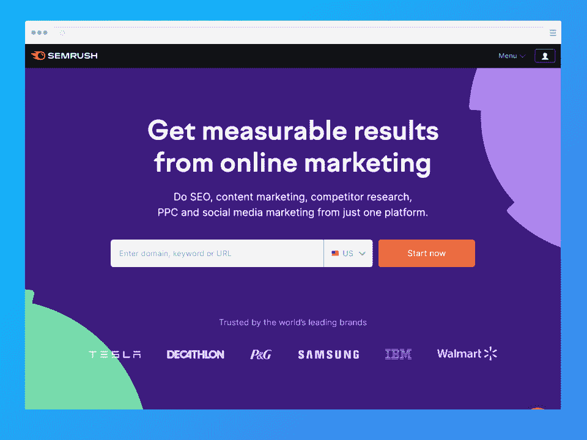**

SEMRush 是一个优秀的 SEO 管理工具，拥有一个全面的功能集，用于生成详细的关键字分析报告和各种域的摘要。它还会显示内容优化建议，以提高您的有机交通。

像 Ahrefs 一样，SEMRush 允许您将您的 SEO 指标与竞争对手进行比较。您可以将您的 SERPs 排名与他们的排名进行比较，使用流量分析为您的竞争对手找到主要的流量来源和搜索量，并将您的反向链接与其他网站进行比较。

甚至还有一个选项，可以通过“流量来源比较”同时查看几个竞争对手的数字营销渠道。

多年来，SEMRush 增加了更多的工具，包括代理工具、公关机构的白手套分割测试服务(SplitSignal)、流量提升工具和内容作家市场。

**定价:**

*   **免费层:**简单注册账户，每天 10 次有限访问工具
*   **免费试用:**专业版 7 天
*   **Pro:每月 119.50 美元，如果按年支付，相当于每月 99.95 美元**
*   每月 229.95 美元，如果按年支付，相当于每月 191.62 美元
*   **业务:**每月 449.95 美元，如果按年支付，则相当于每月 374.95 美元

**我们喜欢的:**

*   让您通过分析竞争对手的指标来形成自己的战略
*   仪表板功能强大、信息丰富且易于使用
*   一系列不同的工具
*   提供免费试用

[了解更多信息](https://semrush.sjv.io/c/2890636/1008501/13053)

**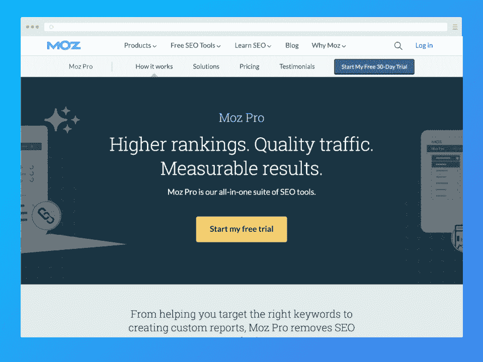**

Moz Pro 是最佳 SEO 计划的有力候选人，这要归功于通过 SERPs 增加排名、流量和在线可见性的各种工具。

像 Moz Pro spider 这样的功能允许你通过检查可能的问题来审计你的网站，突出它们，并提出建议来纠正它们，并在谷歌上排名更高。

Moz Pro 提供了关键字研究功能和反向链接分析工具，以获得洞察力和 SEO 指标，如估计的域权限和链接锚文本。

**定价**:

*   **免费试用:**标准 30 天
*   **标准:每月 99 美元，如果按年支付，则相当于每月 79 美元**
*   中等:每月 179 美元，如果按年支付，相当于每月 143 美元
*   **大额:**每月 299 美元，如果按年支付，相当于每月 239 美元
*   **保险费:**每月 599 美元，如果按年支付，则相当于每月 479 美元

*请注意，每个 Moz Pro 计划都附带 24 小时支持和一对一演练。*

**我们喜欢的:**

*   强大的工具
*   提供可行的见解，帮助您调整战略
*   支持性社区

[了解更多信息](https://moz.com/products/pro)

**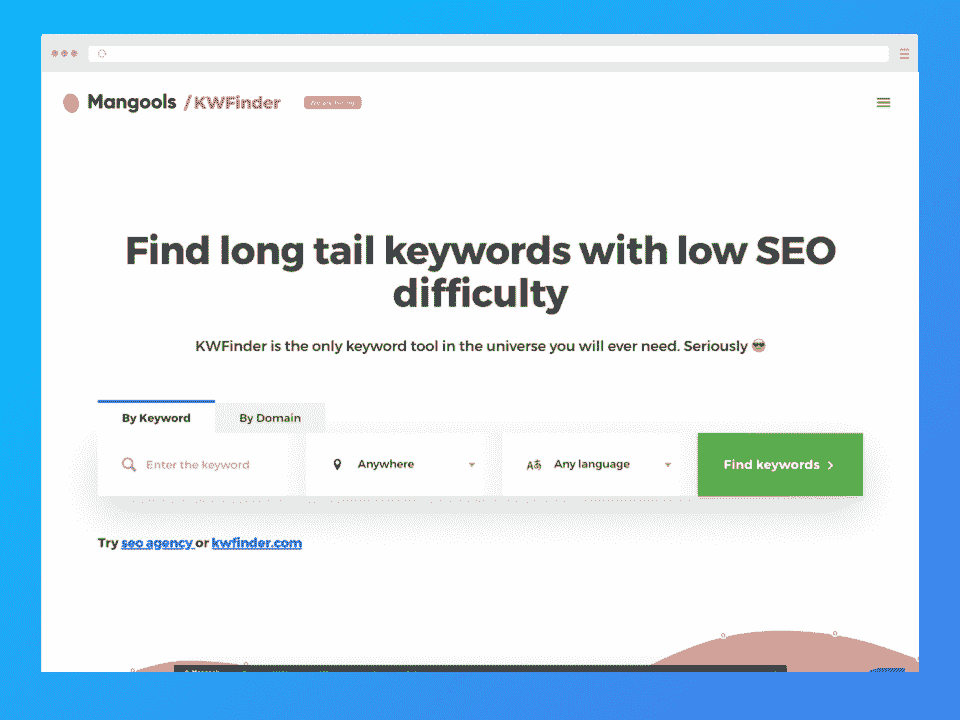**

关于关键词，KWFinder 可能是最好的搜索引擎排名工具。KWFinder 帮助你找到优秀的竞争度较低的长尾关键词，让它们更容易获得高排名。你也会发现大量的关键词来发展你的内容策略。

KWFinder 还提供了其他工具，包括对反向链接和 SERPs 进行分析的能力，以及一个排名跟踪工具，可以帮助您在跟踪一个指标的进度时找到您的排名。

**定价:**

*   免费试用: 10 天
*   **Mangools 基本款:每月 49 美元，如果按年支付，相当于每月 29.90 美元**
*   **Mangools Premium:** $69 每月，如果按年支付，相当于每月$44.90
*   **Mangools Agency:** $129 每月，如果按年支付，相当于每月$89.90

**我们喜欢的:**

*   出色的关键字搜索
*   详细的关键字建议
*   使用关键指标进行排名跟踪
*   负担得起的关键字研究工具

[了解更多信息](https://kwfinder.com/)

### **5。**[**Uber suggest**](https://neilpatel.com/ubersuggest/)**-最适合内容策略**

**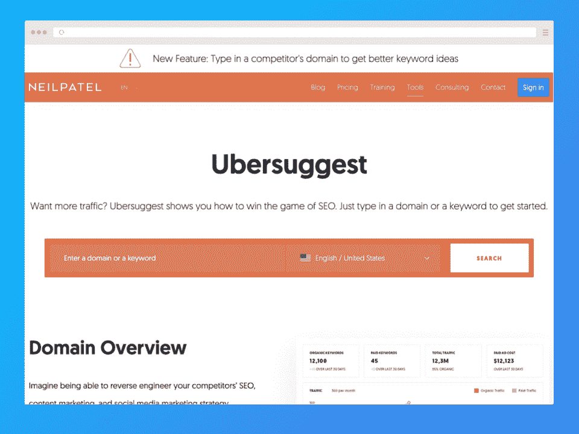**

Ubersuggest 于 2017 年被尼尔·帕特尔(Neil Patel)收购，继续确立了其作为市场上最佳搜索引擎优化软件竞争者的地位。

以帮助用户识别内容策略的关键字而闻名，您可以使用 *Keyword Ideas* 功能来查找相关、问题式、介词和比较关键字。这是特别有用的，如果你想为一个特定的关键字排名。

Ubersuggest 提供了许多其他功能，包括流量分析器、网站审计、反向链接功能等等。如果你知道如何使用谷歌搜索控制台(GSC)，没有比 Ubersuggest+GSC 更好的组合了。

甚至还有一个很棒的免费搜索引擎优化工具，供新人在做出财务承诺之前尝试一些功能。

**定价**:

*   **自由层:**受限访问，每日配额
*   **免费试用:** 7 天
*   **个人:每月 29 美元，或者一次性购买 290 美元**
*   **业务:**每月 49 美元，或者一次性购买 490 美元
*   **企业:**每月 99 美元，或一次性购买 990 美元

**我们喜欢的:**

*   难以置信的知识和内容的想法
*   终身计划
*   扩展的免费计划

[了解更多信息](https://neilpatel.com/ubersuggest/)

### **6。**[**woo rank**](https://www.woorank.com/)**——最适合数字营销人员**

**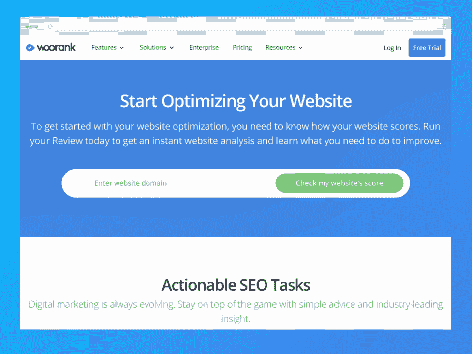**

Woorank 是最好的 SEO 程序之一，通过跟踪和报告营销数据，包括来自竞争对手的数据，帮助您改进内容和 SEO 策略。

Woorank 非常适合营销人员，因为它可以揭示需要改进的地方，比如修复断开的链接。它还提供了营销清单以及移动和社交媒体数据，以提供更多见解。

**定价:**

*   **免费试用:** 14 天
*   **Pro:每月 79.99 美元，如果按年支付，相当于每月 53.25 美元**
*   **保险费:**每月 199.99 美元，如果按年支付，则相当于每月 133.25 美元
*   **企业:**自定义计划

**我们喜欢的:**

*   营销人员的绝佳选择
*   拥有移动和社交媒体数据

[了解更多信息](https://www.woorank.com/)

### **7。** [**气势磅礴**](https://majestic.com/) **-最适合链接分析**

**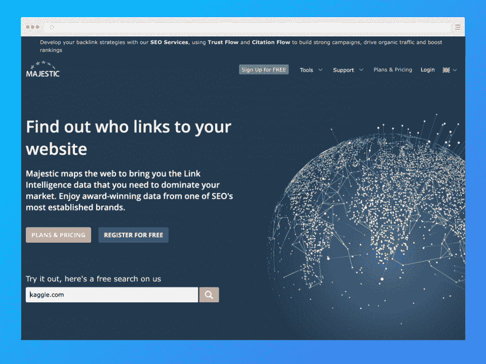**

自 2011 年创建以来，Majestic 已经成为最好、最有用的 SEO 工具之一。

Majestic 提供了大量方便的功能，包括关键字工具和跟踪，以及显示反向链接、断开的链接和网站概览的站点浏览器。

如果你在寻找新奇的东西，可以去看看 Majestic Million，这是一个列出了互联网上前 100 万个网站的列表。

**定价:**

*   **自由层:**工具访问受限
*   **免费试用:**付费选项的 7 天退款保证
*   **Lite:每月 49.99 美元，如果按年支付，相当于每月 41.67 美元**
*   **Pro:** 每月 99.99 美元，如果按年支付，相当于每月 83.33 美元
*   **API:** 每月 399.99 美元，如果按年支付，则相当于每月 333.33 美元

**我们喜欢的:**

*   提供了大量的数据
*   大量的功能来管理你的搜索引擎优化
*   出色的数据分析

[了解更多信息](https://majestic.com/)

### **8。**[**SpyFu**](https://www.spyfu.com/)**——最佳竞争对手关键词**

**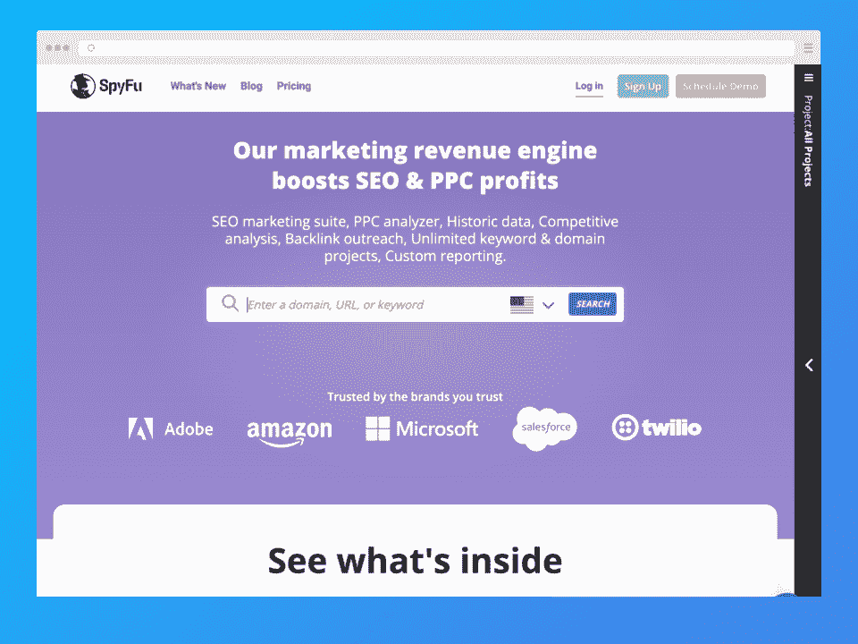**

SpyFu 是一个优秀的搜索引擎优化工具，用于识别 Google AdWords 上的关键词和搜索术语。换句话说？你可以“窥探”竞争对手的策略和关键词，使其成为最好的搜索引擎优化跟踪工具之一。

**定价:**

*   **免费试用:**付费选项 30 天退款保证
*   **基本:每月 39 美元，如果按年支付，相当于每月 33 美元**
*   专业:每月 79 美元，如果按年支付，相当于每月 58 美元
*   **团队:**每月 299 美元，如果按年支付，相当于每月 199 美元

**我们喜欢的:**

*   竞争对手战略研究的出色功能
*   使用方便
*   价格合理

[了解更多信息](https://www.spyfu.com/)

### **9。**[**BuzzStream**](https://www.buzzstream.com/)**——最适合寻找影响者**

**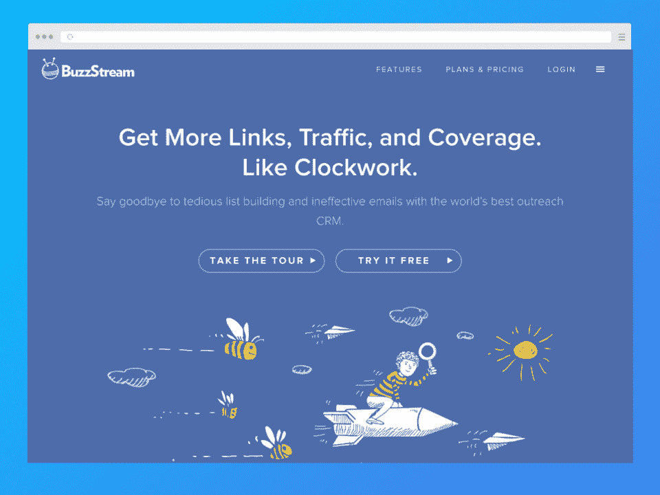**

反向链接是在 SERPs 上获得更高排名的一个很好的策略，但是这个过程几乎就像是一个陌生电话。谢天谢地，BuzzStream 可以帮上忙。

BuzzStream 有助于识别与您的网站相关的影响者和权威人士等外联候选人。它还识别可能接受请求的反向链接候选人，以及影响者是否已经参与了活动。

最精彩的部分？如果找不到某人的联系方式，BuzzStream 可以提供帮助。

**定价:**

*   **免费试用:** 14 天
*   **起步:每月 24 美元**
*   **增长:**每月 124 美元
*   专业:每月 299 美元
*   **定制:**起价每月 999 美元(联系 BuzzStream 了解更多信息)

**我们喜欢的:**

*   非常适合营销活动
*   帮助您查找联系信息
*   附带外联模板和跟进信息

[了解更多信息](https://www.buzzstream.com/)

想在数字营销领域找到一份工作吗？请看我们在上的文章[顶级面试问答](https://hackr.io/blog/top-digital-marketing-interview-questions-and-answers)

### 10。[**ScreamingFrog**](https://www.screamingfrog.co.uk/seo-spider/)**-最适合快速网站抓取**

**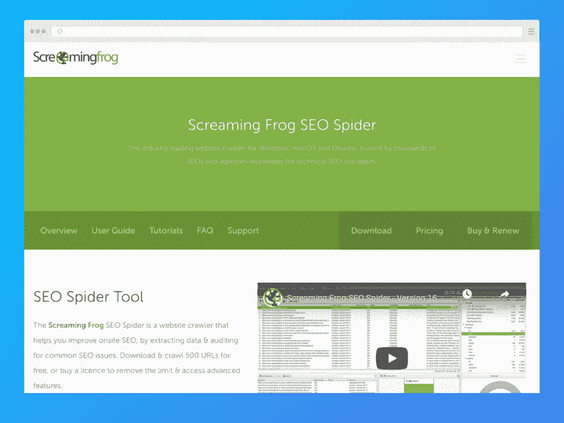**

ScreamingFrog 主要是一个网站爬虫，检查搜索引擎优化问题的 URL，最好的部分是它做得很快。我们的意思是超级快！即使是有很多页面的大型网站。

许多 SEO 专家推荐 ScreamingFrog，因为它有节省时间的好处，但它也提供其他功能，包括关于重复内容、错误重定向、可修复错误的通知，以及改进链接构建策略的区域。

**定价:**

*   **免费层:**每次抓取限 500 个网址
*   **付费计划:**
    *   **1-4 个许可证，每个许可证每年 209 美元**
    *   5-9 个许可证，每个许可证每年 195 美元
    *   10-19 个许可证，每个许可证每年 179 美元
    *   20 多个许可证，每个许可证每年 165 美元

**我们喜欢的:**

*   强大的爬行功能
*   由行业领导者使用

[了解更多信息](https://www.screamingfrog.co.uk/seo-spider/)

### **11。**[**AnswerThePublic**](https://answerthepublic.com/)**——最适合观众趋势**

**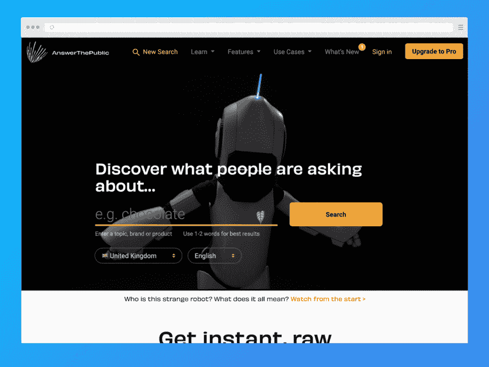**

AnswerThePublic 不提供与传统 SEO 工具软件相同的功能，但它是建立网站关键词和内容策略的绝佳选择。

通过收听来自搜索引擎的数据，它可以提供人们围绕你的关键词搜索的问题和短语。这使得产生内容想法和组织博客变得很容易。

AnswerThePublic 可以监控关键词趋势，实时查看搜索，并提供关键词更新。免费层(取决于流量水平)，它是主题推荐或规划你的社交媒体日历的最佳免费 SEO 工具之一。

**定价:**

*   **免费层:**可用性取决于回答公众的流量
*   **每月:每月 99 美元，最多 3 个用户**
*   **年费:**相当于每月 79 美元，最多 5 个用户
*   **专家:**每月 199 美元，不限用户

*注意，所有计划都有无限搜索*

**我们喜欢的:**

*   隐藏不需要的分支或建议
*   多功能和有用的搜索引擎优化，消费者研究和内容营销
*   免费层(受限于 AnswerThePublic 的流量水平)

[了解更多信息](https://answerthepublic.com/)

**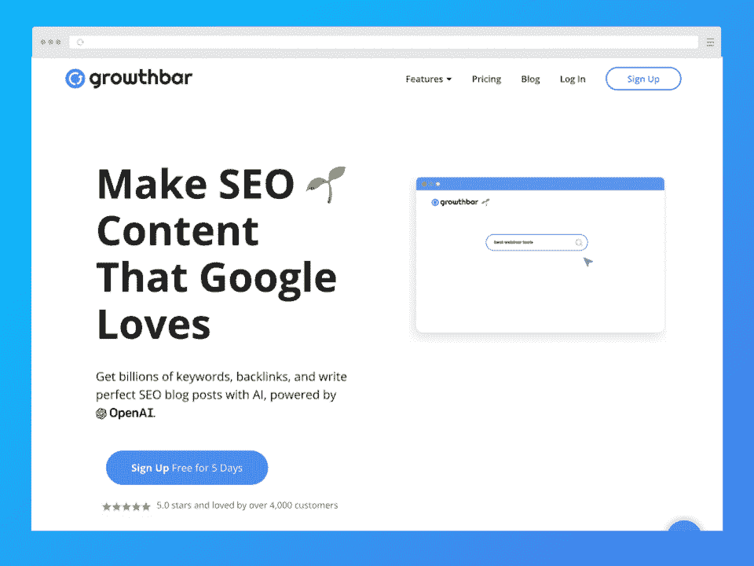**

与典型的 SEO 软件不同，GrowthBar 是谷歌 Chrome 浏览器的一个扩展，可以帮助直接从 SERPs 进行关键词研究、SEO 排名跟踪和竞争分析，而无需打开谷歌搜索控制台。

GrowthBar 可以通过关键词评估竞争对手的战略和表现，分析增长渠道、反向链接和成功的广告，甚至帮助修复断开的链接。

它还可以识别流量最大的关键词，并生成一个最权威网站的反向链接列表。你甚至可以查看关键词难度分数，看看它们的排名有多难。

除了通常的 SEO 功能，GrowthBar 可以与脸书广告合作，创建人工智能博客大纲，并产生博客想法！因此，它不仅给你内容的想法，但它也有助于内容创作！

**定价:**

*   **免费试用:** 5 天
*   **标准:每月 48 美元，如果按年支付，则相当于每月 29 美元**
*   **Pro:** :每月 99 美元，如果按年支付，则相当于每月 79 美元
*   代理:每月 199 美元，如果按年支付，则相当于每月 129 美元

**我们喜欢的:**

*   单一工具中的一系列独特功能
*   支持内容创意和创作
*   AI SEO 内容写作服务

[了解更多信息](https://www.growthbarseo.com/)

想要提升你的搜索引擎优化技能以充分利用这些工具吗？查看 [**最佳 SEO 课程之一**](https://hackr.io/blog/best-seo-courses)

## **值得一看的 SEO 专家**

有时候，关注 SEO 专家可以帮助你了解更多的主题，包括新的 Google 和 SEO 发展。

### **1。尼尔·帕特尔**

尼尔·帕特尔不仅是《纽约时报》的畅销书作家，他还参与创办了许多非常成功的企业，比如 Hello Bar 和 Crazy Egg 等等。

现在，你可能知道他是 Ubersuggest 的所有者，这是我们列表中最好的 SEO 工具之一。然而，帕特尔是一个多才多艺的人。

*   被 WSJ(华尔街日报)认为是网络最有影响力的人之一
*   根据福布斯排名，十大在线营销商
*   奥巴马总统称他为 30 岁以下 100 位最佳企业家之一

尼尔·帕特尔也是一些出版物的特约专栏作家，包括他的博客[quick prout](https://www.quicksprout.com/)。

点击了解更多关于尼尔·帕特尔的信息。

### **2。约斯特·德·瓦尔基里**

如果你听说过 WordPress(现在是 Shopify)插件 Yoast SEO，那么你一定听说过 Joost De Valk。

De Valk 创建了 Yoast，并继续为产品团队提供各种业务方面的建议，尽管他现在已经不再积极运营该公司。

Joost 是一位多产的互联网企业家、网络开发人员和数字营销人员，他继续[发布与 SEO 相关的主题](https://yoast.com/about-us/team/joost-de-valk/)。

### **3。布莱恩·迪恩**

布莱恩·迪恩(Brian Dean)在创建了 Backlinko 博客后，已经成为一名知名的 SEO 专家。他是一个 SEO 领导者，专门从事技术 SEO，链接建设，内容推广和网站优化。

他不仅写了关于 SEO 的文章，还将一些最复杂和先进的 SEO 策略分解成可操作的步骤。

他的公司定期发布关于关键词研究、排名策略和高级链接建设技术的突破性研究和实用建议。

除了是一个受欢迎的演讲者之外，Brian 还被《企业家》、《BuzzFeed》和《搜索引擎杂志》等出版物报道过。

你可以在这里查看布莱恩·迪恩的作品。

### **4。兰德·菲什金**

作为 MOZ 的创始人和前首席执行官，兰德·菲什金是业界公认的思想领袖，也是搜索引擎优化(SEO)领域最具影响力的人物之一。

他因写了几本关于 SEO 的书而闻名，包括《SEO 的艺术》和《Lost & Founder》，在会议上发表主题演讲，推出白板星期五(一系列关于数字营销的每周视频)，并定期在他的[媒体](https://medium.com/@randfish)上发表在线文章。

除了令人印象深刻的职业生涯之外，他还因机智的俏皮话、富有创意的图片和迷人的个性而闻名。

你可以从兰德·菲什金的推特上了解更多，他分享了对谷歌和其他搜索引擎内部运作的独特见解。

### **5。丹尼·沙利文**

凭借在多个领域的丰富经验，包括内容优化、链接建设、网站架构和分析，丹尼·沙利文有丰富的知识可以分享。

他是站长的热情拥护者，定期参加 WebmasterWorld 和 SEOmoz 等热门 SEO 论坛的问答环节。如果你经常使用谷歌搜索控制台，他是一个很好的人，可以向他寻求可行的建议。

Danny 也是一名备受赞誉的记者和多产作家，为搜索引擎土地和美国营销协会等领先出版物撰写了数百篇与 SEO 相关的文章。

你可以在搜索引擎上浏览他的博客内容。

## **结论**

本文涵盖了 2023 年可用的 12 个最佳 SEO 工具，帮助您的网站在搜索引擎排名中更上一层楼。

将优秀的内容与可靠的 SEO 策略结合起来是增加网站流量的最佳方式之一。但是请记住，无论这些 SEO 工具多么有用，它们都无法取代你在制作有价值的内容和一个优秀的网站上所需要投入的时间和精力。

所以要确保你的页面和内容给你的访问者留下最好的印象！

**寻找没有价格标签的 SEO？查看我们的免费 SEO 工具列表**

 **## **常见问题解答**

最好的 SEO 工具软件取决于你的需求。最好的全才大概是 Ahrefs，但如果需要关键词研究，可以试试 UberSuggest 或者 KWFinder。SEMRush 是最好的数字营销之一，但如果你想创建内容，GrowthBar 可能值得一看。

有人说免费计划已经足够了，有人则推荐付费工具。适合您需求的免费或付费的 SEO 工具是支持您的 SEO 和内容策略的工具。

我们列表中的许多工具都提供免费试用或免费等级，这有助于在做出财务承诺之前对它们进行测试。

#### **3。什么比 Ahrefs 更好？**

虽然不像 Ahrefs 那样功能丰富，但 Ubersuggest 由于其可靠的功能和价格点而具有竞争力，如果你是 SEO 新手并且仍在学习，这是非常实惠的。Neil Patel 还改进了免费层，以提供更多的功能，这是测试工具和功能的好方法。

#### **4。SEO 对小企业来说值得吗？**

小企业可以使用 SEO 来提升他们的在线形象，提高他们品牌的权威性、可信度和可信度。搜索引擎优化也是必不可少的，出现在 SERPs 的顶部附近，为小企业带来大量的流量和更多的潜在转化，无论是完全在线还是实体企业。

#### **5。SEO 应该花多少钱？**

搜索引擎优化软件的价格可能会有所不同，但尽量不要选择便宜的搜索引擎优化软件，因为你可能会牺牲质量。

这也有助于研究你所在领域的企业，以及它们在 SEO 策略上的花费。你还需要考虑有多少关键词是你的目标，以及你希望多快看到结果。

最终，没有“一刀切”的价格，所以期待试错法，直到你找到最佳投资回报。

#### **6。可以自己做 SEO 吗？**

是啊！但是掌握正确的工具和技能是必不可少的。你需要了解关键词研究、搜索引擎如何工作、搜索引擎的页面优化技术等等。

当然，你会想要选择一个强大的搜索引擎优化工具来帮助你的旅程。幸运的是，我们列表中的任何工具都是强有力的选择。**