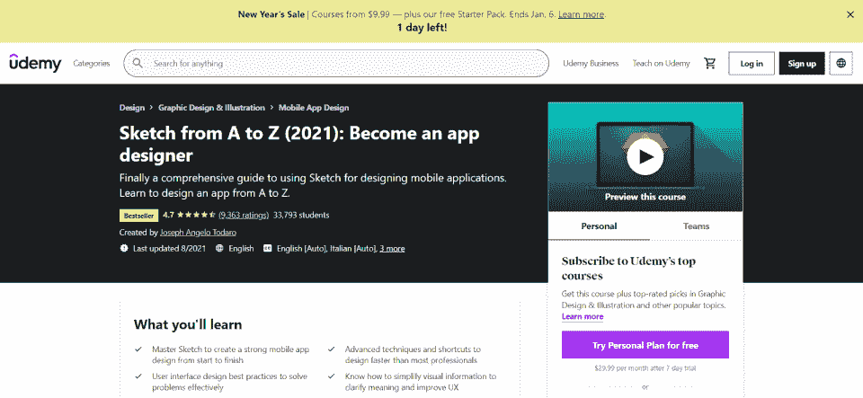
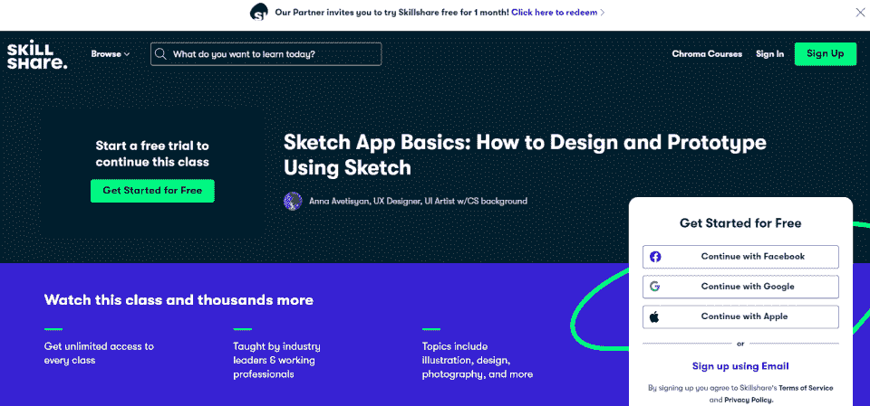
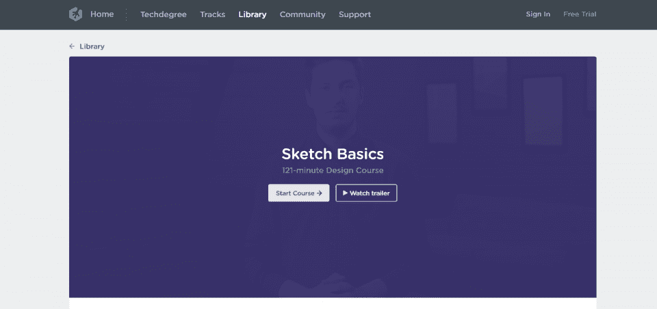
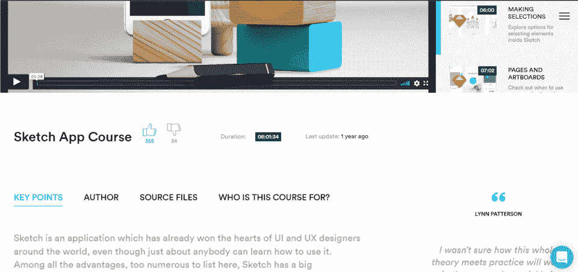
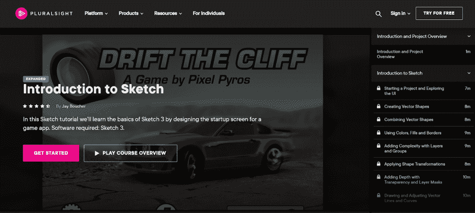
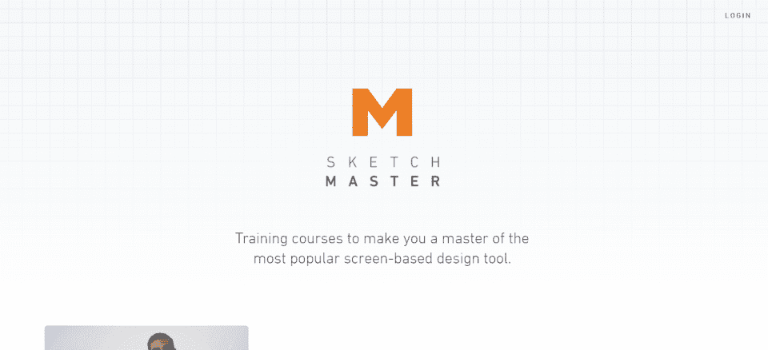

# 素描课程:用 2023 年最好的素描课程学习 UI

> 原文：<https://hackr.io/blog/best-sketch-courses>

你在找素描入门吗？素描课程会有所帮助。

[草图](https://www.sketch.com/) 是一个健壮的、一体化的 UX/UI 设计平台。通过 Sketch，您可以快速原型化和设计用户界面、应用程序和图标，并打包提供给 [开发人员](https://hackr.io/blog/how-to-become-a-web-developer) 。有了正确的素描课程，你将能够开发更强大的设计，同时也改善你的简历。

想学素描？考虑在网上上一门素描课程。今天，除了成为一名真正的素描大师需要做些什么之外，我们还将深入了解一些最好的素描课程。

## **素描是什么，素描是给谁看的？**

要学素描做 UI/ [UX 设计](https://hackr.io/tutorials/learn-user-experience-design) 针对移动应用或网站。Sketch 简化了原型设计的流程，因此您可以在开发网站或应用程序之前创建可点击、可交互的原型。通过 Sketch web 设计教程，您可以创建更好的用户体验，并保持对设计的更多控制。

## **12 个最佳素描课程**

网上有很多素描课程，从初级课程到更高级的课程都有。素描课程也因学科不同而不同；有些是给图标设计师的，有些是给网站设计师的，有些是给手机应用开发者的。

我们已经为所有人创建了一个完整的最佳在线素描课程列表。

Udemy 的这个综合课程教你所有你需要知道的关于平面设计和素描插图的知识。本课程面向移动应用设计人员，涵盖了如何创建设计、优化和简化媒体管理、针对不同设备进行设计以及了解最佳 UI 实践。课程结束时，学生将学习如何将资产导出并移交给开发人员。选修这门课程的学生应该对设计基础有扎实的掌握，但不需要了解草图平台。

**课程规格:**

*   **等级:** 初级
*   **费用:**【11.99 美元
*   **包含:**

*   4.5 小时的视频
*   39 个可下载资源
*   3 篇文章

本草图课程从项目设置开始，然后进入交互式原型制作。学生将学习如何创建自定义矢量艺术作品、构建布局以及使用图层和符号。学生们还将学习如何打包这些设计以展示给客户，为开发人员生成媒体，并最终在其设计流程的开始和结束使用 Sketch。在参加课程之前，学生应该知道基本的设计原则，但不需要了解任何关于素描的知识。

**课程规格:**

*   **等级:** 初级
*   **费用:**【34.99 美元

*   **包含:**

*   31 个视频
*   2 个项目文件

[****](https://www.skillshare.com/classes/Sketch-App-Basics-How-to-Design-and-Prototype-Using-Sketch/531426512?via=blog)

在 SkillShare 上可以参加 *Sketch App 基础知识:如何使用 Sketch* 进行设计和原型制作，由专业的 UX 设计师和具有计算机科学背景的 [UI 美工](https://hackr.io/tutorials/learn-user-interface-design) 运营。这门课包括八课和三个项目:一个应用程序封面、一个注册页面和一个最终页面。通过这门课，你将学习原型设计、设计和发送可交付成果的基础知识。

**课程规格:**

**等级:** 初级

*   **费用:**【32 美元/月(技能共享库)
*   

用户体验(UX)是指用户将如何体验用户界面(UI)。通过适当的用户界面，设计师可以提高用户参与度、满意度和忠诚度。该 LinkedIn 学习课程专门从 UX 设计的角度涵盖素描。本课程尤其有价值，因为它涵盖了一些你会用到的主要软件，包括 Measure、Zeplin、Zeroheight 和 InVision。本课程传授实用知识，设计师可以利用这些知识立即开始素描工作。

**课程规格:**

**等级:** 初级

*   **费用:** 免费月(领英图书馆)
*   **包含:**

*   6 课

*   创建线框

*   视觉设计和符号
*   图书馆
*   原型制作和协作
*   出口和资产管理
*   

*从头到尾的素描* 课程主要涵盖手机设计， *完整素描 5 门课程* 涵盖应用和网站。这门综合课程将向设计师展示如何使用 Sketch 来 [设计手机应用](https://hackr.io/blog/how-to-become-a-mobile-app-developer) 、网站以及其他形式的 UI。它还涵盖了 UX 原则和最佳做法。学生将创建一个可点击的原型，建立一个风格指南，并学习如何获得一份工作。

**课程规格:**

**等级:** 初级

*   **费用:**【99.99 美元
*   **包含:**

*   15.5 小时的视频

*   13 可下载资源
*   现实世界项目
*   

一个简洁的 121 分钟的设计课程， *素描基础知识* 给你一切你需要知道的开始使用你的项目素描。本设计课程以 Sketch 3 为中心，教您如何绘制和设计对象、编辑和组织内容、导出和共享项目以及创建用户界面。这可能不是 Sketch 的最新版本，但这个简单易懂的课程是开始发展你的技能的好方法。

**课程规格:**

**等级:** 初级

*   **费用:**【25 美元/月(组队树屋库)
*   **包含:**

*   121 分钟的素材

*   三道菜
*   什么是素描？

*   安装草图
*   草图界面？
*   [****](https://learnux.io/course/sketch)

参加这个 Sketch 应用程序课程，了解使用 Sketch 的详细信息——技术和快捷方式、技巧和诀窍、导出图形、矢量工具和符号、颜色、图标、版式以及一些实用的 UI 项目。本课程旨在帮助那些想要发展用户体验(UX)知识的人。它将引导您完成多个实际项目，并帮助您充分利用该平台。

**课程规格:**

**等级:** 初级

*   **费用:**【12 美元/月(LearnUX 库)
*   **包含:**

*   8 小时的素材

*   项目源文件
*   

PluralSight 的 *素描简介* 带领学生们完成一个游戏启动画面的设计过程。无论你是对开发游戏应用程序特别感兴趣，还是只想学习更多关于 UI/UX 的知识，这个项目都非常适合你。您将学习如何设计 web 和移动应用程序、使用图层样式、导入照片和导出图形。最后，您将能够创建并导出整个 Sketch 3 项目。

**课程规格:**

**等级:** 初级

*   **费用:**【299 美元(PluralSight 库)
*   **包含:**

*   2 小时 14 分钟的内容

*   动手操作库
*   

这是素描速成班。你不会得到一个关于素描的深入教程；相反，你只会得到最基本的。你应该知道 UI/UX 的基本原理，以充分利用这一点，甚至已经有一些素描背景。本课程将引导您创建自己的图形，准备不同的格式，以及如何使用符号重复使用您的作品。如果你想要你需要很快知道的最低限度，这个课程是理想的。

**课程规格:**

**等级:** 中级

*   **费用:**【19.99 美元
*   

你需要从头开始了解一切吗？ *完整的用户界面设计训练营* 将带你浏览 UI 和 UX 方面的草图，这样你就会知道关于创建用户界面的一切。这包括 UX 的最佳实践，完成现实世界的项目，并从一开始就开发一个应用程序。这是一门综合的中级课程，包括 9 个小时的内容，并以一个真实世界的项目作为结束。

**课程规格:**

**等级:** 中级

*   **费用:**【32 美元/月(技能共享库)
*   9 小时的视频

*   150 场讲座
*   1 现实世界项目
*   

对于认真学习 UI/UX 设计的学生来说，这是最好的课程之一。虽然该课程从基础开始，但它很快深入到各种现实世界的项目:杂志封面、网页、移动应用程序和徽标。你将通过知识检查测验和设计挑战，通过作业，并最终掌握整个草图。这个课程非常适合试图提高他们的 UI/UX 技能的专业人士。

**课程规格:**

**等级:** 中级

*   **费用:**【19.99 美元
*   16 小时的视频

*   25 种可下载资源
*   4 个真实项目
*   [参加课程](https://click.linksynergy.com/deeplink?id=SeYHzlfZEmI&mid=39197&murl=https%3A%2F%2Fwww.udemy.com%2Fcourse%2Fhands-on-sketch-4-masterclass-learn-web-and-mobile-design%2F)

*   **Certificate of Completion:** No

    

想了解素描的所有知识吗？素描大师有三门课程: *素描入门，素描中的用户体验设计，* 和 *素描中的 SVG 工作流* 。选择适合你的课程，或者将它们捆绑在一起。这些课程侧重于现实世界的项目，将引导学生设计应用程序图标，创建移动应用程序界面，以及使用 SVG 图形。

**课程规格:**

**等级:** 初级、中级、高级

*   **费用:**【39.00 美元到 99.00 美元
*   16 小时的视频

*   25 种可下载资源
*   4 个真实项目
*   **了解草图的更多信息**

## 无论你是参加免费的速写课程，还是钻研你能找到的最好的速写课程，下一步都是建立一个作品集。作为一名 UI/UX 设计师，你需要能够展示你自己创作的设计——否则，你无法向潜在雇主展示你所知道的东西。

今天你就可以开始建立一个作品集，网上有一些最全面的素描教程和课程。

今天就试试素描教程吧！