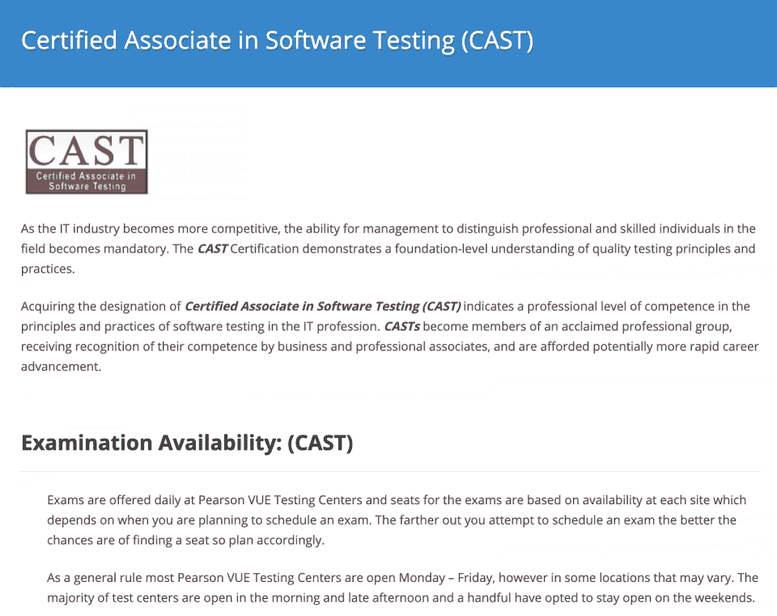
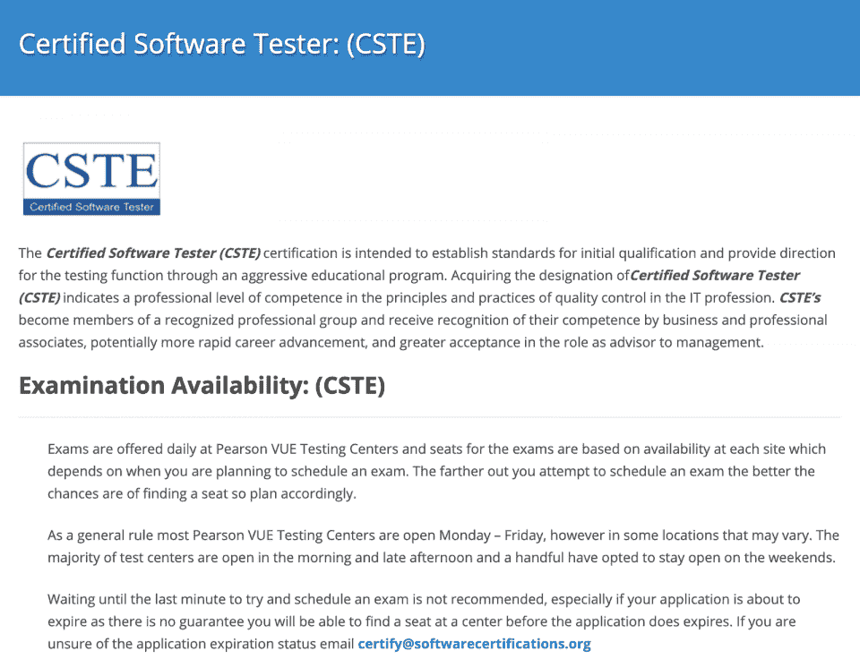
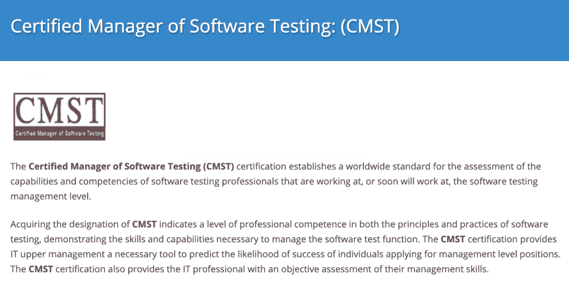
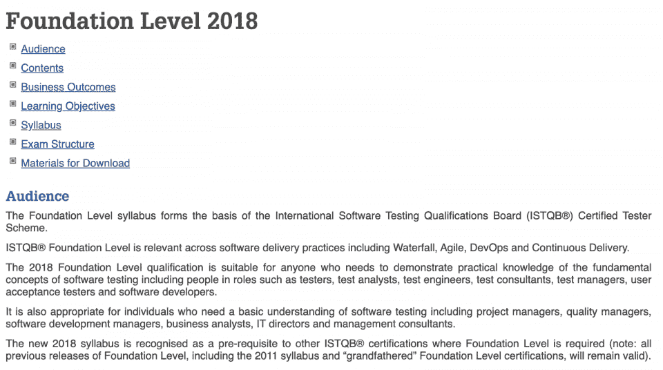
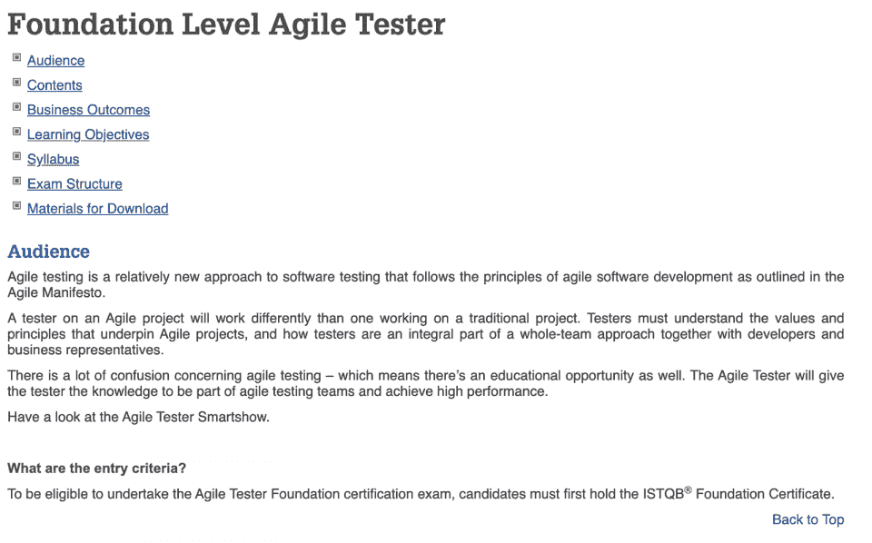
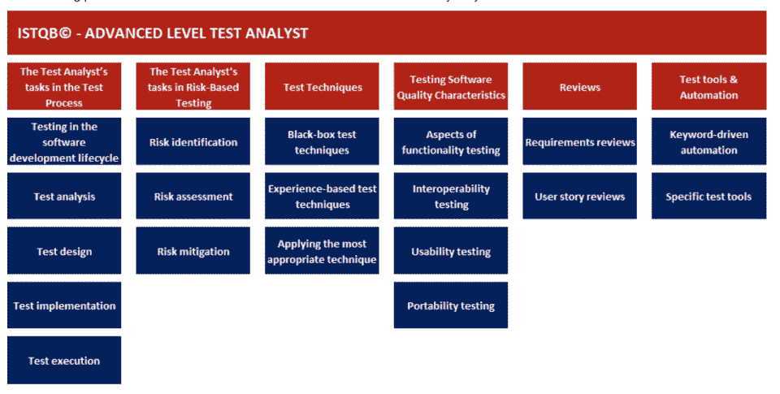
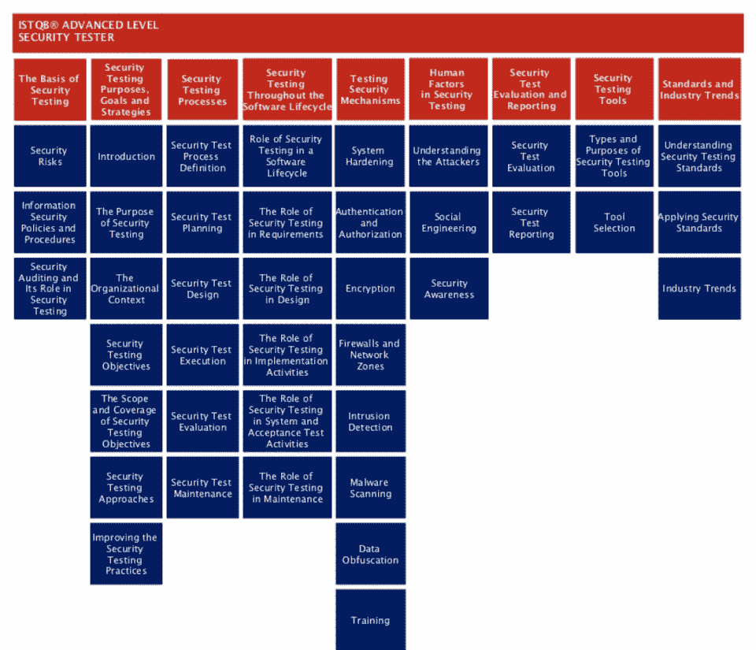
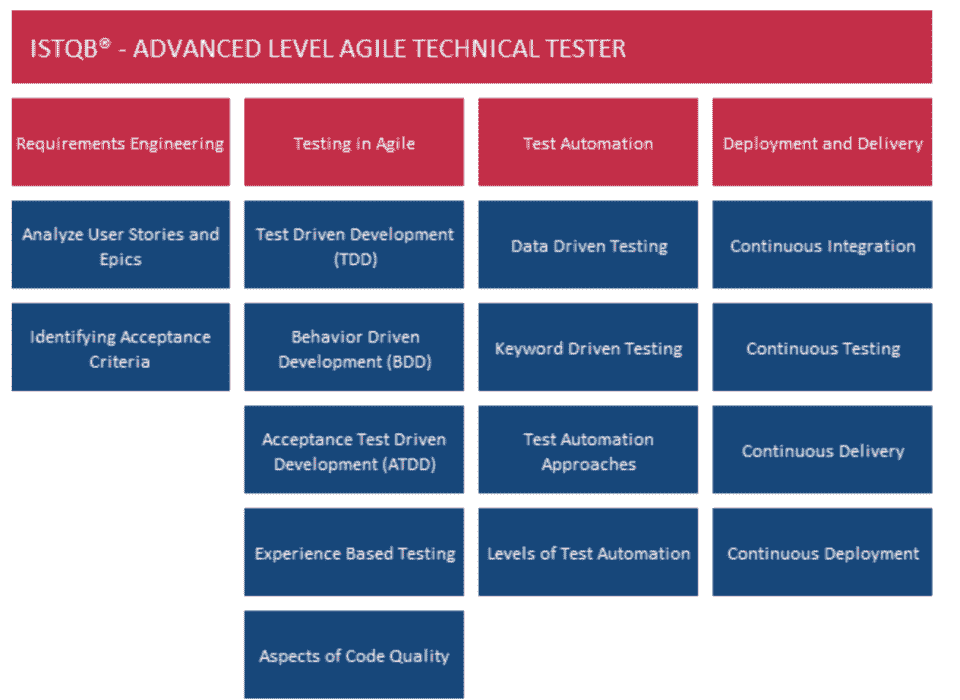
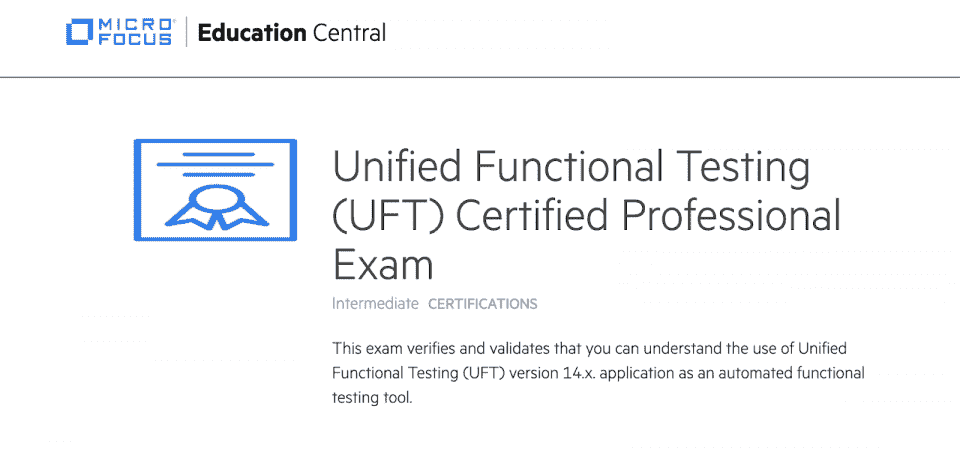
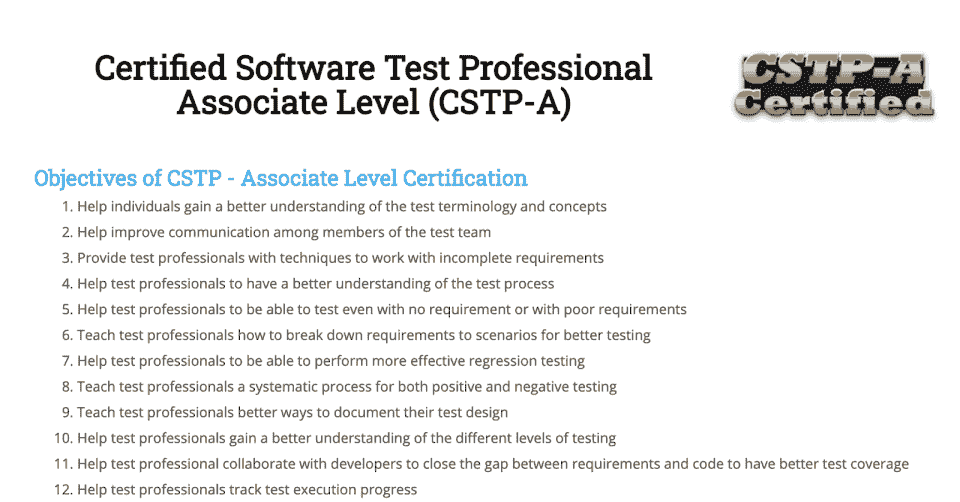

# 2023 年 10 大最佳软件测试认证[更新]

> 原文：<https://hackr.io/blog/best-software-testing-certifications>

软件测试指的是衡量软件产品质量的过程。这样做也是为了让产品更好，尽量减少所有的错误和问题。对于专业的软件测试工作，我们有一个叫做 [STLC 或者软件测试生命周期](https://hackr.io/blog/what-is-software-testing-life-cycle)的东西。

负责**测试过程**的专业人员通常被称为软件测试人员。虽然较小和简单的软件产品只需要几个甚至一个测试人员，但是复杂的、成熟的软件产品需要一个专门的测试团队。

软件测试中有几种工作类型，从测试员和测试分析师到测试经理和测试设计师。除了软件测试课程，还有许多软件测试认证可供有志之士和专业人士使用。

## **最佳软件测试认证**

有各种各样的软件测试认证可供选择，有初学者级别的，有中级级别的，有测试经验的，有硕士和专家级别的，有多年软件测试经验的。

除了使投资组合更有吸引力，认证还给予个人机会来评估他们的知识和学习更多关于他们的手艺。如果您正在寻找相关的软件测试认证，请考虑查看以下 10 大软件测试认证:

级别:初级
提供者:质量保证研究所(QAI)

考试详情:

*   格式-多项选择
*   问题总数- 100 个
*   总时间- 75 分钟
*   及格分数- 70%

费用:100 美元

CAST 或软件测试认证助理是一种基于软件测试的认证，展示了与质量测试相关的原则和实践的基本理解水平。

对于希望进入软件测试行业的个人来说，这是一个合适的软件测试认证。为了有资格获得软件测试认证，候选人必须满足以下先决条件之一:

*   认证机构颁发的 3 年或 4 年制学位。
*   获得认证机构颁发的两年制学位，并有一年在 IT 行业工作的经验。
*   至少 3 年 IT 行业工作经验。

CAST 认证考试在皮尔森 VUE 考试中心进行。申请成功提交给 CAST 后，候选人将收到一份 367 页的 PDF 格式的 CAST 软件测试知识体系(STBOK)。准备 CAST 考试是足够的。

你可以在这里买这本书。

****

级别:中级
提供者:QAI

考试详情:

*   格式-多项选择+文章类型
*   问题总数- 100 + 12
*   总时间- 75 分钟+ 75 分钟
*   及格分数- 70%(两次考试的平均分)

费用:350 美元

$420(包括 STBOK PDF 的书籍版本)

认证软件测试员认证保证了在质量控制(QA)的原则和实践方面的专业水平的能力。这是 CSTE 认证是很适合装袋的作用，一个软件测试或质量控制顾问和质量控制经理。

要成功注册认证软件测试员认证，候选人必须在申请认证后的前 18 个月内从事或曾经从事软件测试(质量控制)工作。此外，候选人必须满足以下先决条件之一:

*   某认证机构的 4 年制学位+至少 2 年 IT 领域的工作经验。
*   认证机构的 3 年制学位+至少 3 年 IT 领域的工作经验。
*   认证机构颁发的两年制学位+至少 4 年 IT 行业工作经验。
*   至少 6 年 IT 领域的工作经验。

CSTE 认证包括两个考试，都可以在皮尔森 Vue 考试中心进行。成功注册认证计划后，候选人将收到 CSTE 软件测试知识体系(STBOK)，这是一份 557 页的 PDF 文件，涵盖了整个考试大纲。

你可以在这里买这本书。

**建议课程**

[完整的 2023 年软件测试训练营](https://click.linksynergy.com/deeplink?id=jU79Zysihs4&mid=39197&murl=https%3A%2F%2Fwww.udemy.com%2Fcourse%2Ftesterbootcamp%2F)

等级:高级
提供者:QAI

考试详情:

*   格式构建的回应/文章类型
*   问题总数- 7 + 5
*   总时间- 75 分钟+ 75 分钟
*   及格分数- 70%(两次考试的平均分)

费用:450 美元

软件测试认证经理(CMST)是一个全球级别的认证，适合管理级别的软件测试角色。像其他 QAI 课程一样，CMST 考试在皮尔逊 Vue 考试中心举行。

除了确保证书持有人在软件测试的原则和实践方面具有工作水平的能力，CMST 还证明了持有人具有管理软件测试项目的技能。

要成功申请认证考试，候选人必须在软件测试领域积极工作，并且必须满足以下条件之一:

*   任何认证机构的学士学位+至少 4 年软件测试工作经验。
*   认证机构颁发的大专文凭+至少 6 年的软件测试工作经验。
*   至少 8 年软件测试领域的工作经验。

为了准备考试，合格的考生会收到 609 页的 CMST 软件测试知识(STBOK) PDF。考试有两次考试，有 10 分钟的休息时间，评估考生在以下 4 个领域的知识和经验:

1.  测试管理
2.  测试分析
3.  测试计划和执行
4.  沟通和关系

你可以在这里买这本书。

****

级别:初级
由国际软件测试资格委员会(ISTQB) 提供

考试详情:

*   格式-多项选择
*   问题总数- 40
*   总时间- 60 分钟(对于以非母语参加考试的参与者，可增加 15 分钟。)
*   及格分数- 65%

费用:250 美元

ISTQB 基础水平(CTFL)认证面向任何对展示基本软件测试知识感兴趣的人，包括[种软件测试](https://hackr.io/blog/types-of-software-testing)，测试计划和设计，缺陷管理，以及评估项目和产品风险。

这个认证适合于测试中的基础角色，比如测试员、测试分析师和测试顾问。ISTQB 基础水平(CTFL)认证没有资格标准。

你可以在这里买这本书。

****

等级:中级
提供者:ISTQB

考试详情:

*   格式-多项选择
*   问题总数- 40
*   总时间- 60 分钟
*   及格分数- 65%

费用:150 美元

敏捷测试是一种较新的软件测试方法，最近越来越受欢迎。它基于[敏捷软件开发方法学](https://hackr.io/blog/sdlc-methodologies#agile-software-development-life-cycle)。该认证旨在:

*   入门级测试人员对敏捷测试感兴趣。
*   传统软件开发方法中有经验的测试人员。
*   拥有测试基础知识的专业开发人员与敏捷项目密切相关。

ISTQB 敏捷测试员认证是 ISTQB 基础级(CTFL)认证的附加认证。这意味着感兴趣的候选人必须首先拥有有效的 ISTQB 基础级别(CTFL)认证，才能申请 ISTQB 敏捷测试员认证。

你可以在这里买这本书。

等级:高级
提供者:ISTQB

考试详情:

*   格式-多项选择
*   问题总数- 60
*   总时间- 180 分钟
*   及格分数- 75%

费用:250 美元

ISTQB 高级测试分析师认证是在软件测试行业中从事中级工作的个人证明其作为专业测试分析师能力的最佳软件测试认证之一。

它面向软件测试人员、软件工程师、自动化工程师等。为了成功申请高级软件测试认证，候选人需要拥有 ISTQB 基础级(CTFL)认证，并且必须满足以下条件之一:

*   认证机构颁发的计算机科学或相关领域的[学位+ 24 个月*2 个子模块的软件测试经验或 36 个月所有三个子模块的软件测试经验。](https://hackr.io/blog/best-online-computer-science-degree)
*   认证机构的非学士学位+至少 60 个月的软件测试工作经验。

这三个子模块是:

*   技术测试分析员
*   测试分析师
*   测试经理

你可以在这里买这本书。

****

等级:高级
提供者:ISTQB

考试详情:

*   格式-多项选择
*   问题总数- 45
*   总时间- 120 分钟(对于以非母语进行考试的考生，额外增加 30 分钟。)
*   及格分数- 65%

费用:249 美元

高级安全测试员认证是为已经积累了几年经验的测试专业人员设计的，他们现在希望在职业生涯中更进一步。经过认证的高级安全测试人员能够:

*   分析和记录安全测试需求。
*   协助组织建立信息安全意识。
*   评估现有的安全测试套件并建议额外的安全测试。
*   确定项目的安全测试目标。
*   从各种角度规划、评估和执行安全测试，包括基于策略、基于风险和基于漏洞的角度。

高级软件测试认证大纲可在 ISTQB 官方网站上获得。高级安全测试员认证的必备条件是:

*   拥有有效的 ISTQB 基础水平(CTFL)认证，以及
*   至少 3 年相关学术、实践或咨询经验。

你可以在这里买这本书。

****

等级:高级
提供者:ISTQB

考试详情:

*   格式-多项选择
*   问题总数- 40
*   总时间- 90 分钟(对于以非母语进行考试的考生，额外增加 23 分钟。)
*   及格分数- 65%

费用:249 美元

对于有兴趣在敏捷测试中提升职业生涯的候选人来说，最好的认证之一是高级敏捷技术测试员。软件测试认证的必备条件是:

*   有效的 ISTQB 基础水平(CTFL)认证，
*   有效的 ISTQB 敏捷测试员认证，
*   认可机构颁发的学士学位，以及
*   软件测试方面的一些专业经验(由考生参加课程的考试委员会决定)。

经过认证的高级敏捷测试人员能够应用敏捷技术来确保足够的测试覆盖率，创建和实现几种敏捷测试方法，定义可测试的需求等。高级敏捷测试员认证的大纲包括:

*   代码质量方面。
*   部署和交付。
*   需求工程。
*   测试自动化。
*   测试驱动开发(TDD)。
*   敏捷测试。

你可以在这里买这本书。

级别:中级
提供者:微焦点教育

考试详情:

*   格式-多项选择
*   问题总数- 45
*   总时间- 2 小时
*   及格分数- 70%

费用:200 美元

最近推出的 UFT120-14-ASP 是流行的测试工具 UFT(统一功能测试)的最新认证，历史上称为 QTP。基于最新的微焦点 UFT v14.x 版本，该软件测试认证考试评估候选人在以下方面的能力:

*   软件测试，
*   软件测试原理和实践的知识
*   UFT 的专家。

现在，认证考试仅在 ASP(认证软件专业人员)级别提供，而以前提供了另外 3 个级别:

*   ASE 认可的软件专家，
*   CSE 认证的软件专家和
*   CSP 认证软件专家。

成为统一功能测试 v14.x 认证专家考试的冠军。微焦点通过其微焦点教育平台提供 uft 120-统一功能测试 14.x 基础培训课程。整个考试大纲分为 6 个模块:

*   模块 1: MF UFT 概述
*   模块 2: MF UFT GUI 测试
*   模块 3:使用对象
*   模块 4:增强 GUI 测试
*   模块 5: UFT API 测试
*   模块 6:在 UFT 设置和查看运行结果

你可以在这里买这本书。

级别:初学者
提供者:国际软件测试协会(IIST)

考试详情:

*   格式-不适用
*   问题总数-不适用
*   总时间-不适用
*   及格分数- 80%

费用:120 美元

IIST 早在 1991 年就开始提供认证软件测试专家(CSTP)。协理级 CSTP 是一个合适的软件测试认证的个人希望启动他们的职业生涯在有利可图的软件测试领域。

虽然 CSTP-A 是为大一新生设计的，但是还有另外两个 CSTP 级别，即实践者级别和大师级别，它们适合于产品经理、质量保证专家和其他具有多年软件测试经验的专业人员。CSTP-A 包括:

*   软件测试的原理和实践。
*   缺陷跟踪。
*   需求定义、细化和验证。
*   静态测试。
*   测试自动化、设计和管理。

你可以在这里买这本书。

## **自学软件测试**

现在，软件测试是一个有利可图的职业途径。因此，现在是[学习软件测试](https://hackr.io/tutorials/learn-software-testing?ref=blog-post)的时候了。有几种类型的学习材料，从免费的 YouTube 视频教程到付费的高级软件测试课程和书籍。

不管媒介是什么，你选择学习软件测试，你需要关注的是实践。另外，你需要在测试的时候做大量的实验。在实现软件测试的方法上要有创造性和探索性。

## **更多最佳软件测试认证**

无法获得足够的最佳软件测试认证？以下是一些更顶级的软件测试认证:

*   ISTQB 高级测试自动化工程师。
*   通过 Vskills 认证的自动化功能测试专家。
*   IIST 认证的敏捷软件测试专业硕士水平(CASTP-M)。
*   IIST 认证的敏捷软件测试专业人员等级(CASTP-P)。
*   IIST 认证移动软件测试专家。
*   IIST 认证软件测试自动化架构师。
*   IIST 认证软件测试自动化专家。
*   Scrum 的专业开发人员认证——尽管这是针对开发人员的，因为测试人员也是开发团队和敏捷团队的一部分，这一认证也有利于软件测试，因为它在很大程度上涵盖了敏捷测试。

## **结论**

这就完成了我们的最佳软件测试认证项目列表。虽然社区在认证的重要性上存在两极分化，但是如果它给你信心并激励你，那么没有必要从获得软件测试认证上后退一步。我祝你好运和成功！

**人也在读:**