# 2023 年 24 款最佳软件测试工具[更新]

> 原文：<https://hackr.io/blog/best-software-testing-tools>

自动化有几个目的和目标，但是其中最重要的一个是减少开发和工程过程中所需的人力。软件测试是一个困难的过程，在质量高于一切的当代，这个过程变得更加困难。这就是为什么我们有自动化软件测试工具。

然而，与功能测试不同，非功能测试通常是手工执行的。因此，手工软件测试工具也被使用。有几种类型的测试，例如:

*   浏览器测试
*   桌面测试
*   移动测试
*   回归测试
*   Web 服务和 API 测试
*   Web 测试

因为有这么多不同类型的测试，所以有大量的 QA 测试工具来帮助这个过程是有意义的。

在本文中，我们将简要讨论软件测试工具以及在选择测试平台时需要考虑的事项，然后再讨论 2023 年可用的最佳工具。我们开始吧！

*   硒
*   微焦点统一功能测试
*   Katalon Studio
*   Ranorex
*   Sahi Pro
*   电视测试工作室
*   测试完成
*   testingwhiz(测试引擎)
*   测试路径
*   托斯卡纳三叉戟试验套装
*   沃特沃特 Walter
*   X 光
*   测试轨道
*   实践测试
*   泽法标度
*   Testmo
*   螺旋试验
*   科比顿
*   我是雇来的
*   阿莱格拉
*   睾丸激素
*   AppliTools
*   索普伊
*   Invicti

顾名思义，软件测试工具是那些用于测试软件的工具。尽管这似乎是一个宽泛的描述，但是没有其他真正有效的方法来定义代码测试工具。

本文中提到的工具本质上是应用程序，可以帮助开发人员和(QA)测试人员执行测试，无论是手动的还是自动的。因为有不同类型的测试，所以也有不同的工具可以满足特定的目的。

不管工具的预期目的是什么，它的主要功能是检查测试对象(通常是软件产品)是否按预期执行。因为最好的软件测试应用程序有助于识别代码或软件产品中的问题，所以它们通常在整个 SDLC(软件开发生命周期)中使用。

总之，有效的测试工具可以帮助开发人员确保他们的产品满足需求和规范，同时提供良好的用户体验。它还有助于确保被测试的软件相对无缺陷。在软件测试中，自动化工具通过减少所需的工作使测试人员的生活更容易。

学习软件测试需要理解一系列测试类型和相关工具。为了让你更容易，这里有 12 个基本的软件测试工具，任何对软件测试感兴趣的人都必须知道。

[****](https://www.selenium.dev/)

**自:**

*   2004 年(作为 ThoughtWorks 的内部工具)
*   2007 年 8 月(作为网络驱动程序)
*   2009 年(作为硒 2.0)

**开发者:**

*   杰森哈金斯(硒钢筋混凝土)
*   菲利普·汉里古(硒网格)
*   西蒙·斯图尔特(网络司机)

**支持的平台:**跨平台

也许在 web 应用上运行[功能测试](https://hackr.io/blog/types-of-software-testing)最流行的自动化测试工具是 Selenium。任何有一点软件测试经验的人都可能遇到过 Selenium，或者至少听说过它。

跨平台测试框架是软件测试团队和个人自动化 web 应用测试的首选。Selenium 有助于用一系列编程语言编写测试脚本，包括 C#、Groovy、Java 和 Python。

Selenium 是其他流行软件测试工具的基础，比如 Katalon Studio 和 Watir。许多浏览器供应商为基于 Selenium 的测试提供了本机支持。即使没有学习编程语言，你也可以进行测试！使用回放工具可以做到这一点。

**亮点:**

*   跨浏览器支持
*   免费和开源
*   巨大的、迅速发展的社区
*   高度集成和可重用性
*   高度便携
*   与其他以供应商为中心的[自动化测试工具](https://hackr.io/blog/automation-testing-tools)相比，硬件依赖性较低
*   通过硒网格的并行测试执行

**[在此了解更多](https://www.selenium.dev/)**

[****](https://www.microfocus.com/en-us/products/uft-one/overview)

**自:**

*   2001 年(饰演 QTP)
*   2006 年(惠普 QTP 公司)
*   2012 年(UFT)

**开发者:**微焦点

**支持的平台:** Microsoft Windows

以前被称为 QuickTest Professional 或 QTP，UFT 微焦点是一个测试自动化框架，用于对软件应用程序执行功能和回归测试。它是最受企业欢迎的自动化测试工具之一。

Micro Focus 统一功能测试允许开发人员从一个统一的控制台测试程序操作的三层——数据库、接口和服务层。UFT 利用 VBScript 脚本语言来:

*   指定测试过程和
*   操作软件应用程序的控件和对象。

虽然主要用于微软视窗平台，微焦点 UFT 可以用于。NET、Delphi、Java 和使用插件的 web 平台。该测试工具提供单座和并发许可证。

**亮点:**

*   自动化文档
*   数据驱动测试
*   可用的错误处理
*   用于显示和允许编辑测试脚本源代码的专家视图
*   许多类似 IDE 的特性，比如断点
*   智能物体识别
*   支持与水星业务流程测试和水星质量中心的集成

**[在此了解更多](https://www.microfocus.com/en-us/products/uft-one/overview)**

**建议课程**

[完整的 2023 年软件测试训练营](https://click.linksynergy.com/deeplink?id=jU79Zysihs4&mid=39197&murl=https%3A%2F%2Fwww.udemy.com%2Fcourse%2Ftesterbootcamp%2F)

**建议工具**

吉拉:敏捷软件开发工具

[**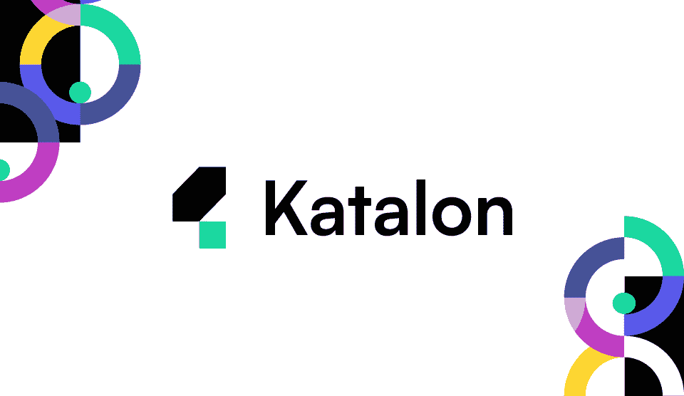**](https://katalon.com/)

**自:**

*   2015 年 1 月(作为内部工具)
*   2016 年 9 月

开发商:卡塔隆有限责任公司

**支持的平台:**移动、网络

Katalon Studio 是一个免费使用的自动化测试工具，构建在两个最流行的自动化测试框架之上，即 Appium 和 Selenium。它有一个 API、 [mobile](https://hackr.io/blog/best-mobile-testing-tools) 和基于 web 的测试的专用接口。

有趣的是，Katalon Studio 在 2021 年和 2022 年两次被选为 Gartner Peer Insights 客户对软件测试自动化的选择。Katalon Studio 支持用 Java 和 Groovy 语言编写测试脚本。

可定制的执行工作流允许 Katalon Studio 方便地处理不同类型的测试需求。自动化测试工具还提供了对 [XPath](https://en.wikipedia.org/wiki/XPath) 和对象重新缩进的支持。

**亮点:**

*   使用 Katalium、Katalon 记录器和 Katalon TestOps 进行全面测试和报告
*   双可互换测试接口
*   遵循页面对象模型模式
*   基于图像的测试功能可用
*   内置对象存储库
*   支持 CI 工具，如 Docker、Jenkins 和[吉拉](https://atlassian.sjv.io/c/2890636/1541686/17715)

**[在此了解更多](https://katalon.com/)**

[**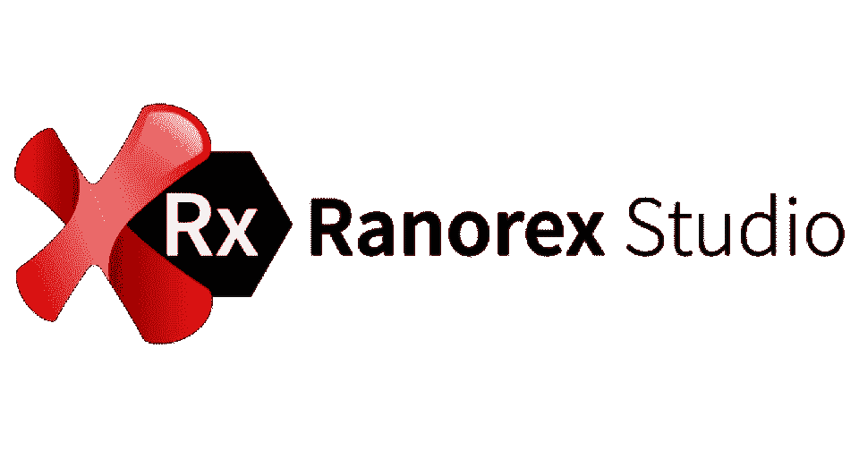**](https://www.ranorex.com/)

自: 2007 年

开发商:雷诺克斯有限公司

**支持的平台:**微软视窗、微软服务器、手机、网络

Ranorex 开发的主要目标是简化测试人员和开发人员之间的协作。十多年来，它一直在支持测试人员和企业。GUI 测试自动化工具支持在基于 Windows 的桌面、移动和 web 平台上进行测试。

自动化工程师和测试人员可以使用标准编程语言，如 C#和 VB.NET，使用 Ranorex 开发自动化测试模块。多年来，Ranorex 成功地找到了全球客户，例如阿迪达斯、佳能、IBM、汉莎航空和西门子。

Ranorex Studio 有多种许可。像工作室许可证、运行时许可证、高级捆绑包、企业捆绑包等等。

**亮点:**

*   易于维护的存储库
*   对移动和基于网络的应用进行端到端测试
*   GUI 对象标识。使用 RanoreXPath 技术过滤 GUI 元素
*   模块化自动化脚本
*   并行测试执行可用
*   Ranorex 记录器允许基于对象的记录和重放
*   强大的报告功能，包括详细的错误日志和饼图

**[在此了解更多](https://www.ranorex.com/)**

[**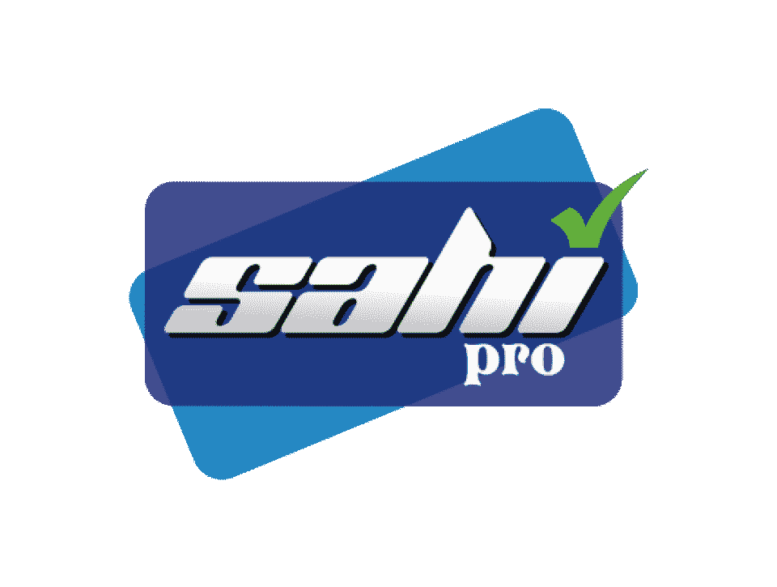**](https://www.sahipro.com/)

自 2005 年起

**开发者:**纳拉扬拉曼(原创)

泰图软件私人有限公司

**支持的平台:**桌面、网络、移动

Sahi Pro 是一个用 Java 和 JS 编写的业务驱动的测试自动化(BDTA)框架。测试自动化工具促进了多浏览器测试，并允许自动化工程师和测试人员用更少的代码做更多的事情。

使用 Sahi Pro 进行的所有测试都是稳定的，并支持自动等待以消除计时问题。测试工具允许在一台机器上并行运行数千个测试脚本，或者分布在一个集群中。Sahi Pro 甚至可以为带有动态 id 的应用程序工作。

在购买之前，用户可以获得 Sahi Pro Starter，这是 Sahi Pro 的 180 天免费限量版。测试自动化应用程序具有内置的 Excel 框架，使得协作和监控更加容易。

**亮点:**

*   浏览器测试记录和回放
*   详细错误报告
*   基于敏捷方法的项目的理想选择
*   为一系列 web 应用程序开发工具提供支持，包括 Dojo Toolkit、ExtJS 和 YUI 库
*   用于测试一系列技术的单一自动化工具，包括跨浏览器应用、桌面应用、Java 小程序、web 服务等
*   支持 CI 技术，如 Bamboo 和 Jenkins

**[在此了解更多](https://www.sahipro.com/)**

[****](https://www.telerik.com/teststudio)

**自:** 2010-2011 年

**开发商:** Telerik

**支持的平台:**微软视窗、手机、网络

Test Studio 是一个用于 Windows、mobile 和 web 平台的自动化测试工具。它主要用于对桌面应用、网站、网络应用和移动应用进行功能测试。

Telerik Test Studio 帮助快速创建自动化测试，然后将其无缝集成到基于敏捷的 CI/CD 管道中。自动化测试工具为错误跟踪和版本控制系统提供了现成的支持。

希望创建定制解决方案的企业可以利用强大的 Test Studio API。此外，将测试自动化工具与现有系统集成是小菜一碟。Telerik Test Studio 还支持进行其他测试，如负载和性能。

**亮点:**

*   跨浏览器支持
*   可用手动测试
*   提供与错误跟踪工具的集成支持
*   只需点击一下，就可以向[吉拉](https://atlassian.sjv.io/c/2890636/1541686/17715)和 TFS 女士报告错误
*   支持一系列技术，包括 AJAX、Angular、HTML、JavaScript、React 和 WPF

**[在此了解更多](https://www.telerik.com/teststudio)**

[**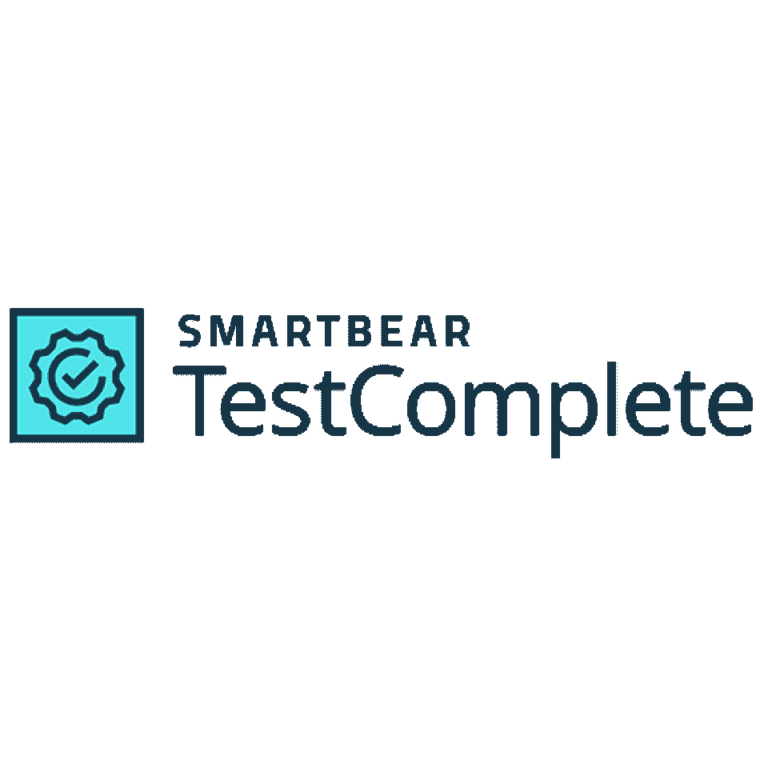**](https://smartbear.com/product/testcomplete/)

自 1999 年以来

**开发者:**智能熊软件

**支持的平台:** Android、GNOME Web、iOS、Microsoft Windows

TestComplete 提供了对一系列平台的支持，是一个专注于功能测试的自动化测试工具。它允许自动化工程师和测试人员用一系列脚本语言编写测试脚本，包括 DelphiScript、JavaScript、Python 和 VBScript。

TestComplete 有 3 个模块，针对不同的平台，即桌面、移动和 Web。除了功能测试，TestComplete 还允许后端测试，比如数据库测试——GUI 测试、回归测试和单元测试。

TestComplete 还可以修改现有的记录测试，以满足新的需求并覆盖更多的用例。测试软件还允许通过在许多工作站或虚拟机上运行许多自动化测试来进行分布式测试。

**亮点:**

*   在测试记录和回放过程中自动截图
*   基于 COM 接口，一个开放的 API
*   数据驱动测试可用
*   内置关键字驱动的测试编辑器
*   使用插件的卓越可扩展性
*   测试记录和回放

**[在此了解更多](https://smartbear.com/product/testcomplete/)**

[****](https://www.testing-whiz.com/)

**自:** 2012 年

**显影剂:**小天鹅信息技术

支持的平台:微软视窗系统(XP 或更高版本)

另一个顶级的测试自动化工具是来自 Cygnet Infotech 的 TestingWhiz。与其他流行的测试框架如 Selenium、TestComplete 和 UFT 相比，TestingWhiz 是这个领域的新手。

TestingWhiz 专注于测试自动化框架的实现、培训和维护。付费测试工具有 3 种许可:

1.  短期项目
2.  一年
3.  永久的

TestingWhiz 的免费试用版可供自动化工程师和测试人员在购买之前试用。TestingWhiz 的企业版提供了全面的测试，包括 API 测试、跨浏览器测试、数据库测试和移动应用测试。

TestingWhiz 为一系列技术提供了开箱即用的集成支持，包括 VCS 和测试管理工具。用户可以在不编写复杂代码的情况下执行测试，安排测试执行，以及生成和共享详细的测试报告。

**亮点:**

*   浏览器扩展测试
*   集中式对象存储库
*   分布式、数据和关键字驱动的测试
*   集成支持:

*   Bug 跟踪工具，如 FogBugz、吉拉和 Mantis
*   物眼内部记录器
*   简单邮件传输协议
*   测试管理工具，如惠普质量中心、TestRail 和泽法
*   版本控制系统，比如 GitHub

**[在此了解更多](https://www.testing-whiz.com/)**

[****](https://ontestpad.com/)

**自:** 2011 年

**开发商:** Testpad 有限公司

**支持的平台:**网络、移动

Testpad 利用清单启发的测试计划，可以很容易地应用于不同的测试风格，从探索性测试到传统的测试用例管理。这是一个过于简单的手工测试工具，它把实用主义放在首位。

与其他测试工具不同，Testpad 具有来宾测试者功能。它允许用户邀请人们进行一些预定义的测试，甚至不需要先建立一个帐户。Testpad 使用简单，不仅对于测试人员，对于非测试人员也是如此。

在测试过程中，可能会出现一些新测试的想法。Testpad 的开发考虑到了这一点，因为它允许在测试过程中添加新的测试。

**亮点:**

*   组织测试计划的拖放支持
*   易于学习和开始
*   关注软件开发的敏捷方法
*   响应迅速的 JS 支持的用户界面
*   支持手动测试
*   键盘驱动界面

**[在此了解更多](https://ontestpad.com/)**

[****](https://www.tricentis.com/products/automate-continuous-testing-tosca/)

自:2006 年 6 月

**开发商:** Tricentis

**支持的平台:**微软视窗、手机、网络

Tosca Testsuite 利用 MBTA(基于模型的测试自动化)快速创建弹性的、易于维护的端到端测试。自动化测试工具以基于风险的测试为特色，通过增加代码库和缩短发布时间来加快应用程序的测试速度。

通过基于模型的方法，企业可以使用 Tosca Testsuite 轻松地从 UI 测试转移到 API 测试。端到端测试自动化工具具有 Tricentis TDM(测试数据管理)功能，可减少创建测试数据所需的时间。

用户可以使用 Tricentis OSV(协调服务虚拟化)从 API 测试模块开发虚拟服务。令人惊讶的是，这样做并不需要深入的编码或技术知识。

**亮点:**

*   自动创建和提供按需合成或屏蔽的生产数据
*   分布式执行
*   从源头消除数据完整性问题
*   支持 160 多种技术
*   强大的测试记录和播放使用 ARA(自动化记录助理)
*   风险范围
*   支持基于云的协作

**[在此了解更多](https://www.tricentis.com/products/automate-continuous-testing-tosca/)**

[**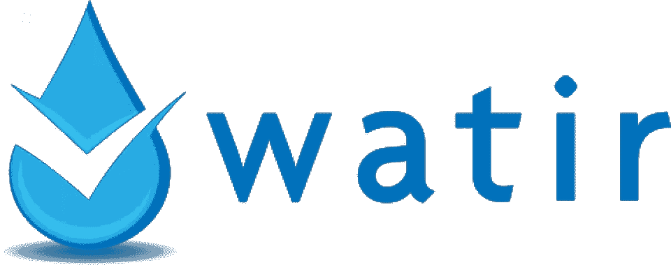**](http://watir.com/)

**自:**

*   2001 年(作为 cliec)
*   2003 年(饰演 WTR)
*   2004

**开发商:**几家

**支持的平台:**跨平台

与列表中的其他测试工具不同，Watir 是一组用 Ruby 编写的开源库，用于自动化 web 浏览器。事实上，Watir 是一个应用程序(应用程序)的缩写，发音为 water。

Watir 是一个针对网络应用的软件测试框架，在 MIT 许可下可用。它由许多次级项目组成，其中最显著的是:

*   经典手表
*   Watir-web 驱动器
*   Watirspec

有趣的是，Watir 是由硒驱动的。提供跨浏览器支持的 Watir-web 驱动程序是 Selenium 2.0 的衍生物。它支持几种业务驱动的开发工具和技术，包括 Cucumber、Ruby on Rails 和 RSpec。

**亮点:**

*   自动元素生成
*   易于阅读和维护的测试脚本
*   免费和开源
*   巨大的、不断扩大的社区支持
*   支持基于任何语言测试 web 应用程序
*   使用动态的通用编程语言 Ruby

**[在此了解更多](http://watir.com/)**

[**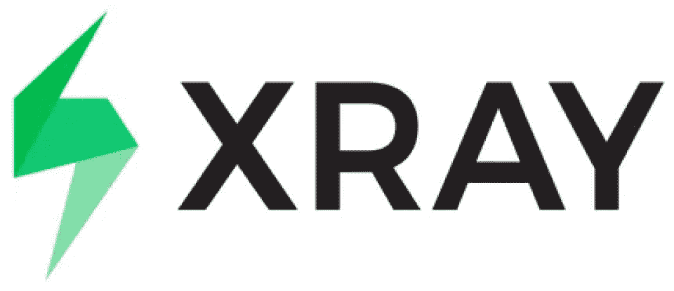**](https://www.getxray.app/)

**自:**不适用

**开发者:** Xpand IT

**支持的平台:** Web

Xray 被称为“吉拉最前沿的测试管理”，它是一个可扩展的测试管理平台，专注于敏捷方法。借助 REST API 和对 Bamboo 和 Jenkins 的现成集成支持，构建 CI/CD 管道变得更加容易。

x 射线通过全面有效的测试帮助企业提高软件产品的质量。软件测试工具让用户很容易地跟踪缺陷、执行、需求和测试。

Xray 支持整个测试生命周期，即从测试计划到测试报告。有了对 BDD 框架的完全支持，编写测试就简单多了。

**亮点:**

*   高级测试文件夹结构
*   易于与测试自动化框架集成，例如 Cucumber 和 Selenium
*   多种格式的内置报告，包括。docx 和。带 Xporter 的 pdf
*   与 JIRA 直接整合
*   对黄瓜的本地支持
*   支持手动测试

**[在此了解更多](https://www.getxray.app/)**

[**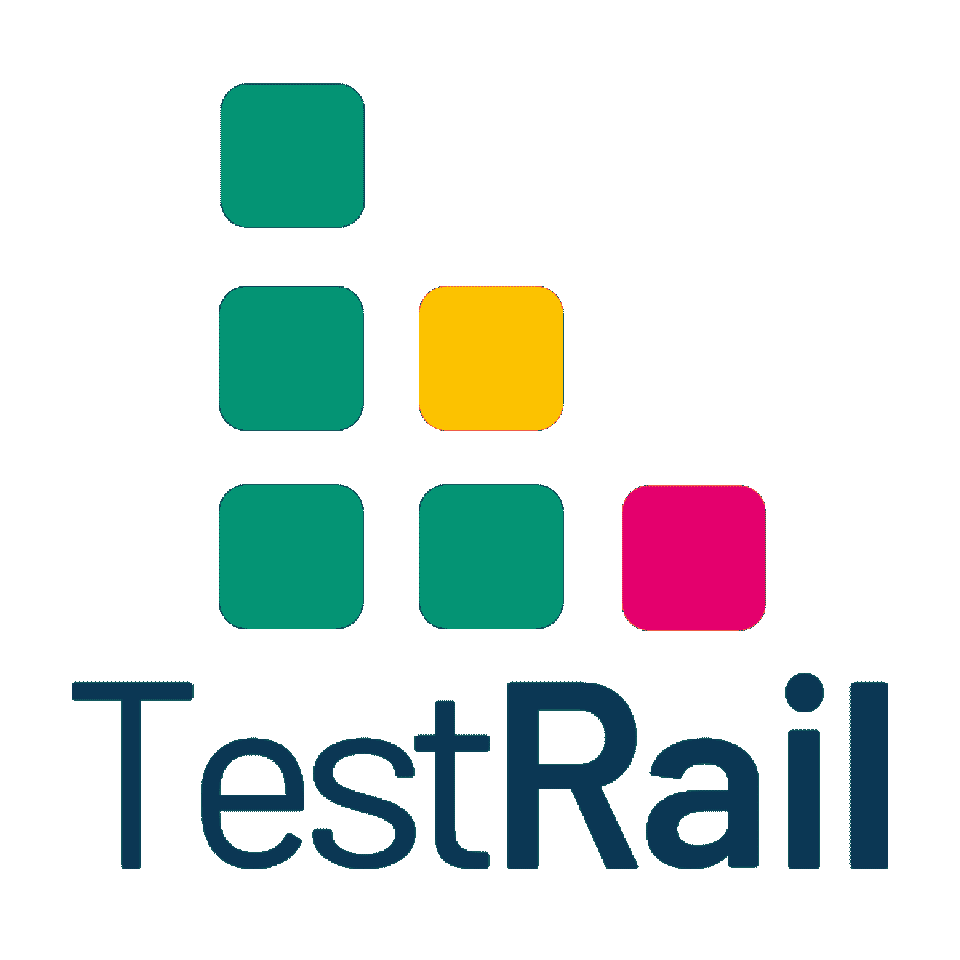**](https://www.gurock.com/testrail/)

自 2004 年起

**开发商:** Gurock 软件

**支持的平台:** Web、Windows 服务器、Unix/Linux 服务器

TestRail 作为基于网络的测试用例管理工具已经存在了近二十年。它在云上可用，但也可以安装在内部，这取决于组织的偏好。无论哪种方式，TestRail 都很容易设置并立即开始使用。

TestRail 以高度可定制而闻名，这反过来又使它非常具有可扩展性。其结果是一个适用于任何规模团队的解决方案，无论团队是大是小，甚至是企业级的。

该工具提供了交互式仪表盘、活动报告、指标等，为用户提供实时的测试进度洞察。通过截图和预期与实际结果的比较，可以很容易地记录和管理手动和自动测试。

**亮点:**

*   支持 Docker 容器
*   企业版适用于关键任务项目和大型团队
*   在云中或内部可用
*   提供里程碑、电子邮件通知和个人待办事项列表来帮助提高效率
*   在信息丰富的仪表板上提供信息丰富的指标和活动报告，以实时了解测试的进展情况
*   允许有效管理自动化或手动测试用例

**[在此了解更多](https://www.gurock.com/testrail/)**

[****](https://www.practitest.com/)

自: 2008 年

**开发商:**

*   由 Yaniv Iny 和 Joel Montvelisky 共同创建

**支持的平台:** Web

作为一个基于 SaaS 的端到端测试管理工具，PractiTest 基本上涵盖了整个 QA 过程。这个工具允许测试过程的完全可见性，这转化为对测试结果的更好理解。用户可以获得实时仪表板、可定制的报告和方便的过滤器视图。

PractiTest 还允许测试元素的重用，以最小化乏味和重复的任务，从而提高团队的生产力。

**亮点:**

*   以灵活和完全可定制(定制视图、字段、问题工作流等)而闻名，使其能够满足任何 QA 团队不断变化的需求
*   提供大量与其他产品的第三方集成，如自动化工具、bug 追踪器等等
*   允许测试人员重用他们的测试，然后将结果与其他产品和发布相关联
*   提供报告和高级仪表板，帮助可视化数据
*   由于分层过滤树，允许组织和快速搜索
*   PractiTest 提供出色的客户支持

**[在此了解更多](https://www.practitest.com/)**

[****](https://smartbear.com/test-management/zephyr-scale/)

**自:**

*   2015 年作为 TM4J
*   2020 年作为泽法规模

**开发商:**

*   As TM4J - Adaptavist
*   作为泽法秤-智能熊软件

**支持的平台:** Web

泽法秤，一个智能熊软件产品，是一个测试管理工具，在吉拉工作。它提供了报告、测试计划，并且具有可重用的特性。这个工具最适合那些遵循敏捷或者瀑布方法，并且在他们的测试过程中寻找更多的可重用性和结构的团队。开箱即用，用户可以获得 70 多种类型的报告，提高了整体可见性。

**亮点:**

*   由于详细的变更历史、端到端的可追溯性和测试用例版本控制，使得测试人员更容易进行审计/跟踪
*   免费的内置 REST API 使开发和测试团队能够集成 CI/CD、BDD 和自动化
*   自动化测试执行的结果可以从 Bamboo、Jenkins 等网站发布
*   用户可以访问 70 多个跨项目报告、60 个 Confluence 宏和 60 个小工具，这意味着更好的可见性、协作和数据分析

**[在此了解更多](https://smartbear.com/test-management/zephyr-scale/)**

[**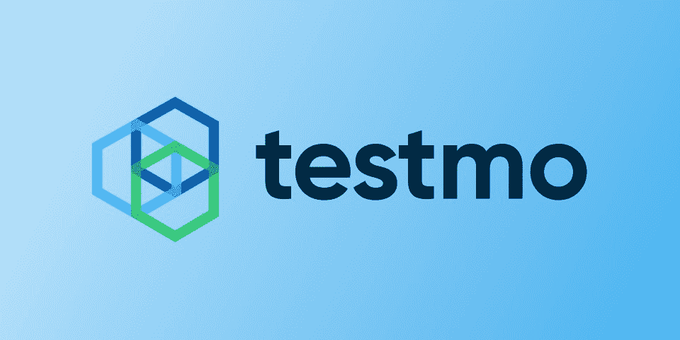**](https://www.testmo.com/)

**自:**

*   引入-2022 年 1 月
*   Beta 测试阶段-2022 年 3 月
*   不久后试运行

**开发商:**

*   由丹尼斯·古洛克和托拜厄斯·古洛克共同创立

**支持的平台:** Web

尽管 Testmo 是较新的一方，但由于它是最好的统一测试管理工具之一，它很快变得更受欢迎。Testmo 是一个在软件测试中使用的工具，用于管理手工的、自动化的或者探索性的测试，但是它允许用户在一个单一的、强大的平台上做任何事情。

Testmo 以快如闪电而闻名，同时仍然能够推出一个强大而直观的用户界面，显示丰富的指标。这个工具完全集成了 GitHub、吉拉、GitLab、Asana 等等。

**亮点:**

*   统一测试，允许您在一个地方跟踪所有与 QA 相关的事情
*   快速工作，同时保持可伸缩性，使其成为所有规模团队的绝佳选择，包括企业级团队
*   可定制的工作流程、字段和测试任务
*   具有实时图表和指标的顶级报告功能
*   可以与任何 CI 管道、测试自动化工具和 DevOps 工具集成
*   与 GitHub、吉拉、GitLab 等完全集成

**[在此了解更多](https://www.testmo.com/)**

[**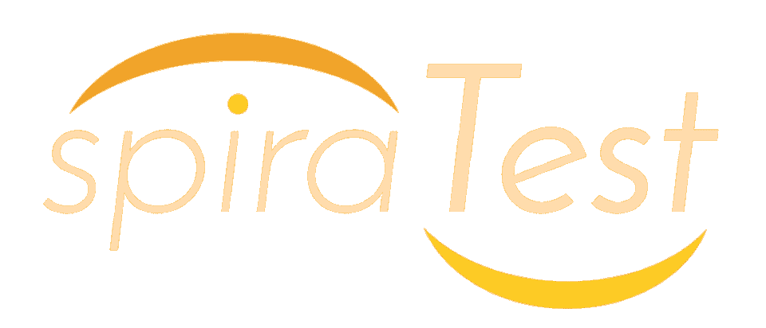**](https://www.inflectra.com/SpiraTest/)

**自:**2007-2008 年左右

**开发者:** Inflectra

**支持的平台:** Web、Windows 服务器(针对内部客户)

SpiraTest 是另一个软件测试工具，可作为基于 web 的 SaaS 或内部安装提供。这是一个可扩展的解决方案，适用于小型和大型团队。它通常是开箱即用的，需要最少的设置。

SpiraTest 为计划、需求、测试、错误、代码和任务的查看和管理提供了一个单一的环境。

**亮点:**

*   允许在探索性和手动测试中轻松管理集合、测试用例以及运行
*   通过浏览器作为 SaaS 提供，或通过 Windows Server 安装在内部提供
*   六十多个应用集成
*   允许用户通过以自上而下的视图显示项目的执行仪表板来管理他们的团队和流程
*   数据和项目可视化以及业务分析触手可及

**[在此了解更多](https://www.inflectra.com/SpiraTest/)**

[****](https://www.kobiton.com/)

**自:** 2016 年

**开发商:**

*   由乔希·利伯曼和武兰共同创立

**支持的平台:**Web；更多信息[此处](https://support.kobiton.com/hc/en-us/categories/360005234092-Technology-Support-Supported-Versions)

Kobiton 于 2016 年首次发布，现已发展成为最受欢迎的移动设备软件测试工具之一。它的主要目的是帮助团队创建和交付用户友好的、没有任何问题的移动体验。虽然它是一个基于云的工具，但它也作为一个内部解决方案提供。

Kobiton 允许真实设备测试，让测试人员在云中访问物理设备。云访问提供对手势和方向的完全支持，因此用户可以像在他们面前一样轻扫、轻敲、滚动和使用云设备。随着测试的进行，Kobiton 会根据生成的详细日志进行实时分析，这些日志包括截图、视频以及设备或系统指标，如内存性能和电池消耗。

**亮点:**

*   基于云，允许用户访问私有或公共云中的真实设备
*   允许本地设备的“云”访问，为用户提供远程共享访问
*   允许手动和自动的网络和移动测试
*   提供内部解决方案
*   允许无限用户
*   自动化性能、功能、兼容性和视觉测试；有脚本或无脚本
*   允许在人工智能的帮助下修复视觉和功能问题
*   允许用户访问或共享应用质量分析

**[在此了解更多](https://www.kobiton.com/)**

[**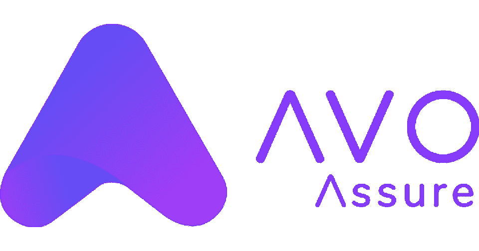**](https://avoautomation.ai/)

**自:** 2020 年

开发商: SLK 软件公司，Avo 自动化公司

**支持的平台:**网络、安卓、iPhone/iPad

Avo Assure 是一个自动化测试工具，它绝对需要零代码。它使用户能够通过几次简单的点击来执行 E2E 业务流程测试，从而使全面执行测试变得更加容易。Avo Assure 提供了一个用户友好、直观的用户界面，可帮助 QA 针对 Windows、移动(iOS、Android)、web、非 UI 平台等执行测试案例，所有这些都在一个解决方案中。

Avo Assure 的独特产品之一是其思维导图功能，它提供了测试和项目层次结构的可视化表示。这个 Avo Assure 特性使得定义和设计测试计划和案例变得更加容易，同时也使得准确判断团队在测试自动化周期中的位置变得更加容易。

**亮点:**

*   最好的软件测试工具之一，允许用户创建/执行测试用例，而不需要编写代码
*   允许端到端的测试自动化；超过 90%的覆盖率
*   思维导图功能允许用户定义和设计他们的测试计划和测试用例
*   集成了主要工具，如詹金斯，吉拉，QTest，ALM，销售力量，TFS，酱实验室，等等
*   智能调度允许用户执行多种场景
*   报告直观且易于理解

**[在此了解更多](https://avoautomation.ai/)**

[****](https://www.accelq.com/)

**自:** 2014 年

**开发商:**[ACCELQ Inc .](https://www.accelq.com/aboutus/#:~:text=Gartner%20Verified%20Reviews.-,Our%20Leadership%20Team,-Experience%2C%20Entrepreneurial%20Spirit)

**支持的平台:**网络、安卓、iPhone/iPad

虽然它是基于云的，但 ACCELQ 也可以作为本地安装提供。它是一个允许在应用程序抽象之上利用 NLP 或自然语言编程进行连续自动化测试的工具。这种组合允许团队在应用开发的任何阶段进行测试。ACCELQ 的许多客户都是各行各业的大型财富 500 强公司。众所周知，这些公司使用 ACCELQ 可以加快开发速度，降低成本。

**亮点:**

*   基于云，适用于任何操作系统和浏览器
*   也可在内部使用
*   提供可操作的报告
*   不需要任何代码
*   提供与大多数领先 DevOps 工具的本机集成
*   订阅是全包的；允许无限代理

**[在此了解更多](https://www.accelq.com/)**

[****](https://www.testim.io/)

**自:** 2014 年

**开发者:** Testim，Tricentis

**支持的平台:** Web

Testim 是一款人工智能自动化测试工具，最近被 Tricentis 收购。它利用机器学习来更快地创作、执行和维护自动化测试。它允许在云上进行多个并行的跨浏览器测试(无论是 Testim 的还是用户的)。Testim 可以与各种工具集成，这使它能够适应您现有的工作流程。

**亮点:**

*   Testim 可在内部或云上使用
*   多个测试可以跨多个浏览器或通过云(Testim 或私有用户云)同时进行
*   可以很容易地将错误报告给错误跟踪系统，并附上相关的注释和信息
*   一旦错误被报告并出现在系统中，开发人员只需点击错误测试，就会在浏览器中自动重现问题
*   测试创建是通过代码或者通过记录，尽管如果 QA 测试人员愿意，他们可以结合这两种方法

**[在此了解更多](https://www.testim.io/)**

[**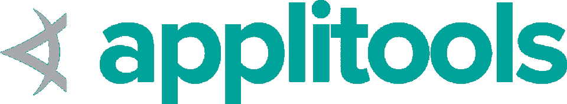**](https://applitools.com/)

**自:** 2018 年

开发商:应用工具公司

**支持的平台:** Web

AppliTools 是下一代自动化测试工具，可以在内部使用，也可以作为基于云的 SaaS 使用。它是一种人工智能辅助工具，使用称为视觉人工智能的计算机视觉技术。这项技术帮助开发人员、QA 测试人员和测试自动化工程师更快更容易地执行他们的测试。因此，团队可以显著加快他们的开发周期，让他们更高效地发布高质量的移动和 web 应用。

AppliTools 提供了 60 多个与其他自动化框架的集成，包括但不限于 Selenium、Cypress 和 WebdriverIO。

**亮点:**

*   作为云上或内部的 SaaS 提供
*   允许方便的用户访问管理
*   允许在各种设备上进行跨浏览器测试
*   为测试人员/用户提供关于所执行的视觉测试的交互式报告
*   提供 60 多个与现代自动化测试框架的集成

**[在此了解更多](https://applitools.com/)**

[****](https://www.soapui.org/)

自 2005 年起

**开发者:**智能熊软件

**支持的平台:** Web

自 2005 年以来，SoapUI 一直是 SmartBear Software 提供的开源工具。不过，有更多功能的许可版本 SoapUI Pro 可供需要的人使用。SoapUI 是一个跨平台的工具，测试人员使用它来对 API 执行负载或功能测试。它还能够进行 JBDC 和 HTTP 调用。它具有用户友好的 GUI，这使它成为许多人的热门选择。SoapUI 还提供[安全测试](https://hackr.io/blog/top-10-open-source-security-testing-tools-for-web-applications)功能，帮助团队确保他们的产品免受病毒和黑客的攻击。它提供了报告功能，使测试分析变得轻而易举。

**亮点:**

*   用 Java 和 Groovy 编写
*   可通过 SoapUI 作为开源获得；作为 SoapUI Pro 提供的专有许可证
*   用户界面非常简单直观
*   借助漏洞测试功能，帮助保护网站免受病毒和黑客攻击
*   报告功能允许进行详细的分析

**[在此了解更多](https://www.soapui.org/)**

[****](https://www.invicti.com/penetration-testing-software/)

**自:**

开发人员: Invicti

**支持的平台:** Web

Invicti，原名 Netsparker，是一个完全可配置的自动化软件测试工具。它的主要功能是扫描 web 应用程序的安全漏洞。Invicti 可以在 web 应用程序、web 服务和网站上自动执行这些安全扫描。许多人选择 Invicti 是因为它的易用性和可伸缩性，尽管它没有麻烦并且维护成本低得令人难以置信。

**亮点:**

*   使用基于证据的技术自动验证已识别的漏洞是真实的(而不是误报)
*   具有内置的自动化工具和工作流，允许开发人员和组织同时扫描数百个站点，并加大在 web 应用安全方面的努力
*   拥有资产发现服务，可查找所有需要扫描的应用、服务、网站和 API
*   技术功能允许用户查找和列出任何 web 应用程序中使用的技术，同时识别过时的版本
*   能够发现 HTML5、Web 2.0 甚至单页 Web 应用中的漏洞
*   允许远程触发扫描
*   安全仪表板允许在一个地方进行所有监控

**[在此了解更多](https://www.invicti.com/penetration-testing-software/)**

当您选择自动化 QA 工具(甚至是手动工具)时，您可能需要考虑一些因素。查看如下标准:

*   **许可成本**(如果适用的话)——有很多免费或开源的测试工具可以让你作为开发人员或测试人员的生活变得更加轻松。然而，也有许多工具需要花费大量的金钱来获得使用许可。在你添加一个工具到你的列表之前，一定要确保它在你的预算之内。
*   **易于维护** -并非所有的自动化软件测试工具都是相同的。从长远来看，有些可能更具挑战性或维护成本更高，这意味着它们可能不值得您花费时间或金钱。在提交之前，请始终考虑工具的维护难度。
*   测试创建的便利性 -任何决策的很大一部分都是着眼于易用性，当你选择测试工具时也是如此。工具应该让你的生活更容易，而不是更难。因此，正确的工具将允许测试人员运行快速有效的测试，无论他们的技术水平或自动化专业知识如何。
*   **操作系统兼容性** -即使一个产品现在没有运行在特定的操作系统上，也不意味着它永远不会运行。拥有一个支持各种操作系统配置的测试工具可能对您有好处，包括对旧操作系统版本的兼容性。然而，操作系统兼容性并不是每个人都必须的，尤其是如果你确定你的产品只能在一个特定的操作系统上运行。
*   **跨平台兼容性** -不是所有的开发者都需要担心跨平台兼容性，尤其是如果他们的产品只针对单一平台的话。但是，如果您认为这可能是您的一个顾虑，那么就寻找能够满足您需求的工具。
*   **隐性成本** -虽然有许多免费的开源工具，但你可能没有意识到的是，它们可能也有一些隐性成本。当您选择一个团队中没有多少人熟悉的工具时，您可能会产生一些与让他们熟悉工具用法相关的培训成本。某些工具还可能有硬件或软件要求，这会增加您的成本，尤其是在您需要升级现有设置的情况下。在做出选择之前考虑这些成本。
*   **公司声誉和工具支持** -作为上述所有标准的补充，了解工具的声誉可能会对您有所帮助。可能有一些利基工具在理论上听起来很棒，但实际上，它们可能没有得到开发人员的良好支持。与此同时，它还可以帮助你查看公司的评论，看看某个工具是否值得使用，以及如果你需要指导，你是否能够找到客户支持。

这些标准可以作为指导方针，帮助您根据自己的需求选择合适的工具。

但是，在某些情况下，您只能给出您的建议，例如外包。如果一个客户将他们的产品开发外包给你，很可能他们已经有了一个工具或者偏爱一个。在这种情况下，使用他们首选的工具可能是最好的，尽管在可能的情况下提出您的建议可能对您仍有好处。

## **结论**

软件测试工具并不缺乏。由于软件测试有如此多不同的参数，可用的选项也是如此。

您可以决定是选择一个单一的、统一的测试平台，还是根据您的测试需求使用许多不同的测试工具。你更喜欢什么软件测试工具？请在评论中告诉我们。

想进入软件测试的世界吗？从这些软件测试课程开始。

**人也在读:**

## **常见问题解答**

今年有相当多的测试工具很受欢迎，比如 Selenium、Appium、TestComplete、Katalon Studio 等等。值得一提的是，人工智能和机器学习的测试工具最近似乎也越来越受欢迎。

目前，一些最流行的工具包括 Telerik Test Studio、Selenium、Watir、Tosca 和 TestComplete 等。

QA 分析师通常使用软件测试工具，这些工具允许对各种软件产品进行手动或自动测试。这些工具通常会提供测试结果的详细报告。在软件测试中，自动化工具可以减少必要的工作。

#### **4。什么是软件测试？**

软件测试是测试人员(通常是 QA)检查软件产品是否有问题的过程。QA 测试人员在测试工具的帮助下执行这个过程，以检查软件产品是否满足其需求，是否有合理的缺陷和无 bug。有许多软件测试的自动化工具可以帮助减少过程中所需的人力投入。

#### **5。在软件工程的背景下，什么是软件测试工具？**

软件工程中的测试工具经常被用来帮助工程过程，在软件产品发货之前发现它是否有任何问题或缺陷。测试工具可以帮助加速开发过程或周期，同时最小化产品中的问题。