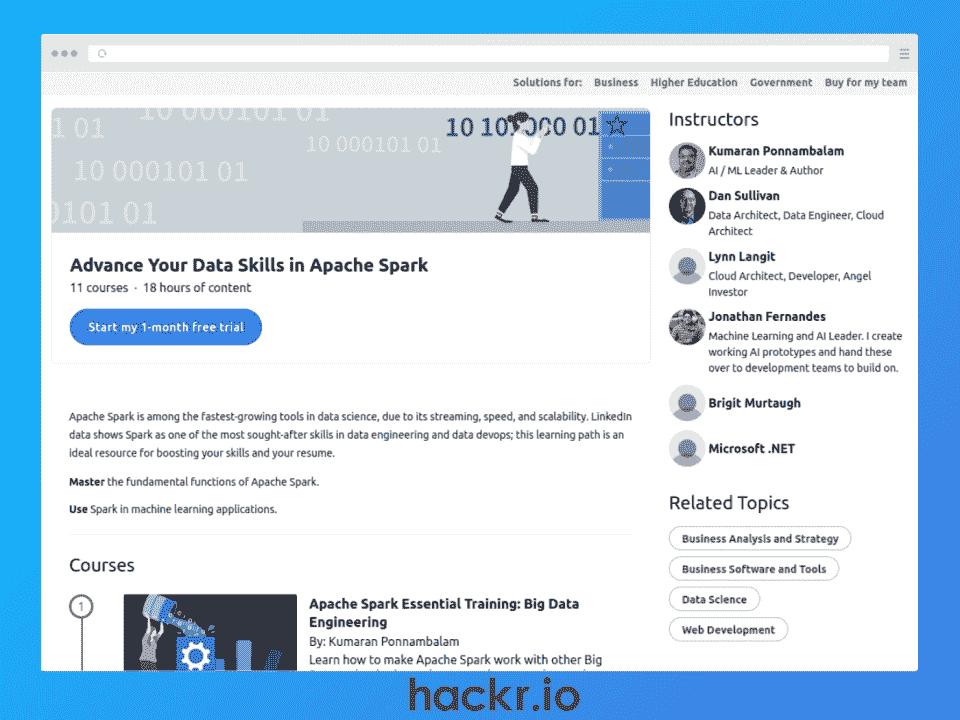
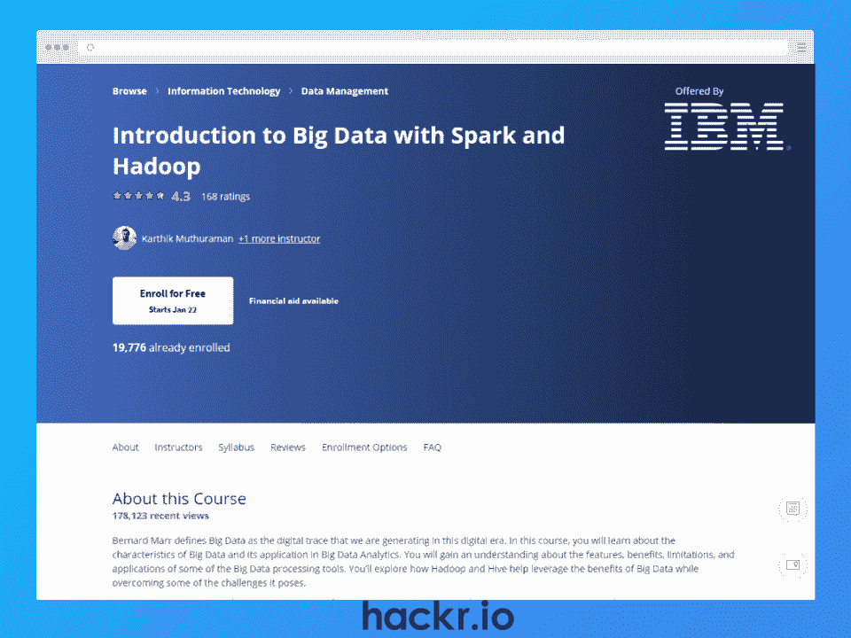
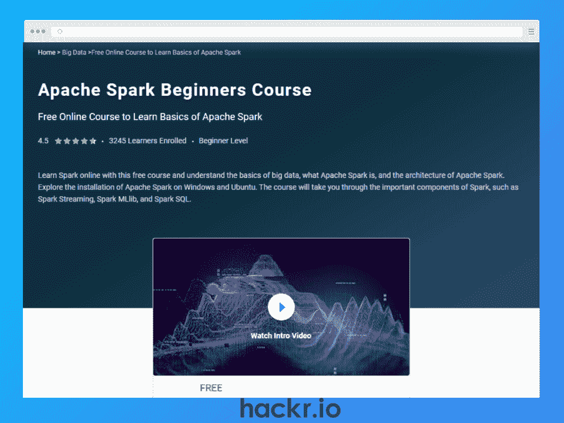
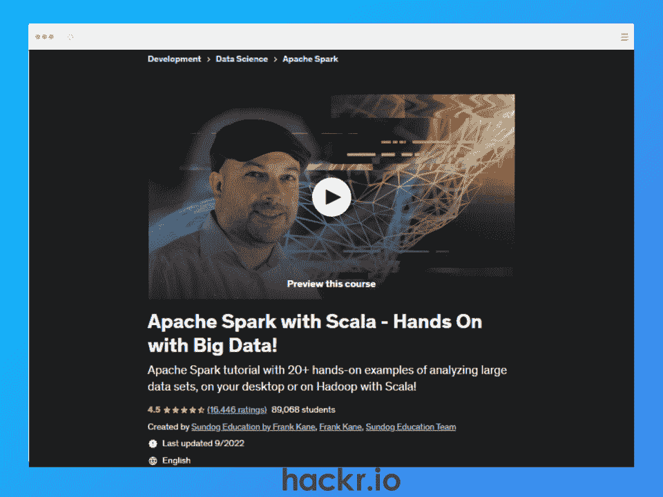
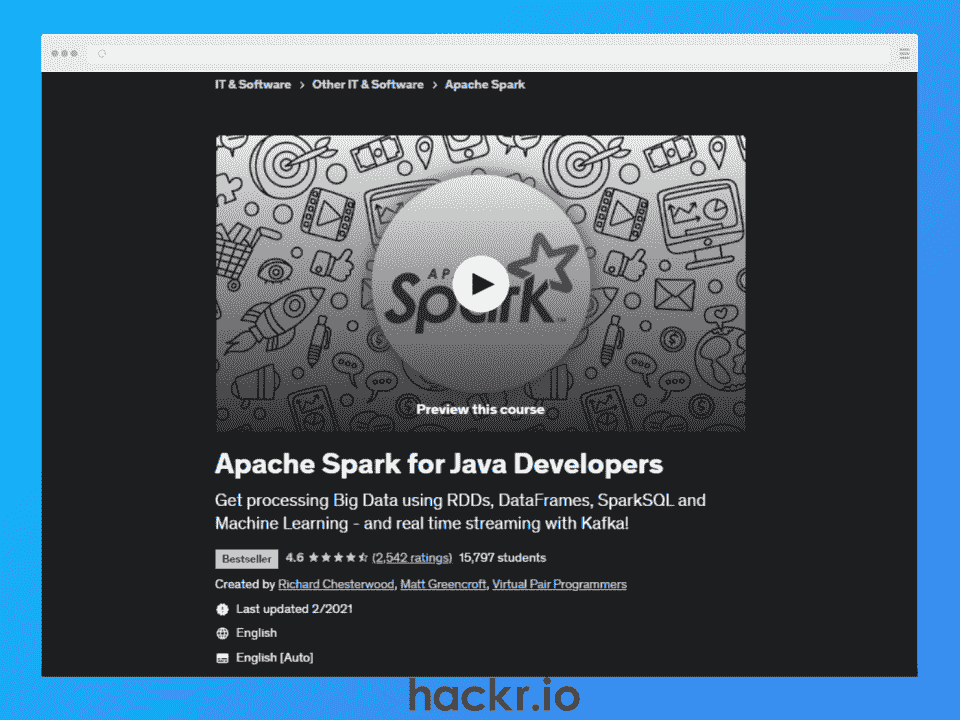
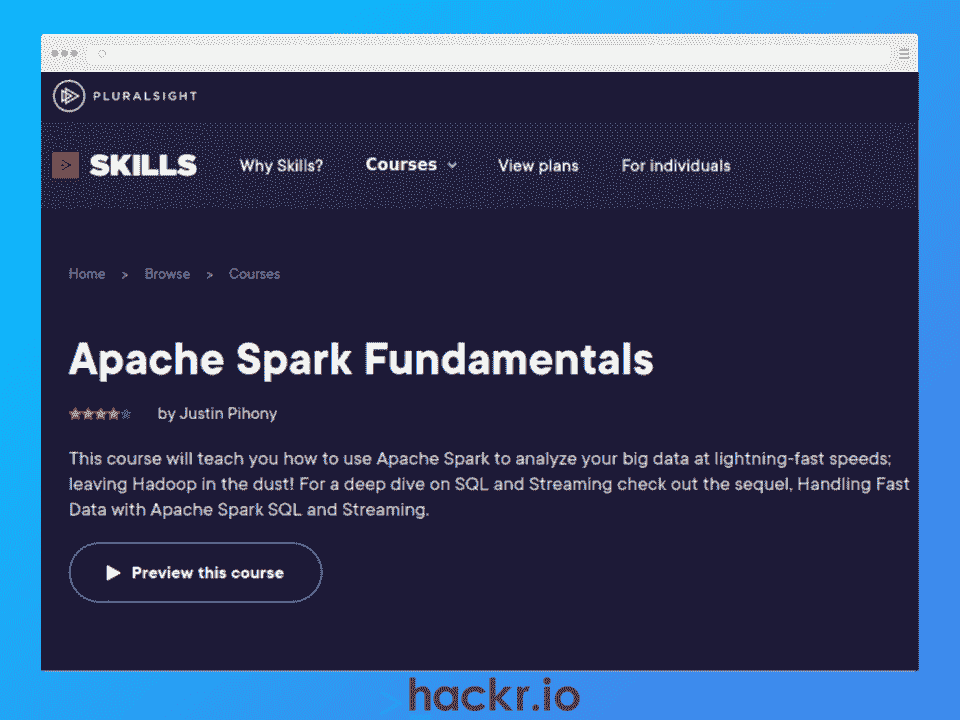
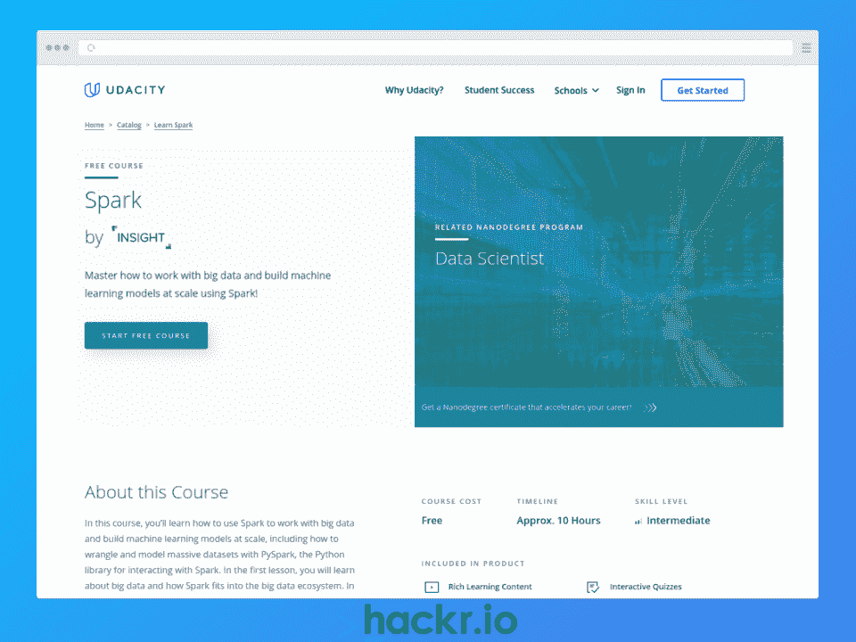
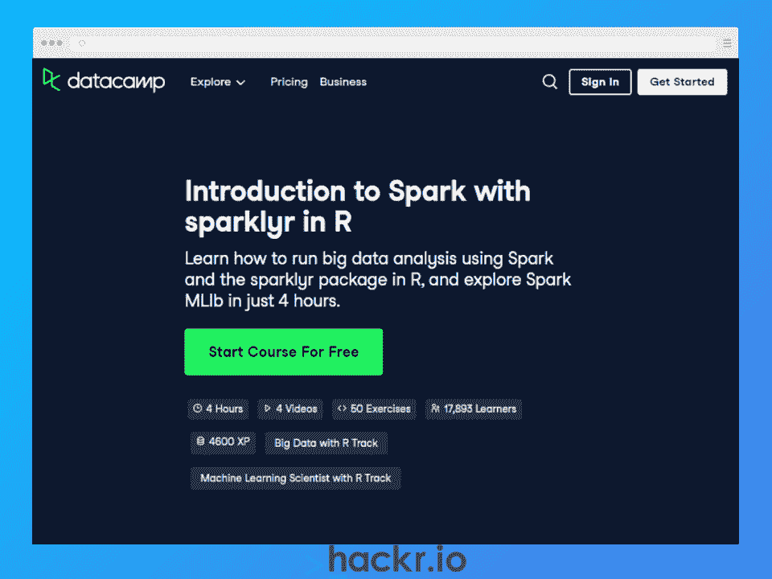
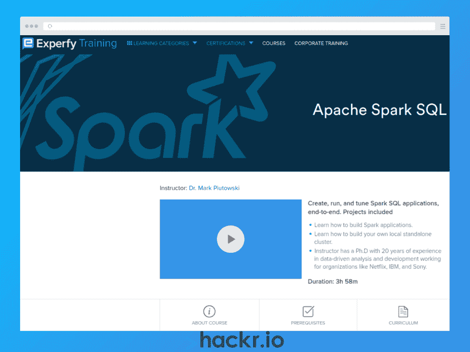

# Apache Spark 在线课程

> 原文：<https://hackr.io/blog/best-spark-courses>

当我们跨入 2023 年，[互联网用户每天产生 2.5 万亿字节的数据](https://techjury.net/blog/big-data-statistics/)(一个持续增长的数字)。但这只是各种规模的组织目前正在应对的大数据挑战的一个方面。

对数据和 DevOps 工程师的需求持续增长并不奇怪。组织可以通过创建一支熟练的数据团队和使用正确的工具来管理、争论、清理和分析这一宝贵的数据资源。进入阿帕奇火花。

[Apache Spark](https://hackr.io/blog/what-is-apache-spark) 是一款用于大规模数据处理的开源分析工具。凭借速度、可伸缩性和实时流功能，Apache Spark 是数据工程和 DevOps 最受欢迎的工具之一。随着阿帕奇火花工程师[收入超过 120，000 美元](https://www.glassdoor.com/Salaries/spark-engineer-salary-SRCH_KO0,14.htm)，现在是学习这些宝贵技能的最佳时机。

本文涵盖了 2023 年前 10 大最佳 Apache Spark 课程，考虑了价格、评论、讲师、内容和 Spark 认证。因此，无论您是数据工程和 DevOps 的新手，还是想要提高技能的经验丰富的专业人士，都有适合您的课程。

**特色阿帕奇星火课程【编辑推荐】**

## **选择最佳 Apache Spark 课程**

我们编制了 2023 年 10 个最佳 Spark 课程的列表，包括我们选择每个课程的原因、利弊以及关键细节的总结。为了挑选每门课程，我们使用了以下标准。

*   **导师声望:**他们作为老师或行业专业人士有多少经验？以前的学生对他们评价高吗？
*   **课程内容:**课程材料的详细程度和相关性如何？它是否涵盖了数据工程师或 DevOps 工程师的真实主题？往届同学推荐吗？
*   **社区:**有多少人上过这门课？如果你需要，你能很容易地找到支持吗？

## **10 个最佳阿帕奇 Spark 课程**

**[了解更多](https://linkedin-learning.pxf.io/rn9EJ5)**

**我们为什么选择本课程**

这个 Apache Spark 培训是一个全面的学习路径，包括 11 门 LinkedIn 课程和 18 小时的视频内容，供有抱负的数据专业人员学习 Spark 技能。

对于初学者来说，这是一门理想的 Spark 课程，在深入学习 SparkSQL、Spark on the cloud with Azure Data bricks & Spark workflows with AWS、深度学习、流模式之前，您将学习大数据和 Apache Spark 的基础知识。可扩展数据分析管道的最佳实践。

**优点**

*   面向所有初学者的全面而广泛的内容
*   经验丰富的讲师

**缺点**

*   需要 LinkedIn 学习高级版

**关键信息**

**先决条件:**基本计算技能

**讲师:**库马兰·波南巴兰、丹·沙利文等等

**等级:**初学者

**免费或付费:**付费

**证书:**是

**持续时间:** 18 小时

**[了解更多](https://imp.i384100.net/P0ezmN)**

**我们为什么选择本课程**

该 Spark 在线课程由 IBM 提供，由 IBM 数据专业人员讲授，解释了 [Spark 和 Hadoop](https://hackr.io/blog/hadoop-vs-spark) 对大数据、Apache 架构&生态系统的影响，开发 Spark 应用程序的最佳实践，以及 SparkSQL、Spark DataFrames、Spark RDD(弹性分布式数据集)和 SparkML(机器学习)等基本 Spark 组件。

**优点**

*   初学者友好的内容
*   行业认可的可共享证书
*   来自 IBM 的经验丰富的讲师

**缺点**

*   侧重于理论与实践技能

**关键信息**

**先决条件:**基本计算技能

**指导老师:** Karthik Muthuraman 和 Aije Egwaikhide

**等级:**初学者

**免费或付费:**付费

**证书:**是

**持续时间:** 13 小时

**[了解更多](https://www.simplilearn.com/learn-apache-spark-basics-free-course-skillup)**

**我们为什么选择本课程**

本课程旨在让真正的初学者在尝试进入大数据世界时在线学习 Spark。

它强调对大数据、Apache Spark 基础知识和 Apache Spark 架构的理解。您将学习如何在 Windows 和 Ubuntu 上安装 Apache Spark，然后介绍 Spark Streaming、SparkSQL 和使用 SparkML 进行机器学习的介绍性内容。

**优点**

**缺点**

*   开始课程后 90 天的访问权限(所以要尽快完成！)

**关键信息**

**先决条件:**基本计算技能

**讲师:**不适用

**等级:**初学者

**免费或付费:**免费(90 天访问)

**证书:**是

**持续时间:** 7 小时

**[了解更多](https://www.youtube.com/watch?v=zC9cnh8rJd0)**

**我们为什么选择本课程**

如果您正在寻找一个初学者友好的学习 Apache Spark 的课程，这是对 Spark 和 Spark 生态系统的完美介绍。您将学习 Spark 基础知识，包括 Spark 转换、SparkRDD、SparkSQL、Spark 数据帧和 Spark 流。您还将了解 Spark 和 Hadoop 之间的差异，以及何时最好使用和不使用 Spark。

**优点**

*   面向初学者的免费丰富内容
*   经验丰富的专业讲师

**缺点**

**关键信息**

**先决条件:**基本计算技能

**指导老师:**拉古拉曼

**等级:**初学者

**免费或付费:**免费

**证书:**否

**持续时间:** 7 小时

**[了解更多](https://click.linksynergy.com/deeplink?id=jU79Zysihs4&mid=39197&murl=https%3A%2F%2Fwww.udemy.com%2Fcourse%2Fapache-spark-with-scala-hands-on-with-big-data%2F)**

**我们为什么选择本课程**

只有 9 个小时，这是为数不多的包括 Spark 培训和 Scala 语言课程的 Spark 认证课程之一。

您将学习如何分析具有结构化和流数据的海量数据集，将机器学习应用于数据集，在 Hadoop 集群上运行 Spark，等等。它还包括带有详细解释的源代码，以增强您的学习和实践。

**优点**

*   Scala 编程语言速成班
*   具有行业经验的知识丰富的讲师
*   相关和真实世界的编码示例

**缺点**

*   需要编程和脚本知识，所以不适合初学者

**关键信息**

**先决条件:**编程&脚本基础

教练:弗兰克·凯恩

**等级:**中级

**免费或付费:**付费

**证书:**是

**持续时间:** 9 小时

**[了解更多](https://click.linksynergy.com/deeplink?id=jU79Zysihs4&mid=39197&murl=https%3A%2F%2Fwww.udemy.com%2Fcourse%2Fapache-spark-for-java-developers%2F)**

**我们为什么选择本课程**

Spark 在线培训是现有 Java 开发人员使用 Apache Spark Java API 过渡到大数据的绝佳方式。

您将学习使用 functional Java 来定义复杂的数据处理作业&构建管道，了解 rdd 和数据帧，通过 SparkML 使用机器学习，通过大型数据集使用 SparkSQL，以及将 Spark 连接到 Apache Kafka 进行数据流处理。

**优点**

*   全面，包括机器学习等高级主题
*   Spark 和 Apache Kafka 用于实时大数据流的实践示例
*   讲师是经验丰富的程序员

**缺点**

*   专门针对 Java 开发人员(中级)
*   不支持 Java9+

**关键信息**

**先决条件:** Java8 & SQL 知识

讲师:理查德·切斯特伍德和马特·格林克罗夫特

**等级:**中级

**免费或付费:**付费

**证书:**是

**持续时间:** 21.5 小时

**[了解更多](https://pluralsight.pxf.io/P0ezmX)**

**我们为什么选择本课程**

PluralSight 的这一产品将教您所有您需要知道的 Apache Spark 基础知识，包括 Spark 的历史、Spark UI、基本库、SparkSQL、如何管理集群、机器学习以及在 AWS 上设置 Spark。您还将创建一个 Wikipedia 分析应用程序来巩固您的学习。

**优点**

*   了解 Apache Spark 分析大数据的核心概念
*   热衷于 Scala 的经验丰富的讲师

**缺点**

*   没有结业证书

**关键信息**

**先决条件:**编程知识

讲师:贾斯汀·皮霍尼

**等级:**中级

**免费或付费:**付费

**证书:**否

**持续时间:** 4.25 小时

**[了解更多](https://imp.i115008.net/kjy4Jn)**

**我们为什么选择本课程**

这个免费的中级 Spark 课程专注于处理大数据以及如何为机器学习构建可扩展的大数据管道。

您将了解如何使用 SparkSQL 和 Spark DataFrames 操作数据，使用 PySpark 争论数据，使用 Spark WebUI 调试和优化 Spark 应用程序，以及使用 SparkML 将机器学习应用于大型数据集。

**优点**

*   涵盖基本概念
*   经验丰富的专业讲师
*   完全自由

**缺点**

*   内容主要围绕数据科学展开

**关键信息**

**必备条件:**编程&数据分析经验

导师:大卫·德拉蒙和朱迪·兰托斯

**等级:**中级

**免费或付费:**免费

**证书:**否

**持续时间:** 10 小时

**[了解更多](https://datacamp.pxf.io/e43nkD)**

**我们为什么选择本课程**

这是一个更高级的 Spark 类，面向有经验的 R 程序员，将 Spark 的速度和可伸缩性与 R 的数据分析优化相结合。

你将被介绍到 *Sparklyr* 包，它让你编写 *dplyr R* 代码在 Spark 集群上运行。您将学习如何操作 Spark 数据帧，本课程还将涉及 SparkML 的机器学习技术。

**优点**

*   面向有经验的 R 程序员的短期强化课程
*   机器学习案例研究
*   具有研发和火花经验的专业讲师

**缺点**

*   针对 R 用户，所以可能会排除那些喜欢 Python 的用户

**关键信息**

**先决条件:**中级在 R &基本星火知识

**指导老师:**里奇棉

**等级:**高级

**免费或付费:**付费

**证书:**否

**持续时间:** 4 小时

**[了解更多](https://training.experfy.com/courses/apache-spark-sql)**

**我们为什么选择本课程**

这个高级 Spark 课程面向希望创建、运行和优化端到端 Spark 应用的数据驱动型专业人员。

您将在 3 小时的短期强化课程中学习如何构建 Spark 应用和独立集群。还有对 SparkSQL 的深入处理，包括 30 多条 Spark 命令和 900 多行 Spark 代码。

**优点**

*   专为数据驱动型专业人士设计
*   视频内容、编码和测验的组合
*   讲师在网飞、IBM 和索尼拥有 20 多年的数据经验

**缺点**

*   高级内容需要 Python 和 Unix 命令方面的经验

**关键信息**

**先决条件:** Python & Unix 命令行

讲师:马克·普卢托斯基博士

**等级:**高级

**免费或付费:**付费

**证书:**是

**持续时间:** 4 小时

## **结论**

在指数级数字时代，大数据的持续增长不会很快放缓。随着越来越多各种规模的组织希望从其数据资源中获取价值，对数据工程师和开发人员的需求也在持续增长。

凭借速度、可扩展性和实时流，Apache Spark 是管理、清理和分析大数据的最受欢迎的工具之一。这意味着 Apache Spark 技能是 2023 年数据驱动专业人士最热门的技能之一，其平均年薪超过 12 万美元。

本文涵盖了 2023 年 10 个最好的 Apache Spark 课程，为完全的初学者提供课程，为有经验的开发人员和数据专业人员提供高级课程。因此，无论您是一名有抱负的数据工程师还是经验丰富的 DevOps 向导，总有一门课程适合您。

## **常见问题解答**

#### **1。什么是星火课程？**

Apache Spark 是一个用于大规模数据处理的开源框架。Spark 课程是一个教学单元，通常由讲师指导，可能会涵盖 Spark 基础知识、SparkSQL 以及何时使用 Spark。如果课程更高级，可能还会涵盖 SparkML(机器学习)这样的主题。

#### **2。学 Spark 难吗？**

这取决于你的背景，现有的技能和数据知识，以及你选择的课程的难度。一般来说，课程是由行业专业人士创建的，他们知道如何专注于适合课程难度的正确的 Spark 技能。

通常来说，Spark 不比任何其他数据技能更难学习，尽管如果你以前没有深入研究过该领域，大数据的概念可能是一种新的范式。

#### **3。学习 Spark 需要多长时间？**

我们为有经验的数据专业人员提供了只需要 3-4 个小时的课程，而一些初级课程需要 7-18 个小时。最终，这将取决于你想学习技能的彻底程度，以及你个人吸收新信息的速度。

如果你想专业地使用 Spark，最重要的是真正地学习技能，而不是通过一门课程来获得证书。

#### **4。学 Spark 值得吗？**

是啊！凭借速度、可扩展性和实时流的声誉，Apache Spark 是最受欢迎的管理和分析大数据的工具之一，使其成为 2023 年最受欢迎的数据技能之一。