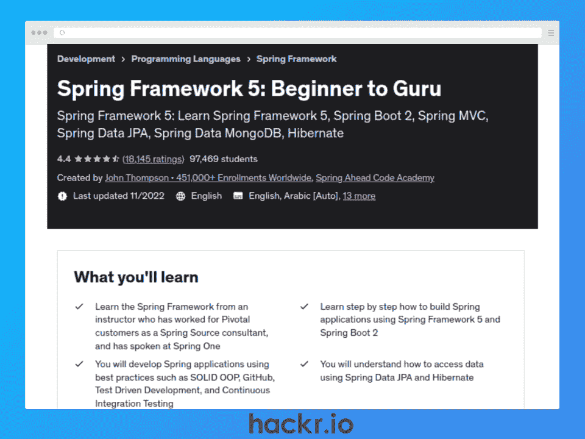
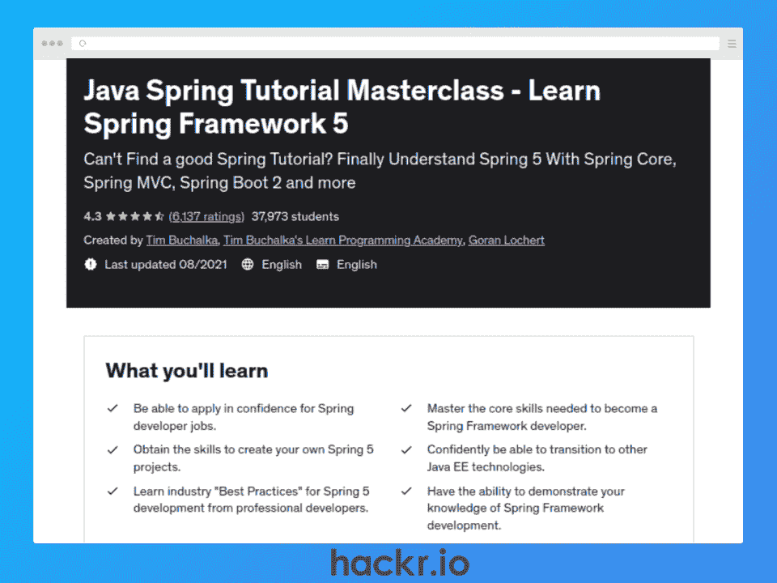
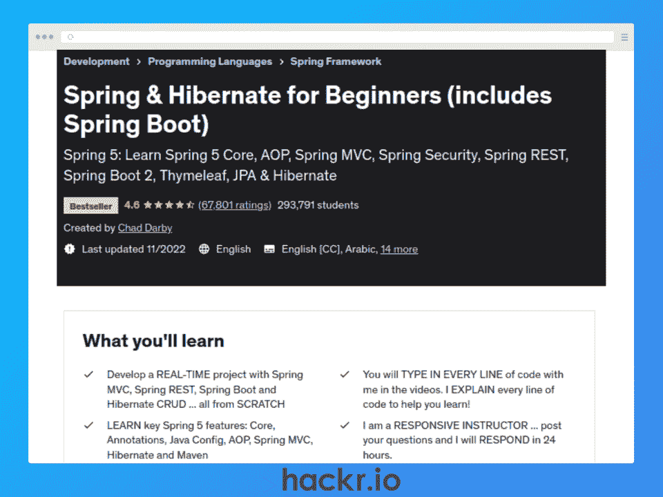
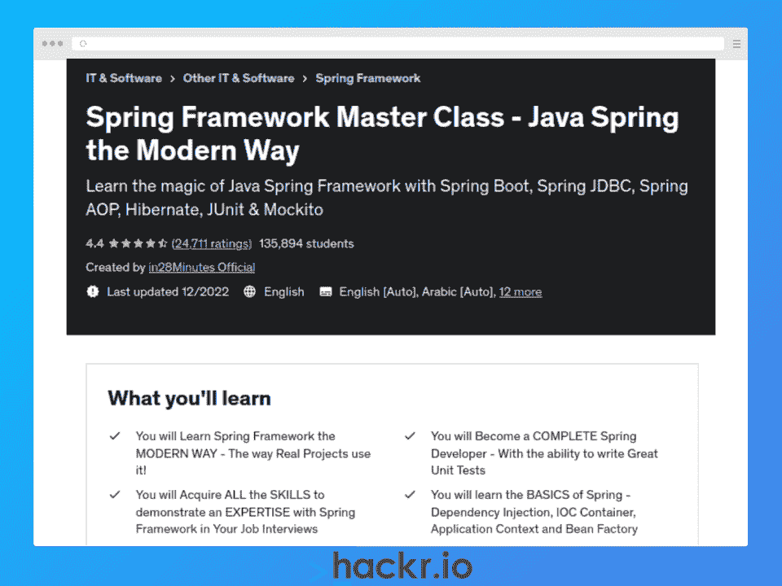
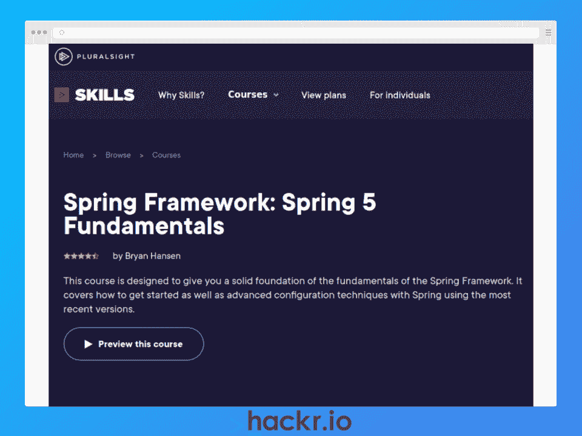
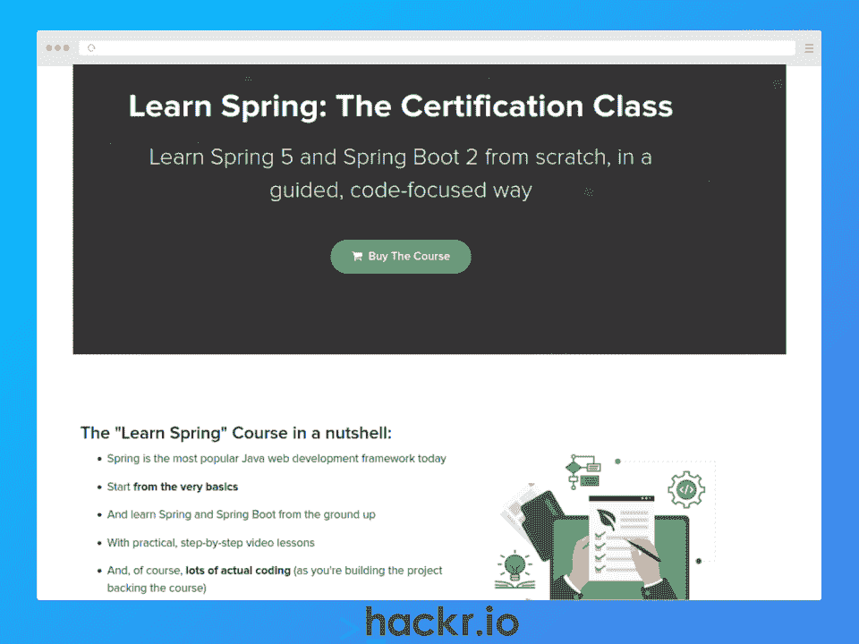
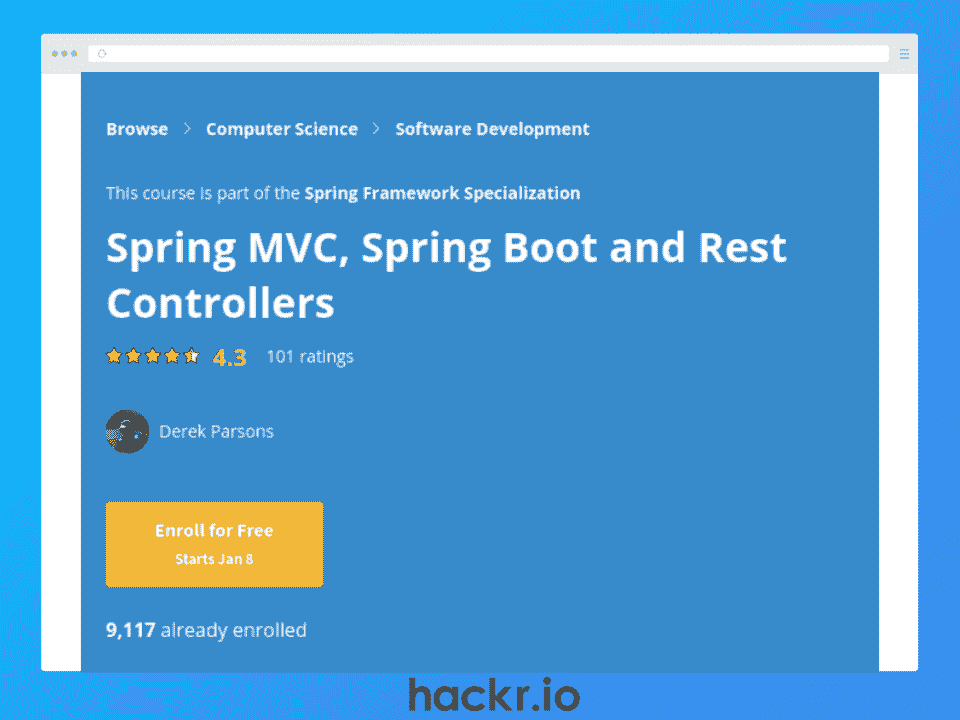
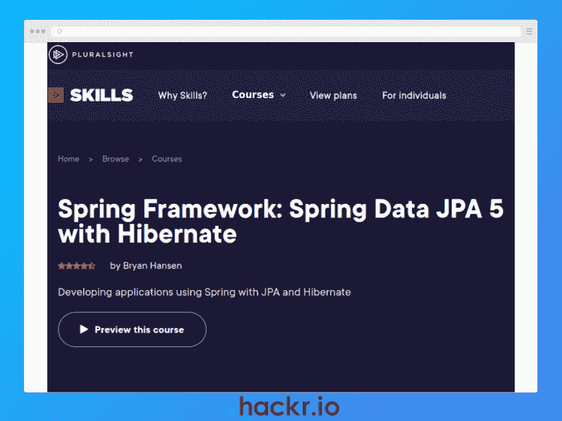
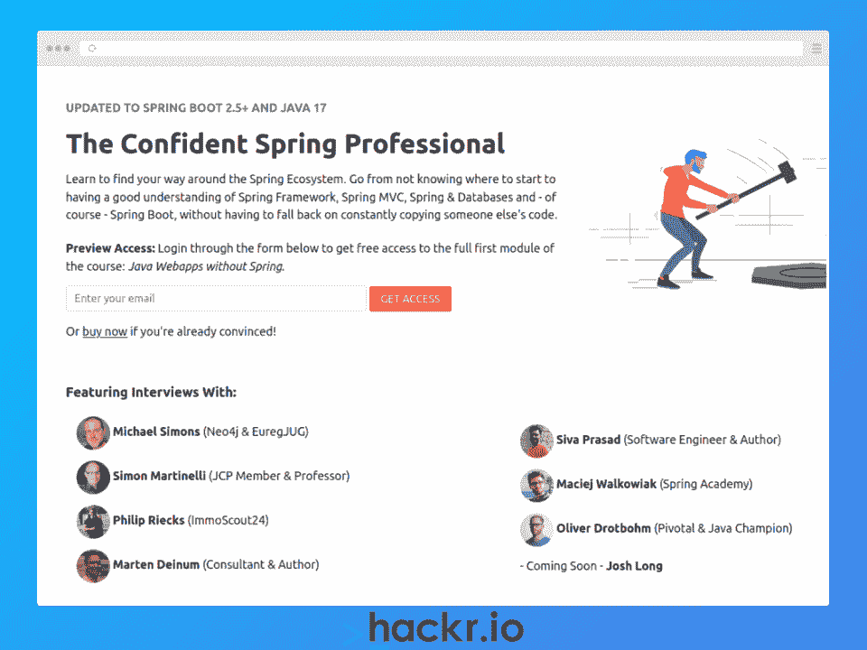
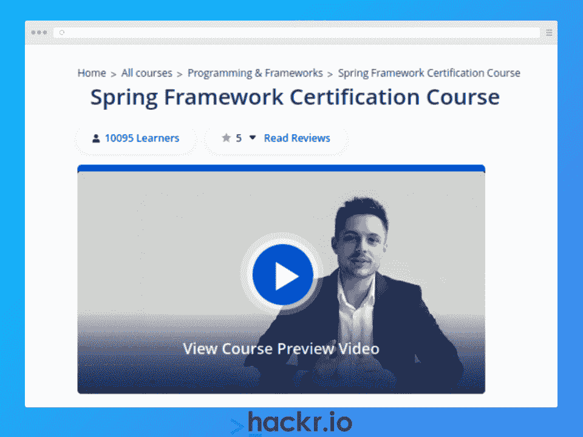

# 10 门最佳 Spring 在线课程:2023 年学习 Spring 框架

> 原文：<https://hackr.io/blog/best-spring-courses>

Spring 框架(或者仅仅是 Spring)是一个开源的 Java 框架，由 Rod Johnson 编写并于 2003 年发布。

在其核心，Spring 是一个*依赖注入*容器和*应用上下文管理器*以及众多*便利*层，包括数据库访问、web MVC 框架、代理等等。

Spring 开发人员可以为任何类型的 Java 应用程序构建高性能、可测试和可重用的代码，包括通过 Jakarta EE(以前的 Java EE)的 web 应用程序。Spring 还允许开发人员专注于应用程序而不是基础设施。

如果你是一个想学习 Spring 的 Java 开发人员，或者是一个有抱负的开发人员，正在寻找 2023 年最受欢迎的技能，Spring 是一个可靠的选择，Spring 开发人员的平均年薪[接近 90，000 美元。](https://www.glassdoor.com/Salaries/java-spring-developer-salary-SRCH_KO0,21.htm)

为了帮助你，我们找到了 2023 年 10 个最好的春季课程，从初学者到有经验的开发者都有。

**特色春季课程【编辑推荐】**

## **选择最佳春季课程**

为了帮助您找到最佳的 Spring 框架培训，我们使用了以下标准。

*   **指导老师:**他们作为老师和行业专业人士的经验如何？他们被以前的学生评价很高或评论过吗？
*   **内容:**课程内容有多详细、有多相关、有多吸引人？它是否涵盖了作为一名 Spring 开发人员克服现实挑战所需的主题？以前的学生推荐这门课程吗？
*   **社区:**有多少人上过这门课？如果你需要帮助，很容易找到吗？

## **2023 年 10 大最佳春季课程**

在我们深入研究 2023 年 10 门最佳春季课程之前，我们整理了一份汇总表，向您展示了我们列表中每门课程的难度。

**想补充你的春季学习？看一看:**

**[十大最佳春季框架书籍](https://hackr.io/blog/spring-books)**

**[了解更多](https://click.linksynergy.com/deeplink?id=xLhRGGPIZ24&mid=39197&murl=https%3A%2F%2Fwww.udemy.com%2Fcourse%2Fspring-framework-5-beginner-to-guru%2F)**

**我们为什么选择本课程**

这个春季在线培训是初学者通过用 Spring 5 和 Spring Boot 2 构建应用程序来学习现实世界技能的绝佳方式。

您将学习使用面向对象、测试驱动开发(TDD)、持续集成(CI)的坚实原则，在 Docker 容器中运行 Spring Boot 应用程序，使用 Spring Data JPA & Hibernate，以及使用 Spring MVC 创建 web 应用程序。

最后，您还将使用 MongoDB (NoSQL)构建一个*响应式*端到端应用程序，这将是您投资组合中的一大亮点。

**优点**

*   供未来参考的 Spring Boot 食谱
*   GitHub 源代码
*   IntelliJ IDEA Ultimate IDE 的 4 个月试用期
*   私人闲置社区

**缺点**

*   在某些视频中，复制粘贴与实时编码相对比

**关键信息**

**先决条件:【Java 基础知识，有助于了解 HTML & SQL**

**指导老师:**约翰·汤姆逊

**等级:**初学者

**证书:**是

**时长:** 57 小时点播视频

**[了解更多](https://click.linksynergy.com/deeplink?id=jU79Zysihs4&mid=39197&murl=https%3A%2F%2Fwww.udemy.com%2Fcourse%2Fjava-spring-framework-masterclass%2F)**

**我们为什么选择本课程**

这个 Spring 在线课程强调 Spring 框架中影响最大的领域，比如 Spring Core、Spring MVC 和 Spring Boot 新协议。有了这些技能，您将能够创建独立的应用程序和 web 应用程序，这是 Spring 开发人员最常见的两项任务。

使用最新的 Spring 5，您将学习现实世界的专业人员使用的最佳实践，了解核心 Spring 技术，并了解 Spring 如何适应企业空间(Jakarta EE 或以前的 Java EE)。

**优点**

*   详细内容
*   百里香叶和梅文的额外训练
*   有专业经验的受人尊敬的教师
*   快速响应支持和查询

**缺点**

*   存档内容很有帮助，但作为特定主题的第一参考点已经过时

**关键信息**

**先决条件:【Java 基础知识**

教练:蒂姆·布查尔卡和戈兰·洛切特

**等级:**初学者

**证书:**是

**时长:** 45 小时点播视频

**[了解更多](https://click.linksynergy.com/deeplink?id=jU79Zysihs4&mid=39197&murl=https%3A%2F%2Fwww.udemy.com%2Fspring-hibernate-tutorial%2F)**

**我们为什么选择本课程**

通过这次 Java Spring 培训，您将通过手动输入源代码来了解 Spring、Spring Boot 和 Hibernate 的最新版本。这是一个极好的方法，通过将基础知识融入大脑来确保你从学习中获得最大收益。

您将了解 Spring Core、Hibernate、Spring Boot 2、Spring MVC、Maven、Spring Data 和百里香叶。您还可以使用 Spring MVC、Spring REST、Spring Boot 和 Hibernate 从头开始创建一个实时 Spring 项目。

如果你被卡住了，教练会在 24 小时内回复你。

**优点**

*   全面的最新课程
*   技能娴熟、反应敏捷的讲师
*   可下载的源代码

**缺点**

*   强调实践，意味着在潜在有用的理论上花费更少的时间

**关键信息**

**先决条件:**基础 Java & HTML 知识

教官:查德·达比

**等级:**初学者

**证书:**是

**时长:** 41 小时点播视频

**[了解更多](https://click.linksynergy.com/deeplink?id=xLhRGGPIZ24&mid=39197&murl=https%3A%2F%2Fwww.udemy.com%2Fcourse%2Fspring-tutorial-for-beginners%2F)**

**我们为什么选择本课程**

如果您正在寻找一个更短的 Spring 框架课程，通过实际例子来学习基础知识，这是一个可靠的选择。在进入 Spring 的关键特性(依赖注入、应用程序上下文等)之前，您将设置 Eclipse IDE。)，Spring Boot，Spring MVC，以及最有用的 Spring 模块。

您还将通过 JUnit 了解单元测试，通过 Spring JBDC & JPA 了解数据库通信，通过 Maven 了解依赖性管理。

**优点**

*   循序渐进的方法对初学者来说很容易掌握
*   专注于应用程序的结构良好的内容

**缺点:**

*   缺乏深度可能会使某些概念对初学者具有挑战性

**关键信息**

**先决条件:【Java 基础知识**

**指导老师:** Ranga Karanam(从 28 分钟开始)

**等级:**初学者

**证书:**是

**时长:** 12.5 小时点播视频

**[了解更多](https://pluralsight.pxf.io/LPJkxL)**

**我们为什么选择本课程**

如果你正在寻找一个春季速成班，这个可能适合你！在不到 3 个小时的时间里，您可以快速学习 Spring 基础知识，包括如何构建和配置应用程序，什么是依赖注入，如何使用自动连接，以及如何使用高级 bean 配置。

完成后，您应该能够使用 Spring 构建基本的应用程序，甚至可以将一些旧代码转换成 Spring 应用程序。

**优点**

*   结构良好且高度集中的内容
*   高质量课程材料

**缺点**

*   超级短，所以不能取代完整的培训课程

**关键信息**

**先决条件:【Java 基础知识**

教练:布莱恩·汉森

**等级:**初学者

**证书:**是

**持续时间:** 2h 27m

**[了解更多](https://courses.baeldung.com/p/ls-certification-class)**

**我们为什么选择本课程**

这个综合课程包括 9 个模块，侧重于 Spring 5 和 Spring Boot 2 的核心方面，包括依赖注入、Spring 数据 JPA、Spring MVC、Spring AOP、反应式应用、REST APIs 等等。

当你完成后，你将能够使用 Spring 来构建应用程序，这就是它的全部！

通过强调实践教学，你将做大量的编码工作，并吸收关键信息和技能。你将从基础开始，然后逐渐增加更多的技能，因为你建立了一个顶点项目，你可以添加到你的投资组合。

**优点**

*   面向初学者的综合内容
*   实践方法
*   投资组合的顶点项目

**缺点**

*   针对初学者，所以缺乏深入的理论

**关键信息**

**先决条件:【Java 基础知识**

**讲师:**eugen paras ev

**等级:**初学者

**证书:**是

**持续时间:** ~22 小时

**[了解更多](https://coursera.pxf.io/c/3294490/1164545/14726?u=https%3A%2F%2Fwww.coursera.org%2Flearn%2Fspring-mvc-rest-controller)**

**我们为什么选择本课程**

如果你是一名经验丰富的 Java 开发人员，Coursera 的这个产品是学习如何使用 Spring 创建 Java web 应用或 RESTful 微服务的好方法。

作为更广泛的 Coursera Spring 框架专业化的一部分，它包括三个实践模块，教你如何使用 Spring MVC 和 Spring Boot 创建带有 URL 模板、自定义 HTTP 头和 JSON 或 XML 有效负载的 RESTful 微服务。您还将创建具有模型视图控制器(MVC)架构的 web 应用程序。

**优点**

*   分级作业和测验
*   自定进度学习
*   更广泛的 Spring Framework 专门化方向的一部分

**缺点**

*   课程结构可以改进&包含一些错别字

**关键信息**

**先决条件:** Java 经验

讲师:德里克·帕森斯

**等级:**中级

**证书:**是

**持续时间:** 12 小时

**[了解更多](https://pluralsight.pxf.io/Zd2Wyq)**

**我们为什么选择本课程**

如果您已经有 Java 经验和 Spring MVC 的基本背景，这是获得 Spring JPA 和 Hibernate 技能的一个结构良好的快速方法。

只需 3 个小时，您将获得 Spring JPA、JPA 应用程序架构、JPA 配置、JPA 注释等内容的速成课程。

**优点**

*   结构良好且高度集中的内容
*   高质量课程材料

**缺点**

*   实际关注 JPA 数据持久性，而不是深入理论

**关键信息**

**先决条件:** Java 编程，Spring MVC

教练:布莱恩·汉森

**等级:**中级

**证书:**是

**持续时间:** 2h 59m

**[了解更多](https://www.marcobehler.com/courses/spring-professional)**

**我们为什么选择本课程**

如果您想要真正全面地了解 Spring 框架和一般的 Spring 生态系统，这是一条必经之路。

通过一个渐进的和反向的学习序列，您将学习使用 Spring 以某种方式做什么、如何做以及为什么做，所有这些都是通过一种实践的方法。

本课程包括关于 Spring Boot、Spring MVC、Maven、控制反转和依赖注入、使用 JSON 和 XML 的 REST 服务、如何构建 Java web apps 和服务器端内容、数据库访问等详细内容。

**优点**

*   完整的课程，以相反的顺序进行，以加强理解
*   详细的代码示例和解释
*   学习练习和解决方案

**缺点**

*   如果教师有问题，您可能需要耐心

**关键信息**

**先决条件:**具有 Java(或类似 Kotlin 等 JVM 语言)编程经验。)

教练:马尔科·贝勒

**级别:**所有级别

**证书:**是

**持续时间:**10-20 小时

**[了解更多](https://click.linksynergy.com/deeplink?id=xLhRGGPIZ24&mid=42536&murl=https%3A%2F%2Fwww.edureka.co%2Fspring-certification-course&LSNSUBSITE=LSNSUBSITE)**

**我们为什么选择本课程**

如果您喜欢一个实时的、交互式的学习环境，那么这就是适合您的 Java Spring 课程！这个 Edureka 课程是为任何具有基本 Java 和数据库知识的人设计的，它旨在通过让你创建真实世界的 web 应用程序，使你成为 Spring 框架专家，这是增强你的投资组合的一个极好的方法。

通过完成本课程，您将对 Spring 框架架构、依赖注入、Maven、面向方面编程(AOP)、Spring MVC、单元测试、安全性等有一个坚实的理解。您还将学习如何配置 Spring 框架，以及如何使用 Spring Core 和 Hibernate 与数据库进行交互。

**优点**

*   现场讲师指导课程和按需跟进
*   构建 Twitter 集成应用和书评应用
*   行业认可的证书

**缺点**

*   不包括 Spring Boot

**关键信息**

**先决条件:**基础 Java &数据库知识

**指导老师:**爱德华卡指导老师

**级别:**所有级别

**证书:**是

**持续时间:** 24 小时(周末班:4 周 8 节 3 小时课程)

## **结论**

通过使用 Spring 框架，开发人员可以更轻松、更快速地构建高性能的 Java 应用程序。随着 Spring 开发者带来近 90，000 美元的平均工资，Spring 技能在 2023 年大受欢迎也就不足为奇了。

本文涵盖了 2023 年 10 个最好的春季在线课程，从为有经验的开发人员提供的短期强化课程到为完全初学者提供的综合课程。因此，无论您目前的技能水平如何，都有一门课程可供您学习 Spring 框架。

**想找一份 Spring 开发者的工作吗？接下来读这个:**

**[最佳春季面试问题&答案](https://hackr.io/blog/spring-interview-questions)**

## **常见问题解答**

#### **1。什么是春季课程？**

Spring 课程是教学材料的混合体，包括理论和实践练习，您可以使用它们来了解 Spring 框架，包括如何使用这些技能来构建一系列 Java 应用程序。

#### **2。怎样才能免费学习 Spring？**

你可以选择免费试用我们名单上的付费课程提供商，让你在决定是否做出财务承诺之前先磨磨你的胃口。

否则，你可以在 YouTube、GitHub 或 Google 上搜索免费的 Spring framework 初学者教程，然后尝试“边做边学”。有时候，没有什么比陷入一个小项目来学习新技能更好的了！

#### **3。没有 Java 可以学 Spring 吗？**

如果没有 Java，开始学习 Spring framework 是不可能的，因为它是为创建 Java 应用程序而设计的。当然，您可以使用其他 JVM 语言，比如 Kotlin 或 Scala，但是要学习 Spring，Java 是必不可少的。