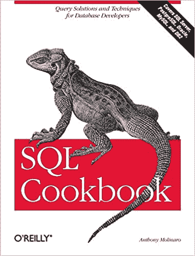
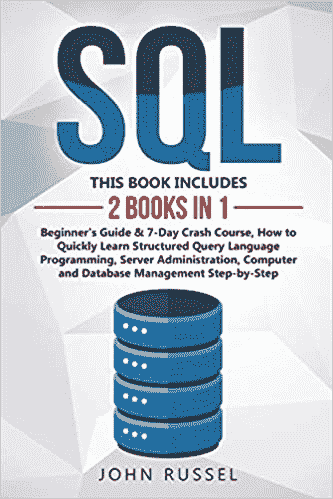
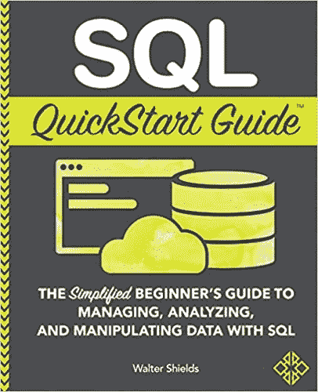
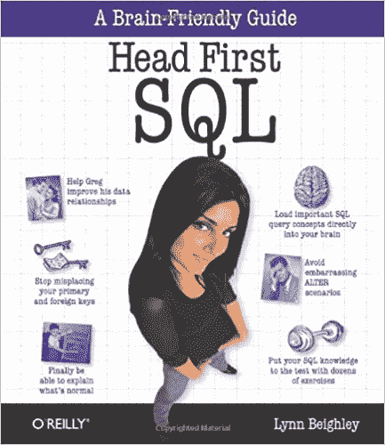
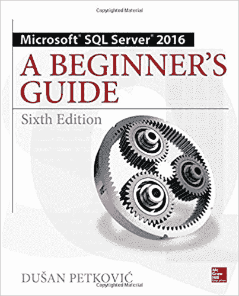
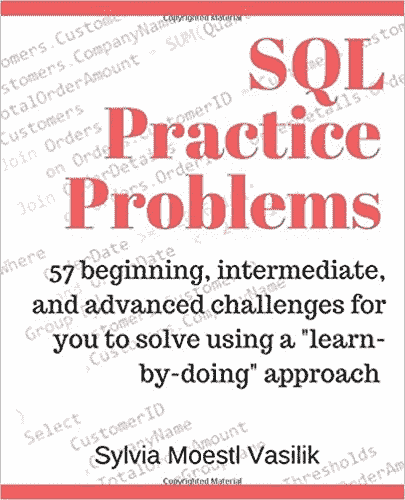
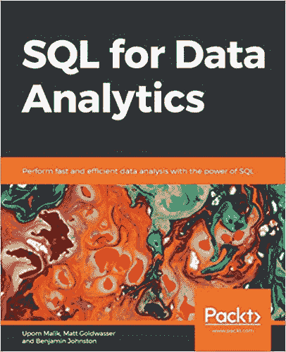
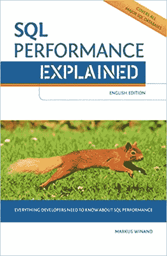
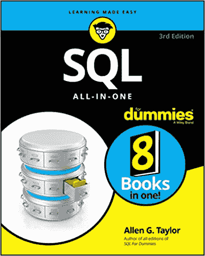
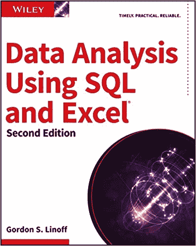

# 初学者和高级程序员的 10 本最佳 SQL 书籍[排名]

> 原文：<https://hackr.io/blog/best-sql-books>

无论您是全栈开发人员还是数据科学爱好者，在职业生涯的某个时刻，您都必须与 SQL 握手。SQL 将帮助您快速分析数据，编写查询来准备、过滤、排序、有效地组织数据，等等。

学习 SQL 的最好方法是实践，还有什么比读书和工作更好的方法呢？这就是为什么我们挑选了十大 SQL 书籍来帮助你从零开始学习 SQL。我们为初级、中级和高级 SQL 用户提供了很好的书籍组合，还有专门满足数据科学需求的书籍。

## 最佳 SQL 书籍

你可能会看到很多最好的 SQL 书籍，声称可以帮助你在 10 分钟或 10 天内学会 SQL——但是如果你想获得生活的概念——没有捷径！

 如果你刚开始使用 SQL，对选择、更新和插入查询有基本的了解，但没有时间深入了解所有概念，这本书是一个很好的参考。这本书涵盖了基本的选择、更新和插入查询，但就像一个速成班。作者假设你已经有了一些 SQL 的背景知识(这就是这本食谱的目的)。它更侧重于编写复杂的查询、优化查询、数据准备、操作、分组和报告。这本书对初学者和中级学习者都有好处。作者提出了许多问题，作为你在现实生活中会遇到的例子。使用它作为快速参考来查找与您在项目中面临的问题类似的查询。从阅读序言开始，如果你想进入基础，在你开始探索这本书之前，先浏览一下附录。

你可以在这里买到这本书。

 这本书将从头开始教授你想知道的关于 SQL 的一切——不仅仅是编写查询，还包括理解 SQL 的重要性以及它如何帮助端到端的项目执行和报告。对于数据分析师和数据科学家来说，这是一个很好的参考，因为它涵盖了重要的统计分析主题。当你读到第 5 章及以上时，主题的复杂性会慢慢增加。作者举了足够多的例子让你很好地理解这些概念。在整本书中，你将能够描绘出整个 RDBMS 是如何工作的，SQL 在基于客户机-服务器系统中的作用，以及保持数据安全。如果你有时间和好奇心去学习 SQL 的 A 到 Z，这是一本合适的入门书。

你可以在这里买到这本书。

 这本书的作者呈现了一种很棒的写作风格——非常友好且易于理解的语气。作者还鼓励你尝试新事物，并在学习的过程中大量练习。有了这本书，学习 SQL 将变得轻而易举。这本书迎合初学者以及那些在数据分析领域，并解决了许多与数据操作和分析有关的问题。如果你有 SQL 的工作知识，这本书可以作为一个方便的指南来增强你的知识。在任何需要的地方，作者解释技术术语并且在最初几章从基本术语开始。这为进一步学习 SQL 打下了坚实的基础。从基础到高级的概念流程是无缝的。

你可以在这里买到这本书。

**建议课程**

[完整的 SQL Bootcamp 2023:从零到英雄](https://click.linksynergy.com/deeplink?id=jU79Zysihs4&mid=39197&murl=https%3A%2F%2Fwww.udemy.com%2Fcourse%2Fthe-complete-sql-bootcamp%2F)

 如果你曾经读过 Head First 的书，你会知道它们是多么的机智、互动和丰富。有很多快速提示和图片可以帮助你记住重要的细节。您将特别喜欢作者解释连接的方式——简洁明了。这本书遵循一种独特的方法，你将学到解决问题的方法——这可能导致另一个问题，可以用另一种方法解决。这有助于很好地记住概念，但是你需要花时间去学习每一种方法。这就好像您在监督下探索 SQL 的各个部分。这本书是快节奏的，所以有时你可能认为你已经得到了概念，但它可能不是这样。在进入下一章之前，花点时间去理解每个概念并多练习。

你可以在这里买到这本书。

 你可以认为这本书适合初级到中级 SQL 学习者。这本书向您介绍 RDBMS，并带您逐步完成安装、设置和基本的故障排除。这是一本纯技术性的书，你不应该把它作为快速参考，而是为了详细的学习目的。本书的最后一部分还向您介绍了空间数据、XML 和 JSON 的概念，以及它们如何适应数据库系统。对于开发人员、技术分析师和数据库管理员来说，这是一本很棒的书。它还深入介绍了数据安全性、性能调优、报告服务和各种优化技术。技术极客的必备书籍。

你可以在这里买到这本书。

 这本书适合能够编写基本的选择、插入、更新和删除查询的开发人员和商业专业人员。它就像是你已经知道的知识的复习课程，加上一些更高级的问题来进一步挑战你。如果你正在寻找一个适当的循序渐进的教程，这不是正确的书。如果您想快速进入解决现实世界问题的工作模式，这是再合适不过的了。这本书通过揭示每个给定问题的预期答案来帮助你得到正确的答案。这样，你可以用自己的速度敲打你的大脑，直到你把事情做对。这本书不会填鸭式地教你。你将需要其他在线资源，如[在线课程](https://hackr.io/tutorials/learn-sql?q=SQL)，并在练习本书中的问题时阅读其他来源的概念。通过这本书，您将很好地理解如何使用 SQL 来解决实际的业务问题，同时以自然的流程浏览概念。

你可以在这里买到这本书。

 一本适合 SQL 初学者和高级水平学习者的好书。这本书不太重，但有许多实例。作者选择的语气相当友好舒缓，感觉就像是一个导师在跟你说话，讲解概念。如果你正在学习数据科学的 SQL，你可以从这本书中学到很多。涵盖的概念范围很广，从基本的选择到复杂的窗口函数。作为一名数据科学家，通过参考这本书，您会发现许多有用的技巧来优化查询，以准备、提取和操作大型数据集。无论你需要快速指南还是结构化学习书籍，这本书都适合。这本书还涵盖了 R 和 Python 如何与数据库集成的基础知识。作者重点介绍了使用复杂数据类型进行分析、微调查询以获得最佳性能，并提供了一个很好的案例研究来帮助您可视化端到端数据分析过程。

你可以在这里买到这本书。

 这本书内容丰富，深入涵盖了所有 PL/SQL 主题。您应该对查询和脚本有一个基本的了解，才能充分使用这本书。有时，会提供一些没有教授过的概念的例子——但是你可以从其他资源中查找，比如[博客](https://hackr.io/blog/sql-commands)、教程和 YouTube 视频短片。然而，大多数时候，这本书对于学习基础和高级概念都是足够的。这本书的作者似乎已经完全理解了一个开发人员是如何思考的，当你阅读的时候，只要你有疑问——它就会在下一行或下一页被清除！许多概念都用现实世界的例子来解释，以创造一个实用的心态。一本适合中高级 SQL 开发人员学习 PL/SQL 编程的好书。

你可以在这里买到这本书。

 “傻瓜书”总是一本好书，因为这些书不需要你事先了解书中的主题。这本书从 RDBMS 的重要性开始，SQL 适合于 RDBMS，然后解释查询、数据安全性、性能调优以及更多关于 XML 和 JSON 的内容。这本书触及了所有重要的 SQL 概念，但没有涉及太多细节。如果您刚刚开始您的 SQL 之旅，或者您偶尔在工作中使用 SQL，这将是一本不错的入门书籍。它会让你感到舒适，但不会用太多的概念吓到你或让你不知所措。适量的信息和代码使这本书成为 SQL 初学者的理想起点。如果你足够好奇，你也可以用其他更深入的书来补充这本书。

你可以在这里买到这本书。

 SQL 和 Excel 已经被证明是最强大的数据分析工具。这本书不仅仅是关于学习基本的查询，比如选择、更新等等，更多的是以数据科学为中心。本质上，它侧重于帮助您编写复杂的查询来操作来自大型数据集或数据库的数据。开始的时候看起来有点难理解，但是一旦你理解了作者的解释风格，你会发现这些概念变得清晰了。如果您在分析中使用了大量的 SQL，那么关于数据挖掘模型的章节将会非常激动人心并且非常有用。作者很好地解释了 SQL 的作用，并擅长创建各种机器学习模型。到本书结束时，你将能够编写复杂的查询，也是高性能的。两章之间的提示和警告相当有见地。通过这本书享受 SQL 和 excel 的数据提取、数据流和数据可视化的全部风味。

你可以在这里买到这本书。

## **奖励 SQL 书籍**

虽然上述书籍非常好，并且对于大多数 SQL 用户(初级或高级)来说基本上足够了，但这里还有两本额外的书籍，您可能想拥有它们作为详细的学习和参考

这是一本非常详尽的书，从头开始教你 SQL。你会在每个技术图书馆找到这本书——这是一个非常有价值的资源。如果您作为开发人员或数据科学家广泛使用 SQL，您应该阅读这本书。它帮助您理解为什么某些查询会有这样的行为，如何编写复杂的查询来提供良好的性能和事务、锁以及您可能想知道的最小概念的深入信息。这本书的组织方式非常好，结构严谨，所以作为快速参考，更容易找到你要找的东西。这本书还谈到了 SQL APIs、PL/SQL、应用服务器和网络。它帮助您详细地描绘出整个 web 应用程序是如何工作的。这是一个缓慢的阅读，但值得。

你可以在这里买到这本书。

这是一本纯技术性的书，如果你想了解如何提高查询性能的一切，你会喜欢的。您会发现 SQL 不仅仅是编写查询和存储过程。作者简明扼要地解释了每个解决方案。书中流畅地解释了不同数据库 Oracle、MySQL、SQL Server、PostgreSQL 的区别，不拘泥于其中任何一个。如果你想成为索引、扫描、连接、集群和其他重要的性能相关概念的大师，这本书是必不可少的。

你可以在这里买到这本书。

## **结论**

如果你不知道先从哪本书开始，就从 SQL 初学者指南或 SQL for dummies 的基本概念开始。如果您有 SQL 的工作知识，并且想要磨练您的技能或者需要书籍作为快速参考，您可能想要购买 SQL Cookbook 或 SQL Practice Problems(或者两者都要)。Oracle PL/SQL 编程将帮助您编写脚本和更高级的 SQL 查询。相比之下,《SQL for data analytics》和《使用 SQL 和 Excel 进行数据分析》是为数据分析师编写的，尽管许多有经验的开发人员也觉得这些书很有用。旁边有 [SQL 备忘单](https://hackr.io/blog/sql-cheat-sheet)将帮助你在阅读更高级的概念时快速查阅命令。

**人也在读:**