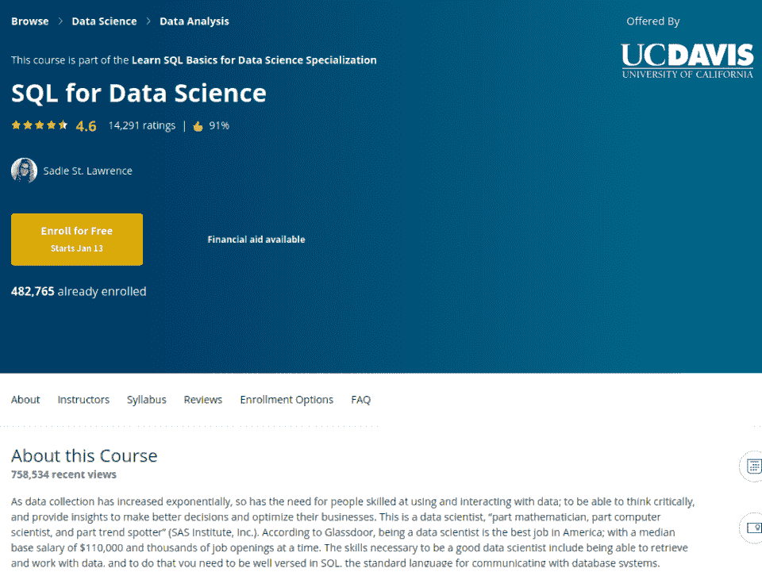
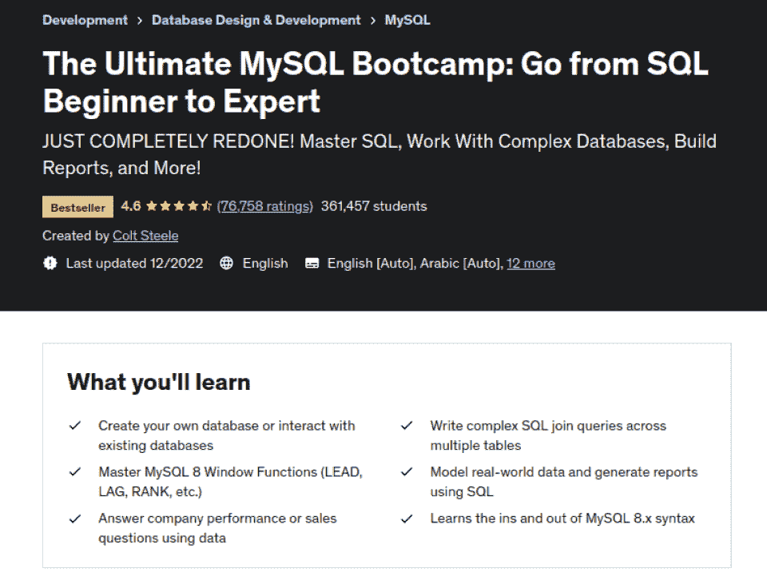
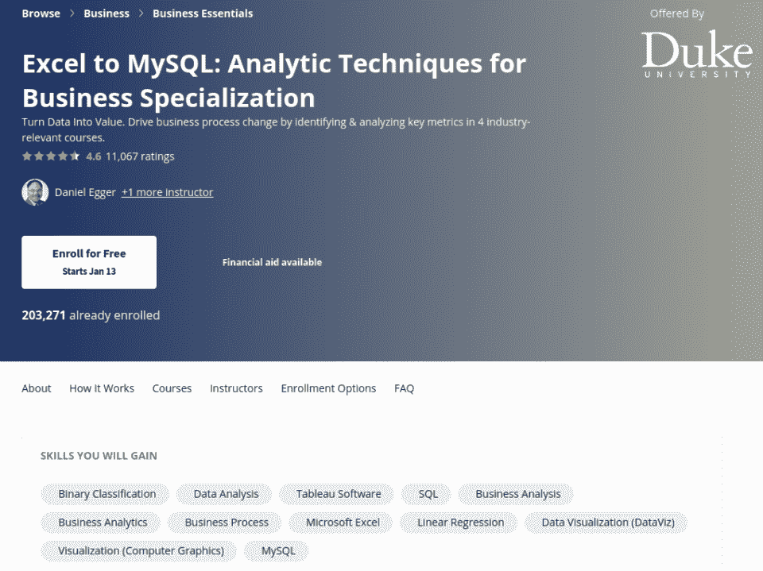
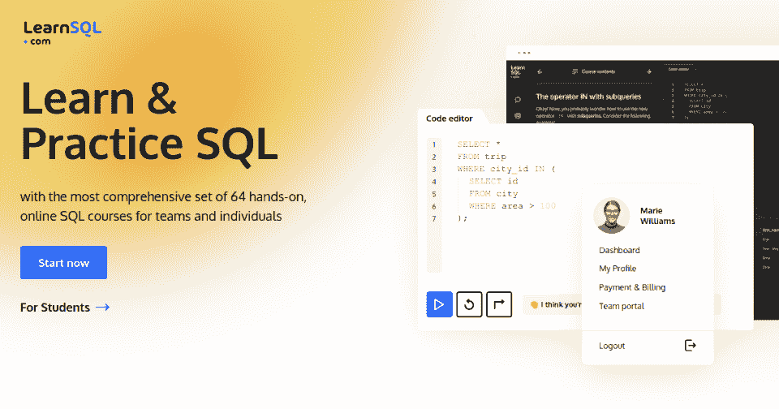
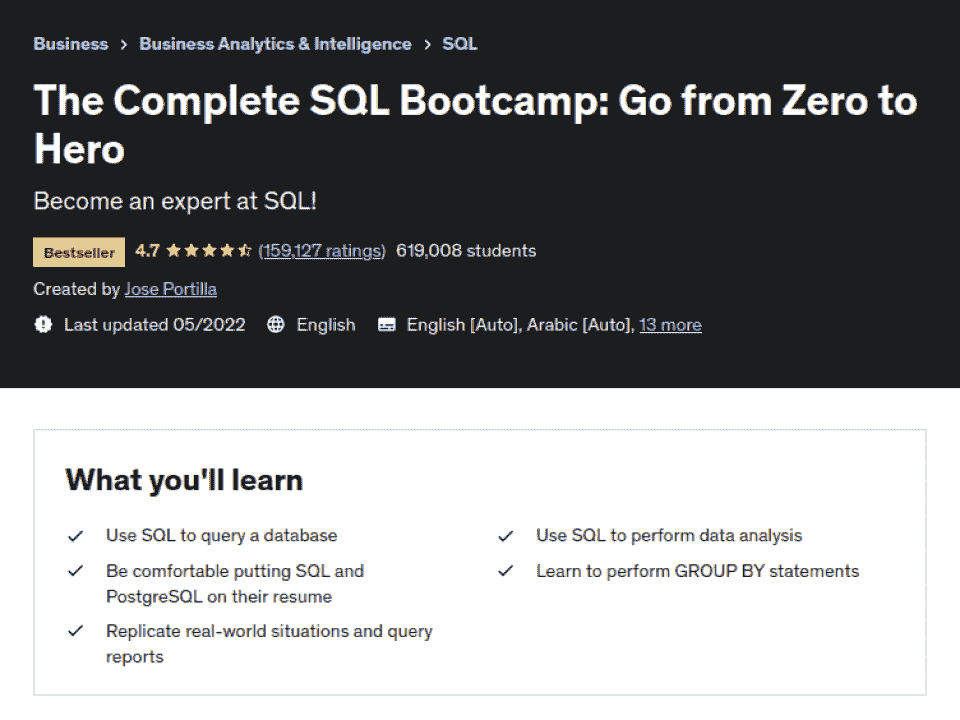
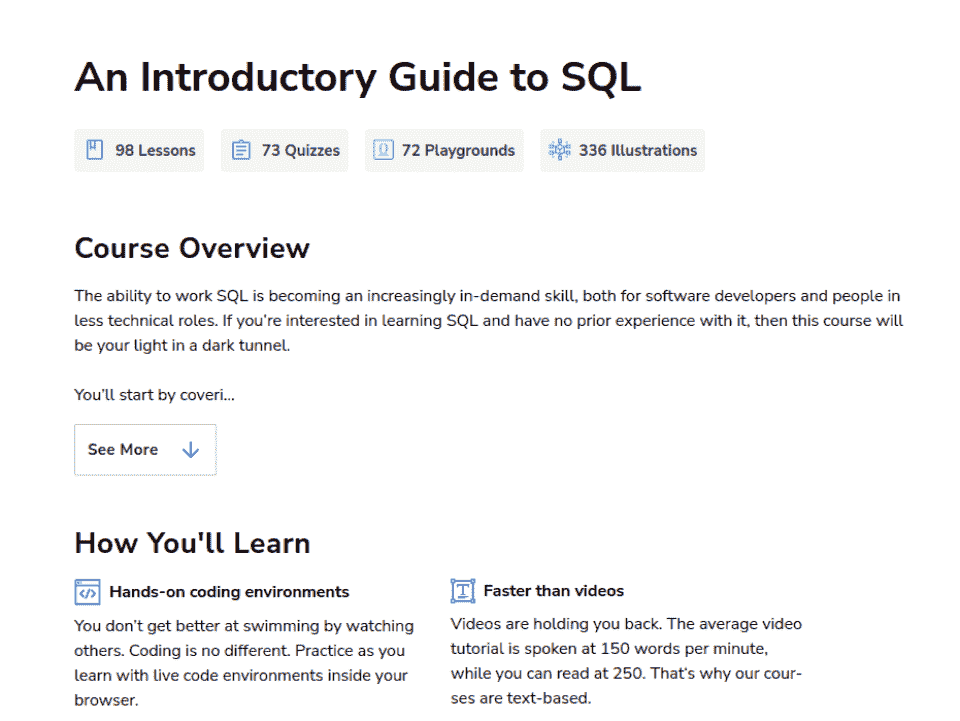
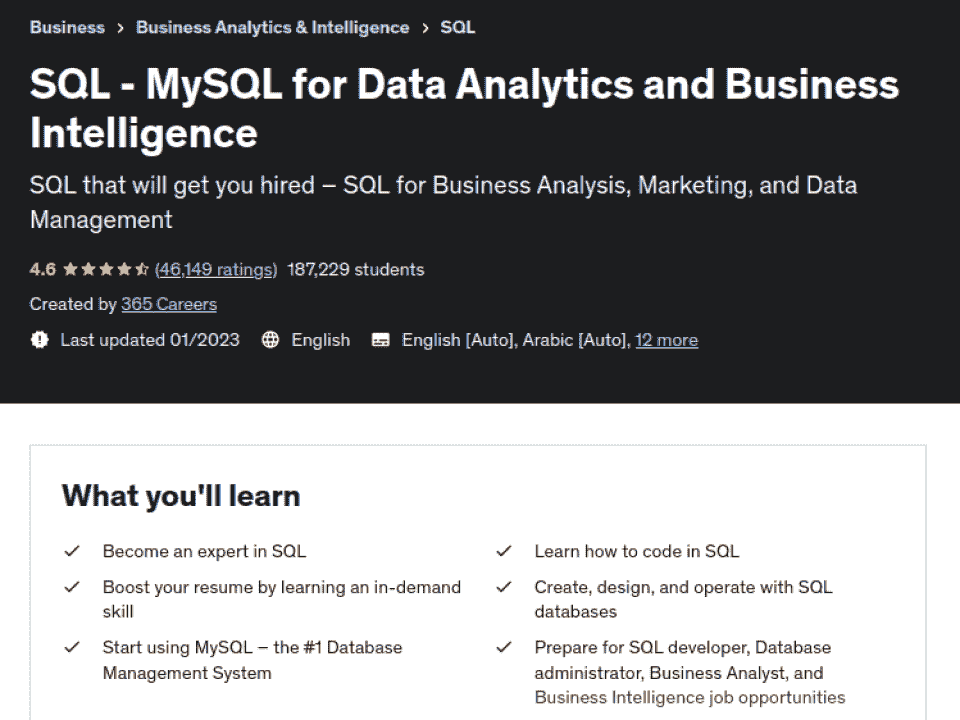
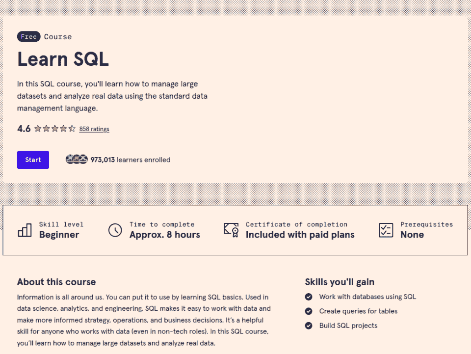
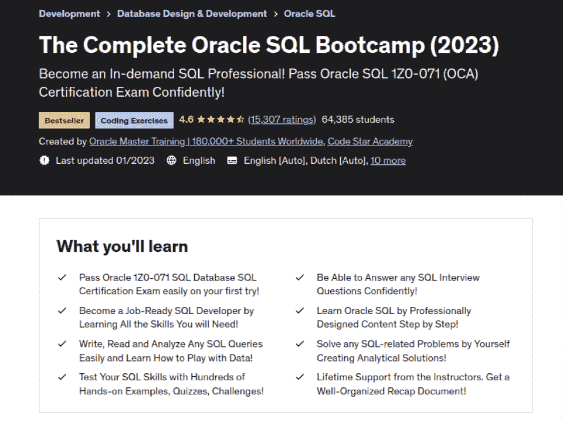
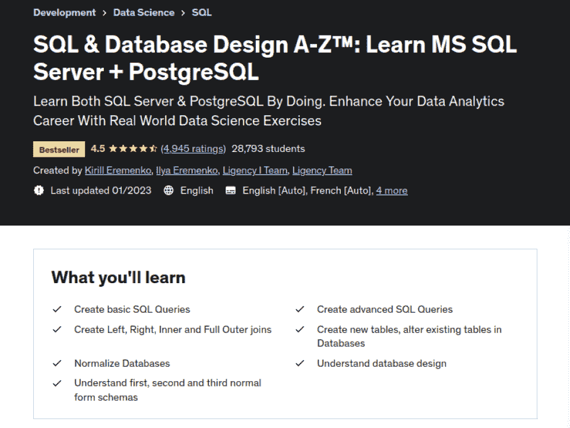

# 2023 年最适合初学者的 10 门 SQL 课程【免费+付费】

> 原文：<https://hackr.io/blog/best-sql-courses>

随着我们步入 2023 年，数据对于各种规模的企业的重要性不断增加，因为它通常是提高效率、利润和其他组织效益的巨大潜力的来源。

大多数数据集的核心是关系数据库，它通常依赖于 SQL(结构化查询语言)。

如果你是一名有志于成为数据库管理员、数据分析师、数据科学家、数据工程师等等的数据驱动型专业人士，SQL 对于处理数据是必不可少的。如果你想最大化你的市场潜力，你可以考虑带证书的 SQL 在线课程。

由于有数百种选择，找到有优秀教程的平台可能会很困难。这就是为什么我们在网上列出了 10 大 SQL 课程，包括帮助您选择最适合您需求的 SQL 课程的要点！

**特色 SQL 课程【编辑推荐】**

## **为什么要学习 SQL？**

SQL 是一种强大的语言，世界各地的企业都使用它来高效地查询和操作数据库中的数据。

如果你想在专注于数据的技术领域谋得一个职位，特别是如果你打算从事关系数据库的工作，那么学习 SQL 编程有几个好处来管理 SQL 数据库。

*   **数据库访问&操作:** 创建、读取、更新和删除数据(CRUD)是任何数据专业人员的核心数据库技能。SQL 使这些操作变得快速而高效。
*   **数据分析:** 创建和运行简单和复杂的查询可以帮助你发现有价值的见解或趋势。例如，可以分析客户偏好或购买习惯，以帮助您定制营销策略。
*   **可转移的技能:** 理解 SQL 可以成为学习如何使用和操作 NoSQL 数据库的有价值的敲门砖，这些数据库越来越受欢迎。
*   **就业机会:** 参加 SQL 在线训练营或参加 SQL 编程课程可以让你掌握数据库设计和 SQL 查询优化方面的技术知识。这些技能可以在数据科学、分析、软件工程、web 开发等领域开辟一系列新的职位。

你已经在申请 SQL 工作了吗？确保你学习了 [**顶级 SQL 面试题**](https://hackr.io/blog/top-sql-interview-questions)

## **选择最佳 SQL 在线课程**

为了帮助您找到最好的 SQL 在线课程和学习 SQL 的最佳地点，我们在编制清单时考虑了一系列关键因素。

*   **课程材料:** 是否结构良好，是否包含最新的视频内容？
*   指导老师: 他们有相关的证书和经验吗？
*   实用性:SQL 教程关注的是实际应用而不是理论吗？
*   支持: 是否包括某种形式的导师或社区支持？
*   **认证:** 你的简历有完成认证吗？

## **2023 年 10 大最佳 SQL 在线课程**

****

**[了解更多](https://imp.i384100.net/QOXA9a?subId3=blog%2Fbest-sql-courses_amcid-OmJIgerEQEQeFJxMrAQPo)**

**我们为什么选择本课程**

准备好开始学习 SQL 基础知识了吗？这是初学者最好的在线 SQL 课程之一。该课程假定您没有 SQL 知识，主要是一个数据科学专业，帮助您从数据科学的 SQL 开始。

你将经历数据科学家日常工作流程中特有的不同功能，包括数据检索、过滤、排序、连接，以及在未经处理的原始数据中搜寻所需的其他东西。

**优点**

*   学习 SQL 有助于数据科学，尤其是如果你刚从大学毕业
*   以结构化的方式介绍基础知识
*   涵盖了互动测验、额外阅读和资源的所有基础

**缺点**

*   测试似乎是多余的
*   没有用于处理数据的课程内交互模块

**关键信息**

**先决条件:** 无

**教官:** 赛迪圣劳伦斯

**等级:** 初级

**免费还是付费:** 付费

**证书:** 是

**时长:** 14 小时(视频内容)

****

**[了解更多](https://click.linksynergy.com/deeplink?id=Qouy7GhEEFU&mid=39197&murl=https%3A%2F%2Fwww.udemy.com%2Fcourse%2Fthe-ultimate-mysql-bootcamp-go-from-sql-beginner-to-expert%2F&u1=blog%2Fbest-sql-courses_amcid-ZBOqOiO6iz6Oq2rYIlMPM)**

**我们为什么选择本课程**

MySQL Bootcamp 课程非常适合没有数据库知识的人。你甚至不需要知道如何编程，尽管它肯定会有所帮助！

作为最全面的在线 SQL 课程之一，您将学习 MySQL 来创建复杂的数据库。您将了解 SQL 语法输出和输入，以及如何使用聚合函数分析数据。您还将了解使用销售数据生成报告的可靠方法。

通过学习本课程，您将掌握 MySQL，对真实世界的数据建模，并使用 SQL 查询生成报告。您还将学习如何通过运行复杂查询和学习复杂连接来操纵表以获得有意义的数据。

**优点**

*   掌握 SQL 窗口功能&关系数据库
*   编写复杂的连接查询&使用表格进行数据操作
*   回答向数据分析师提出的复杂现实问题
*   包括 SQL 的 CRUD 基础知识
*   适用于 MySQL 8.x 及更高版本
*   包括实践训练的练习

**缺点**

*   可以快节奏接近尾声

**关键信息**

**先决条件:** 无

**指导老师:** 柯尔特·斯蒂尔

**等级:** 初级

**免费还是付费:** 付费

**证书:** 是

**时长:** 36.5 小时(自定进度视频内容)

****

**[了解更多](https://imp.i384100.net/Eadr4X?subId3=blog%2Fbest-sql-courses_amcid-oqYimPEpmIQlPQ32eq2sZ)**

**我们为什么选择本课程**

本课程将教你如何在研究业务挑战时查看数据。您将学习如何提取和分析数据，并传达解释。

丰厚的奖金？您还将学习使用 Tableau 来可视化和交流数据，创建预测，管理大数据，并使用数据来推动利润。

你还将参与一个顶点项目，该项目利用分析为一家住宅物业管理公司建立一种提高利润的方法。

**优点**

*   了解业务指标&掌握 Excel 数据分析
*   学习数据可视化&Tableau 中的交流
*   使用 MySQL 管理大数据
*   要添加到您的投资组合中的顶点项目
*   深入的内容涵盖了从初学者到大师的一切
*   自定进度

**缺点**

*   新手大额承诺

**关键信息**

**先决条件:** 初学 MS Excel 技巧

**指导老师:** 丹尼尔·艾格，嘉娜·沙伊奇·博格

**等级:** 初级

**免费还是付费:** 付费

**证书:** 是

**持续时间:** 112 小时(7 个月每周 4 小时)

[****](https://learnsql.com/track/sql-from-a-to-z?ref=hackr)

**[了解更多](https://learnsql.com/track/sql-from-a-to-z?ref=hackr)**

**我们为什么选择本课程**

我们选择 LearnSQL 特别是因为他们专注于为初学者构建体验。它实际上是一个完整的课程轨道，总共七门，并且它们不需要以前在 It 领域的经验。在这些课程中，您将学习 SQL 的基本和高级功能。具体来说，你将专注于数据库和数据分析。

然后，一旦你完成了互动课程，他们会提供 SQL 证书。该课程包括资源库、学生对学生的支持、指导和技术支持。

**优点**

*   初学者友好的
*   每项任务的提示和示例
*   免费的现成 SQL 备忘单
*   面向实践:真实的代码编辑器和来自真实业务场景的数据集
*   部分通用标准功能涵盖了多个表、数据聚合、子查询和复杂报告的工作

**缺点**

*   无需实时交流的全自动自定进度任务

**关键信息**

**先决条件:**无

**指导老师:**【LearnSQL.com】T2

**等级:**初学者

**免费或付费:**付费

**证书:**是

**持续时间:** 84 小时(文本内容和作业)

****

**[了解更多](https://click.linksynergy.com/deeplink?id=Qouy7GhEEFU&mid=39197&murl=https%3A%2F%2Fwww.udemy.com%2Fcourse%2Fthe-complete-sql-bootcamp%2F%3FLSNPUBID%3Dvedj0cWlu2Y&ranEAID=vedj0cWlu2Y&ranMID=39197&ranSiteID=vedj0cWlu2Y-DeRZQmU6jahqRT98AMoHIQ&u1=blog%2Fbest-sql-courses_amcid-lAB7qBQbooOlpVqxM66ro)**

**我们为什么选择本课程**

这不仅可能是 Udemy 上最好的 SQL 课程，也是学习 SQL 和 PostgreSQL 技能(如查询和执行数据分析)的最好的 SQL 培训课程之一。您还将学习读写复杂的数据库查询。

这门 SQL 课程最吸引人的地方是它的易用性，学生们对此赞不绝口！

**优点**

*   学习 PostgreSQL & PgAdmin
*   学习 SQL 语法，包括聚合、高级查询、&连接
*   使用 Python 和 SQL 学习数据分析

**缺点**

*   一些报告的源代码文件问题

**关键信息**

**先决条件:** 无

**教官:** 何塞·波尔蒂利亚

**等级:** 初级

**免费还是付费:** 付费

**证书:** 是

**时长:** 9 小时(自定进度视频内容)

****

**[了解更多](https://www.educative.io/courses/introductory-guide-to-sql?affiliate_id=5073518643380224)**

**我们为什么选择本课程**

想在动手编程环境中学习 SQL 吗？Educative.io 的 SQL 入门课程就是这么做的地方！

本课程涵盖了 SQL 的基础知识，如创建数据库、查询、插入和表操作。

一个很好的办法是在课程结束时加入潜在的数据科学和 SQL 面试问题。

这对于在基于文本的学习环境中茁壮成长的学习者来说非常理想，因为 Eductaive.io 认为视频浪费时间！

**优点**

*   逐步理解概念
*   动手编程环境(无需安装或下载)
*   测验你的知识

**缺点**

*   可能不适合那些喜欢视频内容视觉格式的人

**关键信息**

**先决条件:** 无

**指导老师:** Educative.io

**等级:** 初级

**免费还是付费:** 付费

**证书:** 是

**持续时间:** 13 小时(文字内容及作业)

**想提高您的 SQL 学习水平吗？考虑阅读一本** [**最好的 SQL 书籍**](https://hackr.io/blog/best-sql-books)

****

**[了解更多](https://click.linksynergy.com/deeplink?id=Qouy7GhEEFU&mid=39197&murl=https%3A%2F%2Fwww.udemy.com%2Fcourse%2Fsql-mysql-for-data-analytics-and-business-intelligence%2F&u1=blog%2Fbest-sql-courses_amcid-gEOlBlI6QmNg2lsYNrrzF)**

**我们为什么选择这个**

这非常适合学习商业智能和数据分析的技术和非技术方面，重点是 MySQL 数据库架构。

本课程教你用 SQL 编写代码，创建和操作 MYSQL 数据库，并获得 SQL 开发人员的重要技能。以前的学生也很欣赏每节课后提供的实践练习，以巩固他们对课程材料的理解。

您还可以访问文章、可下载资源和点播视频，获得更多理论和实践见解。

**优点**

*   学习行业标准&专业 SQL 最佳实践
*   了解如何创建和操作 MySQL 数据库
*   学习编写复杂的 SQL 连接和查询(包括 Microsoft SQL server)
*   学习如何使用商业术语来提取含义&报告分析

**缺点**

*   小测验&对某些人来说，作业可能太短了

**关键信息**

**先决条件:** 无

**指导老师:** 365 职业生涯

**等级:** 初级

**免费还是付费:** 付费

**证书:** 是

**时长:** 11 小时(自定进度视频内容)

****

**[了解更多](https://www.pntrs.com/t/TUJGR0lLR0JHRklKSkdCR0ZISk1N?url=https%3A%2F%2Fwww.codecademy.com%2Flearn%2Flearn-sql&sid=blog%2Fbest-sql-courses_amcid-r2QEUi3mbJ2VYZexIYeON)**

**我们为什么选择本课程**

“学习 SQL”是快速学习 SQL 和数据库管理基础知识的完美在线课程。

作者使用了像 Startup Trends 数据库这样的专业级数据库示例来帮助你了解当今公司面临的实际业务问题。练习和问题也有助于学生更好地理解核心概念。

**优点**

*   非常适合想要使用复杂数据库的初学者
*   简短的&简单易懂的课程，涵盖 SQL 基础知识
*   内容构建从 SQL 基础到复杂的查询和函数
*   包括一个供您练习的项目&添加到您的作品集
*   在浏览器中动手学习

**缺点**

*   项目、作业和证书只对付费用户开放

**关键信息**

**先决条件:** 无

**讲师:** 不适用

**等级:** 初级

**免费或付费:** 免费审核选项&付费选项

**证书:** 是带付费选项

**时长:** 8 小时(自定进度视频内容)

****

**[了解更多](https://click.linksynergy.com/deeplink?id=Qouy7GhEEFU&mid=39197&murl=https%3A%2F%2Fwww.udemy.com%2Fcourse%2Foracle-sql-12c-become-an-sql-developer-with-subtitle%2F&u1=blog%2Fbest-sql-courses_amcid-2Ax7VsQssFMmqpQpVoVJ7)**

**我们为什么选择本课程**

如果您想学习 Oracle SQL 进行应用开发或数据库管理，那么这个 SQL 培训课程非常适合您。

你将掌握创建表和数据库的技术，还将学习如何编写 SQL 查询。本课程还讲述了 Oracle SQL 的概念，包括 ALTER、DELETE、SELECT、UPDATE 和 INSERT 语句。

底线？这个全面的培训计划提供了快速编写 SQL 代码的实践经验。本课程中的真实挑战、测验和示例也将提高你对 SQL 查询的写作、阅读和分析。本课程还结合了讲座、文章和可下载资源来帮助您学习 SQL。

**优点**

*   逐步学习 Oracle SQL&SQL CRUD 操作

*   为您准备 Oracle 数据库 SQL 考试(1Z0-071)

*   帮助你准备面试
*   终身导师支持

**缺点**

*   不盖索引&不专注练习

**关键信息**

**先决条件:** 无

**讲师:** 甲骨文大师培训

**等级:** 初级

**免费还是付费:** 付费

**证书:** 是

**时长:** 34.5 小时(自定进度视频内容)

****

**[了解更多](https://click.linksynergy.com/deeplink?id=Qouy7GhEEFU&mid=39197&murl=https%3A%2F%2Fwww.udemy.com%2Fcourse%2Fsqldatabases%2F&u1=blog%2Fbest-sql-courses_amcid-BF3ePF73bPVY6qUU2VF7x)**

**我们为什么选择本课程**

本课程是加深对 SQL 理解的理想选择，可让您掌握主要的 SQL 和应用程序开发主题。

您将学习处理 SQL 语句和各种连接，包括交叉、外部、内部、自身、左和右。您还将学习创建高级 SQL 查询、创建表、使用索引，以及组合这些信息来生成详细的分析。

**优点**

*   了解规范化关系数据库模式
*   深入数据库设计&数据科学
*   学习编写高级 SQL 查询&联接

**缺点**

*   可能对 SQL 函数过于简短

**关键信息**

**先决条件:** 无

**教官:** 伊利亚·叶列缅科

**等级:** 初级

**免费还是付费:** 付费

**证书:** 是

**时长:** 12.5 小时(自定进度视频内容)

## **结论**

如果你是一名有抱负的数据专业人士，想在众多数据驱动的职业中找到一份工作，如数据库管理员、数据分析师、数据科学家、数据工程师等等，SQL 是最热门、最受欢迎的技能之一，可以添加到你的简历中！

我们已经为初学者提供了 2023 年 10 门最好的在线 SQL 课程，几乎所有这些课程都提供证书，你可以向任何未来的雇主证明你拥有他们需要的 SQL 技能！

**寻找更多展示您的 SQL 技能的方法？查看最佳 SQL 认证******和顶级 SQL 服务器认证****

 ****## **常见问题解答**

#### **1。哪门 SQL 课程最好？**

没有单一的最佳 SQL 课程。然而，最适合您的 SQL 在线课程是符合您偏好的学习方式，以及适合您当前技能的详细程度和难度的课程。你还需要考虑是否要将一个项目添加到你的投资组合中，是否想要一个证书，以及你需要投入多少时间。

#### **2。学习 SQL 需要多长时间？**

这个要看你有空的时间和你之前的技能。我们列出的课程各不相同，最短的是 3.5 小时。像所有复杂的技能一样，你练习得越多，你就会变得越好。

#### **3。一门 Udemy SQL 课程值得吗？**

是的！Udemy SQL 在线课程是学习 SQL 技能的好方法，而且价格非常合理。不过，如果你想给自己的简历增加更多庄重感，你可能会考虑 [专业 SQL 认证](https://hackr.io/blog/sql-certifications) 。

#### **4。哪个数据库课程最好？**

没有最好的数据库课程，因为它取决于你的职业目标和对你计划的关系数据库活动最有意义的工具。

如果你认为你更喜欢使用 MySQL，你应该专注于 MySQL 课程。同样，如果您打算使用 Microsoft SQL Server，请寻找以这种关系数据库管理系统(RDBMS)为重点的课程内容。****