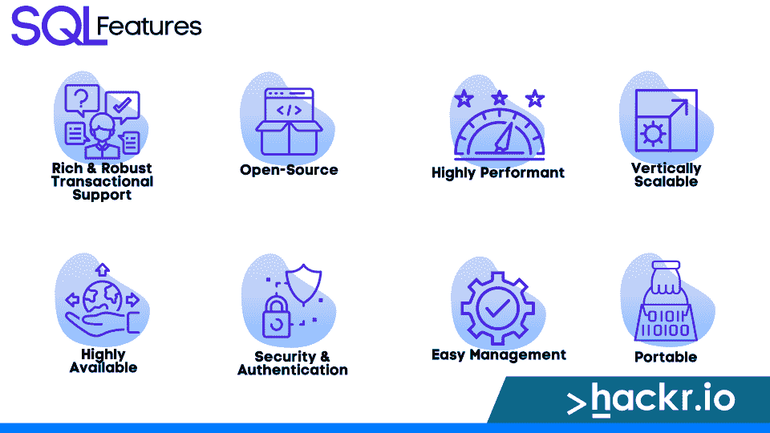

# 初学者的 15 个最佳 SQL 项目(附源代码)[2023]

> 原文：<https://hackr.io/blog/best-sql-projects>

SQL 是一种功能强大的语言，可用于查询和修改 SQL 数据库。然而，对于初学者来说，学习这种语言可能很困难，因为有许多比他们需要的更高级的功能。

SQL 可以用在很多方面，从简单的数据库查询到复杂的数据分析。

初级 SQL 项目是了解数据库以及如何编写查询数据库的 SQL 代码的好方法。它们还可以帮助您获得 SQL 不同方面的经验。

如果您准备迎接一个激动人心的挑战，但是在数据库开发方面没有多年的实践经验，那么本文为您提供了一些可以尝试的用于数据分析的最佳 SQL 项目。

但是在我们深入研究这些 SQL 项目理念之前，让我们回顾一下 SQL 语言的基础知识。如果您已经对自己的 SQL 知识很有信心，请随意跳到项目。

## **什么是 SQL？**

SQL 是结构化查询语言的首字母缩写，是一种用于与数据库通信的标准语言。SQL 用于对数据库中的数据提出问题(查询)，从数据库中检索数据，以及操作数据库中的数据。

它最初被 IBM 称为结构化英语查询语言，但后来改为结构化查询语言。

SQL 用于编写代码行，*查询*数据库以获取或存储数据。当您向数据库发送 SQL 请求时，数据库管理系统(DBMS)会处理该请求并向用户发送反馈。SQL 通常指定如何从数据库收集、组织和提取数据。

SQL 不同于普通的编程语言，因为它关注的是计算机*应该做什么*，而不是*应该如何做*。

SQL 使用数据操作语言(DML)和数据定义语言(DDL)命令来创建、更新、更改或执行其他数据库结构任务。

## **特性&SQL 的用途**

****

我们可以将 SQL 的主要用途分成不同的类别。

*   数据共享
*   资料检索
*   数据定义
*   数据操作
*   访问控制

同样，我们可以总结一下**的主要 SQL 特性:**

*   **不区分大小写的声明性**语言类型
*   **没有条件语句**像 *IF* ， *GOTO* ， *FOR* ，或者 *DO*
*   **内置函数**用于*聚合*和*标量*运算
*   **丰富的&健壮的事务查询**支持
*   开源语言是独立于供应商的
*   **轻松&快速**构建/修改 SQL 数据库
*   **高性能** SQL 数据库

*   **可垂直扩展的数据库提供了极大的灵活性**

*   **来自不同供应商的高度可用的** SQL 数据库
*   **可移植**因为命令可以跨多个系统使用
*   **安全性**通过用户权限和认证
*   **使用直观的 SQL 语言轻松管理数据库**

## **2023 年最适合初学者的 SQL 项目**

SQL 的一个主要好处是容易学习，这意味着任何人，包括几乎没有编程经验的初学者，都可以[学习 SQL](https://hackr.io/blog/how-to-learn-sql) 或获得 [SQL 认证](https://hackr.io/blog/sql-certifications)。

本文将涵盖 15 个适合初学者的 SQL 项目思路，如下表所示。

1.  献血管理系统
2.  烹饪食谱网站
3.  图书馆数据库管理系统
4.  在线零售数据库软件
5.  库存管理系统
6.  语音指令交通查询系统
7.  碳排放计算器
8.  铁路控制系统数据库
9.  学生数据库管理
10.  医院管理系统
11.  工资管理系统
12.  杂货店销售
13.  集中式学院数据库
14.  食品服务数据库 SQL 项目
15.  电费数据库系统

您可以使用这些带有源代码的 SQL 项目来提高您的技能，或者作为练习用的 SQL 项目。

### **1。献血管理系统**

SQL 中的这个项目使用一个数据库来存储关于医疗病人的信息。在设计数据库或考虑要存储或查询的数据时，首先要考虑患者的姓名、唯一 ID、血型、病史和电话号码。

在尝试规范化数据库之前，创建一个实体关系(E-R)图和一个模式来开始在数据库中实现这些字段也是一个好主意。

[**源代码**](https://drive.google.com/drive/folders/1W0jlBFWLl2K97rWaBhFD_0QETx2MKec0?usp=sharing)

### **2。烹饪食谱网站**

在这个 SQL 项目中，你可以设计一个有记录程序的网站，在不同的标题下列出你的烹饪说明。这里有一些显示和存储信息的提示。

*   利用 HTML 文本编辑器写一篇食谱文章或博客
*   评分最高/最受欢迎的“每日食谱”
*   过去五小时内观看的烹饪视频

您还可以添加一个功能，允许个人留下反馈和审查食谱，另一个功能允许您在管理区修改或删除食谱。使用下面的源代码链接进入 GitHub 库开始吧。

[**源代码**](https://github.com/harshpatel0591/food-recipe-website)

### **3。图书馆数据库管理系统**

一个在线图书馆管理系统是用户友好的，用于分配书籍和查看一个类别下的许多书籍和主题。

C#编程语言简化了这种管理信息系统(MIS)的创建。此外，使用 SQL 命令可以快速检索信息。

考虑一下你的大学图书馆，讲师和学生可以在那里借书。通常情况下，这两个群体都有不同的还书期限，从几天到几周不等。

此外，尽管它们可能是同一作者写的同一本书的相同副本，但每一个都有单独的 ID。这意味着图书馆管理系统中的每本书都包含一个条目，详细记录了谁发行了它，它被借了多长时间，罚款金额以及其他有用的信息。

[**源代码**](https://github.com/AlexanderWong/Library-Management-System.git)

### **4。在线零售数据库软件**

随着电子商务的重要性不断增长，在线零售应用程序数据库是一些最著名的 SQL 实践项目。

该应用程序使客户能够注册并进行网上购物。在注册过程中，用户还会收到一个唯一的客户端 ID 和密码，其中收集了用户的姓名、联系方式、地址和银行信息等。

购买后，根据商品的数量、价格和适用的折扣创建用户账单。在将商品发送到所选地点之前，客户必须选择一个支付选项来完成交易。

[**源代码**](https://github.com/aaronzguan/Online-Shopping-Cart-Database-Project.git)

**[参加加州大学伯克利分校的数据科学基础短期课程](https://getsmarter.sjv.io/c/2890636/1143834/13499?partnerpropertyid=2722169)**

### **5。库存管理系统**

库存管理和控制确保公司手头有足够的材料和货物来快速满足客户需求。

通过将库存维持在理想水平，公司可以通过避免不希望的库存不足和库存过多的情况来提高盈利能力。此外，库存管理和控制系统将使公司随时了解有多少商品和服务库存。

库存控制管理数据库的设计目标包括确保必要物品的安全、提高库存周转率、维持安全库存水平、以较低价格获得原材料、降低存储要求、最小化保险等。

[**源代码**](https://github.com/viditgarg1999/Inventory-Management-System.git)

### **6。语音指令交通查询系统**

有了这个创新的工具，你可以更快地旅行，避免我们在公共汽车和火车站看到的那些长队。

通过使用技术驱动的系统进行交通查询，交通运营商可以节省大量的时间和人力。通过这个项目，通勤者可以就他们的各种交通选择提出问题。

为此，您可以创建一个自动化流程，该流程接受语音命令并以语音响应，以共享有关汽车站、机场和火车站的信息。

[**源代码**](https://github.com/haresrv/Voice-based-Transport-Enquiry-System.git)

### **7。碳排放计算器**

近年来，环境保护引起了人们极大的关注。通过创建一个计算建筑碳足迹的网络应用程序，你可以积极地为推动这项事业做出贡献。

这个碳计算器结合了建筑面积和每年工作日的信息，以及用户选择或定制的建筑类型、水设备类型、气候带等属性。

然后，您可以将排放量与能源使用、水使用、运输和固体废物处理联系起来。

一个类似的工具被美国企业 CTG 能源公司概念化，该公司后来将其从 Excel 文件转换为 SQL web 应用程序。

[**源代码**](https://github.com/MarosMacko/CarbonFootprintCalculator.git)

### **8。铁路控制系统数据库**

该 DBMS 要求您对连接站、火车站、列车信息(每辆列车都有唯一的 ID)、铁路路线、列车时刻表和通勤时刻表之间的各种铁路线进行建模。

为了简化项目，你可以建议每趟列车都在一天内到达目的地，每天运行。

出于记录目的，集中监控铁路沿线每个车站的以下信息。

*   当火车正点进站时
*   当列车离开车站时(超时)
*   沿线车站的定位

[**源代码**](https://github.com/aaryanrr/RailwayMGMT.git)

### **9。学生数据库管理**

这个项目可以用来帮助学生做记录。SQL 服务器将包括一般的学生数据，如出勤记录、分数或成绩单、费用记录、联系方式、入学年份、课程等。

自动化的学生数据库管理系统可以大大简化大学的管理过程。

[**源代码**](https://github.com/shardul08/Student-DataBase-Management-System)

### 10。医院管理系统

这种基于网络的应用程序或系统允许您控制医院的运行方式。

它建立了只有管理员才能访问的客户、医生和房间的统一记录。在该数据库中，每个医生和病人都将获得一个唯一的 ID，并根据当前的治疗方法进行连接。

还将为住院、病人出院总结、护士职责、医疗用品等提供单独的模块。

[**源代码**](https://github.com/hrishikeshathalye/Hospital-Management-System-DBMS.git)

### **11。工资管理系统**

基于这个系统在许多商业领域的广泛应用，这个 SQL 项目是最受初学者欢迎的项目之一。

企业工资管理系统计算员工的月收入、税率和社会保障福利。它使用员工信息(姓名、工资级别、职务、福利等。)和包括休假在内的时间表来计算工资。

该应用程序根据特定的公式输出银行文件和工资单，税务局也会收到一个类似的税务文件，该文件是在数据库中创建和存储的。

[**源代码**](https://github.com/ojasphansekar/Employee-Payroll-Management-System.git)

### **12。杂货店销售**

每天，成千上万的消费者在超市购买食品杂货和家庭用品。

根据地区或性别，我们可以使用这些数据来了解客户对支付方式的偏好、访问高峰时间以及忠诚度计划的参与情况。我们可以利用这一点来调整杂货店的政策，以提高销售额和顾客满意度。

该项目使用了一个数据集，该数据集包含三个月内从三家超市商店收集的信息。通过检查这个数据集，我们可以回答一系列问题。

*   参与奖励计划的客户比例会影响总收入或支付方式吗？
*   哪个部门在奖励计划中表现最好？
*   客户反馈会影响会员资格吗？
*   男性和女性有什么不同的指标吗？

[**源代码**](https://github.com/mohamadganji/Supermarket-Data-Analysis-using-SQL)

### 13。集中式学院数据库

这个系统类似于我们前面讨论的学生 DBMS 系统。

一个学院有学术部门，包括英语、数学、历史等。每个系也提供一系列的课程，教师可以使用这个系统来监督。

考虑一个教授既教统计学又教微积分的场景。如果学生是数学专业的，他们可以选修其中任何一门课，但是一门课只能有一个老师；否则，就会出现不寻常的重叠。

[**源代码**](https://github.com/aashayzanpure/college-database-management-system)

### **14。餐饮服务数据库 SQL 项目**

餐馆通过网站页面提供在线交付选项，将他们的食品服务延伸到物理位置之外。

此外，餐馆可以接受电话订单，并派送货人员递送每份订单。然而，送货人员只能在给定的邮政编码范围内送货，不能超出这个范围。

在这个项目中，主要思想是维护以前客户的记录，这样他们就可以为未来的订单提供折扣。

[**源代码**](https://itsourcecode.com/sdm_downloads/online-restaurant-management-system-project-in-php-with-source-code/)

### 15。电费数据库系统

对于需要数据库来管理不断增长的数据集的私有电力公司来说，这个 SQL 项目的想法很有帮助。

这个项目允许您访问示例数据库的用户类别和管理部分，这将使您能够试验电力公司计费系统的管理操作。

[**源代码**](https://github.com/Ramalingasamy012/Electricity-Bill-Generation-System.git)

## **结论**

本文为初学者介绍了 15 个不同的 SQL 项目，您可以用它们来学习数据库，同时提高您的 SQL 技能。

SQL 是一种功能强大的语言，对初学者来说很有挑战性。不过，通过采用基于项目的学习环境，您可以使用批判性思维和基于探究的问题解决方法来进一步提高您的 SQL 技能。

您还可以使用 SQL 项目来构建简历，这在申请需要一定 SQL 知识水平的职位时非常方便。我们建议您选择使用数据库规范化策略的 SQL 项目理念，因为这些数据设计方法减少了数据依赖性和冗余。

您可以从上面列出的 SQL 项目想法开始，从 [SQL 书籍](https://hackr.io/blog/best-sql-books)中找到其他几个基本的 SQL 项目，或者在 Google 上搜索 SQL 实践项目。要真正提升你的 SQL 技能，参加这样的课程:基于项目的 SQL 课程或 SQL 数据分析课程**。**

当然，如果您觉得您已经掌握了一系列初级项目，请随意寻找高级 SQL 项目来提升您的 SQL 技能！

渴望提高您的 SQL 初学者技能，但需要帮助以确定从哪里开始？查看我们的文章:

**[十大最佳 SQL 课程](https://hackr.io/blog/best-sql-courses)**

## **常见问题解答**

#### **1。如何创建 SQL 项目？**

使用 SQL 的项目是存储数据的数据库和表的集合。您可以通过几个步骤来创建 SQL 项目，具体取决于您的软件。

1.  转到文件>新建>项目
2.  从模板列表中选择 SQL 项目(或选择“文件”>“新建”>“数据库”)
3.  输入数据库名称，然后单击保存
4.  确保您使用的 SQL 软件版本正确

#### **2。我如何把我的 SQL 项目放在简历上？**

首先，你可以列出整个项目。但是你必须把最重要的部分放在每一部分的顶部，让雇主容易阅读。例如，如果您实现了一个带有表单填写模块和报告系统的在线数据库，只需关注这两个组件。

其次，你可以把你的项目分成更小的部分，比如“用户界面设计”、“数据库设计”等等。这使得雇主更容易理解项目每个组成部分所花费的时间，而不必阅读所有内容。

#### **3。我如何实践一个 SQL 项目？**

SQL 是一种复杂的语言；一下子学会这一切会让人感到不知所措。对于 SQLite 这样的 DBMS，最好从 SQL 数据库项目开始，或者为初学者寻找 MySQL 项目。然后，您可以实践自己的小项目想法，找到需要工作的现有数据库，或者尝试我们上面列出的简单 SQL 项目。