# 最佳系统设计书籍

> 原文：<https://hackr.io/blog/best-system-design-books>

公司如何构建拥有数百万用户的复杂的大规模应用程序，如脸书、Instagram 和 Gmail，来处理大量的流量和数据？答案是系统设计。

系统设计是确定企业及其最终用户的需求，并找到为此设计系统的最佳方法的过程。这可能包括定义架构、组件、接口以及如何处理数据。

因此，无论你是系统设计初学者，还是希望拓展技能的有经验的开发人员，或者是面试涉及系统设计的职位，我们都找到了 2023 年你需要阅读的 14 本最佳系统设计书籍。

| **精选系统设计书籍【编辑推荐】** |
| [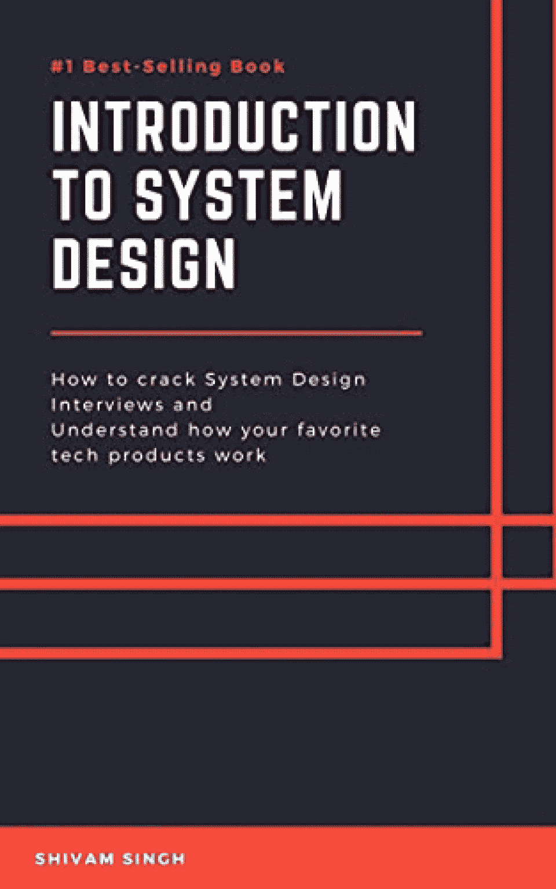](https://geni.us/SMCCAZ) | **标题:**系统设计简介:如何破解系统设计面试，了解你喜欢的科技产品是如何工作的**作者:**希瓦姆·辛格**第 142 页:**[检查价格](https://geni.us/SMCCAZ) | [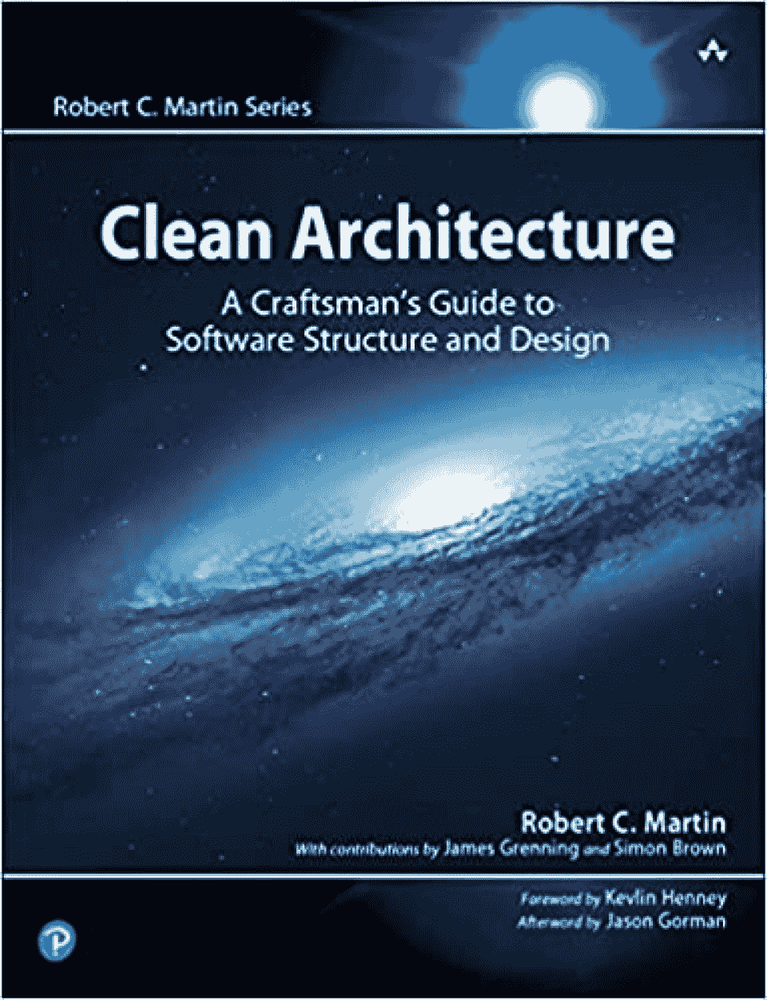](https://geni.us/QTSn5pu) |
| 标题:干净的架构:软件结构和设计的工匠指南 | **作者:**罗伯特·马丁出版商:培生**第 432 页:**[检查价格](https://geni.us/QTSn5pu) | **标题:**系统分析与设计 |
|   | **作者:**斯科特·蒂利**发布者:**森格学习**第 576 页:**[检查价格](https://geni.us/5uleGO)**在系统设计书中要寻找的东西**真实世界的例子:关于系统设计的最好的书包括实际产品的设计，包括工程师必须做出的权衡和决策的信息。 | 相关术语:这很重要，尤其是在准备面试的时候，因为你必须在面试中清楚地解释术语。 |

## **图表&插图:**这些可以让系统设计概念不那么抽象，帮助你更好地将概念形象化。

1.  **14 本最佳系统设计书籍**
2.  对设计电子游戏感兴趣？结账:
3.  **[最佳游戏设计书籍](https://hackr.io/blog/best-game-design-books)**

## [****](https://geni.us/SMCCAZ)

[检查价格](https://geni.us/SMCCAZ)

**作者:**希瓦姆·辛格

发布者:不适用

**第 142 页:**

这是系统设计面试的最佳书籍之一。它提供了一个如何设计流行应用程序的近距离观察，包括 Instagram、Facebook Messenger、Dropbox 和 Pastebin。

这本书的主要读者是软件工程师，但是创始人、产品经理和风险投资家也会觉得它很有用。

**特性**

非常适合初学软件的工程师

面试准备的绝佳材料

相对较短的系统设计书

*   [****](https://geni.us/QTSn5pu)
*   [检查价格](https://geni.us/QTSn5pu)
*   **作者:**罗伯特·马丁

出版商:培生

**第 432 页:**

这本书是有抱负的系统设计师和软件架构师的必读书，他们想学习如何避免著名的“鲍勃叔叔”的典型设计和架构陷阱。

作为系统设计最佳书籍的竞争者，这本书将教你如何编写干净的、可读的、可伸缩的代码。您还将学习如何使用测试来提高系统的效率。

**特性**

罗伯特·c·马丁(鲍勃叔叔)的[清洁系列](https://www.pearson.com/us/higher-education/series/Robert-C-Martin-Series/348084.html)的第三本书

展示了如何将敏捷方法集成到系统设计中

包括测试部分

*   [****](https://geni.us/5uleGO)
*   [检查价格](https://geni.us/5uleGO)

**作者:**斯科特·蒂利

**发布者:**森格学习

**第 576 页:**

这是另一本在 CS 学生中很受欢迎的系统设计教材，它提供了传统和新兴系统设计趋势的实用概述。

如果你正在寻找系统设计的最佳书籍，那么通过云计算和移动应用程序的真实例子来学习，这是一个可靠的选择。您还将涉及面向对象编程和敏捷方法及其在现代系统设计中的作用。

**特性**

云计算和移动应用的系统设计实例

包括形象化概念的图像和插图

包括帮助你练习的练习

*   [**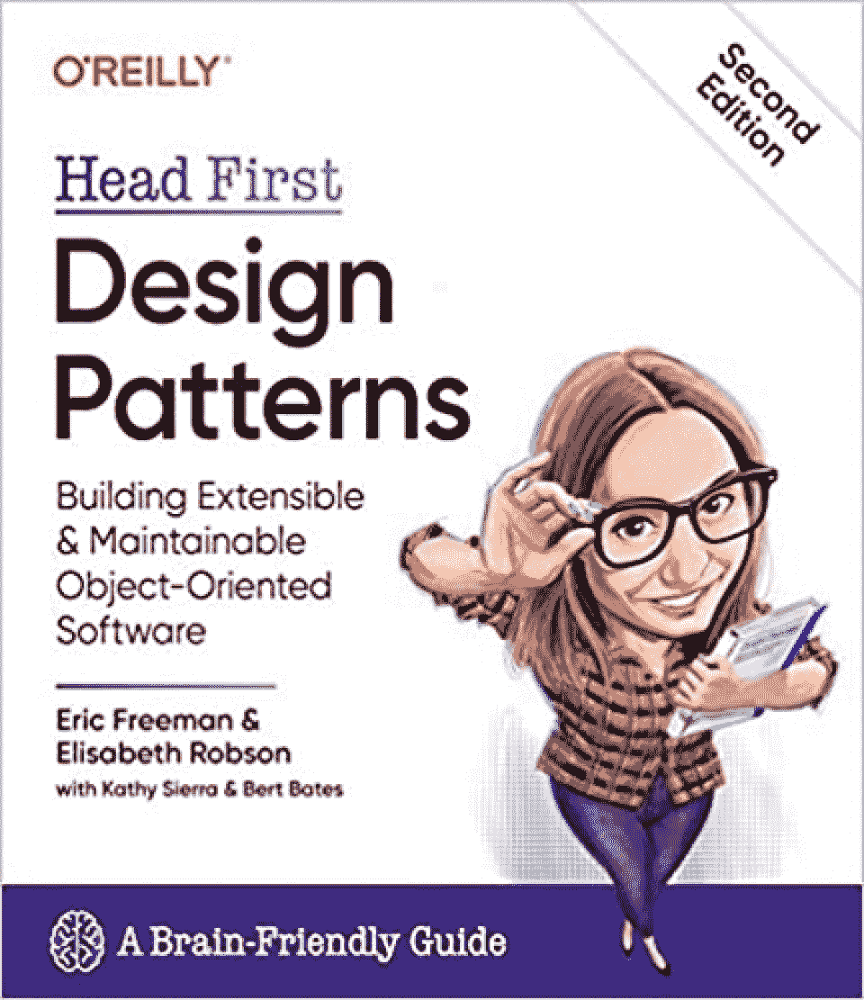**](https://geni.us/B0cgBc)
*   [检查价格](https://geni.us/B0cgBc)
*   作者:埃里克·弗里曼，伊丽莎白·罗布森

**出版商:**奥莱利媒体

**第 669 页:**

如果你正在寻找软件设计书籍，里面有经过测试的系统设计模式，这是给你的。借鉴成功的系统设计者的经验和最佳实践，这是初学者最好的系统设计书籍之一。

作为“Head First”系列中的一员，您可以期待引人入胜的图像和富有想象力的方法来教授最佳设计模式，为什么以及何时应该使用它们，以及如何使用它们。

**特性**

系统设计新人的理想选择

关注设计模式背后的面向对象原则

以有趣和吸引人的方式介绍课程

*   包括大量图像来解释概念
*   [**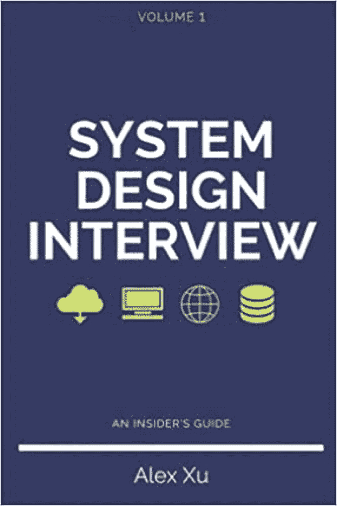**](https://geni.us/Vjay28)
*   [检查价格](https://geni.us/Vjay28)
*   **作者:**徐

**出版者:**独立出版

**第 320 页:**

系统设计面试可能会很伤脑筋。这本书将帮助你准备和自信地面对下一次系统设计面试，从一个内部人士的角度出发。

您将学习一个简单的 4 步框架，旨在帮助您解决系统设计面试问题。您还将练习为真实世界的应用程序设计系统，如 YouTube、Google Drive、通知系统等等。

**特性**

准备系统设计面试的绝佳指南

包括 16 个面试问题和详细的解决方案

包含解释系统如何工作的图表

*   洞察面试官对成功候选人的要求
*   [**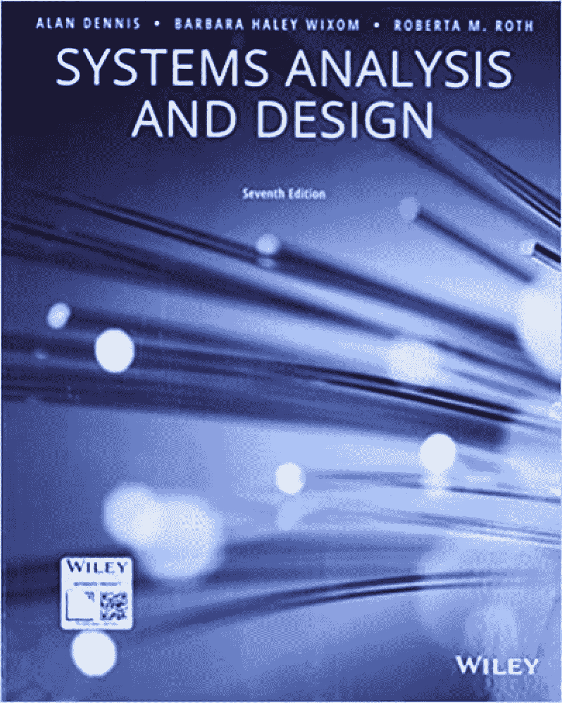**](https://geni.us/8D0rDjl)
*   [检查价格](https://geni.us/8D0rDjl)
*   **作者:**艾伦·丹尼斯，芭芭拉·维克森，罗伯塔·m·罗斯

出版商:威利

**第 464 页:**

这本教科书通常是许多计算机科学学生的指定阅读材料。通过使用基于项目的样式来模拟真实世界的工作流，您可以了解基本的系统设计概念。

这本书将为你提供掌握系统分析和设计原则所需的基础知识。

**特性**

学习系统设计的学术方法

带有深入解释的案例研究

计算机专业学生的绝佳选择

*   [**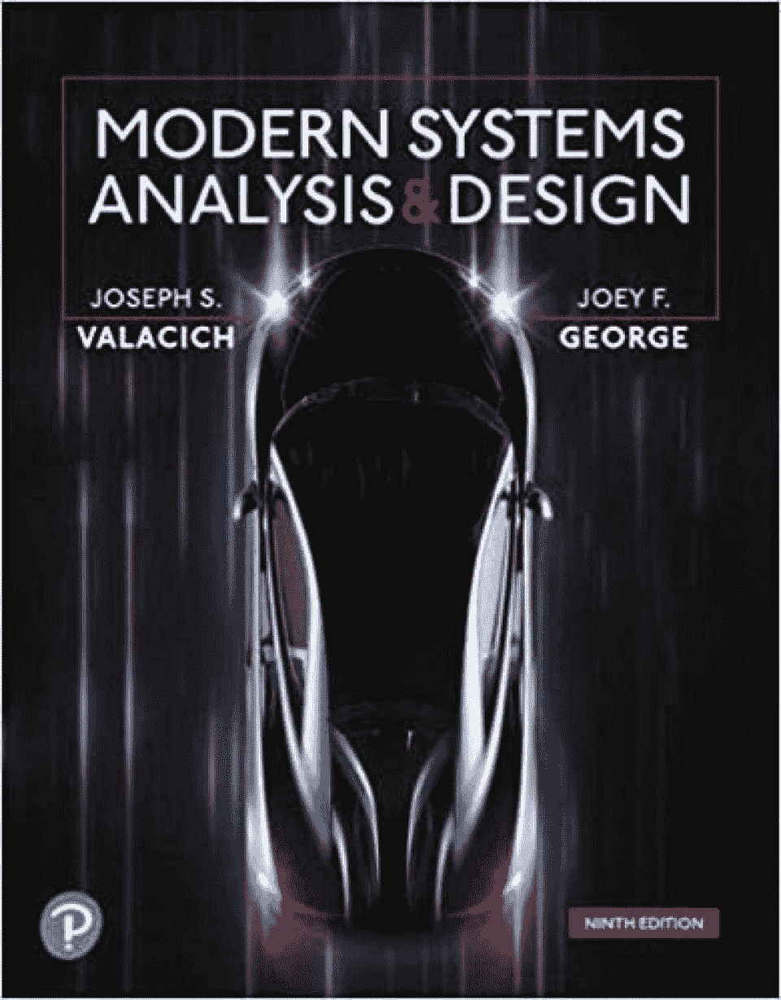**](https://geni.us/dtA7)
*   [检查价格](https://geni.us/dtA7)
*   **作者:**约瑟夫·瓦拉契奇，乔伊·乔治

出版商:培生

**第 528 页:**

这本书是系统设计现代开发过程的综合实用指南。你将学习如何设计和实现有效的系统，在你需要的技术和工具的帮助下。

作为一本关于系统设计的中级书籍，你应该在开始之前至少有一门语言的编程经验。

**特性**

计算机专业学生的绝佳选择

系统设计的实用方法

系统规划、分析和设计部分

*   想要提高你的编程技能吗？查看 [**最佳编程书籍**](https://hackr.io/blog/best-programming-books)
*   [**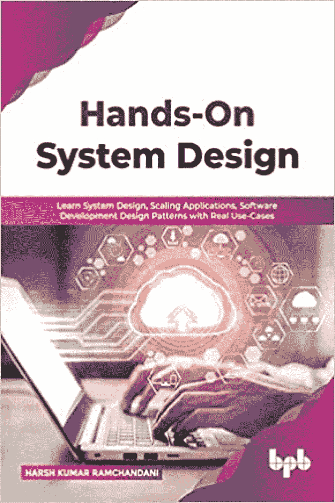**](https://geni.us/EvBWCe)
*   [检查价格](https://geni.us/EvBWCe)

**作者:**严厉的库马尔·拉姆昌达尼

**出版商:** BPB 出版公司

**第 220 页:**

这本书从系统设计的基本原则的一章开始，然后深入到基本概念的课程，如网络、扩展数据库、设计模式等等。

本书还使用了视频流网站、图像托管应用程序、Twitter 等网站的系统设计实例。

**特性**

现实世界中的问题和逐步解决方案

构建可伸缩应用程序的示例

面试准备的伟大参考书

*   [**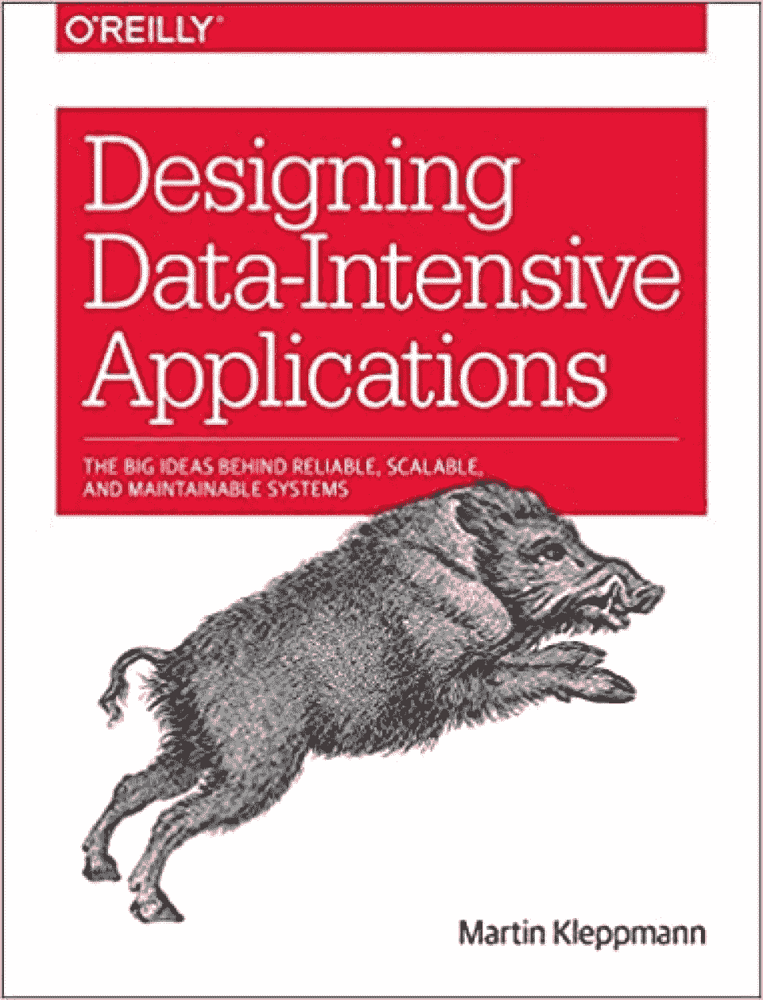**](https://geni.us/ABMze)
*   [检查价格](https://geni.us/ABMze)
*   **作者:**马丁·克莱普曼

**出版商:**奥莱利媒体

**第 611 页:**

数据是现代应用程序的生命线，今天的开发人员可以使用许多工具来存储和处理数据。本书涵盖了使用关系数据库、NoSQL 数据存储、分布式系统等的利与弊，帮助您做出明智的决策，选择最佳工具来管理您的应用程序数据。

**特性**

数据管理工具的高级概述

对分布式系统和大数据的洞察

包括理论和实际应用

*   涵盖处理数据的最佳实践和原则
*   [**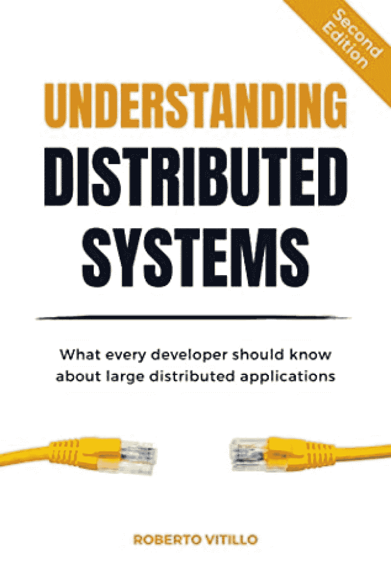**](https://geni.us/lBsh)
*   [检查价格](https://geni.us/lBsh)
*   **作者:**罗伯托·维蒂洛

发布者:不适用

**第 344 页:**

在大数据时代，分布式系统变得必不可少。如果这是你需要设计的东西，这本书是学习构建可伸缩分布式系统基础的绝佳选择。

本书分为五个部分，涵盖了沟通、协调、可伸缩性、弹性和测试。它还包括一个分布式系统的剖析部分。

**特性**

适合初学者

理论与实践相结合

后端工程师的理想选择

*   [**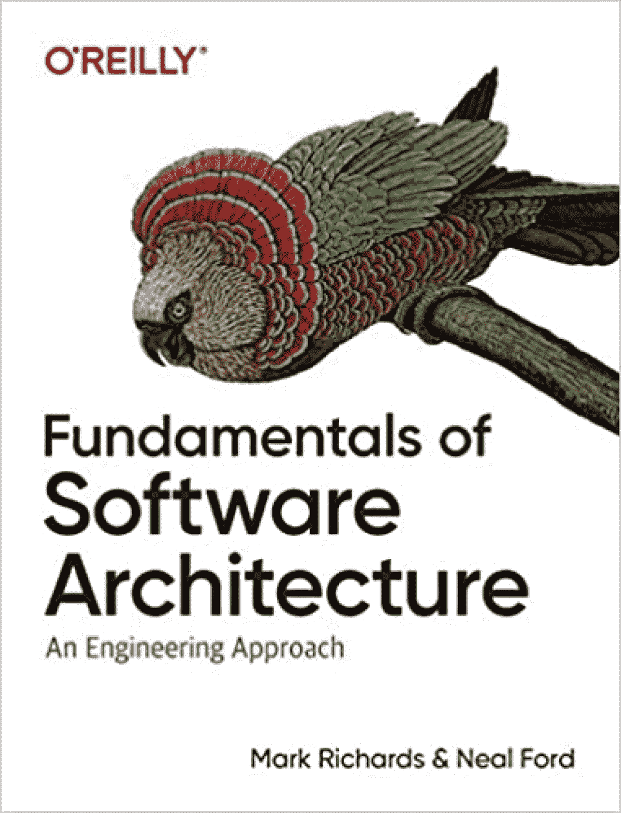**](https://geni.us/GpBf)
*   [检查价格](https://geni.us/GpBf)
*   **作者:**马克·理查兹，尼尔·福特

**出版商:**奥莱利媒体

**第 419 页:**

有了这本书，你会得到一个真正全面的软件架构指南。您将了解架构模式、特征、组件等等。

这本书包含了流行语言如 JavaScript、Java 和 C#的架构软件示例。它还充满了图表，以帮助你形象化的概念，你正在学习。

**特性**

小测验(带答案)

关注软件架构模式

每个体系结构的星级图表

*   关于团队管理、谈判等软技能的部分
*   [**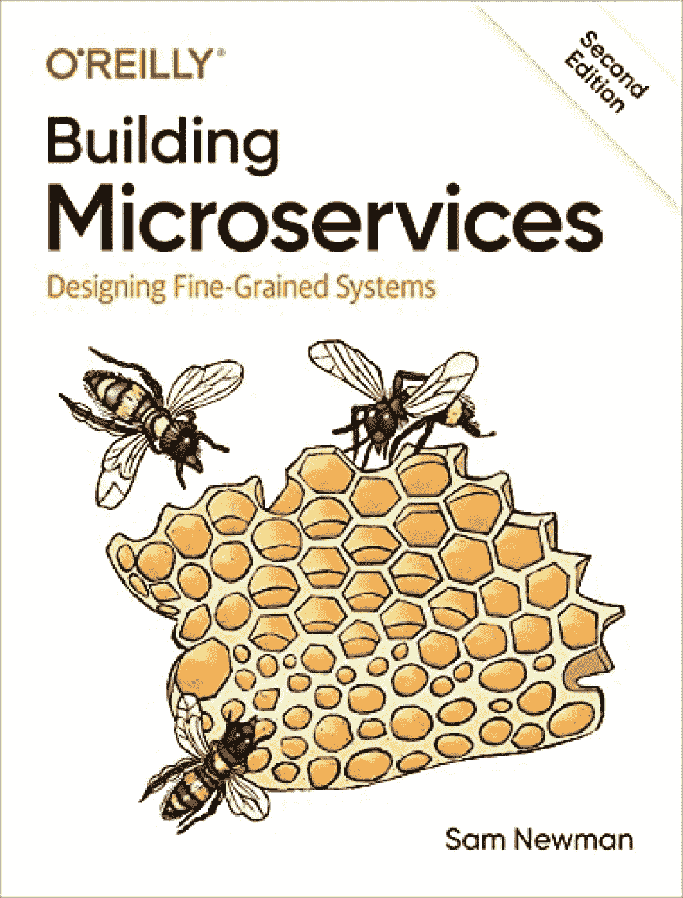**](https://geni.us/rQVK)
*   [检查价格](https://geni.us/rQVK)
*   **作者:**山姆·纽曼

**出版商:**奥莱利媒体

**第 612 页:**

将较大的应用程序划分为通过 API 进行通信的较小的子服务的能力导致了微服务使用的巨大增长。这本书将帮助您快速了解设计、构建和管理微服务的基本注意事项。

你将了解传统的单片应用程序和微服务之间的区别。作者还提供了设计微服务时可能面临的挑战的清晰描述，包括克服这些挑战的方法。

**特性**

真实案例研究

关于构建可扩展微服务的部分

涵盖建模、集成、测试、部署和监控的解决方案

*   [**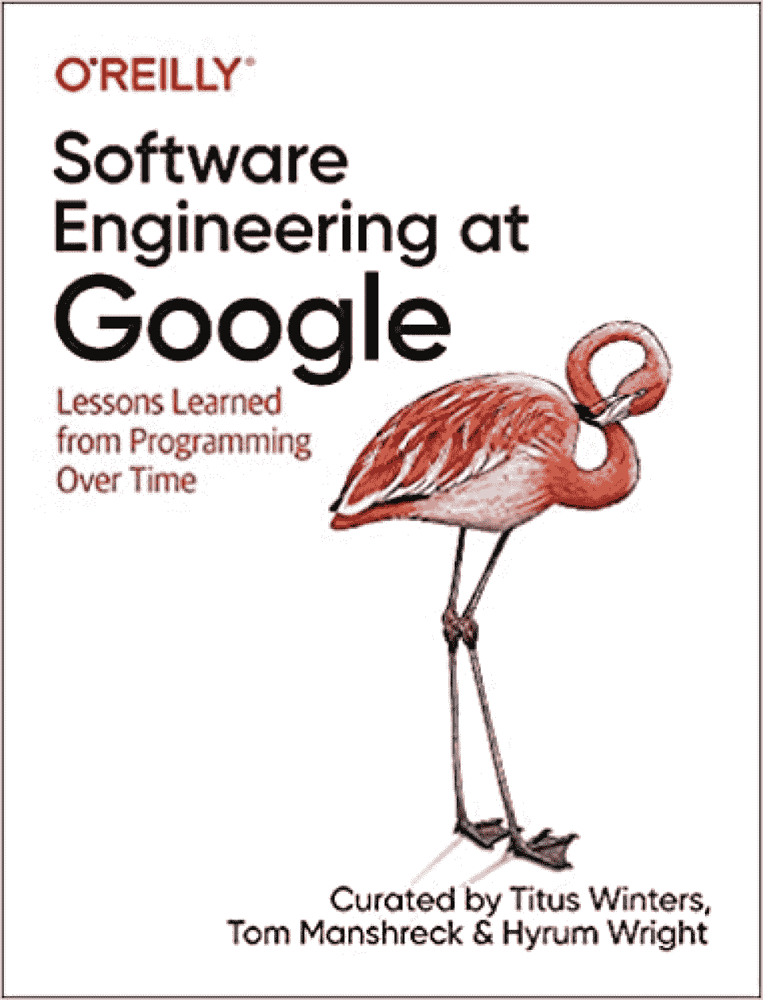**](https://geni.us/mGjS7)
*   [检查价格](https://geni.us/mGjS7)
*   作者:泰特斯·温特斯，汤姆·曼施里克，海鲁姆·赖特

**出版商:**奥莱利媒体

**第 599 页:**

众所周知，谷歌为世界上一些最复杂和最大的应用程序提供支持。这本书揭开了谷歌系统设计和工程的帷幕。

分为三部分；首先是谷歌独特的软件工程文化。第二和第三部分涵盖了谷歌工程师用于系统设计的流程和工具。这本书还探讨了时间和规模如何影响工程。

**特性**

由经验丰富的谷歌工程师撰写

关于单元测试和大规模测试的章节

大型公司开发人员的绝佳选择

*   **对软件工程感兴趣？查看** [**最好的软件工程书籍**](https://hackr.io/blog/software-engineering-books)
*   [**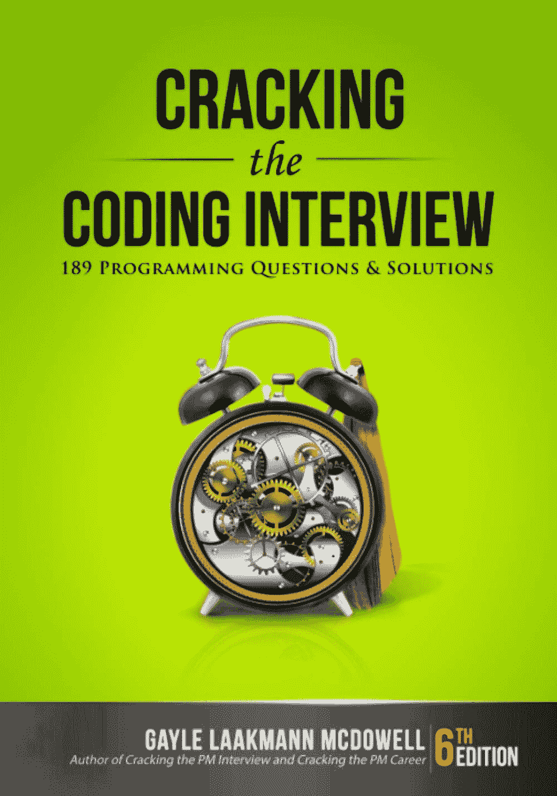**](https://geni.us/DkNLpQ)
*   [检查价格](https://geni.us/DkNLpQ)

**作者:**格利·拉克曼·麦克道尔

**出版商:** CareerCup

**第 687 页:**

作为可能是关于软件面试准备的最著名的书，这本书的作者借鉴了她在谷歌、苹果和微软担任软件工程师的工作经验。

如果你正在准备系统设计问题的面试，这本书是学习如何发现面试问题中微妙的暗示和细节的有价值的工具。而且，这可以应用到技术和行为面试问题上。

**特性**

在亚马逊的求职面试书籍中排名第一

189 道面试真题(附解答)

对大型科技公司招聘流程的见解

*   **结论**
*   学习系统设计可以让软件开发人员和工程师以及其他 it 专业人员受益，比如产品经理、顾问、创始人等等。这些技能可以让你在任何涉及系统设计决策的角色中获得优势。
*   我们已经找到了 14 本最好的系统设计书籍来帮助你开始。无论是初学者还是有多年经验的专业人士，这些书都将帮助你掌握系统设计和软件架构的关键特征。

## 有兴趣了解更多关于设计的知识吗？结账:

**[最佳设计书籍](https://hackr.io/blog/design-books)**

**常见问题解答**

**1。《系统设计》看什么？**

通过学习如何计划和做出影响软件构建的决策，您将学会构建高效和可伸缩的软件。您还将学习解决问题的各种方法及其权衡。

## **2。学习系统设计最好的资源是什么？**

#### 专注于由专家撰写的书籍，这些专家从他们丰富的知识和经验中汲取营养。我们清单上的任何一本书都是一个很好的起点。

**3。系统设计需要编码吗？**

#### 设计系统的时候不需要写代码。系统设计是确定基本系统需求并找到设计系统组件的最佳方法的过程，包括体系结构、组件、接口和数据处理。

**4。怎样才能更好的做系统设计？**

#### 从我们的书单中挑选并阅读一本书，向最优秀的人学习。你也可以浏览你所钦佩的公司的技术博客，了解他们的工程师所做的设计决策。

优秀的系统设计技巧来自经验，所以继续设计和构建你自己的系统。

#### **4\. How Can I Get Better at System Design? **

Learn from the best by picking and reading a book from our list. You can also explore technical blogs from companies you admire to get insights into design decisions taken by their engineers. 

Excellent system design skills come with experience, so keep designing and building your own systems.