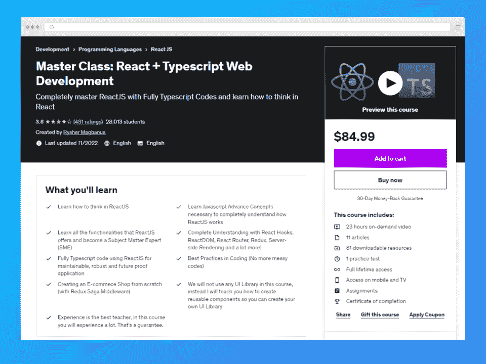
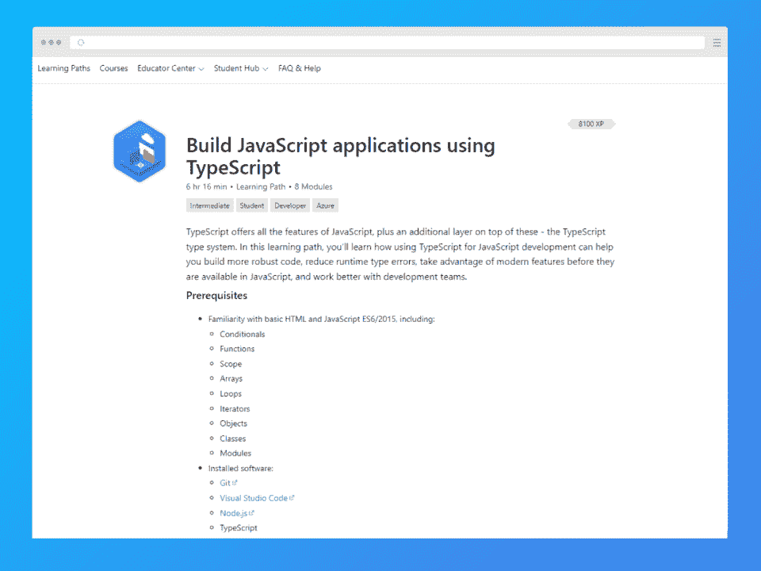
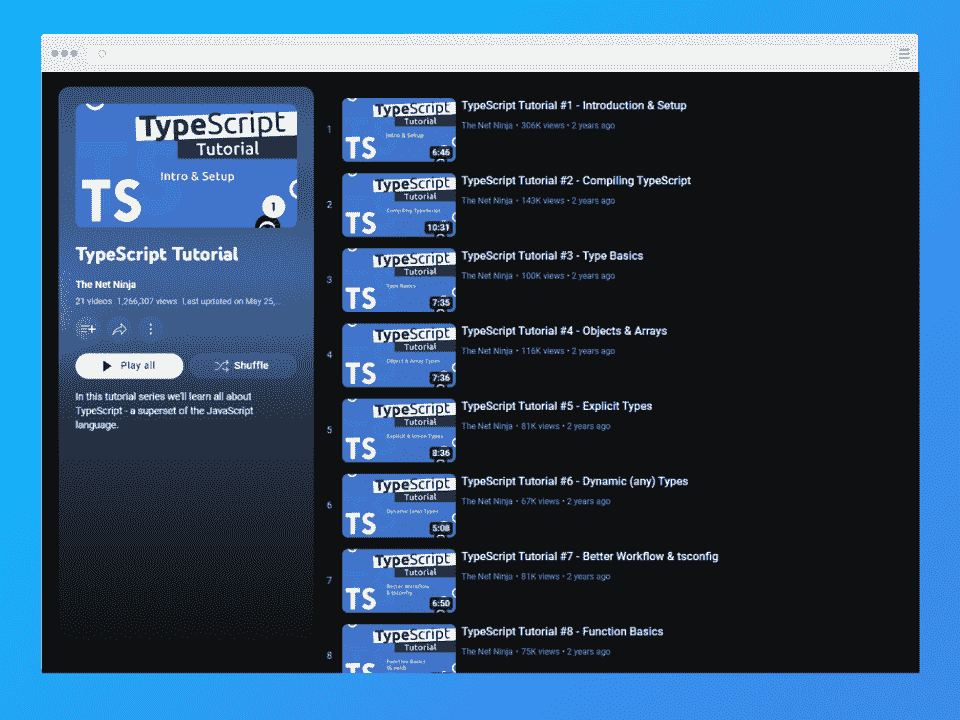
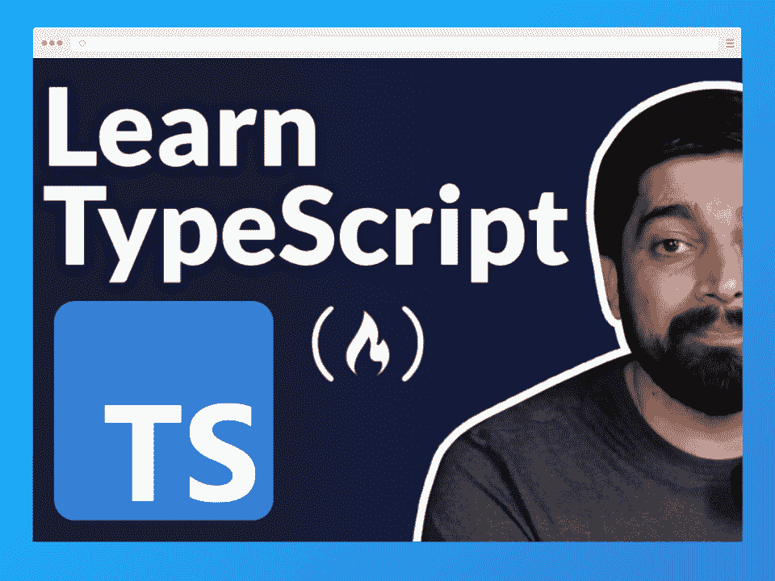
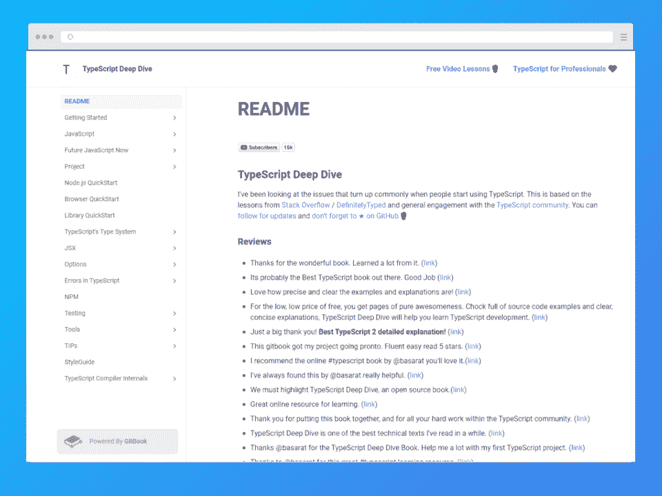
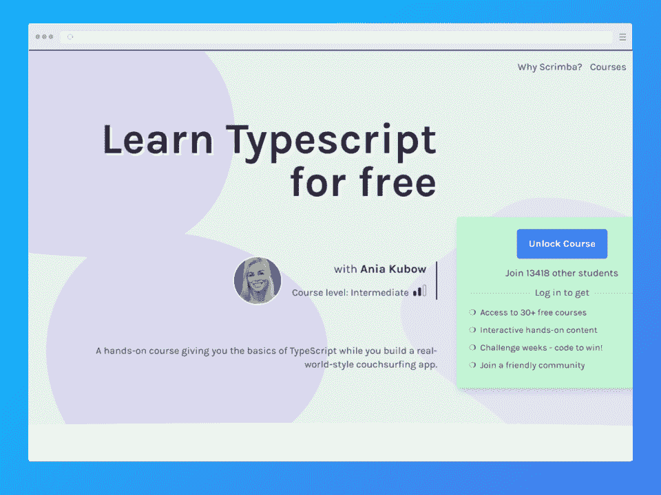
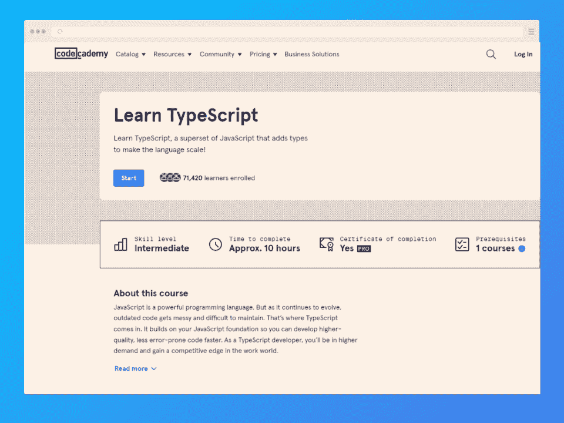
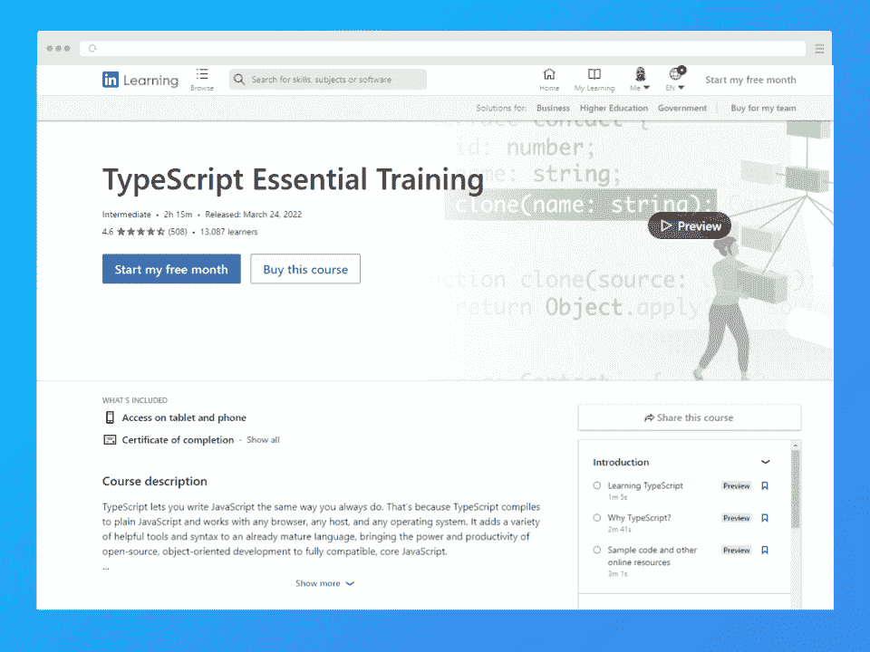
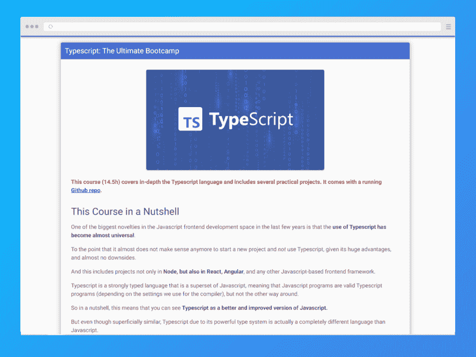
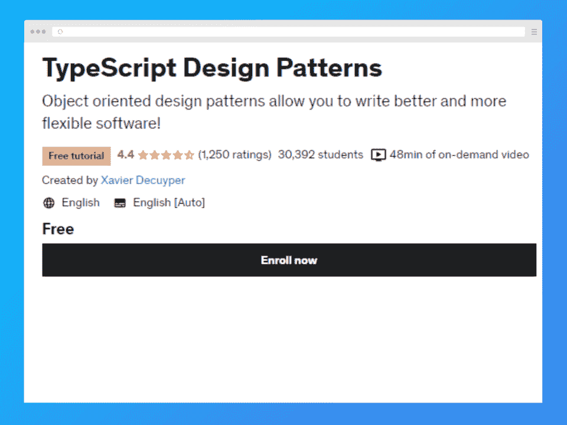

# 2023 年 10 门最佳打字稿在线课程[免费+付费] | Hackr.io

> 原文：<https://hackr.io/blog/best-typescript-courses>

TypeScript 已经迅速成为最受欢迎的编程语言之一，正如其在 2022 年栈溢出开发者调查中排名前五所示。

与 JavaScript 密切相关，TypeScript 以简单易学而闻名，但它也提供了静态类型检查的额外好处。这允许开发人员在编译时捕捉错误，使其更适合构建复杂和大规模的应用程序。

本文将在线查看 10 门最佳的 TypeScript 课程，但在此之前，让我们再了解一点关于 TypeScript 的知识。

**特色打字稿课程【编辑推荐】**

## **什么是 TypeScript？**

TypeScript 是从 JavaScript 构建的，这意味着它可以做 JavaScript 能做的一切，但它有一个静态类型检查形式的额外功能。

在编程中，类型检查允许您通过动态或静态类型化为值分配正确的类型。

JavaScript 使用动态类型检查，这不需要类型声明，但增加了运行时出错的机会。TypeScript 使用静态类型，这需要声明类型。

**想了解 JavaScript 和 TypeScript 之间的联系吗？** **结账:**

**[JavaScript vs TypeScript](https://hackr.io/blog/typescript-vs-javascript)**

## **该不该学 TypeScript？**

如果你是一个想要学习 TypeScript 的初学者，更好的方法是先学习 JavaScript。然后，在继续学习 TypeScript 之前，您可以用 JavaScript 构建一些项目来巩固您的知识。

如果你已经知道 JavaScript，但不确定是否要学习 TypeScript，那么下面的列表可能会帮助你做出决定。

*   **检测 bug:**在编译时和运行时尽早发现这些 bug
*   **静态类型检查:**提高代码的可读性
*   **库支持:**大多数 JavaScript 框架/库都是本地支持的
*   工作:打字知识让你成为求职者的优势

如果你申请打字工作，你一定要看看:

**[前 50 名打字稿面试问题(附答案)](https://hackr.io/blog/typescript-interview-questions-and-answers)**

## **选择学习打字稿的最佳课程**

准备好在线学习 TypeScript 但不确定从哪里开始？我们已经在网上列出了前 10 名的打字课程，包括对课程的期望和利弊。

### **选择标准**

*   **创作者可信度:**他们作为编程老师有多少经验？学生积极评价的比例是多少？
*   **内容:**课程的全面性和参与性如何？主题与您作为一名 TypeScript 开发人员将面临的现实挑战相关吗？
*   **社区:**有多少人参加了该课程或目前正在注册？如果你需要帮助，找到它有多容易？

## **十大最佳在线打字课程**

**我们为什么选择本课程**

更喜欢学习 TypeScript 和 React 的动手方法？这道菜是为你准备的。你将通过建立一个具有许多功能的电子商务商店来学习。

本课程不仅会教你如何使用 TypeScript。您将从 JavaScript 开始，然后转到 React 主题，如 DOM、钩子和服务器端呈现。

**优点**

*   非常适合初学者的打字稿课程；在转向 TypeScript 之前先学习 Javascript
*   课程材料可下载

**缺点**

*   23 小时的课程，所以如果你想在网上快速学习打字稿，这并不理想

**总结**

*   **平台:** Udemy
*   **课程讲师:**雷舍尔·马格巴努阿
*   **难度:**初学者
*   价格: $ 84.99
*   **证书:**是
*   注册学生: 28K

[在此查看更多](https://click.linksynergy.com/deeplink?id=jU79Zysihs4&mid=39197&murl=https%3A%2F%2Fwww.udemy.com%2Fcourse%2Freact-typescript-complete-master-class%2F)

**我们为什么选择本课程**

这个课程是由微软(TypeScript 的创造者)设计的，所以你知道你得到了好东西！

这个免费的 TypeScript 在线培训包括 8 个模块，涵盖了变量类型、接口、实例和泛型等主题。您还将了解模块和名称空间如何帮助您组织代码。

**优点**

*   自我评估的知识检查部分
*   来自微软的免费结业证书

**缺点**

*   本打字稿课程 100%基于文本。不适合视觉学习者

**总结**

*   **平台:**微软学习
*   **难度:**中级
*   **价格:**免费
*   **证书:**是

[在此查看更多](https://learn.microsoft.com/en-us/training/paths/build-javascript-applications-typescript/)

**我们为什么选择本课程**

Shaun Pelling(网络忍者)在 YouTube 上拥有超过 100 万的用户，是最受欢迎的在线编程导师之一。这个打字稿课程播放列表可以在网络忍者 YouTube 频道上找到。

该播放列表包括 21 个视频，教您在继续学习各种类型的课程和创建更好的工作流程之前，如何设置和编译您的 TypeScript 项目。

**优点**

*   基于项目，您将构建一个财务日志应用程序
*   您还可以访问包含所有源代码的 GitHub 存储库

**缺点**

*   来自 YouTube 广告的干扰

**总结**

*   **平台:** Youtube
*   **课程讲师:**肖恩·佩林(网络忍者)
*   **难度:**初学者
*   **价格:**免费
*   **证书:**无

[在此查看更多](https://www.youtube.com/playlist?list=PL4cUxeGkcC9gUgr39Q_yD6v-bSyMwKPUI)

[****](https://www.youtube.com/watch?v=30LWjhZzg50)

**我们为什么选择该课程**

Hitesh Choudary 是一位拥有 10 多年教学经验的资深编码导师，他创建了这个五小时的课程。它由免费代码营 YouTube 频道主办。该课程首先教你如何将 TypeScript 添加到现实世界的项目中。

您将了解数组、元组和枚举，以及接口、类和泛型等高级主题。它还包括一些关于如何使用 TypeScript 文档的课程。

**优点**

*   向您介绍正式的 TypeScript 文档
*   讲师将带您浏览文档中的示例

**缺点**

*   如果你喜欢基于项目的学习，可能不是正确的选择

**总结**

*   **平台:** YouTube
*   **课程讲师:** Hitesh Choudary
*   **难度:**初学者
*   **价格:**免费
*   **证书:**无
*   **浏览量:** 94K

[在此查看更多](https://www.youtube.com/watch?v=30LWjhZzg50)

**我们为什么选择本课程**

如果你喜欢通过阅读来学习，这是你的理想资源。TypeScript Deep Dive 是一门全面的课程，涵盖了从初学者到高级人员的许多 TypeScript 主题。

本课程从 TypeScript 概述开始，然后转向 TypeScript 和 JavaScript 之间的区别。您还将了解测试(使用 Jest 和 Cypress)。

**优点**

*   托管在 GitBook 上并开源
*   GitHub 上+18.5K 星，所以课程资料是最新的

**缺点**

*   整个课程是基于文本的，所以如果你是一个视觉学习者，这并不理想

**总结**

*   **平台:** GitBook
*   **课程讲师:**巴萨拉特·阿里
*   **难度:**初学者
*   **价格:**免费
*   **证书:**无
*   **GitHub 明星:** 8.5K

[在此查看更多](https://basarat.gitbook.io/typescript/)

**我们为什么选择本课程**

这些视频课程的独特之处在于它们的互动性。要完成挑战，您可以暂停视频，单击屏幕，然后像在代码编辑器中一样键入代码。

您将从 TypeScript 基础知识开始，涵盖主类型和复杂类型等主题，然后继续学习编译器、模块和接口等高级概念。

**优点**

*   非常适合那些通过构建东西来学习的人
*   通过构建 CouchSurfing 应用程序了解如何使用 TypeScript
*   辛巴有一个活跃的不和社区

**缺点**

*   要求熟悉 HTML、CSS 和 JavaScript

**总结**

*   **平台:** Scrimba
*   **课程讲师:**阿尼亚·库博
*   **难度:**中级
*   **价格:**免费
*   **证书:**无
*   注册学生: 13K

[在此查看更多](https://scrimba.com/learn/typescript)

**我们为什么选择本课程**

Codecademy 在交互式编码环境中介绍了本 TypeScript 课程中的六课。读完课文后，在继续之前会有一些小挑战要尝试。

课程包括基本和复杂类型、类型收缩和函数。您还将学习如何使用 linter 加速您的 TypeScript 工作流并减少错误。完成本在线课程预计需要 10 个小时。

**优点**

*   每一课都有一个测验和一个你可以用来自我评估的项目

**缺点**

*   测验和项目只对专业会员开放
*   PRO Lite 每月费用为 17.49 美元(年度选项)

**总结**

*   **平台:**代码学院
*   **难度:**中级
*   **证书:**是(针对 PRO Lite & PRO 会员)
*   注册学生: 68K

[在此查看更多](https://www.pntrac.com/t/SENKTE5HSU5DSEdKS0tIQ0hHSUtOTg)

**我们为什么选择本课程**

这是你可以在一个周末内完成的速成课程之一，因为讲师会直奔主题。

您将了解将代码库从 JavaScript 更改为 TypeScript 意味着什么，并且您将理解这样做的好处。该 TypeScript 培训还涵盖了类型、使用 decorator 的动态行为和模块。

**优点**

*   课程持续时间很短，只有 2 小时 15 分钟
*   如果你想找一个速成班来快速学习打字稿，这是个不错的选择

**缺点**

*   TypeScript 在线教程节奏很快，因此不适合缓慢而稳定的学习者

**总结**

*   **平台:**领英学习
*   课程讲师:杰斯·查德威克
*   **难度:**中级
*   价格::39.99 美元(每月 29.99 美元的订阅费)
*   **证书:**是
*   注册学生: 11K

[在此查看更多](https://linkedin-learning.pxf.io/XxPd7X)

**我们选择本课程的原因**

Angular 大学开设了这门课程，提供从初级到高级的打字稿主题的深入课程。

该课程拥有你在学习 TypeScript 时能想到的一切，包括介绍性的 TypeScript 课程、面向对象编程、泛型和 decorators。

您还将通过使用 Node.js 构建 REST API 来学习在后端使用 TypeScript。

**优点**

*   提供灵活性
*   根据您对 TypeScript 的熟悉程度，有许多学习途径可供选择

**缺点**

*   需要一年 99 美元或每月 11.99 美元的 Angular 大学订阅费

**总结**

*   **平台:**角大学
*   **难度:**所有等级
*   价格: $99
*   **证书:**是
*   **报名学生:** 4.6K

[在此查看更多](https://angular-university.io/course/typescript-bootcamp)

**我们为什么选择本课程**

这个基于视频的课程时长 47 分钟，是榜单上最短的。本课程旨在教你五种使用 TypeScript 的流行设计模式。

在课程结束时，你将能够在 TypeScript 中使用五种面向对象的设计模式。

*   装饰图案
*   观察者模式
*   立面图案
*   适配器模式
*   状态模式

**优点**

*   学习设计模式，使用 TypeScript 编写清晰易读的代码

**缺点**

*   不适合初学者，需要事先熟悉 TypeScript

**总结**

*   **平台:** Udemy
*   **课程讲师:**泽维尔·迪库珀
*   **难度:**高级
*   **价格:**免费
*   **证书:**无
*   注册学生: 30K

[在此查看更多](https://click.linksynergy.com/deeplink?id=jU79Zysihs4&mid=39197&murl=https%3A%2F%2Fwww.udemy.com%2Fcourse%2Ftypescript-design-patterns%2F)

## **结论**

这篇文章涵盖了很多内容！您了解了 TypeScript 是 JavaScript 的超集，这意味着 TypeScript 可以做 JavaScript 可以做的一切。我们还展示了 TypeScript 如何用 JavaScript 实现静态类型和动态类型，从而让您能够快速捕捉错误。

然后，我们在网上介绍了从初级到高级的 10 门最好的打字课程。我们还展示了每种方法的优缺点，以帮助您选择最佳的方法。现在您知道去哪里学习如何使用 TypeScript 构建应用程序了！

想要提升你的打字技能和知识吗？

**[下载我们的打字稿备忘单](https://hackr.io/blog/typescript-cheat-sheet)**

## **常见问题解答**

### **1。哪里可以免费学习 TypeScript？**

列表中的五门 TypeScript 课程是免费的:微软的使用 TypeScript 构建 JavaScript 应用程序，Net Ninja 的 TypeScript 教程，Scrimba 的免费学习 TypeScript，FreeCodeCamp 的学习 TypeScript 教程，以及 GitBook 上的 TypeScript Deep Dive。

### **2。学习 TypeScript 需要多长时间？**

这取决于你对 JavaScript 的了解程度。如果您是初学者，可能需要一段时间，但是高级 JavaScript 开发人员可以在大约一周内学会 TypeScript。如果你已经熟悉 JavaScript，我们提供的最短课程大约是 2 个小时。

### **3。TypeScript 需求量大吗？**

是的，它是。TypeScript 和 JavaScript 一样通用，在 web 和移动开发中需求量很大。大公司和初创公司正在迅速采用它，两个顶级开发人员调查将 TypeScript 列为十大语言之一；这包括 [PYPL](https://pypl.github.io/PYPL.html) 和[栈溢出开发者调查](https://survey.stackoverflow.co/2022/#technology-most-popular-technologies)。