# 2023 年要查看的 30 个最佳 Udemy 课程

> 原文：<https://hackr.io/blog/best-udemy-courses>

追求知识是生活中不变的事情之一。你可能有自己学习的理由，但有一点是肯定的——有无数种方法你可以学习。

总是有传统的方式去学校接受教育。然而，由于所涉及的财务成本和时间投入，这种方法并不总是对每个人都实用或可行。

许多寻求另类学习方法的人选择自学。他们通过阅读书籍或观看互联网上的教育和教学视频来做到这一点。其他人则从像 Udemy 这样的网站购买在线课程。

Udemy 是最好和最受欢迎的在线培训网站之一。它为每个人，从初学者到高级学习者，提供了数千个由最优秀的人创建的精心设计的课程。其中大多数都是付费课程，完成后会给你颁发证书。然而，如果你想免费学习，这个平台也有大量的免费课程。

如果你想知道在这个平台上可以尝试哪些课程，这个最好的 Udemy 课程列表可以帮助你开始！

## **2023 年最佳 Udemy 课程**

## **Udemy 这些年的成长**

Udemy learning 自 2010 年公司成立以来就一直存在。从那以后，它经历了一些疯狂的增长。但除了已经蓬勃发展的增长之外，由于新冠肺炎疫情的额外推动，这个在线学习平台自 2020 年以来增长更快。

多年来，Udemy 上的顶级课程已经发生了变化，尽管有些课程已经成为该平台庞大课程目录中的主要课程。这是一个多么庞大的目录啊！

我们来快速看一下 Udemy 在[**2021 年 6 月**](https://click.linksynergy.com/deeplink?id=jU79Zysihs4&mid=39197&murl=https%3A%2F%2Fcommunity.udemy.com%2Ft5%2FCommunity-News%2FUdemy-by-The-Numbers%2Fba-p%2F88310) 的数字:

*   4400 多万学生
*   超过 5.94 亿次课程注册
*   65，000 多名讲师
*   183，000 多门课程—75 种语言！

现在我们来看看 Udemy 公布的截至[**2022 年 9 月**](https://click.linksynergy.com/deeplink?id=jU79Zysihs4&mid=39197&murl=https%3A%2F%2Fabout.udemy.com%2F%3Flocale%3Den-us) 的统计数据:

*   5700 多万学生
*   超过 7.73 亿次课程注册
*   74，000 多名讲师
*   213000+课程，还是 75 种语言！

有几十万门课程可供选择，选择一门合适的课程可能会令人感到难以置信的困难。请继续阅读下面的建议，帮助你做出选择。

## **如何在 Udemy 上找到最好的课程**

通过查看下面我们推荐的 Udemy 课程列表，你可以很容易地找到一些首选。然而，这些并不是平台上唯一的好课程。如果你想知道如何在任何时候自己找到 Udemy 的最佳课程，这里有一些我们的最佳提示可以帮助你。

*   **按类别浏览:**类别是找到您想了解更多的确切主题的课程的绝佳方式。在类别页面上，你可以看到最受欢迎的 Udemy 课程或新的或趋势选项。你也可以看看热门话题部分，帮助你缩小范围。

*   使用搜索功能和过滤器:像任何其他网站或服务一样，Udemy 有一个搜索功能，你可以用它来找到最好的产品。只需输入您需要的任何关键字，即可调出搜索结果页面。在结果页面上，您可以使用过滤器对结果进行排序。请注意，在浏览类别时，也可以使用过滤器。使用搜索功能时，使用过滤器可以更有效地对结果进行排序。

*   **创建一个账户，将课程添加到你的收藏夹列表:**在 Udemy 上寻找好课程时，你能做的最好的事情之一就是创建一个账户。浏览时，您可以将课程添加到收藏夹列表中(单击课程页面上的心形图标)。这样做有助于你在选择购买哪门课程之前进行比较。

*   **检查课程的最后更新时间:**所有 Udemy 课程都显示其最后更新的日期。你可能想避免一年多没有更新的课程，特别是如果它是一个经常变化和进步的主题。

*   不幸的是，因为任何人都可以在 Udemy 上创建课程，所以你可能会遇到由在这方面不是很权威的人创建的课程。因此，检查作者的信息可能对你有好处。

*   **查看过去注册的学生人数:**注册一门课程的学生人数可以表明该课程的质量。如果你看到一门课程有几十万(甚至几百万)的往届学生，这可能是有原因的。

*   **看评分和评论:**考虑关于过去注册学生人数的数据。如果这门课程有数千个正面评价，那它很可能是一门很好的课程！

## **有证最好的 Udemy 课程是什么？**

如果你想知道你应该选择哪门课程来获得证书，你不用再想了。大多数 Udemy 在线课程在你完成时会给你颁发结业证书。因此，最好的有证书的 Udemy 课程和最好的付费课程是一样的，比如这个列表中的顶级 Udemy 课程！

## **2023 年最热门的 Udemy 课程**

### **最佳 Udemy 发展课程**

[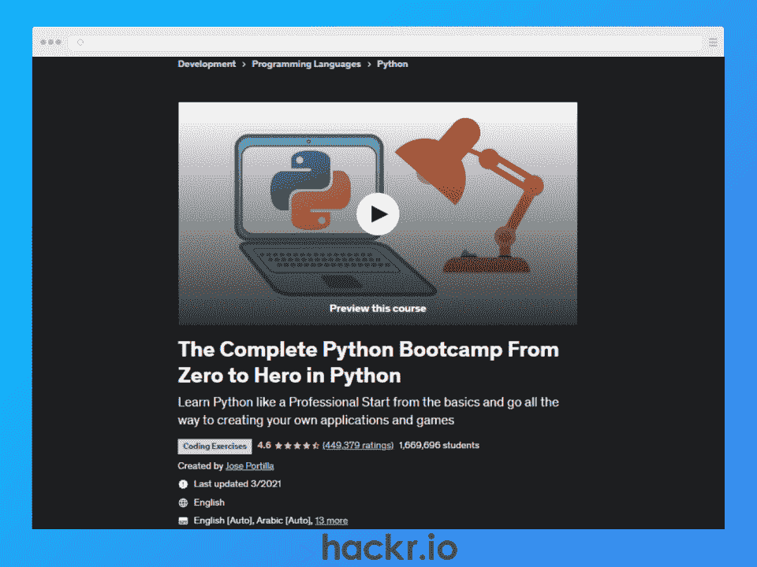](https://click.linksynergy.com/deeplink?id%3DjU79Zysihs4%26mid%3D39197%26murl%3Dhttps://www.udemy.com/course/complete-python-bootcamp/)

**[现在报名](https://click.linksynergy.com/deeplink?id%3DjU79Zysihs4%26mid%3D39197%26murl%3Dhttps://www.udemy.com/course/complete-python-bootcamp/)**

**评级:** 4.6

**先决条件:**无

我们都知道 Python 是当今最流行的编程语言之一。完整的 Python 训练营:Python 中的从零到英雄是为那些想从头开始学习的人设计的课程，但也适合那些已经了解一些 Python 的人。它涵盖了 Python 的基础知识，并为想要了解更多 Python 知识的人提供了高级内容。

在本课程中，学生通过观看视频和阅读文章一步一步地学习。对于一些实际的学习，还有十九个编码练习要完成。

这是当今最受欢迎的 Udemy 课程之一，拥有超过 160 万名学生。当你想到 Udemy 的顶级课程时，很容易想到完整的 Python Bootcamp。

值得一提的是，虽然这个课程已经过时了，而且已经有一段时间没有更新了，但是它的创建者每年都会发布一个版本。购买本课程可以让你终身受益。

**我们为什么喜欢这门课程**

完整的 Python boot camp:Python 中的从零到英雄是 Udemy 目录中的主要支柱之一。它的注册人数超过 160 万，评分为 4.6，评论近 45 万条，这表明了它的质量。我们推荐本课程，因为它提供了完整的 Python 3 学习体验，并通过编码练习来帮助巩固您所学的内容。

[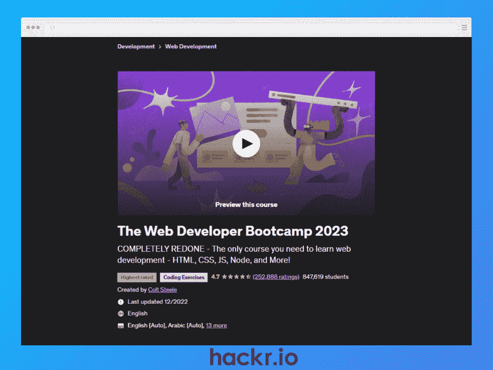](https://click.linksynergy.com/deeplink?id%3DjU79Zysihs4%26mid%3D39197%26murl%3Dhttps://www.udemy.com/course/the-web-developer-bootcamp/)

**[现在报名](https://click.linksynergy.com/deeplink?id%3DjU79Zysihs4%26mid%3D39197%26murl%3Dhttps://www.udemy.com/course/the-web-developer-bootcamp/)**

**评级:** 4.7

**先决条件:**无

Web Developer Bootcamp 是一门基础课程，帮助您了解 Web 开发所需的各种技术。本课程将教授 MongoDB、Node、JS、CSS、HTML 等语言的基础知识。它还将帮助你理解一些复杂但重要的主题，以制作基于浏览器的游戏和真正的网络应用程序。

这门课程非常适合希望了解 web 开发的初学者。它拥有理论和实践课程的完美平衡，为您提供开始全栈 web 开发职业生涯所需的实践经验。这个课程也帮助你在简历中增加一些额外的技能。

**我们为什么喜欢这门课程**

Web Developer Bootcamp 经常更新新内容，涵盖了成为全栈 Web 开发人员所需的所有主题。课程创建者柯尔特·斯蒂尔有着令人难以置信的履历，他甚至为以标准严格著称的平台 Udacity 创建了课程。他是 Web 开发方面值得信赖的权威。

[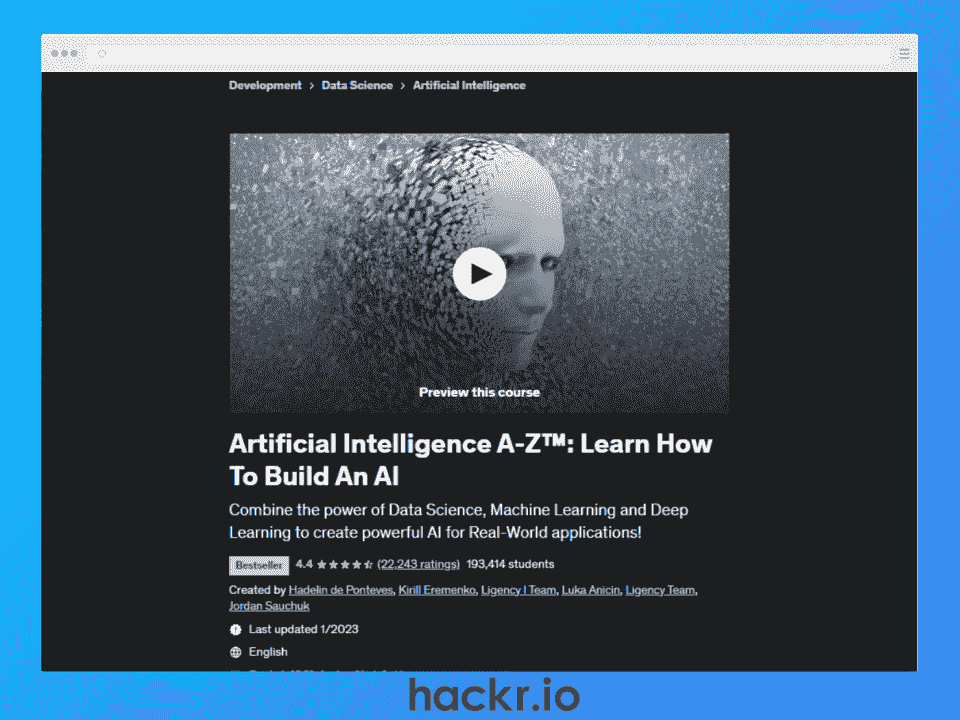](https://click.linksynergy.com/deeplink?id%3DjU79Zysihs4%26mid%3D39197%26murl%3Dhttps://www.udemy.com/course/artificial-intelligence-az/)

**[现在报名](https://click.linksynergy.com/deeplink?id%3DjU79Zysihs4%26mid%3D39197%26murl%3Dhttps://www.udemy.com/course/artificial-intelligence-az/)**

**级:** 4.4

**先决条件:**

*   高中数学
*   Python 基础知识

人工智能 A-Z:学习如何构建人工智能是在现实世界环境中工作的完美课程。在这门课的帮助下，你可以有效地将数据科学、机器学习和深度学习结合起来。

这门课程可以帮助你了解人工智能的基础知识。它还让你了解人工智能自我完善的编码，同时涵盖像深度 Q 学习和其他重要细节这样的主题。目标是帮助你建立和优化一个人工智能。

**我们为什么喜欢这门课程**

人工智能 A-Z 是 Udemy 上最受欢迎的人工智能课程之一。它已经有了数千名新注册者，现在的评分比几个月前还要高。虽然它仍然可以使用一些改进，我们推荐这门课程，因为它是进入人工智能的一个很好的方式，即使你是一个只有基本基础知识的初学者。

[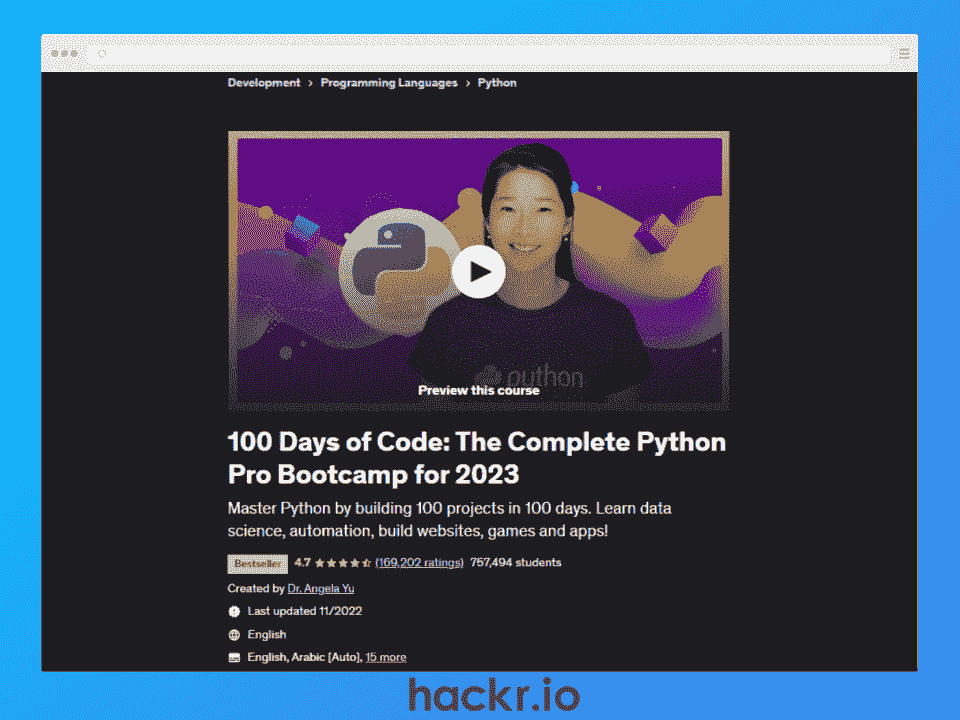](https://click.linksynergy.com/deeplink?id=jU79Zysihs4&mid=39197&murl=https%3A%2F%2Fwww.udemy.com%2Fcourse%2F100-days-of-code%2F)

**[现在报名](https://click.linksynergy.com/deeplink?id=jU79Zysihs4&mid=39197&murl=https%3A%2F%2Fwww.udemy.com%2Fcourse%2F100-days-of-code%2F)**

**评级:** 4.7

**先决条件:**

*   不需要编程经验
*   可接入互联网的 PC 或 Mac
*   不需要付费软件

如果你想学习 Python 而不必去不同的来源和课程，100 天的代码:2023 年完整的 Python Pro Bootcamp 是一个梦幻般的选择。这是 Udemy 上最受欢迎的在线课程之一，也受到许多 web 开发人员的高度评价和推荐。

除了教你掌握这门编程语言所需要知道的一切，这门课程的一个主要卖点是，你可以在一百天内每天学习少到一个小时。购买本课程后，您将获得终身使用权，如果您愿意，可以在将来继续练习编程项目。

**我们为什么喜欢这门课程**

虽然它只有上面 2022 年完整 Python Bootcamp 课程的一半左右的报名人数，但《100 天的代码:2023 年完整 Python Pro Bootcamp》对于想要从头开始的新手来说是另一个极好的选择。本课程不需要编程经验或付费软件，作者将带您一步一步地完成所有设置。

我们推荐这门课程，因为它可以让你在一百天内每天只花一个小时来学习！

[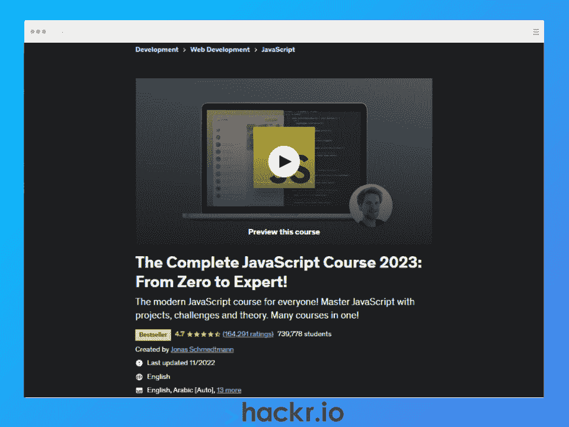](https://click.linksynergy.com/deeplink?id=jU79Zysihs4&mid=39197&murl=https%3A%2F%2Fwww.udemy.com%2Fcourse%2Fthe-complete-javascript-course%2F)

**[现在报名](https://click.linksynergy.com/deeplink?id=jU79Zysihs4&mid=39197&murl=https%3A%2F%2Fwww.udemy.com%2Fcourse%2Fthe-complete-javascript-course%2F)**

**评级:** 4.7

**先决条件:**

*   没有编码经验是必要的
*   对 HTML/CSS 的基本理解是好的，但不是必需的，因为包含了速成课程

没有编程经验不应该阻止你学习 JavaScript。完整的 JavaScript 课程 2023 让你从零开始，并让你成为一名高级 JavaScript 开发人员，自信地做好工作准备。

这门课教给学生基础知识，并向你展示成功所需的一切。它通过向您展示研究、工作流程和解决问题的技术，训练您像开发人员一样思考和工作。

为了帮助你练习你的技能，这门课包括五十多个挑战和作业(如果你被难住了，答案也包括在内)。你还必须建立六个现实世界的项目，你可以使用你的投资组合。

**我们为什么喜欢这门课程**

完整的 JavaScript 课程 2023 不仅会教你一切你需要知道的东西，而且还会通过 50 多个实际作业和挑战巩固你所学的东西。您也可以通过构建六个包含的项目来练习，稍后您可以将这些项目添加到您的文件夹中。

[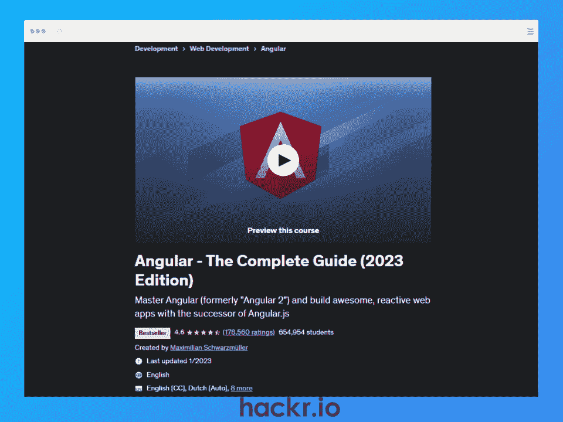](https://click.linksynergy.com/deeplink?id=jU79Zysihs4&mid=39197&murl=https%3A%2F%2Fwww.udemy.com%2Fcourse%2Fthe-complete-guide-to-angular-2)

**[现在报名](https://click.linksynergy.com/deeplink?id=jU79Zysihs4&mid=39197&murl=https%3A%2F%2Fwww.udemy.com%2Fcourse%2Fthe-complete-guide-to-angular-2)**

**评级:** 4.6

**先决条件:**

*   你不需要知道角度 1 或 2+
*   对 HTML 和 CSS 的基本理解会有所帮助，但不是强制性的
*   以前的打字稿知识是有帮助的，但不是必需的
*   您需要具备基本的 JavaScript 知识

Angular 是一个基于 TypeScript 的免费开源 web 应用框架。

本课程将教你使用 Angular 13 开发现代的、反应灵敏的、可扩展的 web 应用程序。您将学习如何创建简单和复杂的应用程序，允许您制作客户要求的任何应用程序。

本课程还教你如何使用当今最现代的 JavaScript 框架之一创建单页应用程序。您还将了解 Angular 应用程序的架构以及如何使用它。

最后，Angular -完全指南(2023 版)通过教你深入理解 Angular 的基本原理，让你成为一名前端开发人员。

**我们为什么喜欢这门课程**

我们推荐本课程，因为它非常详细地涵盖了您需要的每个主题。这门评价很高的课程将带您逐步完成从设置到部署的过程，课程创建者将为您提供大量指导和支持。这对希望成为前端开发人员的新人来说非常好，因为当你完成课程时，你将获得深刻的见解并构建一个主要项目。

[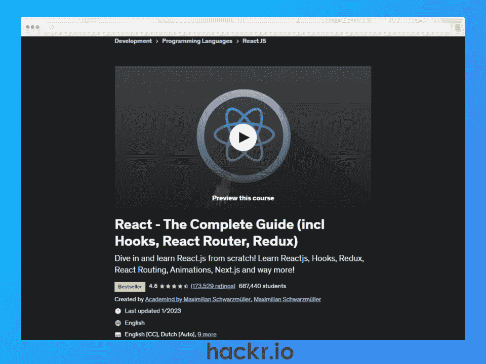](https://click.linksynergy.com/deeplink?id=jU79Zysihs4&mid=39197&murl=https%3A%2F%2Fwww.udemy.com%2Fcourse%2Freact-the-complete-guide-incl-redux)

**[现在报名](https://click.linksynergy.com/deeplink?id=jU79Zysihs4&mid=39197&murl=https%3A%2F%2Fwww.udemy.com%2Fcourse%2Freact-the-complete-guide-incl-redux)**

**评级:** 4.6

**先决条件:**

*   你需要了解 HTML、CSS 和 JavaScript 的基础知识
*   然而，您不需要成为 JavaScript 专家
*   ES6+ JavaScript 知识会有帮助，但不是必需的
*   不需要以前的 JavaScript 框架或 React 经验

这个经常更新的课程教你构建快速、强大、反应灵敏、最重要的是用户友好的 web 应用程序所需的一切。通过利用 [React](https://hackr.io/blog/react-vs-vue) 的力量，你将学会如何传递一个令人难忘的优秀的 UX。

React——完整的指南教你 React 组件和钩子，以及许多其他可以让你成为开发者的东西。本课程的一个主要目标是帮助你找到一份自由职业者的工作，或者在发展中最受欢迎的领域之一申请一份高薪职位。

**我们为什么喜欢这门课程**

课程创建者 Maximilian Schwarzmuller 定期更新 React - The Complete Guide 的新信息。该课程有效地教你构建快速反应的 web 应用程序所需的知识，帮助你为未来的开发人员职业生涯做准备。Schwarzmuller 非常详细地讲述了每一件事，将每个主题分解，以帮助学生尽可能多地理解。

[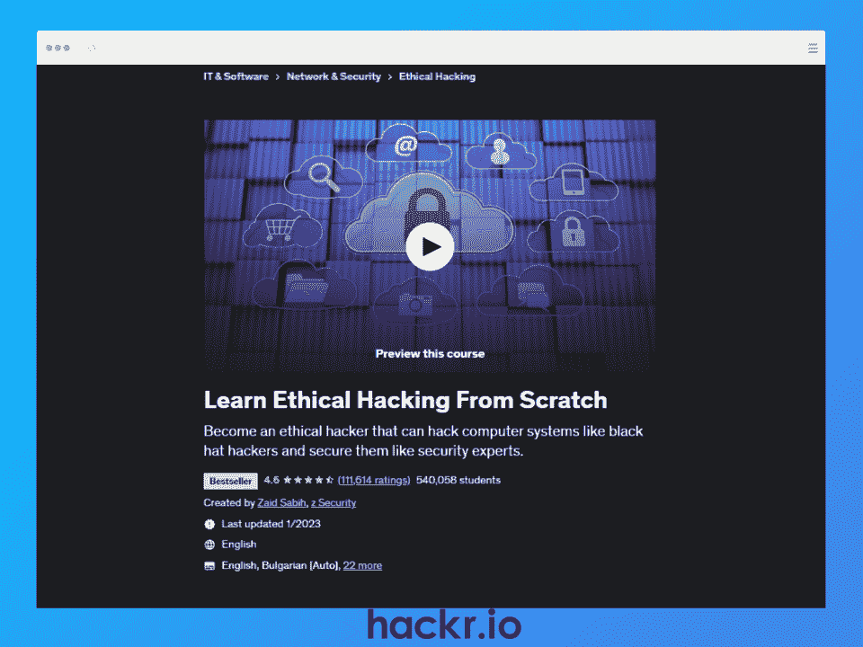](https://click.linksynergy.com/deeplink?id=jU79Zysihs4&mid=39197&murl=https%3A%2F%2Fwww.udemy.com%2Fcourse%2Flearn-ethical-hacking-from-scratch)

**评级:** 4.6

**先决条件:**

*   信息技术的基本知识和技能
*   不需要 Linux、黑客和编程知识
*   一台最低内存为 4GB 的计算机和任何操作系统(Windows、macOS 或 Linux)
*   对于涵盖 WiFi 破解的 10 个讲座，您需要一个支持监控模式的无线适配器(课程中将提供更多相关信息)

从头开始学习道德黑客涵盖了许多主题，这些主题可以让你从一无所知到达到中级水平。

它教你 Linux 的基础知识，让你对系统如何工作有一个基本的了解。您还将学习网络和网站如何工作，以便了解它们的漏洞。您还将学习使用黑客工具，如 Aircrack-ng、Metasploit 和 SQLmap。

这门课程为你提供了帮助你成为一名道德黑客所需的一切。通过本课程的学习，您可以开始识别和探索网络、网站等的漏洞，从而保护这些系统免受未来的攻击。

**我们为什么喜欢这门课程**

我们推荐这门课程，因为我们觉得它有可能成为 Udemy 上最好的课程——至少如果你想完全从零开始学习道德黑客的话。在接下来的指导下，你学习了从零到中级所需的一切。本课程不会帮助你马上成为专业人士，但它奠定了你入门所需的基础。

[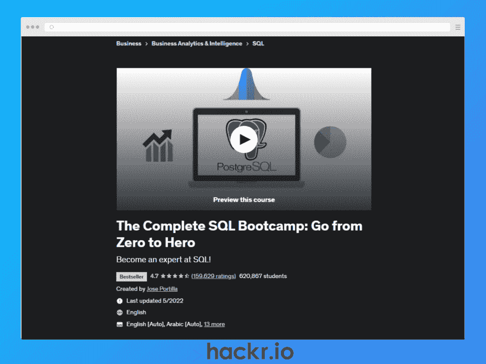](https://click.linksynergy.com/deeplink?id=jU79Zysihs4&mid=39197&murl=https%3A%2F%2Fwww.udemy.com%2Fcourse%2Fthe-complete-sql-bootcamp)

**[现在报名](https://click.linksynergy.com/deeplink?id=jU79Zysihs4&mid=39197&murl=https%3A%2F%2Fwww.udemy.com%2Fcourse%2Fthe-complete-sql-bootcamp)**

**评级:** 4.7

**先决条件:**无

完整的 SQL 训练营:从零到英雄将教你 PostgreSQL，这是目前世界上最受欢迎的技能之一。您将学习如何在 [SQL 数据库](https://hackr.io/blog/what-is-sql)中读取、写入和分析复杂的查询。

本课程中学到的技能可以转移到其他 SQL 数据库，这意味着您也可以使用 Microsoft SQL Server、MySQL、Oracle 和 Amazon Redshift。

您将学习所有的基础知识，包括基本的 SQL 语法、PgAdmin、PostgreSQL 和基本的数据分析。它将教你如何使用 Python 来继续提高你的 SQL 技能。在本课程中，您将立即开始边做边学，并且您的任务是做诸如建立和恢复数据库之类的事情。

当你作为一名开发人员工作时，你可能会遇到一些挑战性的任务和问题。

**我们为什么喜欢这门课程**

我们推荐 Complete SQL Bootcamp，不仅因为它是最受欢迎的 SQL 课程之一，还因为它可以说是 Udemy 中(在我们看来)对希望学习 SQL 的新手来说最好的课程。这门课最大的好处是你可以边做边学，这种方法可以真正有效地帮助你记住所学的知识。

**[现在报名](https://click.linksynergy.com/deeplink?id=jU79Zysihs4&mid=39197&murl=https%3A%2F%2Fwww.udemy.com%2Fcourse%2Faws-solutions-architect-professional)**

**评级:** 4.6

**先决条件:**

*   你必须有真实的 AWS 实践经验
*   您必须已经通过了 AWS 认证解决方案架构师助理考试(如果您需要，也有针对该级别的课程)
*   您可以学习 AWS 认证开发人员 SysOps 课程和 AWS 认证开发人员 DevOps Pro 课程，但它们不是必需的

ultimate AWS Certified Solutions Architect Professional 2022 经常更新，包含 500 多张幻灯片和一个可下载的 PDF，其中包含所有幻灯片以供参考。值得一提的是，在本课程中，您不会获得实际操作经验，因为它完全基于幻灯片。然而，本课程包含您通过 2022 年 AWS 认证解决方案架构师专业考试所需的一切。

**我们为什么喜欢这门课程**

最终的 AWS 认证解决方案架构师专家 2022 包含了通过 AWS 认证解决方案架构师专家认证 SAP-C02 评估所需了解的一切。除了经常更新之外，我们推荐这门课程总是直奔主题，这样你就可以不用费力地通过无用的填充来学习。

### **IT &软件**

[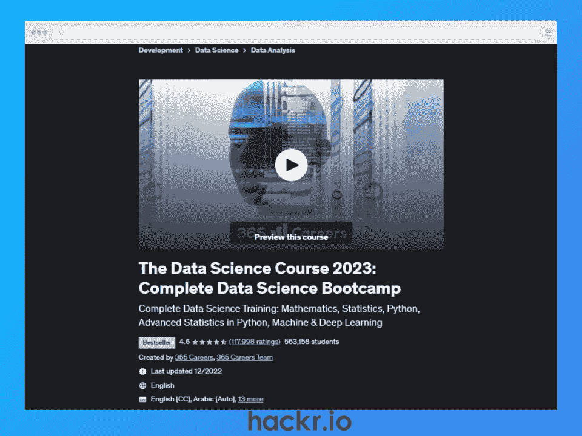](https://click.linksynergy.com/deeplink?id=jU79Zysihs4&mid=39197&murl=https%3A%2F%2Fwww.udemy.com%2Fcourse%2Fthe-data-science-course-complete-data-science-bootcamp)

**[现在报名](https://click.linksynergy.com/deeplink?id=jU79Zysihs4&mid=39197&murl=https%3A%2F%2Fwww.udemy.com%2Fcourse%2Fthe-data-science-course-complete-data-science-bootcamp)**

**评级:** 4.6

**先决条件:**

*   这门课程从最基本的开始，所以不要求你有任何经验
*   您必须安装 Anaconda(课程中有指南)
*   您需要 Microsoft Excel (2003、2010、2013、2016 或 365)

如果你一直在考虑[成为一名数据科学家](https://hackr.io/blog/how-to-become-a-data-scientist)，这门课程有你成功所需知道的一切。您将学到有价值的数据科学技能，并理解其背后的数学原理。您还将学习如何将从本课程中学到的一切应用到现实生活中。

在“数据科学课程 2023:完整的数据科学训练营”中，您将学习数据科学方面的热门技能，包括但不限于:

*   Python 编程
*   NumPy(使用 Python)
*   统计分析
*   海生的
*   Matplotlib
*   熊猫
*   高级统计分析
*   机器学习
*   （舞台上由人扮的）静态画面

**我们为什么喜欢这门课程**

随着对数据科学家需求的增长，拥有一门可以帮助你为职业生涯奠定基础的高质量课程变得至关重要。我们向初学者推荐这个完整的课程，因为它涵盖了你成功所需的各种主题和技能。每个主题都有深入的探讨，但为了避免过度，都被分解成容易理解的部分。

[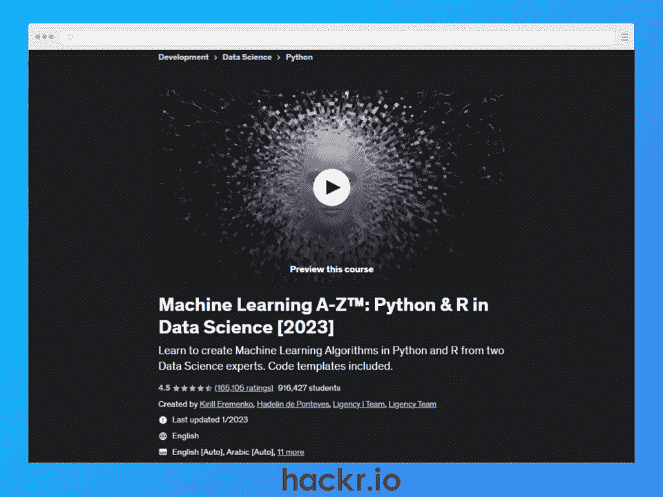](https://click.linksynergy.com/deeplink?id%3DjU79Zysihs4%26mid%3D39197%26murl%3Dhttps://www.udemy.com/course/machinelearning/)

**[现在报名](https://click.linksynergy.com/deeplink?id%3DjU79Zysihs4%26mid%3D39197%26murl%3Dhttps://www.udemy.com/course/machinelearning/)**

**评级:** 4.5

**先决条件:**

《机器学习 A-Z:数据科学中的 Python & R 实践》课程涵盖了机器学习的所有概念。本课程的主要目的是为初学者提供使用高中数学进行机器学习的必要基础。

为了帮助你更有效地理解机器学习，这个有趣的、精心制作的课程被分成十个容易理解的部分。当你完成本课程时，你可能能够处理各种模型，制作稳健的 ML 模型，学习如何准确预测，等等。

**我们为什么喜欢这门课程**

机器学习 A-Z 是这方面最受欢迎的在线课程之一。该课程拥有超过 900，000 名注册学员，仍然是该平台上构建最好的 ML 课程之一。本课程最大的优点之一是使用现实生活中的场景来更好地理解。机器学习 A-Z 是由一个声誉良好的专家团队创建的，他们经常更新课程。

[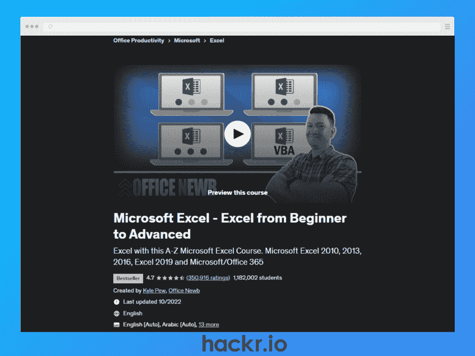](https://click.linksynergy.com/deeplink?id%3DjU79Zysihs4%26mid%3D39197%26murl%3Dhttps://www.udemy.com/course/microsoft-excel-2013-from-beginner-to-advanced-and-beyond/)

**[现在报名](https://click.linksynergy.com/deeplink?id%3DjU79Zysihs4%26mid%3D39197%26murl%3Dhttps://www.udemy.com/course/microsoft-excel-2013-from-beginner-to-advanced-and-beyond/)**

**评级:** 4.7

**先决条件:**

*   不需要事先了解 Microsoft Excel
*   教师建议您在听课时运行 Microsoft Excel 或 Microsoft 365 Excel

Microsoft Excel–Excel 从初学者到高级是一门综合课程，告诉你使用 Microsoft Excel 需要知道的一切。本课程分为四个主要部分，涵盖从基础到最高级的主题，帮助您更好地理解每一课。

**我们为什么喜欢这门课程**

本课程最棒的一点是，讲师是 Microsoft Office 主讲师和 Microsoft 认证培训师，拥有 20 多年的经验。通过他，你可以学到所有的诀窍，掌握使用微软 Excel 的艺术。它获得了 4.7/5 颗星的评分，拥有近 35 万的收视率和 110 多万名过去的学生，这证明了它的质量。

[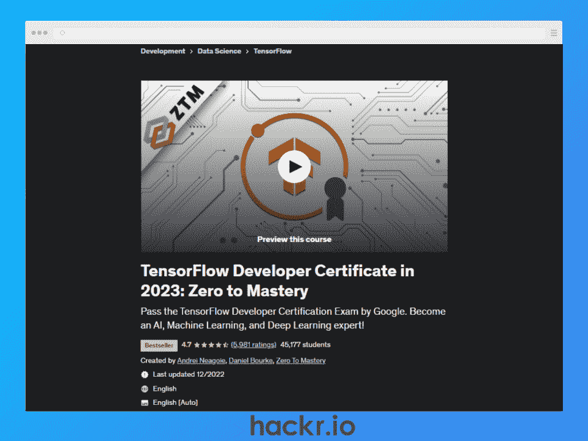](https://click.linksynergy.com/deeplink?id=jU79Zysihs4&mid=39197&murl=https%3A%2F%2Fwww.udemy.com%2Fcourse%2Ftensorflow-developer-certificate-machine-learning-zero-to-mastery%2F)

**[现在报名](https://click.linksynergy.com/deeplink?id=jU79Zysihs4&mid=39197&murl=https%3A%2F%2Fwww.udemy.com%2Fcourse%2Ftensorflow-developer-certificate-machine-learning-zero-to-mastery%2F)**

**评级:** 4.7

**先决条件:**

*   了解机器学习的基础知识不是必需的，但会有所帮助
*   计算机(任何操作系统)

虽然这是较新的 Udemy 在线课程之一，但对于那些想准备他们(谷歌)TensorFlow 开发者认证考试的人来说，2023 年 TensorFlow 开发者证书:零到精通仍然是一个极好的选择。

您将获得 63 小时的课程，从 TensorFlow 的基础知识一直到最终的里程碑项目，帮助您巩固所学内容。

**我们为什么喜欢这门课程**

如果你喜欢开门见山，从客观且容易掌握的课程中学习，那么这门课程就是为你准备的。本课程深入探讨了您准备认证评估所需的一切。由于编码练习和里程碑项目，你也可以在实践中学习。

### **商业和营销**

[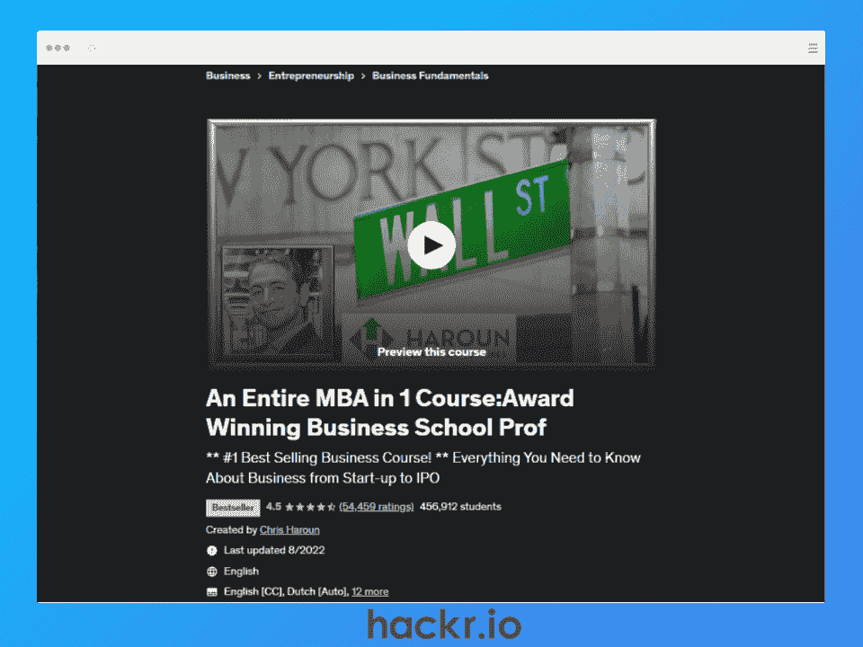](https://click.linksynergy.com/deeplink?id=jU79Zysihs4&mid=39197&murl=https%3A%2F%2Fwww.udemy.com%2Fcourse%2Fan-entire-mba-in-1-courseaward-winning-business-school-prof%2F)

**[现在报名](https://click.linksynergy.com/deeplink?id=jU79Zysihs4&mid=39197&murl=https%3A%2F%2Fwww.udemy.com%2Fcourse%2Fan-entire-mba-in-1-courseaward-winning-business-school-prof%2F)**

**评级:** 4.5

**先决条件:**无

这门课教你从头开始创办公司所需要知道的一切，包括为你的企业建立最有利(但正确)的法律实体，这样你就可以在你的公司被起诉的情况下保护你的家庭和资产。

在一门完整的 MBA 课程中，作者详细介绍了如何创建金融模型和分析公司财务状况，什么是微观和宏观经济学，如何从定量和定性的角度分析市场，以及如何更好地沟通和建立网络。他的课程甚至触及了税收的话题！

**我们为什么喜欢这门课程**

一门完整的 MBA 课程的创始人是克里斯·哈龙(Chris Haroun)，他是一位获奖的 MBA 教授，也是一位成功的作家和风险投资家。作为这方面的权威，哈龙的见解是有价值和有影响力的。

[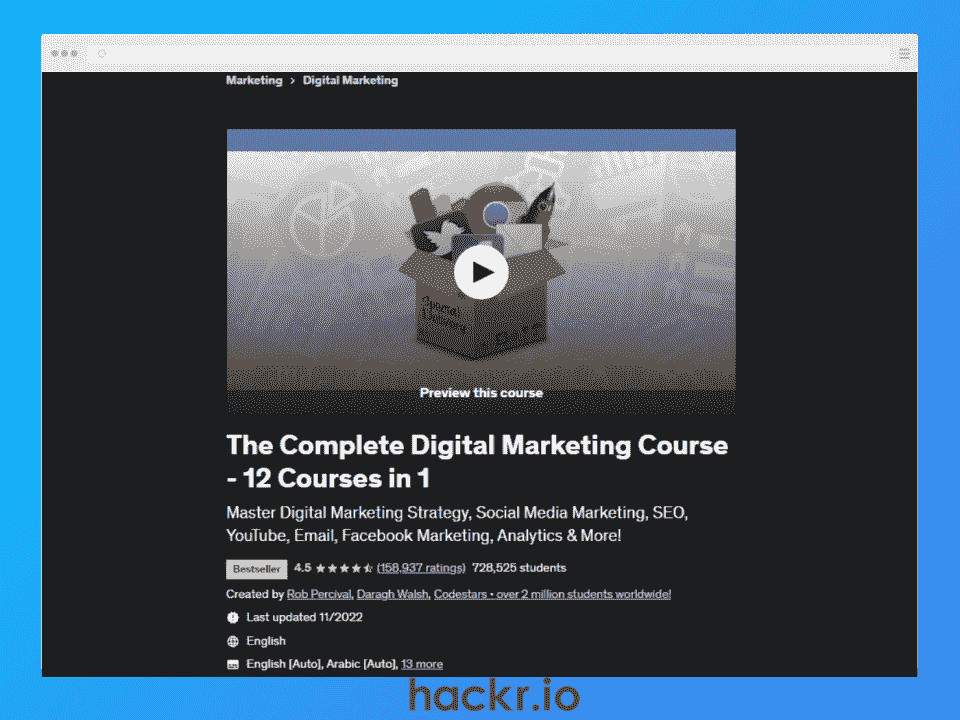](https://click.linksynergy.com/deeplink?id%3DjU79Zysihs4%26mid%3D39197%26murl%3Dhttps://www.udemy.com/course/learn-digital-marketing-course/)

**[现在报名](https://click.linksynergy.com/deeplink?id%3DjU79Zysihs4%26mid%3D39197%26murl%3Dhttps://www.udemy.com/course/learn-digital-marketing-course/)**

**评级:** 4.5

**先决条件:**

*   不需要经验

完整的数字营销课程- 1 中的 12 门课程适用于所有类型的企业，无论销售的是什么产品或服务。如果你想了解更多关于数字营销的知识，这是最全面的营销课程之一，也是最好的 Udemy 在线课程之一。

这门课程打开了各种主题的大门，如谷歌分析，脸书营销(或社会媒体营销)，YouTube，搜索引擎优化等。对于那些希望有机会找到一份高薪的好自由职业者来说，这是完美的选择。这门课程也是为那些希望增加销售额和流量的网站所有者而开设的。

当你第一次开始这门课时，你首先要学习的是数字营销的基础知识。接下来，你将学习更复杂的话题，帮助你发展作为数字营销人员的技能。当你完成的时候，你可能已经学到了足够多的东西来帮助你吸引你的目标受众，留住你的老客户，并给潜在的潜在客户留下深刻印象。

**我们为什么喜欢这门课程**

本课程将自己定位为 12 门课程合二为一，涵盖了你开始数字营销生涯所需的所有科目。无论你是想进入社交媒体营销还是数字营销的其他方面，你都会在这些易于理解的课程中找到你需要的东西。课程创建者还确保他们经常更新，并在需要时为学生提供出色的支持。

[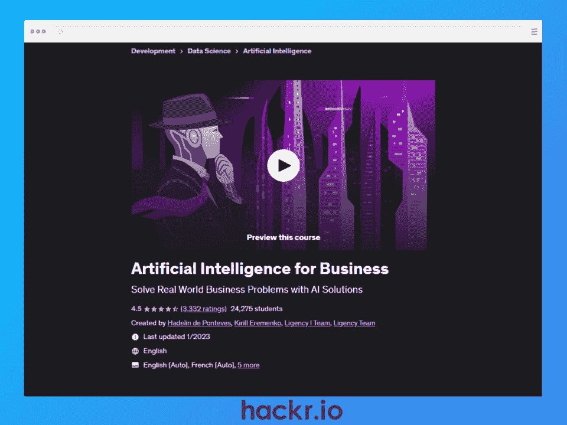](https://click.linksynergy.com/deeplink?id%3DjU79Zysihs4%26mid%3D39197%26murl%3Dhttps://www.udemy.com/course/ai-for-business/)

**[现在报名](https://click.linksynergy.com/deeplink?id%3DjU79Zysihs4%26mid%3D39197%26murl%3Dhttps://www.udemy.com/course/ai-for-business/)**

**评级:** 4.5

**先决条件:**

*   高中数学
*   Python 基础知识

商业人工智能是一门旨在帮助人们了解如何在商业环境中实施人工智能的课程。本课程将教你在以人工智能为中心的平台上工作时的各种技巧和技术。

**我们为什么喜欢这门课程**

尽管这门课程很小，也不太受欢迎，但我们还是推荐它，因为它是为数不多的讨论人工智能以及如何在商业世界中使用它的课程之一。课程很简单，课程创建者努力确保学生理解主题是如何分解的。

**[现在报名](https://click.linksynergy.com/deeplink?id=jU79Zysihs4&mid=39197&murl=https%3A%2F%2Fwww.udemy.com%2Fcourse%2Fthe-complete-financial-analyst-course%2F)**

**评级:** 4.6

**先决条件:**

*   不需要事先了解微软 Excel 或财务
*   建议使用 Microsoft Excel

顾名思义，完整的金融分析师培训和投资课程是一门完整的课程，教你在短短 22 小时内成为一名金融分析师。

这门课教你如何选择股票、管理投资组合和建立金融模型。它还向您展示了什么是风险管理以及它是如何工作的，以便您可以管理自己的风险。

本课程中您可能会学到的其他内容包括但不限于:

*   如何给一家公司估值
*   什么是首次公开募股，它是如何运作的
*   如何想出制胜的投资点子
*   如何理解和分析资产负债表

这门课程甚至教你如何向投资组合经理推销想法。

**我们为什么喜欢这门课程**

完整的金融分析师课程 2023 对于那些想在短短 22 小时内开始金融职业生涯的人来说是一个很好的课程。作为一门畅销课程，你可以期待高质量的课程教你技能。课程创建者也分配有价值的职业建议，可以指导你的道路。

**[现在报名](https://click.linksynergy.com/deeplink?id=jU79Zysihs4&mid=39197&murl=https%3A%2F%2Fwww.udemy.com%2Fcourse%2Finstagram-marketing-for-small-businesses%2F)**

**评级:** 4.5

**先决条件:**

*   移动设备上的 Instagram

Instagram Marketing 2023:insta gram 成长完全指南包含利用 insta gram 的所有功能来增加粉丝的分步指南。在本课程中，您将学习如何设置个人或商业 Instagram。它还教你如何建立自己的品牌，以增加你的追随者，并将他们转化为付费客户。

该课程声称，当你完成时，你应该能够学到足够多的东西，以吸引 1 万名真实世界的有机和有针对性的 Instagram 粉丝到你的账户。

**我们为什么喜欢这门课程**

如果您担心本课程中的信息可能最终会过时，您可能会很高兴地知道作者会不断更新以确保所有内容都保持相关。该课程将于 2023 年更新，可能很快就会到来。

然而，我们推荐这门课程，因为它有大量的常青树内容，可以帮助你在 Instagram 上成长，无论是在你的个人账户还是商业账户上。

### **艺术、设计和摄影**

[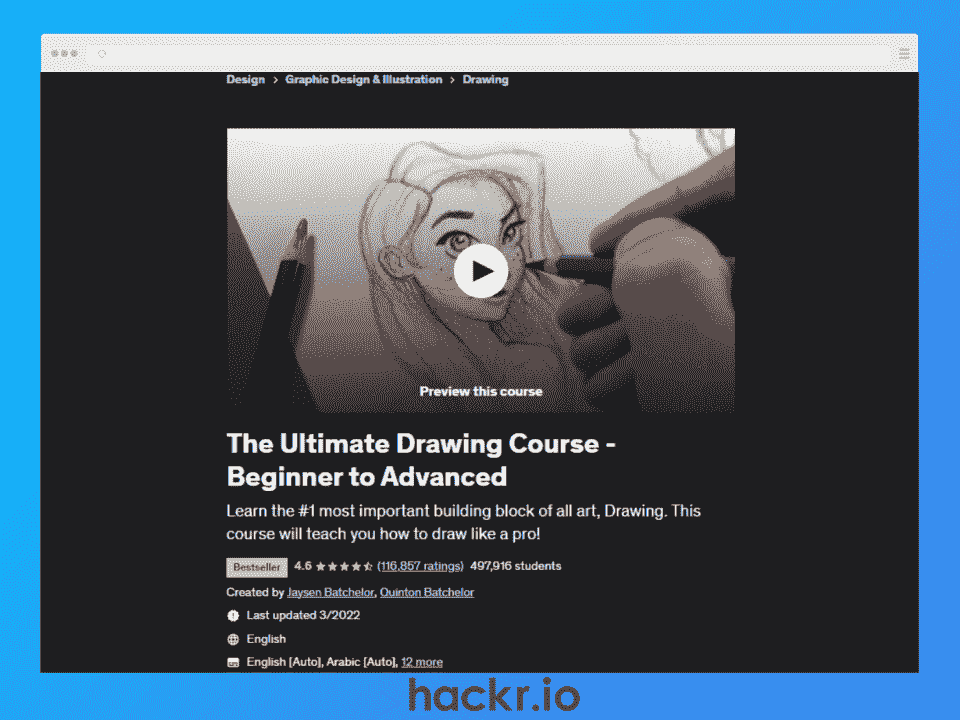](https://click.linksynergy.com/deeplink?id=jU79Zysihs4&mid=39197&murl=https%3A%2F%2Fwww.udemy.com%2Fcourse%2Fthe-ultimate-drawing-course-beginner-to-advanced%2F)

**[现在报名](https://click.linksynergy.com/deeplink?id=jU79Zysihs4&mid=39197&murl=https%3A%2F%2Fwww.udemy.com%2Fcourse%2Fthe-ultimate-drawing-course-beginner-to-advanced%2F)**

**评级:** 4.6

**先决条件:**

*   纸张、铅笔、橡皮擦和尺子等基本绘画材料

画画是许多人一直希望自己能做的事情。如果你希望你也能画画，这门课可能正适合你。

终极绘画课程-从初级到高级教授绘画的基础知识，这样你最终可以直接从你的脑海中画出物体和图像。除了理解艺术的基本原理，这门课程还帮助你学习用现实主义的视角来绘画。

有了这个类，光和影可能不再是你的敌人，因为它教你如何正确地渲染两者。你还将学习画人脸和人物。

**我们为什么喜欢这门课程**

终极绘画课程是一门非常受欢迎、最畅销的课程，带你从零到专业。你一个接一个地学习主题，有大量的指导和演示来确保你直观地学习。课程作者还提供了大量的提示和技巧来加深你的知识。

[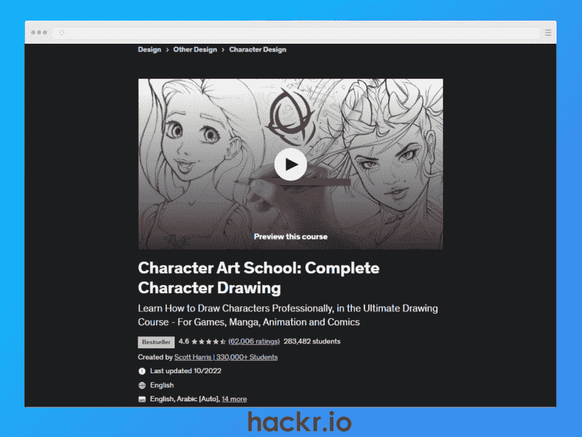](https://click.linksynergy.com/deeplink?id=jU79Zysihs4&mid=39197&murl=https%3A%2F%2Fwww.udemy.com%2Fcourse%2Fcharacter-art-school-complete-character-drawing%2F)

**[现在报名](https://click.linksynergy.com/deeplink?id=jU79Zysihs4&mid=39197&murl=https%3A%2F%2Fwww.udemy.com%2Fcourse%2Fcharacter-art-school-complete-character-drawing%2F)**

**评级:** 4.6

**先决条件:**

*   纸和铅笔或数字艺术工具，如电脑和绘图板

人物艺术学校:完整的人物绘画课程教你如何从你的头脑和想象中画出图像——而且要快。它向你展示了传统和数字艺术工具的技术，这样你就可以选择你的媒体。

这门课主要是帮助你学会画各种风格的人物，这样你就可以最终把他们栩栩如生地表现出来。为漫画、漫画、电影、动画和游戏绘制角色。您还将学习在 2D 和 3D 中绘制面部、身体和手。

您还可以通过购买获得价值 7 GB 的免费艺术资源。

**我们为什么喜欢这门课程**

如果你想学习如何画画，但又想直接创造你的角色，角色艺术学校是一个很好的课程。如果你想学习各种风格的绘画，我们推荐这门课程。7GB 的免费艺术资源让交易变得更加甜蜜。

**[现在报名](https://click.linksynergy.com/deeplink?id=jU79Zysihs4&mid=39197&murl=https%3A%2F%2Fwww.udemy.com%2Fcourse%2Fthe-ultimate-digital-painting-course-beginner-to-advanced%2F)**

**评级:** 4.6

**先决条件:**

*   数字绘画软件
*   绘图板(类似 Wacom)
*   或者是装有数码绘画软件的平板电脑，比如装有 Procreate 的 iPad

如果你不知道如何绘画，终极数字绘画课程:初学者到高级向你展示基础。它教你足够的进展到角色设计和概念艺术创作，所以你可以让你的想法来生活。您还将学习透视，这样您就可以创建逼真的背景和场景。

这个课程教你色彩理论，帮助你更好的传达你想要的东西。你还将学习数字绘画技术——通过足够的练习，足以学会如何创作照片般逼真的绘画。

**我们为什么喜欢这门课程**

我们推荐终极数字绘画课程，因为它教你如何进行数字绘画，并向你展示绘画的基础。如果你是一个完全的艺术新手，这个课程是一个一站式商店，为你成为一个数字画家所需要知道的一切。

[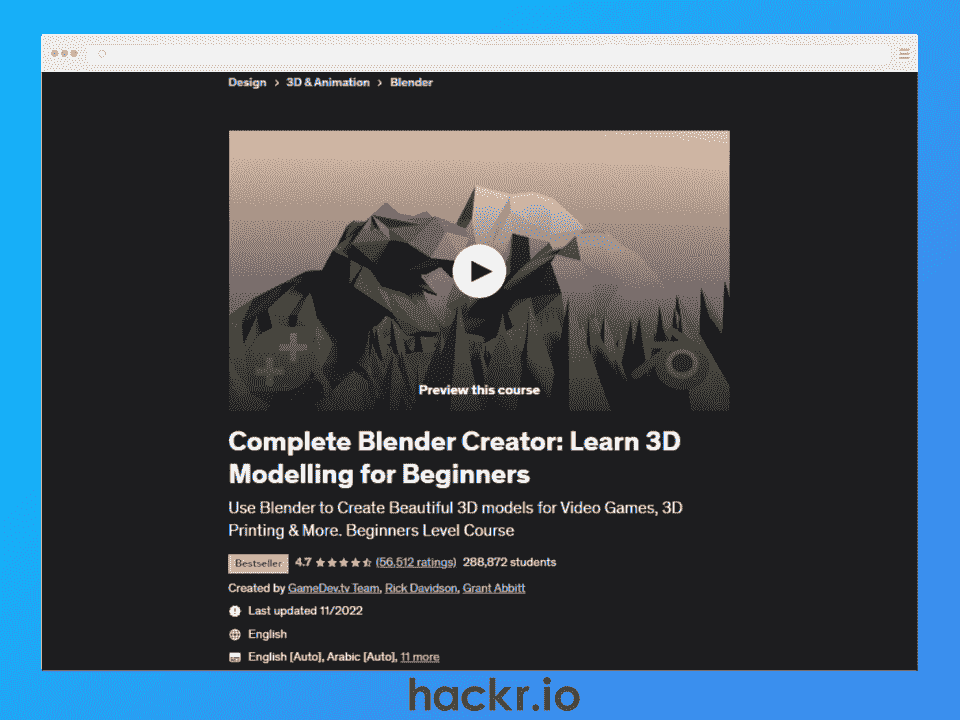](https://click.linksynergy.com/deeplink?id=jU79Zysihs4&mid=39197&murl=https%3A%2F%2Fwww.udemy.com%2Fcourse%2Fblendertutorial%2F)

**[现在报名](https://click.linksynergy.com/deeplink?id=jU79Zysihs4&mid=39197&murl=https%3A%2F%2Fwww.udemy.com%2Fcourse%2Fblendertutorial%2F)**

**评级:** 4.7

**先决条件:**

*   PC 或 Mac 电脑能够运行 Blender，版本 2.8 及以上

如果你曾经想学习 3D 建模，这个课程将教你所有你需要知道的关于 Blender 的东西，一个免费的开源 3D 软件。Blender 是市场上最受欢迎的 3D 建模软件之一，免费的事实使它更容易使用——只要你有一台能够运行它的计算机。

完整的 Blender Creator:初学者学习 3D 建模将帮助你理解建模的原则，这样你就可以创建 3D 模型和你自己的材料。它还将向您展示如何 UV 映射，然后展开您的模型。

最后，如果你想学习如何创建 3D 动画，这个课程也可以教你动画的基础知识，这样你就可以开始使用 CGI 等。

**我们为什么喜欢这门课程**

完整的 Blender Creator:初学者学习 3D 建模对于那些想学习如何进行 3D 创作的人来说是一个很好的起点。我们喜欢它的深度，并涵盖单独的主题，使其易于理解，即使是初学者。

**[现在报名](https://click.linksynergy.com/deeplink?id=jU79Zysihs4&mid=39197&murl=https%3A%2F%2Fwww.udemy.com%2Fcourse%2Fgraphic-design-masterclass-everything-you-need-to-know%2F)**

**评级:** 4.7

**先决条件:**

*   访问 Adobe Photoshop、InDesign 和 Illustrator 等设计程序(建议使用 CS6 或更高版本)
*   如果您没有 Adobe 程序，您可以尝试 Affinity Photo、Publisher 或 Designer 等替代程序
*   该软件不包含在您购买的本课程中

平面设计大师班-学习伟大的设计是一个班，可以教你设计的基本原理，如色彩理论，排版，布局，和其他设计技巧和理论。

本课程教你如何为你的客户制作品牌包装，包括商标。它还可以帮助您了解 Adobe 软件套件中的功能和工具，如 Photoshop、InDesign 和 Illustrator。该课程可以帮助您掌握 Adobe Illustrator 中的工具(或其替代工具 Affinity Designer 的基础)。如果你还在学习 Photoshop，你可以学习最好的无损编辑技术和照片处理。

除了设计，这门课还向你展示头脑风暴技术，帮助你激发创造力。它还可以教你预测设计的未来趋势，帮助你跟上最新的潮流。

**我们为什么喜欢这门课程**

Lindsay Marsh 深入探讨了各种主题，并为完全的初学者分解了所有内容。她用友好的语气讲述她的课程，并在给你一个活动做之前示范每个方面。这些活动可以提供实践经验。你也可以深入了解作为一名平面设计师的感受。我们向初学者推荐这一点，但即使那些有一点经验的人也可能会发现一些有见地的教训。

[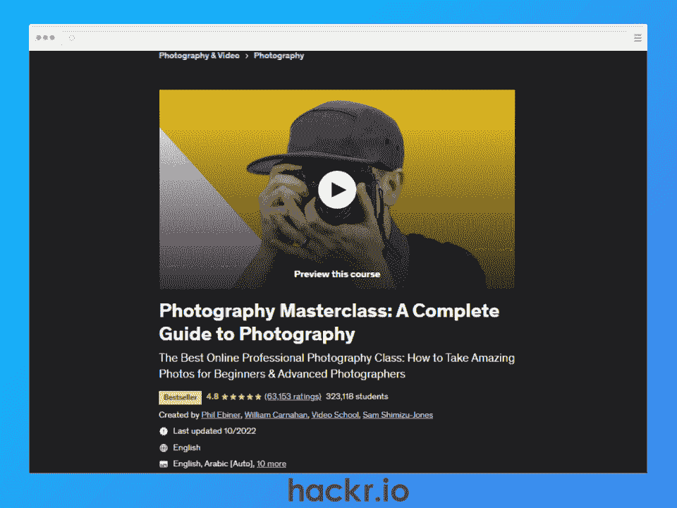](https://click.linksynergy.com/deeplink?id=jU79Zysihs4&mid=39197&murl=https%3A%2F%2Fwww.udemy.com%2Fcourse%2Fphotography-masterclass-complete-guide-to-photography%2F)

**[现在报名](https://click.linksynergy.com/deeplink?id=jU79Zysihs4&mid=39197&murl=https%3A%2F%2Fwww.udemy.com%2Fcourse%2Fphotography-masterclass-complete-guide-to-photography%2F)**

**评级:** 4.8

**先决条件:**

*   不需要昂贵的照相机。如果你没有智能手机，你可以从智能手机开始
*   不需要摄影知识

本课程专为绝对初学者设计，可以帮助你用自己拍摄的精彩照片给朋友和家人留下深刻印象。开始这门课时，你将学习不同类型的摄影，如肖像、航拍、风景、野生动物、产品摄影等等。

本课程最精彩的部分之一也是摄影中最复杂的部分之一——自然光和闪光灯。您还将了解相机设置和图像合成。

如果你想让摄影成为副业或职业，摄影大师班:摄影完全指南可以告诉你如何专业地编辑你的照片，并用摄影赚钱。

**我们为什么喜欢这门课程**

这个最畅销的课程是平台上评分最高的(摄影)课程之一。如果你想改善你的照片，从而产生令人印象深刻的效果，我们推荐这个摄影大师班。最棒的是，你不需要一个花哨的相机就可以开始——你只需要用你的智能手机就可以开始了。

### **个人发展**

[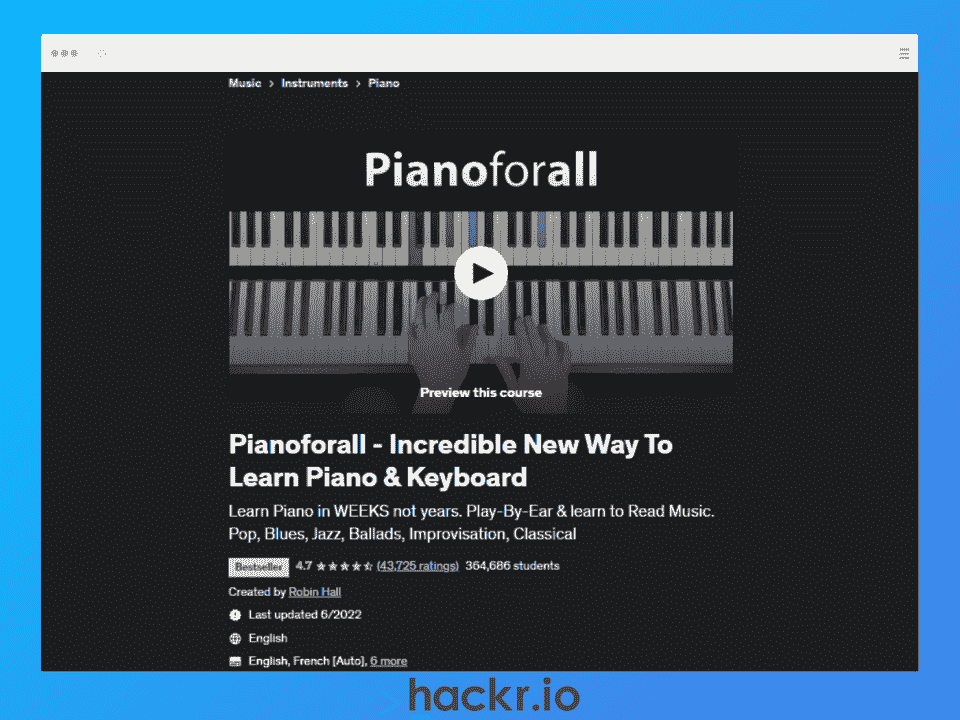](https://click.linksynergy.com/deeplink?id=jU79Zysihs4&mid=39197&murl=https%3A%2F%2Fwww.udemy.com%2Fcourse%2Fpianoforall-incredible-new-way-to-learn-piano-keyboard%2F)

**[现在报名](https://click.linksynergy.com/deeplink?id=jU79Zysihs4&mid=39197&murl=https%3A%2F%2Fwww.udemy.com%2Fcourse%2Fpianoforall-incredible-new-way-to-learn-piano-keyboard%2F)**

**评级:** 4.7

**先决条件:**

*   没有钢琴的经验或知识是必要的
*   钢琴或键盘
*   每天练习 20 分钟以获得最佳进步
*   适合 10 岁以上的青少年，不适合儿童

如果你一直想学习演奏一种乐器，钢琴可能是一种学习键盘或钢琴的好方法。

Pianoforall 通过超过 23.5 小时的视频教你弹奏键盘或钢琴的绝对基础。每个视频都有一个可打印的 PDF，您可以在键盘上学习和演奏时查看。

这门课程可以带你从初级水平到中级水平，同时教你基本的技术，帮助你从一开始就听起来像一个专业人士。你还将学习如何阅读乐谱，用耳朵演奏，以及演奏任何风格的音乐。

**我们为什么喜欢这门课程**

我们为那些想实现学琴梦想的人推荐 Pianoforall。我们喜欢课程的分解方式，也欣赏视频提供了你可以重新观看的适当演示。

[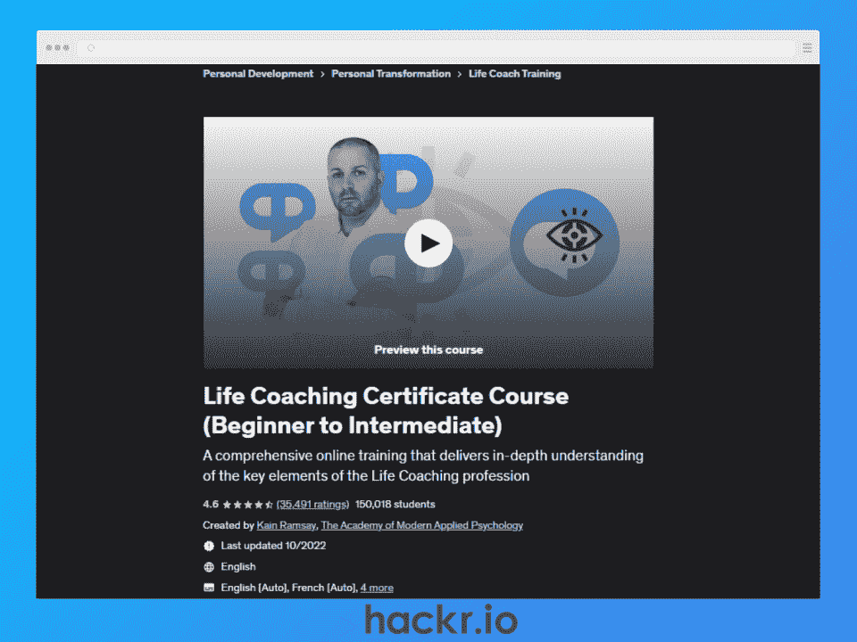](https://click.linksynergy.com/deeplink?id=jU79Zysihs4&mid=39197&murl=https%3A%2F%2Fwww.udemy.com%2Fcourse%2Flife-coaching-online-certification-course-life-coach-training%2F)

**[现在报名](https://click.linksynergy.com/deeplink?id=jU79Zysihs4&mid=39197&murl=https%3A%2F%2Fwww.udemy.com%2Fcourse%2Flife-coaching-online-certification-course-life-coach-training%2F)**

**评级:** 4.6

**先决条件:**

*   没有生活教练的经验是必需的
*   鼓励做笔记，以帮助你更好地记住信息
*   互联网连接
*   智能手机、平板电脑或台式机

生活教练证书课程-从初级到高级使用一种经过验证的生活教练方法，这种方法已经在 2000 多人身上实践过。这门课程教你如何带领人们进入提高创造力、创新力和生产力的状态。你还将学会通过帮助个人学习和打破他们可能有的任何无效的循环行为来促进改变。

为了帮助你成为一个更好的生活教练，这门课教你如何帮助人们解决他们的问题，帮助他们创造成长的机会。它还会帮助你指导客户，教他们更愿意为自己的目标和结果负责。

本课程将向您展示沟通和建立融洽关系的有效方法。最后，您将学习决策的艺术以及如何引导客户通过同样的过程。

**我们为什么喜欢这门课程**

那些想成为生活教练的人可以从这门课程中受益。你学习绝对的基础知识，但是课程作者也教你更高级的知识。我们不仅向有抱负的生活教练推荐这门课程，也向希望个人成长的人推荐这门课程。这门课还穿插了一些幽默，以保持新鲜感。

[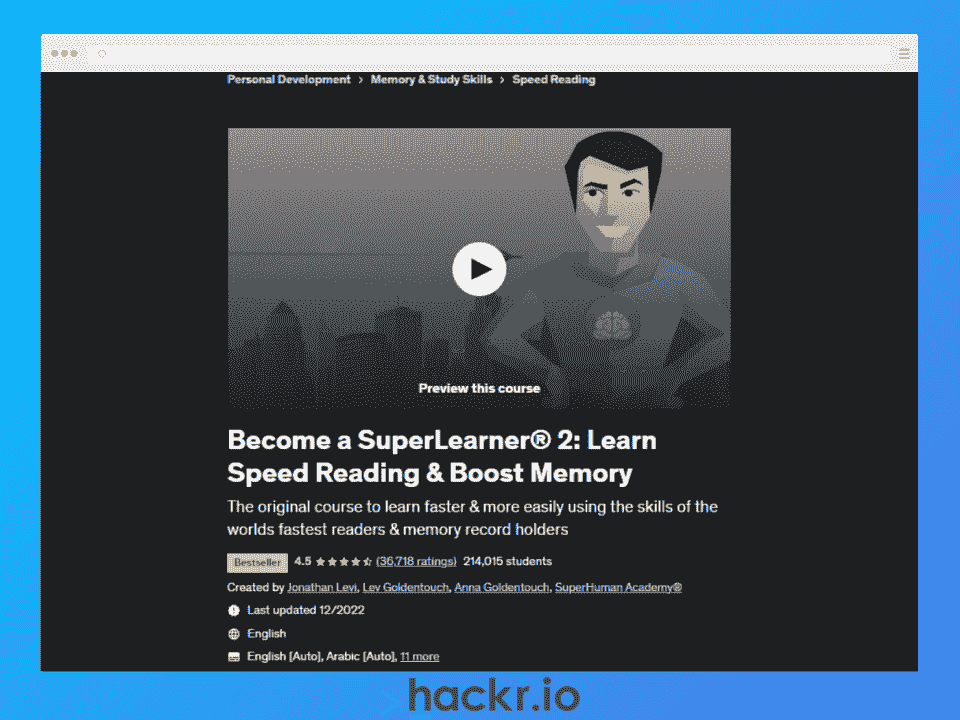](https://click.linksynergy.com/deeplink?id=jU79Zysihs4&mid=39197&murl=https%3A%2F%2Fwww.udemy.com%2Fcourse%2Fbecome-a-superlearner-2-speed-reading-memory-accelerated-learning%2F)

**[现在报名](https://click.linksynergy.com/deeplink?id=jU79Zysihs4&mid=39197&murl=https%3A%2F%2Fwww.udemy.com%2Fcourse%2Fbecome-a-superlearner-2-speed-reading-memory-accelerated-learning%2F)**

**评级:** 4.5

**先决条件:**

*   那些有学习或视觉障碍的人被敦促在购买之前与课程教师联系，以便他们能帮助你成功

成为一个超级学习者 2 -增强你的记忆教你一些技巧，让你读得更快，大约比普通大学毕业生的阅读速度快三倍。教师还说，你还应该能够保持高于平均水平的信息记忆和阅读理解率。你还将学习掌握记忆技巧，帮助你在需要的时候回忆起你需要的东西。

**我们为什么喜欢这门课程**

虽然这个课程比较短，但它充满了有见地的建议，可以帮助你成为一个更好的学习者。

[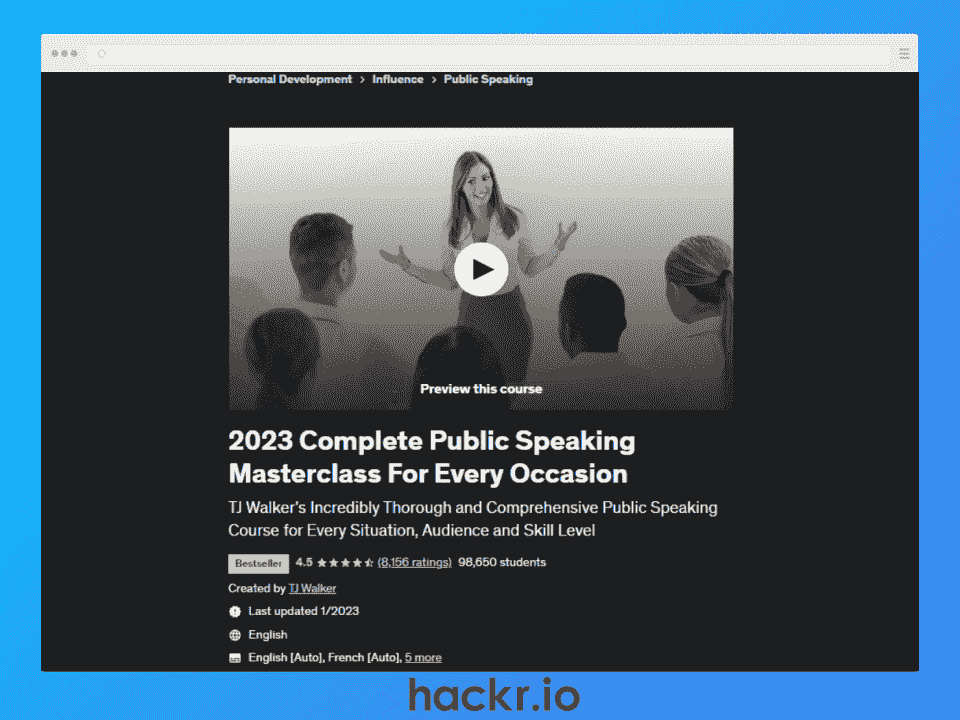](https://click.linksynergy.com/deeplink?id=jU79Zysihs4&mid=39197&murl=https%3A%2F%2Fwww.udemy.com%2Fcourse%2Fthe-complete-public-speaking-masterclass-for-every-occasion%2F)

**[现在报名](https://click.linksynergy.com/deeplink?id=jU79Zysihs4&mid=39197&murl=https%3A%2F%2Fwww.udemy.com%2Fcourse%2Fthe-complete-public-speaking-masterclass-for-every-occasion%2F)**

**评级:** 4.5

**先决条件:**

*   学习课程时愿意大声说出来
*   愿意走出舒适区

2023 年公共演讲大师班课程可以教你如何在任何必须公开演讲的场合显得放松、自信和舒适。该课程还声称能够教你如何更令人难忘地交流，并留下印象，这样你就可以潜在地影响你的听众。

如果你在发音上有困难，这门课可以帮助你说得更清楚，更容易理解。你还将学会在公开演讲时该怎么做，不管你的听众有多少，也不管你身处何种场合。

**我们为什么喜欢这门课程**

帮助你个人发展的最好方法之一就是成为一个更好的沟通者。本课程旨在通过向你展示技巧和诀窍来帮助你，帮助你克服你的口语焦虑，并教你如何最佳实践来帮助你随着时间的推移而提高。

[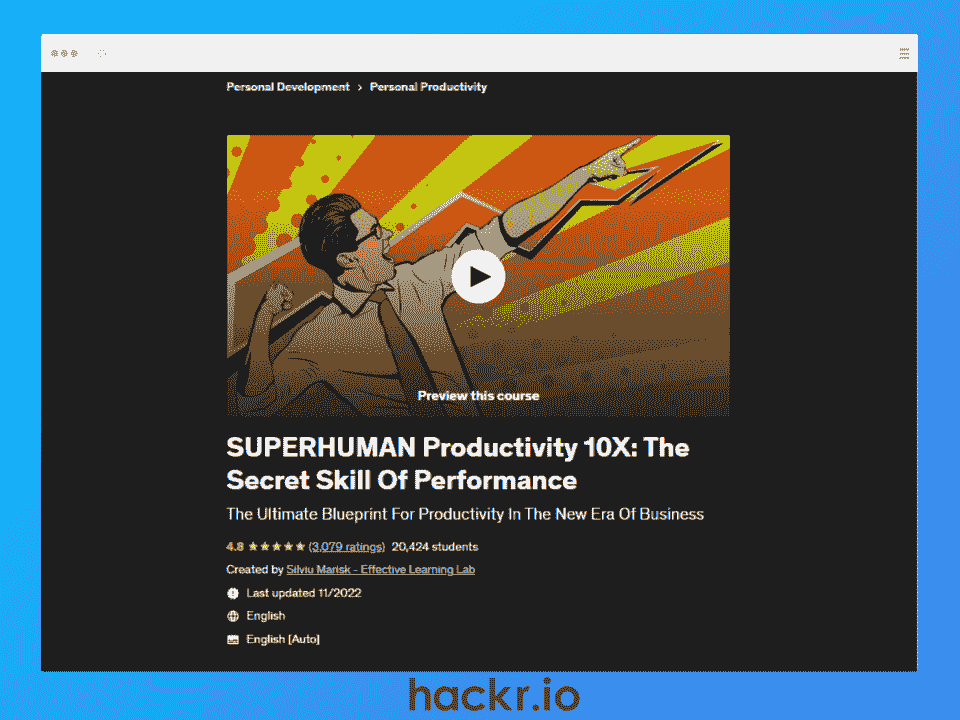](https://click.linksynergy.com/deeplink?id=jU79Zysihs4&mid=39197&murl=https%3A%2F%2Fwww.udemy.com%2Fcourse%2Fproductivity-10x-productivity%2F)

**[现在报名](https://click.linksynergy.com/deeplink?id=jU79Zysihs4&mid=39197&murl=https%3A%2F%2Fwww.udemy.com%2Fcourse%2Fproductivity-10x-productivity%2F)**

**评级:** 4.7

**先决条件:**

*   开放思想
*   愿意学习和应用材料
*   纸/笔

如果你不断与生产力斗争，超人生产力 10X 可以通过向你展示提示，技巧和技术来帮助你提高。这个 4.5 小时的课程很短，但它提供了很好的见解，你可以用它来提高你的日常生产力。

**我们为什么喜欢这门课程**

课程创建者席尔武·马里斯克向你展示了一个简单的方法来帮助你提高工作效率，减少拖延。他大胆断言，你可以在一夜之间提高效率。我们推荐本课程，因为它提供了带有具体、实用和可行建议的新鲜内容。

## **赠送 Udemy 课程**

如果你曾经想赠送知识，你可能会很高兴知道你可以赠送 Udemy 提供的许多在线课程。

购买 Udemy 在线课程作为礼物非常简单。只需遵循以下步骤:

1.  转到您想作为礼物赠送的课程的登录页。寻找“添加到购物车”按钮并向下滚动，直到找到**赠送此课程**。有时这个链接位于下面的截图中，但在某些情况下，你可以直接在“立即购买”按钮下面找到它。您可以在“添加到购物车”按钮下找到“赠送本课程”链接。
2.  在下一页，您需要填写一份表格，其中包含您的预定收件人的详细信息。完成后，点击**继续结账**并完成购买。使用预期收件人的详细信息填写表格。

还有另一种方法可以在课程界面中赠送你已经学过的课程。然而，上面描述的方法是将 Udemy 上最好的课程赠送给幸运的接收者的最简单和最方便的方式。

## **底线**

由于平台上的课程范围广，选择多，各行各业的人都可以负担得起地补充知识。但是 Udemy 适合你吗？

如果你喜欢花时间学习，或者如果你太忙而没有时间参加真正的面对面的课程，你可能会喜欢 Udemy。如果你更喜欢自学，不想花太多钱在学费和其他相关费用上，在这个平台上上课也是一个很好的选择。

如果想尝试平台，Udemy 上的很多课程都有资格获得公司的 [30 天退款保证](https://click.linksynergy.com/deeplink?id=jU79Zysihs4&mid=39197&murl=https%3A%2F%2Fsupport.udemy.com%2Fhc%2Fen-us%2Farticles%2F229604248-How-to-Refund-a-Course)。

我们希望这份 30 多门最佳 Udemy 课程的列表对您有所帮助。如果你认为我们错过了这个列表中的一个，请在下面的评论中告诉我们！

**Udemy 是一个好的在线课程平台吗？在我们的[深入 Udemy 评论中寻找答案。](https://hackr.io/blog/udemy-review)**

## **常见问题解答**

#### **1。Udemy 上哪个课程最好？**

考虑到平台上成千上万的 Udemy 认证课程，客观地回答这个问题几乎是不可能的。找到最佳课程变得更加困难，尤其是因为最佳课程因人而异。最好的课是完全符合你的兴趣和需求的课。

#### **2。Udemy 是什么？**

Udemy 是一个让你向他人学习或分享你所知道的东西的平台。它是一个全球性的资源，通过知识和 Udemy 在线学习将人们联系在一起。该平台为个人服务，但也与许多企业和企业合作，为其员工提供培训和教育。

#### **3。最好的 Udemy 课程有哪些？**

在这篇文章中，你会找到每个类别的最佳课程:

#### **4。如果我错过了一节课怎么办？**

这就是 Udemy 学习的美妙之处——根本没有缺课这回事！每门课程都是完全点播的，所以你可以随时开始和停止学习。每天吃一小块，或者想吃多少就吃多少。

#### **5。我该如何提出我的疑问或问题？**

每门付费课程都有一个问答部分，你可以搜索以前问过的问题，并提出新的问题。信息功能还允许您直接提问。但是，此功能在移动设备上不可用，一些教师可能会选择完全关闭它。Udemy 有一个指南告诉你你需要知道的一切[这里](https://click.linksynergy.com/deeplink?id=jU79Zysihs4&mid=39197&murl=https%3A%2F%2Fsupport.udemy.com%2Fhc%2Fen-us%2Farticles%2F229233387-How-to-Ask-a-Question-About-Your-Course)。

#### **6。Udemy 上的课程合法吗？**

Udemy 是一家合法的公司，它平台上的任何(付费)课程，在你完成的时候都会给你提供一个证书。然而，证书不能用于正式认证，这意味着如果你进入大学，它们不能算作学分课程。

#### **7。我能把 Udemy 写进我的简历吗？**

你可以在简历的教育部分列出 Udemy 课程，尤其是如果你通过这些课程学到了特定的技能。但是，在列出之前，您应该确保要列出的类别与您申请的职位相关。此外，考虑到任何人都可以创建 Udemy 课程，这意味着不是每个人都会认可你以这种方式所学内容的有效性。

#### **8。Udemy 上哪些课程有需求？**

如果你想了解更多关于平台上最受欢迎和最受欢迎的课程，你可以看看 Udemy 的[专题](https://click.linksynergy.com/deeplink?id=jU79Zysihs4&mid=39197&murl=https%3A%2F%2Fwww.udemy.com%2Ffeatured-topics%2F)。

#### **9。我会拿到证书吗？**

是的，大多数课程提供者，尤其是 Coursera、Udemy 和其他一些提供特定课程的证书。完成某些课程后，您甚至可以选择在您的地址收到证书的物理副本。注意，你拿到的只是*付费*课程的证书，不是你免费旁听过的课程。

#### 10。Udemy 课程值得吗？

一门高质量的 Udemy 课程可能是值得的，尤其是如果你致力于学习所有的内容。例如，许多人学到了新的专业技能和知识，这对他们职业生涯的开始和成功至关重要。然而，如果你寻求认证课程和证书，你需要去别处看看。

#### **11。我的课程能帮你找到工作吗？**

许多雇主会雇用申请人，只要他们能证明他们拥有他们声称拥有的技能。在这种情况下，Udemy 课程可以帮助你掌握促进职业发展所需的技能。然而，在雇主寻求认证证书的情况下，它们不会有太大的帮助。