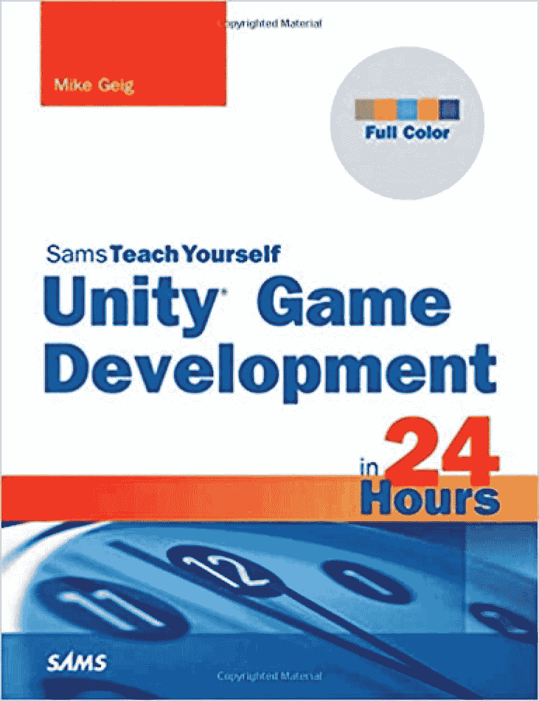
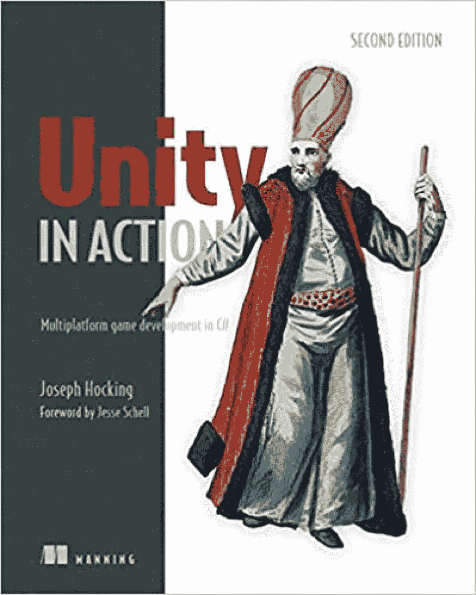
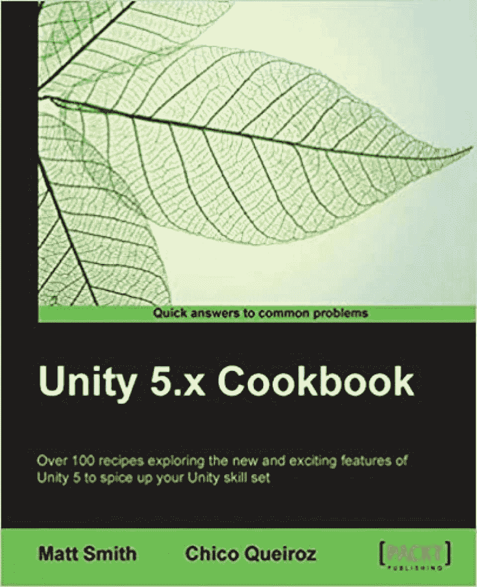
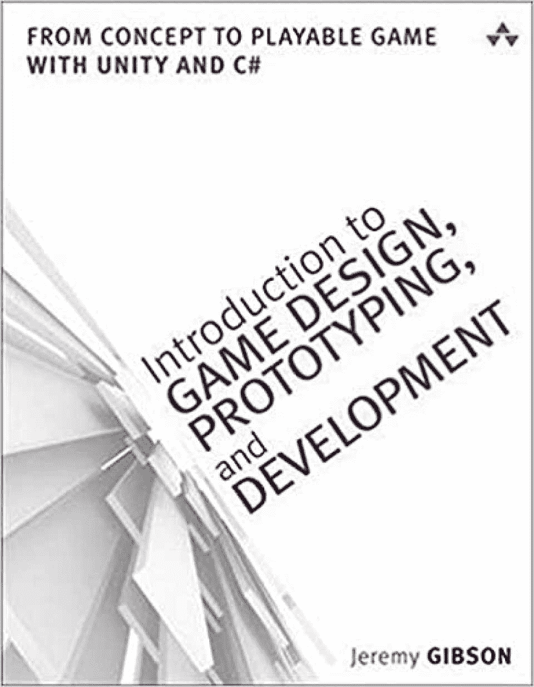
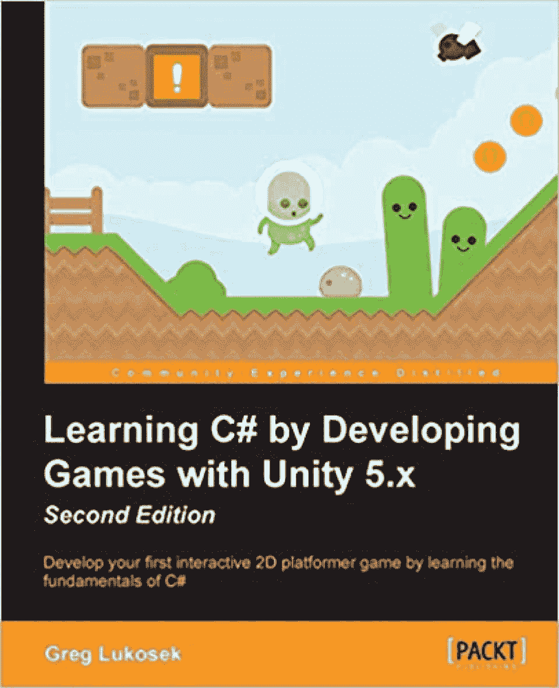
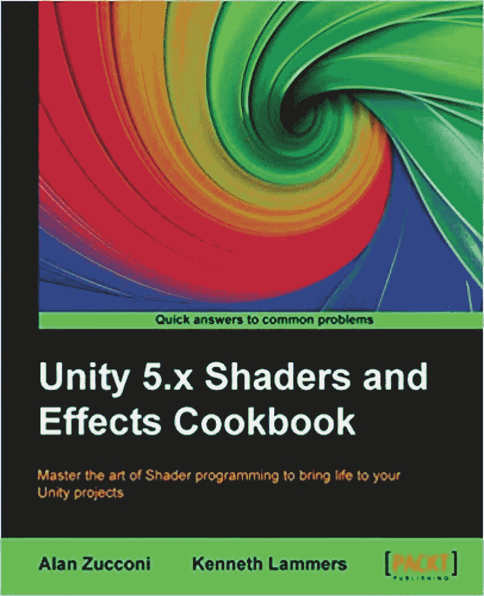
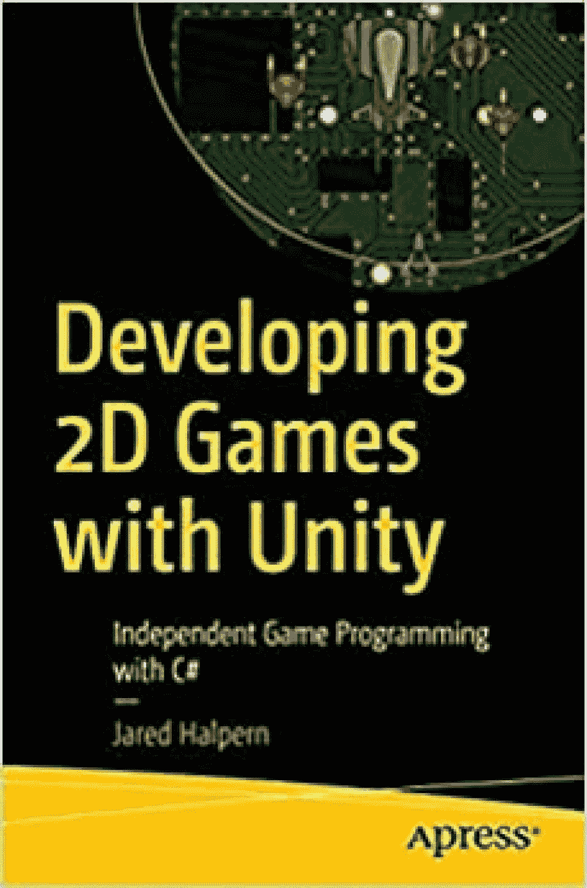
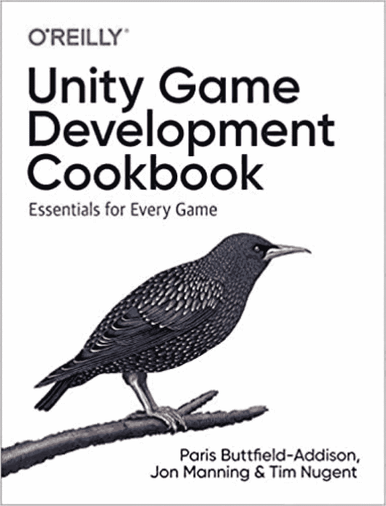
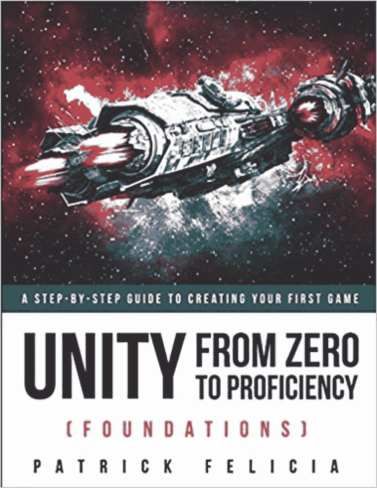
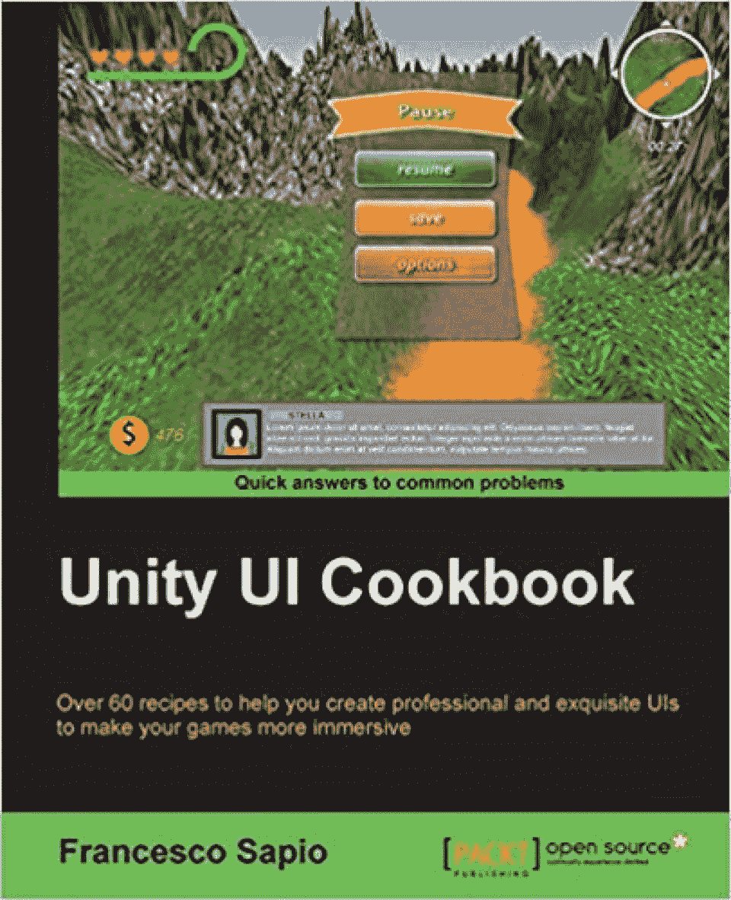

# 游戏开发学习的 10 本最佳 Unity 书籍[更新]

> 原文：<https://hackr.io/blog/best-unity-books>

Unity 是驱动大量流行和创新游戏的游戏引擎，如 Alto's Adventure、Assassin's Creed Identity、Firewatch、鬼故事、永恒之柱、Praey for the Gods、Temple Run 和荒地 2。

游戏开发是最热门的职业之一。这不是一个容易接受的挑战，但是，当然，是一个富有成效的挑战。**视频游戏**是关于克服困难和设定新的成就/基准。同样的精神也推动着电子游戏的发展。

因此，为了帮助你提高你的 Unity 游戏开发技能，或者进入 Unity 游戏开发专题，这里是我们挑选的 10 本最好的 Unity 书籍。

**p . s .**——考虑一下两大视频游戏开发巨头之间的详细对比: [Unity vs 虚幻引擎](https://hackr.io/blog/unity-vs-unreal-engine)。

## **10 本最佳团结书**

 来自——迈克·盖格
最新版——第三版
格式可用——Kindle 和平装本
出版商——Sams

《24 小时内的游戏开发》一书旨在通过 24 节课在短短的 24 小时内教育读者关于游戏开发的知识。这本书利用了 Unity 4 游戏引擎，用《神庙逃亡》这样的例子展示了最好的游戏开发。

Unity 游戏开发书从视频游戏制作的绝对基础开始，慢慢地讨论动画和游戏物理的复杂艺术。Unity 游戏开发 24 小时书中的每个连续章节都延续了前几章的概念。

Unity Game Development in 24 Hours 是由 Mike Geig 撰写的，他是一名资深游戏开发人员，也是一名经验丰富的教师，在 Stark State College 和 Cleveland Institute of Art 有多年的游戏设计和开发教学经验。

*   注意——如何识别常见的游戏开发陷阱以及如何避免这些陷阱。
*   注释-与一些视频游戏开发概念相关的有趣/附加信息。
*   小贴士-完成某些任务的简单方法。

从 Unity book 的成功完成，读者将能够使用 Unity 游戏对象，将着色器和纹理应用到 3D 对象，修改移动平台的桌面游戏，利用设备加速度计和多点触摸显示器，等等。

涵盖的主题:

*   Unity 游戏对象。
*   Unity 图形资产管道。
*   Unity Mecanim 动画系统。
*   统一手里剑粒子系统。
*   游戏部署。
*   游戏用户界面。
*   编写视频游戏任务脚本。

你可以在这里买到这本书。

 出自——乔·霍金和杰西·谢尔(前言)
最新版——第二版
可用格式——平装本
出版商——曼宁出版公司

Unity in Action 是曼宁出版社出版的最畅销的 Unity 游戏开发书籍。这本书描述了从[游戏编码](https://hackr.io/blog/how-to-code-a-game)到使用 Unity 游戏引擎的视频游戏的最终部署的一切。这是应用程序开发人员转行到视频游戏开发的理想书籍。

购买 Unity in Action book，购买者可以免费获得 ePub、Kindle 和 PDF 格式的电子书。该书提供了大量关于 Unity 中直观的工作流工具和渲染引擎的实践练习。游戏开发书的第二版增加了关于使用 Unity 的扩展 2D 工具包开发 2D 平台游戏的新章节。

《Unity in Action》是一本实用的游戏开发指南，作者 Joe Hocking 是一名软件工程师和 Unity 专家，它探索了游戏制作的所有方面，包括创建定制的 AI 脚本和开发易读的 ui。视频游戏开发书是初学者的理想选择，因为它不需要以前的游戏开发经验。

涵盖的主题:

*   Unity 游戏引擎基础。
*   将游戏与互联网连接起来。
*   游戏部署。
*   GUI 开发。
*   Unity 的 2D 功能。
*   使用图形。

你可以在这里买到这本书。

 来自——马特·史密斯和奇科·奎罗斯
最新版——第三版
可用格式——Kindle 和平装本
出版商——帕克特出版有限公司

Packt Publishing Limited 在提供全面的视频游戏开发书籍方面是无与伦比的。因此，它不缺乏完美的标题，适合支持 Unity 平台的几个方面。其中之一就是 Unity 5.x 食谱。

Unity 5.x Cookbook 面向所有希望学习和使用广泛的 Unity 脚本和多媒体功能的人。游戏开发书还讨论了游戏开发过程中遇到的一般问题的快速修复方法。毫无疑问，这是一个做快速校对的极好的 Unity 参考。

这本书的作者是马特·史密斯。他是爱尔兰的一名计算机学者，也从事过一段时间的音乐工作——是的，他是一个乐队的成员，录制了以[困惑](https://en.wikipedia.org/wiki/Confuzion)游戏为特色的录音带的 B 面——他还是一名狂热的游戏开发者，还有其他多语言爱好。

自然，这本书遵循了一种实验性的，探索性的，有趣的教学方法。这是一本面向所有人的 Unity 书籍，从希望尝试 Unity 游戏开发的专业程序员到拥有简单 Unity 技能(和一点 C#经验)的艺术家。

涵盖的主题:

常见的游戏开发陷阱以及如何避免/修复它们。

*   游戏设计。
*   [用 C#编程](https://hackr.io/tutorials/learn-c-sharp)。
*   Unity 基础。
*   Unity 游戏脚本。
*   你可以在这里买这本书。

 出自——杰里米·吉普森·邦德
最新版——第三版
格式可用——Kindle 和平装本
出版商——艾迪森——韦斯利

《游戏设计、原型和开发入门》是另一本详细介绍 Unity 游戏开发的好书。由资深独立游戏开发者和教授杰里米·吉布森(Jeremy Gibson)撰写，这本书侧重于游戏设计理论、扎实的快速原型制作实践和开发计算机编程技能。

游戏开发书是关于学习和掌握 Unity 的，但它是关于理解和欣赏游戏开发的整体过程。

《游戏设计、原型和开发入门》一书充满了讨论 8 个视频游戏原型的深入教程。它还解释了学习 C#和 Unity 的正确方法，这可以提高游戏开发人员的工作效率。游戏开发书还谈到:

提出新的，创新的游戏设计概念，

*   调试[游戏代码](https://hackr.io/blog/how-to-code-a-game)，
*   从设计概念到功能性数字原型的快速转变，
*   利用快速迭代来改进游戏设计，以及
*   玩测试游戏，从获得的反馈中找出意义。
*   从 Unity 游戏开发书的成功完成，读者将能够开发高超的游戏设计思想和清晰的技能，将这些想法转录成真正的，可玩的视频游戏。

涵盖的主题:

游戏设计理论。

*   视频游戏开发所需的编程技能。
*   快速原型实践。
*   Scrum 和[敏捷方法论](https://hackr.io/blog/sdlc-methodologies)。
*   Unity 基础。
*   使用 C#。
*   你可以在这里买这本书。

 来自——格雷格·卢科塞克
最新版——首款
格式——Kindle 和平装本
出版商——帕克特出版有限公司

学习游戏开发最好的方法是什么？这是在开发视频游戏的同时进行的。这是从学习 C#和用 Unity 5.x 开发游戏中得到的启示。关于 Unity 游戏开发的书更注重实用性而不是游戏理论。

从 Unity 5.x 开发游戏中学习 C#教授了复杂的游戏开发艺术，允许读者在一个互动的 2D 平台游戏上工作。这包括用 C#编写 Unity 脚本，面向对象编程，使用游戏对象等等。这本书是为没有编写 C#游戏脚本和代码经验的 Unity 开发初学者设计的。

Unity 游戏开发书由 Greg Lukosek 撰写，他是一名自学成才的程序员、3D 艺术家和认证机械工程师。在 Unity game development 一书中，Greg 利用他在游戏开发方面数十年的经验，通过分享真实世界的场景和示例，向有志之士传授视频游戏开发的技巧。

涵盖的主题:

Unity 游戏开发基础。

*   C#基础。
*   游戏出版。
*   面向对象编程原理。
*   Unity 游戏对象。
*   你可以在这里买这本书。

 来自——艾伦·祖科尼和肯尼斯·兰默斯
最新版——第二版
出版——Kindle 和平装本
出版商——帕克特出版有限公司

无论你使用什么技术，你都需要一个合适的参考。Unity 是一个复杂而宏大的游戏平台，有着许多的阴影。其中之一是着色器和效果，即统一的图形。Unity 5 . x Shaders and Effects Cookbook 是一个很好的 Unity 参考资料。

《Unity 5 . x Shaders and Effects Cookbook》由作家、励志演说家和热情的开发人员艾伦·祖科尼(Alan Zucconi)和视频游戏行业经验丰富的专业人士肯尼斯·兰默斯(Kenneth Schmidt)撰写，旨在帮助读者支持基于物理的着色技术。它有助于游戏开发者正确地将真实感应用到视频游戏中。

如果你想掌握着色器编程的艺术，你的库中必须有 Unity 5.x 着色器和效果指南。这本书附带了很多说明性的、实用的例子，你甚至可以把它们应用到你自己的视频游戏中来教授同样的内容。是学习在电子游戏中加入专业后期处理效果的最佳书籍。

涵盖的主题:

交互式游戏脚本设计。

*   电子游戏中最流行的灯光模型背后的数学原理。
*   基于物理的渲染。
*   着色器编程。
*   Unity 3D。
*   统一图形。
*   你可以在这里买这本书。

 发自——贾里德·哈尔彭
最新版——首款
格式——Kindle 和平装版
出版商——Apress

Unity 是 2D 游戏开发的首选平台。改革的冒险，在树林中的夜晚(NITW)，和团结创造者工具包是著名的团结 2D 游戏。整本 Unity 游戏开发书分为 8 章:

**游戏的过去和现在** -谈论视频游戏行业的历史和演变。同样的简要分析。

1.  **Unity 简介** -向读者介绍 Unity 游戏开发平台。讨论基础和其他概念，主要是 2D 游戏开发。
2.  基础 -本章讨论视频游戏开发的基础。
3.  世界建筑 -谈论制作视频游戏世界的艺术。
4.  **构建游戏性** -游戏性设计在此讨论。
5.  **超越基础**——进军视频游戏开发的中高级领域。
6.  打磨，打磨，再打磨——实践是成功的关键。
7.  **下一步何去何从** -如何以你现在的视频游戏开发技能前进。
8.  这本书以一种透彻的解释和有节奏的方式带领读者通过使用 Unity 开发 2D 游戏的整个过程。用 Unity 开发 2D 游戏不是高级 Unity 书；为此，你需要去别处看看。

尽管如此，对于初学者和没有经验的人来说，游戏开发书是一个合适的选择。这是因为它省略了复杂的专业编码术语和解释，而是利用了游戏开发过程的详细概述/演练。然而，你需要知道的关于 2D Unity 游戏开发入门的一切都包含在这本书里。

涵盖的主题:

浅析电子游戏的发展。

*   视频游戏开发基础。
*   游戏世界设计。
*   统一 2D 游戏开发。
*   Unity 基础。
*   你可以在这里买这本书。

——帕里斯·巴特菲尔德——阿迪斯、乔纳森·曼宁、蒂姆·纽金特
最新版——首款
格式——Kindle 和平装本
出版商——奥莱利

《Unity 游戏开发指南:每个游戏的要点》详细介绍了 2D 和 3D 游戏开发。它从 Unity 游戏开发基础开始，然后逐渐发展到讨论高级概念，如虚拟现实。

整本游戏开发书分为两部分:

第 1 部分-讨论了 Unity 游戏引擎，以及如何使用集中于各种 Unity 特性的简洁练习来使用它。

*   第 2 部分-一个面向教程的指南，用于解决常见的游戏问题和复杂性。
*   Unity 游戏开发指南由三位作者执笔——Paris、Jonathan 和 Tim。三人组有几十年的视频游戏开发经验，以一种易于理解的方式传达游戏开发概念。这三位都是经验丰富的作家。

Unity 游戏开发书采用了一种独特的——坦率地说，简单明了的——方法来教授游戏开发。它包括研究一个场景，发现和突出问题，并寻找可用的最佳解决方案。Unity 游戏开发指南适合初级到中级水平的游戏开发者。

涵盖的主题:

统一的特征。

*   游戏设计。
*   游戏性问题和修复。
*   Unity 基础。
*   Unity 游戏引擎。
*   你可以在这里买这本书。

 来自——帕特里克·菲利西亚
最新版——首款
格式——Kindle 和平装版
出版商——独立出版

《Unity 从零到熟练(基础)》是专为绝对初学者设计的另一本优秀的 Unity 游戏开发书籍。这本书遵循一种简单而详细的教学方法，旨在建立视频游戏开发者的信心和创新。

Patrick Felicia 的 Unity 游戏开发书所采用的教学方法是渐进的。这仅仅意味着下一章都是建立在前面几章的主题之上的。它使 Unity 从零到熟练(基础)书成为父母和教师向他们的孩子和/或学生介绍 Unity 视频游戏开发的合适选择。

整本书从零到熟练(基础)分为 6 章。他们每个人都关注 Unity 的各种特性。Unity 游戏开发手册主要关注:

创造真实的 2D 和 3D 游戏世界，

*   掌握 Unity 界面所需的技能，以及
*   使用 Unity 的核心功能。
*   《Unity 从零到熟练(基础)入门》一书不需要任何 Unity 或游戏开发方面的知识。然而，有一点这方面的经验会使学习过程变得更加容易。

涵盖的主题:

2D 和 3D 游戏世界设计。

*   没有脚本的 2D 平台游戏开发。
*   团结的基础。
*   Unity 的核心特性。
*   视频游戏开发导论。
*   Unity 界面。
*   你可以在这里买这本书。

 来自——弗朗西斯科·萨皮奥
最新版——首款
格式——Kindle 和平装本
出版商——帕克特出版有限公司

Unity UI Cookbook 包含 60 多种现成的解决方案，称为食谱，用于解决复杂的视频游戏 UI 设计。游戏开发手册是深入开发交互式全功能视频游戏 ui 的绝佳参考。

Unity UI Cookbook 的作者 Francesco Sapio 彻底讲述了视频游戏开发的精湛艺术。他是一个熟练的游戏设计师和 Unity 3D 专家，利用逻辑、数学、哲学和解谜的混合，用他的解释吸引读者。从书的圆满完成；读者将能够:

动画和生动的用户界面元素，

*   设计和实现 3D 用户界面，
*   处理运行时定制，
*   实现不同的计数器和健康栏，等等。
*   Unity UI Cookbook 是为游戏开发者设计的，他们的目标是开发顶级的交互式视频游戏 UI，但并不习惯这样。由于这本书没有深入 Unity 的基础知识，所以有必要接触一下 Unity 平台和 C#编程。

涵盖的主题:

设计互动和功能统一的视频游戏用户界面。

*   使用 Unity graphics。
*   用 C#编程。
*   电子游戏设计。
*   视频游戏脚本。
*   你可以在这里买这本书。

**最佳团结图书荣誉奖提名**

## 是的，这可能不是每个人都能同意的列表，因为有成百上千的关于 Unity 游戏开发的书籍。如果你对 Unity 书籍爱不释手，这里有 10 本更棒的 Unity 书籍供你尝试:

【Unity 2019 手把手的游戏开发模式:使用 David Baron 的 C#使用行业标准设计模式创建引人入胜的游戏。

*   **从用 Unity 开发游戏中学习 C# 2019:**用 c#编码，用 Harrison Ferrone 的 Unity 构建 3D 游戏。
*   **使用 Unity 掌握 UI 开发:**Ashley god bold 提供的关于使用 Unity 5、Unity 2017 和 Unity 2018 开发引人入胜的用户界面的深入指南。
*   **Unity 2018 人工智能食谱:【Jorge Palacios 提供的超过 90 种食谱，通过 Unity 为您的游戏构建和定制 AI 实体。**
*   **Unity 2018 增强现实项目:**使用来自杰西·格洛弗的 ARKit、ARCore 和 Vuforia 构建四个身临其境且有趣的 AR 应用。
*   **Unity 2018 食谱:**来自马特·史密斯的超过 160 种食谱，让你的 2D 和 3D 游戏开发更上一层楼。
*   Unity 2018 游戏开发 24 小时由 Mike Geig。
*   **Unity 2018 着色器和效果食谱:**将您的游戏转变为视觉上令人惊叹的杰作，其中包含来自 John P. Doran 和 Alan Zucconi 的 70 多个食谱。
*   **Unity 人工智能编程:**借助 Unity 2018 的力量，在你的游戏中添加强大、可信、好玩的 AI 实体！来自大卫·阿弗萨博士、昂西楚·觉和克利福德·彼得斯。
*   **Unity 游戏优化:**增强和扩展您的 Unity 游戏各方面的性能来自 Davide Aversa 博士和 Chris Dickinson。
*   **结论**

## 这总结了我们挑选的最好的 10 本 Unity 书籍，用于建立/提高视频游戏开发技能。除了阅读游戏开发书籍，你还可以通过网络研讨会，在线演示，YouTube 视频，教程等。，捍卫游戏开发的艺术。

书籍是很好的，但是如果你想通过在线课程学习，那么 udemy 的[Complete C # Unity Game Developer](https://click.linksynergy.com/deeplink?id=jU79Zysihs4&mid=39197&murl=https://www.udemy.com/course/unitycourse/)课程是初学者学习 Unity 的好方法。还有一门课程值得一试。威尔·莱特(广受欢迎的《模拟城市》、《模拟人生》和《孢子》的幕后策划者)在大师班教授[游戏设计和理论](https://masterclass.pxf.io/c/2890636/1357434/16021)。

记住，实践是这里的关键。万事如意！

**人也在读:**

**People are also reading:**