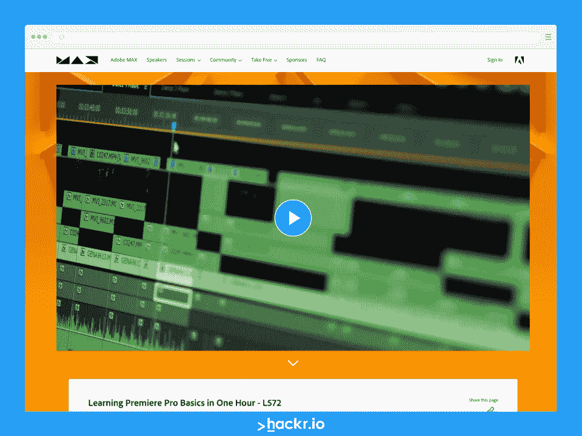
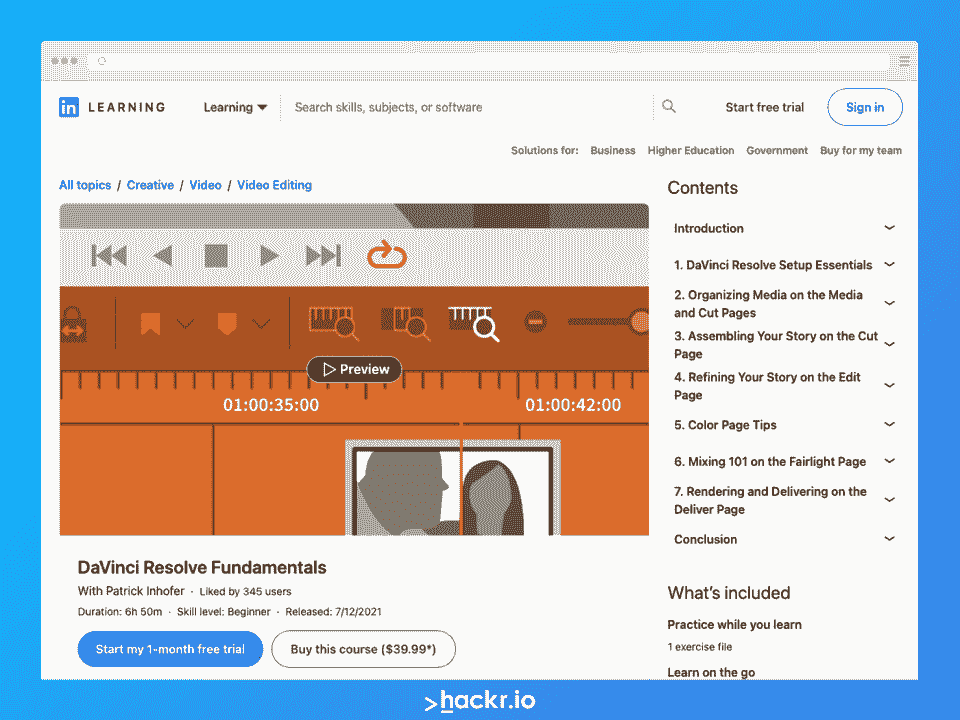
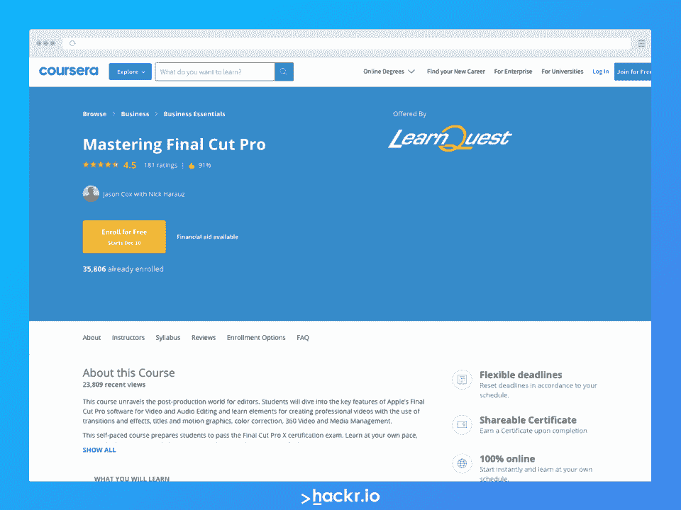
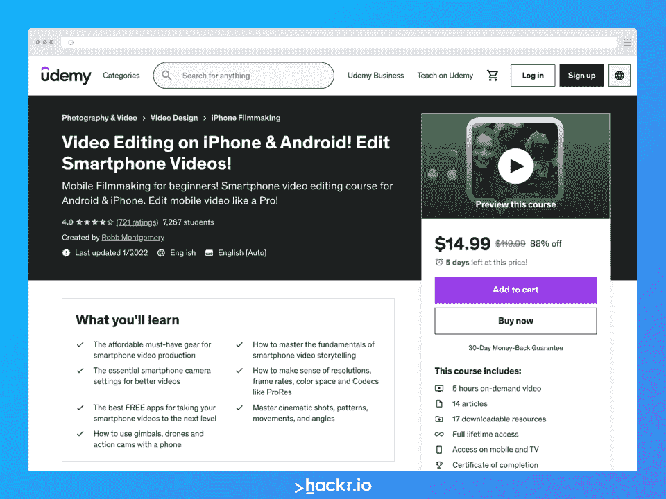
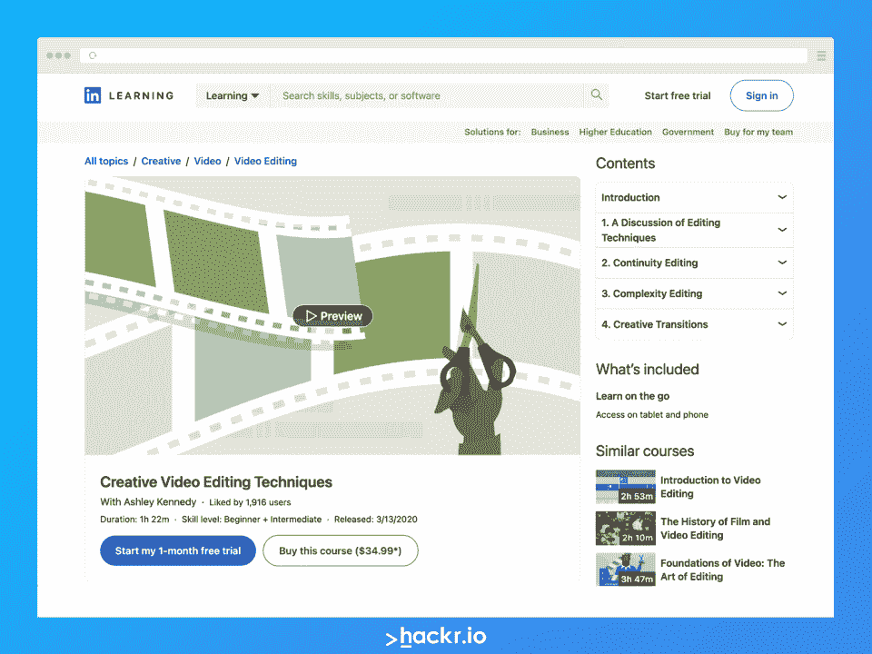
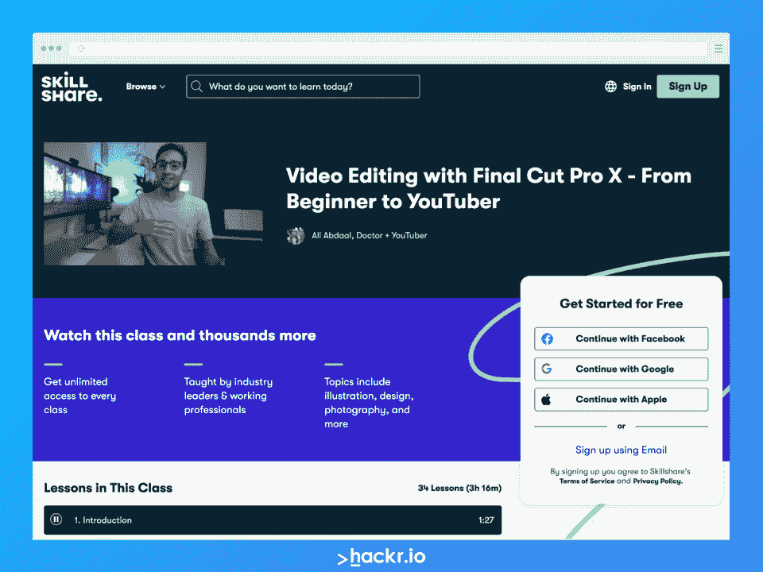
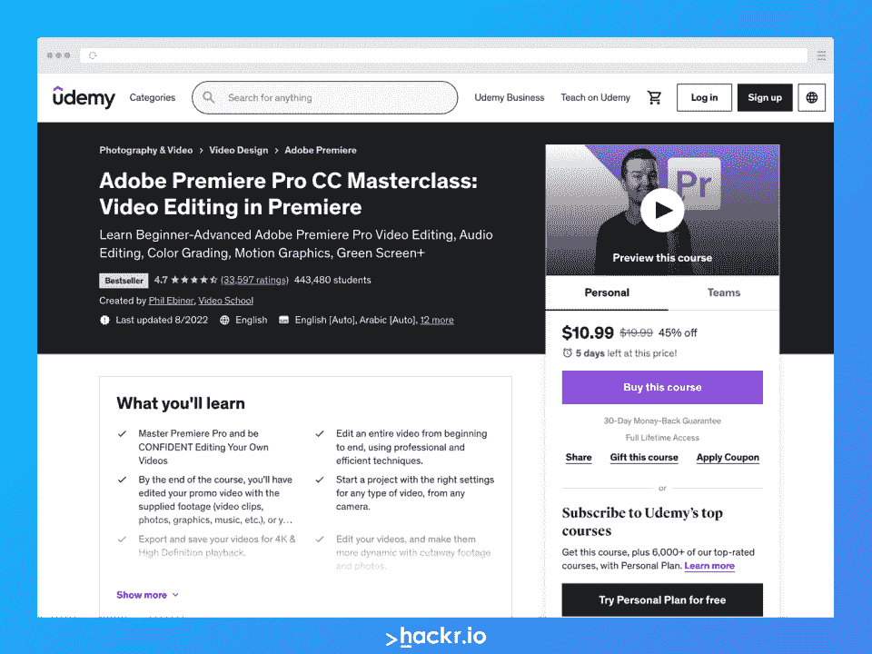

# 在线视频编辑课程

> 原文：<https://hackr.io/blog/best-video-editing-courses>

许多人更愿意花钱请人编辑他们的视频。然后，有些人希望能够自己完成所有的编辑工作。如果你属于第二类，你可能想知道你是否能自己学习视频编辑。幸运的是，答案是响亮的*是*。

尽管这可能令人生畏或几乎不可能，但事实是你可以通过做一些实验来自学如何编辑视频。你也可以在 YouTube 或一些网站和博客上跟随一些教程来学习。然而，如果你想在学习中获得更多的结构和指导，你可以试着报读一些视频编辑课程。

像 Udemy 或 Skillshare 这样的在线学习[平台上有各种各样的视频编辑在线课程。最棒的是每门课程都有不同的内容。例如，有些课程是专门为需要学习基础知识的初学者开设的，而其他课程则是为希望进一步提高的更有经验的学习者开设的。](https://hackr.io/blog/best-udemy-courses)

无论你处于技能水平谱的哪个位置(以及你想学习哪种视频编辑软件)，都有一门课程适合你。请继续阅读，了解我们关于在线学习视频编辑的 7 大课程推荐！

## **最佳视频剪辑课程评选**

下面，你可以看到我们选择的一些最好的在线视频编辑课程。

[****](https://www.adobe.com/max/2021/sessions/learning-premiere-pro-basics-in-one-hour-l572.html)

**关键信息**:

*   作者: Josh Olufemii，Rich Harrington，Abba Shapiro(分别负责第 1、2 和 3 部分)

*   **时长:** 3 小时(每个课程 1 小时)

*   **等级:**初级到中级

Adobe Premiere Pro 视频编辑课程由三节课组成，每节课持续一小时。这三个类别是:

*   **[一小时学会 Premiere Pro 基础知识](https://www.adobe.com/max/2021/sessions/learning-premiere-pro-basics-in-one-hour-l572.html) -** 这个长达一小时的课程深入介绍了 Adobe 的行业标准视频编辑器。您将了解如何导航软件及其界面、添加简单元素、同步音频文件、以特定格式导出内容等。

*   **[Premiere Pro:基本编辑技巧](http://adobe.com/max/2021/sessions/improving-your-video-editing-skills-in-premiere-pr-l579.html)**——学习完基础知识后，你可以继续学习更高级的概念，比如调整音频和颜色以提高质量。您还将了解如何使用和掌握 Adobe 的 Creative Cloud，以及如何利用 Adobe 其他应用程序中的资产和内容。

**我们为什么选择本课程**

向谁学习 Adobe Premiere Pro 会比 Adobe 本身更好？这些课程短小精悍，但直截了当，内容丰富。在短短三个小时内，您就可以开始使用 Premiere Pro，而且您不需要为这些课程支付一分钱！

**优点**

*   绝对免费
*   短期课程是直接和信息性的
*   向该领域受人尊敬的专家学习

**缺点**

*   短小精悍，不太详细
*   仅涵盖 Premiere Pro 的一些功能和方面

**[了解更多](https://www.adobe.com/max/2021/sessions/learning-premiere-pro-basics-in-one-hour-l572.html)**

[****](http://linkedin-learning.pxf.io/DVEo2y)

**关键信息**:

*   以 39.99 美元的价格直接购买课程，或者
*   LinkedIn 学习订阅

*   30 天免费试用
*   每年支付 19.99 美元/月
*   每月支付 39.99 美元

**我们为什么选择本课程**

DaVinci Resolve 是一个免费的视频编辑应用程序，对于那些想要学习一项新技能而又不需要太多资金投入的人来说，这是一个绝佳的选择。本课程涵盖从基础开始的所有内容，包括设置过程。您还将学习颜色分级、组织、组合、提炼、渲染等内容。完成这门课程还会为你赢得一份证书，你可以把它放在你的简历上！

**优点**

*   如果你不喜欢这种订阅模式，你可以直接购买课程并永远学习
*   高评级课程
*   后获得证书
*   从事一个项目

**缺点**

*   有些材料的分辨率不是最好的

**[了解更多](http://linkedin-learning.pxf.io/DVEo2y)**

[****](https://imp.i384100.net/3P5Q4v)

**关键信息**:

*   免费试用 7 天
*   59 美元/月或 399 美元/年 Coursera Plus 订阅
*   如果您选择年度订阅，有 14 天的退款保证

*   **作者:**杰森·考克斯与尼克·哈劳兹(LearnQuest)

*   **持续时间:**共 40 小时完成

*   **先决条件:** Final Cut Pro X 和一台能够运行它的 macOS 电脑；了解视频编辑术语的基础知识(推荐)

**我们为什么选择本课程**

如果你是一个初学者，想学习 Final Cut Pro X (FCPX)，这个在线视频编辑课程是一个很好的选择。因为这是一门自定进度的课程，所以你可以在自己的时间里灵活地学习。作者还创建了本课程来帮助学生准备他们的 Final Cut Pro X 认证评估考试。

在这个 40 小时的课程中，您将学习软件的基础知识，包括但不限于:

*   在 FCPX 创作/编辑视频
*   导入/导出项目文件
*   应用过渡和效果
*   更改剪辑计时
*   编辑音频

**优点**

*   完全自定进度，灵活
*   非常适合准备认证考试
*   学习基础知识和一些更复杂的主题

**缺点**

*   对一些初学者来说可能很复杂
*   没怎么教视频编辑理论
*   花一些时间讨论 FCPX 以外的其他软件

**[了解更多](https://imp.i384100.net/3P5Q4v)**

[****](https://click.linksynergy.com/deeplink?id=jU79Zysihs4&mid=39197&murl=https%3A%2F%2Fwww.udemy.com%2Fcourse%2Fmake-smartphone-video-like-a-pro-level-1)

**关键信息**:

*   **时长:** 5 小时视频点播

**我们为什么选择本课程**

虽然这个较短的课程在平台上(甚至在这篇评论中)不是最高的，但我们选择包括它，因为它提供了如何在手机上编辑视频的最新信息。还有其他课程也是如此，但许多课程只专注于一个应用程序，或者只专注于 iPhone 或 Android，而本课程涵盖了两个平台。

课程创建者积极响应，谈论了许多关于设备和概念的话题，你应该知道如何制作漂亮的(编辑过的)智能手机视频。

**优点**

*   涵盖 iPhone 和 Android
*   包括大量的主题，以帮助您从拍摄到编辑
*   响应式课程作者

**缺点**

*   在课程流程和组织方面需要改进
*   有些信息可能会过时(但课程作者会定期更新)

**[了解更多](https://click.linksynergy.com/deeplink?id=jU79Zysihs4&mid=39197&murl=https%3A%2F%2Fwww.udemy.com%2Fcourse%2Fmake-smartphone-video-like-a-pro-level-1)**

[****](http://linkedin-learning.pxf.io/mg6MQD)

**关键信息**:

*   以 34.99 美元的价格直接购买课程，或者
*   LinkedIn 学习订阅

*   30 天免费试用
*   每年支付 19.99 美元/月
*   每月支付 39.99 美元

*   **等级:**初级和中级

**我们为什么选择本课程**

如果你已经对你所选择的视频编辑软件有所了解，那么本课程可能是你的一个不错的选择。在本课程中，您可以了解更多关于一些创造性的视频编辑技术，这些技术是许多其他在线视频编辑课程所没有涉及的。在讨论了电影剪辑的基本原理和“规则”之后，Creative Video Editing Techniques 讨论了剪辑和过渡视频的各种方法，并使用了流行电影中的真实例子。

该课程在 LinkedIn Learning 上的评分为 4.8/5，对作者阿什利·肯尼迪(Ashley Kennedy)展示信息的方式有许多好评。

**优点**

*   组织良好、条理清晰的课程
*   情报的
*   有很多电影中的例子
*   非常适合初学者和中级学习者

**缺点**

**[了解更多](http://linkedin-learning.pxf.io/mg6MQD)**

[****](https://skillshare.eqcm.net/5berVn)

**关键信息**:

*   **价格:**订阅 32 美元/月或 168 美元/年

**我们为什么选择本课程**

虽然我们已经在上面包含了 Final Cut Pro X 的课程，但我们仍然决定包含 SkillShare 的这个课程，因为它通过 YouTuber 的镜头教你软件。该课程在平台上的评价非常高，包括各种主题以帮助您入门，包括一些视频编辑理论和基础知识。

这门课最棒的部分是有一个项目可以帮助你实践你所学到的东西。还有资源可以帮你一起走！

**优点**

*   非常适合那些想学习如何编辑 YouTube 视频的人
*   简短但直接且信息丰富
*   来自快乐学生的大量好评
*   包括一个帮助实践你所学的项目

**缺点**

*   需要订阅
*   没有证书

**[了解更多](https://skillshare.eqcm.net/5berVn)**

****

**关键信息**:

*   **作者:**菲尔·埃比纳；视频学校

*   **时长:** 24.5 秒的视频点播

*   **等级:**初级到高级

**我们为什么选择本课程**

我们选择包括这个 Adobe Premiere 视频编辑培训大师班有几个原因。首先，它是当今最实惠的课程之一，在 Udemy 上仅售 19.99 美元！以这个价格，你可以按照自己的进度学习超过 24 小时的课程。最后，你还会获得结业证书。

如果您正在寻找学习 Adobe Premiere 的电影剪辑课程，本课程可能是您的最佳选择。它包括适合初学者的课程，但随着你的深入，概念变得越来越有挑战性和高级。因此，即使你是一个中级学习者，这里也有适合你的东西。

一旦您学习了 Adobe Premiere Pro，您可以通过注册 Phil Ebiner 的另一门课程继续学习:[Adobe After Effects CC master class:Complete After Effects 课程](https://click.linksynergy.com/deeplink?id=jU79Zysihs4&mid=39197&murl=https%3A%2F%2Fwww.udemy.com%2Fcourse%2Fafter-effects-cc%2F)。

**优点**

*   按照您自己的进度学习 Adobe Premiere
*   非常适合初学者到中级用户(甚至一些高级用户)
*   涵盖了广泛的主题
*   非常实惠
*   竣工证明

**缺点**

*   只涵盖 Adobe Premiere，所以不适合那些想学习其他软件的人

**[了解更多](https://click.linksynergy.com/deeplink?id=jU79Zysihs4&mid=39197&murl=https%3A%2F%2Fwww.udemy.com%2Fcourse%2Fadobe-premiere-pro-video-editing%2F)**

## **我们如何选择最好的在线视频编辑课程**

网上有数不清的课程，选择最好的编辑课程列入这个列表是一个相当大的挑战。然而，通过考虑以下标准，我们能够缩小列表范围，仅包括精华部分:

*   **费用&一般可及性:**我们希望将视频和电影剪辑课程纳入其中，这在大多数预算范围内。

*   **内容&质量:**我们检查了评论和课程，以确保您获得有价值的知识。

*   视频编辑软件:现在有各种各样的行业标准或者至少是非常流行的视频编辑程序。我们确保我们包括了一些最受欢迎的课程。

*   难度水平:我们尽最大努力包含不同学习水平的课程，尽管我们也选择包含许多从基础到高级的主题。

*   **讲师:**我们选择了值得信赖的权威机构的课程，以确保我们只包括最好的视频编辑课程。

我们认为有利的其他因素是课程是否提供结业证书、实践项目、课程支持等等。

## **结论**

知道如何编辑视频可能是一项非常有用的技能。它不仅新颖，而且很有市场——你可以通过兼职编辑视频来谋生，或者找一份全职的视频编辑工作。学习如何编辑视频也不是不可能的，即使你试图自己学习。总是有通过实验、反复试验和跟随教程自学的选择。或者，你可以参加视频编辑课程，这些课程可以一步一步地教你。

我们希望这个指南能帮助你找到适合你需求的在线视频编辑课程。如果你认为我们错过了一个应该在这个列表中的，不要犹豫，让我们在下面的评论中知道！

你想快速开始学习，但又想免费开始吗？查看以下内容:

**[最好的免费 Udemy 课程](https://hackr.io/blog/free-udemy-courses)**

## **常见问题解答**

#### **1。视频剪辑哪个课程最好？**

最好的视频剪辑课可能因人而异。这要看你是从什么水平开始，希望学习哪个视频编辑程序。根据自己的需求选择课程！

#### **2。可以自学视频剪辑吗？**

当然——许多人完全靠自己学会了如何编辑照片和视频。你可以通过试用视频编辑软件、跟随教程或参加在线视频编辑课程来学习。这需要大量的练习，但是只要足够投入，你就可以从头开始学习。

#### **3。做视频编辑需要什么资格？**

自然，你必须具备的最重要的资格是知道如何流利地使用某些视频编辑软件。一个好的视频编辑还会有耐心，非常注重细节，良好的沟通能力，良好的软硬件知识，等等。如果工作不能给你提供你需要的设备，你也必须有自己的设备。