# 2023 年您需要使用的 30 个最佳 VSCode 扩展

> 原文：<https://hackr.io/blog/best-vscode-extensions>

Visual Studio Code (VSCode)是一款流行的多功能代码编辑器，在最新的 Stack Overflow 开发者调查中，接近 [75%的开发者选择它作为他们的首选 IDE](https://survey.stackoverflow.co/2022/#section-most-popular-technologies-integrated-development-environment) ，

VS Code 提供了一系列现成的特性和功能，但是它真正的力量在于市场上可用的扩展的巨大生态系统。

在本文中，我们整理了一个前 30 个 VSCode 扩展的列表，您应该使用它们来提高您的工作效率，增强您的编码体验，并使您的工作流更加高效。

从 Git 集成和协作编辑到代码格式化和调试，这些扩展涵盖了广泛的功能，一定会让您的开发体验更加愉快。

## **vs code 扩展的重要性**

*   **提高效率:** VS 代码插件可以通过自动化格式化、生成样板代码和调试等重复性任务来节省时间和精力。

*   **改进的可访问性:**可视化代码插件可以使编辑器更易访问，提供文本到语音转换、屏幕阅读器和高对比度主题。

*   **个性化编辑器:**根据您的喜好和工作流程定制您的编辑器。例如，有些扩展可以改变配色方案、字体和编辑器布局。

*   **与外部工具集成:**将 VS 代码与有用的工具集成，如 Git、Docker 和 ChatGPT，以提供无缝的开发体验。

*   **协作:** VSCode 扩展可以通过支持实时编辑和调试、代码共享和版本控制来促进开发人员之间的协作。

**想看看 VSCode 在竞争中的表现吗？结账:**

**[最好的 Web 开发 IDEs](https://hackr.io/blog/web-development-ide)**

**要想更深入地潜水，请选择其中之一:**

**[VS Udemy](https://click.linksynergy.com/deeplink?id=jU79Zysihs4&mid=39197&murl=https%3A%2F%2Fwww.udemy.com%2Fcourses%2Fsearch%2F%3Fsrc%3Dukw%26q%3DVisual%2BStudio%2BCode)T3 的代码课程**

## **2023 年 30 大最佳 VSCode 扩展**

[**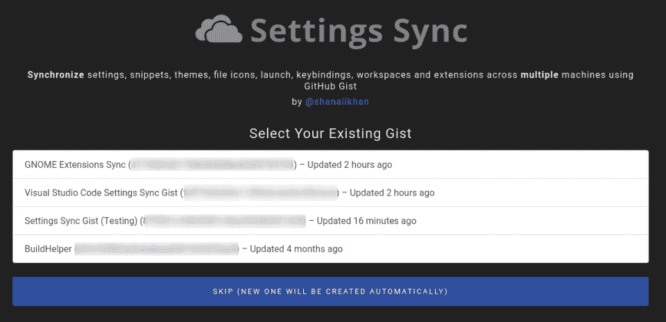**](https://marketplace.visualstudio.com/items?itemName=Shan.code-settings-sync)

**主要功能:**跨设备同步 VSCode 设置。

这个扩展允许你在不同的机器上同步你的设置，快捷键，快捷键，扩展和代码片断。您可以将这些设置同步到您的 GitHub 帐户，以便从任何设备轻松访问您的设置。

对于在多台设备上工作或需要快速设置新设备的开发人员来说，这很有用，因为他们可以轻松地在所有机器上复制他们的首选设置。

**主要功能:**启动本地服务器，实时查看变化。

这个 visual studio 代码插件允许您启动本地开发服务器，并在浏览器中实时查看您的代码更改。每当您保存代码中的更改时，它会自动刷新您的浏览器，以便您可以看到您已经实现的更改。

[**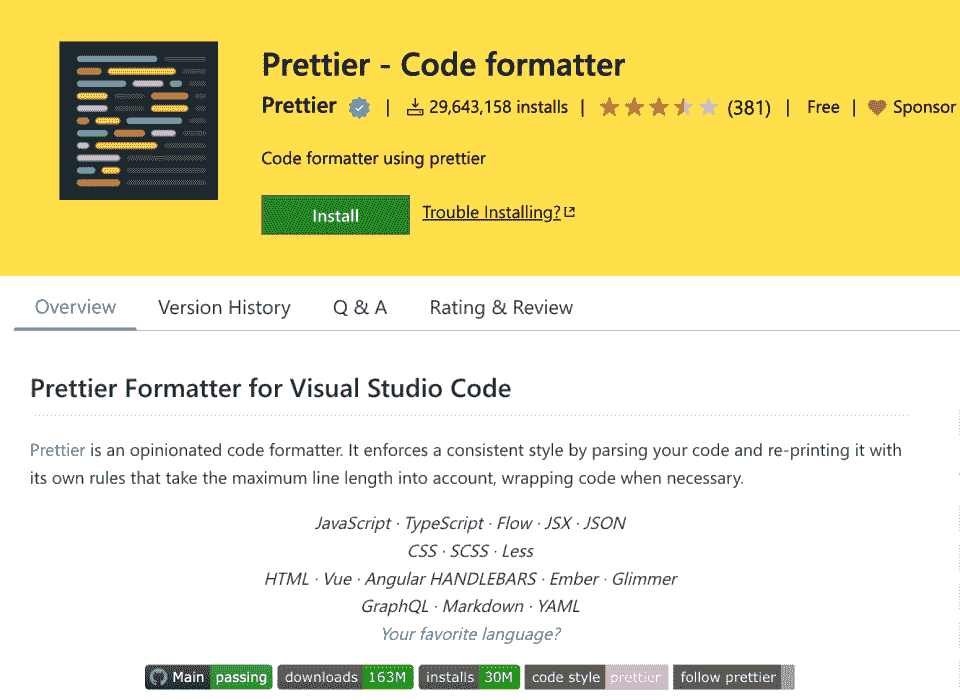**](https://marketplace.visualstudio.com/items?itemName=esbenp.prettier-vscode)

**主要特性:**自动代码格式化和样式强制。

漂亮是一个固执己见的代码格式和风格执行者。当您点击 save 时，它会根据一组规则和约定自动格式化您的代码。

如果您想确保一致和干净的代码格式，而不必花时间手动格式化他们的代码，那么这是您应该考虑使用的扩展。它对团队也很有用，因为它确保了一致的风格，只需要团队成员很少的努力就可以维护。

[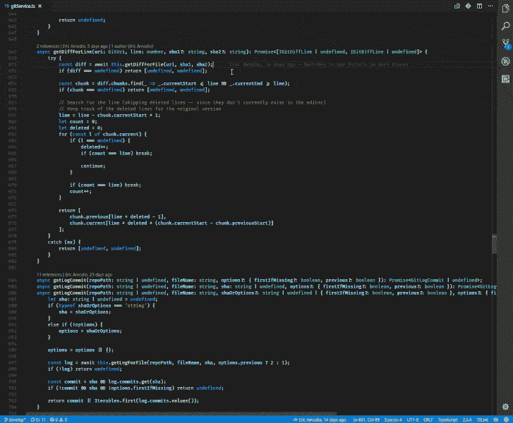](https://marketplace.visualstudio.com/items?itemName=eamodio.gitlens)

**主要特性:**查看内联 git 注释等等。

一个 VSCode 扩展，在代码编辑器中提供增强的 Git 功能。它增加了一些特性，如内联责备注释、代码镜头和一系列其他特性，可以帮助您更好地理解代码及其历史。

使用 GitLens，您可以看到代码行随着时间的推移而发生的变化，以及谁做出了这些变化以及为什么做出这些变化，这使它成为对团队有用的扩展。

[**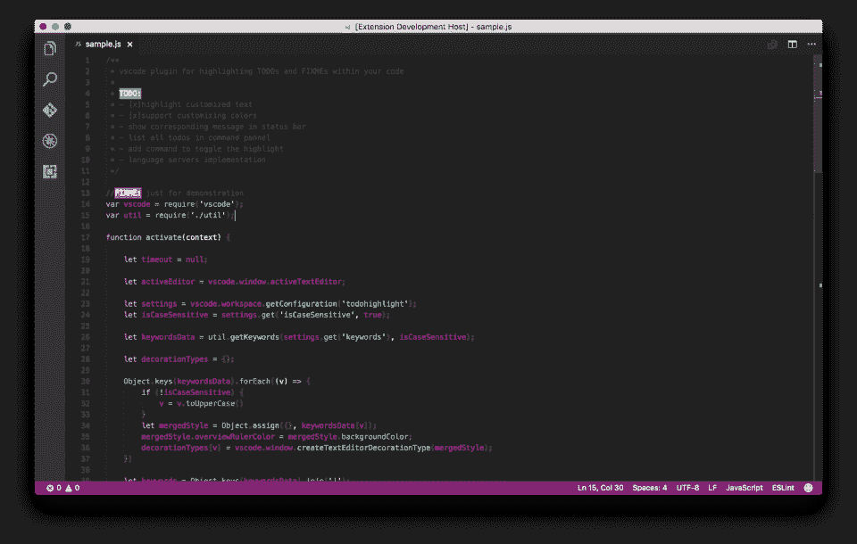**](https://marketplace.visualstudio.com/items?itemName=wayou.vscode-todo-highlight)

**主要特性:**突出代码内的 TODOs 注释。

作为开发人员，我们经常在代码中写 ToDo 注释，结果却忘记了它们。如果您有一个扩展，使这些 ToDo 注释脱颖而出，使它们易于识别和访问，会怎么样？幸运的是，这正是这个扩展所做的。

它帮助您跟踪代码中的任务和注释。它突出显示带有特定关键字(如“TODO”或“FIXME ”)的注释，并创建一个这些任务的列表，您可以在工作时轻松地参考这些列表。

[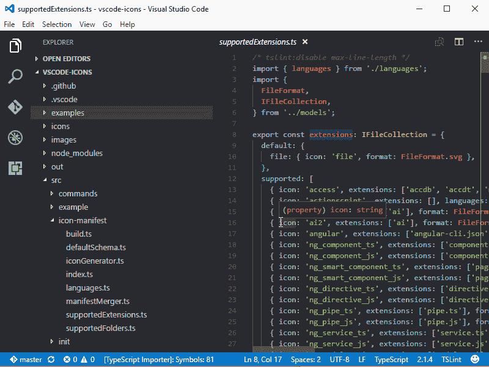](https://marketplace.visualstudio.com/items?itemName=vscode-icons-team.vscode-icons)

**主要功能:**vs code 中你的文件和文件夹的图标。

如果您在处理包含大量文件夹和文件的大型项目，导航可能会令人厌倦，因为所有文件夹看起来都一样。

VScode-icons 为项目中的文件夹和文件图标添加了样式和颜色。这个 VSCode 插件很有用，因为它可以帮助你轻松识别不同的文件夹和文件类型，让你在项目中导航不那么累。

[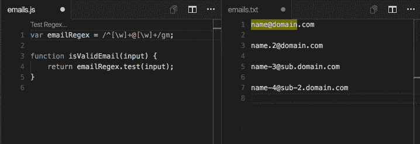](https://marketplace.visualstudio.com/items?itemName=chrmarti.regex)

**主要功能:**在您键入正则表达式时预览它们。

对许多人来说，编写正则表达式(regex)可能是一件麻烦事。这也是这个 vs 代码扩展在开发者中流行的原因。该扩展为您提供了一个辅助文档，供您在键入时预览正则表达式的结果。

[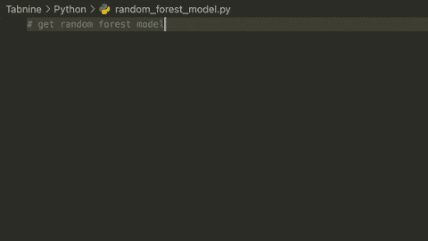](https://marketplace.visualstudio.com/items?itemName=TabNine.tabnine-vscode)

**主要特点:** AI 赋能的代码补全和建议。

Tabnine 是一个 VSCode 扩展，它使用 AI 在您键入时提供智能代码完成建议。它从您的代码中学习，并可以根据您当前的上下文和编码模式建议代码完成。这很有用，因为它可以帮助您更快地编码，从而提高您的生产率。

[****](https://marketplace.visualstudio.com/items?itemName=johnpapa.vscode-peacock)

**主要功能:**为不同的 VS 代码工作区添加颜色。

这个扩展允许您为不同的项目定制您的工作区颜色和设置，这对于同时处理多个项目并且希望有一个可视提示来帮助他们跟踪他们正在处理的项目的开发人员来说很有帮助。

通过对工作区进行颜色编码，您可以轻松识别不同的项目并在它们之间切换。

[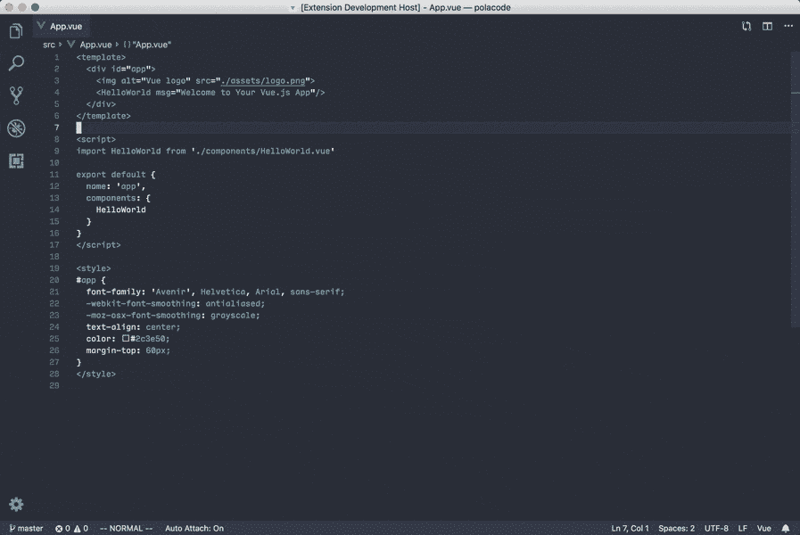](https://marketplace.visualstudio.com/items?itemName=pnp.polacode)

**主要特性:**为你的代码创建漂亮的截图。

如果您想要共享代码片段，将它们包含在您的文档或演示文稿中，这个扩展将会派上用场。

Polacode 可以让你用语法高亮创建漂亮的代码截图。突出显示您想要捕获的代码，Polacode 会完成剩下的工作。

[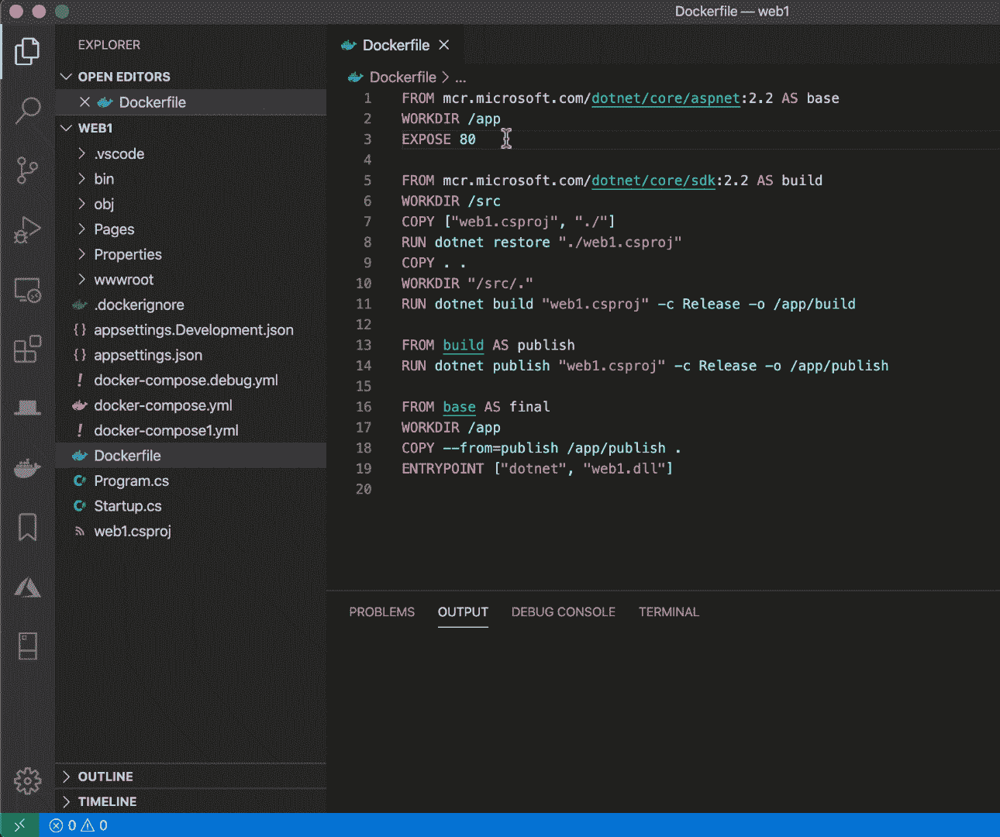](https://marketplace.visualstudio.com/items?itemName=ms-azuretools.vscode-docker)

**主要功能:**在 VS 代码内管理 Docker 容器。

这是一个 VSCode 扩展，允许开发人员在他们的代码编辑器中使用容器化的应用程序。

对于需要在开发工作流中使用容器和图像的开发人员来说，它非常有用，因为它为管理和部署容器提供了一个简化的界面。

[**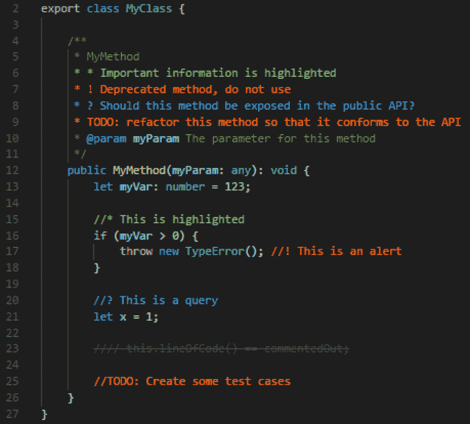**](https://marketplace.visualstudio.com/items?itemName=aaron-bond.better-comments)

**主要特性:**给你的代码添加信息性的注释。

更好的注释通过为注释添加颜色和格式来增强代码注释的可读性。使用这个扩展，您还可以将您的评论分类为提醒、查询、待办事项、精彩内容等等。

[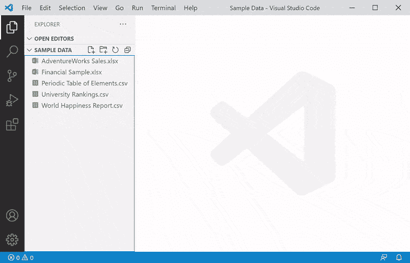](https://marketplace.visualstudio.com/items?itemName=GrapeCity.gc-excelviewer)

**主要功能:**查看 VS 代码中的 Excel 文件。

Excel viewer 是一个 VSCode 扩展，允许您在代码编辑器中预览 Excel 文件。如果您需要处理 Excel 电子表格和 CSV 文件，并希望在不离开代码编辑器的情况下预览它们，那么您会发现这个扩展非常有用。

[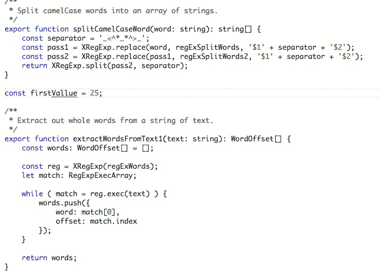](https://marketplace.visualstudio.com/items?itemName=streetsidesoftware.code-spell-checker)

**主要特性:**检测并修复代码中的拼写错误。

该扩展检查代码注释、字符串和 markdown 文件中的拼写错误。如果您想提高代码的可读性和专业性，这个扩展通过捕捉常见的拼写错误将会派上用场。

[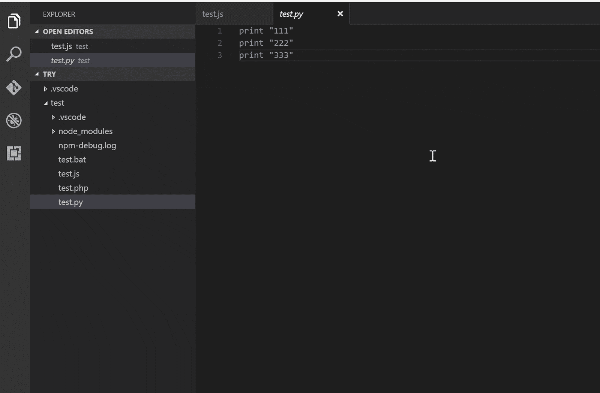](https://marketplace.visualstudio.com/items?itemName=formulahendry.code-runner)

**主要功能:**运行代码片段。

这个扩展是一个工具，允许你直接从你的 VS 代码编辑器运行超过 30 种编程语言的完整代码文件的代码片段。当您不想运行整个代码库时，这对于测试非常有用。

[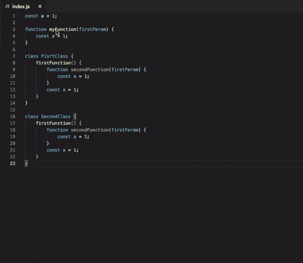](https://marketplace.visualstudio.com/items?itemName=ChakrounAnas.turbo-console-log)

**主要功能:**一键插入 JS 控制台日志语句。

Turbo Console Log 允许您使用键盘快捷键将有意义的 JavaScript console.log 语句快速添加到代码中。当您需要调试代码并希望快速有效地添加 console.log 语句时，这个扩展会大放异彩。

[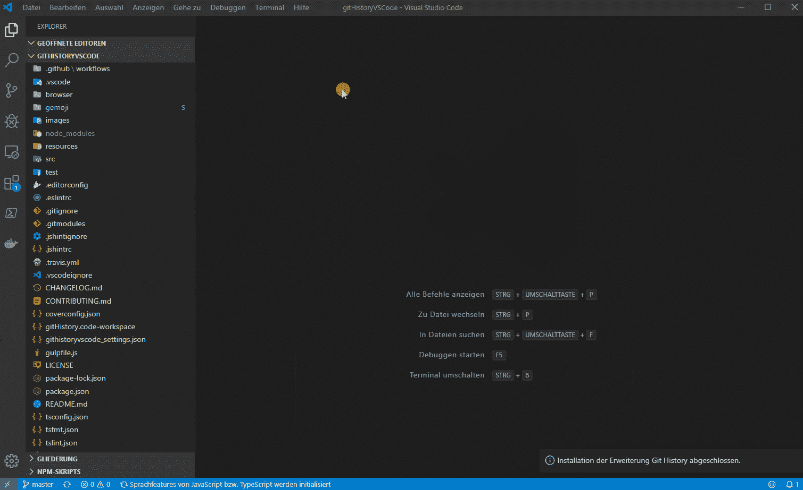](https://marketplace.visualstudio.com/items?itemName=donjayamanne.githistory)

**主要功能:**查看 Git 历史，比较文件版本。

Git 历史帮助你可视化你的 Git 日志。它是一个 VSCode 扩展，在代码编辑器中提供了 Git 存储库历史的交互式视图。它还为您提供了一个清晰的界面来比较分支和提交。

[**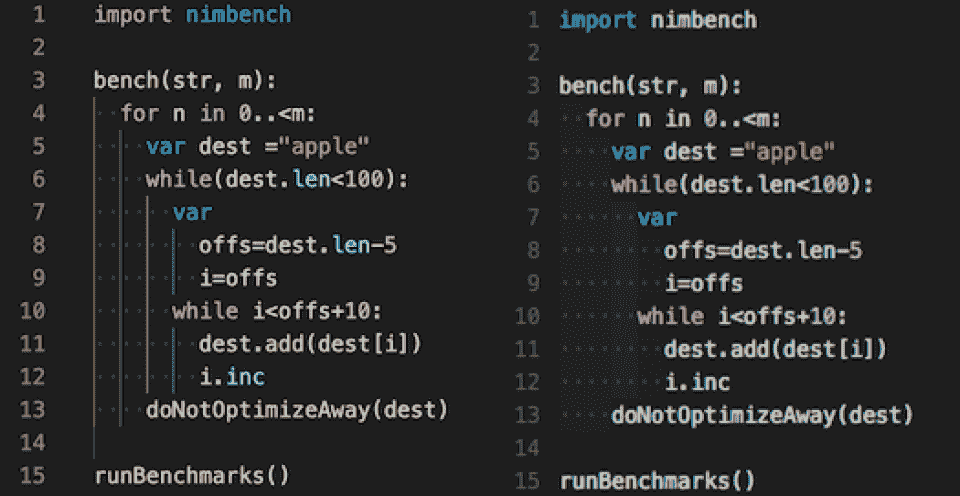**](https://marketplace.visualstudio.com/items?itemName=oderwat.indent-rainbow)

**主要特性:**代码中缩进的颜色代码级别。

缩进代码可以提高代码的可读性，使代码更容易理解和维护。这个扩展为代码中不同级别的缩进添加了颜色。它会自动使用您为编辑器设置的当前标签大小。

[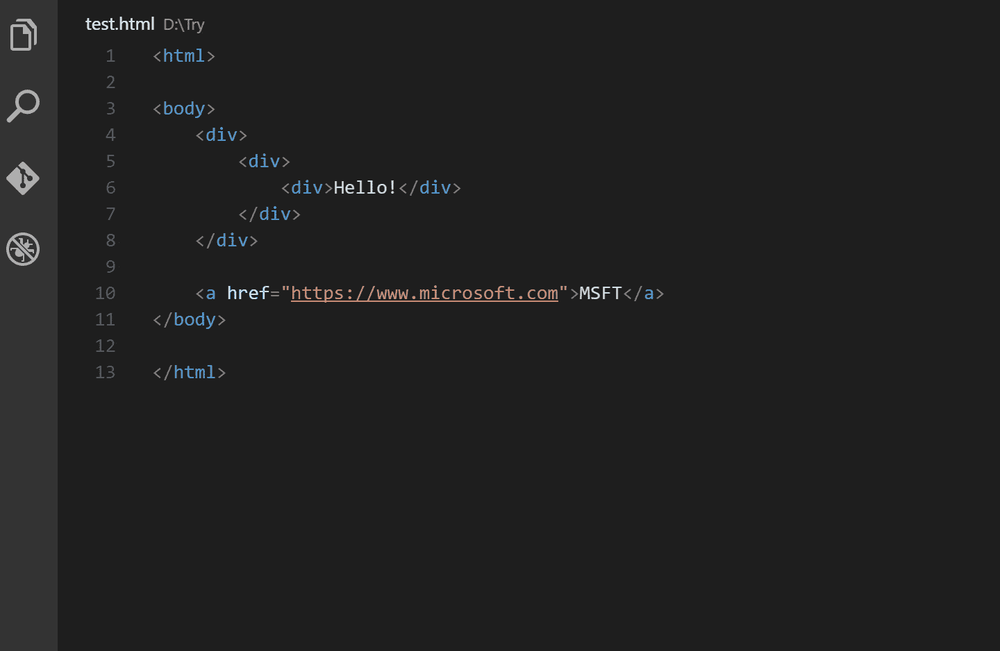](https://marketplace.visualstudio.com/items?itemName=formulahendry.auto-rename-tag)

**主要特性:**重命名一个就重命名 HTML/XML 标签。

Auto Rename Tag 是一个 VSCode 扩展，当您重命名一个标签时，它会自动重命名 HTML/XML 标签。使用这个扩展，在重命名开始标记时，不需要手动更新结束标记。

[**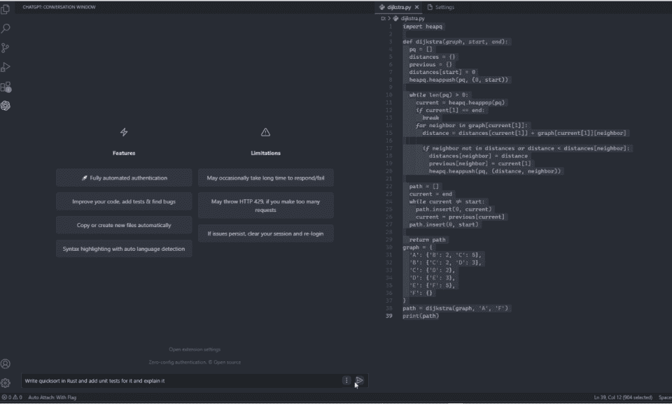**](https://marketplace.visualstudio.com/items?itemName=gencay.vscode-chatgpt)

**主要功能:**基于文本的 AI 工具，回答你的问题。

ChatGPT 已经成为最常用的人工智能工具之一，许多开发人员使用 chatGPT 来帮助他们更快地工作。这个扩展帮助您将 ChatGPT 集成到 VS 代码中。这样，您就可以在不离开代码编辑器的情况下使用 ChatGPT。

[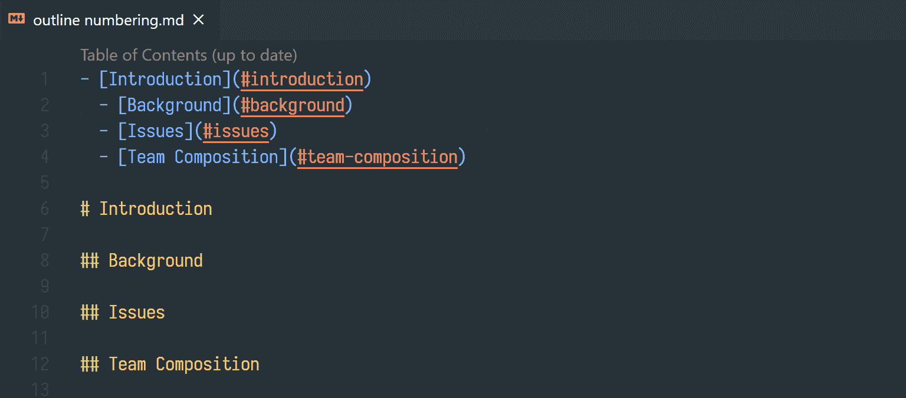](https://marketplace.visualstudio.com/items?itemName=yzhang.markdown-all-in-one)

**主要特性:**集成 VS 代码中的降价支持。

该扩展通过提供一套用于格式化、预览和导出 Markdown 文件的工具，帮助您在代码编辑器中编辑 Markdown 文件。

[**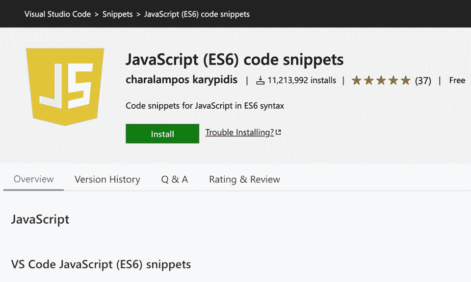**](https://marketplace.visualstudio.com/items?itemName=xabikos.JavaScriptSnippets)

**主要功能:**最常用的 JS 代码片段的集合。

JavaScript 代码片段提供了一组有助于使用 JavaScript 的代码片段。这是 JavaScript 开发人员的必备扩展，他们希望通过为常见任务使用预构建的代码片段来节省时间。

[**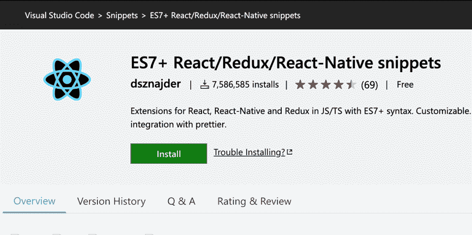**](https://marketplace.visualstudio.com/items?itemName=dsznajder.es7-react-js-snippets)

**主要特性:**React 和 Redux 代码片段的集合。

与 JS 代码片段类似，这个扩展提供了一组代码片段，用于处理 React 和 Redux。最新版本也有额外的 TypeScript 片段。

[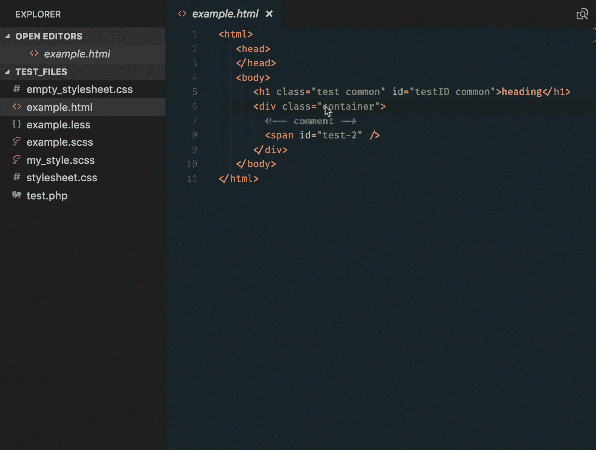](https://marketplace.visualstudio.com/items?itemName=pranaygp.vscode-css-peek)

**主要特性:**导航/查看代码中的 CSS 定义。

CSS Peek 是一个 VS 代码扩展，它允许你通过简单地点击 HTML 文件中的 CSS 类或 ID 来快速地从 HTML 跳转到 CSS 代码，然后再返回。

[**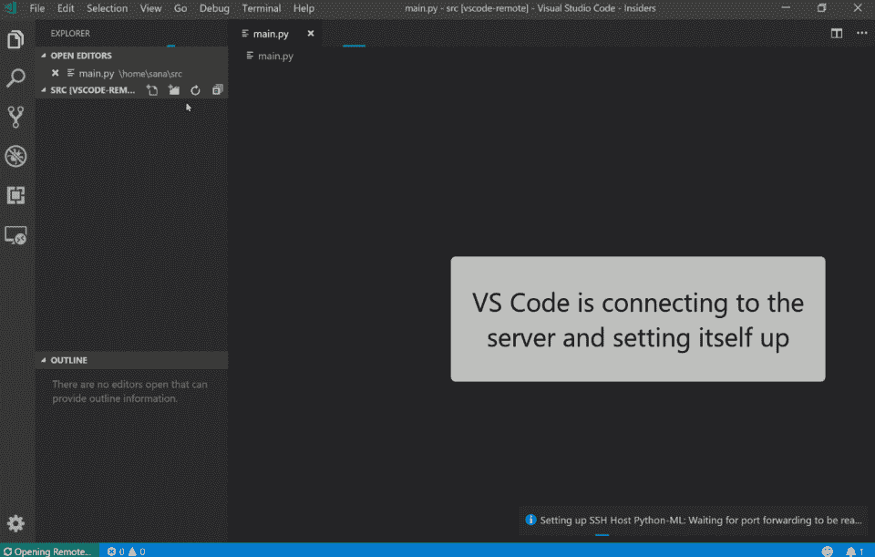**](https://marketplace.visualstudio.com/items?itemName=ms-vscode-remote.remote-ssh)

**主要特性:**在 VS 代码中通过 SSH 使用远程服务器。

这是一个扩展，允许您通过 SSH 连接到远程服务器或容器，并编辑文件，就像它们在您的本地机器上一样。

如果您经常使用存储在远程服务器或容器上的代码，您会发现远程 SSH 非常有用，因为它提供了一种无缝且安全的方式来访问和编辑代码。

**主要特性:** AI 驱动的代码建议和生成

当你打字时，GitHub Copilot 会给你人工智能的代码建议。通过提供自动完成和代码建议，它可以帮助您节省时间和提高生产率。它甚至可以根据您提供的注释编写代码。

[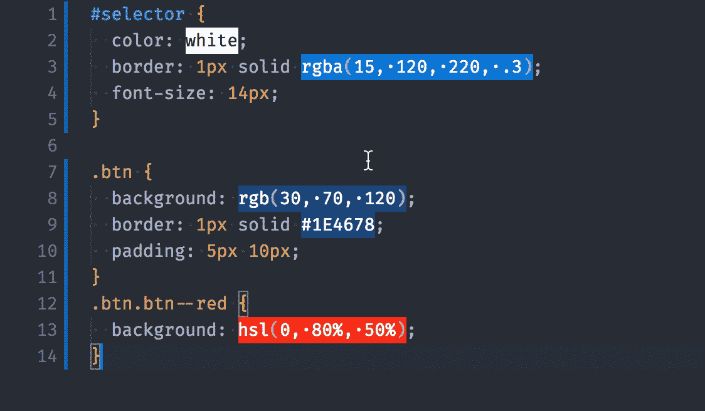](https://marketplace.visualstudio.com/items?itemName=kamikillerto.vscode-colorize)

**主要功能:**给你的代码中的文本和十六进制颜色代码着色。

Colorize 是一个 VSCode 扩展，它根据代码的语法为文本添加颜色。这对于前端开发人员来说也很有用，他们在设计元素时希望在代码编辑器中可视化颜色。

[**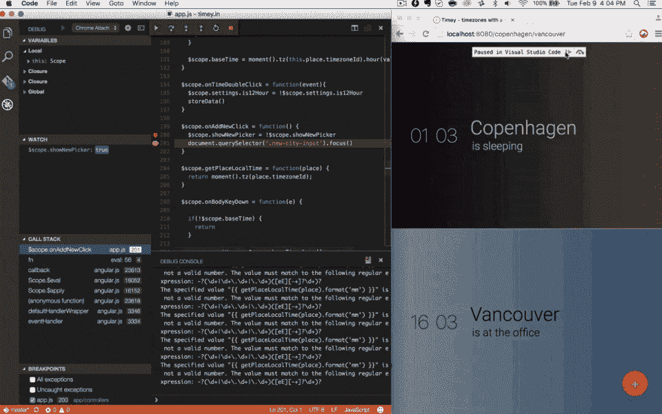**](https://marketplace.visualstudio.com/items?itemName=msjsdiag.debugger-for-chrome)

**主要特点:**直接从 VS 代码中调试 Chrome 中的 JS 代码。

使用这个工具，您可以在 VS 代码编辑器中的 Chrome 浏览器中直接调试 JS 代码。如果您需要调试 JavaScript 代码，但又想在不离开代码编辑器的情况下无缝地完成这项工作，这是非常好的。

**主要功能:**在 VS 代码内预览和插入图标。

Icon Fonts 是一个 VSCode 插件，它提供了一组可以在项目中使用的图标字体。如果您在项目中使用图标，并且想要一种快速有效的方式，而不必创建或获取自己的图标，那么您可以使用这个扩展。

[**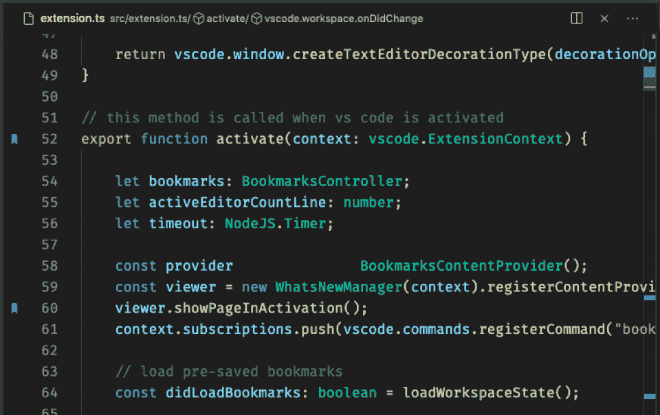**](https://marketplace.visualstudio.com/items?itemName=alefragnani.Bookmarks)

**主要特性:**在代码中快速添加和导航书签。

在处理大型代码库时，书签是更有用的 visual studio 代码扩展之一。它允许你为文件中的代码行添加书签，以便快速导航。这样，您可以轻松快速地导航到那些特定的代码行。

## **在 VS 代码中寻找和使用最佳扩展的技巧**

*   **使用 VSCode 官方市场:**在寻找 VSCode 的扩展时，请点击此处，因为这里有大量 VS Code 推荐的扩展，您可以按类别、评级、受欢迎程度等进行浏览。

*   **检查评论、评级和下载次数:**在开始将扩展安装到您的 VSCode 扩展位置之前，检查统计信息以查看是否值得安装，并阅读评论以查找问题或限制。

*   **不要一次安装太多的扩展:**只安装那些对您的工作流有用的扩展，因为一些 vscode 扩展设置可能会产生冲突，所以请保持 vscode extensions 文件夹中的数量。

*   **自定义您的扩展:**许多 VSC 扩展都有可自定义的设置，因此请务必根据您的需求进行配置。

*   **定期更新扩展:**保持扩展更新，以确保您使用的是最新的功能和错误修复。您可以配置 VS 代码来自动完成这项工作，也可以手动更新。

## **结论**

Visual Studio 代码是一个高度通用和可定制的代码编辑器，通过选择正确的 VSCode 扩展，它会变得更好。在本文中，我们介绍了 2023 年您需要的 30 个最佳 VSCode 扩展，以增强您的编码体验。

从像 Prettier 和 Live Server 这样的生产力助推器，到像 GitLens 和 Regex Previewer 这样的强大工具，这些扩展可以计时，减少错误，并改进您的工作流程。

VSCode Marketplace 中有大量可用的扩展，无论您是 web 开发人员、数据科学家还是游戏开发人员，都有适合您的东西。

花点时间探索这些 VSCode 扩展，找到最适合您需求的扩展。使用正确的扩展，您可以将您的编码技能提升到一个新的水平，并成为一名更高效的开发人员。

你使用 Angular 来创建 web 应用程序吗？结账:

**[最佳棱角状](https://hackr.io/blog/best-angular-ide-editor)**

## **常见问题解答**

### **1。VSCode 有几个扩展名？**

很难说出可用的扩展的确切数量。这是因为目前在 [Visual Studio 代码市场](https://marketplace.visualstudio.com/)中有数千个可用的扩展，并且新的扩展一直在发布。

### **2。为什么 Visual Studio 代码是最好的？**

最好的代码编辑器很大程度上取决于您的个人偏好，也取决于您正在从事的项目。但是 VS 代码在开发人员中很受欢迎，因为它使用起来很直观，具有跨平台兼容性，并且有大量有用的扩展。