# 2023 年 12 门最佳 Vue.js 在线课程【免费+付费】

> 原文：<https://hackr.io/blog/best-vue-js-courses>

Vue.js 是一个开源的 JavaScript 前端框架，用于创建用户界面(UI)和单页应用程序(SPA)。Vue.js 被认为是顶级的 JavaScript 框架之一，越来越多的开发者喜欢 Vue 以及 React 和 Angular。

是什么让 Vue.js 如此受欢迎？Vue 是一个简单、通用、用户友好的框架，具有优秀的社区支持和文档。它也是可伸缩的、灵活的、轻量级的，并且比其他 JS 框架更容易学习。

本文涵盖了 2023 年 12 个最好的 Vue.js 在线课程。因此，无论您是前端开发新手、想要学习 Vue 的经验丰富的开发人员，还是希望扩展技能的经验丰富的 Vue 专业人员，我们都为您找到了一门课程。

**特色 Vue。JS 课程【编辑推荐】**

## **寻找最佳 Vue.js 课程**

通过考虑几个因素，我们在网上找到了 2023 年 12 个最好的 Vue.js 课程。

*   **课程指导老师:**他们是经验丰富的老师还是行业专业人士？
*   **课程内容:**这对于现实世界的开发者角色来说是否详细且相关？往届同学推荐吗？
*   **社区:**有多少人上过这门课？容易得到支持吗？

## **2023 年 12 个最佳 Vue 在线课程**

**想知道 Vue.js 和 React 比起来怎么样？结账:**

**[反应对视图](https://hackr.io/blog/react-vs-vue)**

[**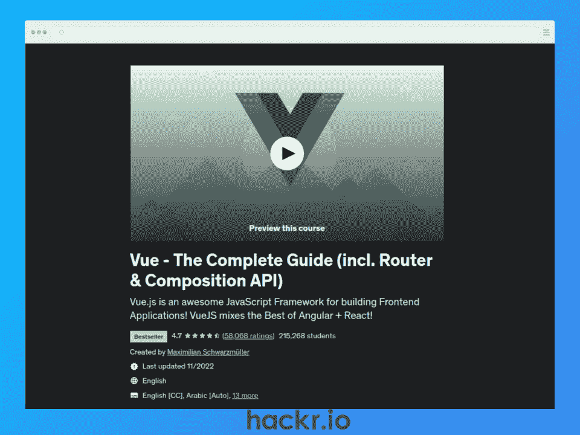**](https://click.linksynergy.com/deeplink?id=jU79Zysihs4&mid=39197&murl=https%3A%2F%2Fwww.udemy.com%2Fcourse%2Fvuejs-2-the-complete-guide%2F)

**[了解更多](https://click.linksynergy.com/deeplink?id=jU79Zysihs4&mid=39197&murl=https%3A%2F%2Fwww.udemy.com%2Fcourse%2Fvuejs-2-the-complete-guide%2F)**

**我们为什么选择本课程**

作为 Udemy 上最畅销的 Vue.js 课程，这个综合性的 Vue 班从头开始教 Vue.js 3。

期望涵盖所有基础，包括反应数据、事件、DOM 交互、Vue 组件、HTTP 请求、认证、路由，甚至部署您的 Vue 应用。您还将学习如何构建单页和多页应用程序。

**优点**

*   基于项目的真实示例
*   了解如何构建单页和多页应用程序
*   包括练习

**缺点**

*   助教可能回答问题比较慢

**关键信息**

**讲师:**maximilin black fill er

**等级:**初级到中级

**必备:** HTML、CSS、JavaScript 知识

**免费或付费:**付费

**证书:**是

**持续时间:** 32 小时

**评级:** 4.7/5

[**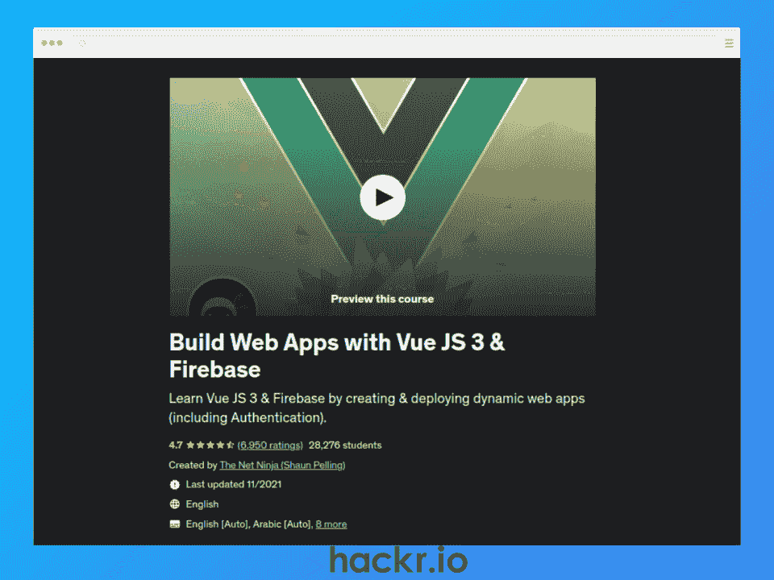**](https://click.linksynergy.com/deeplink?id=jU79Zysihs4&mid=39197&murl=https%3A%2F%2Fwww.udemy.com%2Fcourse%2Fbuild-web-apps-with-vuejs-firebase%2F)

**[了解更多](https://click.linksynergy.com/deeplink?id=jU79Zysihs4&mid=39197&murl=https%3A%2F%2Fwww.udemy.com%2Fcourse%2Fbuild-web-apps-with-vuejs-firebase%2F)**

**我们为什么选择本课程**

通过本课程，您可以获得 Vue 路由器、Vue CLI、Options API、Composition API 和 Teleport 等 Vue 功能的实践经验，从而掌握 Vue3。

您还将使用 Vue 和 Firebase 部署四个 web 应用程序，让您在下次面试前充实您的简历和作品集！

**优点**

*   实践学习
*   学习将 Firebase 与 Vue 集成
*   使用最新版本的 Vue
*   为您的投资组合构建真实世界的应用

**缺点**

*   只查看后端的 Firebase

**关键信息**

**指导老师:**网络忍者(肖恩·佩林)

**等级:**初级到中级

**先决条件:**基本的 HTML、CSS 和 JavaScript 知识

**免费或付费:**付费

**证书:**是

**持续时间:** 32 小时

**评级:** 4.7/5

[**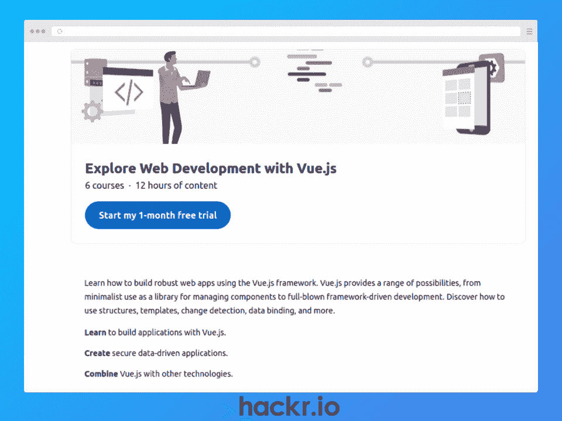**](http://linkedin-learning.pxf.io/mgDOnX)

**[了解更多](http://linkedin-learning.pxf.io/mgDOnX)**

**我们为什么选择本课程**

这个 Vue.js 类是在使用 Vue.js 框架构建高级 web 应用程序之前学习基础知识的绝佳资源。

本综合课程提供专家指导，帮助您学习构建 Vue 接口、将 Vue 与 Node 集成、使用 Vuex 管理状态，甚至如何托管您的应用。

**优点**

*   综合课程材料
*   课程测验和练习
*   用 Node.js 覆盖 Vue

**缺点**

*   子课程是分开的，所以缺乏一定的结构

**关键信息**

指导老师:迈克尔·苏立文、雷·维拉洛博斯等等

**等级:**初级到中级

**必备:** HTML、CSS、JavaScript 知识

**免费或付费:**付费

**证书:**是

**持续时间:** 12 小时

**评级:**不适用

[****](https://click.linksynergy.com/deeplink?id=jU79Zysihs4&mid=47764&murl=https%3A%2F%2Fwww.educative.io%2Fcourses%2Fhands-on-vue-js-build-fully-functional-spa)

**[了解更多](https://click.linksynergy.com/deeplink?id=jU79Zysihs4&mid=47764&murl=https%3A%2F%2Fwww.educative.io%2Fcourses%2Fhands-on-vue-js-build-fully-functional-spa)**

**我们为什么选择本课程**

本课程将通过 Vue 课程的实践方式，而不是标准的基于视频的方法，向您传授使用 Vue.js 构建单页面应用程序(SPA)所需的技能。

您将从对 Vue.js 的全面概述开始，然后深入研究一些关键概念，如指令、呈现、用户输入处理和组件。这个互动课程还包括测验和编码挑战，以加强你对材料的理解。

**优点**

*   构建一个功能齐全的单页应用程序
*   实践编码环境和评估
*   课程定期更新

**缺点**

*   动手而不是基于视频的学习可能不适合每个人

**关键信息**

**讲师:**不适用

**等级:**初学者

**先决条件:**基础 JavaScript

**免费或付费:**付费

**证书:**是

**持续时间:** 8.5 小时

**评级:**不适用

[查找远程 Vue 开发人员职位](https://jobs.hackr.io/search/jobs?searchTerm=%22Vue%20developer%22&location=Remote,%20USA)

[**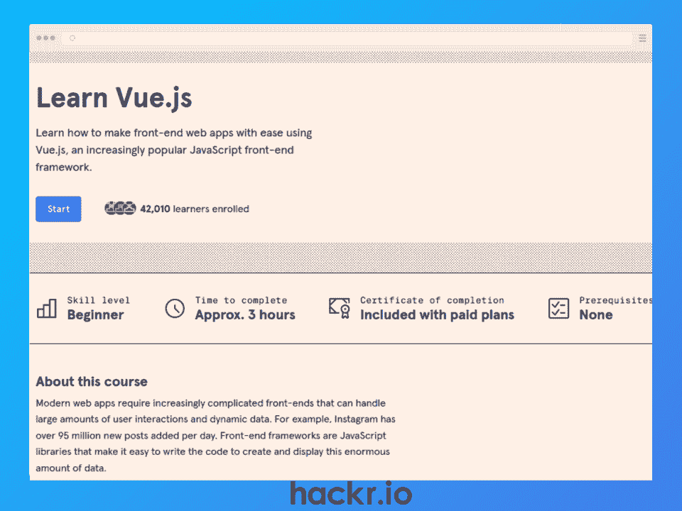**](https://www.pjtra.com/t/TUJGR0lLR0JHRklKSkdCR0ZISk1N?url=https%3A%2F%2Fwww.codecademy.com%2Flearn%2Flearn-vue-js)

**[了解更多](https://www.pjtra.com/t/TUJGR0lLR0JHRklKSkdCR0ZISk1N?url=https%3A%2F%2Fwww.codecademy.com%2Flearn%2Flearn-vue-js)**

**我们为什么选择本课程**

这个简短的 Vue.js 培训课程是学习使用 Vue 构建前端 web 应用程序的基础知识的绝佳方式。尽管只有 3 个小时，但不要被愚弄了，因为它涵盖了很多内容。

期望学习如何设置一个 Vue 应用程序，创建和样式化表单，处理真实世界的动态数据，创建 Vue 组件，DOM，数据绑定，以及如何用 Vue 处理复杂的前端问题。我说过了，这里有很多！

**优点**

*   通过互动平台进行实践学习
*   包括测验、练习项目和评估

**缺点**

*   短期课程，因此可能需要补充学习

**关键信息**

**讲师:**不适用

**等级:**初学者

先决条件: JavaScript inc. OOP、HTML 和 CSS

**免费或付费:**付费

**证书:**是

**持续时间:** 3 小时

**评级:**不适用

[**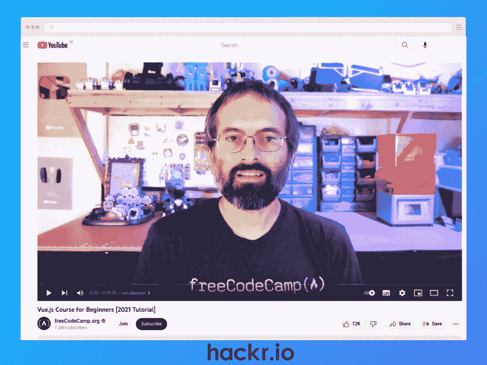**](https://www.youtube.com/watch?v=FXpIoQ_rT_c)

**[了解更多](https://www.youtube.com/watch?v=FXpIoQ_rT_c)**

**我们为什么选择本课程**

这是初学者从零开始学习 Vue.js 的绝佳方式。这个免费的 Vue 培训课程对初学者友好且全面，涵盖了基本概念，如设置 Vue、事件和方法、Vue 指令、组件和挂钩。

如果你想开始学习 Vue.js，又不准备做财务承诺，这是一个很好的选择。

**优点**

*   完全免费的课程
*   全面的内容涵盖了基本的 Vue 概念
*   交互式编码演练和实践学习

**缺点**

**关键信息**

**导师:**自由代码营

**等级:**初学者

**必备:**基础 JavaScript、HTML、& CSS 知识

**免费或付费:**免费

**证书:**否

**持续时间:** 3.75 小时

**评级:**不适用

[**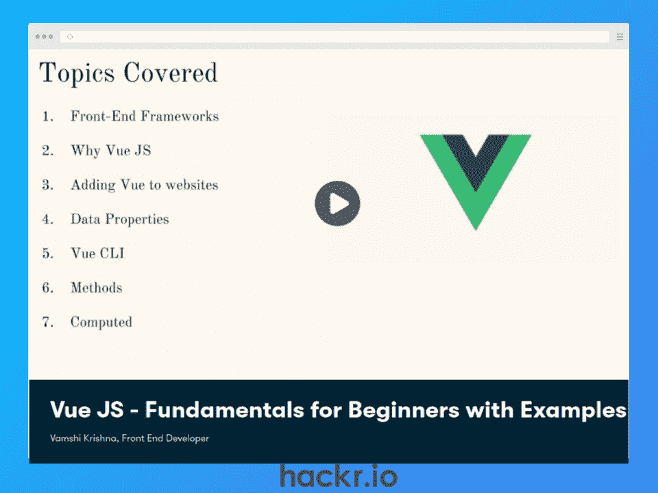**](http://skillshare.eqcm.net/P02OaY)

**[了解更多](http://skillshare.eqcm.net/P02OaY)**

**我们为什么选择本课程**

对于想要学习 Vue.js 进行前端开发的 JavaScript 框架初学者来说，这是一门理想的课程。

虽然 2.5 小时比较短，但是涵盖了 Vue.js 和其他前端框架的区别，Vue CLI，数据属性，数据绑定，事件等等。它甚至涵盖了条件渲染、生命周期挂钩和路由等高级主题。

**优点**

*   Vue.js 的简短详细介绍
*   动手课堂项目
*   交互式编码示例

**缺点**

*   不包括完工证书

**关键信息**

导师:瓦姆希·克里希纳

**等级:**初学者

**先决条件:**基本的 JavaScript、HTML 和 CSS 知识

**免费或付费:**付费

**证书:**否

**持续时间:** 2.5 小时

**评级:**不适用

[**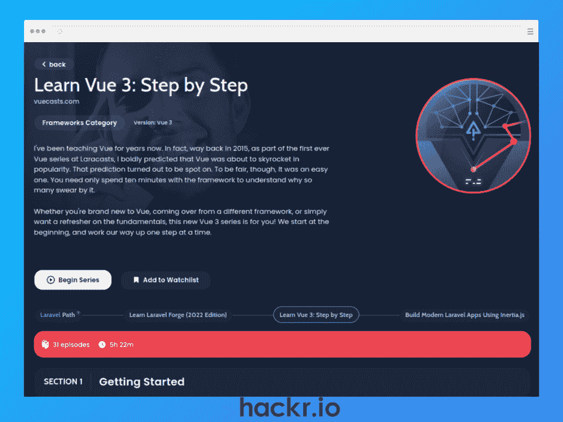**](https://laracasts.com/series/learn-vue-3-step-by-step)

**[了解更多](https://laracasts.com/series/learn-vue-3-step-by-step)**

**我们为什么选择本课程**

这是一门非常棒的免费 Vue 课程，面向初学者，讲述了使用 Vue.js 构建 web 应用的基础知识。

您将了解如何将 HTML 属性绑定到表达式、事件处理、HTML 和 Vue 组件的条件显示、复合 API、跨应用程序管理状态等等。

**优点**

*   包含综合材料的免费课程
*   经验丰富且备受尊敬的讲师
*   通过仪表板项目进行实践学习

**缺点**

*   没有结业证书

**关键信息**

**教官:**杰弗里道

**等级:**初学者

**先决条件:**无

**免费或付费:**免费

**证书:**否

**持续时间:** 5.5 小时

**评级:**不适用

[**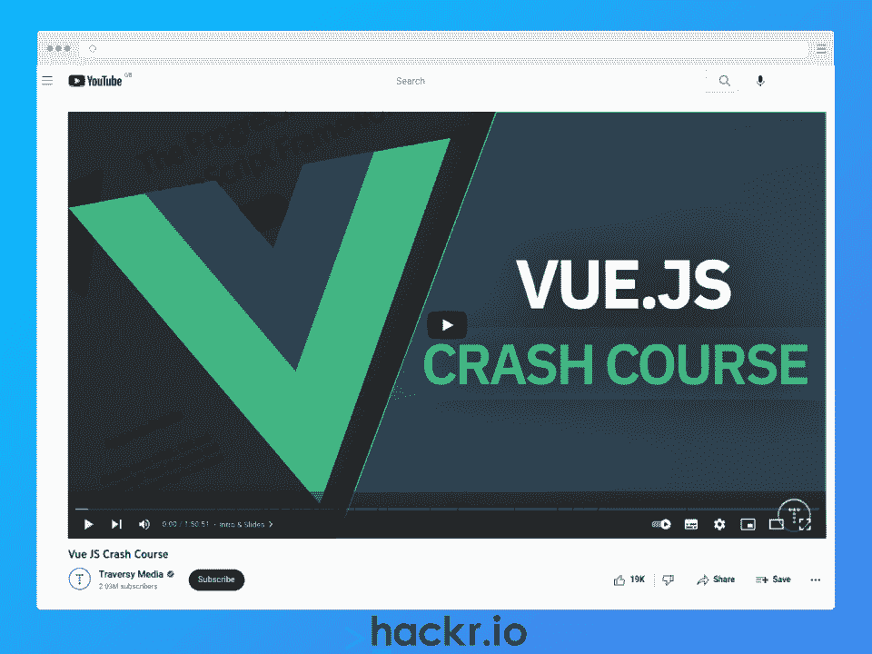**](https://www.youtube.com/watch?v=qZXt1Aom3Cs)

**[了解更多](https://www.youtube.com/watch?v=qZXt1Aom3Cs)**

**我们为什么选择本课程**

这份简短但温馨的免费 Vue.js 初学者教程非常适合快速学习基础知识。

您将通过基于项目的学习方法来学习 Vue.js 3 的基础知识，从而实际操作 Vue CLI、组件、事件、类、动态类和路由。因此，虽然可能不到两个小时，但它充满了冲击力。如果你有学习 Vue.js 的想法，但你不确定是否要支付课程费用，这也很好。

**优点**

*   完全免费的速成班
*   涵盖了所有的基础知识
*   基于项目和实践的学习

**缺点**

**关键信息**

**讲师:**旅行媒体

**等级:**初学者

**先决条件:**无

**免费或付费:**免费

**证书:**否

**持续时间:** 1.5 小时

**评级:**不适用

[**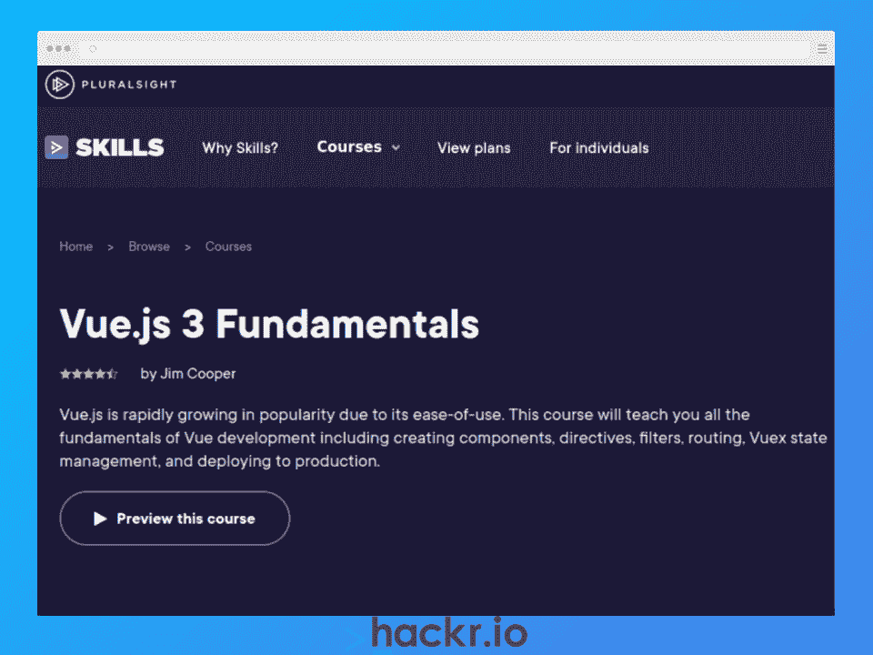**](https://pluralsight.pxf.io/e4O1Rj)

**[了解更多](https://pluralsight.pxf.io/e4O1Rj)**

**我们为什么选择本课程**

这对于任何想要学习 Vue.js 基础知识的人来说都是理想的。虽然提供商将其列为中级，但它与我们的其他初学者选项相当。

不到 6 个小时，是一个相对较短的课程，但希望了解 Vue CLI、如何创建 Vue 组件、页面到页面路由和管理状态。您还将通过从头构建您的 Vue 项目并将其部署到生产中来使用这些技能。

**优点**

*   基本概念的全面覆盖
*   实践和基于项目的学习
*   为 Vue.js 3 更新

**缺点**

*   缺乏讲师支持

**关键信息**

教练:吉姆·库珀

**等级:**初学者

**先决条件:**基本的 HTML、CSS 和 JavaScript 知识

**免费或付费:**付费

**证书:**是

**持续时间:** 5.75 小时

**评级:** 4.5/5

[**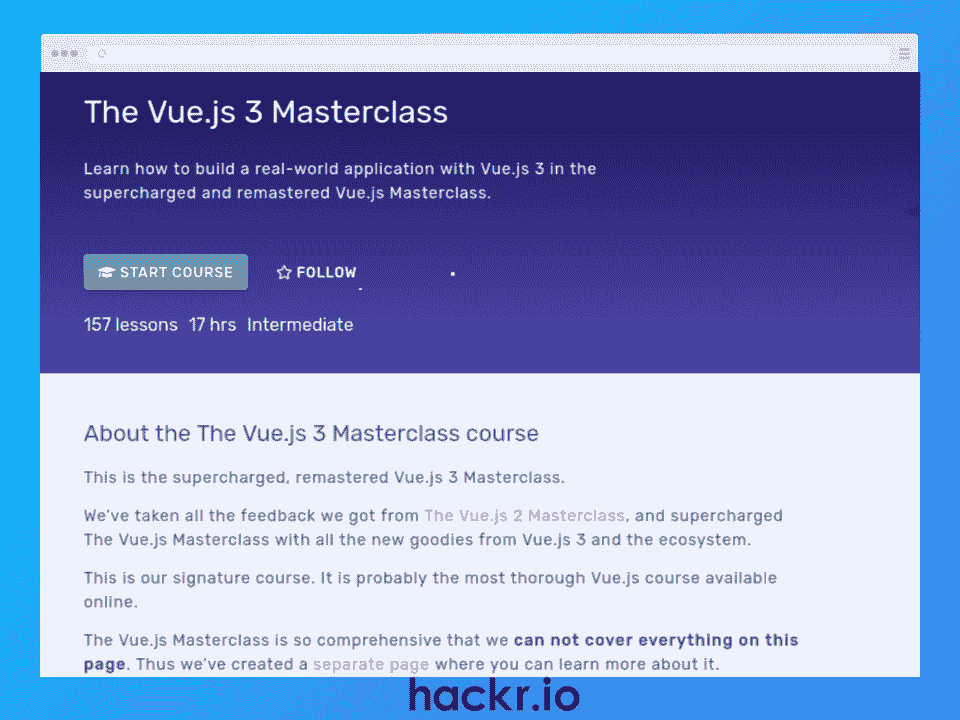**](https://vueschool.io/courses/the-vuejs-3-master-class)

**[了解更多](https://vueschool.io/courses/the-vuejs-3-master-class)**

**我们为什么选择本课程**

Vue School 的最新产品 Vue.js 3 Masterclass 是一门全面的课程，用于学习如何使用 Vue 从头开始构建真实世界的应用程序。

希望从基础开始，比如 Vue CLI、状态管理、身份验证、最佳实践等等。然后，您将准备好讨论更高级的主题，如高阶函数、如何创建 Vue 插件、Webpack 配置和部署。

像任何好的 Vue.js 课程一样，你将通过为你的作品集构建一个真实世界的应用程序来使用这些技能。

**优点**

*   综合课程材料
*   了解最佳实践
*   为你的投资组合构建一个真实的应用程序

**缺点**

*   快节奏对完全的初学者来说可能具有挑战性

**关键信息**

教练:亚历克斯·基里亚基迪斯和丹尼尔·凯利

**等级:**中级

**前提:**基础 JavaScript 和 Vue.js 知识

**免费或付费:**付费

**证书:**是

**持续时间:** 17 小时

**评级:**不适用

[**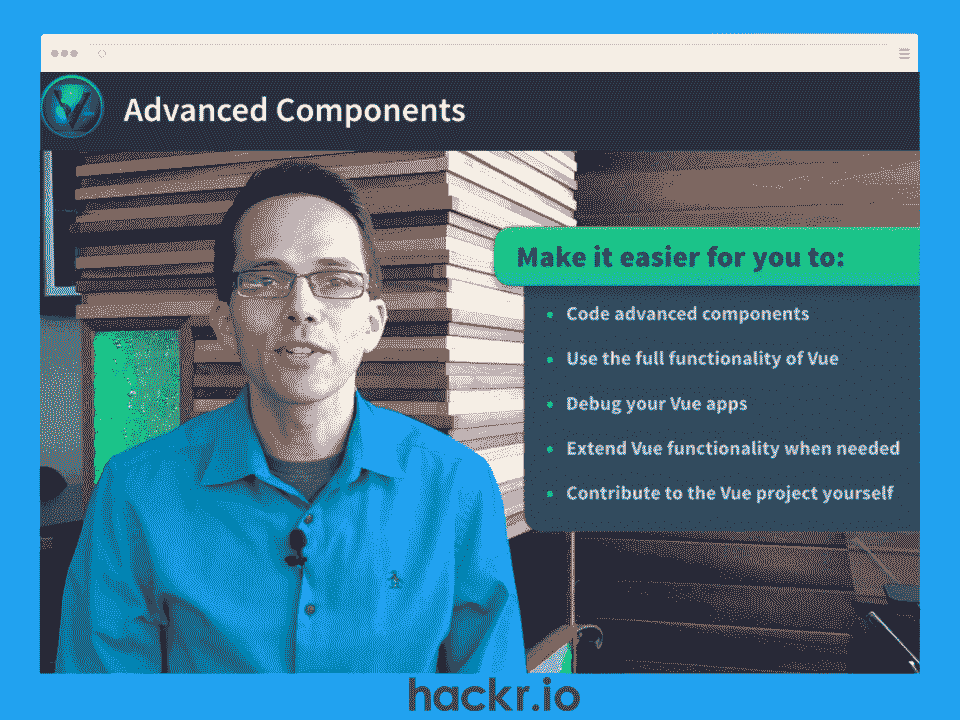**](https://www.vuemastery.com/courses/advanced-components/the-introduction)

**[了解更多](https://www.vuemastery.com/courses/advanced-components/the-introduction)**

**我们为什么选择本课程**

如果你是一名 Vue.js 开发人员，想要提升他们的技能，这是适合你的课程。

在不到 2 个小时的时间里，这门高级 Vue.js 课程旨在通过了解 Vue 组件的工作原理、如何有效地使用它们、如何调试它们以及如何扩展它们的功能来帮助您掌握它们。

期望学习反应线，模板编译，渲染函数，道具等等。在本短期课程结束时，您将能够创建更复杂的应用程序，同时加深对 Vue 的理解。

**优点**

*   Vue 组件的高级内容
*   高级主题的动画说明
*   动手练习

**缺点**

*   不适合初学者，但针对高级 Vue 开发人员

**关键信息**

教练:格雷格·波拉克

**等级:**高级

**必备:** Javascript 和 Vue.js 知识

**免费或付费:**付费

**证书:**是

**时长:** 1 小时 45 分钟

**评级:**不适用

## **结论**

如果您对前端开发感兴趣，您可能已经花时间学习了 JavaScript、HTML 和 CSS。提升技能的最好方法之一是学习前端 JavaScript 框架。这就是 Vue.js 的用武之地，因为它是 ui 和单页面应用程序的理想选择。

随着 Vue.js 成为最受欢迎的 JavaScript 框架之一，您可以期待加入一个由志同道合的开发人员组成的大型社区。这太棒了，因为这意味着您可以找到许多在线资源，如 Vue.js 教程、文档和支持论坛。

无论您是前端开发的新手，还是希望提高技能的经验丰富的开发人员，我们都在 2023 年找到了 12 个最佳 Vue.js 在线课程。我们甚至为初学者和专业人士找到了一系列免费和付费的选项，所以在我们的列表中有你想要的东西！

**想了解更多关于 JavaScript 的知识吗？结账:**

**[最好的 JavaScript 课程](https://hackr.io/blog/best-javascript-courses)**

## **常见问题解答**

### **1。Vue.js 好学吗？**

Vue.js 因其简单的语法、清晰的文档和活跃的社区而易于学习而闻名，如果您遇到困难或有不寻常的疑问或问题，活跃的社区总是乐意提供帮助。也正是因为这样，Vue.js 才获得了这么大的人气。

### **2。最好的 Vue.js 课程是什么？**

这取决于你的目标和喜欢的学习方式。如果你是一个初学者，想要一个有结业证书的综合课程，可以看看 Udemy 的[Vue](https://click.linksynergy.com/deeplink?id=jU79Zysihs4&mid=39197&murl=https%3A%2F%2Fwww.udemy.com%2Fcourse%2Fvuejs-2-the-complete-guide%2F)完全指南或者 Educative 的[实践课程](https://click.linksynergy.com/deeplink?id=jU79Zysihs4&mid=47764&murl=https%3A%2F%2Fwww.educative.io%2Fcourses%2Fhands-on-vue-js-build-fully-functional-spa)，它更喜欢编码而不是视频内容。如果你不确定，看看我们列表中的任何选项，因为它包括一系列免费和付费选项。

### **3。2023 年的 Vue 值得学吗？**

是的，Vue 绝对值得 2023 年学习！Vue 仍然是最受欢迎的 JavaScript 框架之一，拥有一个庞大而有用的社区。它还具有灵活性、高性能、轻量级和易用性，是前端开发新手的理想选择。此外，Vue 开发人员的平均基本工资有望超过 85，000 美元