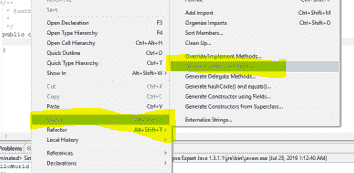

# 学习 Java 编程的最佳方法[循序渐进指南]

> 原文：<https://hackr.io/blog/best-way-to-learn-java>

无论你有什么样的背景，学习 Java 都是简单而有趣的。有了这本全面的指南，您将拥有帮助您开始 Java 之旅和掌握基本概念的所有资源。

Java 是–

*   面向对象的编程语言
*   独立于平台
*   能够自动收集垃圾
*   多线程和并发

Java 代码运行在 Java 虚拟机上，虚拟机将 Java 代码翻译成操作系统能够理解的语言。所有这些特性使 Java 成为 2023 年 T2 顶级编程语言之一。

## **学习 Java 的最佳方法**

嗯，学习任何东西都没有捷径，Java 也一样。如果你想掌握这门语言(相信我，这是值得的)，你必须在你的系统中设置它，并开始练习。下载并安装 JDK (Java 开发工具包)和 JRE (Java 运行时环境)以及任何你喜欢的 IDE。 [Easy Eclipse](http://easyeclipse.org/site-1.0.1/distributions/desktop-java.html) 非常适合编写程序和构建独立的应用程序。

好了，在我们进入核心概念之前，这里有一些你应该永远记住的事情

*   千万不要以**“学 Java 有多难”的心态开始。仍然认为它必须是安全的，这就是为什么这么多人在做它。**
*   如果你不是程序员，请多一些耐心——你一定会成功的。
*   思考一个现实世界的场景，并列出你将如何实现它。比如你想买大筐的杂货，结账流程是怎样的？同样的方式，你会怎么做？如果你想到了一个设计/流程，你一定会找到方法去实现它并得到结果。使用 Java 和 J2EE 构建成熟的 web 应用程序是可能的。
*   有大量的资源可以用来学习 Java。如果你陷入了困境，Java 社区是重要而活跃的，它会帮助你。
*   IDE 会处理所有的语法错误。所以，关注核心功能，但也要了解语法。
*   [阅读这篇文章](https://hackr.io/blog/what-is-java)并遵循从一个简单的程序开始，然后在其上添加功能以使其更加复杂和交互的方法。

现在我们有了积极的心态和学习的动力，让我们看看用 Java 编写高效代码需要学习的所有概念

### **变量和数据类型**

每天，我们都会遇到不同类型的数据。例如，你的汽车司机的电话号码是一个整数，但他的名字是一个字符串(字符数组)。同样的，他放在你车里的汽油价格是一个浮点数(十进制)。Java 处理许多数据类型——

```
String driverName;
int telephoneNo;
float petrolPrice;
boolean isRegular;

```

Java 的最佳实践之一是遵循正确的**命名约定。**变量(驱动名，电话。等等……)像上面的 and 方法要从一个小 case 开始，下面的单词以大写字母开头——driver**N**ame。同样，由于 boolean 数据类型返回 true 或 false，因此以 is、are、has 等开头命名变量是一个好习惯。…

将数据存储在变量中的好处是我们可以在代码的任何地方使用变量。使用变量的限制是由其作用域定义的，可以是**局部、静态或全局**。

数据类型 char、int、float、boolean 和 double 被称为基本类型，Java 对每种类型都有相应的对象。比如 int 有 Integer 布尔有布尔，以此类推。字符串是一个对象。

那么，我们如何处理这些数据呢？我们对它执行一些操作！

### **操作**

例如，根据司机是否是固定的，我们可以给他一些激励措施，或者根据他加的汽油量，我们可以知道他开了多少公里。

```
if (isRegular)
{ 
salary += 200;
}

```

条件内表达式的结果只能是布尔值。如果我们比较两个字符串，例如 if(driverName == "Chand ")，我们使用比较运算符' == '，它不同于赋值运算符' = . '同理，还有、> =等等。

### **条件**

就像我们在上面看到的一样,“如果”是一个条件，它测试某些东西是否准确，并相应地返回结果。它通常与可以处理多种情况的 else if 和 else 语句结合使用。

```
if(marks < 23)
grade = ‘F’;
else if(marks > 23 && marks < 60)
grade = ‘D’;
else 
grade = ‘B’;

```

注意&&意味着 if 要成功，两个表达式都必须为真。

### **功能**

我们编写的大量代码可以被分离成代码块，以便应用程序的许多部分可以重用它。系统的这些模块被称为功能。例如，应用等级可以是基于分数的函数。当系统被划分成更小的功能时，看起来很简洁，也很容易理解。它是模块化的，可重用的。

Java 中的函数名以小写开头，后面的单词第一个字母大写。例如，get grades(浮点标记)返回 char，isRegular(String driverName)返回 boolean，等等。

好了，现在 Java 的真正威力来了。

**建议课程**

[面向完全初学者的 Java 编程](https://click.linksynergy.com/deeplink?id=jU79Zysihs4&mid=39197&murl=https%3A%2F%2Fwww.udemy.com%2Fcourse%2Fjava-programming-tutorial-for-beginners%2F)

### **面向对象编程**

如果你想深入了解 [OOPS 概念](https://hackr.io/blog/oops-concepts-in-java-with-examples)的细节，请浏览上面给出的视频，我之前已经在本文中嵌入了这个视频。尽管如此，对于本文，您需要知道的是，在 OOPS 中，一切都被认为是一个对象。一支铅笔是一个物体，一辆汽车，一株植物，一只动物，甚至一个司机也是一个物体。

继续我们的驱动程序示例，比如说，以下属性标识 driver*–*driver name、joiningDate、isRegular、dateOfBirth 和 avgCustomerRating。

比方说，像优步这样的服务提供商会有很多这样的司机。每个驱动因素都具有所有这些属性，这些属性将通过其独特的值来区分。这意味着，我们可以用这些属性创建一个类‘Driver’作为课程的*成员*。每当我们需要获取或设置特定驱动程序的详细信息时，我们将使用 new 运算符创建一个驱动程序类的“对象”。

```
Driver driver = new Driver();

```

当我们创建类时，我们也为成员创建了“getter 和 setter”方法，通过它们我们可以获得成员的单个值。如果我们必须设置整个对象，我们可以使用一个应该在类中定义的构造函数。

```
public Driver(String driverName, String joiningDate, boolean isRegular, String dateOfBirth, float avgCustomerRating){
this.driverName = driverName;
this.joiningDate = joiningDate;
this.isRegular = isRegular;
this.dateOfBirth = dateOfBirth;
this.avgCustomerRating = avgCustomerRating;
}

```

现在，当我们想要创建一个对象时，我们可以通过调用 new 操作符和这个构造函数来实现

```
Driver driver1 = new Driver(“John”, “21/12/2018”, true, “12-01-1983”, 4.5);

```

如果您同时练习代码，在修复编译错误(如果有)后，构建并运行程序，然后展开您的项目。你会看到。对应于每个。java 文件。

### **数据结构和循环**

Java 中有许多数据结构，如数组、列表、映射、树等等。所有这些都在集合框架下，除了 Array，它是 java.util 包的一部分。学习收集将会给你存储和检索数据带来巨大的满足感——这意味着你赢得了一半的胜利。让我们用数组做一个简单的例子。在我的文章[什么是 Java](https://hackr.io/blog/what-is-java) 中，我已经使用 ArrayList 做了类似的操作，请检查一下。

```
Driver[] drivers = new Driver[5];

```

//为每个驱动程序设置驱动程序详细信息，或者从数据库或用户输入中获取它

假设有五个司机，我们希望根据每个司机的一些条件来设置工资。我们为此使用了一个“for”循环。

```
for(int i=0; i<5; i++)
{
if(driver[i].isRegular && driver[i].salary < 4000)
driver[i].salary += 200;
}

```

请注意，我们获取每个驱动程序的详细信息，然后对每个驱动程序进行一些检查。之后，我们设置一个值。在这里，我们将驱动程序的开销硬编码为 5，但是在实际的应用程序中，我们将从数据库或控制台获取它。

怎么会？

### **用户输入**

考虑从用户处获取驱动程序详细信息。对于每个驱动程序，让我们使用刚刚学习的 For 循环带来进一步的信息。首先，让我们创建数组。这一次我们不会固定长度。让我们问一下用户。

如果您还没有创建我们最喜欢的驱动程序类，现在就使用您的 IDE 来创建吧。这些东西最好在实践中学习。要创建这个类，让我们首先在 IDE 上创建一个项目。创建任意名称的项目，例如 SampleProject。然后创建一个名为 src 的包(意思是源代码)。在包内，用成员创建类驱动程序。只需点击几个按钮，就可以在 IDE 上生成 getters 和 setters。



现在，按照我们前面讨论的那样编写或创建构造函数。

现在，让我们创建我们的测试类，它将具有**public****static****void**primary(String args[])方法。

要从用户那里获得输入，最好的方法是使用“扫描仪”方法。

```
Scanner scanInput = new Scanner(System.*in*);

```

做同样的事情还有其他的方法。

在此之后，我们可以使用扫描器的 next()方法逐个获取输入。我们得到的第一件事是需要存储信息的驾驶员的数量。然后，我们创建一个相同长度的数组，遍历它，实例化循环中的每个对象，并使用构造函数或 setter 方法设置值。

### **连接到数据库**

为了让我们的 java 代码连接到数据库，我们需要一个 JDBC 驱动程序(不同于我们的汽车驱动程序)。不同的数据库有不同的驱动程序；比如对于 MySQL，驱动会是 **com.mysql.jdbc.Driver** 。接下来，我们需要连接到数据库所在的 URL(位置)。为了访问数据库，我们也需要用户名和密码。获得连接后，我们可以通过代码执行查询来获取或设置必要的细节。

对于任何简单或复杂的 web 应用程序，您必须了解 JDBC (Java 数据库连接)。[参加这个精彩的教程](https://hackr.io/tutorial/java-jdbc-tutorial)来解释 JDBC 的连通性。你会喜欢自学的。

### **处理文件**

Java 中的文件处理是使用两个类 FileWriter 和 FileReader 完成的。Java 文档描述了这些类提供的所有方法和构造函数，它们非常简单。早先，使用了 FileInputStream 和 FileOutputStream，但是前两者是优选的，因为它们写字符流，而后两者是字节流类。请记住，对于文件处理，捕捉像 FileNotFoundException 这样的异常是非常重要的。

### **异常处理**

Java 允许很大的灵活性。但是作为一名开发人员，我们需要知道在什么情况下我们的代码会给出不正确的结果。其中一种情况是用户没有输入正确的值。例如，如果您将 driverName 设置为字符串，而用户引入了一些数字或随机字符，我们应该能够处理这种情况并通知用户。这些通常在客户端使用 [JavaScript](https://hackr.io/tutorial/the-complete-javascript-course-build-a-real-world-project?ref=blog-post) 完成，但是 JavaScript 可以被禁用。作为开发人员，我们也需要这种验证。一些标准的异常是-: NullPointerException:当我们试图在一个空对象上做一些操作时。

NumberFormatException:当我们试图将一个字符串转换成一个数字，这是无效的。

ArrayIndexOutOfBoundsException:当我们试图访问一个超过列表大小的元素时

在 Java 中有许多这样的已检查和未检查的异常，对于健壮的代码，您需要注意这些异常。

### **垃圾收集**

当我们想到垃圾的时候，我们总是厌恶它，但是 Java GC 是你想知道的东西。作为一名程序员，你不必担心垃圾收集器线程是如何工作的。它只是安静地工作。然而，如果你感兴趣，这是一本很好的读物，在一些核心 java 访谈中也会被问到。在这里阅读关于 Java 垃圾收集的内容。

### **多线程**

为了处理并发性，Java 支持多线程并具有高效的内置方法。虽然许多人认为线程是一个可怕的话题，但对 Java 来说并非如此。线程有时确实表现不同，但我们都有情绪波动的时候，不是吗？如果处理得当，线和我们一样总是处于最佳状态。

例如，您正试图预订一辆出租车。当你检查多个选项时，更多的用户试图从相同的起点寻找相同的出租车。

### 谁得到预订？

第一个确认并获得*手柄*的人！如果你预订得很快，乘车服务就会为你锁定*——其他乘客不会看到这辆特别的出租车。但是，如果您因故取消驾驶室，*锁*被*释放，*驾驶室*可供他人*使用。同样的概念也适用于螺纹。如果一个线程正在修改其他线程想要访问的代码的一部分，其他线程必须等待轮到他们，这样所有的线程就不会同时处理相同的数据并破坏它。多线程让我们的生活变得简单——想想在线票务、银行交易和所有安全交易——如果每个人都可以同时访问相同的数据，世界将会充满混乱！*

 *我通过 Kathy Sierra 的这本优秀的大脑友好指南学习了 threads。我不知道这是他们熟悉的解释方式还是头脑优先的方法，这个概念在我的脑海中根深蒂固，以至于我可以在面试的几分钟内写下一个完整的 2 页程序。面试官(后来成了我的经理)惊呆了，甚至在我入职几天后还在谈论这件事！

### **创建网络应用**

好了，现在我们来看看真正的东西！学习 Java 的全部目的是创建健壮的、交互式的、快速的 web 应用程序。如果您已经安装了 IDE，那么您需要做的就是将 J2EE 组件安装到您的 IDE 中。[阅读这篇博客](https://www.theserverside.com/definition/J2EE-Java-2-Platform-Enterprise-Edition)了解 J2EE 如何帮助构建可伸缩和健壮的网络应用。

要构建 web 应用程序，您需要了解 servlets 和 JSP (Java 服务器页面)的基础知识，这些知识很容易学习。还有许多其他的框架，如 Spring、Struts，当与 Java 结合时，它们可以提供强大的 web 应用程序。[这里有一个很好的教程](https://hackr.io/tutorial/projects-in-enterprise-java?ref=blog-post)，它在一门课程中涵盖了所有这些内容，并且采用了实用(动手)的方法。

### **创建网络服务**

Java web 服务用于与 MVC 架构的不同层进行交互。Java Web 服务(JWS)应用有两种通信方式——SOAP 和 [RESTful 服务](https://hackr.io/tutorial/master-java-web-services-and-rest-api-with-spring-boot?ref=blog-post)。通信是通过 WSDL (Web 服务描述语言)完成的。[阅读这篇内容丰富的教程](https://hackr.io/tutorial/java-web-services?ref=blog-post)，它涵盖了关于 SOAP 和 REST 的所有内容，可以帮助你开始学习 Java web 服务。

## **结论**

在这篇博客中，我给了你很多掌握 Java 需要知道的资源和各种子主题的链接。Java 还使用了许多其他的概念，比如装箱、拆箱、设计模式、泛型等等，这些都有助于你更好的编码实践，但是这些概念将帮助你构建一个功能性的应用程序。当你在做的时候，你也应该通过检查你是否能回答这些 [Java 面试问题](https://hackr.io/blog/java-interview-questions)来确保你的理解是正确的！[这里也有一个不错的付费教程](https://hackr.io/tutorial/complete-java-masterclass?ref=blog-post)，一旦你完成了基本的练习，你就可以开始学习。一定要看看我们的[全面的 Java 书籍列表](https://hackr.io/blog/best-java-books-for-beginners-and-advanced-programmers#10_Best_Java_Books_for_Beginners_and_Advanced_Programmers),这会让学习 Java 成为你一次愉快而彻底的经历。

**人也在读:***