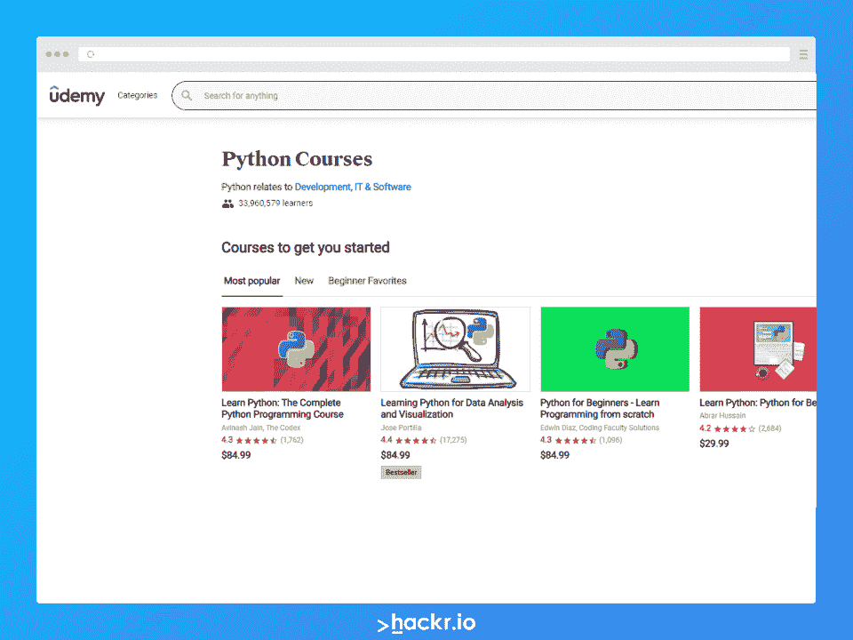
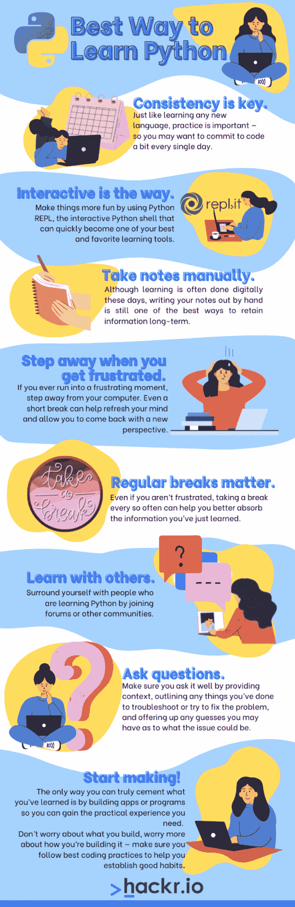

# 学习 Python 的最佳方法[一个完整的分步指南]

> 原文：<https://hackr.io/blog/best-way-to-learn-python>

如果你不是程序员，Python 可以是你的起点，因为它在 2023 年的顶级编程语言中排名第一，也是最容易学习的。如果你知道任何其他编程语言，学习 Python 对你来说将是轻而易举的事情。除了语法上的不同，面向对象编程的基本概念是相同的。此外，Python 拥有丰富的库，支持几乎所有您想做的事情。

但是学习 Python 有没有最好的方法呢？请继续阅读，了解更多信息！

## **Python 是什么样的？**

Python:

*   具有易读易懂的支持模块，鼓励代码重用
*   一种跨平台语言——一次编码，随处运行(Windows、Linux、Unix、Mac 等)
*   一种解释型语言——解释器一个接一个地执行每一行代码，使得调试变得容易
*   开源，所以你可以随时轻松练习

此外，Python 有一套优秀的标准库:

*   允许与 Java、C、C++等其他语言集成
*   支持面向对象的编程

记住这些，让我们从基础到高级的主题开始，浏览一下掌握 Python 需要学习的主题。到本文结束时，您应该对 Python 有了深入的了解，这可以帮助您更轻松地学习这门语言。

首先，您可以从 Python 的[官方页面安装 Python。](https://www.python.org/downloads/)

### 推荐 Python 课程

[用 Python 完成从零到英雄的 Python boot camp](https://click.linksynergy.com/deeplink?id=jU79Zysihs4&mid=39197&murl=https%3A%2F%2Fwww.udemy.com%2Fcourse%2Fcomplete-python-bootcamp%2F)

## **学习 Python 的最佳方式:需要记住的事情**

学习 Python 最好的方法是什么？老实说，和任何事情一样，没有单一的“正确”的开始方式。毕竟，每个人的大脑工作方式不同，这意味着每个人的学习方式不同。所以，学习 Python 最好的方法就是实现你读到的任何东西。只需打开笔记本电脑，安装 Python，开始编码。可以边走边学！

每个人都有自己学习 Python 的最佳方法，但有一点是肯定的——下面的这些技巧可以让你更轻松。

*   如果你不是程序员，请多一点耐心。你一定会成功的。Python 是进入编程的最简单的方法(或者至少是最简单的方法之一)。对于一个非程序员来说，学习 Python 最好的方法就是慢慢来，耐心地学。在继续下一步之前，花时间去理解核心概念可以帮助你建立一个坚实的基础。
*   想好你想先创建什么样的应用程序，并围绕它制定你的学习计划。最好尝试使用 Django 构建一个简单的网站。
*   如果你得到一个错误，那意味着你在正确的方向上前进。如果你犯了很多错误，那很好——因为从长远来看，错误是你学会正确做事的方式。每一个错误都应该让你兴奋，渴望找到解决方法。最好的学习是通过错误和例外。
*   参加著名的在线课程，开启您的 Python 之旅。 [从零到 Python 中的英雄](https://click.linksynergy.com/deeplink?id=jU79Zysihs4&mid=39197&murl=https%3A%2F%2Fwww.udemy.com%2Fcourse%2Fcomplete-python-bootcamp%2F)是网上开始学习 Python 最好的课程之一。
*   沿途学习语法。不要花太多时间单独学习语法。用 PyCharm 这样的 IDE 建立一个项目，然后开始编码。随着您编写更多的代码，您将逐渐了解语法。
*   从一个简单的项目开始，在编码时增强功能。开始学习时，包含更复杂的概念。

好了，没有更多的理论了，让我们多谈一点关于 Python 的概念和组件。

如果你已经知道一两种其他的编程语言，你可能想跳过前几个副题。下面的主题将通过让您熟悉大多数编程语言中使用的常用术语来欢迎您进入编程世界。

[](https://click.linksynergy.com/deeplink?id=Qouy7GhEEFU&mid=39197&murl=https://www.udemy.com/topic/python/)

## **变量和数据类型**

假设你想买一部手机。你浏览了许多手机，并在购物车中添加了一部。计算机如何知道在哪里存储您的数据，如手机型号、您选择的方案以及您添加的任何附件(如耳机)？

数据以**变量**的形式存储。它有助于应用程序保留和传递数据，从开始到应用程序结束(例如，下单页面)，在这里您的订单结束。

有不同类型的数据。例如，你的电话号码将是一个整数；服务计划可以是一个字符串，一个确定你是否有优惠券的变量可以是一个布尔值，等等。整数、布尔、字符串(以及其他一些类型)被称为数据类型。

让我们看一个简单的例子

```
handset_id = 90993
plan = “MYPLAN199”
print(handset_id, plan)
```

我们可以在整个应用程序中使用这些变量 handset_id 和 plan，而不是使用硬编码的值。

### **操作**

我们对数据做的任何事情都称为过程，包括加法、减法、比较或逻辑运算。例如，要比较用户的新移动计划和现有计划，我们可以编写如下内容

```
print(new_plan == old_plan)
```

double equals 是一个比较运算符，它返回 true 或 false 作为输出。Python 中有很多运算符。

### **条件**

让我们说，折扣是适用于您的计划的基础上的一些标准，如您的每月使用，手机的选择，以及其他几个因素。应用程序如何自动检查您是否有资格享受折扣？通过检查是否满足这些条件！

```
if(plan == ‘DISCOUNT30’ and customer_existing):
print(‘You are eligible for discount’)
elseif(some_condition):
#some block of code
else
#some other block of code
```

Python 中还有很多其他条件，比如 [while](https://hackr.io/blog/python-while-loop) 和 for 循环。[阅读这篇精彩的博文](https://hackr.io/blog/python-conditional-statements-switch-if-else)了解 Python 的条件语句。

### **功能**

有时，我们可能想要重用某些功能，或者一段代码可能太大，以至于将它移到一个单独的块中并在需要时调用它可能是一个好主意。这样的块被称为函数。例如，我们上面的代码可以移动到一个实用程序文件中，因此任何人都可以使用该函数。

```
defcheck_for_discount(customer_existing):
#function code
```

def 定义了函数。当我们调用该函数时，我们传递 customer_existing 的值(在本例中)。它被称为参数。我们可以向函数传递任何参数。

### **面向对象编程**

当今大多数顶级编程语言都是基于 OOPS ( [面向对象编程概念](https://hackr.io/blog/oops-concepts-in-java-with-examples))的，Python 也是如此。这是一个简单而有力的概念。在 OOP 中，一切都被认为是一个对象。类是我们根据需要创建对象的实体。

[观看这个很酷的视频](https://www.youtube.com/watch?v=xoL6WvCARJY)了解更多关于 OOPS 的概念。

在我们的手机示例中，手机可以是一个类，所有的手机细节，如型号、品牌、类型和特性都可以是它的属性。每当用户选择一个手机，手机类的一个对象将被创建，详细信息将被填充到它的属性中(成员变量)。


你可以把人类看作一个阶级——人类。您的属性可以是您的姓名、年龄、性别等等。你可以发现自己是人类的一个对象，有特定的值，比如名字= 'Mac '，年龄= '22 '，性别= 'M '

每个类都有属性以及获取和设置这些属性的方法。一个类还将有一个构造函数或 init 方法，它将在需要时创建该类的对象。

```
classHuman:
def___init__(self, name, age, gender):
self.name = name
self.age = age
self.gender = gender
```

尝试将这个类比应用到我们的手机类。

```
classHandset:
def___init__(self, handset_id, model, manufacture_date, features):
self. handset_id = handset_id
self. model = model
self. manufacture_date = manufacture_date
self.features = features
defprinthandsetdetails():
print(self.handset_id, self.model)
```

现在，让我们假设一个用户添加了一个特定的手机到他们的购物车。详细信息可以存储为–

```
handsetDetails = Handset(“NOKN96”, “2009”, “23-05-2009”, “slim”)
```

假设我们想要打印这些细节，我们可以在类中添加一个方法来完成这项工作，并将其命名为 handset details . print handset details()

### **数据结构**

数据结构这个术语在所有编程语言中都是通用的。在 Python 中，我们称它们为集合。Python 中有不同类型的组，使得存储和检索数据变得轻而易举。这些也使得程序快速高效。四种主要的收藏类型是

*   列表——最简单的数据结构，列表是一个有序的集合，也是可变的。举个例子，

```
featurelist = ["frontcamera", "androidpie", "6GBRAM"]
```

为了访问列表项，我们使用索引来引用它们，索引总是从 0 开始。功能列表[0]将为您提供前置摄像头。

*   元组–也是有序的，但不可改变。不能在元组中添加或删除项目。
*   集合–未排序和未索引的集合。不能使用索引访问集合项目；但是，您可以循环浏览项目或扫描项目，以检查项目是否存在。
*   字典——也称为映射，通过键值对来访问。它们是无序的。举个例子，

```
handsetdetails = {
"name": "Nokia6.1",
"color": "Black",
"RAM": "6GB"
}
```

要获取该值，我们应该使用 handsetdetails["name"]键进行访问。

[这个免费的 Udacity 课程](https://hackr.io/tutorial/data-structures-algorithms-in-python?ref=blog-post)对你来说是一个很好的机会，可以让你详细了解 Python 的数据结构和算法。如果你学了这个，你将能够在以后的任何编程语言中使用数据结构。

学习数据结构将帮助您使用 Python 处理数据，轻松构建大规模应用程序。它还将帮助您掌握高效的写作、高效的代码和动态编程。

**用户输入**

从用户那里获得输入非常简单。只需使用 input()方法就可以从控制台获得输入。

```
name = input(‘Enter handset name - ’)
```

根据收到的名称，您可以获取手机的详细信息并显示给用户。可以使用连接从文件或数据库中获取数据。

### **连接到数据库**

要连接数据库，要安装 MySQL 连接器 Python(针对 MySQL)或者 PyMongo 之类的 MongoDB 驱动。如果你是初学者，选择 MySQL，因为它是最常用和最有用的学习工具。

[这个简单的教程](https://hackr.io/tutorial/python-mysql-tutorial?ref=blog-post)将带你逐步连接到数据库并获取必要的细节。

### **文件处理**

文件处理是任何应用程序的重要组成部分。您的应用程序可能希望从文件中读取、写入文件，等等。用 Python 实现文件处理毫不费力。Python 中有两种类型的数据——二进制和文本。有四种类型的文件操作，我们称之为 CRUD——创建、读取、更新、删除。例如，我们可以打开一个文件-

```
file = open(“handsetlist.txt”, “w”);
#this will open the file in ‘w,’ i.e., write mode
```

如果我们给' r '，文件将以读取模式打开，要添加新行，我们使用' a' (append)。“r+”模式是一种特殊的模式，可以在处理文件时处理读写操作。

为了读取文件，我们使用文件。read()方法和来写，是的，你猜对了！我们使用 file.write(“要写入的数据”)。

从[这个简洁明了的链接](https://docs.python.org/3/tutorial/inputoutput.html#reading-and-writing-files)中阅读并体验更多的文件处理功能。

所以现在，你可以创建单独的程序和独立的应用程序，给出完美的结果。但是，如果您的应用程序可以被多个人同时访问呢？例如，一台可由不同用户访问的打印机—该打印机如何处理多个作业而不出现死锁？

### **并发和多线程**

可能会有类似上述的情况。两个或多个进程正在等待同一个资源。假设进程 A 现在正试图访问资源 r；进程 B 也试图访问资源 r。为了避免 B 覆盖 A 的数据的问题，进程将被同步，其中每个进程(B、C、D 等)被阻塞，直到前一个线程/进程 A 使用资源 r 完成。这被称为互斥。

这意味着进程 A 锁定资源，直到它正在使用资源，并在使用结束时释放它。其他进程必须等待轮到它们拥有锁。但是，如果进程 A 遇到了问题，并且无法完成它的工作，该怎么办呢？如果流程 A 需要流程 B 的某个东西来完成，而 B 在等待 A 完成呢？这就叫死锁！死锁是致命的，你不希望它出现在你的程序中。

在工作环境中，了解多线程、多重处理和锁是非常重要的。

### **创建 API 服务**

现在让我们对网络世界有一个更大的了解，其中程序和应用程序相互交互，共享资源，最重要的是，使用 HTTP 协议相互传递请求。每个可以相互通信的应用程序被称为微服务。这意味着如果你想让你的应用程序与世界互动，你应该知道如何公开你的服务——通过创建一个 API！您可以使用 Python 库 Flask 快速生成 API 服务。[观看这一系列视频](https://hackr.io/tutorial/python-flask-from-scratch?ref=blog-post)就知道怎么做了。

### **创建网络应用**

现在，您可以使用 Python 创建您的 web 应用程序。[这个免费教程](https://hackr.io/tutorial/learn-django-and-python-development-by-building-projects)给你一个使用 Django 和 Python 构建项目的好方法。参加这个课程，了解 Django。Django 是一个全栈的 web 框架，使用它可以用 Python 创建一个端到端的 web 应用程序。它使用 MVC(模型-视图-控制器)架构和 ORM(对象-关系-映射)进行数据访问。Python 中有[库，完全支持 ORM 和构建 web 应用安全。](https://docs.python.org/3/library/)

## **学习 Python 的步骤**

虽然学习 Python 通常很简单(跟随教程或课程，参加训练营，在学院或大学注册短期项目等)，但您可以采取一些步骤来指导您的学习。它们非常简单，但是遵循这个简单的原则可以让学习过程变得更简单。

首先，**找出你的动机**。知道你为什么想要学习 Python 可以帮助你把它放在心上，这样你就可以在你感到沮丧或气馁的时候回忆起它。你不*有*去做这件事，但是如果你这样做，可以帮助你在学习过程中少一些痛苦。

然后，**从基本面**开始。在尝试更复杂的概念和想法之前，学习所有的基础知识，并确保你很好地理解了这些概念。不要只是学习理论，确保你用实际的编程经验巩固每一课，以帮助你**应用你所学的**。

通过合作与他人一起学习是拓宽你的知识面和发现你自己可能从未发现的东西的好方法。

最后，**练，练，练**！



## **要记住的提示:掌握 Python 的最佳方法**

在学习 Python 的同时(或之后)，您可能想要采取一些措施来巩固您的学习，巩固您已经掌握的知识。那么，如何才能让它坚持下去呢？查看以下提示:

*   一致性是关键！在你掌握 Python 的过程中，保持一致很重要。就像学习任何一门新语言一样，实践很重要——所以你可能想每天都写代码。做出这种努力是将编码提交给肌肉记忆的最佳方式，这样你就可以毫无顾虑地自动完成大多数任务。即使每天半小时，对你未来的成功也是一个足够好的承诺。

*   互动是一种方式。学习 Python 可能会有点耗费脑力。幸运的是，您可以通过使用 Python REPL 让事情变得更有趣，这种交互式 Python shell 可以很快成为您最好和最喜欢的学习工具之一。如果你不知道如何激活这个外壳，有许多指南可以帮助你。

*   **手动记笔记。**尽管如今学习通常以数字方式进行，但手写笔记仍然是长期保留信息的最佳方式之一。你不必相信我们，你可以看看这篇[文章](https://redbooth.com/blog/handwriting-and-memory)，自己找出为什么这行得通。

*   当你感到沮丧时，就走开。如果你曾经遇到一个令人沮丧的时刻，你似乎无法理解一个概念或者找出你的代码出了什么问题，那就离开你的电脑。即使是短暂的休息也能帮助你刷新思维，让你带着新的视角回来。有时，离开足以帮助您找到错误的代码段(甚至是一个字符！)那是在破坏你的代码。

*   定期休息很重要。即使你没有感到沮丧，偶尔休息一下也能帮助你更好地吸收刚刚学到的信息。

*   **与他人一起学习。**无论你决定何时何地开始学习 Python，总会有其他人和你同时开始这段旅程。并且，在不同的学习阶段总会有其他人。通过加入论坛或其他社区，让你周围的人也在学习。永远不要低估从别人那里获得反馈或指导的力量——你永远不知道你能学到什么。

*   **提问。**毫无疑问，程序员在想不通的时候会求助于互联网。这就是 StackOverflow 这样的网站存在的原因！然而，仅仅提出你的问题是不够的。确保你问得很好，提供上下文，概述你为解决问题或尝试解决问题所做的任何事情，并提供你对问题可能是什么的任何猜测。通过包含您的代码、您可能得到的任何错误、日志和解释来演示问题也对您有好处。用这种方式提问可以省去你许多来回的麻烦，这样那些可能想帮忙的人就可以直入问题的核心。

*   **开始制作！在网上或其他任何地方学习 Python 的最好方法通常是实践。你能真正巩固你所学的知识的唯一方法是建立应用程序或程序，这样你就能获得你所需要的实践经验。不要担心你构建了什么，多担心你如何构建它——确保你遵循最佳的编码实践来帮助你建立良好的习惯。**

如果你真的想以一种富有成效的方式学习更多，你可以尝试为一些开源项目做贡献。这样做是建立你对自己技能的信心的好方法，也是开始建立你的作品集的好方法！

## **学习 Python 的 3 种最佳免费方法**

学习 Python 不一定要花钱——有很多资源是免费的！如果你正在寻找学习 Python 的最好的免费方法，看看下面的一些吧。

如果你想学习 Python，CodeAcademy 是最好的地方之一。虽然 CodeAcademy 也有一些付费内容，但它有大量对初学者友好的免费资源。如果你想学习 Python 3，他们也有[课程](https://www.pntra.com/t/TUJGR0lLR0JHRklKSkdCR0ZISk1N?url=https%3A%2F%2Fwww.codecademy.com%2Flearn%2Flearn-python-3)可用，尽管这是一个付费资源。CodeAcademy 最棒的一点是，您需要启动的一切都在浏览器中为您提供。没有设置或安装是必要的！

LearnPython 是一个非常棒的基于文本的免费资源。这绝对是免费学习 Python 的最佳方式——特别是因为它是交互式的。它适用于任何水平的学习者，不管你是不是初学者。还有一个[脸书小组](http://www.facebook.com/groups/180708015327157/)如果你想问问题，看更新，并加入讨论，你可以加入。

Udemy 是一个 MOOC(大规模开放在线课程)提供商，拥有成千上万的课程，几乎涵盖你能想到的任何主题。Python 就是这样一个主题。虽然课程本身往往相当实惠——尤其是在 Udemy 经常进行的大折扣销售期间——但该平台也有许多免费的 Python 课程。看看这个[链接](https://click.linksynergy.com/deeplink?id=jU79Zysihs4&mid=39197&murl=https%3A%2F%2Fwww.udemy.com%2Ftopic%2Fpython%2Ffree%2F)里面有一些，包括 Python 编程入门，绝对初学者的 Python 等课程！、以及 Python 在 30 分钟内从初级到中级。虽然你不会获得免费课程的结业证书，但跟随 Udemy 的课程是免费学习 Python 的最佳方式——特别是如果你想在提交之前了解 Python 的全部内容。

## **学习 Python 的 3 种最佳付费方式**

虽然免费学习肯定是获得 Python 编码技能的有效方法，但有时付费方法会给你带来更多好处，比如结业证书、可以依靠的网络，以及在某些情况下可以帮助你找到工作的职业服务。编码训练营总是一个学习快速编码的好方法，但是它们可能会非常昂贵。如果你想在完全投入之前看看训练营是什么样的，你可以先尝试一些[免费编码训练营](https://hackr.io/blog/free-coding-bootcamps)。

如果你不想花数千美元参加训练营，下面这些网站可能是你学习 Python 的最好地方。

如果你想学习 Python，Udacity 是一个很好的选择。他们有一门免费的 Python 入门课程，你可以在付费学习更多课程或纳米学位之前开始学习。Nanodegrees 是带你走上某条道路的课程集合，比如学习 Python 或成为一名全栈 web 开发人员。这个平台最好的一点是，你在这里获得的证书，虽然未经认可，但得到了全球大多数雇主的广泛认可和尊重。这种认可背后的原因是，Udacity 以其极高质量的课程而闻名，这些课程通常是与科技巨头和真正了解他们的技术的专家合作开发的。

**[在这里阅读我们对 Udacity 的完整评论。](https://hackr.io/blog/udacity-review)**

想通过动手练习实际学习 Python？多视能有所帮助。可以说，PluralSight 是学习各种技术相关技能的最经济实惠的方法之一，它提供了许多课程来帮助您学习 Python。内容是由专业人士和专家开发的，所以你可以相信这个平台上的课程质量。

是的，Udemy 也是学习 Python 的一种奇妙的付费方式。该平台有大量关于这种编程语言的付费课程，但可以说最好和最受欢迎的是何塞·波尔蒂利亚的 [2023 完整 Python Bootcamp 从零到英雄。该校拥有超过 160 万名*学生，在超过 42.7 万份评分中，平均得分为 4.6 分(五星)。它会带你经历学习过程的每一步，最后，你会获得结业证书。这并不总是得到雇主的认可，但许多雇主也不在乎你是从哪里或如何学到技能的——只要你能证明这些技能。*](https://click.linksynergy.com/deeplink?id=jU79Zysihs4&mid=39197&murl=https%3A%2F%2Fwww.udemy.com%2Fcourse%2Fcomplete-python-bootcamp%2F)

在这里阅读我们的全部 Udemy 评论。

## **遗言**

这就是成为一名 Python 专业人士所需要的一切。我们从主要变量开始，最终创建了一个成熟的 web 应用程序。记住，每个人学习的方式不同。学习 Python 没有单一的最佳方法，但是你至少可以遵循这里的一些提示和步骤来帮助你！

如果你觉得你已经准备好出去参加面试了，请阅读我们的 [Python 面试问题。](https://hackr.io/blog/python-interview-questions)此外，[这篇全面的博客文章](https://hackr.io/blog/best-python-books-for-beginners-and-advanced-programmers)将会给你一个极好的主意，告诉你作为一个初学者或高级 Python 程序员需要什么样的书。

最重要的是，看看这些[最好的 Python 教程](https://hackr.io/tutorials/learn-python?ref=blog-post)，如果你愿意的话，就去注册吧！有免费和付费的教程，所以你可以选择你想注册的。

## **常见问题解答**

#### **1。学习 Python 最有效的方法是什么？**

学习 Python 的最好和最有效的方法是最简单的方法——用最适合你的方法。如果你在实践中学习得最好，那么对你来说最好的学习方式可能就是开始编码。如果你通过观察别人做某事或通过阅读学得最好，先试试那些方法。无论哪种方式，它可能会帮助你跟随一个课程或某种指南前进。

#### **2。学习 Python 最好最快的方法是什么？**

学习 Python 的最好和最快的方法可能是加入编码训练营，这是学习如何编码的一种密集但有效的方法。虽然它们可能很贵，但是编码训练营可以指导你完成整个学习过程，并且可以非常诚实地成为开始开发人员职业生涯的好方法。训练营甚至可能提供其他的好处，比如职业服务和职位安排。

#### **3。可以自学 Python 吗？**

绝对的！许多人已经这样做了，你可以再做一次。幸运的是，现在互联网上有如此多的可用资源——多到如果你知道去哪里找，你可能永远都不需要为任何东西付费。然而，跟随教程甚至某些课程可能是学习 Python 3 的最佳方式，因为这样做通常会为您提供一条直白的学习之路。

#### **4。学 Python 难吗？**

可能是，但是说实话，Python 是最容易学的语言之一。然而，每个人的学习方式不同，所以你的收获也可能不同。幸运的是 Python 的语法很像英语，所以学起来感觉有点自然。

#### **5。非 IT 人士可以学习 Python 吗？**

是的，当然！任何人都可以学习 Python，特别是需要一些耐心和努力。幸运的是，现在有很多课程可以指导你完成从第一步到最后一步的学习过程。如果你想要更多的指导，你可以尝试一个编码训练营，在那里你通常会有导师和同学在路上帮助你。

#### **6。一个月能学会 Python 吗？**

绝对的。你可以在一个月内学会 Python(如果你掌握得足够快，甚至可能掌握它)，特别是如果你注意力集中，花大量时间跟随教程和课程。编码训练营或教师指导的项目也可以帮助你快速学习。然而，如果你没有在一个月内学会，不要难过——这从来都不是一场比赛！

#### **7。掌握 Python 需要多长时间？**

根据这篇 Coursera [文章](https://imp.i384100.net/rnPzzQ)，你可以在几分钟内学会足够的 Python 来编写你的第一个简单的应用程序，但是掌握 Python 的库可能需要你几个月甚至几年的时间——我们同意这一点。然而，每个人都按照自己的速度学习。如果你齐心协力，花足够的时间学习这门语言，你可以缩短掌握 Python 的时间。

#### **8。可以从零开始学 Python 吗(没有编码经验)？**

当然了。有许多课程、教师指导的项目和编码训练营可以帮助你学习 Python，即使你以前没有任何编码经验。

**人也在读:**