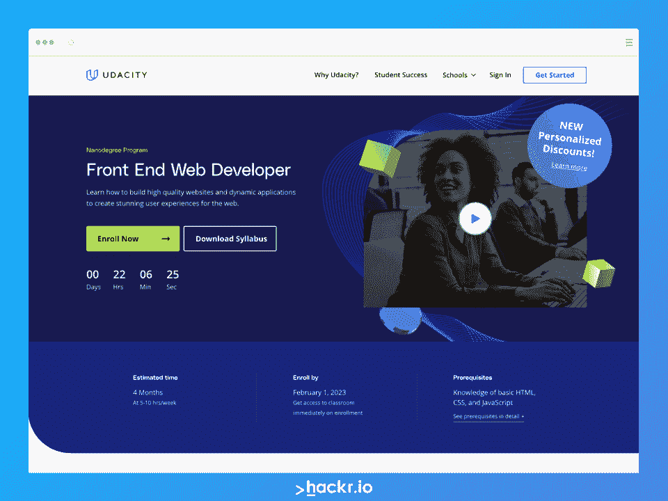
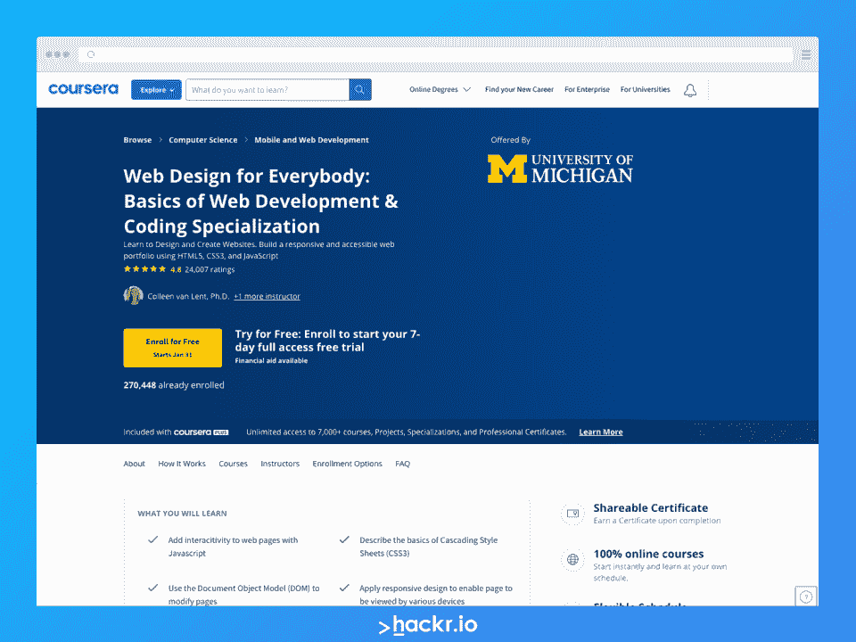
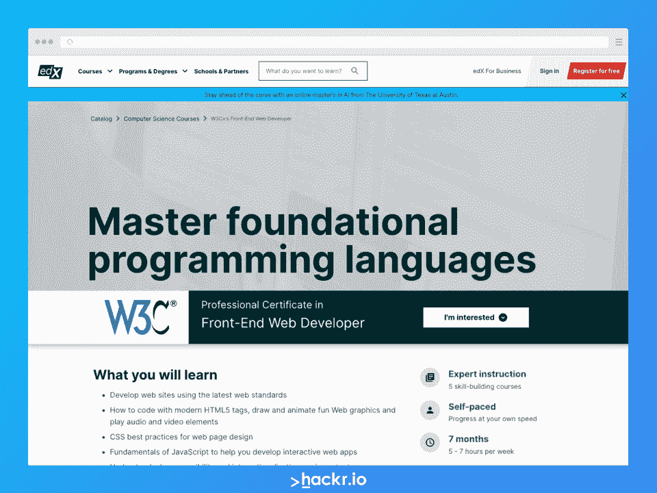
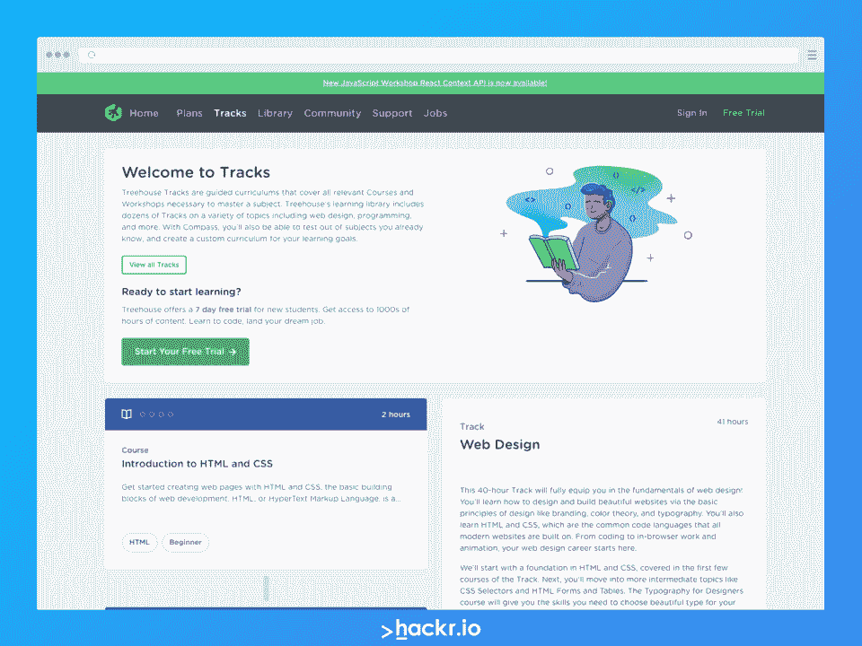
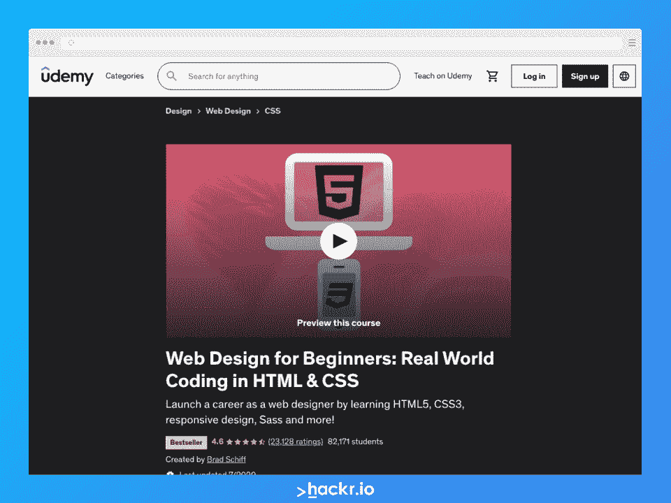
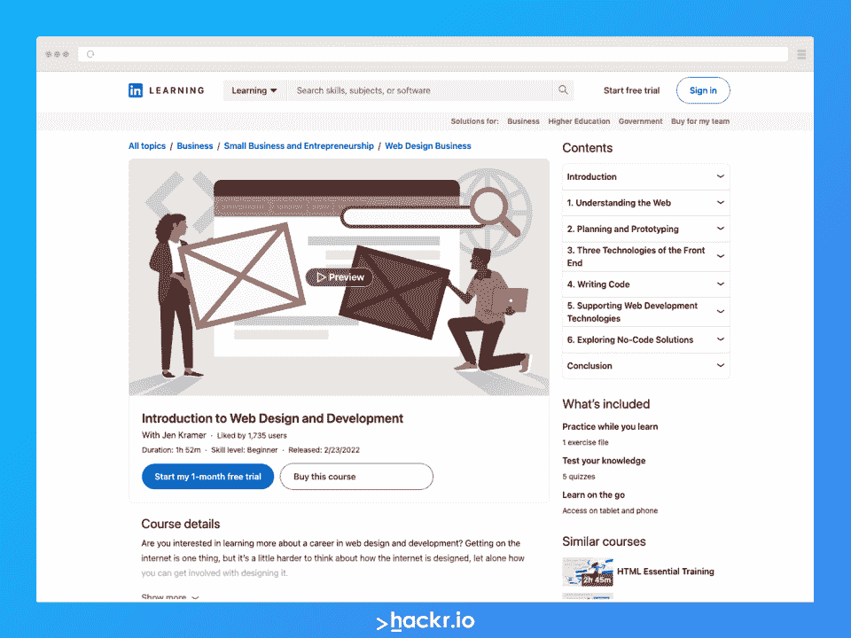
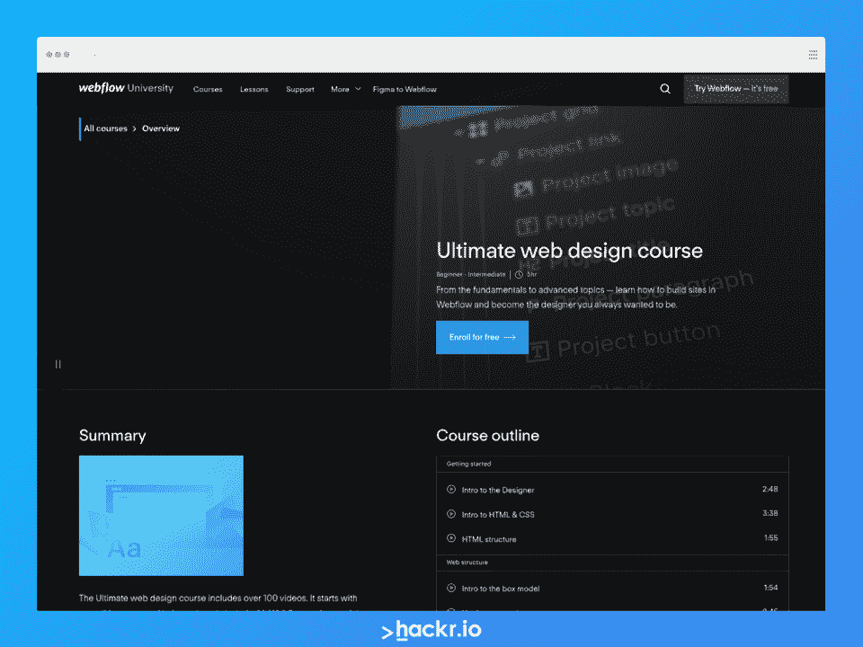
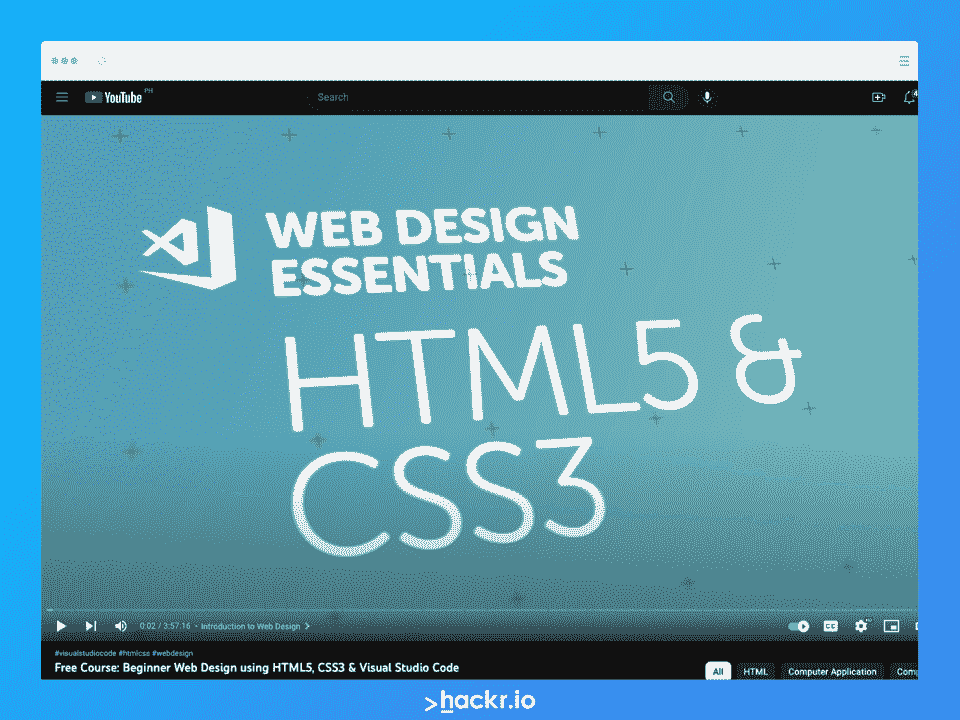

# 2023 年最佳网络设计课程:前 8 名【免费+付费】

> 原文：<https://hackr.io/blog/best-web-design-courses>

**时间紧迫？以下是我们的最佳选择:**

网站可以是一个单独的项目，也可以由一组设计师和开发人员创建。网页设计师与前端和后端(或全栈)开发人员一起工作，为周围的用户创建一个漂亮的网站和一个美妙的体验。

网页设计没有网页开发那么具有挑战性，尤其是如果你是这个领域的新手，有很多创造力，但几乎没有技术知识。因此，如果你想涉足这个行业，但不确定是否直接进入 web 开发，你可能想先尝试注册 web 设计的在线课程。

如果你正在寻找满足你需求的完美网页设计课程，看看我们下面的推荐列表吧！

## **2023 年最佳网页设计课程:我们的最佳选择**

**[了解更多](https://imp.i115008.net/c/2890636/788199/11298?u=https%3A%2F%2Fwww.udacity.com%2Fcourse%2Ffront-end-web-developer-nanodegree--nd0011&partnerpropertyid=2722169)**

**关键信息**

*   **持续时间:** 4 个月，每周学习 10 小时

*   基本的 HTML 和 CSS 知识
*   JavaScript 知识
*   对版本控制 Git 的理解
*   有关完整的要求列表，请参见[此链接](https://imp.i115008.net/c/2890636/788199/11298?u=https%3A%2F%2Fwww.udacity.com%2Fcourse%2Ffront-end-web-developer-nanodegree--nd0011&partnerpropertyid=2722169)

**我们为什么选择本课程**

你可能想知道为什么我们选择将这个纳米学位项目列入网页设计项目清单。答案很简单:这门 Udacity 课程涵盖了你成为一名成功的网页设计师所需要学习的许多主题。此外，随着网页设计和前端网页开发之间的界限越来越模糊，如果你最终想找一份前端开发人员的工作，选择这个项目可能会对你有好处！

**优点**

*   涵盖了成为前端 web 开发人员所需的一切
*   Udacity 上的课程和证书质量极高，在各行各业都广受认可
*   Udacity 为其学生提供额外的福利，如职业服务、指导等
*   真实世界的项目将有助于巩固你的学习

**缺点**

*   需要大量的时间投入
*   不仅仅是网页设计课程
*   昂贵的

**[了解更多](https://imp.i384100.net/c/2890636/1347618/14726?u=https%3A%2F%2Fwww.coursera.org%2Fspecializations%2Fweb-design&partnerpropertyid=2722169)**

**关键信息**

*   **指导老师:**密歇根大学；科琳·范·伦特博士，查尔斯·拉塞尔·塞弗伦斯

*   **持续时间:** 6 个月，每周学习 3 小时

*   不需要以前的经验
*   必须能够使用编辑软件
*   推荐一个免费的或商业的网站来发布你的设计

**我们为什么选择本课程**

如果网页设计培训是你正在寻找的，这个 Coursera 专业值得一看。该课程由密歇根大学通过 Coursera 提供，将教你如何创建美观、实用、响应迅速且易于访问的网站。很容易竞争 2023 年最佳网页设计课程，尤其是对初学者而言。

**优点**

*   密歇根大学提供的 100%在线自定进度课程
*   完成后的公认证书
*   学习网页设计和网页开发的基础知识
*   顶点计划帮助你将所学付诸实践

**缺点**

*   根据您的配速，可能需要更长时间

**[了解更多](http://edx.sjv.io/KeaJrA)**

**关键信息**

*   **指导老师:** W3C/W3Cx，更多信息见[此链接](http://edx.sjv.io/KeaJrA)

*   **持续时间:** 7 个月，每周 5 至 7 小时

*   不需要以前的经验

**我们为什么选择本课程**

国际组织 W3C 或万维网联盟为我们的万维网创建了标准。这个 edX 课程是 W3C 提供的。它将教会你构建反应灵敏的、交互式的网站和用户体验所需的一切。您还将了解更多关于今天支撑绝大多数 web 的三种主要语言:HTML5、CSS 和 JavaScript。

**优点**

*   获得专业证书
*   自定进度
*   非常复杂的课程，涵盖了从网页设计到前端开发的所有内容

**缺点**

*   不是纯粹的网页设计课程
*   有点贵

**[了解更多](https://teamtreehouse.com/tracks/web-design)**

**关键信息**

*   **等级:**初级到中级

*   *   不需要以前的经验

**我们为什么选择本课程**

如果网页设计的创造性是这个领域最吸引你的地方，那么这就是满足你需求的最好的网页设计课程。Treehouse 不提供结业证书，但课程设计精良，内容丰富，总体来说很容易掌握。

**优点**

*   从基础开始，但也深入一些更高级的主题
*   比其他课程更多地讨论网页设计的创造性
*   相对来说负担得起，除非你选择技术学位入学

**缺点**

**[了解更多](https://click.linksynergy.com/deeplink?id=jU79Zysihs4&mid=39197&murl=https%3A%2F%2Fwww.udemy.com%2Fcourse%2Fweb-design-for-beginners-real-world-coding-in-html-css%2F)**

**关键信息**

*   **时长:** 11 小时的视频点播

*   没有事先的经验或软件是必要的

**我们为什么选择本课程**

这个 Udemy 课程是网上最好的网页设计课程之一，尤其是对那些刚刚开始这个领域的初学者来说。你将学习 HTML5、CSS 等等——并且你将参与许多项目来巩固你所学到的东西。

**优点**

*   教你成为网页设计师所需要知道的一切，包括真实世界的编码
*   负担得起的
*   获得结业证书
*   很多例子
*   课程和说明很容易理解

**缺点**

*   Udemy 证书不像其他证书那样受到雇主的尊重
*   一些视频需要更新

**[了解更多](http://linkedin-learning.pxf.io/9W4Am0)**

**关键信息**

*   不需要以前的经验

**我们为什么选择本课程**

如果你不确定你是否想从事网页设计或开发，这个两小时的课程是值得参加的。它就像一本入门书，给你一些关于大多数事情如何在幕后工作的基础知识。

**优点**

*   短暂但甜蜜
*   帮助你理解在网页设计和开发的幕后发生的一些事情

**缺点**

*   并没有真正涵盖任何技术内容——它更像是一本入门书

**[了解更多](https://university.webflow.com/courses/ultimate-web-design-course)**

**关键信息**

*   **指导老师:** WebFlow 大学

*   **等级:**初级到中级

*   不需要以前的经验

**我们为什么选择本课程**

免费提供的最好的网页设计课程之一是 WebFlow 大学提供的这门课程。你可以免费学习所有的东西，反复观看所有的视频，这样你就可以在任何需要的时候查阅。这是一门五小时的课程，提供了大量的价值，尤其是当你考虑到 WebFlow 大学提供了许多其他课程供继续学习时。

**优点**

*   免费！
*   WebFlow 还提供许多其他免费课程供学习
*   从基础开始，非常适合初学者

**缺点**

**[了解更多](https://www.youtube.com/watch?v=C5QFHp1oAws)**

**关键信息**

*   **讲师:**自带笔记本电脑

*   不需要以前的经验

**我们为什么选择本课程**

虽然有很多免费的网页设计课程，这个 BYOL 网页设计基础课程是值得学习的。在四个小时的时间里，你可以收集大量有价值的信息，帮助你加快学习速度，或者填补其他课程可能错过的空白。

**优点**

*   自由的
*   简明扼要
*   完整的不间断视频

**缺点**

*   很难回头查阅，所以要做笔记！
*   没有证书

## **成功学习网页设计课程的秘诀**

如果你已经决定参加网站设计课程，你可以做一些事情来增加你成功的机会。查看下面的一些提示，从您的课程中获得最大价值:

1.  考虑你的预算。课程的价格区间各不相同，所以要寻找符合你预算的课程。没有理由花比你愿意的更多的钱——你总是可以从更便宜的课程开始，然后回头参加 pricer 课程。
2.  看看这门课程需要投入多少时间。有些课程是完全自定进度的，而有些课程则建议每周学习一次。如果你没有时间投入，就不要参加那些建议每周学习 10 小时的课程。
3.  **保持一致。与生活中的大多数事情一样，一致性是关键。如果你能坚持学习，随着时间的推移，你会增加成功的机会！**
4.  **选择合适的难度等级。如果你是从零开始，不要参加为中级或高级学习者设计的课程！选择适合你水平的东西来减少你的挫败感，让学习总体上更愉快。**
5.  练习，练习，练习！说到网页设计，你需要一份过去工作的作品集来找工作或自由客户。坚持练习，这样你就能组合出一个独一无二的、有竞争力的、杰出的投资组合。
6.  追随其他设计师，加入论坛，寻求社区。提高成功几率的最好方法之一就是在社交媒体上关注其他设计师，加入论坛，或者寻找志同道合的学习者和专业人士社区。加入这样的社区可以让你跟上最新的趋势和技术，并在必要时获得工作反馈。你还会接触到许多其他人的设计，这有助于影响和激发你自己的风格和作品。
7.  尝试其他网页设计资源，比如搜索引擎营销的 [SEMrush](https://semrush.sjv.io/c/2890636/1008501/13053) ，域名注册的 [NameCheap](https://namecheap.pxf.io/c/2890636/408749/5618) ，人工智能生成内容的 [TextBuilder](https://textbuilder.sjv.io/rnVQEd) 。

## **我们如何选择最好的网页设计课程**

我们在整理 2023 年最佳网页设计在线课程时考虑了几个因素。我们只想为我们的读者提供最好的选择，这就是为什么这些课程在入选之前都经过了严格的审核。

以下是我们考虑的因素:

*   为了保证质量，我们选择了由权威机构创建的课程。
*   我们考虑了成本，包括各种价格范围的课程，所以任何预算都会有所值。
*   我们包括不同难度和持续时间的课程，以适应任何学习者的情况。
*   我们只选择高质量的课程，并确保名单上的大多数课程提供行业认可的结业证书，以帮助改善你的简历。

最后，我们包括提供测验和动手项目的课程，以帮助将您的学习付诸实践*和*给你一些作品放入你的文件夹！

## **结论**

找到最适合你需求的网页设计课程可以帮助你走向成功。从一个适合你的经验水平、学习风格和预算的项目开始，是为你最终的职业转变开始学习的好方法。记得寻找提供测验和动手项目的课程，以确保你能够将所学付诸实践！

你也想从事后端网络开发吗？如果是这样，请查看一下您今天可以报名参加的 [**十大网络开发课程**](https://hackr.io/blog/best-web-development-courses) **。**

## **常见问题解答**

### **1。网页设计哪个课程最好？**

很难确定只有一门网站设计课是最好的，因为学习者是独特的——每个人都有自己的技能水平、兴趣、学习风格、定位等等。然而，我们已经在上面的文章中列出了网页设计的最佳在线课程，所以你可能想尝试其中的一个！

### **2。网页设计是一门很难的课程吗？**

网页设计可能具有挑战性，但与网页开发或其他类似领域不同，它更多的是一种创造性的努力。因此，如果你的优势更多的是在创造性方面，网页设计可能更适合你的风格，你可能会比参加更复杂的课程更容易学会。这仍然具有挑战性，但是通过足够的练习，你会越来越好。

### **3。做一名网页设计师需要具备哪些资质？**

成为网页设计师的资格可能会因你申请的公司而异。然而，你通常会看到一些共同的要求，HTML、CSS 和 Adobe Creative Cloud(或类似的)体验是最受欢迎的。如果你还不了解 HTML，可以从这些[很棒的 HTML 课程](https://hackr.io/blog/best-html-courses)开始。你也可以学习一些高级的话题来帮助你更有竞争力——例如，你可以报名参加 [UX 设计课程](https://hackr.io/blog/ux-design-courses)。

### **4。网页设计课程一般多长时间？**

网页设计课程可能需要一个小时到几个星期甚至几个月的时间。这取决于项目和你愿意在学习上投入多少时间。大多数课程都是自定进度的，也就是说你可以想学多久就学多久。