# 2023 年 15 门最佳 Web 开发课程【免费+付费】

> 原文：<https://hackr.io/blog/best-web-development-courses>

你对从事网页开发感兴趣吗？没有比现在更好的时机了，因为网络开发者市场预计仅在未来十年就将增长 23%。

也许你听说过 web 开发，但你不太清楚它的含义。或者你有一个想法，但是你不知道从哪里开始。无论哪种方式，我们都将帮助你，因为我们将快速介绍什么是 web 开发，然后介绍为什么参加这个课程是个好主意。

已经知道这个了？没问题！请直接进入我们的 2023 年 15 个最佳初学者网站开发课程列表。

**特色网页开发课程【编辑推荐】**

## 什么是 Web 开发？

Web 开发包括创建、构建和维护网站。幕后发生了很多事情，使您能够在浏览器中查看网页。

Web 开发人员主要从事三个方面的工作。

1.  **客户端或前端:**用户看到并与之交互的网站部分。三种标准的前端开发技术是 HTML、CSS 和 JavaScript。
2.  **服务器端或后端:**与运行 web 应用程序或网站的服务器相关。用于后端开发的一些常见语言是 PHP、Java、Ruby 和 Python。
3.  **数据库:**这允许用户创建和存储账户详情、偏好和登录信息。这很有用，尤其是对于动态网站。与每个用户看到相同内容的静态网站不同，动态网站的内容对用户来说是唯一的。

## 为什么要参加网络开发课程？

随着企业不断采用数字技术，对 web 开发人员的需求也在不断增加。如今，即使是当地的小企业也开始上网，他们需要网络开发人员来创建和维护他们的网站。

成为一名网站开发者的最好方法之一是参加在线课程。当你拥有这些技能时，你会有很多好处可以期待。

*   工作保障:网站开发人员不仅薪水很有竞争力，而且需求量也很大，所以他们不缺机会
*   工作灵活性:网络开发的本质使得远程工作成为可能
*   自由职业者的机会:你可以作为一名网络开发人员开始自由职业
*   创造力和学习:技术总是在发展，这意味着作为一名 web 开发人员，总会有新的东西需要学习

## **选择最佳在线网页开发课程**

为了选择最好的在线网站开发课程，我们使用了以下三个标准。

1.  **创造者可信度:**他们在教授编程方面的经验如何？学生积极评价的比例是多少？
2.  **内容:**课程有多全面？演示的风格有多吸引人？对于 web 开发人员来说，这些主题与现实世界的挑战相关吗？
3.  **社区:**有多少人参加了该课程，或者目前正在注册？如果你卡住了，很容易联系到其他同学吗？

## **15 门最适合初学者的 Web 开发课程**

[**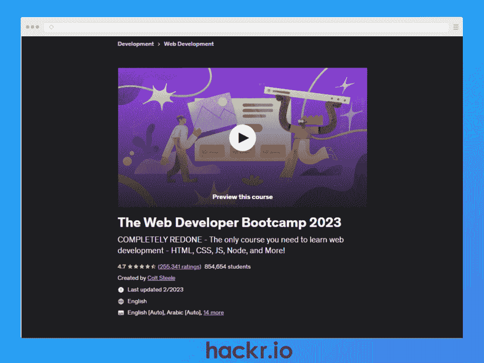**](https://click.linksynergy.com/deeplink?id=jU79Zysihs4&mid=39197&murl=https%3A%2F%2Fwww.udemy.com%2Fcourse%2Fthe-web-developer-bootcamp%2F)

**[了解更多](https://click.linksynergy.com/deeplink?id=jU79Zysihs4&mid=39197&murl=https%3A%2F%2Fwww.udemy.com%2Fcourse%2Fthe-web-developer-bootcamp%2F)**

| **关键信息** |
| **课程讲师:**柯尔特·斯蒂尔 | **等级:**初学者 |
| **持续时间:** 63 小时 | **免费或付费:**付费 |
| **证书:**是 | **注册学生:** +850K |

**我们为什么选择本课程**

作为 Udemy 上的[顶级编程课程](https://hackr.io/blog/top-programming-courses)之一，你将学习 HTML、CSS、JavaScript、Node、Express、MongoDB 等等。您还将学习如何创建具有 CRUD 功能的应用程序，以及高级概念，如使用 Express 路由、实现用户认证、用于数据库交互的 mongoose、错误处理等等。

如果您对前端和后端开发感兴趣，本课程是理想的选择。它还集成了基于项目的学习，因此您将应用您的新技能来构建 JavaScript 浏览器游戏、登录页面、动画待办事项列表等。

**优点**

*   Udemy & lifetime access 评分最高
*   了解全栈 web 开发
*   创建您自己的节点模块

**缺点**

*   没有关于前端框架的课程
*   课程很长(60 多个小时)

[**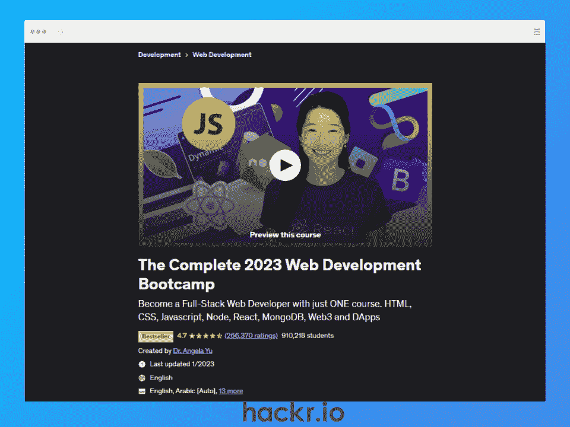**](https://click.linksynergy.com/deeplink?id=jU79Zysihs4&mid=39197&murl=https%3A%2F%2Fwww.udemy.com%2Fcourse%2Fthe-complete-web-development-bootcamp%2F)

**[了解更多](https://click.linksynergy.com/deeplink?id=jU79Zysihs4&mid=39197&murl=https%3A%2F%2Fwww.udemy.com%2Fcourse%2Fthe-complete-web-development-bootcamp%2F)**

| **关键信息** |
| **课程导师:**余博士 | **等级:**初学者 |
| **持续时间:** 65 小时 | **免费或付费:**付费 |
| **证书:**是 | **注册学生:+** 90 万 |

**我们为什么选择本课程**

Angela Yu 博士的课程是 web 开发的最佳 Udemy 课程之一。这一个将带你从一个完全的新手到一个全栈的 web 开发者。您将了解 Web2 和 Web3 开发、Unix 命令行、EJS 模板、如何使用 MongoDB Atlas 部署您的应用程序、如何创建 NFT 等等。

如果你喜欢基于项目的学习，这个课程将是你的理想选择。课程结束时，您将构建 16 个 web 开发项目。，包括一个博客网站、一个 RESTful API，您甚至可以创建自己的加密令牌。

**优点**

*   学习 Web2 和 Web3 开发
*   构建 16 个有投资价值的项目
*   学习前端和后端开发

**缺点**

*   使用 React 版本 16。尚未更新到最新版本(18.2)

[**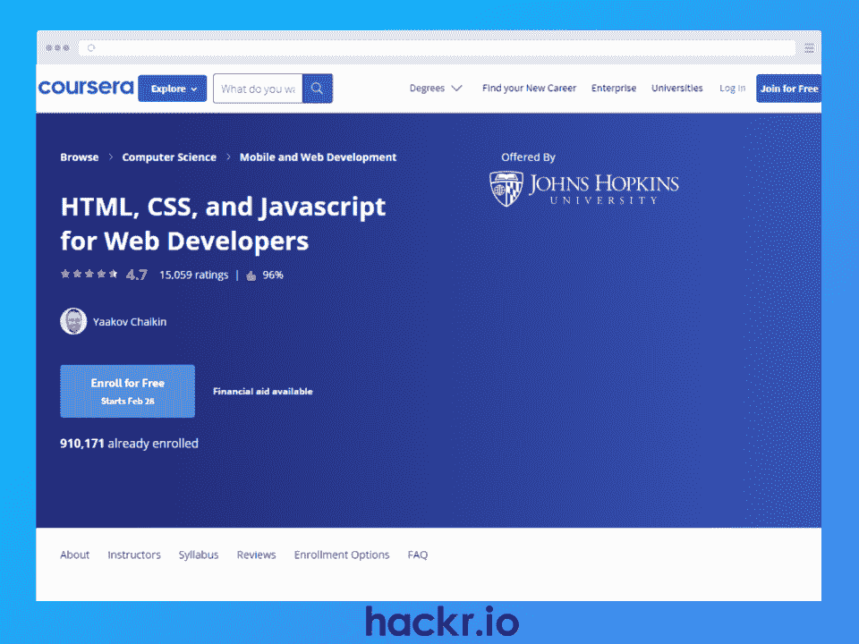**](http://imp.i384100.net/rnAQMG)

**[了解更多](http://imp.i384100.net/rnAQMG)**

| **关键信息** |
| **课程讲师:**雅科夫·柴金 | **等级:**初学者 |
| **持续时间:** 40 小时 | **免费或付费:**付费 |
| **证书:**是 | **注册学生:+** 85 万 |

**我们为什么选择本课程**

顾名思义，本课程将让你开始学习 web 开发的基础知识，如 HTML、CSS 和 JavaScript。您还将学习如何处理 AJAX 请求、处理 JSON 数据，以及使用 Bootstrap 框架更快地构建 web 应用程序。

将所有这些放在一起，你将应用你所学的一切来建立一个动态的餐馆网站，作为你的投资组合的顶点项目。对于那些寻找网站开发入门课程的人来说，这将是一个不错的选择。

**优点**

*   您投资组合的顶点项目
*   包括 14 个模拟测验部分
*   了解网络的历史

**缺点**

*   没有 JavaScript 框架/库的课程

[**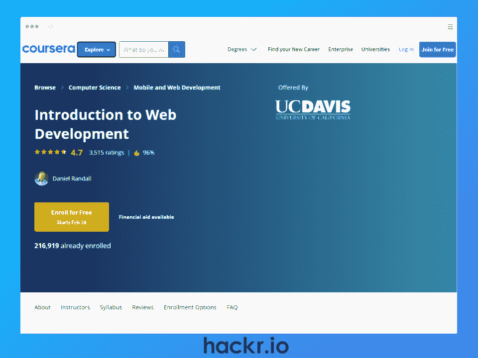**](https://imp.i384100.net/5bXgrn)

**[了解更多](https://imp.i384100.net/5bXgrn)**

| **关键信息** |
| 课程讲师:丹尼尔·兰德尔 | **等级:**初学者 |
| **持续时间:** 22 小时 | **免费或付费:**付费 |
| **证书:**是 | **注册学生:+** 200K |

**我们为什么选择本课程**

这是最适合完全初学者的 web 开发人员课程之一，因为它将内容分为 6 个模块，融合了视频讲座、文本内容和测验来巩固您的学习。

你将从学习如何构建网站和如何托管网站开始。然后，在结合这三种技术创建 web 应用程序之前，您将继续学习 HTML、CSS 和 JavaScript。您甚至将学习基本的表单验证和 JavaScript 测试。

**优点**

*   学习 HTML、CSS 和 JavaScript
*   每个模块后的测验
*   包括书面和视频内容

**缺点**

*   对于中级学习者来说，内容可能太基础了

**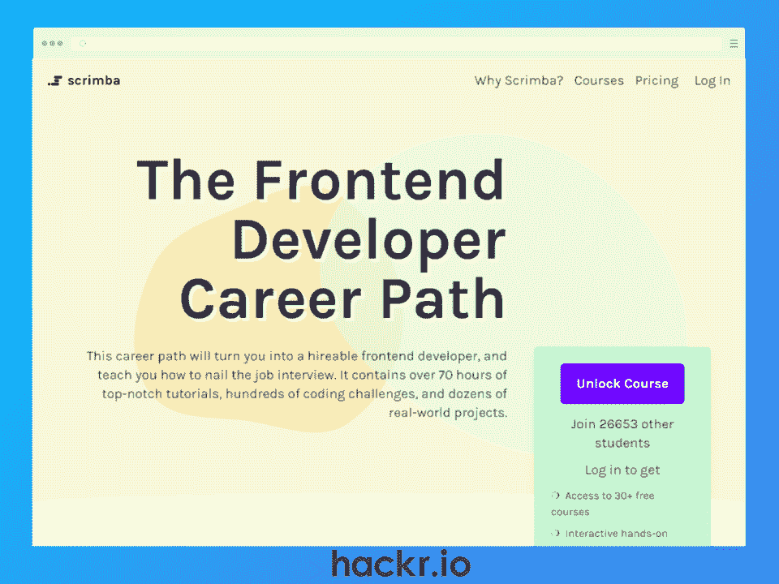**

**[了解更多](https://scrimba.com/learn/frontend)**

| **关键信息** |
| **课程讲师:** Scrimba 讲师 | **等级:**初学者 |
| **持续时间:** 70 小时 | **免费或付费:**付费 |
| **证书:**是 | 注册学生: 25K |

**我们为什么选择本课程**

对于有抱负的前端开发人员来说，这是 web 开发的最佳课程之一。通过学习本课程，您将了解 HTML、CSS 以及异步 JavaScript、React context、钩子和路由等高级主题。还有关于 UI 设计和如何使用 API 的章节。

作为一名专业开发人员，您将会参与许多代码评审会议，因此本 web 开发培训中的代码评审模块将会非常有益。完成后，你还将获得 Scrimba 前端开发人员证书，如果你需要，还可以选择奖学金。

**优点**

*   非常适合有抱负的前端开发人员
*   活跃不和谐社区
*   包括如何被录用的部分

**缺点**

*   后端开发没有模块

[**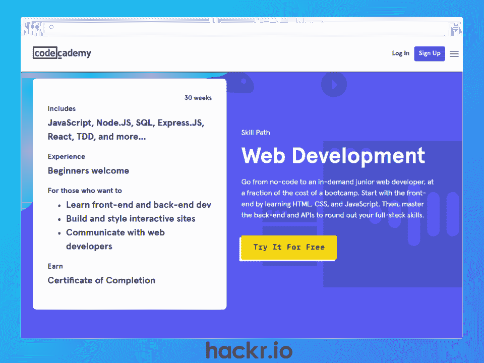**](https://www.pjtra.com/t/TUJGR0lLR0JHRklKSkdCR0ZISk1N?url=https%3A%2F%2Fwww.codecademy.com%2Flearn%2Fpaths%2Fweb-development)

**[了解更多](https://www.pjtra.com/t/TUJGR0lLR0JHRklKSkdCR0ZISk1N?url=https%3A%2F%2Fwww.codecademy.com%2Flearn%2Fpaths%2Fweb-development)**

| **关键信息** |
| **课程导师:**代码学院导师 | **等级:**初学者 |
| **期限:** 30 周 | **免费或付费:**付费 |
| **证书:**是 | **注册学生:**不适用 |

**我们为什么选择本课程**

在本课程中，您将学习如何使用 HTML 构建网页，使用 CSS 样式化网页，以及使用 JavaScript 进行交互。

您还将学习如何将 React 框架用于前端应用程序，将 Node plus Express 用于后端应用程序。还有关于 Git 和 GitHub、SQL 基础知识和测试驱动开发(TDD)的章节。

这个 Codecademy 课程旨在通过构建有投资价值的项目让你为工作做好准备。这些项目包括一个使用 Yelp API 的搜索应用程序和一个当地咖啡店的网站。你也可以把这些展示给你的朋友和招聘人员。

**优点**

*   学习前端和后端框架
*   学习 Git 和 GitHub
*   掌握 TDD 的基础知识

**缺点**

*   只有专业会员才能参加测验

**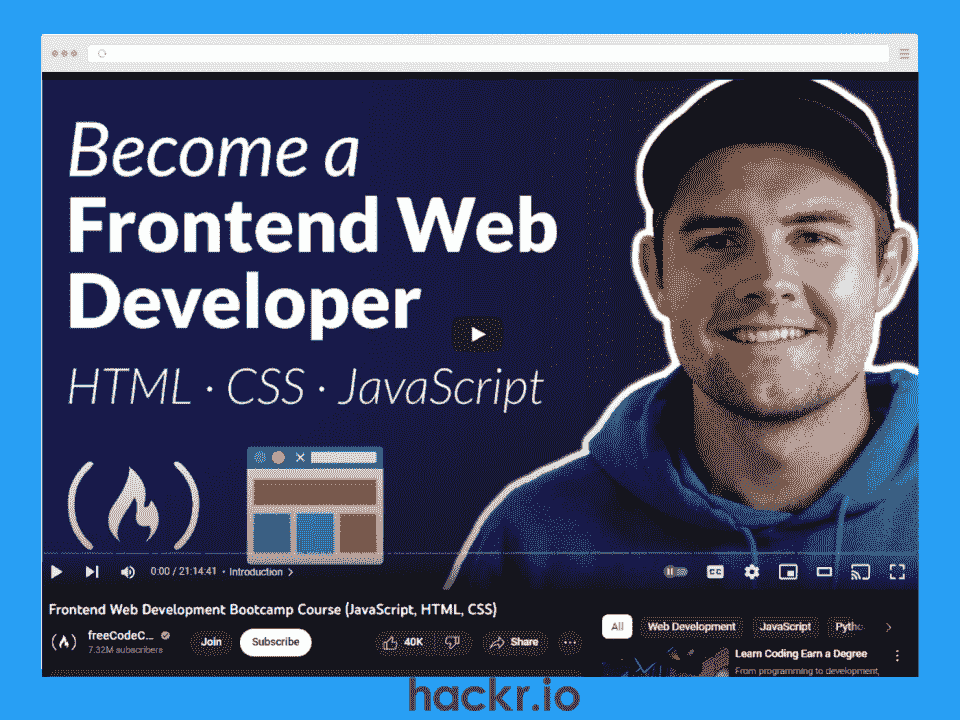**

**[了解更多](https://www.youtube.com/watch?v=zJSY8tbf_ys)**

| **关键信息** |
| 课程讲师:扎克·戈尔维茨 | **等级:**初学者 |
| **持续时间:** 21 小时 | **免费或付费:**免费 |
| **证书:**否 | **视图:** 1M+ |

**我们为什么选择本课程**

如果你正在寻找完全免费的网络开发课程，这是一个伟大的选择！它旨在为您提供成为前端开发人员所需的基本技能。JavaScript 部分提供了关于回调函数、正则表达式、错误类型、文档对象模型(DOM)等内容的深入课程。

您还将学习 HTML 和 CSS 的响应式 web 设计，主题包括 CSS Box 模型和 Flexbox。在本课程的后半部分，您将利用所学知识创建一个推荐页面。

**优点**

*   完全免费
*   学习 HTMl、CSS 和 JavaScript
*   涵盖 JavaScript 最佳实践

**缺点**

*   没有后端开发的课程

[**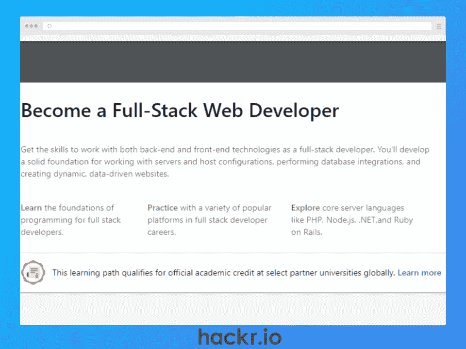**](http://linkedin-learning.pxf.io/BXD0g9)

**[了解更多](http://linkedin-learning.pxf.io/BXD0g9)**

| **关键信息** |
| **课程讲师:**领英学习 | **等级:**初学者 |
| **持续时间:** 29 小时 | **免费或付费:**付费 |
| **证书:**是 | **注册学生:**不适用 |

**我们为什么选择本课程**

这是一个全面的 web 开发人员计划，涵盖了各种 web 开发技术。你将从 HTML 和 CSS 的 web 开发课程开始，包括 CSS Grid 和 Flexbox 的详细课程。还有关于 JavaScript、搜索技术和 Git 版本控制的模块。

您还将学习 React frontend 库，从基础到高级主题，如路由、测试和部署。对于后端，您将学习 Node.js 以及 SQL 和 NoSQL。

本课程的一个独特之处是 DevOps 模块，它涵盖了基础设施自动化、连续交付、可靠性工程等主题。

**优点**

*   综合课程材料
*   每个模块后的测验和项目
*   学习 DevOps 基金会

**缺点**

*   REST APIs 模块最后一次更新是在 2018 年

[**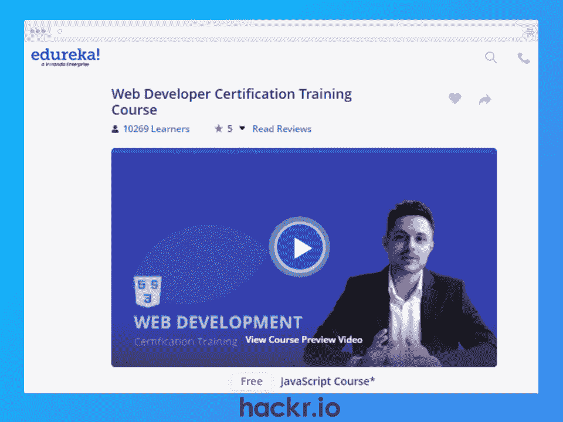**](https://click.linksynergy.com/deeplink?id=jU79Zysihs4&mid=42536&murl=https%3A%2F%2Fwww.edureka.co%2Fcomplete-web-developer&LSNSUBSITE=LSNSUBSITE)

**[了解更多](https://click.linksynergy.com/deeplink?id=jU79Zysihs4&mid=42536&murl=https%3A%2F%2Fwww.edureka.co%2Fcomplete-web-developer&LSNSUBSITE=LSNSUBSITE)**

| **关键信息** |
| **课程讲师:** Edureka 讲师 | **等级:**初学者 |
| **持续时间:** 5 周 | **免费或付费:**付费 |
| **证书:**是 | **注册学生:+** 10K |

**我们为什么选择本课程**

在这个互动的课程中，你将学习网页开发的基础知识。不仅如此，在讲述如何在亚马逊 S3 上部署网站之前，您还将学习如何使用 Bootstrap、jQuery 和 Google APIs。本课程涉及的其他主题包括 CSS 动画、JavaScript DOM 操作、事件处理和 AJAX 调用。

为了向未来的雇主展示你所学到的东西，在这门课程中有一系列的项目可以构建，包括 URL 缩短器、画布时钟、电子商务网站菜单、家常便饭应用程序等等。

**优点**

*   实时互动在线课程
*   24/7 全天候咨询学术顾问
*   JavaScript 模块是免费的

**缺点**

*   对于某些人来说，实时课程安排可能不灵活

**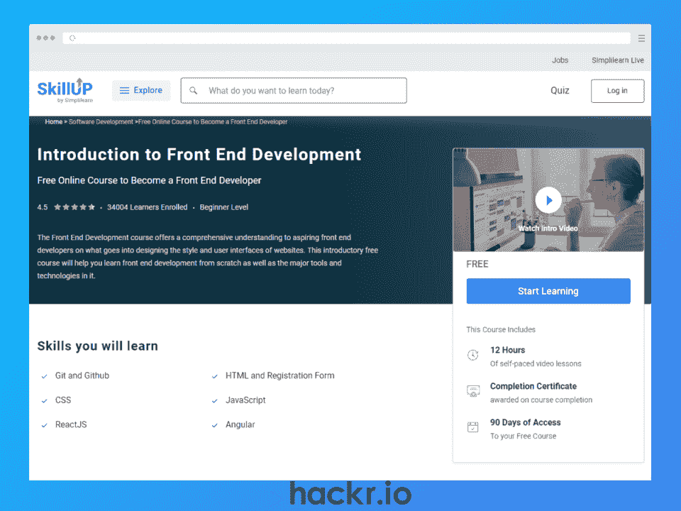**

**[了解更多](https://www.simplilearn.com/front-end-developer-free-course-skillup)**

| **关键信息** |
| **课程讲师:** Simplilearn 讲师 | **等级:**初学者 |
| **持续时间:** 12 小时 | **免费或付费:**免费 |
| **证书:**是 | **注册学生:+** 30K |

**我们为什么选择本课程**

这个免费的课程从 Git 和 GitHub 开始，你将学习版本控制和如何解决 Git 冲突。然后你将继续学习 HTML，CSS 效果和动画，以及 JavaScript。该课程还包括如何使用 React 库和 Angular 框架的部分。

对于那些对 web 开发感兴趣的人来说，这个自定进度的课程是很好的入门材料。

**优点**

*   学习现代 JavaScript (ES2022)语法
*   学习反应和角度基础知识

**缺点**

*   内容可能是高级学习者的基础

**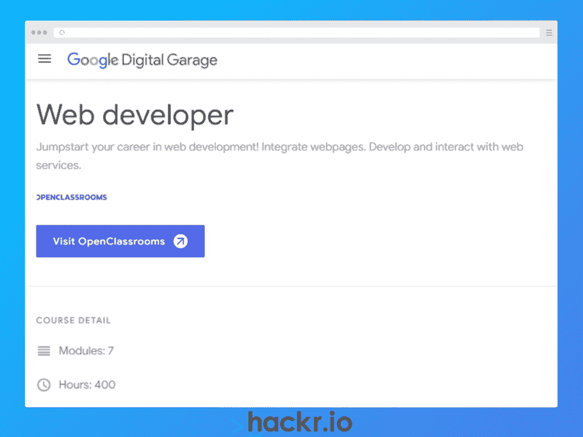**

**[了解更多](https://learndigital.withgoogle.com/digitalgarage/course/web-developer)**

| **关键信息** |
| **课程讲师:** OpenClassrooms 讲师 | **等级:**初学者 |
| **持续时间:** 400 小时 | **免费或付费:**付费 |
| **证书:**是 | **注册学生:**不适用 |

**我们为什么选择本课程**

谷歌网站开发人员培训旨在帮助你获得工作。您将使用 CSS 创建动画，学习响应式设计和网页可访问性，并实现 SEO 最佳实践。您还将学习使用 OWASP(开放式全球应用安全项目)标准安全地存储数据。

七个模块中的每一个都有一个部分让你通过构建一个项目来应用你的新知识。一些示例包括将实体模型设计转换为实际网站、移动网站动画、优化现有网站、构建电子商务网站以及为评论应用程序创建安全 API。

这是一个非常全面的初学者课程，因为它还涵盖了其他技术，如 MERN (MongoDB、Express、React、Node)堆栈、Vue.js、Git 和 GitHub。

**优点**

*   综合课程材料
*   每周一对一指导和职业辅导
*   获得大专文凭
*   来自谷歌的课程完成证书

**缺点**

*   需要平均六个月的全日制学习

**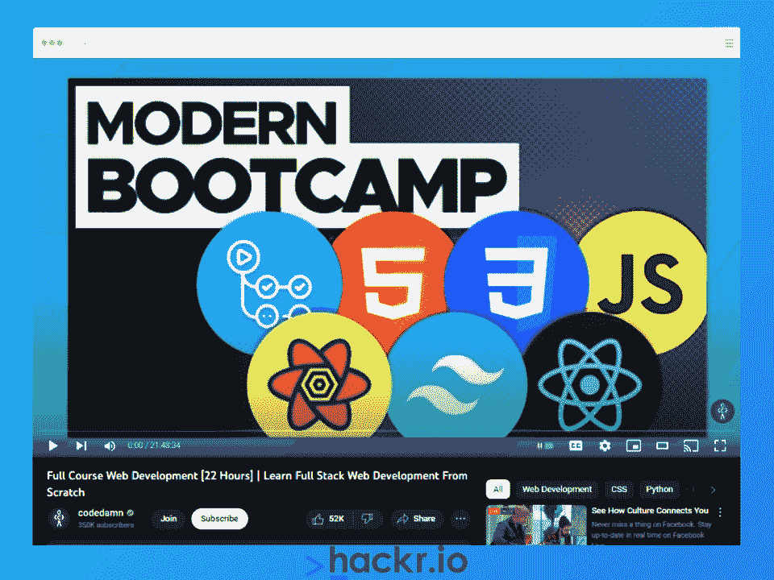**

**[了解更多](https://www.youtube.com/watch?v=ZxKM3DCV2kE)**

| **关键信息** |
| **课程讲师:** Codedamn | **等级:**初学者 |
| **持续时间:** 22 小时 | **免费或付费:**免费 |
| **证书:**否 | **视角:** 1.2M |

**我们为什么选择本课程**

这是另一个 web 开发人员免费的课程，深入研究了三个主要的 web 开发技术，HTML、CSS 和 JavaScript。它还包括使用 Node.js 和 Express.js 进行后端开发的部分。

涉及的一些关键主题包括 Linux CLI 中的 BASH 基础知识、CI/CD、GitHub 操作、Redis 缓存、React 网络请求查询等等。您还将看到高级的 Next.js 概念，如环境变量和服务器端属性。

**优点**

*   完全免费和全面的课程材料
*   还提供了关于版本控制的深入课程
*   包括许多练习来测试你的知识

**缺点**

*   YouTube 广告可能会分散注意力

[**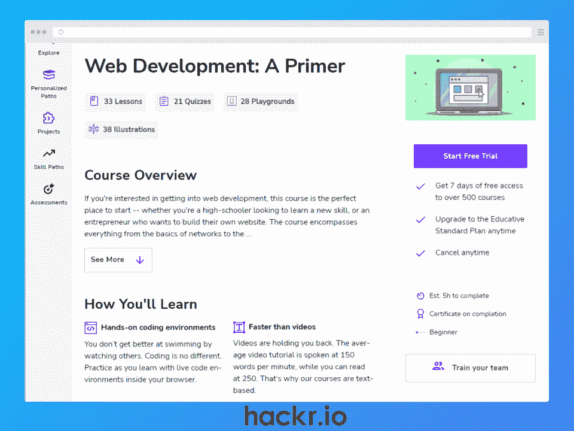**](https://click.linksynergy.com/deeplink?id=jU79Zysihs4&mid=47764&murl=https%3A%2F%2Fwww.educative.io%2Fcourses%2Fweb-development-a-primer)

**[了解更多](https://click.linksynergy.com/deeplink?id=jU79Zysihs4&mid=47764&murl=https%3A%2F%2Fwww.educative.io%2Fcourses%2Fweb-development-a-primer)**

| **关键信息** |
| **课程讲师:** Educative.io | **等级:**初学者 |
| **持续时间:** 5 小时 | **免费或付费:**付费 |
| **证书:**是 | **注册学生:**不适用 |

**我们为什么选择本课程**

如果你是 web 开发的新手，并且想学习一些背景理论，这将是一个不错的选择。该课程教授前端和后端开发以及版本控制。它还涵盖了微服务架构和测试驱动开发(TDD)。

这个在线课程还通过一系列循序渐进的教程，涵盖了什么是 web，它是如何工作的，以及 web 开发中的数据库。这些教程涵盖了 SQL 和 NoSQL 数据库、Web 缓存等主题。

**优点**

*   100%基于文本的课程
*   每个部分末尾的测验
*   学习软件工程的原理

**缺点**

*   文本内容可能不适合视觉学习者

**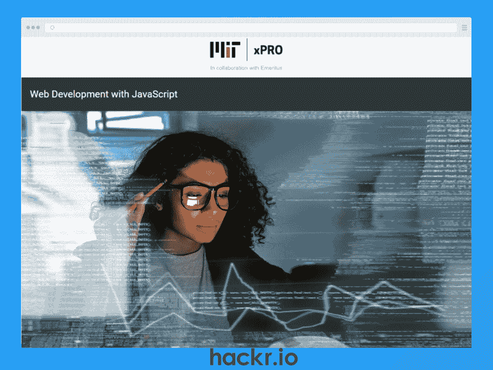**

**[了解更多](https://executive-ed.xpro.mit.edu/web-development-javascript)**

| **关键信息** |
| 课程讲师:约翰·r·威廉姆斯 | **等级:**初学者 |
| **持续时间:** 200 小时 | **免费或付费:**付费 |
| **证书:**是 | **注册学生:**不适用 |

**我们为什么选择本课程**

这个 web developer 项目的课程提供者是哈佛大学(对，没错！)，而且它专门关注 JavaScript 开发。您将学习各种 JavaScript 主题，包括数组操作和范围、回调函数和异步编码。您还将学习如何测试您的代码，以及使用 GitHub 的基础知识。

本课程涵盖的其他主题包括计算思维、计算操作的心智模型、网络安全基础和递归。

**优点**

*   麻省理工学院 xPRO 课程结业证书
*   了解网络安全的基础知识

**缺点**

*   需要基本的 JavaScript 知识

[**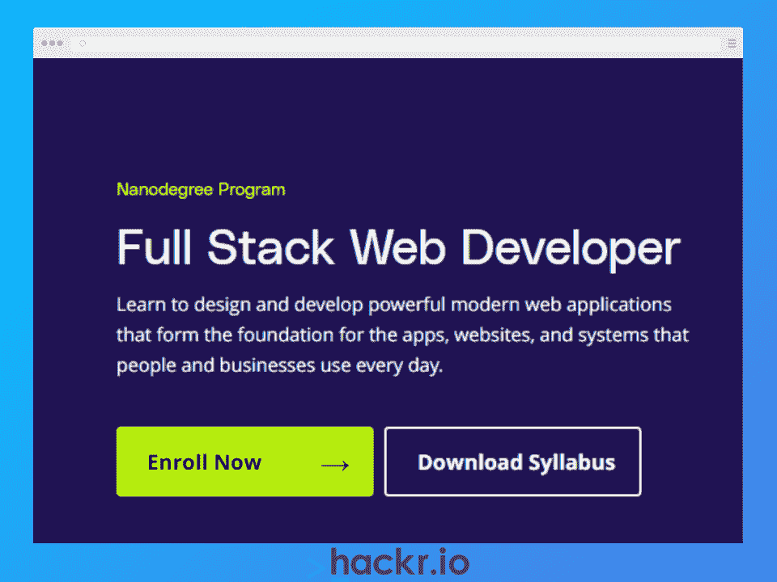**](https://imp.i115008.net/c/2890636/1125890/11298?u=https%3A%2F%2Fwww.udacity.com%2Fcourse%2Ffull-stack-web-developer-nanodegree--nd0044&partnerpropertyid=2722169)

**[了解更多](https://imp.i115008.net/c/2890636/1125890/11298?u=https%3A%2F%2Fwww.udacity.com%2Fcourse%2Ffull-stack-web-developer-nanodegree--nd0044&partnerpropertyid=2722169)**

| **关键信息** |
| 课程导师:艾米·华，卡林·麦卡锡，加布里埃尔·鲁特纳，肯尼迪·贝尔曼 | **等级:**中级 |
| **持续时间:** 160 小时 | **免费或付费:**付费 |
| **证书:**是 | **注册学生:**不适用 |

**我们为什么选择本课程**

这一面向 web 开发人员的基于项目的培训将教您构建和部署全栈、数据库支持的 API 和 web 应用程序。您将在本课程中学习的一些主题包括身份访问管理、服务器部署、容器化、数据建模和 API 开发。

这个项目使用 4 个子课程，每个都有自己的项目，像场地预订数据库或琐事 API。还有一个顶点项目，您将构建一个结合了所有新技能的全栈 web 应用程序。

本课程最适合具备一些 Python、HTML、CSS 和 Git 背景技能的开发人员。

**优点**

*   基于项目的全栈 web 开发学习
*   通过 Docker 了解集装箱化
*   获得技术指导支持

**缺点**

*   需要 Python、HTML/CSS 和 Git 方面的经验

**你的 HTML 技能是不是有点生疏了？查看** [**最好的 HTML 课程**](https://hackr.io/blog/best-html-courses)

## **结论**

如今，所有的东西和人都在上网，这意味着对网络开发人员的需求在持续增长。如果你正在考虑转行，web 开发是一个正在成长的行业，也是一个值得考虑的绝佳选择。

这篇文章涵盖了 2023 年 15 个最好的网络开发课程，为不同的技能水平提供了一系列的选择。我们还发现了基于文本的课程和基于视频的内容的混合物，因此无论您的学习风格如何，都应该有适合您的东西！

想提升你的简历吗？结账

**[最佳 HTML 认证](https://hackr.io/blog/html-certifications)**

## **常见问题解答**

#### **1。哪个网页开发课程最适合初学者？**

作为初学者，你应该找一个教授基础知识的课程，包括 HTML、CSS 和 JavaScript。有了这些知识，你就可以继续学习更高级的主题和课程。几乎我们在本文中包含的所有在线课程都适合初学者，所以看看我们的列表吧。

#### **2。Web 开发最好的课程是什么？**

Web 开发是一个广阔的领域，所以要看你个人的兴趣和志向。如果你对全栈开发感兴趣，你可以看看[Web Developer boot camp 2023](https://www.udemy.com/course/the-web-developer-bootcamp/?ranMID=39197&ranEAID=yFouE4wh9Xg&ranSiteID=yFouE4wh9Xg-xklSGPaV5bVGyYKVgTwiPA&utm_source=aff-campaign&utm_medium=udemyads&LSNPUBID=yFouE4wh9Xg)，或者如果你是一个有抱负的前端开发人员，考虑一下[前端开发人员职业道路](https://scrimba.com/learn/frontend)。如果你不确定，看看我们上面的列表，每个人都有适合自己的东西。

**人也在读:**