# 2023 年 UI/UX 设计师最佳线框工具【更新】

> 原文：<https://hackr.io/blog/best-wireframe-tools>

线框是网站或 web 应用程序的骨架框架。线框工具有助于可视化这些框架。

在一个项目中，UI/ [UX 设计师](https://hackr.io/blog/ux-design-courses)、业务分析师、视觉设计师和高级开发人员创建线框来建立网页设计的初始草图。

线框工具是移动和网络应用程序、仪表盘、界面和网站设计的理想选择。最好的线框工具旨在展示网站的信息设计、结构、导航设计(链接、页面之间的关系等。)，以及界面设计(方便用户与网站内容交互)。

幸运的是，有大量的线框工具可供选择。在这篇文章中，我们将深入研究什么是好的线框工具的细节。然后，我们来看看 2023 年最好的线框工具！

线框本质上是实际屏幕的原型或实体模型。它应该是一个接近实际设计的草图。但是既然有各种各样的线框软件可用，你怎么知道哪些是值得你花时间的呢？

下面是一些因素，使一个好的网站线框工具。

*   包含的 UI 套件 -线框工具通常内置用户界面套件或组件库。如果他们没有，那么他们通常至少会允许你上传你自己的工具包(或者甚至是预先设计的第三方工具包)。

*   不同的实体模型保真度级别 -最好的线框工具将允许你创建不同保真度级别的线框。如果你喜欢的话，你应该可以选择坚持基本的低保真度设计，或者如果你需要的话，可以选择高保真度设计。

*   **集成** -优秀的线框工具至少可以与你的技术堆栈中的一些工具集成。集成可以让您更轻松地简化工作流程。

*   协作工具(Collaboration tools)——因为远程工作已经存在，所以最好的 UI 线框工具只有内置协作和反馈功能才有意义。这些特性使得向同事、客户和其他利益相关者寻求反馈变得更加容易。

*   **多接入点(跨平台兼容性)** -在理想世界中，每个人都将使用自己的电脑工作。然而，事实并非如此，这就是为什么确保您的技术堆栈中的工具是灵活和通用的非常重要。好的线框工具通常可以在各种平台(桌面、网络、移动等)上获得。)，为需要的用户提供多个访问点。

*   **移交或导出功能** -大多数开发人员都非常擅长制作截图。然而，如果你能给他们提供更好的，他们就不必这样做。一些最好的线框工具具有移交和导出功能，允许用户单独导出设计元素。一些线框工具甚至允许用户通过检查设计将整个屏幕导出为 HTML 或获取 CSS 代码。

*   设计良好的用户界面(UI)-好的工具往往有直观和用户友好的界面。一个直观的用户界面可以大大缩短学习曲线，使用户更容易拿起工具并立即投入使用。此外，好的用户界面可以让完全的初学者学习起来没有太多的麻烦。因为线框工具帮助你创造良好的[用户体验](https://hackr.io/tutorials/learn-ux-research)，所以它们提供同样的体验才有意义。

*   **学习曲线** -并不是所有的网站线框工具都是一样的——有些更容易学习，而有些可能需要更多的时间和培训才能掌握。大多数优秀的线框图工具都有较浅的学习曲线。

*   **文档和支持**——即使学习一个工具有点困难，如果有大量的文档，这个过程也会变得容易得多。优秀的工具会以知识库、常见问题解答、手册甚至论坛的形式提供大量文档。一个好的工具通常也会得到其开发者的良好支持。

*   社区(Community)——人们倾向于围绕一切事物形成社区——包括最好的线框设计工具。

*   **物有所值** -如果是付费的线框工具，是否物有所值？我们能创建不同类型的线框吗，比如高保真和低保真度的？定价灵活吗？

## **我应该使用哪个线框应用程序？**

有这么多可用的工具和这么多要考虑的因素，很容易让人不知所措。在你陷入决策瘫痪之前，问自己以下问题:

*   我需要这个工具做什么？问问自己，你的线框图工具的主要目的是什么。它是用于一次性项目，还是您将需要不断地访问您的工具？您需要更复杂的工具，还是简单的工具就能解决问题？

*   我的预算是多少？您的预算将是您最终选择哪种工具的最大决定因素之一。即使你喜欢某个特定的 UI 模型工具，如果它超出了你的价格范围，选择它是没有意义的。创建一个符合您预算的工具列表，以便以后更容易选择。

*   该工具是否适合我的技术组合？如果你或你的团队有一个现有的技术堆栈，在你提交之前考虑一个线框应用是否适合这个堆栈可能是一个好主意。选择一个适合甚至集成到您的技术堆栈中的工具可以极大地帮助简化您的工作流程。

*   我需要所有这些功能吗？选择一个漂亮、别致的工具很容易，因为它有许多你可能认为以后会派上用场的功能。然而，仅仅因为一个工具拥有所有这些特性并不意味着你会需要它们。如果有一些功能你可以不用，那么选择另一个工具可能是个好主意，尤其是如果它能帮助你削减成本的话。请记住，你并不总是需要专用的线框工具——例如，如果你只需要为一次性项目创建一两个线框，你通常可以使用流程图应用程序甚至图形设计应用程序。

如果这不能帮助你更容易地做出决定，请记住，在你的技术堆栈中有一个以上的工具是完全正常的。许多线框工具提供不同的功能，但这些功能并不总是重叠的，所以选择多个工具来覆盖所有的基础是没有问题的。

**推荐课程**

[使用 Balsamiq 模型构建线框的详细指南](https://click.linksynergy.com/deeplink?id=jU79Zysihs4&mid=39197&murl=https%3A%2F%2Fwww.udemy.com%2Fcourse%2Fdetailed-guide-to-building-wireframes-using-balsamiq-mockups%2F)

| **工具** | **描述** | **免费计划** | **定价** |
| 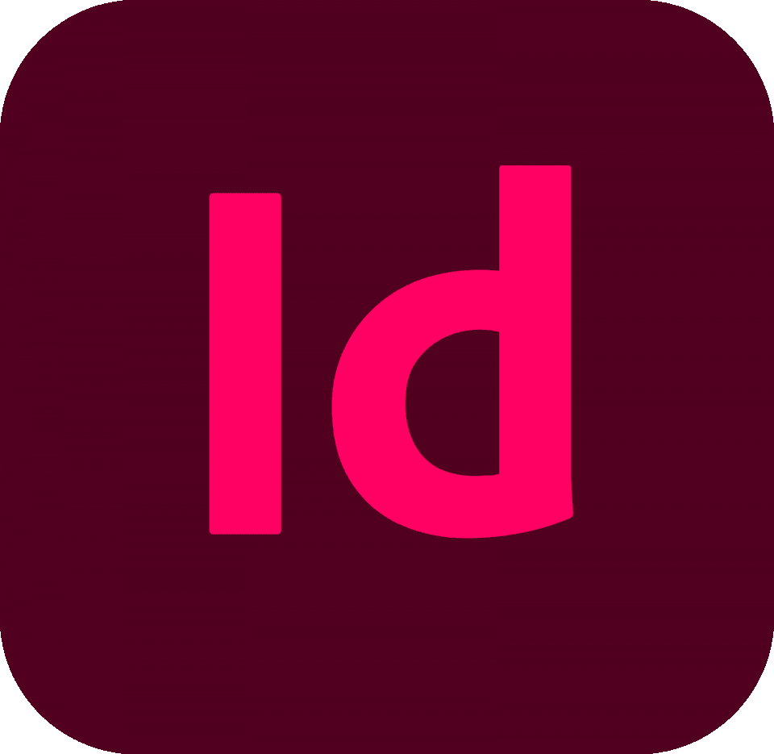[Adobe inDesign](https://www.adobe.com/products/indesign.html) | 多任务发布工具 | 七天免费试用 | 每个用户每月 20.99 美元起 |
| 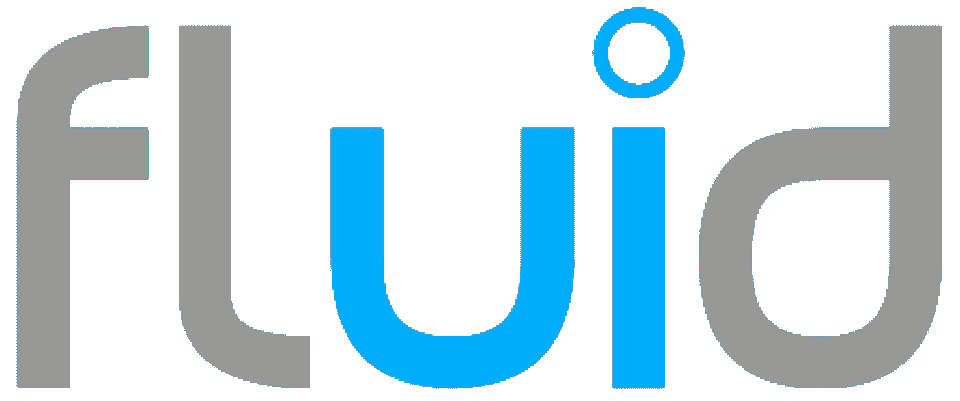流体 | 最适合用户界面原型 | 免费永久计划 | 每月 8.25 美元起 |
| 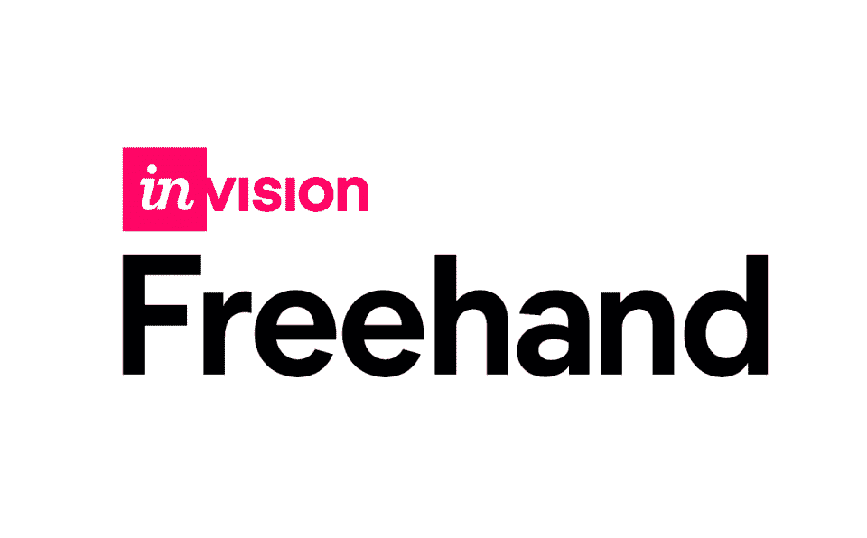[视觉徒手](https://www.invisionapp.com/freehand) | 最佳协作工具 | 免费永久计划 | 每个用户每月 4 美元起 |
| 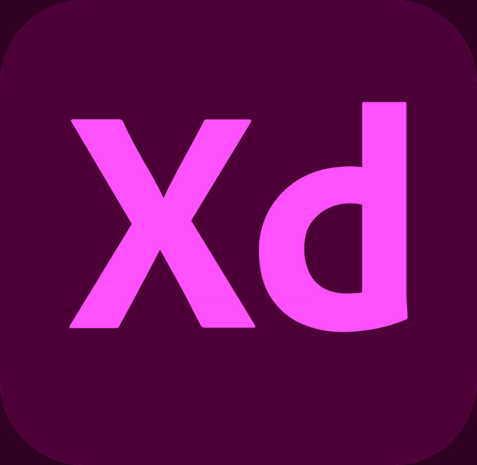[Adobe XD](https://www.adobe.com/products/xd.html) | 初学者的最佳线框工具 | 七天免费试用 | 每位用户每月 9.99 美元起 |
| 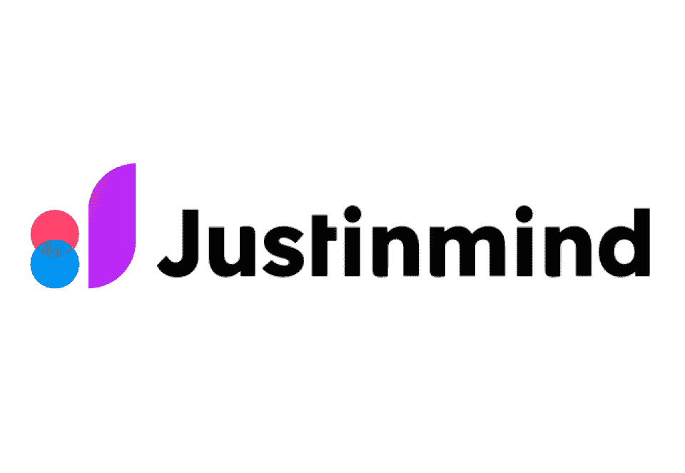[Justinmind](https://www.justinmind.com/home-a) | 最适合制作交互式和逼真的线框 | 免费永久计划 | 每个用户每月 9 美元起 |
| 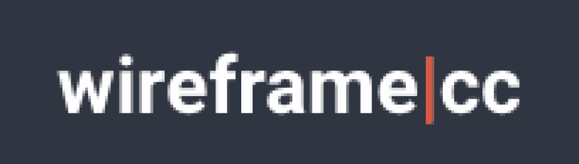[Wireframe.cc](https://wireframe.cc/) | 最佳网络线框工具 | 永久免费基础版 | 一个用户每月 16 美元起 |
| 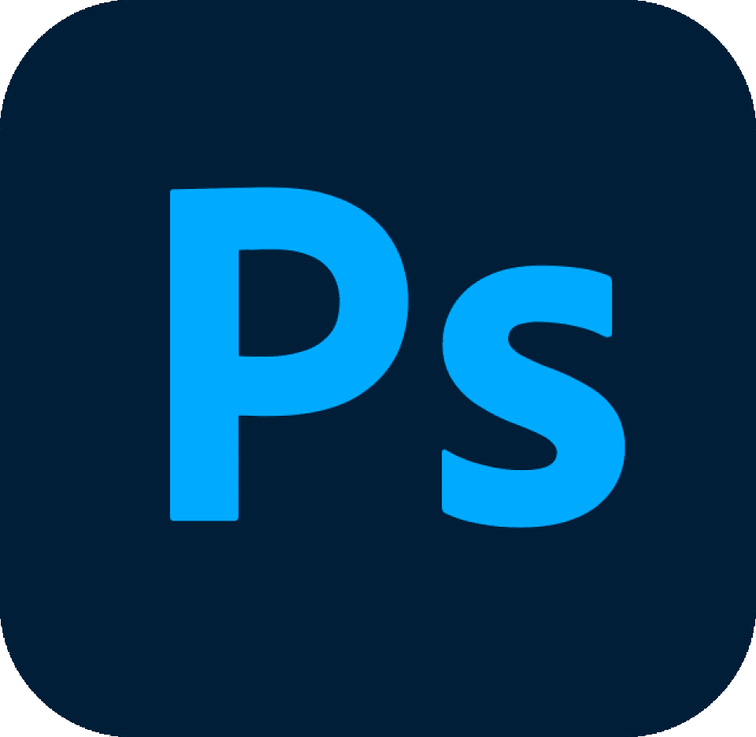[Adobe Photoshop](https://www.adobe.com/products/photoshop.html) | 行业标准设计工具 | 七天免费试用 | 每月 20.99 美元起；提供区域定价 |
| [UXPin](https://www.uxpin.com/) | 与开发人员合作的最佳移交功能 | 仅限免费试用 | 每个用户每月 19 美元起 |
| [Mockplus](https://www.mockplus.com/) | mock plus RP-最佳免费协作线框工具 | 永久免费基础版 | 从 4.95 美元到企业定制计划 |
| [草图](https://www.sketch.com/home/) | macOS 的最佳线框工具 | 30 天免费试用 | 每个用户每月 9 美元起 |
| 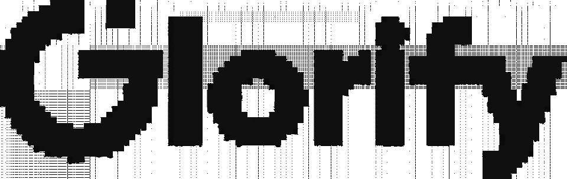[荣耀](https://www.glorify.com/?ref=venturekite) | 最适合营销使用 | 最多三个用户的免费永久计划 | 五个用户每月 29.99 美元起(每个用户 5.99 美元) |
| 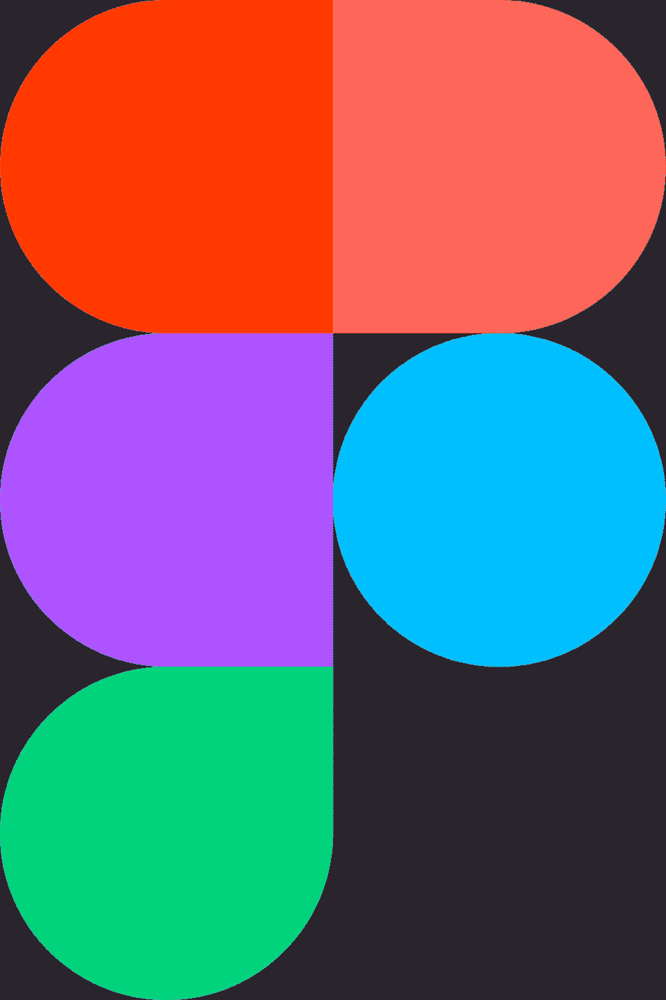[图](https://www.figma.com/) | 线框制作的最佳免费工具 | 最多三个项目免费 | 每个用户每月 12 美元起 |

我们包括了一个全面的免费和付费工具列表，否则这是一项非常艰巨的任务(市场上有太多这样的工具了！).

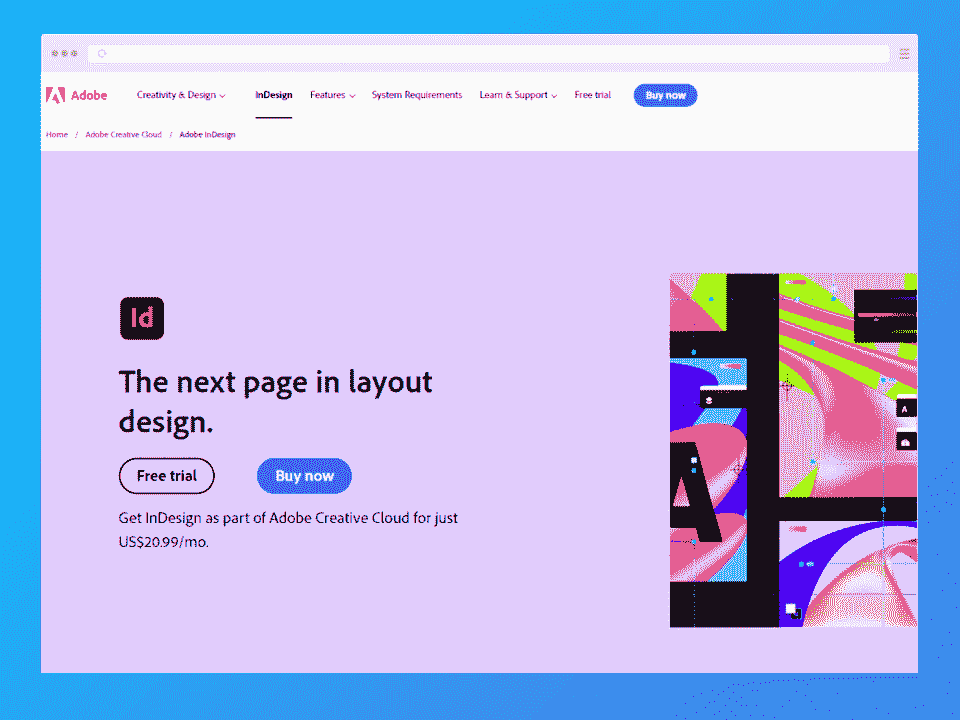

**我们的评分:** 4.4/5

InDesign 是 Adobe Creative Cloud 的一部分。虽然 InDesign 不是专门作为线框图软件构建的，但它有这个能力，这就引出了本节。InDesign 主要用于电子书和杂志等印刷品，也创建实体模型和线框。

#### **亮点**

*   **交互式 pdf:**带动画和多媒体视频
*   **独立库:**包括可重复使用的用户界面图形
*   **创意云整合**

#### **定价**

**InDesign:**$ 20.99/用户/月

**Creative Cloud 所有应用:**$ 29.99/月，低于黑色星期五交易时的$52.99

**苹果操作系统还是微软:**两者都有

### 2.**-最适合用户界面原型**

 **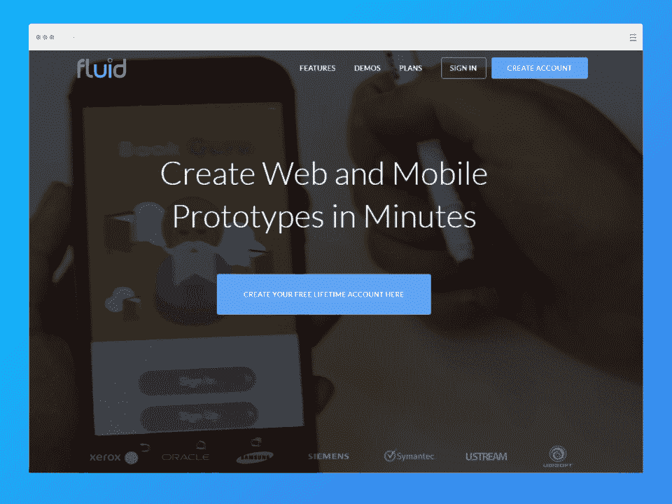

**我们的评分:** 4.7/5

FluidUI 对于手机和网络原型都是一个优秀的线框工具。它有一个直观的界面，可以在几分钟内创建原型。借助 Fluid UI，您可以在 web 平台和其他 Android 和 iOS 设备上创建低保真度和高保真度类型的应用程序。

它有许多功能，如云访问、集成的小部件、交互式链接和缩放、协作工具等等。由于它是基于云的，你可以立即保存你的工作，并与任何人分享。

#### **亮点**

*   **2000 多个预建的 UI 套件:**用于快速原型制作
*   **轻松访问:**直观地链接您的原型，并使用应用程序或浏览器随时随地访问它们
*   **简单测试:**使用您的手机或任何手持设备在任何地方测试原型
*   **协作:**在团队中即时分享变化，并通过实时视频通话产生并行产生的想法；无限的用户和原型
*   知名:谷歌、LinkedIn、易贝、戴尔等顶级公司都使用 FluidUI 进行原型开发。

#### **定价**

根据您的要求，有三种不同的计划:

*   **Solo:** 功能有限，每月 8.25 美元或每年 99 美元
*   **Pro:** 用于项目共享和协作，每月 19.08 美元或每年 229 美元。
*   **团队:**以每月 41.58 美元或每年 499 美元的价格就项目进行实时协作并访问无限的功能。
    **macOS 还是微软:**两者都有

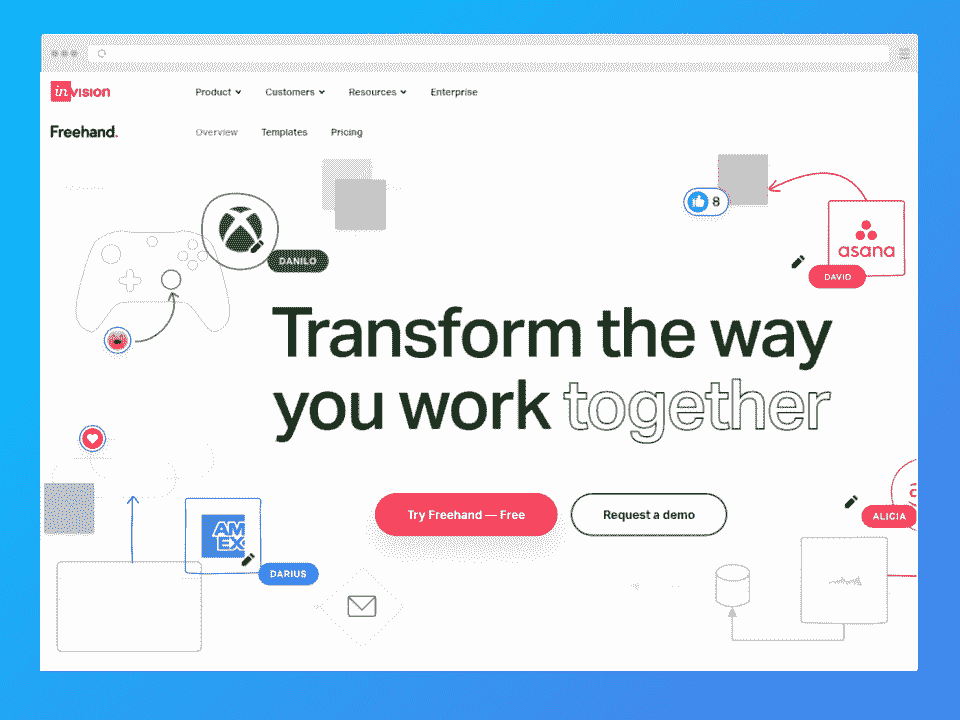

**我们的评分:** 4.6/5

InVision 是一个强大的模型工具，但也非常有趣和有趣的工作。由于您可以徒手绘画，该工具允许您像在纸上一样展示您的技能。此外，使用共享的在线白板，整个团队可以实时协作。您还可以将 freehand 与 Microsoft Teams、Sketch 和 Photoshop 等工具集集成在一起。

该平台还为单口相声、头脑风暴会议、破冰者会议、复古聚会或任何其他活动提供了许多模板。

#### **亮点**

*   免费版本本身带有许多功能，可以为任何产品或会议快速创建原型。
*   基于云的设计。
*   非常流畅的协作体验，只需最少的时间，没有任何麻烦，让您有更多的时间来讨论想法
*   团队可以通过移动设备或浏览器在整个产品设计过程中获取反馈。
*   简单易用，没有学习曲线。
*   使用线条工具的各种颜色和不透明度等功能有助于创建不同层次的连接，并对想法和其他作品进行分类。
*   Freehand 就像一个无限的数字画布，非常适合中低保真度的设计，可以与其他高级演示和设计工具集成。

#### **定价**

有三种不同的计划:

*   **免费:**$ 0/用户/月，个人用户可以免费使用 3 次，并拥有无限的空间
*   **Pro:**$ 4/月/用户年费，或$ 4.95/月/用户，适用于最多 200 名活跃用户的跨协作团队，拥有无限自由活动空间以及公共和私人空间
*   **企业:**适用于任何规模的团队，具有特殊权限、专门的客户成功经理等等。[联系 InVision 定价](https://www.invisionapp.com/freehand/pricing)。
    **macOS 或者微软:**两者都有，在网络上工作。

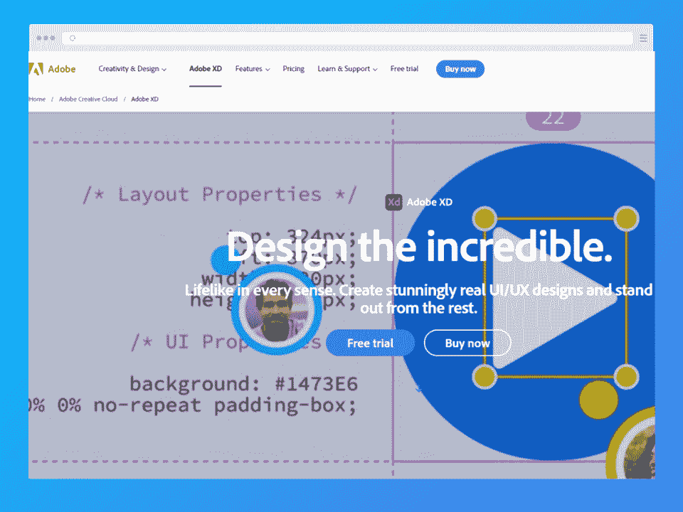

**我们的评分:** 4.6/5

Adobe XD 是 UI 和线框设计师的工具和模板的海洋。用于原型制作的最佳网站模型工具之一。它具有纸板、3D 变换、多个画板、引导样式网格、可重用组件(如按钮、卡片、上下文层面板)等功能，最重要的是，与其他 Adobe 产品套件的集成使其成为创建交互式原型的完美选择。

#### **亮点**

*   **多功能:【Windows 和 iOS 均可使用，但也支持 Android 版本的移动视图**
*   **与其他应用程序顺畅交互:**您可以打开其他 Adobe 产品中的文件，如 Photoshop、Illustrator、Sketch 和 After Effects，并使用密码保护以确保安全
*   **支持外部插件:**增加更多功能
*   **多功能设计:**能够将静态设计转化为交互式原型，添加动画，并在不同设备上测试
*   **内置分享工具:**快速获取反馈。

#### **定价**

有两种类型的计划-个人和企业:

##### **个人**

Adobe XD:$ 9.99/用户/月

所有应用:$ 52.99/月

##### **商家**

**中小型团队:**$ 22.99/月

**所有团队应用:**$ 79.99/月

**macOS 还是微软:** Both + Android for mobile view

### 5.**-最适合制作互动&的逼真线框**

 ****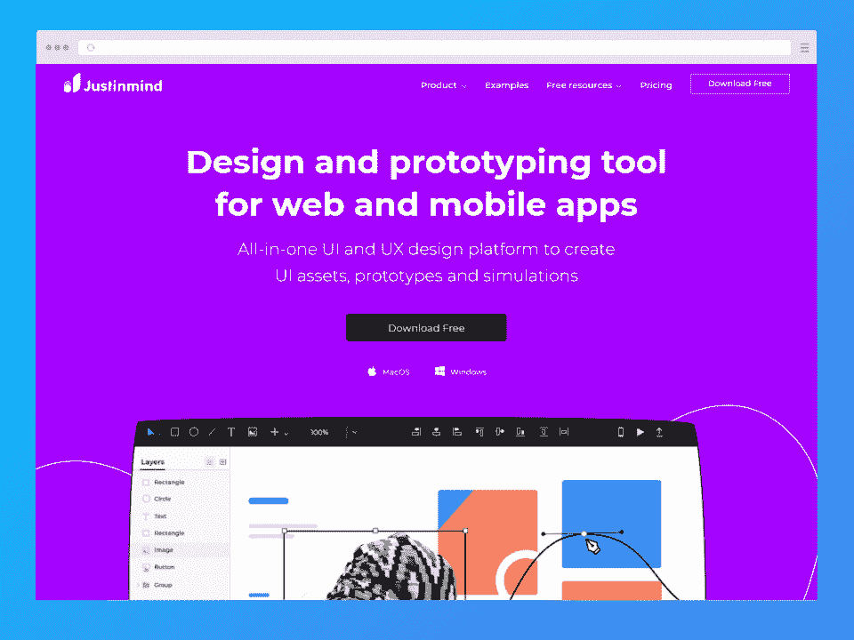**

**我们的评分:** 4.6/5

Justinmind 的独特之处在于其丰富的预构建和预加载 UI 套件以及拖放界面。这使得原型制作变得有趣而简单，有交互式链接和可点击的点。只需一次点击即可测试 UI。

您可以通过单击发布原型，并与利益相关者共享以获得反馈。它还允许创建高保真原型的无代码原型。

#### **亮点**

*   **交互原型元素:**如单选按钮、下拉列表。文本输入等等
*   早期测试:在项目开始时作为原型进行测试
*   **人性化:**直观的布局

#### **定价**

**免费:**无限制的项目、动画和原型制作、设计模板和特定的导出功能

**标准:**$ 9/用户/月按年计费或$ 14/月/用户按月计费，无限云存储、web 交互、移除平台品牌、高级协作等

**Professional:**$ 19/用户/月，按年计费，或$ 29/用户/月，包含用户流量、JIRA 集成、共享 [UI 库、](https://hackr.io/blog/javascript-ui-library)共同编辑等等

**企业:**定制每个项目的价格，多个管理帐户、角色、LDAP 和 SAML 集成

无论是 macOS 还是微软，你都可以在网络浏览器上使用这个线框图工具。

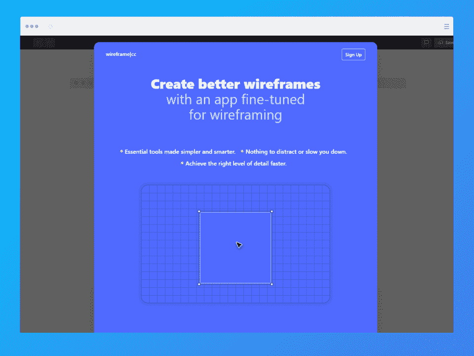

**我们的评分:** 4.5/5

如果你是初学者，并且对成熟应用程序的许多功能和元素不知所措，这里有一个简单的方法。Wireframe.cc 是一个极简的网络应用程序，可以在几分钟内创建线框，并且不需要任何安装。

它非常适合那些短暂的灵感爆发，如果你突然有了一个想法，想在忘记之前把它勾画出来！即使是初学者也可以很快学会，因为它具有易于使用的拖放功能。

在向绘图中添加图像、标题和形状时，也可以给线框添加批注。Wireframe.cc 是基于云的平台的最佳工具之一，因此您可以轻松地在整个团队中导出、共享和编辑工作。

#### **亮点**

*   **两种模板:**浏览器和移动界面
*   **可调整画布:**在绘制时更改大小、填充颜色、网格大小等
*   **协作:**通过唯一的 URL 和 PDF 导出共享作品
*   **简单布局:**节省不必要细节的时间
*   没有学习曲线:伟大的网站模型工具，即使对那些没有 UI 设计想法或经验的人来说也是如此。
*   **键盘或鼠标:**线框提供了简单的[键盘快捷键](https://wireframe.cc/docs/#-keyboard-shortcuts)。
*   智能向导:它们使工具变得直观和上下文相关。

#### **定价**

有两种类型的计划:

*   免费:基本版，有公共和单页线框，但没有用户帐户
*   **Premium Solo:**$ 16/月，一个用户，独立的编辑器和预览模式，一个私人用户帐户，私人和可点击的线框，PDF 导出，等等
*   **Premium Trio:**$ 39 月，三个用户，拥有 Premium Solo 帐户的所有功能
*   **Premium Enterprise:**$ 99/月，无限制用户，拥有 Premium Solo 和 Trio 账户的所有功能
    **macOS 或微软:**两者，在网络浏览器和移动设备上运行

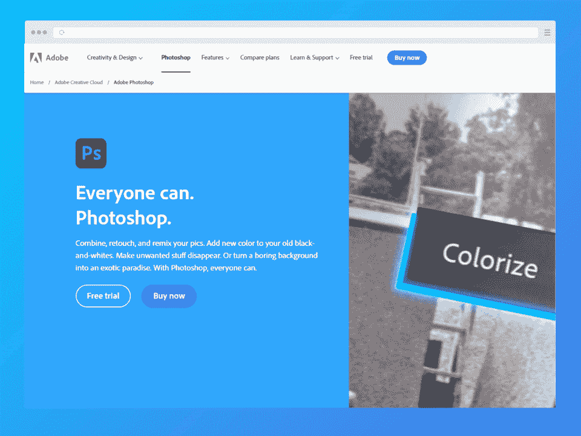

**我们的评分:** 4.4/5

Photoshop 是设计界的行业标准。Photoshop 拥有无穷无尽的功能，让设计人员可以在其平台上轻松创建线框，尤其是如果您有使用其他 Adobe 产品的经验。

对于初学者来说，这不是一个很好的工具，因为它有一个相对陡峭的学习曲线。

#### **亮点**

*   **高保真样机:**无需切换系统
*   **快速图像编辑:**轻松将线框转换成实体模型并包含其他图形

*   **无尽的功能:**颜色处理、绘图、裁剪等等

#### **定价**

有 3 种不同的计划:

*   **基本:**20.99 美元/月，带 100 GB 云存储和 Adobe Fresno 用于绘图和绘画
*   **摄影:**$ 19.99/月，1TB 数据存储，用 LightRoom 存储和编辑照片
*   **所有应用:**$ 52.99/月，可访问 Adobe
    **macOS 或微软**的 20 多个桌面和移动应用

### 8.**-与开发人员合作的最佳移交功能**

 **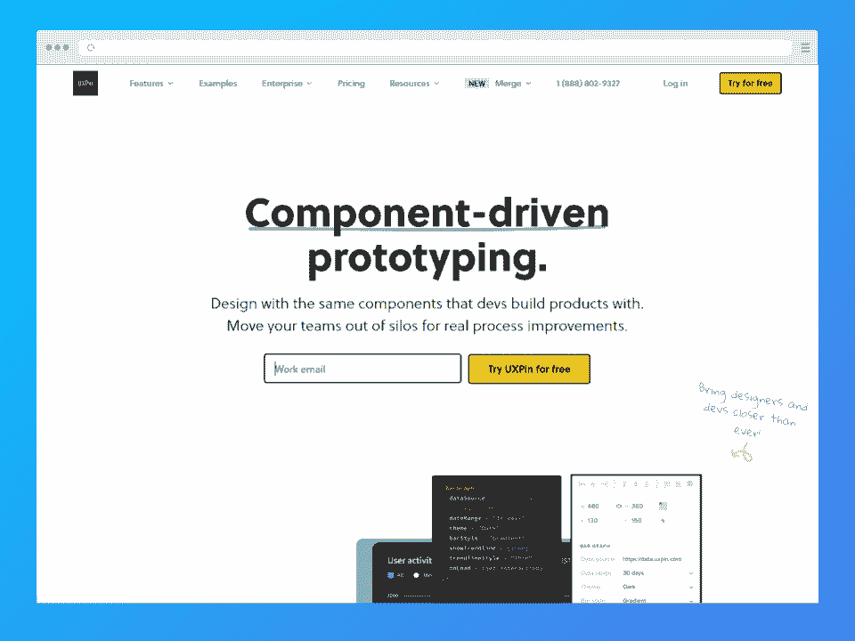

**我们的评分:** 4.7/5

如果你是线框图的新手，UXPin 就是你的工具！它有一个直观的界面，带有易于识别的工具栏，包含所有基本组件。UXPin 有一组内置的 UI 元素，您可以拖放它们，这样您甚至可以快速创建详细的线框。此外，您可以创建基本的线框，并将其与 Sketch 或 Photoshop 集成，以将其转化为高保真设计。

UXPin 具有独特的功能，如团队演示、将设计规范交给开发人员以及添加交互。

#### **亮点**

*   **现场演示和文档:**使用预览功能展示工作原型
*   **便捷预览功能:**设计、审核、预览、审核、批准、归档，同步快速移交
*   **独特的原型制作工具**:将原型带到开发和协作的最后阶段。
*   **基于浏览器:**可在任何电脑上运行，不需要额外的软件
*   **预建设计元素**:针对 iOS app 界面、素材设计、Bootstrap web 用户界面、用户流。
*   知名:被微软、PayPal、HBO、网飞等顶级公司使用。

#### **定价**

没有免费版本，但是你可以从所有不同计划的免费试用开始。

*   **基本:** $19/用户/月，不限审核者和原型，利益相关者批准，互动和动画等。
*   **高级:**$ 29/用户/月，包含表达式、变量、条件逻辑和上下文文档，以及基本计划中的所有内容
*   **专业:**$ 69/用户/月，优先支持、高级安全、角色和权限、设计系统以及高级计划中的一切
*   **Enterprise:** custom price based on your project requirements, but includes everything from the professional plan, as well as unlimited users, training and onboarding, design systems, and roles and permissions
    **macOS or Microsoft:** Both, and web browsers

[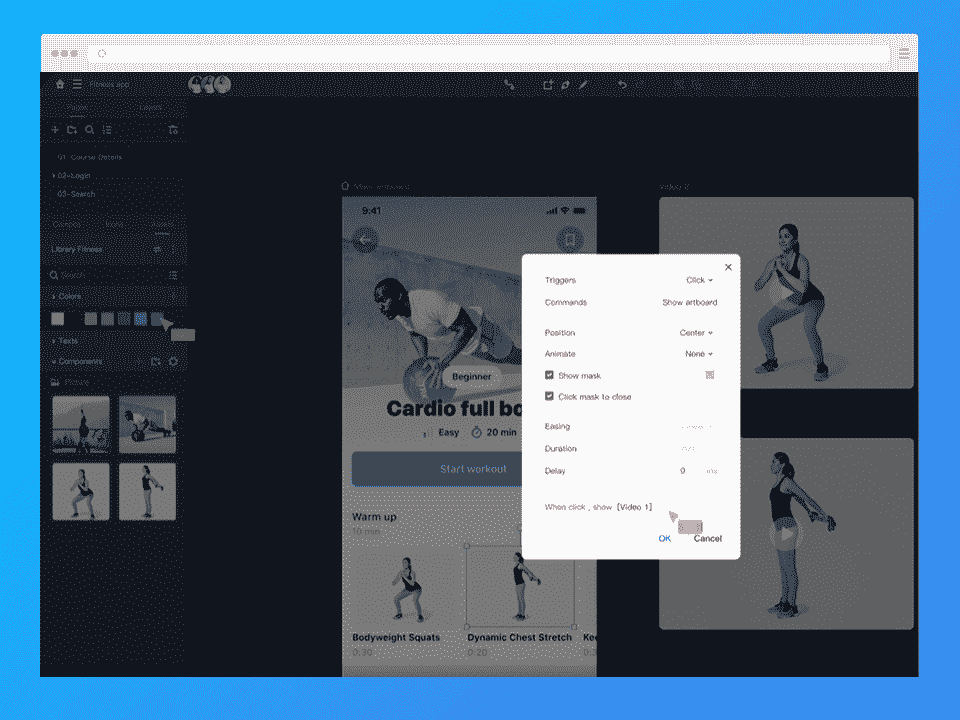](https://www.mockplus.com/mockplus-rp)

**我们的评分:** 4.7/5

对于初学者来说，Mockplus RP 是一个快速简单的线框和原型工具。你可以使用他们的免费计划创建 3 个原型，每个原型 10 页。这也是一个基于浏览器的设计平台，支持快速设计并简化协作工作流程。

**亮点:**

*   像拖放一样简单的 UI 流程图
*   无缝连接到深度协作和移交
*   创建一次线框资产，然后大规模重用
*   主画板+子画板:“主画板+子画板”设计套件使得通过简单的拖放操作创建弹出窗口、模式、提醒和其他动态内容变得非常容易。
*   并排批注

**定价:**

*   免费/mo 3 原型每个原型 10 页
*   $12.95/mo 不限页面和原型；无限修订历史
*   定制计划

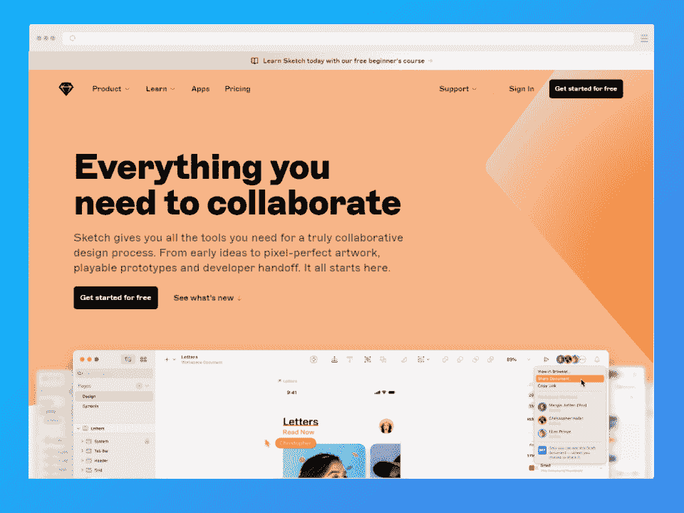

**我们的评分:** 4.7/5

我们多次提到素描，在这里！Sketch 是 macOS 的终极线框应用。它非常适合轻量级的、详细的、基于矢量的设计，你可以用它来做线框、铁矢量设计、交互设计和现代 UI 设计。设计就像形状和一些画板一样简单，许多用户发现该平台比其他流行的基于矢量的线框工具(如 Adobe)更容易使用。

请记住，虽然 Sketch 没有任何预建的 UI 组件，但您可以在应用程序中设计它们，然后重用它们，或者下载第三方 UI 套件，以立即准备好基本的线框。

#### **亮点**

*   700 多个扩展:许多插件和集成，用于实时设计和动画交互
*   **与团队协作:**能够与外部协作者共享文档
*   **测试和分享想法:**原型链接可以帮助你形象化设计的每一步
*   **将许多项目导出到图像文件:**共享符号和样式、调整大小选项和多个画板
*   用户数量的多样性:任何规模的团队都可以使用 Sketch，包括大公司或个体自由职业者

#### **定价**

**对于个人和团队成员:**$ 9/月/用户或$ 99/年/用户

**有定制需求的商家:** [联系草图](https://www.sketch.com/pricing/)

**苹果电脑还是微软:**苹果电脑

### 11. [**美化**](https://www.glorify.com/?ref=venturekite)——最适合营销使用

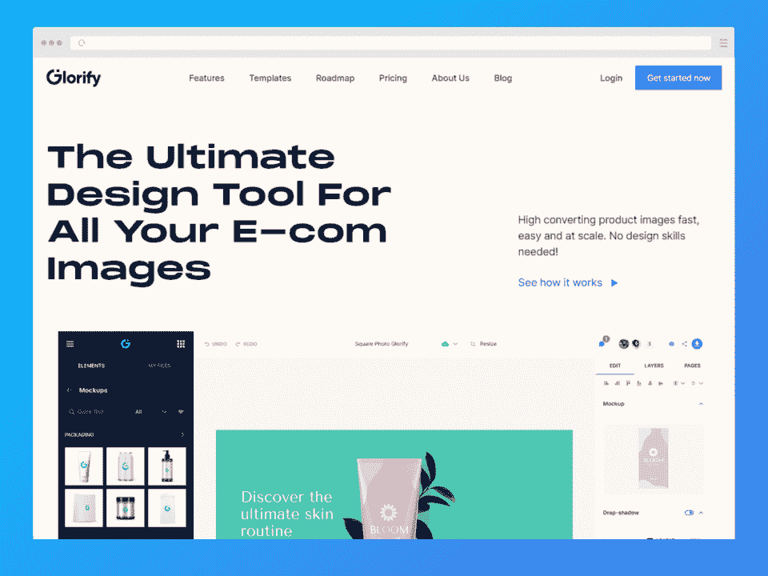

**我们的评分:** 4.5/5

Glorify 标榜自己是一款一体化的设计应用程序，允许您创建专业而美丽的设计，从而推动转换。它是由一群营销人员、设计师、企业家和自称极客的人创建的，他们知道如何为推广产品或服务创造一个令人惊叹的形象。

Glorify 是 Photoshop 和 Canva 的完美平衡。它为初学者提供了简单的工具，为更有经验的人提供了大量的高级工具。最棒的是，你可以免费试用看看它是否合适。

#### **亮点**

*   Glorify 有一个**永远免费**的计划，最多允许三个人有限地使用它的特性和功能。
*   有大量的模板可以让设计变得更快更容易。
*   Glorify 有许多功能可以使设计过程更加流畅，比如图像的背景去除器、智能调整大小功能、注释工具等等。
*   协作过程简单易行。
*   Glorify 有一个庞大的资源库，您可以将它用于您的设计，如图标、库存照片、模型、插图等等。
*   该公司是透明的，并提供了即将推出的功能的完整路线图，所以你知道在不久的(或遥远的)将来会发生什么。
*   Glorify 有很好的文档记录，并且有一个知识库和社区论坛可以帮助您解决任何问题。

#### **定价**

Glorify 有三个可用的计划。

*   **永远免费**-$ 0/月，最多三个用户。它给你一个工作空间，五个项目，十个背景去除剂使用/月，和十个高级股票/月。

*   **Pro year**-29.99 美元/月，按每年 359.91 美元/年计费，五个用户(每个用户 5.99 美元)。它给你五个工作空间，无限的项目，无限的下载，无限的客人，100 高级股票/月，和 100 背景去除剂使用/月。

*   **商务年费**-74.99 美元/月，按 10 个用户每年 899.91 美元计费(每个用户 7.49 美元)。它给你无限的工作空间，项目，下载，客人，背景去除使用，和优质股票。

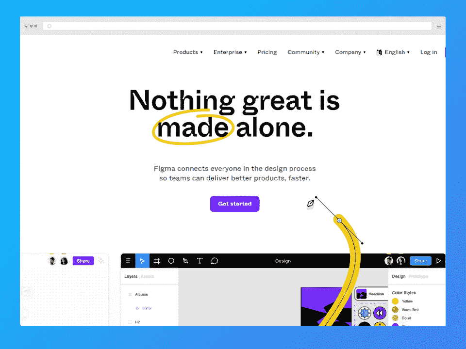

**我们的评分:** 4.9/5

许多人很容易将 Figma 命名为线框的最佳软件，因为它提供了一个伟大的功能组合——而且它都是基于云的。此外，Figma 为用户提供了在选择付款方案之前完全免费构建三个项目的能力。

作为一个网站模型工具，Figma 非常简单易用。唯一反对它的可能是它没有任何内置的用户界面组件。但是，它将允许您使用预先设计的套件或上传自己的套件。不管怎样，Figma 让创建画板、添加文本和基本形状变得非常容易，甚至可以做一些原型制作。

Figma 还允许用户在设计上进行合作，并留下反馈意见。最后，一旦模型完成，用户可以单独导出元素并访问设计的 CSS 代码。

#### **亮点**

*   Figma 是一个基于浏览器和云的工具。它最初为此受到了批评，但随着时间的推移，人们逐渐意识到是 Figma 基于浏览器的特性允许它拥有许多独特的功能和灵活性。
*   Figma 是最好的网站模型工具之一，这要归功于它的“代码模式”，它允许用户检查任何元素并检索所有相关的实现信息。
*   这个工具创建实体模型、高保真原型、交互动画等等。
*   世界各地的设计团队利用 Figma 作为设计组件库。
*   Figma 具有版本控制、演示模式和大量协作特性。
*   除了创建线框和模型，Figma 还能够完成各种其他任务，如图标集设计、标志设计、插图等等。

#### **定价**

Figma 有四种定价选择。

*   **Starter -永远免费** -给你三个 Figma/Figjam 文件，无限的个人文件和合作者，访问移动应用程序，并能够使用小部件、模板和插件。

*   Figma Professional -每年 12 美元/编辑/月，或每月 15 美元/编辑/月-为您提供无限的 Figma 文件、共享权限、无限的版本历史、团队库、共享/私人项目、音频对话等。这个水平对教育工作者和学生来说是免费的[。](https://www.figma.com/education/)

*   **Figma 组织**-45 美元/编辑/月，按年计费(无月费选项)-为您提供 Figma Professional 中的一切，此外还有:设计系统库、组织范围的库、集中式文件管理、分支和合并、单点登录、私有小部件和插件、统一管理和计费等。

## **结论**

线框工具是设计和开发过程的重要组成部分。鉴于它们的重要性，选择符合您的需求和预算的合适产品才是有意义的。我们希望这 11 个最好的线框图工具能帮助你做出决定！

如果你有兴趣了解更多关于线框的知识，请随时查看我们的[线框教程和课程](https://hackr.io/tutorials/learn-wireframing)。请在评论中告诉我们你更喜欢哪个线框工具！

## **常见问题解答**

最好的线框工具是最适合你的需求，同时符合你的预算。考虑您的项目和特定目的所需的功能。还要记住，在你的技术堆栈中有一个以上的线框工具是完全正常的，尤其是当每个工具执行不同的功能时。

是的，Figma 是一个线框工具。它非常用户友好和直观，即使对于绝对的新手来说也是一个极好的选择。试试 Figma 吧——它最多可免费用于三个项目。

#### **3。网页设计师为什么要做线框图？**

网页设计师经常使用线框作为一种方式，使他们的设计更加有形。这种有形性使得规划和理解网站的功能和导航变得更加容易。然后，Web 设计人员可以与用户体验设计人员一起工作，确保为用户提供良好的 UI 和体验。

#### **4。什么是线框 UX？**

线框被用在用户体验设计中，以帮助设计师为周围的用户创造最好的体验。这些线框作为一个网站或应用程序的构建模块，因为它们允许设计师直观地绘制数据出现在用户屏幕上的位置。

#### **5。什么是线框软件？**

线框软件是允许用户为任何目的创建线框的工具。他们通常有模板、设计元素库、UI 工具包等等。线框工具通常有很多特性，使得导出和将设计交给开发人员变得更加容易。

**人们也在阅读**:******