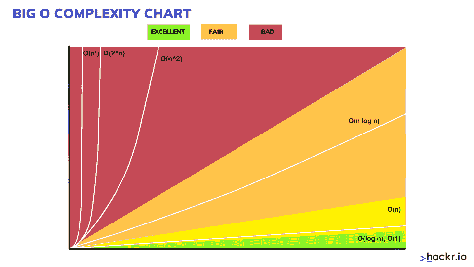
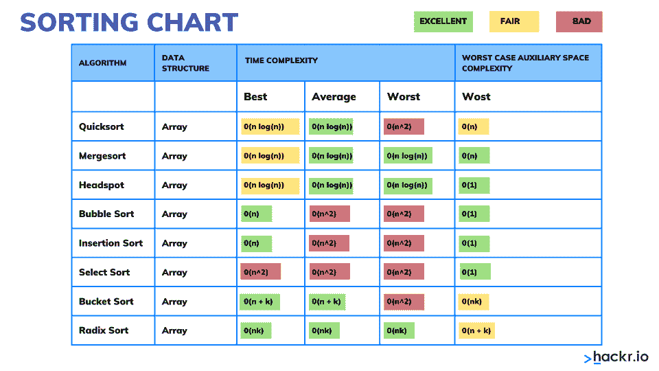
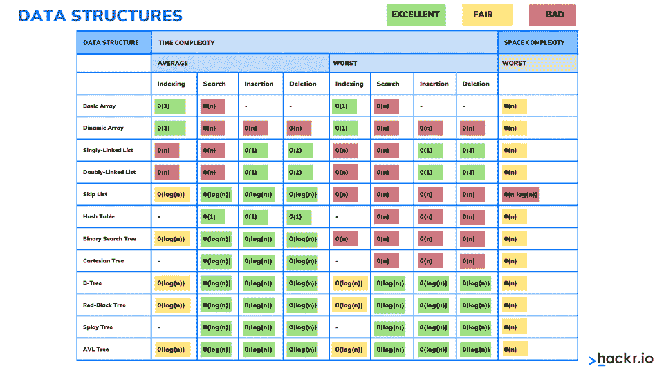

# 大 O 符号算法复杂性备忘单

> 原文：<https://hackr.io/blog/big-o-notation-cheat-sheet>

程序员使用大 O 符号来分析算法的时间和空间复杂性。这种符号衡量任何算法的上限性能。要了解这个符号的一切，请继续阅读这个大备忘单。

在创建代码时，您选择什么样的算法和数据结构很重要。大 O 符号帮助您比较各种算法的性能，并为您的代码类型找到正确的算法。

今天，在[复杂应用](https://hackr.io/blog/top-data-science-applications)和软件的现代世界中，在不同的环境中表现良好是必要的。为此，您需要在执行底层代码时没有任何延迟地优化您的代码。每当你得到大 O 符号的结果，你将能够检查你是否比你的竞争对手有更低的运行时间。

因此，程序员有必要检查他们的代码，并对其进行彻底的分析。这个**大 O 记法备忘单**(时间复杂度备忘单或者数据结构备忘单)会帮助你理解各种复杂度。

## **大 O 小抄**

这个大 O 备忘单旨在为您提供大 O 符号的基础知识。首先，我们将简要讨论大 O 符号到底是什么。此外，我们将查看各种时间和空间图表和各种算法的图形。

### **什么是大 O 记数法？**

[大 O 符号](https://en.wikipedia.org/wiki/Big_O_notation#:~:text=Big%20O%20notation%20is%20a,a%20particular%20value%20or%20infinity.)指的是计算机科学中应用于分析算法复杂性的数学函数。它定义了执行一个算法所需的运行时间，但是它不会告诉你你的算法的运行时间有多快。相反，它将帮助您确定算法的性能将如何随输入大小而变化。

根据形式定义，我们可以将 O(g(n))定义为一个函数集，并将函数 f(n)定义为该集合的成员，前提是该函数满足以下条件:

0 ≤ f(n) ≤ cg(n)0 ≤ f(n) ≤ cg(n)

如果一个算法对一个大小为 n 的数组中的每一项进行计算，该算法运行时间为 O(n ),对每一项执行 O(1)次工作。

### **什么是空间和时间复杂性？**

算法的时间复杂度将算法执行所需的总时间指定为输入长度的函数。同样，算法的空间复杂度将算法执行所占用的空间或内存总量指定为输入长度的函数。

空间和时间复杂性取决于各种因素，例如底层硬件、操作系统、CPU、处理器等。然而，当我们分析算法的性能时，这些因素都没有被考虑。

以下是一些复杂性:

*   常数:O(1)
*   线性时间:O(n)
*   对数时间:O(n log n)
*   二次时间:O(n^2)
*   指数时间:2 ^{polyn}
*   阶乘时间:O(n！)
*   多项式时间:2^{O(log n)}

**推荐课程**

[时空复杂度分析(big-O 表示法)](https://click.linksynergy.com/deeplink?id=jU79Zysihs4&mid=39197&murl=https%3A%2F%2Fwww.udemy.com%2Fcourse%2Fcomplexity-analysis%2F)

### **什么是大 O 图？**

它是一种渐近符号，允许您根据给定的输入来表达算法的性能或算法的复杂性。Big O 有助于程序员理解最坏的情况以及算法所需的执行时间和内存。大 O 复杂度可以用下图来理解。这个图也被称为**大 O 图**或**大 O 图**。



以下是对不同类型复杂性的详细解释，并附有示例:

当对输入大小 n 没有依赖性时，算法具有阶为 O(1)的常数时间。如果没有依赖性，运行时间将始终保持不变。

例如:

```
void printFirstElementOfArray(int arr[])

{

printf("First element of array = %d",arr[0]);

}
```

上面的代码将在其输入的 O(1)时间内运行。无论上面的数组有一个项目还是 100 个项目，该函数都只需要一个执行步骤。因此，该函数处于阶为 O (1)的常数时间下。

当运行时间随给定输入长度线性增加时，算法将具有线性时间复杂度。当函数检查输入数据中的所有值时，这种类型的函数具有 O(n)阶的时间复杂度。

例如:

```
void printAllElementOfArray(int arr[], int size)

{

for (int i = 0; i < size; i++)

{

printf("%d\n", arr[i]);

}

}
```

上面提到的函数将在 O(n)时间(或“线性时间”)内运行，其中 n 指定数组中的项数。假设给定的数组有十项；该功能将打印十次。如果项目数量增加，该函数将花费同样多的时间来打印。

当输入数据的大小在每一步中减少时，算法将具有对数时间复杂度。这意味着操作的数量与输入的大小不同。操作次数会随着输入大小的增加而减少。

具有对数时间复杂度的算法的一些例子是二叉树或二分搜索法函数。它将包括通过将数组一分为二来搜索数组中的给定值，并在一次分割中开始搜索，确保不会对数据的每个元素都进行操作。

```
void printAllElementOfArray(int arr[], int size)

{

for (int i = 0; i < size; i++)

{

printf("%d\n", arr[i]);

}

}
```

在上面的例子中，我们嵌套了两个循环。如果数组有 n 个元素，外循环将运行 n 次，内循环将为外循环的每次迭代运行 n 次，这将给出总共 n2 个打印。如果数组有十个项目，十个项目将打印 100 次。因此，该函数将在 O(n^2 时间运行。

```
int fibonacci(int num)

{

if (num <= 1) return num;

return fibonacci(num - 2) + fibonacci(num - 1);

}
```

上面的例子是斐波那契数的递归计算。O(2^n)指定了一种算法，在该算法中，每次添加输入数据集时，增长都会翻倍。O(2n)函数的增长曲线是指数型的，开始时很浅，然后迅速上升。

每当你计算任何算法的大 O 复杂度时，你可以抛弃常数。

例如:

```
void printAllItemsTwice(int arr[], int size)

{

for (int i = 0; i < size; i++)

{

printf("%d\n", arr[i]);

}

for (int i = 0; i < size; i++)

{

printf("%d\n", arr[i]);

}

}
```

这就是 O(2n)，我们只是称之为 O(n)。

```
void printHi100Times(int arr[], int size)

{

printf("First element of array = %d\n",arr[0]);

for (int i = 0; i < size/2; i++)

{

printf("%d\n", arr[i]);

}

for (int i = 0; i < 100; i++)

{

printf("Hi\n");

}

}
```

这是 O(1 + n/2 + 100)，我们只是称之为 O(n)。

当 n 变得任意大时，我们只寻找大 O 符号。随着 n 变大，加 100 或除以 2 显著减少。

### **算法复杂度图**

没有得到算法复杂性的概念，你就无法理解算法和数据结构的效率的概念。

算法复杂度是一种度量标准，它根据输入数据的大小来计算算法所执行的运算的次数。

当我们考虑复杂性时，我们说的是操作计数的顺序，而不是它们的精确计数。简而言之，复杂度表示执行一个算法的近似步骤数。

**大 O 算法**复杂度通常用 O(f)符号表示，也称为渐近符号，其中 f 是取决于输入数据大小的函数。渐近计算复杂度 O(f)衡量消耗资源(CPU 时间、内存等)的顺序。)由特定算法表示为输入数据大小函数。

复杂度可以是常数、对数、线性、n*log(n)、二次、三次、指数等。

| **排序算法** | **空间复杂度** | **时间复杂度** | 最坏情况 | 最佳情况 |
| 平均案例 | 最坏情况 | 插入排序 | O(1) | O(n) |
| O(n2) | O(n2) | 选择排序 | O(1) | O(n2) |
| O(n2) | O(n2) | 平滑排序 | O(1) | O(n) |
| O(n log n) | O(n log n) | 冒泡排序 | O(1) | O(n) |
| O(n2) | O(n2) | 外壳分类 | O(1) | O(n) |
| O(n log n2) | O(n log n2) | 合并排序 | O(n) | O(n log n) |
| O(n log n) | O(n log n) | 快速排序 | O(对数 n) | O(n log n) |
| O(n log n) | O(n log n) | 堆排序 | O(1) | O(n log n) |
| O(n log n) | O(n log n) |  **** | **典型算法复杂性** | 下表将解释不同类型的算法复杂性: |

### **复杂度**

### **运行时间**

**描述**

| 常数 | O(1) | 执行一个给定的操作需要恒定数量的步骤(例如，2、4、6 或其他数量)，与输入数据的大小无关。 |
| 对数的 | O(log(N)) | 对 N 个元素执行给定的运算需要 log(N)步，对数底为 2。例如，如果 N = 1，000，000，复杂度为 O(log(N))的算法将执行大约 20 个步骤。 |
| 线性的 | O(N) | 对 N 个元素进行操作需要的步骤数几乎与元素数相同。例如，如果你有 1000 个元素，它将需要大约 1000 个步骤。 |
| O(n*log(n)) | 对 N 个元素执行给定操作需要 N*log(N)步。例如，如果你有 1000 个元素，它将需要大约 10000 个步骤。 | 二次的 |
| 氧气(氮气) | 它需要 N2 数个步骤，其中 N 指定执行给定操作的输入数据大小。例如，如果 N = 100，大约需要 10000 步。 |
| 立方体的 | O(n3) | 它采用 N3 步骤的顺序，其中 N 指定对 N 个元素执行操作的输入数据大小。例如，如果 N 是 100 个元素，大约需要 1，000，000 步。 |
| **基本数据结构的比较** | 既然您已经理解了术语“算法复杂性”的概念，我们将看看基本数据结构之间的比较，以便在执行基本操作(如添加、搜索、删除和按索引访问)时估计每个数据结构的复杂性。 | 通过这种方式，我们可以很容易地分析我们想要执行的操作，并理解哪种结构是合适的。在基本数据结构上执行基本操作的复杂性可以在下表中看到。 |

### **数据结构**

**加法**

**搜索**

| **删除** | **按索引访问** | 数组(T[]) | O(N) | O(N) |
| O(N) | O(1) | 链表(LinkedList <t>)</t> | O(1) | O(N) |
| O(N) | O(N) | 动态数组(列表<t>)</t> | O(1) | O(N) |
| O(N) | O(1) | 堆栈(堆栈 | O(1) | - |
| O(1) | - | 队列(队列 | O(1) | - |
| O(1) | - | 字典，用散列表实现(字典<k t="">)</k> | O(1) | O(1) |
| O(1) | - | 字典，用平衡搜索树实现(SortedDictionary <k t="">)</k> | O(log(N)) | O(log(N)) |
| O(log(N)) | - | Set，用散列表(HashSet <t>)实现</t> | O(1) | O(1) |
| O(1) | - | set，用平衡搜索树实现(SortedSet <t>)</t> | O(log(N)) | O(log(N)) |
| O(log(N)) | - | **** | **大 O 符号汇总表** | **增长率** |

### **名称**

### **描述**

### 一

| 常数 | 语句(一行代码) | 对数 |
| 对数的 | 分成两半(二分搜索法) | n |
| 线性的 | 环 | n*log(n) |
| 线性数学 | 有效的排序算法 | n^2 |
| 二次的 | 双环路 | n^3 |
| 立方体的 | 三圈 | 2^n |
| 指数的 | 穷举搜索 | **结论** |
| 这里我们到达了大 O 小抄的末尾。在这个被先进技术包围的现代世界，创建复杂的软件需要冗长的代码来处理。但是为了提高性能并减少软件执行任何任务所需的时间，必须对代码进行优化。只有通过实现合适的数组和数据结构代码才有可能。 | 程序员需要通过使用不同大小的不同数据来分析代码的复杂性，并确定完成任务需要多长时间。如果时间和空间的复杂度很高，你可以修改你的代码并再次测试它的复杂度。大 O 符号是用于分析算法复杂性的函数。你可以通过这个大 O 小抄来更好的理解。 | 有兴趣了解更多关于数据结构的知识，包括更高级的数据科学项目吗？尝试 [ProjectPro](https://click.linksynergy.com/fs-bin/click?id=jU79Zysihs4&offerid=1038112.3&type=3&subid=0) 在你工作的地方实现大数据。他们提供数据科学项目，并安排与专家的实时互动会议。或者，当你想提升自己的技能时，这些[数据营课程](https://datacamp.pxf.io/DVGE65)会提供更多深入的话题。 |

## **常见问题解答**

### **如何轻松算出大 O？**

**如何轻松算出大 O？**

计算大 O，首先需要考虑进行了多少次运算。

## 以下是简单的步骤:

*   将你的算法分解成几个操作

将每个操作中的大 O 相加

去掉常数

*   找到最高阶项
*   例如:将两个数相加
*   对于 total = nums[0] + nums[1]，正在执行三个操作，每个操作具有 O(1)常数时间复杂度。nums[0]–这是一个查找。o(1)
    nums[1]–这是一个查找。o(1)
    total = nums[0]+nums[1]–这是一个赋值。O(1)
*   然后我们返回总数，这是另一个 O(1)运算。
*   ### **假人的大 O 记数法是什么？**

假人的大 O 符号是什么？

```
def add_nums(nums):

total = nums[0] + nums[1] # O(1) - Constant

 return total # O(1) - Constant

add_nums([1, 2, 3])
```

大 O 符号，也称为时间复杂度，意味着算法运行所需的时间。它表示随着数据的增长，特定算法会运行多长时间。

### **最快的 O 符号是什么？**

*   **最快的 O 符号是什么？**

### **计算 Big-O 的两条规则是什么？**

*   **计算 Big-O 的两个规则是什么？**

放下常数

*   去掉不重要的术语

**什么是大 O 型圈？**

*   while 循环的大 O 取决于你如何运行它:
*   int I = 1；while(I < n)i++；// O(n)

*   int I = 1；而(I < n)I * = 2；// O (log2( n))

The Big O of a while loop depends on how you run it:

int i = 1; while ( i < n ) i ++; // O(n)

int i = 1; while ( i < n ) i *= 2; // O (log2( n) )

int i = 1; while ( i < n) { int j = 0; while ( j < n ) j ++; } // O( n * n )