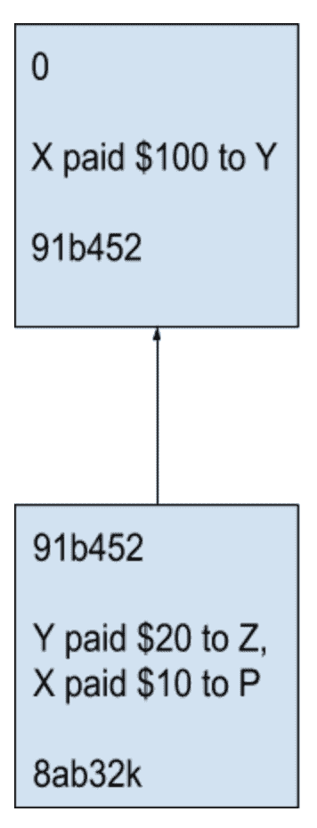

# 2023 区块链编程初学者指南(附代码)

> 原文：<https://hackr.io/blog/blockchain-programming-beginners-guide>

## **什么是区块链技术？**

传统上，一直有中间人控制着数据。例如，脸书是用户和广告商之间的中间人。银行是借贷双方的中间人。

这里的问题是，这些数据是由一个中央机构——脸书和银行——控制的。因此，他们控制着价格，也在技术上拥有数据。在这种情况下，所有的权力都掌握在一个中间人手中，用户必须信任他们保持道德，并继续考虑用户的利益。发明区块链是为了让数据去中心化，让与任何中心化的一方的信任最小化。

为了更好地理解它，让我们来谈谈激流。在 torrents 中，没有一个文件是属于一个人的。这是一种“对等”体系结构，其中文件的多个副本存在于多个工作站/用户处。因此，没有一个人控制该文件。这种体系结构具有高度的可伸缩性和容错性，因为没有单点故障。

区块链本质上借用了同样的思想:如果数据库可以去中心化会怎么样。这解决了很多问题:

*   可以直接连接借款人，不需要银行这样的中间人。你会获得更多的利润。
*   你可以直接联系广告商，告诉他们你喜欢的广告类型，而不需要通过脸书。

区块链的一个众所周知的用例是加密货币，这是一种不受任何中央机构控制的数字货币。同样，我们可以将区块链用于智能数字合同，其中没有中间人来验证合同。

我们已经为区块链的几个应用和用例写了一篇深入的文章:[https://hackr . io/blog/applications-and-use-cases-of-区块链](https://hackr.io/blog/applications-and-use-cases-of-blockchains)

## **区块链编程基础知识**

为了深入理解区块链，让我们先来谈谈数字签名或哈希的概念。

数字签名基本上是一个将字符串作为输入并返回固定大小的字母数字字符串的函数。输出字符串被称为[数字签名](https://bisontrails.co/digital-signatures/)或输入消息的散列。这里要注意的重要一点是，我们用来获得数字签名的函数是“不可逆的”,因为给定一个输入字符串，它可以计算散列。然而，给定散列，实际上不可能计算输入字符串。此外，实际上也不可能找到具有相同散列的两个值。

```
hash1 = Hash(input1)
hash2 = Hash(input2)
```

在这里，我们主要想说的是:

*   从输入 1 计算 hash1 和从输入 2 计算 hash2 很容易。
*   给定 hash1 的值，实际上不可能计算出 input1。对于 input2 和 hash2 也是如此。
*   几乎不可能找到不同的 input1 和 input2，使得 hash1 = hash2。

这种散列函数是密码学家经过多年研究后精心设计的。大多数编程语言都有内置的库函数来计算特定输入字符串的散列值。

[区块链 A-Z:了解如何构建您的第一个区块链](https://click.linksynergy.com/fs-bin/click?id=jU79Zysihs4&offerid=1045023.20080&type=3&subid=0)

**我们为什么要讨论哈希函数？**

嗯，区块链作为一个概念，很大程度上依赖于哈希。其思想是，在区块链中，我们有一个有序的区块链，每个区块包含以下信息:

*   前一个块的哈希。
*   交易记录列表。
*   自身的散列。

让我们举一个例子。考虑下面这个简单的块:[0，" X 付给 Y 100 美元"，91b452]。

这里，由于这是区块链的第一块，所以前一块的 Hash 为 0。交易列表仅包含 1 笔交易——X 向 y 支付了$100。其本身的散列值通过以下方式计算:

哈希本身=哈希(事务列表，前一个块的哈希)

基本上，我们将事务列表和前一个块的散列组合成一个输入字符串，并将其提供给散列函数以获得 hash _ itself 值。

前一个块的散列为 0 的这种块被称为通用块。创世纪区块基本上是区块链中的第一个区块。

现在，假设我们想在这个区块链中添加更多的区块。让我们有 block1 = [91b452，" Y 向 Z 支付了 20 美元，X 向 P 支付了 10 美元"，8ab32k]。

在这里，91b452 不过是前一个块(创世纪块)的散列。有两个交易:

*   y 付给 Z 20 美元
*   x 付给 P 10 美元

最后，我们有 hash _ itself 值，它基本上是 Hash(“Y 向 Z 支付了 20 美元，X 向 P 支付了 10 美元”，91b452)。这竟然是 8ab32k。

用象形图表示，我们的区块链如下所示:



**W** **这个“数据结构”有什么特别的？**

这个想法是，如果假设有人要破坏区块链，比如说改变创世纪区块中的交易——将“X 向 Y 支付了 100 美元”改为“Y 向 X 支付了 100 美元”，这将改变 91b452 的哈希值。因此，block1 中的这个哈希值将会不匹配(记住，每个块的第一个值是其父块的哈希值)。结果，该链变得无效。这实际上适用于区块链中的每个区块，因为只要我们修改一个区块，所有后续区块的哈希都会变得无效，因此，链会崩溃。因此，区块链提供了高水平的数据安全性。

## **区块链编程代码示例**

从上面的区块链图片中，很明显我们可以用几乎任何编程语言对它进行编码。例如，上述概念可以用 C++、Python、Java 甚至 JavaScript 来实现。让我们来看一个示例 Python 代码:

现在假设，如果我们要破坏创世区块

输出如下所示:

这里，genesis_block_hash 和 block1_parent_hash 的值明显不同，而它们在正确的区块链中实际上应该是相同的。结果现在区块链已经腐败了。

## **总结**

把区块链想象成一种分布式的安全数据结构，可以用在**没有**中间人参与的地方。区块链的去中心化性质有助于消除中间人，它来自区块链的上述不变性。这是一种有趣的数据结构，正如我们所见，加密货币是它的现实实现。

PS:找区块链教程？下面是编程社区推荐的最好的[区块链教程](https://hackr.io/tutorials/learn-blockchain-programming?ref=blog)。

**推荐课程**

[](https://imp.i384100.net/c/2890636/1242836/14726?prodsku=spzn%3AokkMhcTiEemTMg57eQs_yg&u=https%3A%2F%2Fwww.coursera.org%2Fspecializations%2Fuci-blockchain&intsrc=PUI2_9419)

### **人也在读:**