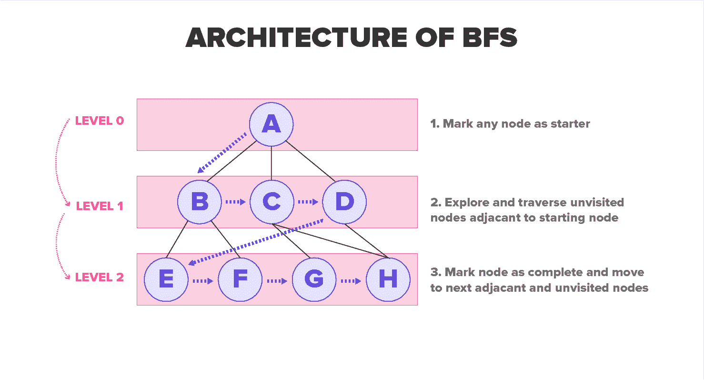
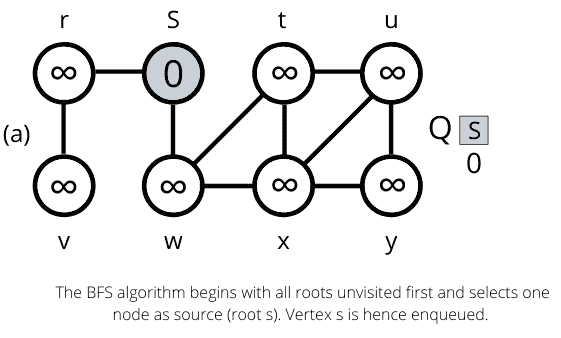
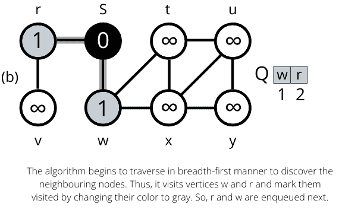
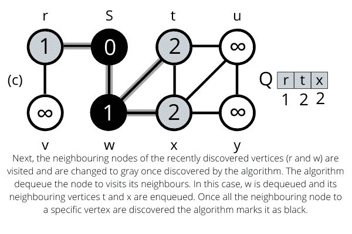
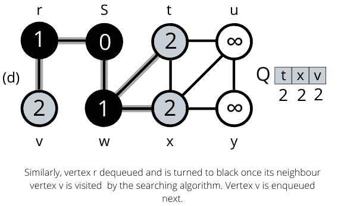
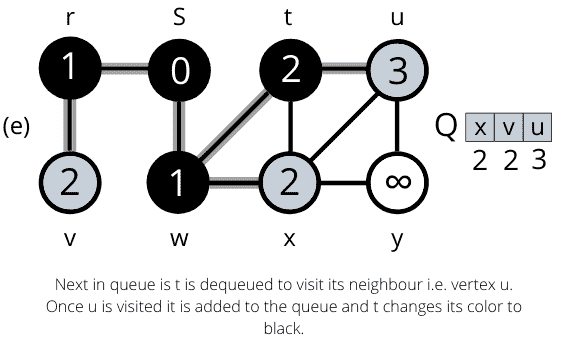
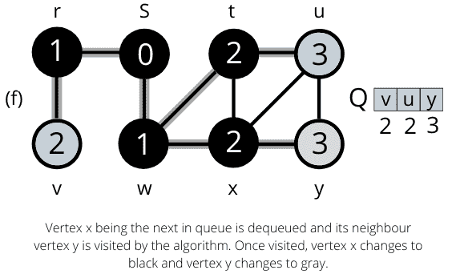
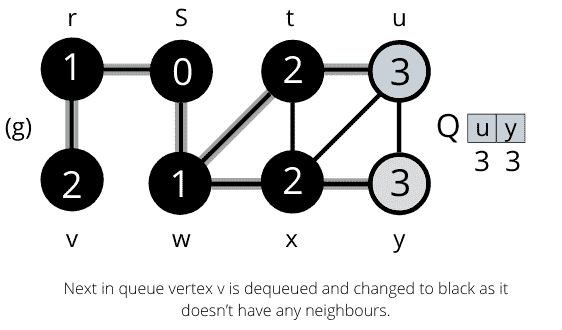
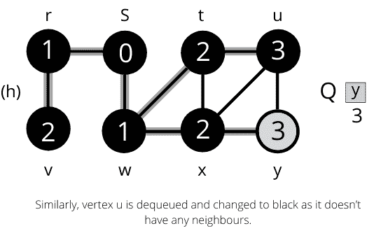
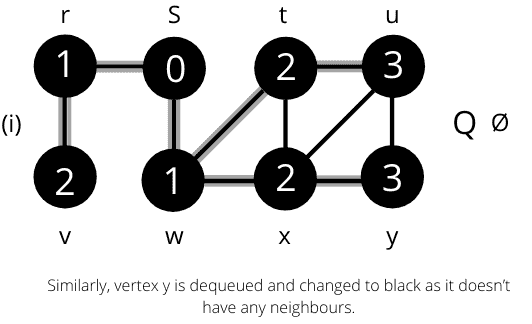

# 广度优先搜索算法[BFS]及实例

> 原文：<https://hackr.io/blog/breadth-first-search-algorithm>

## 什么是图算法？

图是使用节点(顶点)和边 G = *(V，E)* 来表示连通性的抽象方式。图节点从 1 到 n 被标记，m 条边连接成对的节点。这些边可以是单向的，也可以是双向的。图算法已经公式化并解决了许多问题，例如最短路径、网络流问题、图着色问题等等。图 G = *(V，E)* 的表示有两种标准方式，即邻接矩阵和邻接表。一些特别流行的图表类型有:

*   树:一个非循环图，
*   有向无环图，
*   二分图:节点被分成两组，S 和 T，这样边只存在于 S 和 T 之间(S 或 T 内没有边)。

使用两种流行的遍历算法深度优先搜索和广度优先搜索算法来遍历该图。在本文中，我们将详细研究广度优先搜索算法。

## 什么是广度优先搜索算法？

广度优先搜索是一种简单的图遍历算法，用于搜索整个图。考虑一个图 G = *(V，E)* 和一个源顶点 S，广度优先搜索算法探索图 G 的边以“发现”从 S 可达的每个顶点 V。该算法负责计算从源 S 到每个可达顶点 V 的距离。该算法适用于无向图和有向图。

***最短路径:*** 它定义为包含最少边数的图 G 中从源 S 到顶点 V 的路径。



# 该算法

广度优先搜索之所以如此命名，是因为它在整个树上均匀地划分已发现和未发现的顶点。该算法在发现 k +1 距离处的任何更多顶点之前，发现距离 s 为 k 的所有顶点。广度优先搜索将每个顶点涂成灰色、白色或黑色，以跟踪所有顶点并区分它们。一个顶点是白色的，直到它在搜索过程中被算法访问，然后变成非白色。灰色和黑色的顶点表示它们已经被发现，但是广度优先搜索给了它们不同的颜色来以广度优先的方式移动。如果(u，v) E 和顶点 u 是黑色的，那么顶点 v 要么是灰色的，要么是黑色的，这意味着如果一个顶点是黑色的，那么与其相邻的所有顶点都已经被发现了。

灰色顶点可能有一些相邻的白色顶点。它们代表了未发现顶点和已发现顶点之间的边界。它首先创建仅包含根或源顶点 s 的树。每当该算法在扫描已经发现的顶点 u 的邻接表时遇到白色顶点 v，则顶点 v 和边(u，v)被添加到树中。这样，在广度优先树中，u 被称为 v 的前身或父代。BFS 树中的祖先和后代的这种关系是相对于根来定义的；如果顶点 u 在树中从 S 到 v 的路径上，那么 u 是 v 的祖先，v 是 u 的后代。

该算法的伪代码如下:

```
*BFS(G,s)*
*1 for each vertex u **G, V -* 
*2 **u.color = WHITE*
*3 **u.d = ∞*
*4 **u.**?* *= NIL*
*5 s.color = GRAY*
*6 s.d = 0*
*7 s.**?**= NIL*
*8 Q = ∅*
*9 ENQUEUE (Q,s)*
*10   while Q = ∅*
*11 **u = DEQUEUE*
*12 **for each v ** G. Adj[u]*
*13 **if v.color == WHITE*
*14 **v.color = GRAY*
*15 **v.d = u.d + 1*
*16 **v.**?* *= u*
*17 **ENQUEUE (Q, v)*
*18 **u.color = BLACK*
```

### 广度优先搜索算法的工作示例

无向图上的 BFS 运算。树的边缘显示为阴影，因为它们是由 BFS 制作的。u.d 的值出现在每个顶点 u 内。队列 Q 显示在 while 循环的每次迭代的开始处。顶点距离显示在队列中顶点的下方。

一旦访问了所有节点，该算法就计算出根节点 s 与其链接节点之间的最短路径。`

### BFS 的复杂性分析

让我们知道考虑在输入图上分析 BFS 算法的运行时间 *G= (V，E)* 。初始化后，广度优先搜索从不白化顶点，从而确保每个顶点最多入队和出列一次。每个入队和出队操作花费的时间是 O(1)，因此用于队列操作的总时间是 O(V)。该算法最多扫描一次每个顶点的邻接表，当该顶点出队时。所有邻接表的长度之和等于多少？ **(** E)，扫描邻接表的时间为 O(E)。初始化的开销被计算为 O(V ),因此 BFS 算法的总运行时间复杂度为 O (V + E)。

因此，该算法的运行时间与图 g 的邻接表表示的大小成线性关系。

**建议课程**

[Java 中的高级算法(图形算法)](https://click.linksynergy.com/deeplink?id=jU79Zysihs4&mid=39197&murl=https%3A%2F%2Fwww.udemy.com%2Fcourse%2Fadvanced-algorithms-in-java%2F)

### 为什么我们需要 BFS 算法？

当在任何数据集中搜索数据时，BFS 算法提供了几个可以使用的理由。它为我们提供了相当多的方面，使我们认为它是一个有效的算法。一些受欢迎的方面是:

*   这对于分析图中的节点和构造最短路径遍历是有用的。
*   该算法以最少的迭代次数遍历给定的图。
*   该算法的结构是健壮的。
*   BFS 算法的结果为我们提供了最高水平的准确性。
*   该算法的迭代是无缝的，因此不会陷入无限循环问题。

### BFS 算法的规则

下面列出了使用 BFS 算法的规则:

*   它使用队列数据结构(FIFO)
*   图中的任何节点都被标记为开始遍历的根。
*   在遍历所有节点时，它会不断删除图中的节点。
*   该算法访问相邻的未访问节点，并保持它们插入队列。
*   如果没有找到相邻的顶点，它从队列中删除前一个顶点。
*   BFS 算法不断迭代，直到所有的顶点都被访问或遍历并标记为完成。
*   在从任何节点遍历数据的过程中，该算法不会导致任何循环。

### 广度优先搜索算法的应用

下面列出了 BFS 算法实现的一些实际应用:

*   **无权重图:**使用 BFS 算法可以在最短的时间内轻松创建图中最短路径和访问所有顶点的最小生成树，并且精度很高。
*   **P2P 网络:**实现该算法是为了更快地找到所需的数据，因为它在对等网络中定位所有最近的和邻近的节点。
*   **网络爬虫:**算法为搜索引擎和网络爬虫建立多级索引。BFS 实现从作为源的网页开始，然后访问作为节点的所有链接。
*   **导航系统:**可以使用 BFS 算法从主位置或源位置检测邻近位置。
*   **网络广播:**使用 BFS 算法引导并跟踪广播的数据包，以搜索并到达所有寻址的节点。

## 摘要

这就是简单的图遍历算法，广度优先搜索算法。总之，图的遍历需要算法访问、检查和更新(如果需要)树状结构中所有未访问的节点。众所周知，BFS 算法用于分析图中的节点并寻找最短的遍历路径。BFS 是一种复杂度为 O(V + E)的高效算法，其图遍历在尽可能短的时间内包含较少的迭代次数，不会陷入无限循环。该算法因其稳健的特性而被用于多种现实应用中，如[网络爬虫](https://en.wikipedia.org/wiki/Web_crawler)、P2P 网络。你有没有注意到任何你认为是 BFS 算法在背后起作用的应用？请在下面的评论中与我们分享。

**人也在读:**