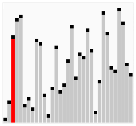

# C-[程序和算法]中的冒泡排序分步解释

> 原文：<https://hackr.io/blog/bubble-sort-in-c>

数据排序是计算机科学中最基本也是最重要的问题之一。对于那些想学习数据结构和算法的人来说，排序是一个很好的案例研究。

## **什么是排序定义**

在现实生活中，我们经常被要求按照特定的顺序排列数据。例如，在我们上学的时候，我们被告知要根据身高排队。另一个例子是学校/学院的出勤登记，其中包含按字母顺序排列的我们的名字。

这些数据安排使得将来使用数据更加容易。在 100 名学生的考勤记录中找到“乔”。按特定顺序排列数据称为按该顺序对数据进行排序。2 最常用的订单有:

*   **升序:** 在按升序排列数据时，我们试图以某种方式排列数据，使每个元素在某种程度上“小于”它的后继元素。这种“小于”关系是从其获取数据的集合上的有序关系。举个简单的例子，数字 1，2，3，4，5 是按升序排列的。在这里，“小于”关系实际上是“<”运算符。可以看出，1 < 2 < 3 < 4 < 5。
*   **降序:** 降序与升序正好相反。给定一个按升序排序的数据，反转它，你将得到按降序排序的数据。

由于两个订单的性质相似，我们通常会删除实际订单，并说我们希望对数据进行排序。这通常意味着我们希望数据按照升序排序。在我们进入排序算法的细节之前，让我们先了解一下问题陈述。

## **问题陈述**

我们得到了一组数据。我们还可以对数据中的元素进行“排序”。现在，我们被要求按照给定的顺序排列数据。 举个例子，给我们一个整数数组:[5，1，4，2，3]。我们得到的“顺序”是“小于”。因此，我们被要求以这样一种方式排列这个数组的元素，使得每个元素都比它的后继元素小。基本上，我们需要找到一种方法来对这个数组进行排序，以便最终获得的数组是[1，2，3，4，5]。 有几种技术/算法可以实现这种有序的输出数组。我们将在本博客中讨论的一个著名技术叫做冒泡排序。

## **C 语言中的冒泡排序算法简介**

C 中的冒泡排序是一种排序算法，我们在数组中反复迭代，并交换相邻的无序元素。 我们重复这个过程，直到数组排序完毕。

作为一个例子，对于上面提到的数组- [5，1，4，2，3]我们可以看到 5 不应该在 1 的左边，因此，我们交换它们得到:[1，5，4，2，3]。 接下来，我们看到 5 应该又不在 4 的左边。我们交换 5 和 4 得到[1，4，5，2，3]。我们对 5 和 2 重复这个过程，然后对 5 和 3 重复这个过程，得到[1，4，2，3，5]。

可以看出，在阵列上“经过”一次后，最大的元素(本例中为 5 个)已经到达其正确的位置——最右边。让我们试着重复这个过程。

(1，4)正确。然而，(4，2)是不正确的顺序。因此，我们交换 4 和 2 得到[1，2，4，3，5]。(4，3)也是不正确的，所以我们再交换一次，得到[1，2，3，4，5]。

*可以看出，数组是排序的！*

这正是 C 语言中冒泡排序的工作方式。

例如，请看这幅图片，它形象地描述了冒泡排序的工作原理。 

**建议课程**

**[掌握编码面试:数据结构+算法](https://click.linksynergy.com/deeplink?id=jU79Zysihs4&mid=39197&murl=https%3A%2F%2Fwww.udemy.com%2Fcourse%2Fmaster-the-coding-interview-data-structures-algorithms%2F)**

## **冒泡排序-解释**

在第一次“通过”数组时，最大的元素总是被交换，直到它被放在最右边。这是因为这个最大的元素总是会打破期望的顺序。因此，在第一遍结束时，最大的元素将始终到达其正确的位置。

现在，最大的元素已经到达了它的正确位置(例如，5 到达了最后一个位置)，我们可以简单地忽略它，并专注于数组的其余部分(在上面的例子中是[1，4，2，3])。这里，数组剩余部分中最大的元素(4)将是数组中第二大的元素。通过上面的递归参数，这个第二大的数组将到达剩余数组的最后一个位置([1，2，3，4])。这只不过是对剩余数组的递归自变量。

这一直持续到 n 次迭代，其中 n =数组中元素的数量。最后，数组被排序。

```
#include <stdio.h>
void bubble_sort(int a[], int n) {
 int i = 0, j = 0, tmp;
 for (i = 0; i < n; i++) {   // loop n times - 1 per element
 for (j = 0; j < n - i - 1; j++) { // last i elements are sorted already
 if (a[j] > a[j + 1]) {  // swop if order is broken
 tmp = a[j];
 a[j] = a[j + 1];
 a[j + 1] = tmp;
 }
 }
 }
}
int main() {
 int a[100], n, i, d, swap;
 printf("Enter number of elements in the array:\n");
  scanf("%d", &n); 
 printf("Enter %d integers\n", n);
 for (i = 0; i < n; i++)
 scanf("%d", &a[i]);
 bubble_sort(a, n);
 printf("Printing the sorted array:\n");
 for (i = 0; i < n; i++)
 printf("%d\n", a[i]);
 return 0;
}
```

## **C 语言中的冒泡排序程序**

我们循环 n 次——对数组的每个元素循环一次。当 i = 0 时，通过 j 循环，数组的最大元素到达正确位置。当 i = 1 时，通过 j 循环，数组的第二大元素到达正确位置。如此等等。

## **结论**

冒泡排序是一个相当简单的算法。这是一个有趣的例子，说明简单的计算可以用来完成更复杂的任务。然而，该算法有一个问题——与其他排序算法相比，它相对较慢。为了理解这一点，让我们看一下相关的循环——有两个循环:

*   首先，从 i = 0 到 i = n - 1 的变量 i 的外循环。
*   对于外 i 循环的每次迭代，变量 j 的内循环从 j = 0 到 j = n - i - 2 。

我们可以合并迭代次数来看:

*   当 i = 0 时，内 j 循环从 j = 0 到 j = n - 2
*   当 i = 1 时，内 j 循环从 j = 0 到 j = n - 3
*   当 i = 2 时，内 j 循环从 j = 0 到 j = n - 4
*   当 i = n - 2 时，内 j 循环从 j = 0 到 j = 0

我们可以把这个加起来看，总迭代次数是(n-2)+(n-3)+(n-4)…+1+0 =(n-2)*(n-3)/2 =(n²-5n+6)/2 = n²/2-2.5n+3可以看出 这一项正比于 n²(n 的最大幂是 n²)。 数学上，这被表述为-冒泡排序算法的复杂度为 O(n²)。这还不是最好的，因为当 n 很大时(比如 n = 10 6 )，n²是巨大的(n²= 1012)。因此，算法需要大量的迭代才能完成。这是不可取的。还有一些比较好的算法像 C 中的[归并排序](https://hackr.io/blog/merge-sort-in-c)等，需要 O(nlog[2]n)次迭代。logn 比 n 小很多，举个例子，当 n = 2 30 (也就是大约 10 9 ，log[2]n 正好是 30)。尽管如此，冒泡排序是一个有趣的算法，也是初学者理解排序如何工作的一个好方法。

**人也在读:**