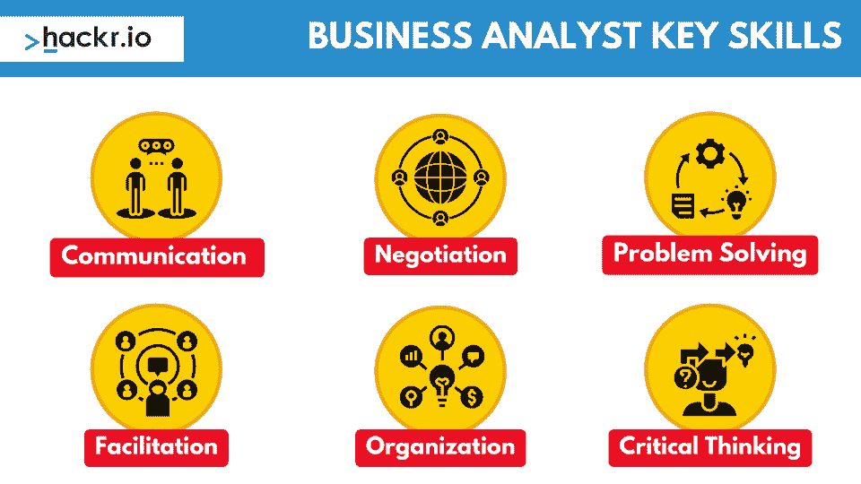
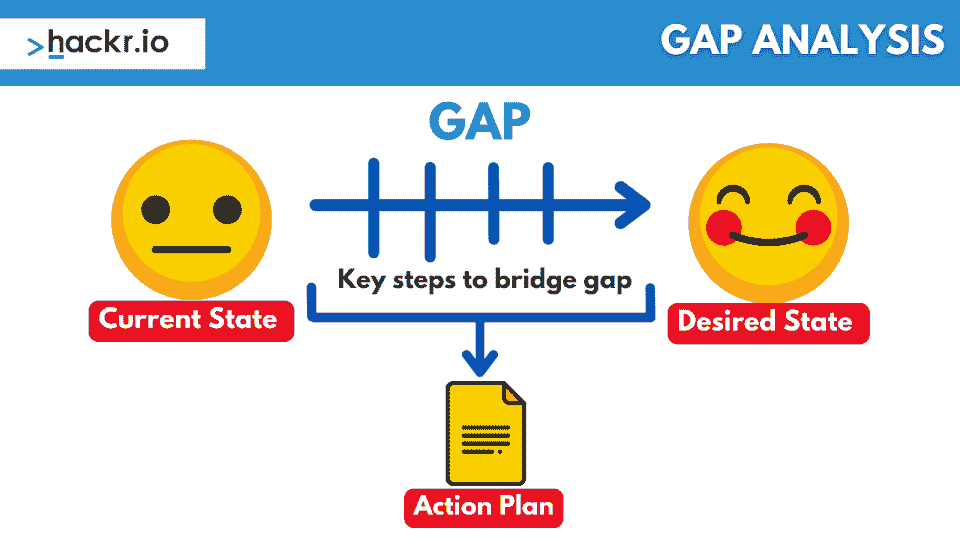

# 前 30 名商业分析师面试问答(2023)

> 原文：<https://hackr.io/blog/business-analyst-interview-questions>

你在准备商业分析师面试吗？[数据分析](https://hackr.io/blog/what-is-data-analysis-methods-techniques-tools)，项目管理，组织——所有这些都有助于该角色。尽管 T2 的平均工资丰厚，工作相对稳定，但网上并不缺少商业分析师的招聘广告。商业分析师面试问题倾向于围绕你的技能，以及你的个人和职业经历。准备好用具体的例子回答任何商业分析师职位的面试问题。

这些面试问题深入挖掘了你在职业生涯中所取得的成就，你有过哪些经历，你使用过哪些工具。

底线？业务分析师面试不像技术面试那样“容易”。很少有客观“正确”的答案，因为有太多基于商业分析师场景的面试问题。但是，

因此，最好的准备方式是事先浏览常见的业务分析师面试问题和答案。

## **准备业务分析师面试问题**

熟能生巧。你有过舌尖上有问题的答案却无法完全说清楚的经历吗？每个人都会这样。即使你已经掌握了技能，你也需要信心来支持它们。

以下是商业分析师(培训中)最常见的一些面试问题，以及如何回答每个问题的建议。

## **基本业务分析师面试问题**

入门级业务分析师的面试问题比正常情况要轻一些。初级业务分析师应该对业务分析和项目管理技术有初步的了解。数据分析、绩效管理、日程安排、战略制定——他们还应该对自己的行业有深刻的理解，无论是营销还是工程。

许多商业分析师已经在他们的领域内工作过，但正在面试“毕业”进入咨询或管理职位。即使这些问题相当简单，你也应该尽可能详细地回答它们。要做到这一点，记住你在工作中遇到的具体情况。现在，让我们来看看 BA 面试问题列表吧！

### **1。你认为商业分析师是什么？**

业务分析师分析组织内的业务流程或系统，评估业务模型或其与技术的集成。

在回答这个问题时，你应该描述你认为一个商业分析师在公司中的更重要的角色——你觉得你对公司有什么好处？作为一个入门级的商业分析师，你带来了什么价值？

### **2。商业分析师的职责是什么？**

业务分析师的职责因公司而异，但通常包括进行研究、分析数据、记录流程和推荐业务问题的解决方案。

想想工作描述中概述的职责。列举你以前承担这些责任的时候。

### **3。商业分析师需要哪些技能？**

****

业务分析师必须具备的一些技能包括很强的分析和解决问题的能力，以及良好的沟通和组织能力。

描述你如何在日常生活和职业生涯中运用这些技能。你曾经因为出色的沟通或组织能力而受到称赞吗？提出来；如果是求职面试就不算吹牛了。

### **5。作为商业分析师，你做过什么？**

这是一个很难回答的宽泛问题。谈谈你做过的具体项目和你取得的成果。例如，你可以讲述一次你成功地发现了一个过程改进，从而提高了公司的效率或节约了成本。关注有形的、具体的改进，例如提高 ROI 或流程效率。

### **6。你与利益相关者合作的经验是什么？**

“利益相关者”是对项目的成功有个人利益的个人。考虑一下你与管理层紧密合作、实现客户期望、或超越并生产出符合期望的产品的时候。

利益相关者管理就是沟通、满足期望和管理关系。

### 7 .**。你如何优先处理和管理你时间上的竞争需求？**

时间管理是任何角色的一个重要方面。列举一些你用来管理竞争性需求的方法。一些很好的实践是开放与关键利益相关者的沟通渠道，或者利用技术，比如项目管理软件。

### **8。你如何评估一个项目的可行性？**

许多因素有助于项目的可行性。在最早的阶段，您应该确定所需的资源、时间表、潜在风险和投资回报。

### **9。告诉我你不得不协商一个困难要求的时候。**

你的老板有没有要求你在一个无法工作的时间框架内完成一个项目？你是怎么处理的？谈谈你不得不谈判的经历，你是否需要更多的时间、人员或资源。

作为中级业务分析师候选人，你应该至少有几个长期或短期项目。但这并不意味着你需要丰富的经验。你可以通过描述过去一两年职业生涯中使用的一些策略来回答这些问题。

### 10。你如何处理利益相关者的竞争需求？

管理利益相关者的竞争性需求可能很困难，但是一些策略可以帮助你处理这种情况。一种是根据项目目标对需求进行优先级排序。另一个是保持沟通的公开和透明，这样所有的涉众都知道项目的状态和他们自己的要求。有时候，利益相关者会自己解决问题。

利益相关者的需求因他们在项目中的投入程度、对项目的控制程度以及对结果的兴趣程度而异。一个利益相关者可能在一个项目上投入了很多，并且有很多控制权，但是在这个过程中是不感兴趣的。另一个利益相关者可能没有投入任何东西，可能有最小的控制权，但可能对这个过程非常感兴趣。学习如何优先考虑这些利益相关者以确保最佳质量的产品和服务是至关重要的。

### **11。你写业务需求文档的经验是什么？**

业务需求文档(brd)用于描述提议的系统或解决方案的特性和功能。作为一名业务分析师，您应该有编写清晰简洁的 brd 的经验，并且准确地捕捉到业务的需求。如果您以前从未这样做过，请查看一些模板来熟悉这种格式。

### **12。你能提供一个你写的复杂需求的例子吗？**

在你参加面试之前，练习从头到尾谈论几个样本项目，即使你没有直接参与其中。这些示例项目可能会给你一些“复杂需求”的例子，即使它们在现实世界中并没有出现。即使你还没有这方面的经验，示例项目也会提高你回答这类问题的能力。

### 13。你如何确保所有相关的涉众在整个项目过程中都被告知？

业务分析师的一个主要职责是让所有的涉众了解项目的进展。状态报告、会议纪要和按需召开的会议对这一过程至关重要。举一个让利益相关者了解最新情况的例子。你是否有居住在国外的股东？或者一个利益相关者表现出奇怪的冷漠？

### **14。你领导或参与需求评审的经验是什么？**

需求评审是业务分析师向一组涉众提出需求以获得反馈和批准的会议。作为中级业务分析师，你应该有主持或参加这类会议的经验。这可能包括向小组提出要求、促进讨论和回答问题。

但是你也需要深究为什么要问这些问题。通常，这是因为面试官想知道你可以防止项目经历范围蔓延，范围蔓延是指项目的工作变得比最初预期的要大得多。想一想你不得不推迟产品的必要需求的时候。

### 15。告诉我你不得不管理一个困难项目的时候。

项目可能很难管理，尤其是当有多个利益冲突的涉众时。作为一名业务分析师，您应该有管理这类冲突的经验。对自己的表现要诚实。如果有什么事情你现在认为你应该做得更好，解释它是什么，为什么。面试官想知道你能成功应对冲突，并思考自己在其中的角色。

### 16。你用什么方法评估商业风险？

有几种不同的方法可以用来评估商业风险。一种是创建风险登记簿，这是一个列出项目所有潜在风险的文档。另一种方法是使用风险管理工具，如清单或矩阵。你不需要为你的面试官准备一份完整的风险矩阵，简单描述一下你过去使用的方法就可以了。

### **17。你如何确定一个项目所需的努力？**

一种方法是创建工作分解结构(WBS ),将项目分解成更小的任务。另一种方法是使用评估技术，例如自底向上或自顶向下的评估。

这是另一个秘密:大多数公司都有内部的、独立的评估风险和决定所需努力的方法。他们想知道你过去做了什么，但他们可能会用一种全新的方法来训练你。你不需要深入描述你的评估技术，你只需要描述一些经验。

### 18。你能描述一下你创建和管理项目时间表的经历吗？

管理时间表是业务分析师的一项常见任务。这包括确定每项任务、每项任务所需的时间以及任务优先级。此外，在整个项目中监控时间表以确保其得到遵守也很重要。

如今，大多数分析师都不会手动这样做。他们在他们公司使用的项目管理和任务管理系统中这样做。你应该讨论你如何思考问题，如何分析问题，以及如何摆脱可能不起作用的工具，而不是深入细节。

### **19。告诉我你不得不向非技术人员展示复杂信息的一次经历。**

业务分析师的一个主要职责是以一种容易理解的方式向非技术受众展示复杂的信息。这包括将信息分成小块，使用简单的语言，并提供例子。

想想你最后的“啊哈”时刻。大多数分析师都有。这是某件事情最终发生的时刻，你让某人理解了一个异常复杂的话题。你做了什么让他们去那里？

## **高级业务分析师面试问题**

如果你面试的是一个相当有经验的职位，你可能会被问到更多技术性的业务分析师面试问题。商业分析领域一路向上。但难怪考虑到一个有一二十年经验的高级商业分析师可以赚到几乎是入门级分析师两倍的工资(10 万+vs 5 万+)。

在你职业生涯的这个阶段，你应该对自己的能力充满信心。但是你可能仍然需要温习一些新的术语、策略和技术。

### 20。你进行差距分析的经验是什么？

****

差距分析是一种用于识别两个事物之间差异的常用技术。这可能包括将系统的当前状态与期望的未来状态进行比较，或者确定组织的当前能力与实现其目标所需的能力之间的差距。

作为一名高级分析师，毫无疑问，您以前也这样做过。但是试着想想你咨询过的印象最深刻的项目。有没有一个项目是不可能用组织现有的资源完成的？你做了什么？结果如何？

### **21。你能提供一个你改进的业务流程的例子吗？**

分享你的成功是让面试官“惊叹”的一个好方法。在回答这类问题时，重点关注*非常具体的*例子。

回想一下你改进的产生收入的业务流程。这是向组织展示你的价值的最简单的方式。

例如，“我执行了一项风险管理评估，为公司节省了 1200 万美元”比“我在之前的工作中执行了 18 项风险管理评估”更好你想向面试官展示你的价值。

业务分析师经常使用业务流程建模工具，如 BPMN 或 UML 来绘制业务流程中的不同步骤。这可以帮助您理解流程是如何工作的，识别潜在的改进，并将流程传达给其他人。

但是，如果你的财富 500 强公司使用完全专有的或完全合适的业务流程建模系统，这并不是一场灾难。讨论您过去是如何建模流程的，您所面临的挑战，以及您所发现的解决方案。

### **23。您如何识别和量化与提议的解决方案相关的潜在收益和风险？**

这是一个没有对错答案的问题。概述你的过程，这应该是严格的——但要知道面试官想知道你有多彻底，你的想法如何，以及你使用了什么样的总体策略。每个项目都是独一无二的，所以如果你想帮自己一点忙，讨论一个你参与的*具体项目*的例子。

### **24。你在开发测试用例以及执行系统或用户验收测试方面有什么经验？**

在项目结束时进行系统或用户验收测试是很常见的，以确保系统满足业务定义的需求。作为这个过程的一部分，业务分析师开发覆盖系统中所有功能的测试用例。

但是如果你从来没有做过这部分，不要惊慌。一些业务分析师只参与项目的特定阶段，但是根本不处理用户验收测试。相反，讨论利益相关者的管理，你如何满足他们的需求，以及你如何确保项目符合他们的标准——这些都是“用户接受”的一种类型

### **25。你能描述一下你不得不从头到尾管理一个困难项目的时候吗？**

作为中级分析师和高级分析师，您都会被问到这个问题。但是，作为已经在他们的职业生涯中呆了一段时间的人，你将会被期望承担更多的责任。

描述一个项目很困难的场景。主要关注你做了什么来纠正项目。你召集紧急会议了吗？你升级了吗？你是否直接与关键利益相关者合作来解决问题？

### **26。你如何评价变革对组织的影响？**

即使是分析师也不能总是可靠地评估变革对组织的影响。但是，当然，你需要尝试。通常，您将从对组织的当前状态进行全面审计、对将要实施的变更进行评估以及变更的风险和益处开始。

但是面试官知道这一点。与其让他们经历一个千篇一律的过程，不如讨论一下变革对一个组织的影响令人惊讶的时候。组织经历的变革程度是否远超您的预期？它是积极的还是消极的？为什么会这样？

作为一名高级分析师，你需要证明你能够在更深的层次上思考和分析。这包括从没有按你预期的方式发展的事情中学习。

业务分析师经常使用某些数据分析工具，如 Microsoft Excel。准备好被问到工作列表中出现的任何软件系统。你不一定需要了解他们，但是你应该了解他们是做什么的，以及你是否使用过与他们类似的*系统。*

### **27。使用 Microsoft Excel 进行业务分析的体验如何？**

微软 Excel 并不是所有商业分析的最佳工具，但它是一般分析和预测的支柱。微软 Excel 无处不在，你应该考虑考个微软 Excel 的认证。不管怎样，准备好谈论你过去是如何使用微软 Excel 的，尤其是如果你想获得一个初级职位的话。大多数中级或高级职位或多或少会假设你知道微软 Excel。

### **28。你熟悉 SQL 吗？**

[SQL](https://hackr.io/blog/how-to-learn-sql) 代表结构化查询语言。如果你不熟悉，不要说你熟悉；足够具体，需要一定的时间去学习。但是，如果您对使用数据库工具感兴趣，学习 SQL 会有所帮助。考虑参加 MySQL 或 Microsoft SQL 的课程来提高你的数据库技能。

这两个都是强大而流行的商业智能系统。如果你不知道一个，你应该知道另一个。但是今天一些商业分析师只是在销售团队或其他 ERP 或 CRM 中工作。数据可视化工具有*多种*格式；有些公司在 Excel 中进行所有的数据可视化。

面试的诀窍是始终回答潜在的问题。如果你没有在 Tableau 或 PowerBI 中工作过，重定向。“我没有在那些地方工作过，但是我有…”

### 三十岁。你熟悉敏捷方法吗，比如 Scrum 或者看板？

如今，许多公司都使用 DevOps 工具。但是了解[敏捷方法论](https://hackr.io/blog/what-is-agile-methodology)的基础很重要，因为它们是如此的普遍。这是你可以考虑认证的另一个领域。敏捷方法倾向于项目管理，但对于业务分析也很重要。

## 我该如何准备商业分析师面试？

你已经在做了！如果你在准备商业分析师面试，你能做的最好的事情就是练习回答常见的面试问题。试着从你过去的经历中找出具体的例子来展示你的技能和能力。

您还可以回顾业务分析过程，并熟悉常见的需求收集技术。最后，确保你熟悉商业分析中使用的工具和软件。

## **结论**

准备业务分析师面试的一个很好的方法是参加在线课程。业务分析师课程涵盖一系列主题，如流程建模和数据分析。如果你在一门课程中学习了商业分析师的面试问题*和*，你将会在通往你作为商业分析师的下一个职业阶段的道路上走得很好。

我们希望您喜欢我们的商业分析师面试问题！也许你有兴趣尝试一门数据分析课程来扩展你的知识？在线查看我们的优秀[数据分析课程](https://hackr.io/blog/data-analytics-courses)列表。

## **常见问题解答**

### 我该如何准备商业分析师面试？

看一下工作列表。了解商业分析师的角色、公司的商业模式和运营，以及你可能如何融入其中。业务分析师通常作为内部顾问工作；组织的现有运作将告知您的角色和职责。准备好讨论你的经验和技能。练习回顾你职业生涯中最有收获和挑战的亮点。

### 我如何像商业分析师一样说话？

分析师必须对自己的技能有信心，但也要接受挑战。分析师的角色是深入挖掘组织的数据、结构和流程。分析师必须对自己的结论有信心，但必须准备好提出建议而不是 T2 法令。分析师在组织中扮演着重要的支持角色，但这也是一个多样化的角色。不要被你回答不了的问题吓倒。他们可能只是不符合你现有的经验。

分析师使用许多商业智能和数据管理工具，如 Excel、SQL、PowerBI、Salesforce 和 Tableau。查看工作列表，确定列出的工具——这些是你应该复习的工具。如今有如此多的商业分析工具(其中许多是精品 SaaS 解决方案)，不可能对它们都很熟悉。