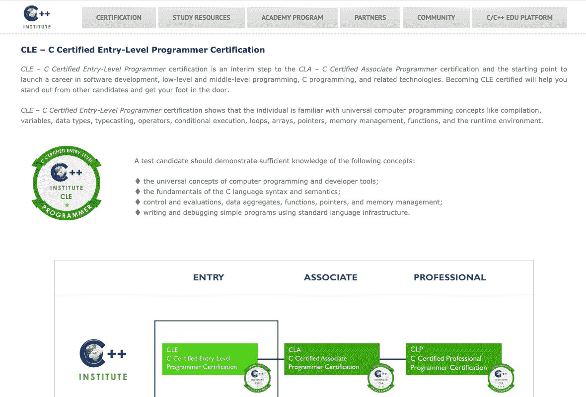
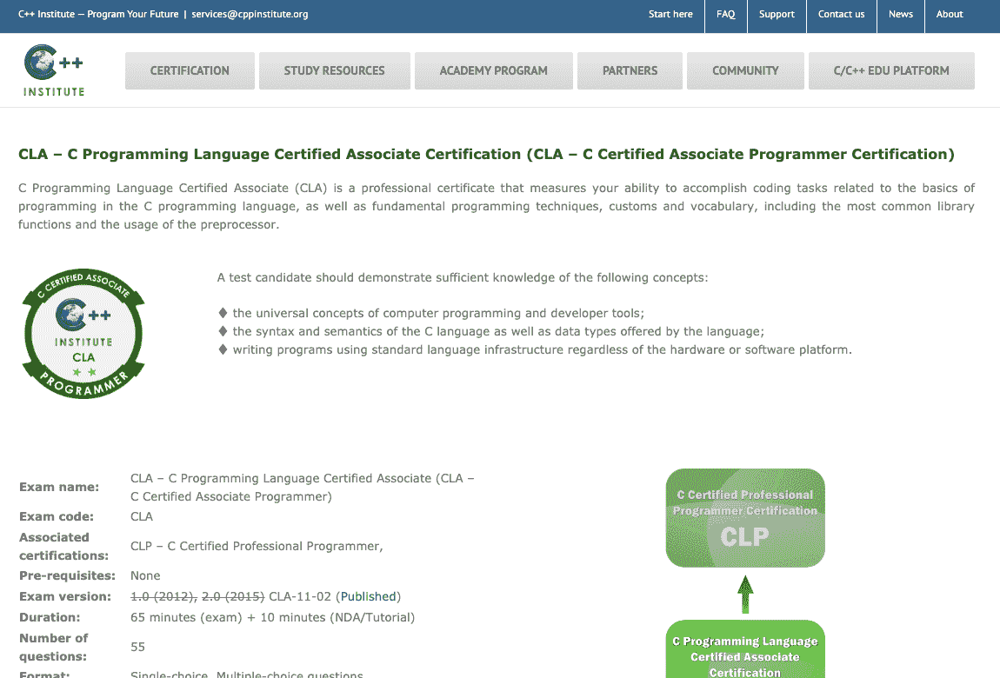
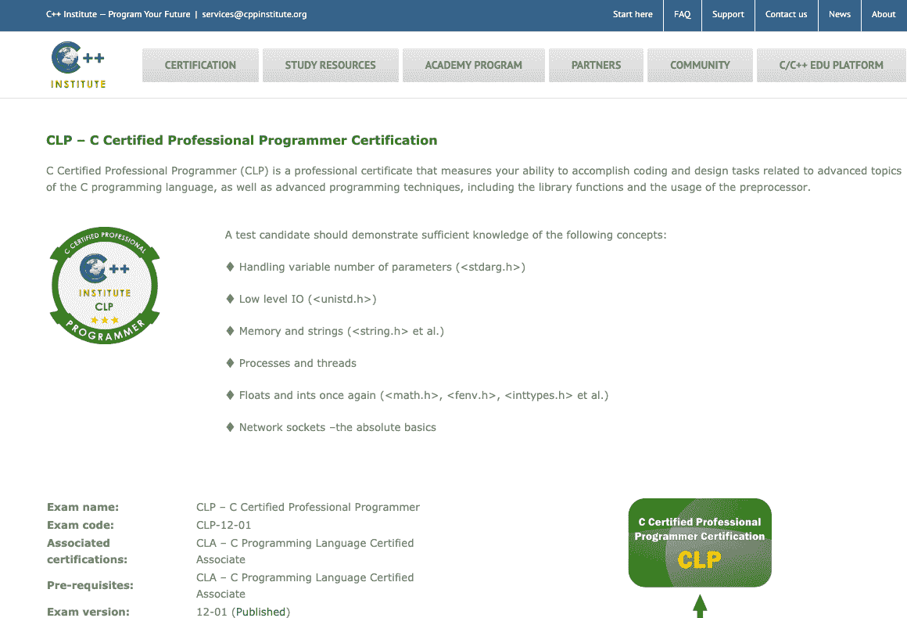
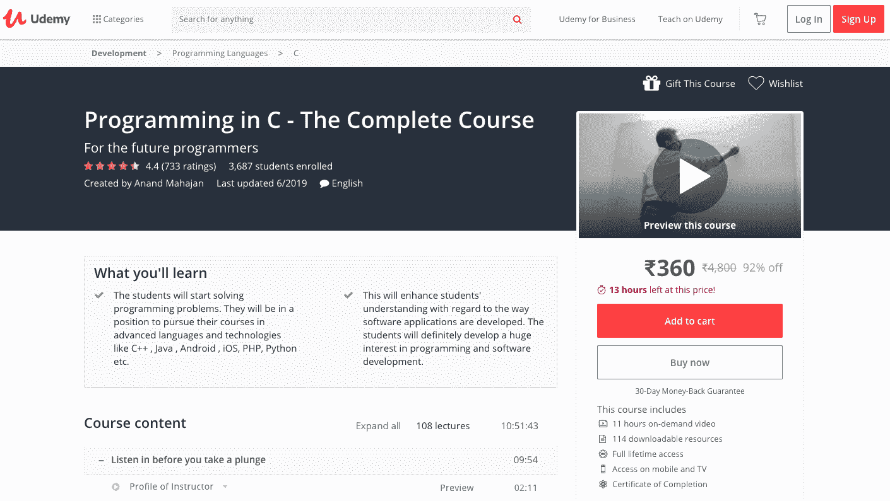
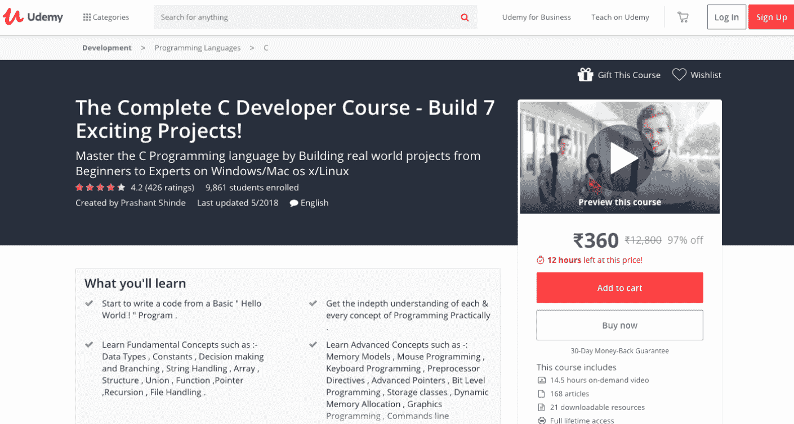
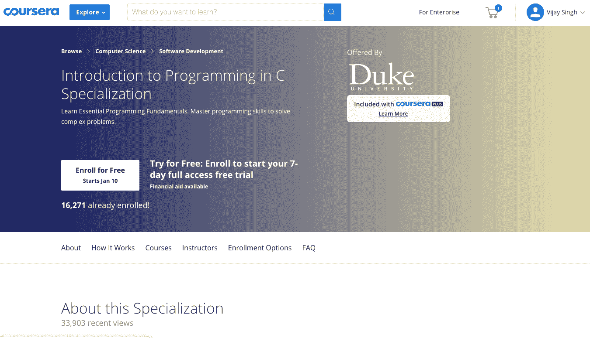
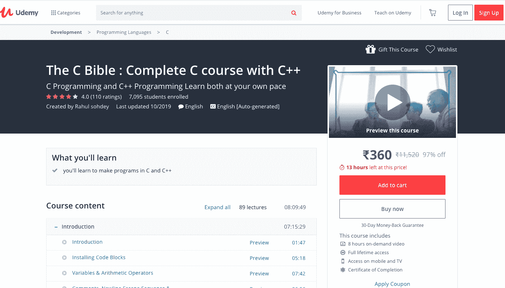

# 2023 年 3 项最佳 C 认证[排名]

> 原文：<https://hackr.io/blog/c-certification>

自从 1972 年在贝尔实验室诞生以来，C 编程语言一直处于编程领域的前沿。编程语言从最初作为开发能够在 Unix 平台上运行的实用程序的简单工具，已经走过了漫长的道路。今天，它有一系列的应用，从游戏和软件开发到航空电子和空间研究。

在将近 50 年的时间里，通用的过程编程语言已经直接或间接地影响了编程语言。一些著名的例子包括 C#、Go、Java、Perl、PHP 和 Python。

尽管 C 编程语言如此古老，但它仍在不断发展壮大。我们怎么能这么说呢？好吧，看看 2023 年的[最佳编程语言清单，你会在里面看到 C 和 C++。简而言之，用 C 语言绝对是个好主意。](https://hackr.io/blog/best-programming-languages-to-learn)

## **为什么要 C 认证？**

一旦你开始学习 C 语言，是时候让你的脚涉足编程的神秘和创新的水域了。但是如何开始呢？一种方法是获得使用 C 编程语言的认证。

到目前为止，有许多 C 认证可用。有些在大众中很受欢迎，有些则不受欢迎。此外，不同的认证保证了不同水平的 C 编程能力。所以，你需要选择一个最符合你技能的。

## 3 最佳 C 认证计划

为了帮助你选择最好的 C 认证，我们在这篇文章中列出了 3 个最好的 C 认证。你可以查看该认证的等级，看看它是否最适合你。没有更多的麻烦，他们在这里:

[****](https://cppinstitute.org/cle-c-certified-entry-level-programmer-certification)

**级—**入门级
**平台—**c++学院

CLE C 认证的入门级程序员证书正是它所陈述的。它是为那些希望在 C 编程、低级和中级编程、软件开发以及相关技术领域开始职业生涯的人准备的。

作为 CLA–C 认证助理程序员认证的一个过渡步骤，CLE 认证保证了持有者:

*   能够使用标准语言基础设施编写和调试简单的 C 程序
*   熟悉数据类型、类型转换、条件语句、内存管理、函数、运行时环境以及其他通用编程概念和开发工具
*   熟悉 C 编程语言的基础，例如语义和语法

#### **重要话题:**

*   安装和设置 C 编译器
*   ide 简介
*   数组和指针
*   基本数据类型、操作和流控制语句
*   函数基础
*   计算机逻辑
*   内存管理
*   字符串基础
*   编译过程
*   数组和指针的高级操作

#### **考试详情:**

**名称—**CLE–C 认证入门级程序员
**代码—**CLE-10-01
**持续时间—**45 分钟考试+ 5 分钟保密协议/教程
**语言—**英语
**通过率—**70%
**先决条件—**无
**价格—**【59 美元

你可以在这里注册。

[****](https://cppinstitute.org/cla-c-programming-language-certified-associate)

**级—**中级
**平台—**c++学院

CLA 证书是一种专业的 C 认证，它评估候选人在利用基本编程技术、库函数、[C 预处理器](https://en.wikipedia.org/wiki/C_preprocessor)和相关技术的同时，完成各种编码任务和用 C 编写程序的能力。

CLA 认证候选人:

*   对计算机编程和开发工具的通用概念有充分的理解
*   精通 C 编程语言的数据类型、语法和语义
*   使用标准语言基础结构编写 C 程序，独立于所使用的硬件或软件平台

#### **重要话题:**

*   编译与软件开发导论
*   数组、指针和结构
*   基本标量数据类型及其运算符
*   文件和流
*   流控制
*   内存管理
*   预处理器指令和复杂声明
*   构建代码/功能和模块

#### **考试详情:**

**名称—**CLA–C 编程语言认证助理(CLA–C 认证助理程序员)
**代码—**CLA-11-02
**持续时间—**65 分钟考试+ 10 分钟保密协议/教程
**语言—**英语
**通过率—**70%
**先决条件—**无

 **你可以在这里注册。

[****](https://cppinstitute.org/clp-c-certified-professional-programmer)

**级—**专家级
**平台—**c++学院

CLP–C 认证专业程序员认证是 C++学院提供的最高 C 认证。它面向具有多年 C 语言专业知识的专业人员，可以使用它的高级功能。

CLP 认证候选人可以:

*   使用 C 编程语言的高级库和功能
*   识别 C 程序中的错误、错误和瓶颈
*   使用高级数据结构
*   使用算法和数据结构解决重要的问题
*   使用标准 C 语言基础结构设计和编写程序，独立于所使用的硬件或软件平台

#### **重要**话题:

*   C 语言的发展/C 语言的新版本
*   网络套接字基础
*   常数变量与易变变量
*   处理可变数量的参数
*   国际化 i18n
*   内存管理
*   可移植性问题和未定义的行为
*   进程和线程
*   用线串
*   使用整数和浮点数

#### **考试详情:**

**姓名—**CLP–C 认证职业程序员
**代码—**CLP-12-01
**持续时间—**65 分钟考试+ 10 分钟保密协议/教程
**语言—**英语
**通过率—**70%
**先决条件—**CLA–C 编程语言认证助理
**价格**

你可以在这里注册。

## **5 个最佳 C 教程&课程**

虽然最好的 C 认证都有一系列的学习材料，但是你可以通过其他方式来准备认证考试。其中一种方法是在线教程和课程。这里有 5 个最好的 C 教程和课程，可以帮助你准备 C 认证考试:

[****](https://click.linksynergy.com/deeplink?id=jU79Zysihs4&mid=39197&murl=https://www.udemy.com/course/programming-in-c-the-complete-course/)

适合–初学者
平台–Udemy
时长–11 小时
类型–视频课程

由具有二十多年编程教学经验的资深教师 Anand Mahajan 编写，并由 Udemy 提供,《C 语言编程》----完整课程》是 Udemy 最好的课程之一，一般来说，也是最好的 C 语言课程，有助于很好地掌握 C 语言编程的基础。

尽管学习 C 语言编程不需要任何编程经验，但拥有处理基本计算机操作的能力会对学习 C 语言起到额外的推动作用。

所有的学习材料都打包在 108 个视频讲座中，总时长约为 11 个小时。为了增强学习体验，该课程提供了 114 种可下载资源。与任何 Udemy 课程一样，可以终身访问，也可以通过手机和电视访问。

#### **涵盖的主题:**

*   基本编程概念
*   数组和编程
*   C 运算符(C 编程语言支持的运算符)
*   字符集、[数据类型](https://hackr.io/blog/data-types-in-c)、I/O 库函数和令牌
*   命令行参数
*   文件处理
*   功能
*   C 语言中的图形编程
*   迭代构造(循环)
*   程序的生命周期
*   两颗北极指极星
*   递归
*   序列构造、if 语句编程构造和切换用例构造
*   C 中的存储类
*   C 语言中的字符串
*   C 程序的结构
*   结构
*   联合

你可以在这里注册。

[****](https://coursera.pxf.io/mgJOra)

**适合—**初学者
**平台—**Coursera
**时长—**4 周/31+小时(弹性)
**类型—**视频课程

C 语言课程中的编写、运行和修复代码使学习者能够开始编写 C 语言代码。除了学习如何编译和运行 C 程序，学生们还将了解如何在应用程序中查找错误并修复错误。

由杜克大学与 Coursera 合作提供的 C 语言代码的编写、运行和修复课程提供了根据学生的时间表重新设置截止日期的灵活性。整个 C 语言课程以视频课程的形式讲授，并配有英语和越南语字幕。

安德鲁·d·希尔顿、吉纳维芙·李普和安妮·段璇是课程讲师。学生可以在课程期间随时与他们取得联系，以消除他们的疑虑，讨论一个问题，并获得关于 C 编程的宝贵建议。

除了视频课程，C 课程还有大量的阅读材料。此外，每章末尾都有测验，让学生评估他们的学习情况。

#### **涵盖的主题:**

*   编写代码简介
*   编程环境介绍
*   组装和链接
*   将输出与差分进行比较
*   编译过程
*   编译器错误
*   使用 Makefile 编译
*   用 Emacs 编辑文件
*   生成测试用例
*   GitHub 简介
*   宏和头文件
*   测试驱动开发
*   测试类型

你可以在这里注册。

[****](https://click.linksynergy.com/deeplink?id=jU79Zysihs4&mid=39197&murl=https://www.udemy.com/course/the-complete-c-developer-course-build-7-exciting-projects/)

**适合—**任何人
**平台—**Udemy
**时长—**14.5 小时
**类型—**一个视频课程

无论你是一个有相当专业经验的 C 程序员还是一个新手，完整的 C 开发课程-构建 7 个令人兴奋的项目！无论 C 技能水平如何，本教程对每个人都有帮助。

通过完整的 C 开发人员课程，了解如何为 Linux、macOS 和 Windows 平台构建 C 程序。C 课程由 Prashant Shinde 策划，他是一名 C & C++开发人员、职业黑客和计算机极客。

C 课程通过允许学习者构建从初学者到中级和专家水平不等的多个真实世界的项目，帮助建立对 C 编程语言的坚实掌握。

完整的 C 开发者课程-构建 7 个激动人心的项目！拥有 316 个视频讲座，你可以根据自己的喜好随意浏览。长达 14.5 小时的 C 视频课程包含 168 篇文章和 21 个可下载资源，以增强学习体验。

#### **涵盖的主题:**

*   C 编程语言的历史、特点和应用
*   C 中的算法和流程图
*   数组和指针
*   比特级编程
*   命令行参数
*   编译和执行过程
*   日期和时间编程
*   数据类型和字符集
*   决策和分支
*   动态存储分配
*   C 语言中的错误处理和调试
*   文件处理
*   功能
*   图形编程
*   算子的层次性和结合性
*   安装代码块、开发 C++和 Turbo C++编译器
*   键盘编程
*   循环控制结构
*   鼠标编程
*   预处理器指令
*   声音节目
*   存储类别
*   字符串处理
*   结构和联合
*   C 程序的构造

你可以在这里注册。

[****](https://coursera.pxf.io/e454KQ)

适合–初学者
平台–Coursera
期限–4 个月(灵活)
类型–专业化

Coursera 与杜克大学联合开设了 C 语言专业课程编程导论。虽然是一门优秀的软件开发入门在线课程，但是 C 认证追求者也可以利用这门课程来准备自己的 C 认证考试。

C 专业帮助学习者:

*   培养对编程基础的深入理解，以及
*   通过编写计算机程序解决复杂的现实世界的问题

除了英语之外，越南语也提供 C 专业化认证。学习者可以灵活地设置和维护截止日期。在每周工作 10 小时的情况下，C 专业化编程入门需要大约四个月的时间来完成。C 课程有四位讲师:

*   **Andrew d . Hilton—**实践/电气和计算机工程副教授
*   **Genevieve m . Lipp—**电气和计算机工程、机械工程和材料科学助理教授
*   **Anne braket—**康奈尔大学计算机科学高级讲师
*   利兹·温德兰

学生可以联系课程教师寻求即时帮助，在任何时候都可以专心学习学习材料。

#### **涵盖的课程:**

*   编程基础
    *   解决问题的七个步骤
    *   开发算法
    *   阅读和理解代码
    *   编程概念与算法的关系
*   用 C 语言编写、运行和修复代码
    *   根据程序应该做什么来编写代码
    *   如何编译和运行程序
    *   系统测试问题并解决问题的框架
*   指针、数组和递归
    *   指针和数组
    *   递归函数
*   与系统交互和管理内存
    *   与用户和系统交互的新编程技术
    *   动态存储分配
    *   文件处理

你可以在这里注册。

[****](https://click.linksynergy.com/deeplink?id=jU79Zysihs4&mid=39197&murl=https://www.udemy.com/course/the-c-bible-complete-c-course-with-c/)

**适合—**任何人
**平台—**Udemy
**时长—**8 小时 10 分钟
**类型—**视频课程

C 圣经:用 C++完成 C 课程准备学习者开始用 C 和 C++编程语言开发他们的程序。C 课程由 89 名视频讲师授课，时长 8 小时 9 分 49 秒。

学习 C 圣经没有先决条件:用 C++教程完成 C 课程。不需要以前的编程经验。在线课程对任何人来说都是理想的，尤其是从 C 和 C++开始，或者一般来说是编程语言。

张贴成功完成课程的信息；学习者可以:

*   用 C 和 C++写程序
*   理解任何用 C 和 C++编写的应用程序
*   使用面向对象的概念
*   从他们涉及 C、C++和相关技术的项目开始

C 圣经课程由 Rahul Sohdey 编写，他是一名程序员、软件工程师和全栈开发人员，拥有 8 年以上的工作经验。Rahul 的指导不仅传授了 C 和 C++的基础知识，还传授了流行编程语言的高级概念。

#### **涵盖的主题:**

##### **C 编程:**

*   安装代码块
*   变量和算术运算符
*   注释和换行符转义序列
*   pow()函数
*   类型转换
*   运算符优先级
*   if、if-else、嵌套 if-else 和 switch 语句
*   用关系运算符进行测试
*   经营者
*   循环(for 循环、while 循环、do-while 循环、嵌套循环和无限循环)
*   Break、continue 和 GOTO 语句
*   C 中的范围
*   功能；[通过方法调用，通过引用调用](https://hackr.io/blog/pass-by-reference-vs-pass-by-pointer)
*   数组和指针
*   C 语言中的字符串
*   结构和联合
*   C 中的递归
*   C 语言中的类型转换
*   参数化和预定义的宏
*   在 Linux 上运行 C 程序

##### C++编程:

*   面向对象编程简介
*   算术和逻辑运算符
*   注释、标识符和空白
*   数据类型
*   转义序列
*   变量的范围
*   C++程序的结构

你可以在这里注册。

## **总结**

我们的三个最佳 C 认证列表到此结束。希望你能得到你想要的。如果没有，请通过评论让我们知道。

也可以分享自己的观点、看法、备注、评论、更正、想法等。通过下面的专用评论部分。我们希望收到您的来信。如果你喜欢这篇文章，请与其他可能会觉得有用的人分享。已经谢谢了！

**人也在读:****