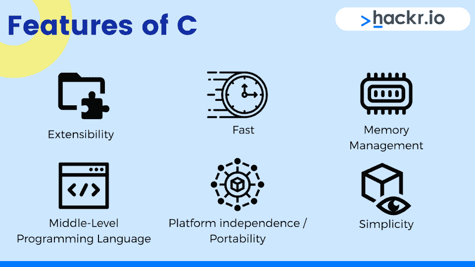
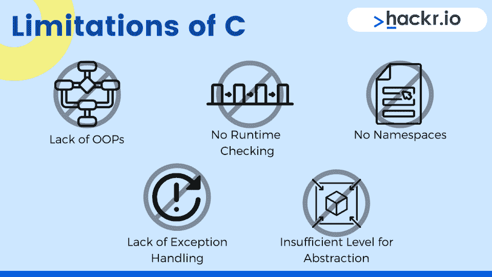
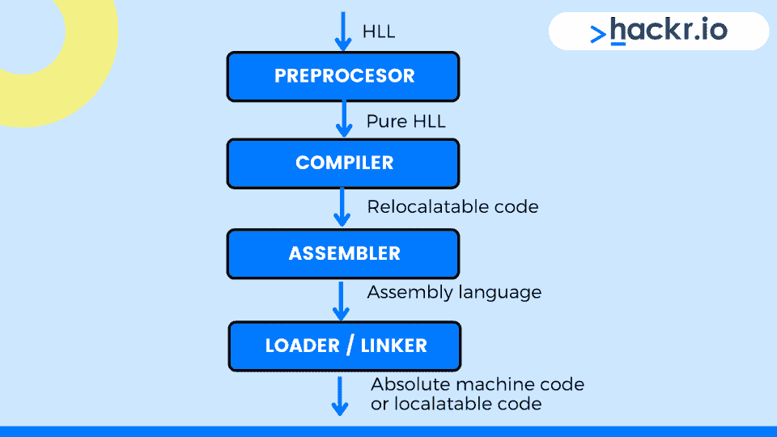
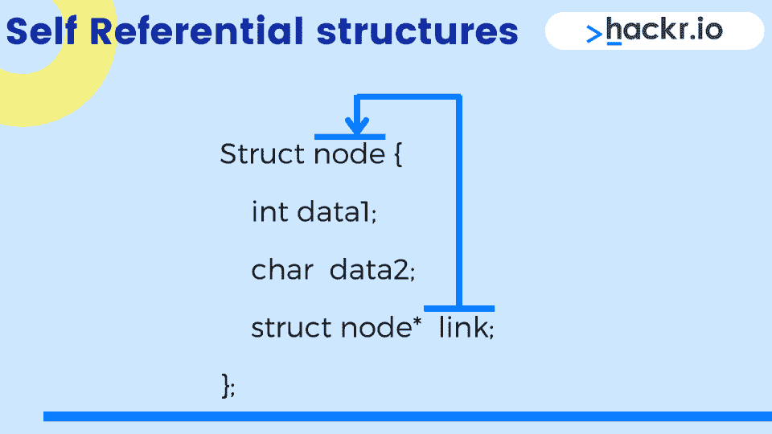

# 2023 年 50 C 面试问答【更新】

> 原文：<https://hackr.io/blog/c-interview-questions>

尽管已经将近 50 岁了，C 仍然是编程领域的前沿和中心。这种语言不仅有广泛的应用，也是各种现代强大编程语言的灵感来源，包括 [Java](https://hackr.io/blog/what-is-java) 、 [C#和 Python](https://hackr.io/blog/c-sharp-vs-python) 。

虽然现在很少有职位只要求对 C 语言有很高的熟练程度，但大多数编程工作都要求对 C 编程语言的基本概念有很好的理解。

这些 C 面试问题和答案涵盖了许多编程概念，是一个很好的方法来准备一个需要很好理解 C 的面试。

## **Top C 面试问答**

### **C 基本面试问题**

#### **1。C 语言最重要的特性是什么？**



C #的一些最重要的特性是:

*   **扩展性**:可以采用新的特性。
*   **快速**:与流行的高级语言如 [Java 和 Python](https://hackr.io/blog/python-vs-java) 相比，对系统编程的支持允许更快的编译和执行。
*   **内存管理**:内置内存管理，可节省内存并优化内存使用。
*   **中级编程语言**:可用于系统编程，也可用于应用编程。
*   平台独立性/可移植性:为一台机器编写的 C 程序可以在其他机器上运行，几乎不需要修改。
*   简单性:遵循结构化的方法。有助于将一个大的、复杂的程序分解成更小的、独立的、易于管理的模块(子程序)。

头文件存储了定义和管理 C 编程语言不同内置函数的规则集。例如，printf()和 scanf()函数在 stdio.h 头文件中定义。

每个头文件都包含一组预定义的函数，旨在简化 C 语言编程。您需要在 C 程序中包含特定的头文件，以便能够使用其中定义的函数。如果不包含 stdio.h 头文件，就不能使用 printf()和 scanf()函数。

当头文件在 C 程序中出现两次时，第二个会被忽略。实际上，头文件前面的#称为 include guard，它确保了头文件在编译过程中只被包含一次。

#### **3。给我们大致解释一下 C.**

c 是最常用的计算机编程语言之一。它是一种过程语言，以系统编程、词汇变量范围和递归为特征。

#### **4。为什么 C 被称为“编程语言之母”？**

c 通常被称为“编程语言之母”，因为它是许多其他语言的基础。它是一种历史悠久的语言，已经被广泛用于开发一些最重要的编译器和内核。

#### **5。C 有什么优势？**

C 语言的一些优点是:

*   **中级语言:**由于 C 处于高级语言和低级语言的中间，所以兼具两者的特点。
*   **结构化级别语言:** C 是一种结构化编程语言，它允许将一个复杂的程序划分为称为函数的更简单的程序。
*   **区分大小写的语言:**这是一种区分大小写的语言，因此小写字母和大写字母的处理方式不同。
*   可移植语言: C 是一种高度灵活的语言，使其能够用于脚本系统应用程序，这使其成为许多知名操作系统的一部分。
*   强大而高效的语言:它是一种用户友好的语言，可以有效地运行于游戏、图形、企业应用程序以及需要一些计算的应用程序等。

#### **6。C 语言有哪些局限性？**

****

以下是 C 的一些缺点:

*   缺少 OOPs: C 不使用 OOPs，因为它是基于过程方法的。
*   **无运行时检查:** C 不执行运行时检查，这意味着每行代码后都不会检测到错误。
*   **无命名空间:** C 不允许命名空间，所以 C 程序中不能有两个同名的变量。
*   缺乏异常处理:这种语言没有展示出异常处理的重要特征。异常处理的特性不允许用户在编译代码时检测错误和缺陷。
*   **抽象层次不足:** C 没有非常广泛的数据处理能力，对语言的安全性构成威胁。

### 还在学 C？选修这门课

[C 编程初学者-掌握 C 语言](https://click.linksynergy.com/deeplink?id=Qouy7GhEEFU&mid=39197&murl=https://www.udemy.com/topic/python/)

#### 7 .**。C 中 main()函数的目的是什么？**

C 中的 main()函数是 C 程序的入口。它是程序执行过程开始的入口点。当 C 程序的执行开始时，程序的控制权指向 main()函数。每个 C 程序都必须有一个 main()函数。虽然它是指示编程过程的函数，但它不是要执行的第一个函数。

#### **8。什么是变量和常数？**

在 C 语言中，常量和变量在程序设计中被广泛使用。变量和常量的主要区别在于变量可以在程序的任何时候改变它们的赋值。

相反，常量的值在整个程序中保持不变。在程序执行期间，常量的值被锁定。

例如，pi 的值可以在整个程序过程中设置为常数。

#### **9。区分尖括号中的头文件和双引号中的头文件。**

如果头文件放在尖括号< >中，那么编译器只在内置的包含路径中找到特定的头文件。但是如果头文件放在双引号中，编译器会尝试主要在当前工作目录中定位特定的头文件，如果在那里找不到，它就会在内置的包含路径中进行搜索。

#### 10。一个 C 程序不使用 main()函数编译吗？它的执行力如何？

是的，一个 C 程序即使不加 main()函数也可以编译。但是，如果没有 main()函数，它将不会执行。

#### **11。C 中有哪些基本的数据类型？**

C 中有 5 种基本的[数据类型:](https://hackr.io/blog/data-types-in-c)

1.  **int** :存储一个整数
2.  **float** :存储十进制数
3.  **double** :存储精度最高的十进制数
4.  **char** :存储单个字符
5.  **void** :不存储任何值

#### **12。什么是保留关键词，有多少？**

在编写程序时限于通用的字，即用作变量、函数、结构等的名称。，称为保留关键字。保留关键字(也称为保留名称)具有特殊含义，即它们已经为某个对象定义。

C 编程语言有以下 32 个保留关键字:

1.  汽车
2.  破裂
3.  情况
4.  茶
5.  常数
6.  继续
7.  系统默认值
8.  做
9.  两倍
10.  其他
11.  列举型别
12.  走读生
13.  漂浮物
14.  为
15.  转到
16.  如果
17.  （同 Internationalorganizations）国际组织
18.  长的
19.  注册
20.  返回
21.  短的
22.  签名
23.  尺寸
24.  静电
25.  结构体
26.  转换
27.  typedef
28.  联盟
29.  无符号的
30.  空的
31.  不稳定的
32.  在…期间

#### 13。全局变量和静态变量有什么不同？

全局变量是具有全局范围的变量，也就是说，它们在整个程序中都是可访问的，除非是隐藏的。这些变量在函数或代码块之外定义。

静态变量是静态分配的变量，即它们的值不能改变。它在程序的整个运行过程中是固定的。它们既可以在函数内部定义，也可以在函数外部定义。此外，可以从程序内部的任何地方访问它们。

#### **14。解释静态内存分配和动态内存分配。**

在动态内存分配中，可以在执行程序时增加内存。事实并非如此；然而，对于静态内存分配，在程序执行期间增加内存的选项不可用。

与动态内存分配相比，静态内存分配需要更多内存空间。数组使用静态内存分配，而链表使用动态内存分配。静态内存分配发生在[编译时](https://en.wikipedia.org/wiki/Compile_time)，而动态内存分配发生在运行时。

#### 15。什么是内存泄漏？为什么要解决这个问题？

当堆中创建的内存保持未删除状态时，就会发生内存泄漏。这会导致额外的内存使用，从而影响程序的性能。这正是必须解决内存泄漏问题的原因。

#### 16。什么是 while(0)和 while(1)？

while(0)是一个将始终为假的循环条件，即不会执行 while 循环中的代码。而(1)是一个无限循环。它持续运行，直到遇到明确提到的 break 语句。

**注意**:while 循环的大括号内的任何非零整数都会给出一个无限循环。例如，while(-22)和 while(24)都会产生一个无限循环。

#### **17。受保护访问说明符的作用是什么？**

受保护关键字的私密性介于关键字 private 和 public 之间。如果一个类被标记为 protected，则它可以被它的成员函数、使用公共或受保护访问派生的类、私有派生类以及声明这些成员的类的友元访问。

#### 18。volatile 这个关键字是用来做什么的？

Volatile 阻止编译器优化有问题的变量或对象。任何代码都可以随时在当前代码的范围之外更改变量值。这意味着编译器必须将可变变量的值保存在该变量的所有本地副本中。

#### **19。解释“删除”运算符的用途。**

Delete 删除由新表达式创建的所有对象，即释放堆空间中的内存。使用[]运算符删除数组对象:

```
delete[] array;
NULLorvoid Pointer can be deleted as:
delete ptr;
```

这同样适用于用户定义的数据类型。举个例子，

```
int *var = newint;
delete var;
```

#### 20。解释外部存储说明符的用途。

外部存储说明符有助于声明可由许多源文件使用的对象。它描述了一个外部定义的变量。定义可以出现在块的开头，也可以出现在函数的外部。extern 变量只有一个声明。如果找到任何其他实例，则认为它与第一个实例相同。外部变量可以有块范围或文件范围，这取决于它们的定义位置。

#### **21。什么是预处理器？**

****

预处理器是一个程序，它产生的输出被其他程序用作输入。

例如，翻译是预处理步骤，在此之后代码被发送进行编译。

#### **22。什么是命令行参数？**

为了从外部控制程序，我们在调用 main 方法时向程序提供命令行参数。语法是:

```
intmain(int argc, char *argv[]) 
```

其中 argc、argv 是命令行参数。

#### **23。列出引用和指针的区别？**

| **参考** | **指针** |
| 它是变量的替代名称。 | 存储变量的地址。 |
| 使用* : int *ptr 声明。 | 使用& int & ref var 声明。 |
| 不能有空值。 | 可以分配空值。 |
| 可以通过按值传递来访问。 | 使用按引用传递。 |
| 必须在声明时初始化，即 int &ref;将会给出一个错误。 | 在声明过程中不需要初始化，即 int *ptr 是正确的。 |
| 与原始变量共享相同的内存地址，并占用堆栈上的一些空间。 | 在堆栈上有它的大小和内存地址。 |

#### **24。写一个程序打印 Hello World！不用分号。**

我们可以通过使用不带条件的 if 语句来做到这一点:

```
#include <stdio.h>
#include <conio.h>
void main()
{
if
(
printf("Hello World!")
)
}
```

输出:Hello World！

#### **25。new()和 malloc()有什么区别？**

| **新()** | **malloc()** |
| 它是一个运算符。 | 这是一个函数。 |
| 返回数据类型。 | 返回一个空指针。 |
| 通过构造函数用默认值分配内存。 | 内存未初始化；默认值是垃圾。 |
| New 可以重载。 | 不能重载。 |
| 无法调整分配的大小。 | 可以使用 realloc 调整分配的大小。 |

#### **26。解释 delete 和 delete[]的区别？**

Delete 从内存中删除单个对象，而 delete[]用于释放对象数组的内存。拥有 delete[]的重要性在于，如果我们有一个指向大小为 10 的数组(new myarr[10])的指针(比如 ptr)并简单地给出 delete ptr，因为我们不知道 ptr 指向多少个对象，因此 delete 只会删除第一项。其余 9 项不会被删除。这将导致内存泄漏。示例:

```
// delete
int *var = new int;
delete var;
// delete[]
int *arr = new int[1];
delete[] arr;
```

#### **27。前缀增量和后缀增量有什么区别？**

在前缀增量中，变量的值在程序执行前递增。该变量在程序执行后以后缀增量递增。

++前缀增量

++

#### **28。什么是悬空指针？**

指向已经被删除的内存位置的指针称为悬空指针。根据另一个定义，悬空指针是指向非引用内存位置的指针。指针在三种情况下充当悬空指针:

1.  内存释放
2.  当局部变量不是静态的时
3.  当变量超出范围时

#### **29。空指针和空指针有什么不同？**

当指针的值在声明时未知时，它被初始化为 NULL。通常，空指针不指向有效位置。与空指针不同，空指针是通用指针，没有任何与之关联的数据类型。空指针可以包含任何类型变量的地址。因此，空指针指向的数据类型可以是任何类型。

```
#include <stdio.h>
#include <conio.h>
void main()
{
int a = 22;
int *notnullpointer = &a;
int *nullpointer1; // Null because there is no initialization.
int *nullpointer2 = 0; // Null because initialized with 0.
if (notnullpointer == 0) printf ("\nNot null pointer is null.");
else printf ("\nNot null pointer is not null.");
if (nullpointer1 == 0) printf ("\nNull pointer 1 is null.");
else printf ("\nNull pointer 1 is not null.");
if (nullpointer2 == 0) printf ("\nNull pointer 2 is null.");
else printf ("\nNull pointer 2 is not null.");
printf ("\nNot null pointer has stored the address %d.", &notnullpointer);
printf ("\nNull pointer 1 has no valid address.");
printf ("\nNull pointer 2 has no valid address.");
}
```

**输出**:

Not null 指针不为 null。

空指针 1 为空。

空指针 2 为空。

非空指针存储了地址 2054804456。

空指针 1 没有有效地址。

空指针 2 没有有效地址。

与空指针不同，空指针是通用指针，没有任何与之关联的数据类型。空指针可以包含任何类型变量的地址。因此，空指针指向的数据类型可以是任何类型。例如:

```
int x = 22;
char b = 'a';
void *vp = &x; // Here the void pointer is holding address of int x
vp = &b; // Here the void pointer is holding address of char b
```

#### 三十岁。calloc()和 malloc()函数是什么？

calloc()和 malloc()是用于动态分配内存的库函数，即在运行时从堆段分配内存。如果内存分配成功，则返回一个指向内存块的指针。在分配失败的情况下，这两个函数返回空值。

#### 31。按值传递和按引用传递有什么不同？

按值传递和按引用传递也称为按值调用和按引用调用。在按值调用中，值作为参数发送/传递给函数。当要求不修改实际参数时使用。对被调用函数中的参数所做的更改不会反映在调用函数的传递值中。

当需要修改实际参数时，使用按引用传递。属于实际参数的地址通过引用发送/传递给调用中的函数。对被调用函数中的参数所做的更改会反映在调用函数中的引用传递中。

#### 32。什么时候使用 register 关键字？

寄存器存储说明符，即寄存器关键字，用于在机器寄存器中存储变量。这通常用于频繁使用的变量，如循环控制变量。使用 register 关键字的目的是通过最小化可变访问时间来加速程序。

#### 33。你所理解的右值和艾值是什么？

赋值运算符(=)左边的表达式称为 ivalue。右值是赋值运算符右侧的表达式，它被赋值给一个 ivalue。

举个例子，

```
int a = 25;
```

int a 是上述示例中的 ivalue，而 25 是右值。虽然 ivalue 存在于单个表达式之外，但是右 value 不会存在于使用它的表达式之外。

#### 34。实际参数和形式参数有什么不同？

实际参数是在调用端发送给函数的参数。然而，形式参数是在函数定义期间接收到的参数。形参是某个函数中使用的标识符，用来代表调用者传递给函数的值。调用者传递给函数的实际值就是实际参数。

只要形式参数的功能是活动的，它们就被绑定到实际值。当函数返回给调用者时，形参不存储任何值。例如:

```
#include <stdio.h>
#include <conio.h>
int totalsum(int a, int b, int c) // Formal parameters
{
int total;
total = a + b +c;
return total;
}
int main()
{
int sum;
int a = 22; int m = 24; int p = 28; // Actual parameters
sum = totalsum(a, m, p);
printf ("The total sum is %d.", sum);
}
```

**输出**:

总数是 74。

实参和形参的另一个主要区别是，虽然后者总是变量，但前者可以是表达式、函数调用，甚至是数字。例如，在上面的示例中，以下也是有效的实际参数(在对 totalsum 的函数调用中):

```
sum = totalsum (10+15, 12*2, 56/2); // Actual parameters are expressions.
sum = totalsum (a, (int) sqrt(576), p); // One of the actual parameters is a function call.
sum = totalsum (22, 24, 28); // Actual parameters are numbers.
```

#### 35。什么是自指结构？

****

自引用结构包含与其元素相同的结构指针变量。

换句话说，它是一种数据结构，其中指针指向相同数据类型的结构。

自引用结构用于图、堆、链表、树等。

#### 36。什么是模块化编程？

编程的模块化方法包括将整个程序分成独立的、可互换的子程序，即用于实现所需功能的功能和模块。模块化编程中涉及的每个功能或模块都具有执行整个程序的期望功能的单个方面所需的一切。

#### 37。什么是代币？

记号是 C 程序中最小的、不可分割的单元，具有不同的含义。以下是各种类型的令牌:

*   **常量**:程序执行过程中不能改变的固定值。
*   **标识符**:指函数、变量、数组、结构等的名称。
*   **关键词/保留名称**:具有特殊含义的预定义词，不能作为变量名。
*   **运算符**:告诉 C 编译器执行特定逻辑、数学或关系运算的符号。
*   **特殊字符**:除了字母和数字以外的所有字符都是特殊字符。

#### 38。什么是位域？

位字段是在结构中用预定义的宽度(大小)定义的变量。位字段的一般语法是:

```
struct {
type [member_name] : width ;
};
```

**type** :整数类型，如 int 和 signed int，决定如何解释位域的值。

**成员名称**:位字段的名称。

**宽度**:位域中的位数。必须小于或等于指定整数类型的位宽。

#### 39。各种文件打开方式有哪些？

使用 fopen()函数在 C 程序中打开文件。它在 stdio.h 头文件中定义。fopen()的一般语法是:

```
ptr = fopen (“file address”, “mode”);
```

在 C 程序中，可以用以下 12 种不同的打开模式打开文件:

1.  打开一个文件进行读取。
2.  **rb** -以二进制模式打开文件进行读取。
3.  打开一个文件进行写操作。
4.  **wb** -以二进制模式打开文件进行写入。
5.  **a** -打开文件进行追加，即将数据添加到文件末尾。
6.  **ab** -以二进制模式打开一个附加文件。
7.  **r+** -打开文件进行读写。
8.  **rb+** -以二进制模式打开文件进行读写。
9.  **w+** -打开文件进行读写。
10.  **wb+** -以二进制模式打开文件进行读写。
11.  **a+** -打开文件进行读取和追加。
12.  **ab+** -以二进制模式打开文件进行读取和追加。

r、rb、r+和 rb+模式除外；如果在其他模式下尝试打开时找不到该文件，则创建该文件。如果文件在这四种文件打开模式中不存在，fopen()返回 NULL。

#### 40。什么是递归？

递归是函数直接或间接调用自身的过程。这样的函数称为递归函数。递归函数包含两个阶段:

1.  **缠绕阶段**:递归函数调用自身时开始，条件达到时结束。
2.  **退绕阶段**:条件达到时开始，即绕线阶段结束，控制返回初始调用时结束。

#### 41。写一个 C 程序，检查输入的数是否是质数。

```
#include <stdio.h>
#include <conio.h>
void main()
{
int a, i, b=0, flag=0;
printf("Enter a number: ");
scanf("%d",&a);
b=a/2;
for(i=2;i<=b;i++)
{
if(a%i==0)
{
printf("The number you entered is not a prime number!");
flag=1;
break;
}
}
if(flag==0)
printf("The number you entered is a prime number.");
getch();
}
```

样本输出:

输入一个数字:22

您输入的数字不是质数！

#### **42。写一个程序，用递归求出一个给定数字的阶乘。**

```
#include <stdio.h>
#include <conio.h>
long factorial (int n)
{
if (n==0)
return 1;
else
return (n * factorial(n-1)); //recursion
}
void main()
{
int number;
long fact;
printf("Enter a number: ");
scanf("%d", &number);
fact = factorial(number);
printf("The factorial of %d is %ld!\n", number, fact);
getch();
}
```

样本输出:

输入一个数字:5

5 的阶乘是 120！

### **C 高级水平面试试题**

#### **43。什么是远指针？**

远指针是一个 32 位指针，能够访问所有 16 个段，即 RAM 的整个驻留存储器。它可以访问给定段中计算机内存之外的信息。要使用远指针，需要:

*   分配扇区寄存器以存储段中的数据地址，以及
*   在最近扇区内存储另一个扇区寄存器

#### **44。auto 关键字是什么？**

auto 是代码块或函数中声明的所有变量的默认存储类。局部变量也可以称为自动变量。如果 auto 变量中没有存储任何值，那么它会得到一个垃圾值。自动变量之所以这样叫，是因为这些变量分别在进入和退出声明它们的代码块或函数时分配和释放内存。通常，没有必要明确提到 auto 关键字。

#### **45。为什么我们要使用 sprintf()函数？**

sprintf()函数被称为字符串打印。我们使用 sprintf()函数将输出存储在函数中指定的字符缓冲区中，即将数据传输到缓冲区。该函数的一般语法是:

```
intsprintf
(char *str, constchar*string,.....);
```

sprintf()函数返回字符串中出现的字符总数。下面是一个演示 sprintf()函数用法的示例:

```
#include <stdio.h>
#include <conio.h>
int main()
{
char buffer[25];
sprintf(buffer, "This string is now stored in the buffer."); /* Using the sprintf() function for storing the string in the buffer.*/
printf("%s", buffer);
int n = sprintf(buffer, "This string is now stored in the buffer.");
printf("\nThe total number of characters in the string is %d.", n); // The sprintf() function returns the total number of characters in the stored string.
return 0;
}
```

输出:该字符串现在存储在缓冲区中。

字符串中的字符总数为 40。

#### **46。getch()和 getche()函数有什么区别？**

getch()和 getche()函数都用于从键盘读取单个字符。然而，两者之间的区别在于显示输出的方式。getche()函数在输出屏幕上显示数据，即输入的字符，而 getch()函数不显示。使用 Alt+F5 查看输入的字符。

#### **47。近指针、远指针和巨大指针的区别是什么？**

任何虚拟地址都有选择器和偏移量。虽然近指针没有显式选择器，但远指针和巨型指针有。对远指针执行指针运算不会导致选择器的修改。然而，对于一个巨大的指针来说却是这样。

#### **48。什么是类型转换？**

类型转换是将一种数据类型转换成另一种数据类型的过程。有两种类型:

1.  **隐式类型转换**:也称为自动转换，隐式类型转换是由 C 编译器自动执行的，也就是说，它不需要转换运算符。例如:

```
#include <stdio.h>
#include <conio.h>
void main ()
{
int x = 22;
float b = x; //implicit type conversion
printf(“%f”, b);
}
```

产量:22.000000

2.  **显式类型转换**:与隐式类型转换不同，显式类型转换是由程序员执行的。类型转换运算符用于告诉编译器将一种数据类型转换(转换)为另一种数据类型。例如:

```
#include <stdio.h>
#include <conio.h>
void main ()
{
float x = 22.22;
int b = (int) x; //explicit type conversion
printf(“%d”, b);
}
```

产量:22

这里，(int)是类型转换运算符。

#### **49。写一个 C 程序来检查输入的数字是否是回文。**

无论向前还是向后，回文数字都是相同的。

```
#include<stdio.h>
#include<conio.h>
void main()
{
int n, r, sum=0, temp;
printf("Enter a number: ");
scanf("%d",&n);
temp=n;
while(n>0)
{
r=n%10;
sum=(sum*10)+r;
n=n/10;
}
if(temp==sum)
printf("It is a palindrome number!");
else
printf("It is not a palindrome number!");
getch();
}
```

**样本输出:**

输入一个数字:12321

这是一个回文数字！

#### 50。什么是#undef 预处理器？

按照 C 编程语言的说法,#undef 指令的主要目的是作为预处理程序的指南，以去除特定宏的所有定义。如果宏是非特定的，那么指定宏上的#ifdef 指令将把结果显示为 false。

## **结论**

这总结了我们面试中最常见的问题。如果你想在面试前提高你的 C 编程技能，可以随意查看这些[最佳 C 教程](https://hackr.io/tutorials/learn-c)和这个 [C 初学者编程](https://click.linksynergy.com/deeplink?id=jU79Zysihs4&mid=39197&murl=https%3A%2F%2Fwww.udemy.com%2Fcourse%2Fc-programming-for-beginners-%2F) Udemy 课程。

## **常见问题解答**

#### **1。基本的 C 面试问题有哪些？**

我们上面列出的 C 编程面试问题涵盖了基础知识以及更多。从关于数据类型的问题到 c 语言的优缺点，一切尽在意料之中。

#### **2。C 常用来做什么？**

从设计操作系统到游戏，c 语言有着广泛的用途。上面列出的关于 C 语言的面试问题更详细的解释了这一点。

**人也在读:**