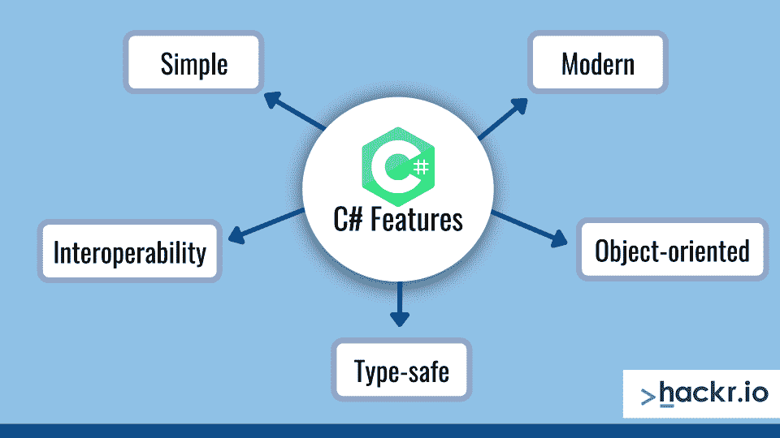
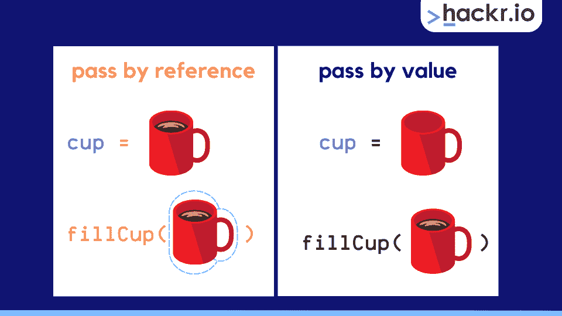
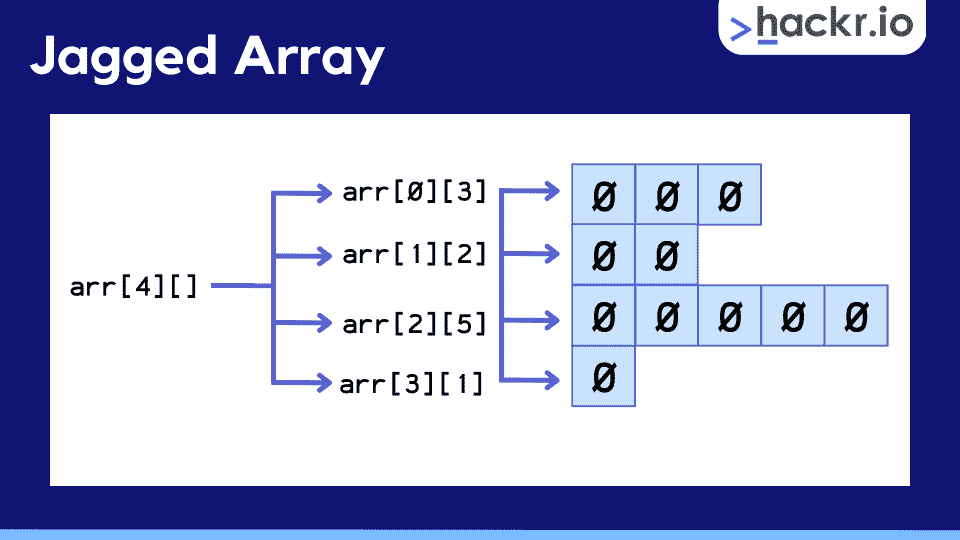
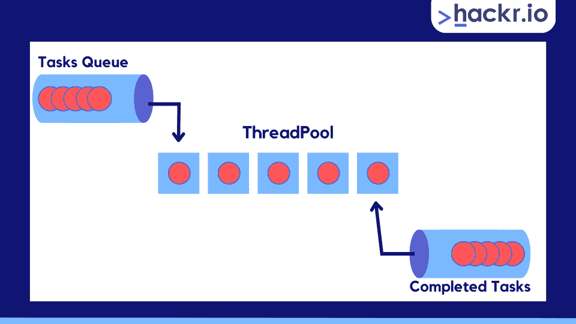
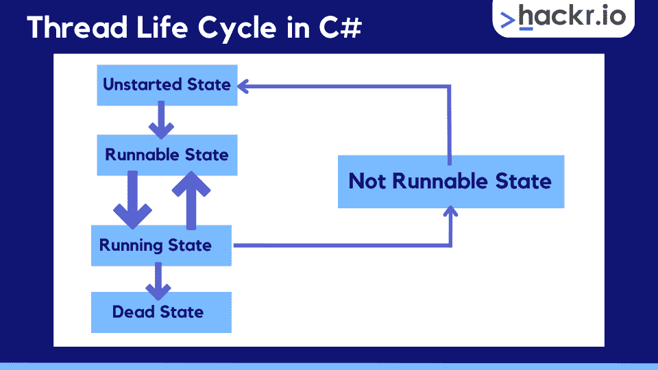

# 2023 年 40 大 C#面试问题及答案

> 原文：<https://hackr.io/blog/c-sharp-interview-questions>

C#于 2001 年末首次亮相，是一种易于学习的类型安全语言，主要用于面向对象编程。C#还采用了一种面向组件的方法，允许用。NET 框架。

从本质上来说，C#可以与 C 语言家族联系在一起，但是具有 Java 和 Javascript 经验的程序员也会非常熟悉 C#的语法。

C#提供了一系列的特性，包括垃圾收集、*可空的*类型，以及一个*统一类型*系统，其中所有类型(包括像*int、chars 等原语。)*继承自*对象*类。

本文涵盖了 40 个 C#面试问答，从基础到进阶。因此，无论你是一个渴望成为 C#开发人员的新程序员，还是一个准备跳槽的经验丰富的专业人员，你都在正确的地方。

[**下载我们的 C#面试问答 PDF。**](https://drive.google.com/file/d/12HRGZyGMyVsvhbGKR_GBBiOCyLY9I9Mo/view?usp=sharing)

**初学 C#但想学？查看我们关于作为初学者学习 C#的文章**[](https://hackr.io/blog/how-to-learn-c-as-a-beginner)**。**

 **## **基础 C#面试问题&答案**

### **1。什么是 C#？**

C#是一种类型安全、面向对象的语言，用于创建。Net 应用程序，采用面向组件的方法。

您可以使用 C#创建用于 Microsoft Windows 的应用程序、基于云的 API 服务、用于 iOs 和 Android 的移动应用程序、用于 AI 和机器学习(ML)的软件、区块链应用程序和无服务器应用程序。

*注意，这是最根本的 C#面试问题，一定要知道！*

### **2。列出一些关键的 C#特性。**

****

*   **简单的语言:**与 C++或 C 相比，缺少指针或直接内存修改
*   **类型安全:**确保变量数据类型被正确定义
*   **面向对象:**定义和使用类/对象
*   **面向组件:**重用现有组件，无需从头开始编码
*   开源:可以在多种操作系统上开发应用，包括 Mac 和 Linux
*   **互操作性:**可以使用托管和非托管第三方代码进行开发
*   结构化编程:可以将程序分解成函数
*   **丰富的库:**内置函数加速开发
*   **快:**编译和执行非常快

*这是你在睡梦中应该知道的那些简单的 C 锐面试问题之一！*

### **3。C#中有哪些类？**

作为一种面向对象的语言，C#大量使用了类。类是一个概念或蓝图，用来定义数据在程序中是如何构造、存储和管理的。

类有属性和方法，它们被称为类成员。它们可以是私有的，也就是说只有类可以访问它们，或者是公共的，允许程序的其他部分访问它们。

### **4。C#中的对象是什么？**

对象是可以代表现实世界实体特征的类实例(或者假想的！)通过使用类属性和方法。

例如，如果我们有一个处理书籍的程序，我们可以创建一个有两个属性的 *Book* 类，标题和作者。然后我们可以*实例化图书*类*的多个实例*来创建具有不同标题和作者的不同图书*对象*。

### **5:总结 C#中不同的类类型。**

虽然 C#中的所有类都有一个基本类型 *Object* ，但是有 4 种不同的类型。

*   **静态类:**不能用 *New* 关键字实例化对象，类成员只能用实际的类名访问
*   抽象类: Restricted，这意味着它不能直接用于创建对象，所以如果我们想访问它的成员，我们需要通过一个子类来继承它
*   **分部类:**允许方法、事件、属性拆分成单独的/多个。cs 源文件，它们在编译时被组合成一个类
*   **密封类:**防止用户从类中继承，并限制对类成员(如属性或方法)的访问

### **6:总结 C#中的四个访问修饰符。**

1.  **Private:** 只能从类内部访问
2.  **Public:** 可从代码中的任何地方访问
3.  **内部:**只能在类的当前装配点访问
4.  受保护:只有类成员和从它继承的类可以访问

### **7:总结编译 C#代码的四个步骤。**

1.  将源代码编译到托管模块中
2.  将步骤 1 中新创建的模块与汇编代码结合起来
3.  加载 CLR(公共语言运行库)
4.  用 CLR 执行程序集

### **8:c#中的‘Break’&‘Continue’有什么区别？**

*   **Break:** 用于循环(for 等。)和 switch 语句，退出迭代/切换并跳过循环或切换块中的任何剩余代码

*   **Continue:** 仅在循环中使用，跳过循环中任何剩余的代码，并从循环的开始处开始下一次迭代

### **9:总结用于错误处理的 C#关键字。**

*   **Try** :用于通知处理错误的代码块，后面至少有一个 catch
*   **Catch:** 用于处理 try 块中代码引发的异常
*   **最后:**发出一个代码块的信号，这个代码块几乎总是在所有其他代码执行完之后运行，不管错误是否被处理
*   **抛出:**用于*在遇到问题时抛出*异常，通常需要一个 *if* 语句来检查问题

### C#中的访问器是什么？

C#中的两个访问器是 *get* 和 *set* 。这些用于*检索*或*为与类或结构中的*属性*相关的*私有字段*分配*值。

*   **Get:** 用来*检索*一个*私有字段*的值
*   **Set:** 用于*给*私有字段*赋值*

**

这是最基本的 C#编程面试问题之一，对于任何潜在的开发人员来说都应该是自动的。

**单行注释(//):**

```
// single line comment example
```

**XML 注释(///):**

```
/// XML comment example
```

**多行注释(/* */):**

```
/*
multi-line comment example
*/
```

### **12:c#中有哪些静态声明变量？**

每个 C#对象都有特定范围的成员变量。我们可以使用静态声明变量来确保一个类对象的每个实例都有相同的值。这是可能的，因为每个类对象共享该类的静态变量的相同实例。

静态声明变量这个名字与一个不变的值( *static* keyword)有关，这个值是强类型的(声明的)，但是通常，这些只是被称为静态变量。

### **13:什么是 C#中的值类型&引用类型？**

**值类型:**将变量数据值直接存储在其分配的内存空间中

**引用类型:**不直接将变量数据存储在其内存位置，而是存储对另一个保存变量数据值的内存地址的引用，相当于指针



### C#中的命名空间是什么？

名称空间用于组织代码，并提供一种方法来分离可能使用相同*名称*的代码。

的。NET framework 使用命名空间来分隔和组织其提供的类的广泛集合，但您也可以使用自定义命名空间来组织自己的代码，并限制项目中方法和类名的范围。

想要加强面试准备吗？通过查看 [**10 本最佳 C#书籍**](https://hackr.io/blog/csharp-books) 来刷新关键概念

### 为什么要在 C#中实现“using”语句？

管理并在对象完成处理后自动释放资源。具体来说，通过使用语句实现*，我们隐式地确保了*。Dispose()* 方法被调用来自动释放未使用的资源。*

### **16:Dispose()和 Finalize()有什么区别？**

这两种方法有一个相似的目的，即释放未使用的资源。然而，与*不同的是。*法，处置()*。Finalize()* 不保证对任何未使用和释放的资源进行垃圾收集。

### **17:c#中装箱&拆箱有什么区别？**

*装箱*和*拆箱*都是 C#中转换类型的技术。

*   **装箱:**是指一个*隐式*过程，用于将变量从*值类型*转换为*引用类型*数据类型
*   **Unboxing:** 指的是装箱过程的反义词，意思是它代表一个*显式*转换过程，在这个过程中，我们将一个*引用类型*数据类型转换成一个*值类型*变量

### **18:总结 C#中用方法传递参数的选项。**

*   **Value parameter:** 默认选项，传递给方法的参数将导致在内存中存储一个新的副本，对此副本的任何更改都不会反映在原始的 Value 参数上
*   **引用参数:**在方法参数中存储参数的内存地址，因此对参数的任何更改都会反映在内存中的原始参数上
*   **输出参数:**当你想一个方法返回多个值时使用

### 在 C#中如何使用可空类型？

为了在 C#中给*值类型*赋值一个空值，我们必须使用*可空类型*。这可以通过*可空的*关键字或者“？”来实现运算符简写，如下所示。

不能将*可空类型*与*变量* *类型*变量一起使用，因为这些变量不是显式定义的，而是由分配给变量的值隐式定义的。

请注意，这是你需要正确理解的 C#重要问题之一。

**可空类型示例:**

```
Nullable<int> i = null;
int? i = null;
```

### 什么是 C#构造函数？

构造函数是一种特殊类型的函数*成员*，来自一个共享相同类名的类。每当创建一个新的类对象实例时，它们都会被自动调用，这个过程还会调用该类的数据*成员*。如果类构造函数是参数化的，这可能涉及到将参数传递到类构造函数中。

### 什么是 C#析构函数？

这些 C#类方法用于在不再需要时销毁类实例。析构函数方法不是在程序中显式调用的，而是。当对象不再可访问(不在范围内)时，NET 垃圾回收隐式调用这些方法。

为了定义一个析构函数，我们使用类名并在它前面加上一个波浪号，如下例所示。

**析构函数代码示例:**

```
class Example {

  ~Example() {
    Console.WriteLine("Destructor has been called.");
  }
}
```

总结 C#的非泛型集合类型。

每个非泛型集合都可以用来存储不同的类型，因为它们不是强类型的。

*   **ArrayList:** 类似于数组，没有特定的大小，可以存储任意数量的元素
*   **HashTable:** 为每个条目存储键值对，没有特定的大小，可以存储任意数量的元素，key 对象必须是不可变的
*   **sorted list:***ArrayList*和 *HashTable* 的组合，存储为键值对的数据，按键排序的项，按键或索引访问的项，没有特定的大小，可以存储任意数量的元素
*   **Stack:** 简单的后进先出(LIFO)结构，没有特定的大小，可以存储任意数量的元素，元素被压入堆栈并从堆栈中弹出
*   **Queue:** 先进先出(FIFO)结构，没有特定的大小，可以存储任意数量的元素，元素被排入队列和从队列中出列

### **23:c#中什么是交错数组？**

****

交错数组由也是数组的元素组成，但是每个成员数组的大小可以不同。由于这种组合，我们可以将交错数组称为“数组的数组”。

### **24:总结 C#中文件处理的过程**

文件处理指的是打开、读取、写入和附加文件的过程。两种最常见的文件处理操作是读和写，在每种情况下，文件的数据都被转换成字节流。

当写入文件时，我们使用输出流，当读取文件时，我们使用输入流。我们使用系统。IO 命名空间来访问文件处理的静态方法。

### C#中的接口类是什么？

这是一个抽象类，只包含*公共抽象*方法和属性。

这些方法和属性只是声明的，没有定义或字段，因为它们是在抽象类接口继承的类中定义的。最佳实践是用“I”命名接口类，以便在视觉上将其识别为接口。

### 描述 C#结构的数据类型。

该结构是 C#中继承自*系统的*值类型*数据类型。值*。这些用于存储数据结构和通常少量的数据。结构可以使用参数化的构造函数，它们是用 *struct* 关键字声明的。

你可以使用 *new* 关键字来创建一个结构，这将需要传递参数(如果在构造函数中定义的话)，否则你可以创建一个没有 *new* 关键字的结构，这将使任何结构成员不被赋值。

### **27。类和结构之间有什么区别？**

| **结构** | **类** |
| *在堆栈上或内联上分配的值类型*(性能更高) | *在堆上分配并被垃圾收集的引用类型* |
| 用于小型数据结构 | 用于复杂的数据结构 |
| 创建带的*或不带*的*的新关键字* | 用新关键字创建 |
| 不能有析构函数 | 可以有析构函数 |
| 不能从另一个类或结构继承 | 可以从另一个类继承，或者作为另一个类的基来继承 |
| 给变量赋值会创建数据的副本，对一个变量*的操作不会影响其他变量* | 给变量赋值会创建一个对象引用的副本，对一个变量*的任何操作都会影响其他变量* |

**想成为 C#开发者？查看一下** [**最佳 C#课程**](https://hackr.io/blog/best-csharp-courses) **来提升你的技能，增强你的简历。**

## **针对有经验的专业人士的 C#面试问题**

### **28:托管&非托管代码有什么区别？**

托管代码是用。NET 框架使用 C#(或 VB.NET)，并直接用公共语言运行时(CLR)执行。在这些情况下，CLR 管理对象创建、对象删除和内存管理过程。

**非托管代码**是开发时没有。这意味着代码执行不由 CLR 处理。非托管代码有时被称为*不安全*代码，因为 CLR 不处理它，并且它提供低级访问，如果没有正确编程，可能会导致内存泄漏或其他错误。

*注意:这是最常见的 C#。Net 面试问题，所以一定要知道托管代码和非托管代码的区别。*

### C#中的虚方法是什么？

我们可以在派生类中重新定义的方法，这意味着它可以在基类(原始类)和派生类中有不同的实现。

当我们想从一个基类扩展一个原始方法的功能时，就会用到它们。我们使用 *virtual* 关键字在基类中创建一个虚拟方法，这允许在派生类中重写功能。因此，这是*多态性*的一个例子。

不能将*虚拟*关键字用于基类中的静态、抽象或私有方法。

### C#中的反射是什么？

通过使用*系统，在运行时描述代码中类型、字段和方法的*元数据*的过程。反射*名称空间。

这有助于在代码执行后对其进行“逆向工程”,从而允许您观察和检查代码中不同元素的重要元数据。

### C#中的序列化是什么？

将类对象的数据转换成字节流的转换过程。然后可以通过网络传输或存储在内存、文件或数据库中。

首先，序列化用于保存对象的状态，允许我们稍后恢复它。为了逆转这个过程，我们需要使用*反序列化*。我们有各种可用的序列化类型。

*   **二进制:**将对象转换为二进制字节，用于网络传输或本地存储
*   SOAP: 将对象转换成字节流，以便通过各种架构进行网络传输
*   **XML:** 将对象转换为 XML 格式，用于网络传输或本地存储
*   **JSON:** 将对象转换为 JSON 字符串，用于应用程序之间的数据交换

### **32:总结 C#中的线程池。**

****

当我们初始化一个多线程应用程序时，线程池被用来创建一个线程集合，当新任务需要一个线程时，这个集合可以被重用。这消除了为每个新任务创建新线程的需要。

池中的每个线程都是为特定的任务设计的，它在池中等待，直到该任务类型出现。每当一个线程完成它的任务，它就返回池，等待将来分配给新任务。

### 你能在 C#静态方法中使用“this”吗？

不，因为“this”返回对同一类的当前实例的引用，而静态方法不属于任何特定的实例，因为它们可以单独由类名调用。

一个例外是对于*扩展方法，*因为我们可以在方法的第一个参数中使用“this”。

### C#中的构造函数链接是什么？

这是一种在同一个类中的不同构造函数之间共享初始化代码的方式，或者是通过派生类中的继承从基类共享初始化代码的方式。

如果我们在同一个类中有多个构造函数，我们可以用 *:this()* 关键字将它们链接起来，这允许我们在同一个类中灵活地实现不同的构造函数。

如果我们想通过继承链接构造函数，我们可以使用 *:base()* 关键字，它将子类构造函数映射到父类的构造函数。

### **35:总结 C#中的线程生命周期。**

1.  **未启动状态(新):***线程*类的新实例被初始化且未启动
2.  **可运行状态:***Start()*方法被调用，线程准备运行
3.  **运行:**调度程序选择了一个线程来运行
4.  **不可运行:**有时也称为 *WaitSleepJoin* ，当我们调用 *Wait()* 或 *Sleep()* 时，一个线程进入这种状态，当它在另一个线程上调用 *Join()* 时也是如此
5.  **Dead State:** 一个线程已经完成了它的任务，或者已经调用了 *Abort()* 方法；这是线程生命周期的最后一个阶段



### 为什么在 C#中使用 Async 和 Await？

如果我们有一个程序要求方法独立于主进程运行，我们需要使用异步编程。这允许我们运行进程，并在需要时让它们等待，而不会阻塞程序的其余部分。

为此，我们使用 *Async* 关键字创建一个异步方法，并让*等待*在不阻塞程序的情况下运行它。

### C#中的索引器是什么？

有时被称为*智能数组*，索引器被用来创建一个类或结构，其行为就像一个*虚拟数组*。

通过这样做，可以使用标准的 array []访问器访问类或结构的实例，允许它们像数组的元素一样被索引。

### C#中的' ref '和' out '有什么区别？

*ref* 和 *out* 关键字都允许我们通过*引用*向方法传递参数。通过这样做，我们可以确保我们在方法或函数体中对参数所做的任何更改都将反映在原始变量中，并保持在方法范围之外。

*   **Ref:** 在传递给 *ref* 之前必须初始化参数，但是在返回给调用方法之前不需要初始化或者赋值参数。这通常用于传递要在函数中修改的参数，并保持这些更改。

*   **Out:** 您不需要在传递给 *out* 之前初始化参数，但是您必须确保它们在返回到调用方法之前被初始化。当您想要设计一个返回多个值的方法时，通常会使用这种方法。

注意这是一个 C#技术面试问题，对于有经验的开发人员来说，你应该能够毫不犹豫地回答。

### C#中的 Singleton 是什么？

一个 *singleton* 是一个特殊类型的类(它也适用于其他语言)，我们用它来确保我们只能创建一个*单个*类实例。我们还需要确保提供一个*全球*接入点。

从逻辑上讲，当使用这种设计模式时，我们不会参数化构造函数，因为我们不会创建具有不同字段的多个类实例。我们还确保构造函数是私有的。

### 什么是 C#委托？

它们是 C++函数指针的 C#等效物，主要区别在于 C#委托是类型安全的。这些是一个*引用类型*数据类型，可用于处理其他函数，如数据。我们可以将函数作为参数传递，并处理任何相关的回调函数和事件。

想增加获得 C#开发人员工作的机会吗？考虑在你的简历中添加一个 [**最佳 C#认证**](https://hackr.io/blog/csharp-certification) **。**

## **C #面试的额外提示**

*   公司研究:他们是否有一个博客，里面有关于他们的文化、主要公司里程碑、令人兴奋的项目或面试中可能出现的任何其他话题的见解？确保你知道你将为谁工作。
*   **澄清关键细节:**如果你对面试的结构、流程、时间或其他任何事情不确定，联系招聘人员或招聘经理，询问你可能有的任何问题。你也可以在像 [Glassdoor](https://www.glassdoor.com/index.htm) 这样的网站上寻找以前面试和候选人的信息。
*   软技能:为所有技术性的事情做好准备是一个很好的起点，但不要被与软技能相关的问题弄得措手不及，包括团队合作、沟通、处理困难情况等。一般来说，你应该期待行为和情景问题来测试你的软技能和一般性格。

[**下载我们的 C#小抄**](https://hackr.io/blog/c-sharp-cheat-sheet) **作为你面试准备的补充资源。**

## **结论**

C#是一种类型安全的语言，易于学习，非常适合使用。NET 框架。虽然它的根源与 C 语言家族有关，但熟悉 Java 和 Javascript 的程序员会对 C#语法感到很舒服。

无论你是在寻找一个入门级的软件开发职位，还是一个有经验的 C#开发人员正在寻找一个新的角色，你都需要刷新你对基本 C#概念的记忆。

本文涵盖了 40 个 C#面试问题和答案，主题从完全初学者到 5 年或更长时间经验的 C#面试问题。任何时候你可以花时间学习这些 C#面试问题都是为了确保你做好准备！

有兴趣成为一名 C#开发人员，但又想提高自己的技能？ [**查看完整 C#大师班**](https://click.linksynergy.com/deeplink?id=jU79Zysihs4&mid=39197&murl=https%3A%2F%2Fwww.udemy.com%2Fcourse%2Fcomplete-csharp-masterclass%2F)**