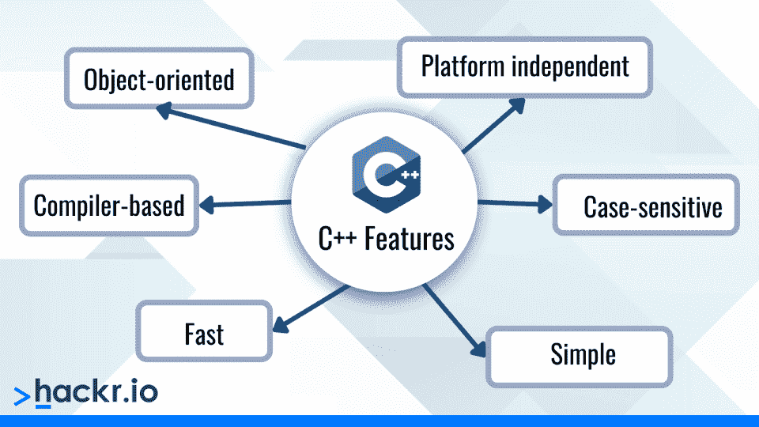

# C#与 C++:势均力敌的比较[更新]

> 原文：<https://hackr.io/blog/c-sharp-vs-cpp>

你可能已经知道 C#和 C++是 2023 年的顶级编程语言中的两种。这是有充分理由的——两者都很容易学习，并且都基于面向对象的编程概念。然而，您可能想知道这两种语言之间有什么不同。在 C#与 C++的战争中，哪一个胜出？

在这次面对面的比较中，我们将研究 C#和 C++并讨论它们的特性、应用和用途。然后，当然，我们将看看它们的相似之处和不同之处，以及它们对编程世界的贡献。所以事不宜迟，让我们直奔主题吧！

## 什么是面向组件的语言？

在我们讨论 C#和 C++之前，我们必须首先定义面向组件的语言。

C#也是基于面向对象的编程，但它遵循组件方法，因为它最初是为在。NET 框架。使用面向组件的编程，您不必担心代码的内部工作，并且可以像这样使用代码，因为每个块或模块都可以单独工作；即每个模块都是独立的组件。

学习 C#比 C++需要更多的经验。如果你已经会 C 了，那么你可以选择两者中的任意一个，但是作为一个非程序员，先学 C 或者 C++再学 C#会更好。是的，C#和 Java 非常相似！

## **什么是 C#？【定义】**

是不是每次看到 C#都读作 C-hash？是的，我知道——但是称它为 C 调更合适，因为这种语言有一些非常尖锐的特征。由微软为。NET 框架，C#是一种面向组件的高级编程语言。

C#和 C++一样吗？简单来说，不是。C#是在 2000 年作为 Java 的竞争对手问世的。这种语言最初被称为“Cool”，现在越来越受需要创建 web 或桌面应用程序的开发人员的欢迎。

C Sharp 的支柱是编程语言 C，尽管 Sharp 做了很多改进，比如自动内存管理、边界检查等等。

### **c#的特点**

****

C#是一种简单而强大的语言，具有许多特性，例如:

*   自动内存管理(垃圾收集)
*   支持所有面向对象的编程概念——封装、多态、继承
*   由于良好的错误处理功能和类型安全，因此非常健壮
*   由于语言的互操作性，使代码重用最大化，从而提高效率
*   一种结构化编程语言，其中复杂的程序可以被分割成更小的、可重用的、易于理解的方法。
*   版本控制允许轻松部署和管理应用程序
*   高性能源于快速执行

### **。NET 公共语言运行时(。NET CLR)**

用 C#编写的程序使用 CLR 转换成本机代码。事实上，CLR 是所有。NET 语言，这就是互操作性的来源！

您可以使用 C#轻松构建 web 应用程序、游戏、web 服务、windows 应用程序和表单。

### **C#代码示例**

下面是一个简单的代码，它将 name 作为用户的输入，然后打印出一条消息

```
using System;
namespacePrintNameApplication {
classPrintUserName {
staticvoidMain(string[] args) {
/* Write user name to console */
 String userName;
userName = Console.ReadLine();
 Console.WriteLine("Hello, " + userName + ". How are you today?");
 }
 }
}
```

这里控制台。ReadLine()从用户处获取值，将其存储在名为 username 的变量中，并使用控制台打印该值。WriteLine 方法。

点击这里查看一些常见的 C#面试问题。

## **什么是 C++？【定义】**

由 Bjorne Stroustrup 开发的 C++最初诞生于产生一种强大的 OOP 语言的想法，这种语言具有成熟但仍被广泛使用的 C 语言的能力。C++被认为是一种“中级”语言，因为它在高级语言和低级语言之间徘徊。

C++是一种面向对象的语言，这使它比过程语言 C 更有优势。对于面向对象的编程方法，数据是最重要的元素。数据与对其进行操作的方法和函数更加紧密地联系在一起，从而保护数据免受任何不必要的或意外的更改。

本质上，C++是“有类的 C”，如果你懂 C，你可以很容易地学习 C++，因为 C++通常被认为是一种“扩展语言”甚至初学者也经常选择 C++，尤其是如果他们更喜欢 OOP 方法的话。考虑到这种语言有许多库，涵盖了开发一个程序所必需的许多主要函数，它变得更加容易掌握。

**建议课程**

**[C#初学者基础:通过编码学习 C#基础](https://click.linksynergy.com/deeplink?id=jU79Zysihs4&mid=39197&murl=https%3A%2F%2Fwww.udemy.com%2Fcourse%2Fcsharp-tutorial-for-beginners%2F)**

### **c++的特性**

****

让我们来看看 C++的一些特性:

*   自下而上的方法更注重数据而不是过程
*   区分大小写的语言–例如，break 和 BREAK 是不同的
*   独立于平台
*   简单快速的高级编程语言
*   基于编译器的语言(不是基于解释器的)

C++作为对 C 的巨大改进而广受欢迎。例如，C++引入了 OOPS、内联函数、方法和运算符重载的概念。

### **C++代码示例**

让我们用 C++编写我们的打印用户名程序。

```
#include
usingnamespacestd;
intmain() {
char username[30];
cout << "Enter user name-";
cin >> username;
cout << "Hello, " << username << ". How are you today?";
return0;
}
```

注意，虽然我们在 C#中将 username 定义为 String，但在 C++中，我们将其声明为 char 数组。

在这个程序中，我们没有创建一个类，但是为了得到 OOPS 的本质，我们应该在程序中有一个类定义。在实际应用中，这就是我们创建 C++程序的方式

```
#include
classtestclass
{
//member variables
int roll;
char name[30];
};
void testclass :: printname(void)
{
cout << “Enter your name: ”’
cin >> name;
cout << “\nGood morning, ” << name;
}
main(){
 testclass tc;
 tc.printname();
}
```

因此，C++程序的一般结构如下:

*   包含语句
*   类别声明
*   类函数及其定义
*   主程序

我们有一个完整的列表，列出了一些最好的 C++教程。

## **c#和 C++有多相似？**

在继续讨论这两种语言的区别之前，我们先来回答一个问题，“C#和 C++相似吗？”作为一种为与 Java 竞争而开发的语言，C#与 Java 的相似性比与 C++更接近。但是，C#和 C++之间仍有一些重要的相似之处，例如:

*   两种语言都是面向对象的，尽管 C#和 C++的语法略有不同。然而，面向对象的概念如多态、继承和类在两者中都有。
*   C++和 C#都被认为是编译语言，这意味着在程序可以在 PC 或服务器上运行之前，它们的代码必须首先转换成二进制。如果你看看你的申请，你会发现。EXE 文件—这些是编译文件的主要例子。

## **c#和 C++有什么不同？**

许多新的(甚至有经验的)开发人员有时会问自己这样一个问题，“C#和 C++有什么区别？”有几个关键的区别，我们将在下面看一看:

*   C#是一种高级编程语言，而 C++被认为是一种中级编程语言，它向其基础语言 C 添加了一些面向对象的功能。
*   C#将其程序编译为 CLR 或公共语言运行库(在本例中为。网)。C++编译成本机代码，这意味着它不需要任何运行时系统。
*   比较这两种语言，你会发现 C++更轻量级。
*   与 C#相比，C++提供了更快的性能，这就是为什么在速度很重要的应用程序中，c++通常是首选。C++更受游戏和其他需要快速性能的软件的欢迎，而 C#更适合不太依赖速度的网络和桌面应用。
*   C#提供自动垃圾收集，而在 C++中，你需要手动为对象释放和分配内存。
*   C#最常用于面向 Windows 的应用程序，而 C++允许程序在 Windows、Mac 和 Linux 上运行。值得注意的是，微软目前正致力于使 C#程序在其他平台上运行成为可能。

## C#与 C++:势均力敌的比较

既然您已经了解了这两者的基础，那么让我们来做一个比较。

| **比较** | **C++** | **C#** |
| **支持面向对象编程** | 支持 [OOPS 概念](https://hackr.io/blog/oops-concepts-in-java-with-examples)，但不完全面向对象 | 支持 OOP 和基于组件的架构(多范式语言)；完全面向对象 |
| **语言类型** | 一种低级编程语言，具有一些高级语言的特征，因此称为中级语言 | 一种高级编程语言，没有复杂的特性，因此容易理解。 |
| **抽象** | 低抽象级别 | 高度抽象 |
| **内存管理** | 像在 C 语言中一样，内存管理是手工完成的 | 像 Java 一样，内存管理是自动的 |
| **性能** | 性能非常高 | 良好的性能，但由于必须先编译，性能不如 C++ |
| **平台支持** | 独立于平台，可以为任何操作系统(平台)编写程序 | 主要针对 Windows 和。NET 框架；很少在窗外使用 |
| **错误警告** | 灵活，你可以编写任何代码，编译器不会产生警告，除非语法不正确 | 更多的控制，编译器预先生成警告和错误，以便减少应用程序运行时错误 |
| **二进制和编译** | 使用轻量级编译器编译 | 因此，使用 CLR 解释成字节码包括了编译前的所有库 |
| **最佳使用案例** | 非常适合游戏、设备驱动程序和服务器端应用等高性能应用 | 非常适合计算机、手机和平板电脑的网络和桌面应用 |
| **数据类型** | C++中的数据类型类似于 C。内置–int、char、float、double 等派生–数组、函数、指针用户定义的–枚举、结构、联合 | 除了原始数据类型，如 int、char、float、double 等..，C#支持引用数据类型，如字符串、数组、类和接口，以及指针数据类型。它还支持枚举和结构。C#也支持集合 |
| **仿制药** | C++使用稍微复杂的模板实现泛型 | C#泛型很灵活，但是与 C++相比，它的功能有限。有关泛型的更多信息，请访问[微软支持页面](https://docs.microsoft.com/en-us/dotnet/csharp/programming-guide/generics/differences-between-cpp-templates-and-csharp-generics) |
| **多重继承** | 支持多重继承 | 不支持通过类的多重继承，但是通过接口可以达到同样的效果，从而简化架构需求 |
| **难度** | 更复杂、更难理解、更陡峭的学习曲线 | 更简单，更容易理解 |
| **独立应用程序** | 在 C++中是可能的 | 在 C#中不可能 |

## **性能应该选哪个？**

当比较 C#和 C++的性能时，你会注意到 C++是一种更快的语言。这背后的原因是 C#在转换成机器码之前必须执行额外的编译步骤。另一方面，C++将代码直接编译成机器的代码，这就是为什么它被认为是一种“本地”语言。

仅从这个事实来看，C++在性能类别中是明显的赢家。

然而，一个程序或应用程序如何执行，除了它的核心语言之外，还有许多因素。因此，尽管 C++速度更快，但关键因素，如使用的框架、代码编写方式等，都会影响应用程序的整体性能。

## **游戏开发应该选择哪个？**

C#和 C++都在视频游戏中使用，但当游戏需要更好的本地硬件性能时，C++是更好的选择。

你对游戏开发语言的选择可能还取决于你是否打算使用游戏引擎，以及可能是哪个游戏引擎。

C#通常只在游戏开发的时候使用。或者如果你打算使用基于 C#的游戏引擎，比如 Unity。另一方面，流行的游戏引擎，如虚幻和 GameMaker，使用 C++。

## **C Sharp vs C++:哪个更好？**

这个问题很难回答。

C++更为突出，被认为是许多新编程语言的基础语言之一，因此许多遗留代码仍在 C++中。然而，C#提供了更高层次的抽象，并提供了自动垃圾收集。

虽然 C++更快，但它不会警告你编译错误，这使它更容易出错。另一方面，C#更严格，保护性更强——它会提前告诉你大多数错误，这样当你运行程序时就不会出现意外。

当性能不是问题，并且您想要构建 web 应用程序时，请选择 C#。如果您的应用程序是服务器端软件，并且需要执行快速操作，C++将是您的理想选择。

## **结论**

对比 C#和 C++，我们可以得出这样的结论:

*   C#最初是作为微软健壮的 Java 编程语言的替代品开发的。它是一种简单的、通用的语言，已经被标准化了，但是我们主要是通过。Windows 上的. NET framework。另一方面，C++是一种学习和使用起来复杂得多的语言。
*   C++要遵循合适的架构，其代码有一定的绑定性。C#代码是作为组件开发的，因此它可以作为一组彼此独立的独立模块工作。
*   C++提供了许多非常适合复杂编程和游戏系统的特性，而 C#提供了简单而有限的特性，通常对于简单的 web 应用程序来说已经足够了。

所以如果你想知道先学哪种语言，考虑一下你的项目需要什么。如果你需要一种更复杂的语言，有更广泛的用例，C++可能是最适合你的。

我们希望这篇比较 C#和 C++的文章能够帮助您找出这两种语言之间的相似之处和不同之处。如果你认为我们错过了什么，请在下面的评论中告诉我们！

**人也在读:**

## **常见问题解答**

#### **1。C#好还是 C++好？**

这取决于你的预期用途。如果你的项目是一个需要高效编程语言的 web 或桌面应用，C#会更好。另一方面，如果你想要速度，C++可能是关键。许多从事视频游戏的开发人员使用 C++是因为它的速度很快。

#### **2。应该先学 C#还是 C++？**

同样，这取决于你打算第一次使用什么。如果你马上需要速度和性能(比如开发游戏)，C++可能是你更好的选择。如果你不想为每件事都关心编码细节，并且你需要快速完成你的项目，C#可能会更好。

#### **3。C++比 C#容易吗？**

当您比较 C Sharp 和 C Plus Plus 时，您首先会注意到的一件事是 C++可以复杂得多。因此，由于这种复杂性，C++确实有一个更陡峭的学习曲线。简单地说，C#是两者中比较容易学的。

#### **4。不懂 C++可以学 C#吗？**

在完全不懂 C++的情况下[学习 C#](https://hackr.io/blog/how-to-learn-c-as-a-beginner) 是完全可能的。C#的学习曲线也很浅，至少与 C++相比是这样。尽管在比较 C#和 C++的语法时，您可能会注意到一些相似之处，这就是为什么如果您已经了解 C++，那么学习 C#可能会更容易。

#### **5。我应该用 C++还是 C#做游戏？**

你可以用 C#和 C++来制作电子游戏。然而，C#和 C++的一个关键区别是，使用 C++，你可以有更好的硬件控制。这导致更多的游戏工作室和开发者选择 C++(除了它更快的性能)进行游戏开发。请注意，在使用 Unity 这样的游戏引擎时，C#可能是一个不错的选择，Unity 主要基于 C Sharp。

#### **6。C#是用 C++写的吗？**

C#基于 C 编程语言。