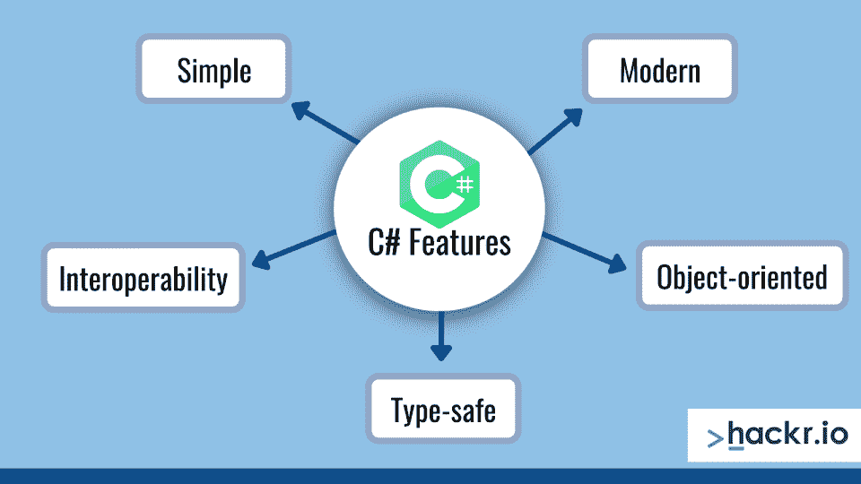
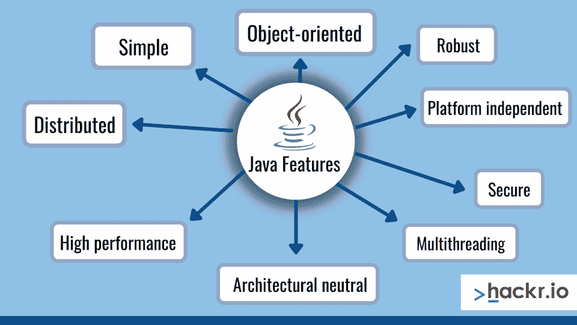
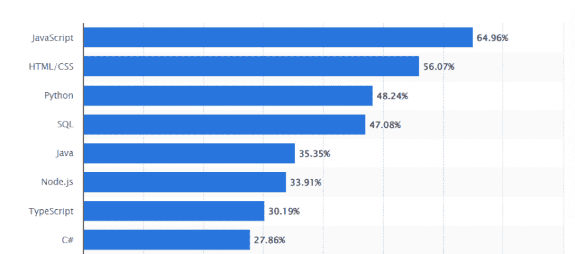

# C#与 Java:哪种语言更好学？

> 原文：<https://hackr.io/blog/c-sharp-vs-java>

也许你是 刚刚开始软件开发和学习编码(并且不知道从哪种[语言开始](https://hackr.io/blog/best-programming-languages-to-learn#:~:text=1.-,Python,to%20develop%20scalable%20web%20applications.)，或者权衡两种语言的优劣以推进你的事业)。在将来的某个时候，你可能想知道你应该学习哪一个:C#还是 Java。无论你处于编程之旅的哪个阶段，我们都将通过本指南帮助你了解 C#与 [Java](https://www.java.com/en/) 的区别。

C#和 Java 都是通用的命令式语言(一种 [编程范例](https://hackr.io/blog/programming-paradigms) 使用一条改变程序状态的语句)。我们来研究一下这两种语言，权衡一下 C#和 Java 的区别。

从高层次来说，Java 和 C sharp 有什么区别？

*   Java 是基于类和面向对象的，而 C#是面向对象和面向组件的。
*   Java 不支持像操作符重载和指针这样的特性，而 C#支持。
*   C#和 Java 都是具有强大社区的高级、通用、面向对象的语言。

让我们进行更深入的比较。第一件事的第一:

## 什么是 C#？

C#是一种通用的、面向对象的编程语言，由微软于 2000 年开发，是其。NET 倡议。特性包括强类型、泛型、面向对象和面向组件。C#是围绕 CLI 标准(公共语言基础设施)设计的。这是一种流行的 [编程语言，适合初学者学习](https://hackr.io/blog/how-to-learn-c-as-a-beginner) 。

C#有以下设计目标:

*   该语言旨在成为一种现代、简单、面向对象的编程语言。
*   C#实现支持软件工程原则，如数组边界检查、垃圾收集等等。
*   这种语言提供了可移植性，因此可以在不同的平台上执行。
*   C#提供了对国际化的支持。
*   C#支持嵌入式系统和操作系统的应用程序。

但是 C#和 Java 相似吗？在比较这两者之前，让我们再谈几个特性。

c#的历史

*   Andres Hejlsberg 在 1999 年设计了 C#。
*   这种语言最初被命名为“Cool”，代表类似 C 的面向对象语言。
*   C#这个名字的灵感来源于音乐符号，也是微软在 1988 年一个未完成的项目中使用的。
*   2005 年 11 月，C# 2.0 发布，增加了泛型。

### c#的特点

*   D 源自 C++和 Java。
*   微软 Visual Studio 的一部分。
*   简单

*   没有指针。
*   没有像“::”或“->”这样的运算符
*   原始类型的变化范围
*   内存管理和垃圾收集是自动的，不需要显式代码。

*   根据当前趋势建造
*   强大、可扩展、强健
*   任何组件都可以变成内置支持的 web 服务

*   支持面向对象的概念，如继承、封装、多态、接口等
*   引入使原始类型成为对象的结构

*   不允许我们进行不安全的强制转换
*   引用类型被初始化为空；编译器自动将值类型初始化为零。
*   数组被边界检查并从零开始索引。

*   包括对基于 COM 和 windows 的应用程序的本地支持
*   VB NET 中的组件可以直接用于 C#

## Java 是什么？

ava 是一种基于类的、面向对象的多范例语言，由 Sun Microsystems 公司开发，詹姆斯·高斯林于 1995 年设计。

它是按照 WORA 的概念(写一次就可以在任何地方运行)设计的，因此是一种独立于平台的语言。Java 应用程序被编译成可以在任何 JVM 上运行的字节码，而不管它的底层操作系统和架构如何。可以为 web 开发、基于 Android 的软件和其他设备发布应用程序。

高级 Java 应用包括嵌入式系统、桌面应用和服务器应用。智能手机、ATM、家庭安全系统等设备都支持 Java。它仍然是开发人员学习的最受欢迎的语言之一，许多 [Java 课程都可以在网上找到](https://hackr.io/blog/best-java-courses) 。

Java 的主要目标:

*   简单且面向对象
*   强大而安全
*   高性能
*   解释型、线程型和动态型

### Java 的历史

*   始于【1991 年 6 月 T3
*   最初设计用于交互式电视
*   最初命名为“橡树”，以戈斯林办公室外的一棵橡树命名。
*   受印度尼西亚一种咖啡的启发，后来被命名为“绿色”，最后被命名为“爪哇”。
*   1996 年，Sun 微系统公司发布了 Java 1.0(有史以来的第一个版本)。
*   1998 年，Java 第二版发布，有多种配置。
*   2006 年，Sun 将版本重新命名为 Java EE、Java ME 和 Java SE。
*   2006 年 11 月，Sun 公司发布了 Java 虚拟机。

### Java 的特性

*   简单: 简单易学，语法简单。
*   面向对象: 它遵循 [OOPs 概念](https://hackr.io/admin/blog/posts/57/https:/hackr.io/blog/oops-concepts-in-java-with-examples) 如继承、抽象、多态和封装。
*   健壮: Java 通过自动垃圾收集器和异常处理来提供内存管理和错误处理异常。
*   平台无关 :在 JRE(Java 运行时环境)的帮助下，它通过在任何平台上运行其应用程序来遵循其 WORA 功能。
*   安全 : Java 的稳定特性帮助我们开发一个无病毒、无篡改的系统。
*   多线程 : Java 多线程设计一个程序同时做几个任务。因此，它利用相同的内存和其他资源来同时执行多个线程。
*   架构中立 :编译器生成字节码，独立于计算机架构。
*   高性能 :说到 C#与 Java 的性能对比，Java 更胜一筹。它使用实时编译器来实现高性能。
*   分布式: 程序可以被设计成在计算机网络上运行。

## C#与 Java:C #与 Java 的相似之处

*   两种语言都是面向对象的，因此支持封装、多态、继承等概念。
*   对 C 和 C++的依赖: C 和 C++都是 Java 和 C#的超集。
*   中间语言代码生成: Java 编译器和 C#编译器编译后生成中间语言代码。C#编译器生成微软中间语言(MSIL)，而 Java 编译器生成 Java 字节码。
*   高级特性: 两种语言都包含了垃圾收集这样的高级特性。
*   句法: 两种语言在句法上很相似。
*   多重继承: 两种语言都支持多重类继承。

[2022 年使用最多的语言(受欢迎程度)- Statista](https://www.statista.com/statistics/793628/worldwide-developer-survey-most-used-languages/)

## c#和 Java 的主要区别

*   运行时环境: Java 运行在 JRE (Java 运行时环境)上，而 C#运行在 CLR(公共语言运行时)上。
*   编程范例: Java 是一种严格的面向对象语言，而 C#是面向对象的、函数式的、强类型的、面向组件的。
*   运算符重载: Java 不支持运算符重载，而 C#支持多个运算符的运算符重载。
*   指针: Java 不支持指针，而 C#只在不安全模式下支持指针。
*   数组: Java 数组是对象的特化，而 C#数组是系统的特化。

**建议课程**

**[C#初学者基础:通过编码学习 C#基础](https://click.linksynergy.com/deeplink?id=jU79Zysihs4&mid=39197&murl=https%3A%2F%2Fwww.udemy.com%2Fcourse%2Fcsharp-tutorial-for-beginners%2F)**

## 【Java 与 C#的直接比较

下面的图表从高层次上比较了这两种语言，帮助你理解 C#和 Java 之间的主要区别。

| 参数 | C# | Java |
| 编程范例 | 面向对象、面向组件、强类型、功能性 | 面向对象 |
| 安装 | 。NET 提供了一个巨大的 C#代码库。 | 要求 JDK 运行 Java |
| 应用 | 网页和游戏开发 | 复杂的网络应用 |
| 范围 | 编程基础好的服务器端语言 | 服务器端交互 |
| 工具 | Visual Studio，Mono 开发 | Eclipse，NetBeans，Intelli J IDEA。 |
| 公共类 | 支持源代码中的多个公共类 | Java 源代码只能有一个公共类。 |
| 检查异常 | 不支持检查异常 | 支持已检查和未检查的异常 |
| 平台依赖性 | 跨平台，支持基于 Windows 和 Unix 的系统 | 独立于平台，但需要 JVM 来执行。 |
| 条件编译 | 支持条件编译 | 不支持条件编译 |
| 定位声明 | 支持定位语句 | 不支持定位语句 |
| 结构和并集 | 支撑结构和接头。 | 不支持结构和联合 |
| 浮点 | 由于 C#不支持 strictfp 关键字，因此不能保证浮点数的结果在所有平台上都相同。 | Java 支持 strictfp 关键字；因此，结果在所有平台上都是一样的。 |
| 人气 | 27.86%的开发者会用 C#编程。 | 35.35%的开发者会用 Java 编程。 |

## Java 与 C#的优缺点

### c#的优势

*   C#提供了 lambda 和泛型支持。
*   语言集成查询(LINQ)
*   安全扩展方法
*   具有获取/设置方法的属性
*   内存管理
*   同类最佳的跨平台支持
*   向后兼容性

### c#的缺点

*   可怜的 GUI
*   必须基于 windows 是。NET 框架)
*   软件是专有的；需要预先购买。
*   多半取决于。Net 框架；不太灵活。
*   执行缓慢，每次修改都需要编译程序。

### Java 的优势

*   P 提供详细的文件
*   提供大量熟练开发人员
*   允许开发标准程序和可重复使用的代码
*   提供多线程环境
*   卓越的高性能
*   大量第三方库
*   轻松浏览图书馆

### Java 的缺点

*   JIT 编译器使程序变慢。
*   Java 对内存和处理要求很高。
*   这种语言不支持像指针这样的低级编程结构。
*   用户无法控制垃圾收集，因为 Java 不提供 delete()或 free()这样的函数。

## c#与 Java 的对比清单

Java 和 C#的大部分操作是相同的。然而，语法上有一些不同，我们将在下面概述。

C#

| Java | 会员权限 | x.y |
| x.y | 型式验证 | 是 |
| 的实例 | 右移 | T2>T4 |
| >> | 操作数 | 不适用 |
| &，&#124;，^ | 带符号左移，右移 | 不适用 |
| < <。>T5 |  | 结论 |

以上总结了 C#和 Java 的区别，包括这两种语言的概述，它们作为 编程语言 的历史，以及它们的相似之处和不同之处。

## 我们将让您快速回顾一下 C$与 Java 的对比:

**选择 C#时:**

你想在。NET 平台。

你对垃圾收集等现代生活品质感兴趣。

*   你需要你的软件快速高效地运行。
*   你正在开发手机应用或游戏。
*   **选择 Java 时:**
*   你想利用充满活力和广泛的代码库和社区。

比起速度或效率，你更需要可移植性和互操作性。

*   您需要构建基于 web 的并发应用程序，或者基于桌面或服务器的应用程序。
*   你更喜欢哪种语言？请在下面的评论中告诉我们！
*   常见问题解答

c#比 Java 好吗？

## C#和 Java 之间的争论由来已久，没有明确的赢家。两种语言各有利弊，合适的选择取决于您的具体需求和偏好。对于手机 app 开发和游戏，一般首选 C#。

### c#和 Java 很像吗？

是的，C#和 Java 很像。这两种语言都是面向对象的、静态类型的，并且具有相似的语法。然而，这两种语言之间有一些重要的区别。C#是微软的语言，而 Java 是甲骨文的。C#和 Java 的这一显著差异导致了平台支持和工具的变化。

### 为什么 C#比 Java 快？

C#通常被认为比 Java 快，尽管差别并不明显。两种语言都被编译，但是 C#使用即时编译器，而 Java 使用提前编译器。这意味着 C#代码通常执行得更快。

### c#是抄袭 Java 的吗？

C#不是抄袭 Java，但是受到了 C++的高度影响，c++受到了 C 和 Java 的影响。这两种语言很相似，但是它们有不同的起源和应用，尽管它们都是通用的面向对象语言。

### c#更接近 C 还是 Java？

比起 Java，C#更接近 C。这是因为 C++(同时受到 C 和 Java 的影响)是 C#最初所基于的语言。然而，C#从 C++中脱离出来，现在更像 Java 而不是 C。

### C #有哪些 Java 没有的东西？

C#有几个 Java 没有的特性，包括运算符重载、类型推断和可空类型。C#也有 LINQ(语言集成查询)，这是一个操作数据的强大工具。

### 从 C#切换到 Java 容易吗？

这两种语言相似。如果你知道一个，你可以很容易地学会。也就是说，在进行转换之前，您应该了解这两种语言之间的一些重要差异。备忘单会有所帮助！

### Is it Easy to Switch from C# to Java?

The two languages are similar. If you know one, you can learn easily. That said, there are some important differences between the two languages that you should be aware of before making the switch. A cheat sheet can help!