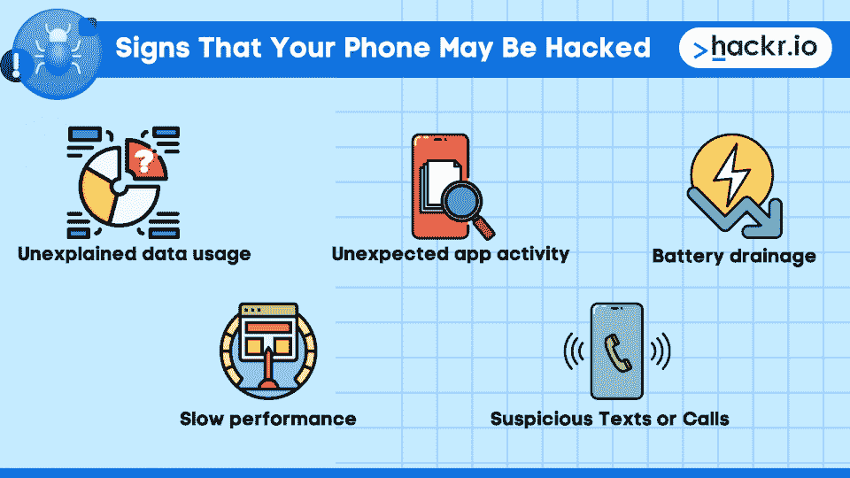
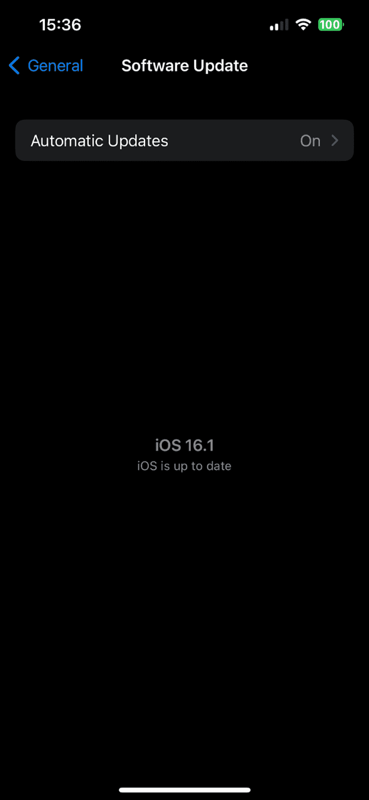

# 7 个代码来检查手机是否被黑客或窃听[+怎么办]

> 原文：<https://hackr.io/blog/code-to-check-if-phone-is-hacked>

你的手机被黑了吗？如果你不确定，有办法可以找到答案。

通过 USSD 码，也称为快速码或特征码，你可以快速检查你的手机是否被黑客攻击。有许多组合来诊断不同的问题，并与代码来检查你的手机是否被监控，你可以确保你是安全的。

还有其他的诊断方法，你可以用一堆方法和技术来诊断和纠正任何对你的智能手机的潜在攻击。

你可能有最新的 iOS 或 Android 设备，并且确信没有人能够侵入你的手机。但全球安全形势会说不同的，如果你试图找出拨打什么来查看你的手机是否被黑客攻击，你是在正确的地方。

随着世界上发生的一切，网络攻击变得越来越普遍，防止它们的一种方法是[学习白帽黑客](https://hackr.io/blog/best-hacking-books)。

## **如果你认为你的手机被黑了该怎么办**

首先，如果你感觉或怀疑你的手机被黑客攻击了，最好还是小心为上。

首先，更改通过您的设备访问的所有帐户的密码和手机的锁屏密码。这可以防止进一步访问您的个人信息。

接下来，考虑您的设备上是否有任何可能受到危害的敏感信息。如果是这样，请考虑如何保护这些信息，以及谁需要得到潜在违规的通知。

如果您也考虑联系您的服务提供商，那将是最好的，因为他们可能有资源和帮助来保护您的设备。

有了 USSD 码，你还可以轻松地检查手机上的任何异常活动，如意外的数据使用或奇怪的短信和电话。

## **你的手机可能被黑客攻击的迹象**

****

### 1.**无法解释的数据用途**

如果你的手机遭到黑客攻击，你首先会注意到的是无法解释的数据使用。如果你的计划有一个数据限制，而你发现自己无缘无故地超过了它，这可能是因为有人在你不知情的情况下使用了你的数据。

黑客可以在你的手机上安装恶意软件，在你不知情的情况下在后台使用你的数据。

要检查无法解释的数据使用情况，请在设置应用程序中查看您手机的数据使用历史记录。如果你看到任何应用程序使用比平时更多的数据，或者如果你甚至没有使用你的手机时有数据被使用，这些可能是你的手机被黑客攻击的迹象。

### **2。意外的应用活动**

你的手机可能被黑客攻击的另一个迹象是来自你不经常使用的应用程序的意外活动。如果你从一个你很少使用的应用程序中看到通知或其他活动，很可能有人在你的手机上安装了恶意软件，并使用该应用程序来监视你或窃取你的信息。

要检查意外的应用程序活动，请浏览手机上的应用程序列表，看看是否有您不记得安装过或很长时间没有使用过的应用程序。如果你看到任何可疑之处，请立即删除该应用。

黑客有时会在您不知情的情况下在您的手机上安装恶意应用程序(尤其是 web 应用程序)，以获取您的个人信息或窃取登录凭据和银行信息等敏感数据。

这些通常是[网站域名小程序](https://hackr.io/blog/top-10-open-source-security-testing-tools-for-web-applications)，可以导致脚本在你的智能手机上运行。你也可以学习[如何黑掉一个网站](https://hackr.io/blog/how-to-hack-a-website)来对抗这种事情。

### **3。电池消耗**

如果你的电池开始异常快速地耗尽，这可能是你的手机有问题的另一个信号。这通常是由后台运行的恶意软件引起的，可以通过在设置应用程序中检查您的电池使用历史来确认。如果你看到一个应用程序在你不使用它的时候也在消耗大量的电池电量，这很有可能是一个恶意软件，你的手机已经被黑客攻击了。

### **4。性能缓慢**

你的手机可能有问题的最后一个迹象是，如果它开始运行缓慢或行为怪异。

有几个因素可能导致这种情况，但如果你怀疑你的手机被黑客攻击，这可能是因为有恶意软件在后台运行，导致你的手机运行出现问题。

要检查这一点，打开设置应用程序，并前往“关于手机”部分。然后查看“系统更新”部分，看看是否有适用于您的操作系统和应用程序的更新。如果有，请立即安装，因为它们可能包含安全补丁，有助于保护您的手机免受黑客攻击。

### **5。可疑短信或电话**

如果你开始收到来自你不认识的号码的短信或电话，或者如果你的朋友和家人开始告诉你他们一直收到来自你的号码的陌生短信或电话，这是你的电话可能被黑客入侵的迹象。黑客经常假冒您的电话号码来访问您的联系人列表、发送垃圾邮件或拨打不需要的电话。

## 什么是 USSD 电码？

USSD 码，也称为“非结构化补充业务数据”码，是可以输入到电话中以访问各种功能和信息的短码。这些代码通常用于检查帐户余额、激活服务和解决技术问题。

值得注意的是，USSD 代码可能会让黑客获得你手机上的敏感信息，所以只使用可靠的来源并且不要与任何人分享它们是非常重要的。

## **USSD 码检查手机是否被黑客攻击**

USSD 代码通常以*或#开头，只需按住电话上的*或#键，然后输入代码即可。USSD 码可以用来查询你的余额，给你的账户充值，甚至给另一个手机用户汇款。

要使用 USSD 代码，只需将代码输入您的手机，然后等待响应。响应通常会以弹出消息的形式出现在您的屏幕上。在某些情况下，您可能需要输入其他信息，例如您的 PIN 码，然后才能访问该服务。

### **被黑**

***#06#** -这个代码会显示你手机的 IMEI 号。IMEI 号码是分配给每个移动设备的唯一标识符。如果你看到一个不同的 IMEI 号码，而不是通常与你的手机相关联的号码，那么你的手机可能已经被黑客攻击了。

***#062#** -此代码将显示您的 SIM 卡上次更新的日期。如果您看到一个您不认识的日期，或者如果列出的日期与您上次更新 SIM 卡的日期明显不同，您的手机可能已被黑客攻击。

***#21#** -此代码将显示您的电话被转移到的号码列表。如果您看到列出了任何您不认识的号码，或者如果您的电话被转移到您没有设置的号码，则您的电话可能已被黑客攻击。

### **为被轻击**

***#*#1472365#*#*** -此代码将显示您的设备的 GPS 位置是否发生任何异常。如果有人启用了 GPS 欺骗，这个代码会让你知道。GPS 欺骗是一种黑客行为，黑客会欺骗你的手机，让它以为自己在某个不在的地方。这可以用来跟踪你的行动或拦截你的电话和短信。要检查你的手机是否被黑客以这种方式入侵，只需输入代码到你的拨号器，然后点击发送。如果一切正常，你就可以走了。如果没有，是时候开始采取措施保护您的设备了。

***#*#7780#*#*** -此代码将帮助您将设备重置为出厂设置。如果你怀疑你的手机被黑了，想从头开始，这很有用。请记住，这将删除设备上的所有数据，因此在继续操作之前，请务必备份所有重要文件。要重置您的设备，只需将代码输入您的拨号器，然后点击发送。按照屏幕上的提示操作，瞧！你的设备会像新的一样。

***#*#34971539#*#** * -如果你曾经看着你手机的摄像头，并认为有人可能在背后窥视，你可以检查一下你的怀疑是否属实。这个代码可以让你访问关于摄像机硬件的信息，包括它最后一次使用的时间和它是什么类型的摄像机。只需输入代码到您的拨号器，并点击发送查看此信息。如果你看到任何不寻常的活动，这是一个很好的迹象，有人一直在未经你的允许使用你的相机。

***#*#197328640#*#*** -此代码让您可以访问您设备的网络信息，包括信号强度和正在使用的手机信号塔。虽然这些代码可能不会明确地告诉你你的手机是否被黑客攻击，但它们可以给你一个很好的指示，说明你的设备上有任何奇怪的活动。如果您在这里看到任何不寻常的活动，这可能表明有人正在监视或篡改您的网络连接。如果有什么不对劲，采取措施保护你的手机和你的个人信息是很重要的。

## **如何在你的 iOS 或 Android 手机上拦截黑客的技巧**

1.  定期更新你的软件:保护你的手机免受黑客攻击的最好方法之一就是确保你运行的是最新版本的操作系统。这是因为开发人员一直在努力修补可能被恶意软件或攻击者利用的漏洞。因此，如果你没有运行最新版本的 iOS 或 Android，你可能会让自己容易受到攻击。
2.  使用安全的锁屏模式或密码:另一种增强安全性的简单方法是使用强锁屏模式或密码。这样，即使有人设法拿到了你的设备，他们也很难获取你的信息。请记住，模式有时是可以猜测的，因此长而复杂的密码通常是最佳选择。此外，避免使用容易猜到的词，如“密码”或容易获得的个人信息，如你的生日。
3.  **安装安全应用:**iOS 和 Android 设备上有很多不同的安全应用。这些应用程序可以帮助阻止恶意软件，甚至在您的设备被篡改时提醒您。其中许多都是免费的，所以没有理由不安装。请务必在安装任何东西之前做好调查，因为一些安全应用程序本身就包含恶意软件。
4.  **小心公共 Wi-Fi 网络:**当你出门在外时，连接到公共 Wi-Fi 网络可能会诱使你节省数据计划。然而，这些网络通常是不安全的，这意味着它们是黑客的主要目标。因此，除非你绝对需要连接，否则最好完全避开公共 Wi-Fi。

## **结论**

理想情况下，最新的智能手机有很多安全性，但黑客也不傻。他们在软件更新上一直处于一场猫捉老鼠的竞赛中。你应该随时更新智能手机中的软件，尤其是 Android，因为它是开源系统。

无论您的移动系统如何，如果您注意到任何迹象，请务必遵循上述步骤。

**学习如何破解智能手机**
[完整的手机道德黑客课程](https://click.linksynergy.com/deeplink?id=jU79Zysihs4&mid=39197&murl=https%3A%2F%2Fwww.udemy.com%2Fcourse%2Fthe-complete-mobile-ethical-hacking-course%2F)

## **常见问题解答**

#### **1。*#21 告诉你的电话是否被窃听？**

不，*#21 是显示您呼叫转移状态的代码。它不会告诉你你的电话是否被窃听。

#### **2。##002 对你的手机做了什么？**

##002 是将手机重置为出厂设置的代码。它不会告诉你，如果你的手机被黑客攻击，但它可以帮助删除任何被攻击的软件在你的设备上。

#### **3。我如何知道我的安卓手机是否被黑了？**

你的 Android 手机可能被黑客攻击的一些常见迹象包括奇怪或意想不到的行为，数据使用量突然增加，以及不熟悉的应用程序或通知。您还可以使用安全应用程序来检查您设备上的任何恶意软件。

#### **4。你能解开你的手机吗？**

如果你怀疑你的手机被黑客攻击了，第一步就是修改储存在手机上的密码。然后，使用应用程序或防病毒软件运行安全扫描。你也可以将你的手机重置为出厂设置，尽管这将会删除你所有的数据。重要的是要注意，没有保证的方法来“破解”设备，因为黑客攻击的程度将决定最佳的行动方案。定期备份您的设备总是一个好主意，以防需要重置。让你的软件和应用保持最新，并小心连接到公共网络也很重要。

#### **5。你能看出你的手机是否被监听了吗？**

有了 USSD 码*#06，你可以检查你的手机的 IMEI(国际移动设备身份)号码。如果这个号码在你不知情的情况下被更改(不同于电话盒上的号码)，这可能是有人在监控或跟踪你的设备的信号。其他迹象可能包括意外的崩溃或冻结，异常高的数据使用率，以及奇怪或不熟悉的应用程序或通知。定期检查设备上的任何异常或可疑活动总是一个好主意。

#### **6。检查我的手机是否被黑客攻击或窃听的代码是什么？**

你可以检查手机上任何不熟悉或可疑的活动，使用应用程序或防病毒软件运行安全扫描，并检查设备的 IMEI 号码。有一堆代码来检查手机是否被黑客攻击，以检查相同的。然而，没有一个代码可以知道所有的事情。定期监控你的手机是否有任何异常活动是很重要的。