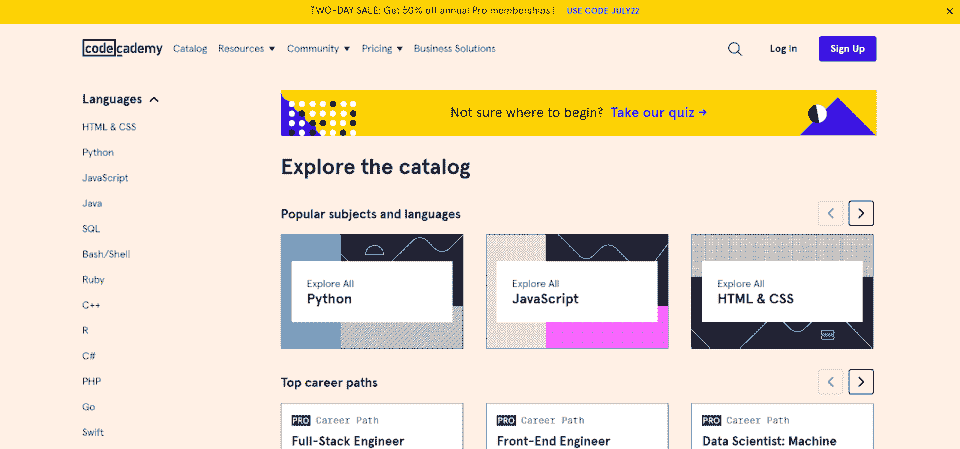
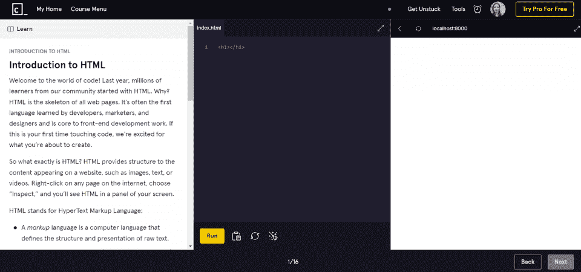
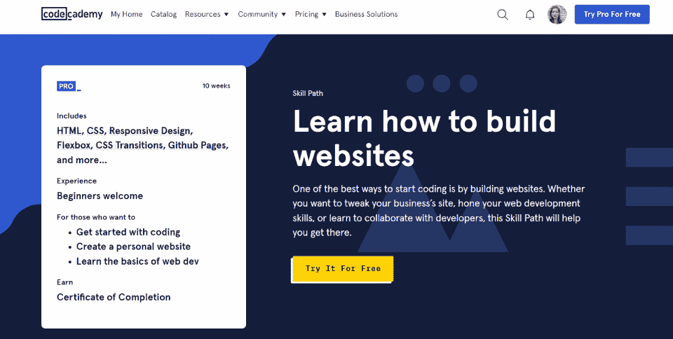
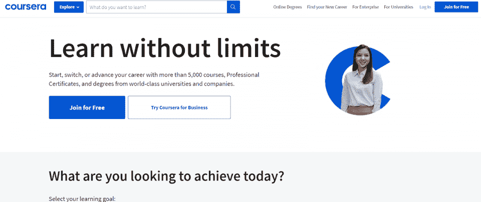
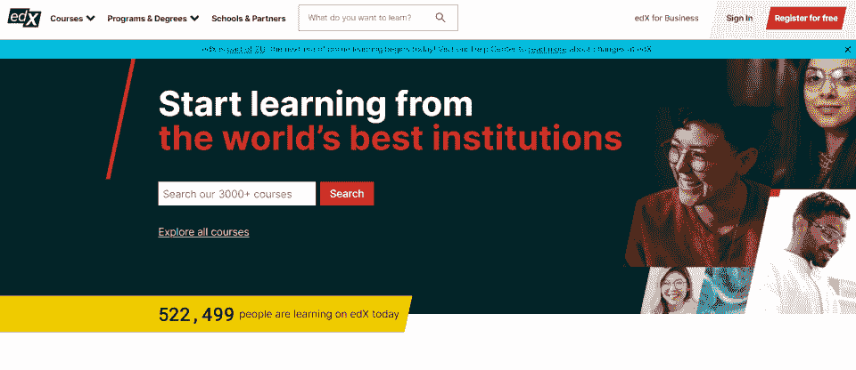

# 2023 年 Codecademy 回顾:优点、缺点和选择

> 原文：<https://hackr.io/blog/codecademy-review>

Codecademy 是对学习编码感兴趣的学生最好的互动学习平台之一。Codecademy 的学生可以学习从基本编程和开发原则到高级编程技术的一切内容，尽管像许多在线学习平台一样，课程质量可能会有所不同。

| 教练 | 4/5 |
| 课程 | 5/5 |
| 经验 | 5/5 |
| 总数 | 4.5/5 |

一目了然:

*   Codecademy 主要专注于编程、设计、开发课程和功能技能，让学生成为更好的程序员。
*   Codecademy 的交互平台可以很容易地从头开始“体验”编程，并立即编写代码。
*   Codecademy 有许多免费课程可供选择，也有付费的高级课程。
*   Codecademy 给你一个高质量的选择，而不是寻找一门语言或学科的“最佳”课程。
*   Codecademy 证书值有限。你将主要通过你在课程中的工作而不是证书来证明课程的价值。

## Codecademy 合法吗？

我们的 [Codecademy](https://www.pntra.com/t/TUJGR0lLR0JHRklKSkdCR0ZISk1N?url=https%3A%2F%2Fwww.codecademy.com%2F) 评论将涵盖 Codecademy 的导师、课程和学习平台的所有内容。

## Codecademy 提供了什么？

与其他在线学习市场相比，Codecademy 的产品似乎有限。Codecademy 有大约 1800 门基础和专业课程。课程要么专注于特定的语言(JavaScript、Python 或 C++)，要么专注于特定的学科(web 开发、数据科学，甚至数学)。

但是，尽管 Coursera 或 Udemy 可能有成千上万的课程，Codecademy 的课程在质量上仍然较少变化——每门课程最终都会给学生提供基本的功能性技能。Coursera 和 Udemy 允许教师上传他们自己的课程，所以你可以找到 1000 门关于全栈开发的课程。Codecademy 策划其课程；只有一个高质量的课程。

Codecademy 将其课程分为“免费”和“专业”此外，还有“职业道路”课程，它是更广泛的职业学科的一部分，还有“技能道路”课程，它将课程整合成一个单一的学习路径。

### **热门免费代码课程**

Codecademy 以其免费课程而闻名，这是开始学习编程语言或计算机科学学科的一个很好的方式。

他们最受欢迎的课程包括

*   [学习 JavaScript](https://www.gopjn.com/t/TUJGR0lLR0JHRklKSkdCR0ZISk1N?url=https%3A%2F%2Fwww.codecademy.com%2Flearn%2Fintroduction-to-javascript) 。一个初学者友好的“语言流利”课程，有 11 个实践，交互式编码课程。
*   [学习 HTML](https://www.pntrs.com/t/TUJGR0lLR0JHRklKSkdCR0ZISk1N?url=https%3A%2F%2Fwww.codecademy.com%2Flearn%2Flearn-html) 。快速、简单地介绍最流行的标记语言，也是开发网站最快、最简单的方法。
*   [学 Python 2](https://www.gopjn.com/t/TUJGR0lLR0JHRklKSkdCR0ZISk1N?url=https%3A%2F%2Fwww.codecademy.com%2Flearn%2Flearn-python) 。一个关于 Python 的深度初学者课程，总共包括 20 节课和交互式编码项目。

一般来说，大部分初级编码课程都是免费的。但是，中级编码课程和特定技术的课程更有可能包含在“Pro”订阅中。

### **热门专业代码课程**

成为“专业”Codecademy 课程并不一定意味着课程更好。“专业”Codecademy 课程倾向于更加具体和小众，而不是更高的质量。

一些最受欢迎的专业课程包括:

*   [学 Python 3](https://www.gopjn.com/t/TUJGR0lLR0JHRklKSkdCR0ZISk1N?url=https%3A%2F%2Fwww.codecademy.com%2Flearn%2Flearn-python-3) 。一个初学者友好的“语言流畅性”课程，关于当今发展最快的编程语言。
*   [学习命令行](https://www.pntrs.com/t/TUJGR0lLR0JHRklKSkdCR0ZISk1N?url=https%3A%2F%2Fwww.codecademy.com%2Flearn%2Flearn-the-command-line)。一个关于在不同的应用程序中使用命令行来控制你的软件开发过程的课程。
*   [学习 Git & Github](https://www.pjtra.com/t/TUJGR0lLR0JHRklKSkdCR0ZISk1N?url=https%3A%2F%2Fwww.codecademy.com%2Flearn%2Flearn-git) 。世界上最流行的软件库介绍。

如你所见，这些类并不深入。它们甚至更短；学习命令行是一门四节课的课程。Codecademy 的主要策略似乎是向编码社区提供广泛的通用课程，并对其更适合的内容收费。

### **热门职业道路代码课程**

Codecademy 不提供任何学位项目或专业，但它确实将其一些课程捆绑到一条“职业道路”中。职业道路课程包括编码挑战、工作空间、文件夹项目和面试准备。

一些最受欢迎的代码学院职业道路包括

*   [数据科学职业道路](https://www.pjatr.com/t/TUJGR0lLR0JHRklKSkdCR0ZISk1N?url=https%3A%2F%2Fwww.codecademy.com%2Flearn%2Fpaths%2Fdata-science%3Futm_source%3Dccblog%26utm_medium%3Dccblog%26utm_content%3Dchoose-pro-path)。数据科学是当今发展最快的专业。Codecademy 的数据科学职业道路将带您了解 SQL、Python 和基本的数据科学原理。
*   [前端工程师职业道路](https://www.pjatr.com/t/TUJGR0lLR0JHRklKSkdCR0ZISk1N?url=https%3A%2F%2Fwww.codecademy.com%2Flearn%2Fpaths%2Ffront-end-engineer-career-path%3Futm_source%3Dccblog%26utm_medium%3Dccblog%26utm_content%3Dchoose-pro-path)。通过 Codecademy 的前端工程师职业道路，学习设计、开发和编程完整的用户体验，包括 HTML、CSS 和 JavaScript。
*   [后端工程师职业道路](https://www.pntra.com/t/TUJGR0lLR0JHRklKSkdCR0ZISk1N?url=https%3A%2F%2Fwww.codecademy.com%2Flearn%2Fpaths%2Fback-end-engineer-career-path%3Futm_source%3Dccblog%26utm_medium%3Dccblog%26utm_content%3Dchoose-pro-path)。结合前端工程师职业道路学习全栈开发。这条职业道路包括 JavaScript、SQL 和其他后端技术。

这些职业道路相当广泛。然而，雇主们是否会认真对待这些问题，还存在一些变数。在 Codecademy 职业道路上“作弊”并不难；真正的价值在于你创造的投资组合。

| Codecademy 获得认证了吗？不。虽然 Codecademy 确实提供专业课程和职业道路的结业证书，但 Codecademy 本身并不被认可。Codecademy 遵循自定进度和自学的原则:作为专业人士，学习和成长的责任真正落在学生身上。 |

## Codecademy 是给谁的？CodeAcademy 有什么好的吗？

Codecademy 是寻求学习新语言的程序员和开发人员的最佳和最直接的平台。大多数其他在线学习中心有一个相当广泛的焦点；即使他们专注于编程和开发，他们的分布也相当分散。

相比之下，Codecademy 的课程设计得非常紧凑。Codecademy 涵盖了 15 种最流行的编程语言*和*大多数流行的编程和计算机科学学科。

您可以使用 Codecademy 来:

*   改善你目前的职业前景。
*   学习一门新的编程语言或开发技术。
*   在计算机科学领域内转换学科。

Codecademy 值得吗？只要你能找到你需要的语言或学科，它的大多数免费课程都可以与网上的其他优质课程相媲美。

但是，虽然大多数 Codecademy 评论给该平台打了高分，但你应该考虑其他因素——比如雇主的看法。

## 雇主们认真对待 Codecademy 吗？

你可能找不到工作，因为你有 Codecademy 的共享证书。大多数 Codecademy 课程与教师无关；这是一个自定进度的学习平台。

然而，你将通过 Codecademy 开发作品集项目，并且(理想情况下)你将能够练习和回答技术面试问题。

Codecademy 证书并不一定比其他在线证书更能证明你的知识；这是好事，但你需要项目来支持它。

| **通过 Codecademy 提高员工忠诚度**Codecademy 不只是为求职者准备的。如今，67%的雇主[正在经历员工保留率下降](https://www.pntrs.com/t/TUJGR0lLR0JHRklKSkdCR0ZISk1N?url=https%3A%2F%2Fwww.codecademy.com%2Fresources%2Fblog%2Fwhat-boosting-retention-looks-like-during-the-great-resignation%2F)。根据 Codecademy 的说法，雇主可以通过技术技能培训来提高他们的保留率(和士气)。 |

## **如何注册和使用 Codecademy**

Codecademy 的课程完全是自定进度的。你选择一门你想学的课程并报名参加。每门课程都由单独的小课组成。您需要完成课程才能继续前进。

因为这些课程完全是自定进度的，所以他们会感到有些孤独。你不会与其他学生或教师互动；你只是在真空中编程。但是，课程体系会给你尽可能多的帮助。

### **Codecademy 的编程沙盒**

Codecademy 课程最吸引人的一个方面是它的编程沙箱。每一节 Codecademy 课程都侧重于在编程中传授可行的技能。为此，本课程提供了一个由三个面板组成的屏幕，其中包括:课程、您的代码以及代码是否编译。

上面的格式几乎是 Codecademy 中每一课的格式。在最左边，你会看到对你必须学习的技能的解释。在中间，您将编写您的代码。最后，在右边，你可以正确或错误地编译它。

### 如何开设 Codecademy 账户:Codecademy 是免费的吗？

大多数 Codecademy 课程是完全免费的。你可以使用谷歌或脸书的账户注册，几秒钟内就可以进入课程。

您需要订购 Codecademy Pro 课程。费用由您决定，因为这些课程是自定进度的，Codecademy 提供每月订阅计划。

## Codecademy 的费用是多少？免费版、专业版和专业版

Codecademy 为个人、学生和企业提供计划。

对于个人，可以注册 Pro Lite(14.99 美元/月)或 Pro(19.99 美元/月)。唯一的区别是你是否得到面试准备或职业道路。

对于学生来说，你可以以 149.99 美元/年的价格注册，并获得完整的 Codecademy 平台。

对于企业来说，你可以以每个用户每年 299.99 美元的价格注册，以支持整个团队，或者为大型企业定制报价。

Codecademy 可能会提供一些最好的免费编码训练营，所以你不需要订阅 Pro Lite 或 Pro。

### **学院退款和取消政策**

如果您每年支付月费，就可以获得 Codecademy 的最佳定价。但是，如果您这样做，将无法退款。退款不适用于任何试用后专业订阅费。

虽然您可以随时取消您的帐户，但您需要为您注册的订阅付费，如果您不确定，可以从每月订阅开始。

| **Codecademy Pro Lite 与 Codecademy Pro**Codecademy Pro Lite 和 Codecademy Pro 的唯一区别是，Codecademy Pro 提供职业道路功能和面试支持。如果你不打算走 Codecademy 职业道路，你可以使用 Codecademy Pro Lite。 |

## **用 Codecademy 真的能学会编码吗？**

这是关于 Codecademy 最常见的问题之一。答案？不同的人会学的不一样。

大多数面向编码的平台会指导你尽快开始编程，Codecademy 也不例外。如果你是那种“边做边学”的人，那么你会很快开始学习 Codecademy。

相反，如果你是那种通过观看视频、阅读教案和与教师互动来吸收知识最多的人，你就不会通过 Codecademy 来学习。Codecademy 提供功能知识，并试图让你尽快开始编程。

## **共同学院技能路径和共同学院职业路径**

大多数代码学院的学生可能会选择用他们喜欢的编程语言学习一两门课程。但是 Codecademy 确实提供了“技能路径”和“职业路径”。

“技能路径”是课程的集合:精选的内容。例如[“用 HTML、CSS 和 Github 构建网站”](https://www.pntrs.com/t/TUJGR0lLR0JHRklKSkdCR0ZISk1N?url=https%3A%2F%2Fwww.codecademy.com%2Flearn%2Fpaths%2Flearn-how-to-build-websites)技能路径，包括 HTML、CSS 和 Github。

技能路径比个别课程更深入，但它们不包括职业路径的高级功能，如面试帮助或职业准备。

职业道路会给你更多关于某一特定学科的直接的、行业相关的、可操作的知识。虽然 Codecademy 并不能为你找到工作提供太多直接的支持，但它会帮助你准备一份文件夹，捍卫你的技能。

## Codecademy 证书:Codecademy 会颁发证书吗？

Codecademy 在课程完成后提供证书，但 Codecademy 证书的价值是高度可变的。

如前所述，你不与其他学生或教师互动，这意味着任何人都可以为你参加课程。与 Coursera 等其他学习市场不同，Codecademy 的课程通常不是由知名机构或教师提供的。

虽然你应该在简历中加入文凭(这很有帮助)，但你不应该依赖文凭的价值来找工作。相反，你应该专注于发展你的知识和技能，并在 Github 上创建一个作品集。

## **Codecademy 最受欢迎的课程**

Codecademy 是从头到尾学习编程语言的最直接的方法。虽然 Codecademy 的课程都是初级或中级水平(你不会成为某个给定语言的专家)，但它们可以在短短几分钟内让一个程序员从一无所知变成编程高手。

一些最受欢迎的课程包括

*   [学 Java](https://www.pntrs.com/t/TUJGR0lLR0JHRklKSkdCR0ZISk1N?url=https%3A%2F%2Fwww.codecademy.com%2Flearn%2Flearn-java) 。鉴于其可移植性和实用性，Java 仍然是世界上最流行的编程语言之一。但是学起来并不容易。初学者将通过 16 节课学习 Java。
*   [学习 SQL](https://www.pntra.com/t/TUJGR0lLR0JHRklKSkdCR0ZISk1N?url=https%3A%2F%2Fwww.codecademy.com%2Flearn%2Flearn-sql) 。许多编程语言都使用 SQL 来创建数据库并与之交互。程序员只需上四节课就能学会 SQL 的基础知识。
*   [学习 C++](https://www.gopjn.com/t/TUJGR0lLR0JHRklKSkdCR0ZISk1N?url=https%3A%2F%2Fwww.codecademy.com%2Flearn%2Flearn-c-plus-plus) 。C++是一种功能强大的通用语言，具有很多实用性。一个开发者可以在 13 节课内学会 C++。
*   [学 CSS](https://www.pntra.com/t/TUJGR0lLR0JHRklKSkdCR0ZISk1N?url=https%3A%2F%2Fwww.codecademy.com%2Flearn%2Flearn-css) 。CSS 是前端 web 开发的一部分。一门中级水平的课程，这门课将用 8 节课讲授 CSS 的基础知识。
*   [学 C#](https://www.pntrac.com/t/TUJGR0lLR0JHRklKSkdCR0ZISk1N?url=https%3A%2F%2Fwww.codecademy.com%2Flearn%2Flearn-c-sharp) 。C#是轻量级编程和应用程序开发的理想选择。这个深入的课程用 20 节课教完全的初学者如何用 C#编程。

除了 CSS 课程之外，所有这些课程都是中级水平，尽管(老实说)CSS 课程也可以由初学者学习。然而，值得注意的是，Codecademy 最受欢迎的课程是编程语言，而不是计算机科学学科。

## **在 Codecademy 上寻找最佳课程的技巧**

讲师在 Codecademy 上并不常见。在所有的在线学习平台中，Codecademy 拥有最一致的课程——它们都是以小块形式提供的高质量互动课程。

要在 Codecademy 上找到最好的课程:

*   确定您是否需要个人课程、技能途径或职业途径。
*   浏览该编程语言或学科的可用课程。
*   复习课程中包含的材料。

在 Coursera 或 Udemy 上，寻找最佳课程的主要方法是查看用户评论和星级。但是 Codecademy 没有 18 门关于 Python 2 的课程——它只有一门。

## **Codecademy:优点、缺点和用户评论**

| **优点** | **缺点** |
| 学习编程的绝佳平台

*   紧紧围绕前端和后端开发
*   职业道路和专业发展专业订阅
*   完全自我导向

 | 证书没多大关系

*   PCMag 对 Codecademy 的评分为 4 分(满分 5 分)，Codecademy 保持了 TrustPilot 的评分 [4.2 分(满分 5 分](https://www.trustpilot.com/review/codecademy.com))，远高于大多数类似平台。Codecademy 的体验通常比大多数在线编程课程更紧凑、更有价值，但有一点需要注意；你不会得到个人或个性化的关注。
*   如果你被困在 Codecademy 课程中，你可以点击“摆脱困境”按钮进入一系列论坛。很大程度上，这是你获得帮助的唯一途径。如果你通常是一个自定进度的学习者，这不是问题。如果你需要和一位教师交谈，或者你是 IT 和编程的新手，你可能会发现这种体验极其复杂。

 |

代码学院的替代方案

Coursera、edX 和 Udemy 都是 Codecademy 最受欢迎的替代品。然而，他们也有更广泛的方法。虽然其他人仍然专注于计算机科学，但他们也有其他学科的课程。

## **代码学院**

**Coursera**

| **edX** | **我们打** | **类** | 1,800+ | 7,000+ |
| 3,000+ | 185,000+ | **学生** | 四千五百万 | 八千二百万 |
| 1.1 亿 | 四千万 | **成本** | 39 美元/月 | 39 美元/月 |
| 50 到 300 美元 | 12 美元到 200 美元 | 文件:Coursera.png，Alt: Coursera 截图。Coursera 专注于广泛的 IT 学科和编程。 | **1。Coursera:认证和学位途径** | **** |

Coursera 提供了质量和数量的巨大平衡。Coursera 的课程总体质量高于 Udemy。许多是由著名的机构提供的，如密歇根大学。

### 事实上，你可以通过 Coursera 获得认证机构的学位(虽然不是所有的学位路径都会被认证)。由此看来，Coursera 课程和证书可能比 Codecademy 更有价值，但 Codecademy 仍然提供了一种从头到尾学习编程语言的更直接的方法。

文件:edX.png，Alt: edX 截图。edX 提供美国最好学校的学习内容。

**2。edX:向常春藤联盟学习**

****

如果你曾梦想获得常春藤联盟的教育，edX 是你的最佳选择。你将获得麻省理工学院、耶鲁大学和哈佛大学的课程资料。

### 和其他平台一样，可以免费上一门课，但是不交钱就拿不到证书。大多数课程只需几百美元，由该领域内极负盛名的知名讲师授课。

文件:Udemy，Alt: Udemy 截图。Udemy 的课程种类最多。

**3。Udemy:所有你想要的课程**

****

Udemy 的课程可能是质量最不稳定的，因为 Udemy 允许任何教师在市场上发布课程。但与此同时，这意味着你会从特定的游戏开发商那里找到更多的利基信息，比如游戏开发。Udemy 有迄今为止最广泛的一系列课程。

### 最终，Codecademy 几乎没有其他学习平台可供选择。但它提供了价值，因为它拥有高度互动的课程，旨在为你提供可操作的、与职业相关的技能。

**结论:Codecademy 值得吗？**

以我的经验来看，Codecademy 是真正想从头到尾学习一门语言的爱好者和专业人士的最佳平台，它可能没有最有价值的证书或最投入的教师。不过，它有一个干净的，交互式的界面，让你在几分钟内编程。

更好的是，最受欢迎的 Codecademy 课程都是免费的。即使你没有获得免费课程的结业证书，你也可以开始创建项目和文件夹。只是要注意，如果你被困住了，你可能只能靠自己。

## 如果你喜欢我们的 Codecademy 评论，可以看看我们对 Udacity 等学习平台的其他评论。

*[今天就来探索我们的 Udacity 评论吧！](https://hackr.io/blog/udacity-review)*

**常见问题解答**

**1。Codecademy 好吗？**

Codecademy 是学习编程语言、设计和开发的最佳在线课程平台之一。通过 Codecademy，学生可以参与交互式课程计划，规划职业道路，并建立自己的编程组合。

## **2。Codecademy 课程值得吗？**

#### 不仅大多数付费的“专业”Codecademy 课程物有所值，而且该平台上最受欢迎的课程完全免费。你可以立即开始使用 Python、JavaScript 或 HTML，而无需支付任何费用。

**3。你真的能学会用 Codecademy 编码吗？**

#### 那要看你了。如果你期待教师指导的材料或与其他学生合作，没有。如果你想通过自我驱动的课程开始编程，那么是的。

**4。Codecademy 被认可了吗？**

#### Codecademy 未经认证。虽然它会在完成时为您提供一个证书(如果您已为 Pro 或 Pro Lite 订阅付费)，但该证书可能会根据雇主的不同而有不同的值。

**5。Codecademy 证书是免费的吗？**

#### 虽然你可以免费参加 Codecademy 上的大多数热门课程，但除非你付费订阅，否则你不会获得证书。付费会让你得到一个可分享的证书，你可以把它添加到你的简历中。

**6。能把 Codecademy 写进简历吗？**

#### 绝对的。但是要注意，有些雇主可能不尊重这种证书。因为 Codecademy 是一个几乎完全自我管理的学习平台，你需要展示你的技能来支持你的学习。一般来说，这意味着在 Github 上建立一个投资组合或代码库。

While you can take most of the popular courses on Codecademy for free, you won’t get a certificate unless you pay for the subscription. Paying will get you a shareable certificate that you can add to your resume.

#### **6\. Can You Put Codecademy on Your Resume?**

Absolutely. But be aware that some employers may not respect the credential. Because Codecademy is an almost entirely self-managed learning platform, you need to show off your skills to back up your learning. In general, that means building a portfolio or a repository of code on Github.