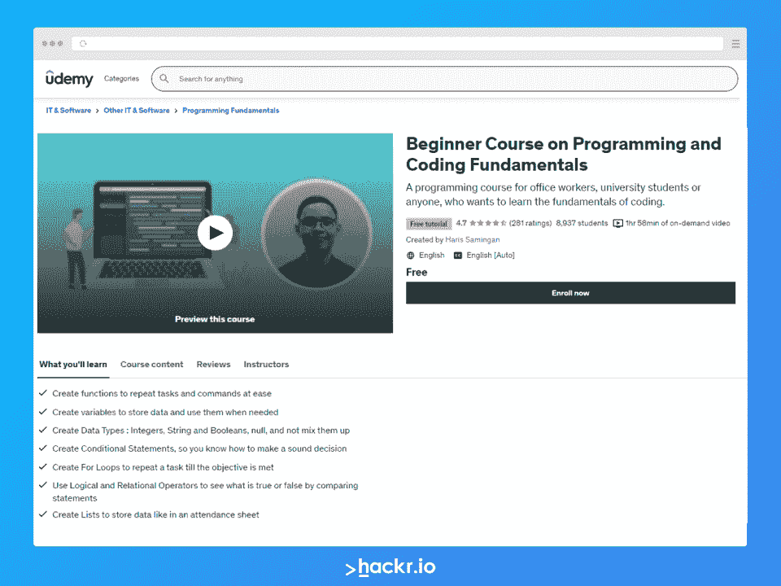
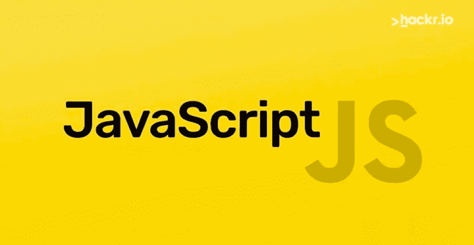
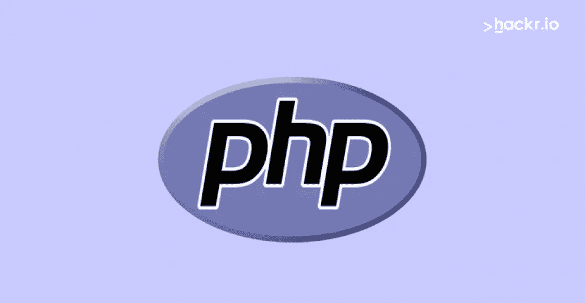
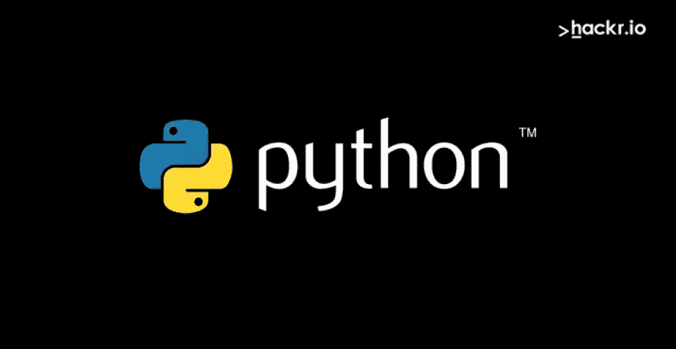
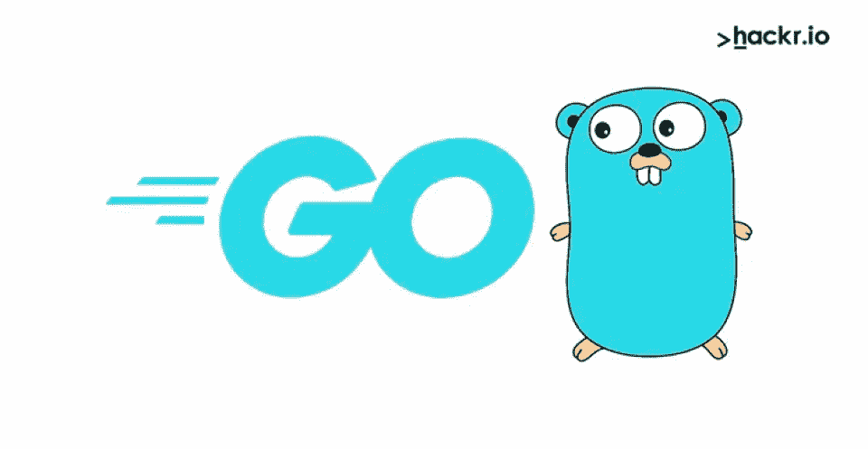
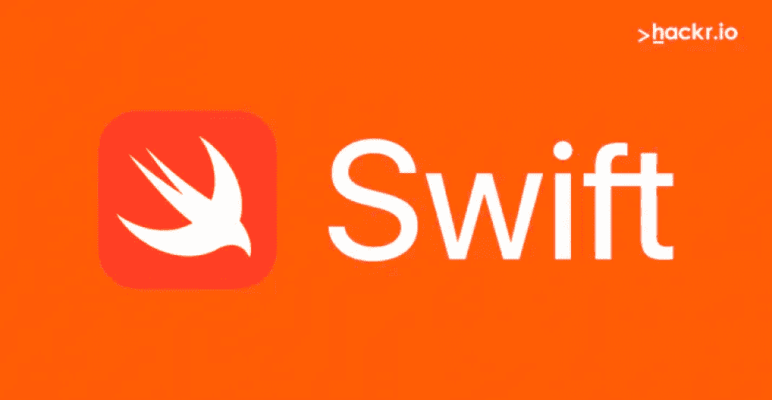
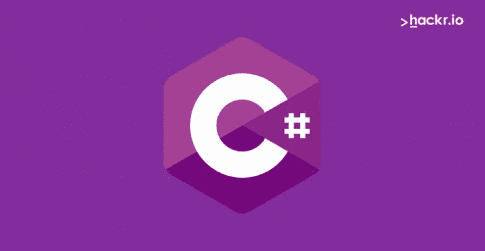
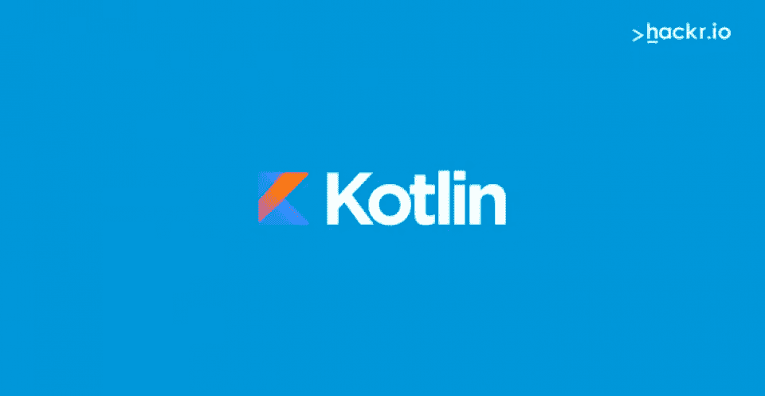
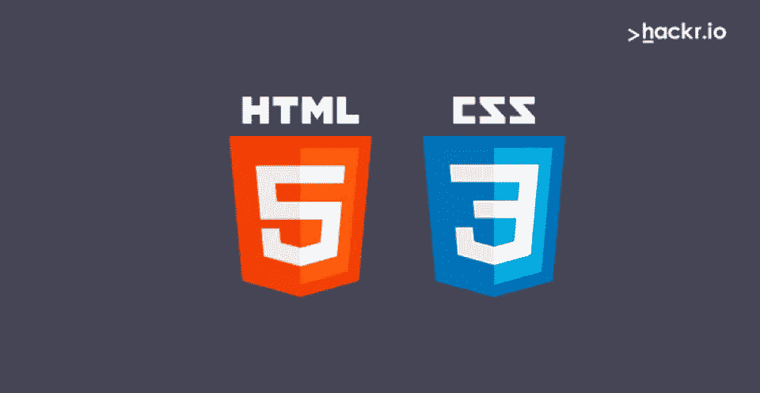
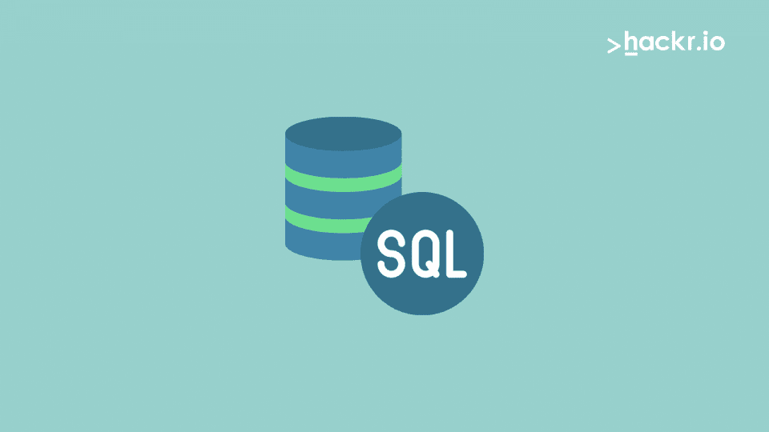

# 面向初学者的编码:2023 年学习编码的最佳方式

> 原文：<https://hackr.io/blog/coding-for-beginners>

如何为初学者编写代码是一个非常流行的问题。如果你也有同样的想法，你并不孤单。后疫情时代，许多人转向编程和软件开发，要么是为了提高自己的技能，要么是为了转行。

有大量的工作机会利用编程，因为新的和令人兴奋的职位经常出现。

在这里，我们将向您简要介绍如何为初学者编码，提供一些在线学习编码的资源，并涵盖初学者编码的基础知识。

## **为什么要学习编码？**

你可能已经听过无数次了——编程是未来的技能，几乎所有的工作都需要某种程度的编码技能。这是真的，但是好处不仅仅是应用在你的角色上。

编码是锻炼你思维的一种极好的方式，你可以用你自己构建的应用程序和脚本来改善你的职业和个人生涯。

编写程序的能力当然会在广泛的领域为你打开机会之门。如果你想转行或者提升你目前的职业轨迹，那么你在编程方面不会出错。

此外，科技行业的工资是数一数二的，所以如果你想赚更多，那么编码是一个很好的、现实的方法。

## **学习如何编码的最好方法**

所以，所有的鼓舞人心的话都说完了，我们需要把注意力放在如何学习编程的细节上。

您需要从覆盖初学者的编码基础开始——比如变量类型、函数、条件语句等等。通常，无论你选择哪门课程，无论是视频系列还是书面材料，都应该用例子来解释这一点，以便你自己实施。编程是一种最好通过实践经验来学习的技能。

再往下一点，我们解释如何选择一种特定的编程语言。这应该是你的第一步。而语言往往被用于多种方式(web 开发、机器学习和数据分析、桌面应用开发等。)，你会希望对你的程序员职业有一个大致的概念。

你想成为一名[网页开发者](https://hackr.io/blog/how-to-become-a-web-developer)吗？一个[机器学习](https://hackr.io/blog/how-to-learn-machine-learning)工程师？一个[游戏开发商](https://hackr.io/tutorials/learn-game-design)？所有这些都需要你关注不同的语言。然而，一旦选定了一门语言，你就可以选择一门特定的课程来学习程序的构建模块。

当你学习条件语句、循环、函数和对象时，你必须将它们应用到项目中。大多数课程会要求你构建一些东西，随着你掌握编程背后的思想，这些项目的复杂性会增加。

综上所述，你学习编程是基于你希望你的程序员职业是什么样的(这本身就需要努力！)，学习语言，并在进行过程中构建项目。

## **初学者编码基础知识**

初学者的编码基础首先包括了解一点语言本身。

编程语言帮助你与计算机交流，也就是说，它是一种让计算机做事情的特定语言。这种语言类似于英语，但是有特定的单词和语法(在编程术语中，这被称为“语法”)，它们明确地定义了对计算机的命令。

也有不同类型的编程语言，它们服务于不同的目的并用于不同的应用中。这些是:

*   低级语言:它们非常像二进制代码，很难学习和书写。比如[汇编](https://hackr.io/tutorials/learn-assembly-language?ref=blog-post)就是一种低级语言。 [C 和 C++](https://hackr.io/blog/difference-between-c-and-cplusplus) 是中级语言。你可以用这些语言编写操作系统、互联网浏览器、数据库系统、图像/视频/声音处理软件。
*   高级语言:它们易于编码和学习。现在流行的高级语言大多是 Java、PERL、Python 等。这些语言有各种各样的应用。

起初，你可能不需要工具来开始编码，因为许多课程提供基于浏览器的环境来运行你的代码。

然而，为了给自己的职业生涯做准备，下载一个代码编辑器是明智的。存在许多免费选项，包括 Sublime Text、Atom 和 Vim。我们为初学者推荐 [Sublime Text](https://www.sublimetext.com/) 或者 [Atom](https://atom.io/) 。

在最初的几周，您可以愉快地使用基于浏览器的环境，但您最终会希望在以后使用合适的编辑器。

## 如何决定我的第一门编程语言？

这是非常重要的一步，需要深思熟虑。你决定开始使用的语言不需要成为你余生中唯一的编程语言。

编程语言有不同的规则或语法，但它们有共同的概念。首先，根据你想专攻的领域选择一门语言。

有许多种语言，每一种都有其特定的功能和在特定应用中的突出地位。

根据 TIOBE 指数，十种最流行的编程语言是:

1.  计算机编程语言
2.  C
3.  Java 语言(一种计算机语言，尤用于创建网站)
4.  C++
5.  C#
6.  visualbasic 语言
7.  Java Script 语言
8.  汇编语言
9.  结构化查询语言
10.  服务器端编程语言（Professional Hypertext Preprocessor 的缩写）

### 推荐课程

## **初学者编码技巧**

事实上，对初学者来说，最好的编码技巧与具体可行的任务关系不大，更多的是当你陷入困境时的一般指导方针。

第一条建议是实际做一个项目。你会面临障碍，感到沮丧，但谷歌可以在解决你的问题上大有作为。这样的实例也是学习调试这一非常重要的技能的好时机。

下一个最好的建议是彻底了解基本面。很好地掌握这些概念会给你解决棘手问题所需的顿悟时刻。麻省理工学院开放式课程是基础知识的高质量来源。

如果你发现自己面临一个特别棘手的问题，试着在网上搜索其他编写过类似程序的人，看看他们是如何解决这个问题的。代码可能和你的不一样，但是逻辑和执行可能是一样的。仅仅通过阅读其他程序员的代码就可以学到很多东西。

## 学习如何编码的一步一步的简要指南

虽然这看起来令人望而生畏，但对初学者来说，编码的实际过程实际上可以总结为几个简洁的步骤:

1.  挑选一种编程语言；Python 对于初学者来说是个不错的选择。
2.  从视频、在线课程或书面材料中学习编程的基础，如面向对象编程。
3.  编写几个简单的程序，包含所有的基本概念，然后考虑从事一个更大的项目。
4.  完成更大的项目，继续做更多的项目，通过使用新的概念和想法不断挑战自己。
5.  冲洗并重复，你会惊讶于你已经走了多远。
6.  如果你感兴趣，申请实习或工作。

## **最流行的编程语言**

JavaScript 是一种高级编程语言，在网络上几乎随处可见。这是学习 HTML/CSS 标记语言后的下一步。JavaScript 使网站具有交互性，它也用于桌面和硬件应用程序中。如果你想成为一名网络开发人员，学习 JavaScript 是必须的。

[点击此处查看更多。](https://hackr.io/tutorials/learn-javascript?ref=blog-post)

### **2。超文本预处理器(** [**PHP**](https://hackr.io/tutorials/learn-php?ref=blog-post) **)**

[****](https://hackr.io/tutorials/learn-php?ref=blog-post)

PHP 是一种开源的服务器端脚本语言，用于开发 web 应用程序。它是一种广泛使用的语言，允许你向网站添加动态信息。

PHP 特别适合数据库访问，允许您高效地访问和存储相关信息。PHP 的一个特别流行的用例是电子商务网站的开发。

[点击此处查看更多。](https://hackr.io/tutorials/learn-php?ref=blog-post)

[****](https://hackr.io/tutorials/learn-python?ref=blog-post)

Python 是一种通用语言，是初学者进入编程世界的绝佳切入点。它易于阅读和理解，并且通常在语法上更加宽容。Python 几乎无处不在，包括 web 应用、数据分析、人工智能、机器学习和社交媒体应用。

[点击此处查看更多。](https://hackr.io/tutorials/learn-python?ref=blog-post)

[****](https://hackr.io/tutorials/learn-ruby?ref=blog-post)

Ruby on Rails 是一个服务器端 web 应用程序框架，它包含了根据模型-视图-控制器(MVC)架构创建数据库支持的 web 应用程序所需的一切。该框架为数据库、web 服务和网页提供了默认结构。如果您对开发 web 应用程序感兴趣，Ruby On Rails 框架可能是一个好的开始。

[点击此处查看更多。](https://hackr.io/tutorials/learn-ruby?ref=blog-post)

[****](https://hackr.io/tutorials/learn-golang?ref=blog-post)

Go 是一种开源编程语言，可以轻松构建可靠、简单、高效的高性能软件。Go 在语法上类似于 C，但是有内存安全、垃圾收集、结构化类型和更简单的并发/多线程。它用于构建基于云的和服务器端的应用程序，等等。

[点击此处查看更多。](https://hackr.io/tutorials/learn-golang?ref=blog-post)

[****](https://hackr.io/tutorials/learn-ios-swift?ref=blog-post)

这两种编程语言主要用于 macOS 和 iOS，也就是为苹果设备制作应用程序。如果你热衷于在 iOS 上开发移动应用，那么你应该学习其中的一种。

Objective C 是一种古老的语言，因此非常健壮。它来源于 C 和 Smalltalk。不过 Swift 是一门快速成长的语言，性能不错。它也易于阅读和维护，这也是为什么推荐给新的 iOS 编码人员的原因。

[点击此处查看更多。](https://hackr.io/tutorials/learn-ios-swift?ref=blog-post)

[****](https://hackr.io/tutorials/learn-c-sharp?ref=blog-post)

C-sharp 是一种通用编程语言，用于开发各种应用程序。你可以开发视频游戏和网络应用等。流行的 Unity 游戏引擎使用 C#。

[点击此处查看更多。](https://hackr.io/tutorials/learn-c-sharp?ref=blog-post)

[****](https://hackr.io/tutorials/learn-kotlin?ref=blog-post)

Java 是一种基于类的面向对象编程语言。Kotlin 是一种较新的语言，与 Java 相比有一些优势。Kotlin 更容易学习，但是它没有 Java 那么大的社区。它们都用于 Android 应用程序开发等。

[点击此处查看更多。](https://hackr.io/tutorials/learn-kotlin?ref=blog-post)

## **流行标记语言**

[****](https://hackr.io/tutorials/learn-css?ref=blog-post)

网页使用 HTML/CSS。学习这两个是成为 web 开发者的第一步。这两个都可以在几周内学会。

超文本标记语言(HTML)像你在网站上看到的图像和视频一样构造文本和内容，非常简单易学。级联样式表(CSS)与 HTML 一起用于设计网页内容的样式和格式。您可以更改元素的颜色和大小，更改网页的整个布局，并赋予网站视觉效果。

[点击此处查看更多。](https://hackr.io/tutorials/learn-css?ref=blog-post)

## **数据库语言**

[****](https://hackr.io/tutorials/learn-sql?ref=blog-post)

SQL 是一种用于在关系数据库管理系统中管理数据的语言。它主要用于与数据库通信。SQL 不难，每个程序员学了都会受益。它是占主导地位的数据库语言，应该是您首先学习的语言。

[点击此处查看更多。](https://hackr.io/tutorials/learn-sql?ref=blog-post)

## **如何免费学习编码**

编程最大的好处是你可以完全免费学习。你需要的只是意志和毅力，以及知道去哪里寻找正确信息的知识。不管你面临什么样的挑战，这都是一个靠你自己真正建立起来并坚持到底的问题。

幸运的是，有几个免费的资源供您学习编码。Hackr 是一个很好的例子，但是你也有其他几个平台。你可以在网上众多教育平台中的一个注册免费课程，比如 [Coursera](https://imp.i384100.net/AoD4WK) ，或者直接使用 YouTube。你也可以看看文档，在网上找一个编程伙伴。

你可能还想看看像 [Codewars](https://www.codewars.com/) 这样的平台，它将整个编码体验捆绑到一个类似游戏的竞赛中。该平台提供了大量测试特定技能集的编码挑战。这也是观察其他人如何处理问题的一个很好的方式。

你只是被你的想象力所限制。编码没有财务障碍，所以选择一门语言、一个项目和一门课程来学习基础知识，然后开始吧。

## **现在是编码的最佳时间**

你需要的只是学习编程的热情和时间。你会惊讶自己变得有多好，即使是在几周内。不管你选择哪种语言，坚持下去，专注于构建项目。任何人都可以成为程序员，现在是成为程序员的最佳时机。

对初学者如何学习编码感兴趣？查看 Hackr.io 的[顶级编程教程和课程介绍](https://hackr.io/tutorials/learn-intro-to-programming?ref=blog)。祝你好运，记得要坚持下去！

## **常见问题解答**

### **初学者如何开始编码？**

你首先需要了解编程语言的基础和类型以及它们的用途。有了这个理论，你就可以继续选择一门语言，并使用教程来帮助你构建一个项目。至于资源和教程，你的选择几乎是无限的——包括视频和书面材料。例如，你可以浏览我们关于如何学习编程的教程。

编程很大一部分是自主学习。谷歌将是一个很好的朋友，你解决问题所需的一切几乎都可以在网上找到。

### 我可以自学编码吗？

毫无疑问，答案是肯定的。通过视频教程和文档学习独立编码的人很多，他们中的许多人在生活中也做得很好。你不能妥协的是毅力和努力。

82 岁的若宫雅子就是最好的证明。当她第一次开始写代码时，她使用算盘进行数学计算。如今，她是世界上最老的 iPhone 应用程序开发者之一，是让老年人使用智能手机的先驱。

**人也在读:**