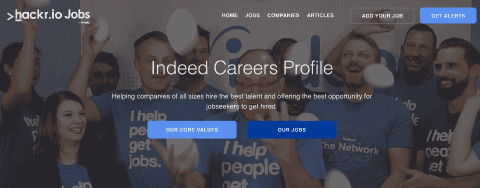

# 3 家提供职业发展优势的科技公司

> 原文：<https://hackr.io/blog/companies-offering-professional-development>

为了吸引和留住人才，科技公司之间展开了激烈的竞争。薪资之后最大的战场之一是福利待遇，在过去几年里，许多公司的福利待遇已经达到了惊人的规模。

有形的福利包括股票期权和医疗保健，而更多的“要么接受要么放弃”的福利可能是周五便装日和团队建设日等。结果是，现在有很多招聘广告，上面列有大量的福利，旨在吸引潜在的员工。

不应忽视的一个好处是职业发展和培训。当你找工作时，这应该是你的首要考虑。但是为什么呢？

职业发展很重要。保持你的技能敏锐，并不断学习新技能，对你的职业发展至关重要。聪明的专业发展公司知道，让员工参与进来也有好处，原因有二——这是明智的商业行为，也能让优秀的员工呆得更久。

## **为什么要为专业开发公司工作？**

如果你雄心勃勃，你不会想在工作中停滞不前。随着你对自己的角色越来越适应，你可能会想进一步拓展自己。这就是学习和发展机会的重要性所在。接触导师或那些能告诉你如何在工作中成长的人同样重要:对许多人来说，如果你看不到这一点，你就成不了大器。这就是为什么建议你去一家提供早期职业发展项目的公司工作，尤其是如果你是应届毕业生或者刚刚开始职业生涯。

利用培训机会对于提升技能、获得晋升以及提高薪资和福利来说至关重要。一般来说，你更有可能在有良好培训计划的更成熟的科技公司找到职业发展机会。他们将有时间成长，雇佣实施项目所需的专业人员，并开发可用的职业机会，这些机会是你可以作为个人发展计划的一部分而努力争取的。

## **为什么公司要为员工的职业发展投资？**

我们已经知道，在寻找最佳人选填补职位空缺方面，科技公司之间存在竞争。他们也明白员工想要福利，并且很可能更愿意为有很好培训项目的公司工作。

如今，有无数的公司有这样或那样的开发项目。但是，除了吸引求职者，这些企业为什么要在职业发展项目上投入这么多资金呢？让我们来看看。

1.  **提高生产力** -通过正确的培训，员工可以更快更好地工作，让公司获益。员工可以带来更多的利润，公司可以节省成本，因为员工的效率也会更高。
2.  **提高参与度** -为员工提供培训和其他福利可以帮助他们感到更受重视。
3.  鼓舞士气——当一家公司的员工感到受到重视时，他们更有可能感到每天都在竭尽全力。
4.  更好地留住员工 -影响公司员工保留率的因素有很多。然而，提供福利，包括职业发展培训，有助于给员工更多留下来的理由。
5.  **减少对员工监督的需求** -受过培训的员工更有可能知道他们在做什么，这意味着花在微观管理和监督上的时间更少。员工也很可能会享有更多自主权。
6.  更好的内部晋升机会 -拥有最佳培训计划的公司很可能培养出高技能、有能力的员工。因此，公司会有准备好从内部提拔的候选人，而员工可能会因为有可能往上爬而提高士气。
7.  **减少错误和浪费** -受过适当培训的员工不太可能犯会耗费时间、金钱和其他资源的错误。因此，通过将员工纳入培训项目，公司可以避免因小失大的陷阱。例如，向员工提供[网络开发课程](https://hackr.io/blog/best-web-development-courses)可以帮助提高技能，减少调试时间。
8.  **提高品牌声誉** -品牌甚至不需要提供最好的公司培训项目来影响公司的整体声誉。因为培训项目可以提高员工的士气，所以员工更有可能向同事推荐公司。
9.  **成果和绩效的提高** -由于专业培训的发展，投资于员工的公司可以合理地期待成果和员工绩效的提高。
10.  **改善工作文化和环境** -公司的总体工作文化和环境中包含许多因素。然而，一个为员工提供培训机会的专业发展公司可能会促进整体工作环境的改善。

## **提供职业发展的顶级科技公司**

这里有三家全球科技公司，它们都有很好的职业发展和培训机会——你还可以在[求职栏](https://jobs.hackr.io/)上找到更多的公司和职位。

## **的确**

根据您受雇的国家，确实有一系列围绕专业发展和培训的福利和特权。例如，在美国，只要您在公司工作一年，您就可以报销在认证大学和机构攻读学位项目的专业认证和课程的学费(最高不超过设定金额)。

该公司还以技术和软技能培训的形式提供内部专业和个人发展机会，以及同伴指导培训、小组培训和指导机会。它还提供管理培训，旨在为您提供管理包容性、作为教练进行管理、影响和创新以及有效领导所需的基本工具。

**[现在就在](https://jobs.hackr.io/company/indeed-2)发现空缺职位。**

## **Adobe**

正如你对世界上最大的软件公司之一的期望——Adobe 拥有 26，000 多名员工——职业发展是一件大事。“永不停止学习”是这句口头禅。根据你在全球的位置，福利可能会有所不同，但在美国，如果你想探索数据科学、发展编码技能或获得 MBA 学位，公司将为高等教育和职业发展提供现金支持。Adobe 还提供领导力发展机会，通过 LinkedIn Learning、Harvard ManageMentor 等进行培训。

**[探索 Adobe 现在的开放角色](https://jobs.hackr.io/company/adobe-1)。**

## **甲骨文**

Oracle 成立于 1977 年，是一家大型科技公司，专注于一系列产品和服务，包括数据库、中间件、应用程序和企业管理。该公司拥有超过 140，000 名员工，有多个致力于员工职业发展的项目。

Oracle Learning Paths 是针对个人职业目标定制的个性化课堂、虚拟课程、在线课程、书籍、视频和快速工作帮助列表。像许多其他科技公司一样，该公司也提供学费报销，因此你可以接受与你的职业相关的进一步教育。还可以联系内部人才顾问，他们可以帮助员工获得晋升机会，而且可以在公司全球网络的任何地方。

**[立即发现甲骨文公司的空缺职位](https://jobs.hackr.io/company/oracle-2)。**

## **3 份有职业发展福利的工作**

### **Herndon 亚马逊网络服务公司亚马逊专用云 ADC 工程师**

AWS 智能团队正在寻找一名高度积极主动的 ADC 工程师,专注于卓越运营，并对复杂的系统操作进行故障排除。您将深入寻找客户问题的根本原因，调查指标走向错误方向的原因，或者讨论自动化运营流程的全新方法。

需要三年以上的云计算技术、网络和支持程序以及生产计算环境方法的经验。导师和职业发展是 AWS 的一个关键支柱，它正在建立一个庆祝知识共享和导师的环境，根据有助于员工发展成为更全面的专业人士的内容分配项目。

****关于这个角色的全部信息可以在这里找到。****

 **### **AIML - ML 基础设施软件工程师，机器学习平台&科技，苹果，西雅图**

苹果的信息智能团队正在寻找一名[机器学习基础设施软件工程师](https://jobs.hackr.io/job/aiml-ml-infrastructure-software-engineer-machine-learning-platform-technologies-2-at-apple-2?source=article)，以构建可扩展的有效系统，为深度学习模型提供服务，包括 TensorFlow、PyTorch 和 Jax，以及在 GPU 等 ML 加速器上为深度学习模型构建和优化分布式训练方法。

苹果提供了许多好处，其中最有价值的是它的培训和发展支柱。对于与推进您在 Apple 的职业发展相关的正式教育，包括学费在内的某些费用可以报销。

要申请的话，你需要相关领域的学士、硕士或博士学位，或者同等的经验，加上强大的编码技能和强大的计算机科学背景。

[**在这里申请这个角色**](https://jobs.hackr.io/job/aiml-ml-infrastructure-software-engineer-machine-learning-platform-technologies-2-at-apple-2?source=article) **。**

### **迈阿密 Ripple 数据(流动性)高级软件工程师**

Ripple 的使命是让每个人都能随时随地进行支付。该公司正在寻找一名经验丰富的专注于数据的高级软件工程师加入一个不断发展的团队。你将成为一名创业建设者，跨各种云服务工作，混合数据工程、软件工程和机器学习部署的知识。

如果你想申请，你需要在大规模分布式系统上有长达 8 年的数据平台实践经验，加上在现代分布式计算环境(如 Kubernetes)和云环境(如 GCP 和 AWS)中构建和部署数据解决方案的经验。

Ripple 提供丰厚的薪酬和福利待遇。职业发展是一个优先事项，有一个学习环境，在那里你可以深入研究最新的技术，加上支持其他学习模式的预算。

[**在这里获取完整的工作规范**](https://jobs.hackr.io/job/senior-software-engineer-data-liquidity-2-at-ripple-2?source=article) **。**

### **Herndon 亚马逊网络服务公司亚马逊专用云 ADC 工程师**

AWS 智能团队正在寻找一名高度积极主动的 ADC 工程师,专注于卓越运营，并对复杂的系统操作进行故障排除。您将深入寻找客户问题的根本原因，调查指标走向错误方向的原因，或者讨论自动化运营流程的全新方法。

需要三年以上的云计算技术、网络和支持程序以及生产计算环境方法的经验。导师和职业发展是 AWS 的一个关键支柱，它正在建立一个庆祝知识共享和导师的环境，根据有助于员工发展成为更全面的专业人士的内容分配项目。

****关于这个角色的全部信息可以在这里找到。****

 **想要一份为你提供职业发展机会的工作？ **在 Hackr.io 求职板上开始搜索:**

**[搜索职位](https://jobs.hackr.io/)**

## **结论**

无论你是应届毕业生还是刚开始(或改变)职业生涯的人，申请重视员工的职业发展公司都是明智的决定。选择在一家提供这种培训机会的公司工作，可以为你未来的发展提供更好的机会。祝你好运！

你目前在找工作吗？考虑申请这些 [**招聘 Java 开发人员的公司**](https://hackr.io/blog/companies-hiring-java-developers-right-now) **或者这些** [**招聘 C++开发人员的公司**](https://hackr.io/blog/top-tech-companies-hiring-c-plus-plus-devs) **。******