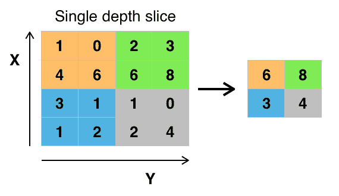

# 卷积神经网络综合指南

> 原文：<https://hackr.io/blog/convolutional-neural-network>

## **简介**

在当今的商业世界中，每个人都在通过提供世界一流的服务来相互竞争，从而获得成功。以前，竞争只是发生在物理市场中，买方和卖方在那里相互交流，但今天，即使是互联网平台也通过使用各种数据科学系统来相互竞争，卷积神经系统就是其中之一。

### **了解卷积神经网络系统**

从名字本身来看，很明显卷积神经系统是数学和生物学之间的怪异结合，这项技术的发展是计算机科学领域的最佳成就。2012 年是 Alex Krizhevsky 开发神经网络的主要一年，因为这一年他们赢得了 ImageNet 竞赛(一项基于计算机视觉的年度竞赛)，其中错误问题从 26%下降到 15%，这是当时最重要和最惊人的改进之一。

由于所有这些优势，大型商业公司和一大群组织一直在他们的管理中心和计算机科学领域利用卷积神经系统的这种深刻学习。有很多公司正在使用这种神经系统技术，如谷歌、脸书、亚马逊等等。所有这些大公司都将这些技术用于不同的目的，如自动标记、照片搜索、个性化订阅等。

### **问题**

在卷积神经网络中，图像分类是一个问题空间，它包括两个内容，第一个是输入图像，第二个是输出图像。输出图像意味着对图像进行分类，无论输入图像是否被正确标记。对于每个人来说，输入图像意味着识别他们周围看到的物体，这种识别是每个人从童年开始学习的第一项技能。

他们可以给他们周围看到的任何物体贴上标签，因为他们生活在一个他们每天都会遇到所有这些物体的环境中，正因为如此，他们知道这些物体的各种特征，通过这些特征他们可以区分各种物体，但是这种识别物体的艺术对于像计算机这样的机器来说是不可能的，因为他们从未见过这些物体的自然环境。因此，机器识别和区分物体变得非常困难。这是卷积神经系统要面对的主要问题。

### **解决方案**

当给计算机一个输入图像时，计算机的首要任务是将图像转换成像素值。基于两件事，计算机会得到一组数字，这两件事是图像的大小和分辨率。这个过程对于普通人来说毫无意义，但这个数字阵列是计算机的主要功能和工作方式，就像帮助它对图像进行分类的机器一样，比如是狗还是猫。

**建议课程**

[完整的神经网络训练营:理论、应用](https://click.linksynergy.com/deeplink?id=jU79Zysihs4&mid=39197&murl=https%3A%2F%2Fwww.udemy.com%2Fcourse%2Fthe-complete-neural-networks-bootcamp-theory-applications%2F)

### **对卷积神经系统的需求**

卷积神经系统用于图片处理，在图片准备过程中，我们将了解如何研究以及如何利用这些卷积神经网络进行图片排列。在这个过程中，我们还会进行图片分组，这是一项任务，我们收集图片的不同对象，并产生一个包括猫、声音和许多其他东西的类。或者它包括最好地描绘图片的类的可能性。对于人来说，对各种物体、场景等的识别是我们从受孕那一刻起就获得的主要能力之一，并且随着我们的成长，这是一种很容易实现的能力。不需要重新考虑，我们已经准备好迅速一致地区分地球的各个方面。

当我们看到任何一种场景的图片时，我们可以通过给每一个项目起一个名字来准确地识别和描述这个场景，甚至不需要刻意去记笔记。这些快速感知设计、总结早期信息、适应各种图像条件的能力非常强大，但这种重要的能力在像计算机这样的人造机器中并不存在，因为它们不能对周围的基本事物进行分类。当 PC 看到一张图片(将图片作为一条信息接受)时，它会看到各种像素。视目标、分辨率和图片大小而定，它将看到一个 32 x 32 x 3 的数组编号簇(3 暗示 RGB 值)。

假设我们有一张 JPG 结构的底纹图片，大小为 480×480。阵列中代表展示号将为 480 x 480 x 3。该图像的每一个单独的数字被给予从 0 到 255 的激励，这描绘了识别该图像的像素能力。当我们进行图像排列时，这些数字对我们来说毫无用处，但这些数字阵列是 PC 可访问的主要数据源，有助于机器识别图像，因此，它提供了完美的输出图像。这个想法是，你给电脑这些不同的数字，它会产生一些数字来描述图片是一个确定类别的可能性(猫科动物 0.80，猎犬 0.15，飞行生物 0.05，等等)，

## **卷积神经网络的实际应用**

既然我们认识到这个问题就像信息的来源和产量一样，我们应该考虑如何朝这个方向前进。我们需要的是，电脑能够选择在所有照片之间进行分离和识别，以便它能够给出并理解使狗成为狗或使猫成为猫的一种亮点。这是在我们大脑中进行的程序。当我们看一眼一只狗的图像时，我们只能描述它的所有元素，并且只有当图像有可识别的亮点时，例如，爪子或四条腿。

沿着这些思路，电脑可以通过搜索低层次的亮点(例如边缘和弯曲)来进行图片排列，然后通过卷积层的进展来逐步提取想法。这是一个在这种神经系统中普遍要重要得多的东西。卷积神经系统与其他流之间的联系是:当你最初知道术语卷积神经系统时，你可能会想到与神经科学或科学相关的东西，这是非常明显的，因为名称本身包括单词 neural，所以你与科学建立关系是正确的。卷积神经网络确实从视觉皮层获得了自然动机。

视觉皮层有很小的细胞区域，这些区域对视野的明确位置很敏感。这种想法是由 Hubel 和 Wiesel 在 1962 年进行的一项有趣的分析(视频)发展而来的，他们证明了大脑中的一些单个神经元细胞在看到特定方向的边缘时就会做出反应(或终止)。例如，一些神经元在垂直边缘出现时终止，一些在水平或倾斜边缘出现时终止。Hubel 和 Wiesel 发现，这些神经元以柱状设计排列，它们一起可以选择提供视觉识别。

这种在具有明确任务(视觉皮层中的神经元细胞寻找明确的质量)的框架内特定片段的思想也是机器使用的思想，并且是卷积神经网络背后的前提。

### **卷积神经网络的结构**

从上述信息可以清楚地看出，不同图像的识别对于机器来说是一个非常复杂的过程，其中 CNN 利用输入图像，并使该图像通过各种卷积、非线性、汇集和完全连接的层，最后在对图像进行分类后，我们得到输出，该输出可以是对图像进行最佳分类和描述的单一类别或类别概率。在鉴定的过程中有很多不同的层次。第一个是数学部分，第二个是高级视角，最后一个是全连接层。所有这样的层在由像计算机这样的机器对图像进行分类的过程中起着重要的作用。

### 优点

当公司使用这种数据科学技术时，他们会获得很多好处，例如:

1。卷积神经网络可以很容易地捕捉任何类型的图像，它也有助于公司揭示输入图像的主要特征。由于这种卷积神经网络，类似计算机的机器可以毫无问题地轻松识别任何类型的图像。

2。卷积神经网络还提供了权重共享的好处，这意味着它在处理大量数据时更有效，并且它有数十亿个神经元可以处理任何复杂性。

3。它在性能上非常准确，并且在识别输入图像是狗还是猫的工作中非常迅速。

4。它具有非常高的统计和计算效率。

### **缺点**

1。卷积 神经系统理解和学习起来非常复杂，因为该系统的工作包括许多与卷积层相关的层。

2。存在用于识别各种输入图像的层，并且这个过程也是耗时的。

# **总结**

对象检测、识别和分类由深度神经架构驱动。这些架构在诸如激活函数、滤波器、层数和处理速度等参数方面互不相同。在本文中，我们详细了解了帮助计算机处理图像输入并帮助其识别的卷积神经网络的各个层。在这里，我们还讨论了卷积神经系统为其用户提供的各种优势。

**人也在读:**